# 情感操作系统：泛二次元、泛游戏与明星工业的填补-占领机制及其反馈循环研究

## ——基于社会社交定律的文化殖民动力学分析

### 摘 要

本研究基于社会社交定律的理论框架，对泛二次元、泛游戏与明星娱乐工业三大文化领域进行系统性分析，揭示三者并非独立的“亚文化圈层”，而是同一台“情感-共鸣语法（A型语法）殖民机器”的三个协同输出端口。研究指出：社会原子化制造的“归属饥渴”与社会达尔文主义高压制造的“淘汰恐惧”共同构成了五重结构性空缺（情感、归属、意义、未来、尊严），为A型语法的植入提供了“需求侧接口”。三大文化工业作为舶来品，携带完整的日式/韩式情感操作系统（羁绊美学、伪家庭、小团体主义、世界系叙事、根性論、量化身份等），通过“精确填补→语法安装→下沉锁定→成瘾绑定”的四阶段程序，在8-18岁人格形成关键期完成对外来操作系统的全面植入。植入完成后，社会社交定律自动启动，将B型（逻辑-理性）语法携带者标记为“乱码”，通过消解性话语、压迫性正当化循环、清除执行终端等机制完成系统性排挤与格式化。研究进一步揭示：该过程构成一个指数级自我强化的反馈循环——每一次清除都使被清除者更加原子化、更加内化社达叙事，并在进入下一个封闭系统时成为“更充足的燃料”，使下一轮排挤以更高烈度、更快速度运转。本研究论证了该反馈循环的动力学模型，并指出其终局为B型语法的不可逆萎缩与认知单极化。

**关键词**：情感操作系统；填补-占领机制；社会社交定律；A型语法殖民；反馈循环；舶来品文化；认知单极化

## 一、绪论

### 1.1 问题的提出

2026年，中国泛二次元用户规模突破5亿，游戏产业收入超过3000亿元，偶像娱乐产业全球市场规模逾100亿美元。在主流叙事中，这三个数字被分别表述为“文化产业繁荣”“数字经济引擎”“青年文化活力”的证明。然而，这三个数字背后隐藏着一个更深层的结构性问题：

> **为什么这三者几乎同时扩张、同步渗透、共享同一套情感逻辑？为什么它们都以“情感-共鸣”为核心操作方式？为什么它们都系统性地排斥“逻辑-理性”的表达方式？为什么这种排斥在8-18岁的青少年群体中最为剧烈、最为普遍、最为不可逆？**

本研究认为，这三个问题指向同一个答案：**泛二次元、泛游戏、明星娱乐工业不是三个独立的“文化领域”——它们是同一台“A型语法殖民机器”的三个输出端口。** 它们共享同一套底层引擎（情感-共鸣语法），使用同一条生产线（文化工业复合体），执行同一套程序（社会社交定律），只是在三个不同的内容领域输出同样的产品：情感语法的全面垄断，以及理性语法的系统性清除。

### 1.2 理论基础

本研究整合以下理论资源：

**社会社交定律**（本研究提出）：在由两种或以上底层语法构成的封闭社交场域中，占据统计学多数的语法星系将自动完成“统计学锁定→异类标记→消解性话语→压迫性正当化循环→清除执行→格式化完成”的全程序列，并构成自我强化的反馈闭环。

**社会原子化理论**（涂尔干，1897；鲍曼，2000）：传统社会纽带的瓦解使个体陷入“共同体真空”，产生强烈的归属饥渴与情感安全需求。

**社会达尔文主义批判**（霍夫施塔特，1944）：制度化的优胜劣汰逻辑制造了普遍的淘汰恐惧，使“被排挤”被潜意识等同为“被淘汰”。

**语法不兼容理论**（Langacker, 1987；Lakoff, 1987）：个体在认知-表达层面存在底层架构的结构性差异，A型（情感-共鸣）与B型（逻辑-理性）两种语法无法原生互译。

**文化工业批判**（阿多诺与霍克海默，1944）：文化产品的标准化、商品化与意识形态功能，揭示了资本如何通过文化消费实施精神控制。

**后殖民理论**（法农，1952；葛兰西，1929-1935）：文化霸权的内化机制与“精神殖民”的概念，解释了舶来品语法为何能够在被输入群体中实现“真诚的内化”。

### 1.3 核心概念界定

| 概念 | 定义 |
|:---|:---|
| **A型语法** | 情感-共鸣型底层认知-表达架构。认知路径为“感受→共鸣→归属”，有效性标准为“有共鸣吗？”“氛围对吗？” |
| **B型语法** | 逻辑-理性型底层认知-表达架构。认知路径为“观察→推导→验证”，有效性标准为“有证据吗？”“逻辑通吗？” |
| **情感操作系统** | 由舶来品文化（日式二次元、韩式偶像工业、美日游戏机制）携带的整套情感反应模板、社交行为模板、价值判断模板与意义生成模板的集合 |
| **五重结构性空缺** | 社会原子化与社达高压共同制造的情感、归属、意义、未来、尊严五个维度的系统性匮乏 |
| **填补-占领机制** | 文化工业复合体通过精确对接五重空缺完成用户接入（填补），继而通过统计学锁定完成语法主导（占领）的两阶段程序 |
| **下沉安装** | 舶来品语法在8-18岁人格形成关键期完成不可逆内化的过程 |
| **成瘾锁定** | 通过行为、投资、社交、情感、意义、身份六条锁链同时锁住用户的绑定机制 |
| **反馈循环** | 被清除的B型语法者因清除而更加原子化、更内化社达叙事，在进入下一系统时成为“更充足燃料”，使下一轮排挤以更高烈度运转的指数级自我强化过程 |
| **认知单极化** | B型语法作为一种认知方式从文化记忆中不可逆消失的终局状态 |

## 二、结构性前提：五重空缺的制造与接口性

### 2.1 社会原子化：归属饥渴的制造

社会原子化是指传统社会纽带（家族、邻里、单位、乡土）瓦解后，个体陷入缺乏集体归属与情感支持的孤立状态。在中国语境下，这一进程由四股历史合力共同推动：

**（1）城市化与人口大流动。** 2023年中国流动人口规模达3.76亿，超过四分之一的人口处于“脱嵌”于原生社会网络的状态。个体的社会支持网络从多层次（家族、邻里、单位）收缩为单层次（同事、少数朋友）。

**（2）单位制的解体。** 计划经济时代的“单位”包办住房、医疗、教育、养老等功能，20世纪90年代市场化改革后功能大幅萎缩，个体被推向市场独自面对生存风险。

**（3）家庭结构的巨变。** 独生子女政策（1979-2015）塑造了“4-2-1”家庭结构，年轻一代承受巨大赡养压力的同时缺乏兄弟姐妹的横向情感支持。

**（4）数字化的深度渗透。** 线上社交成为情感互动的主要渠道，但数字连接的本质是“弱连接”，无法提供真正的情感支持、安全感和归属感。

社会原子化的直接后果是产生了一个庞大的、未被满足的“共同体需求”——即“归属饥渴”。个体对任何一个封闭系统的身份认同产生过度依赖。如果A群体排挤个体，个体没有B群体可以退——因为所有的传统退路已经瓦解。被排挤不再只是“社交上的不愉快”，而是“失去唯一归属”的生存级威胁。

### 2.2 社达高压：淘汰恐惧的制造

社会达尔文主义将“优胜劣汰、适者生存”的生物进化逻辑应用于人类社会秩序的解释与辩护。在中国，社达虽未被正式确认为意识形态，但其压力以极为具体的方式渗透到社会生活的各个层面：

| 领域 | 社达高压的具体表现 | 对个体的心理影响 |
|:---|:---|:---|
| 教育 | 中考分流、高考排名、“985”录取率仅1.5% | 反复体验“被淘汰”；低自尊的普遍化 |
| 职场 | 996、35岁危机、绩效排名、末位淘汰 | 持续被评估的焦虑；“有用性”随时可能被否定 |
| 社会保障 | 医疗/教育/住房压力个体化；安全网薄弱 | 风险完全自担；“一旦跌落无法翻身”的恐惧 |
| 话语体系 | “奋斗”“狼性”“优化”成为主流 | 情感表达被污名化；心理痛苦被归因为“不够努力” |

社达高压在个体潜意识中建立了一个致命的等式：**被排挤→被孤立→证明“我不够好/我不配”→在社达逻辑中=“我应该被淘汰”→生存级恐惧被激活。** 这使得封闭系统中的排挤从“社交排斥”升级为“生存清除”。

### 2.3 五重结构性空缺的形成

社会原子化与社达高压叠加，制造了五重结构性空缺：

| 空缺维度 | 定义 | 具体表现 | 数据佐证 |
|:---|:---|:---|:---|
| **情感空缺** | 真实情感连接被切断后的孤独状态 | 原子化社会导致的情感孤立 | 城市居民“经常感到孤独”比例超过40% |
| **归属空缺** | 传统与现代归属单元双重瓦解后的无根状态 | 宗族瓦解、单位解体、邻里消失 | 流动人口3.76亿，“空巢青年”超过5800万 |
| **意义空缺** | “为什么而活”被“怎么活下来”取代的意义真空 | 人被异化为“劳动力”“资源” | 18-35岁青年“感到生活没有意义”比例超过35% |
| **未来空缺** | 代际传承图景成为奢望后的未来真空 | 购房无望、婚育无望、养老无望 | 总和生育率1.09，初婚年龄接近30岁 |
| **尊严空缺** | “你不干有的是人干”逻辑下的尊严否定 | 劳动者被系统性地否定尊严 | 一线城市劳动者“感到不被尊重”比例超过45% |

### 2.4 空缺的接口性与指向性

五重空缺不仅是“需要被填补的空白”，更是具有明确“指向性”和“接口性”的结构：

**指向性**：五重空缺构成了一套筛选机制——只有能够同时触达情感、意义、归属、未来、尊严五个维度的文化产品，才能获得高强度、高粘度的用户投入。单一维度的产品（如仅提供知识的信息产品、仅提供娱乐的消遣产品）无法形成结构性锁定。

**接口性**：泛二次元、泛游戏、明星娱乐工业的产品设计是对五重空缺的“精确制导”——每一个设计决策（角色的萌点、剧情的走向、消费的机制、社群的运营）都可以在五重空缺中找到对应坐标。一旦“接入”完成，用户就从一个“需要被填补的人”变成了“系统的一部分”。

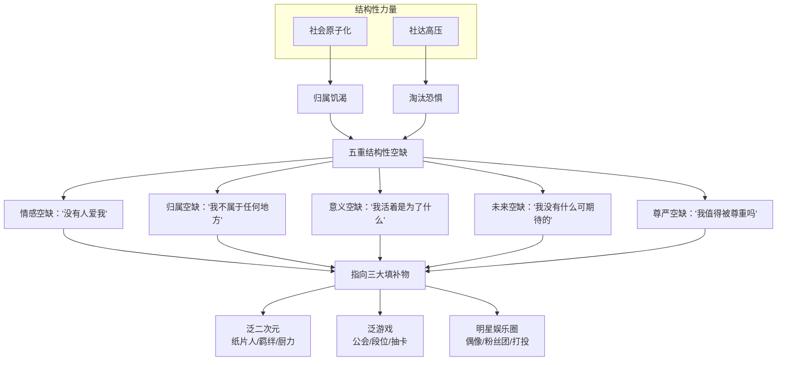

## 三、填补机制：三大文化工业的精确对接

### 3.1 三者的结构同一性

泛二次元、泛游戏、明星娱乐工业在结构上共享以下特征：

| 结构特征 | 泛二次元 | 泛游戏 | 明星娱乐圈 |
|:---|:---|:---|:---|
| **底层语法** | 情感-共鸣（羁绊、萌、燃、厨力） | 情感-共鸣（沉浸、成就、归属、抽卡快感） | 情感-共鸣（崇拜、守护、应援、打投） |
| **认知路径** | “感受→共鸣→归属” | “操作→获得→被认可” | “爱他→为他付出→我是他的一部分” |
| **社群形态** | 圈层、同好会、二创社群 | 公会、战队、攻略组、速通圈 | 粉丝团、后援会、数据组、站子 |
| **身份来源** | “我是XX厨”“我是二次元” | “我是XX玩家”“我是XX服第一” | “我是XX的粉丝”“我是XX家的人” |
| **核心操作** | 厨力展示、同人创作、圈层黑话 | 上分、抽卡、公会活动、限定收集 | 打投、应援、控评、冲销量 |

### 3.2 三者对五重空缺的精确对接

| 空缺维度 | 泛二次元的填补 | 泛游戏的填补 | 明星娱乐圈的填补 |
|:---|:---|:---|:---|
| **情感空缺** | 纸片人“无条件爱你”；羁绊叙事 | 角色“陪伴”；公会“兄弟情” | 偶像“你是我的光”；“被看见”的幻觉 |
| **归属空缺** | “二次元是我家”；圈层归属 | “我们公会”；服务器社区 | “XX粉丝团是一家人” |
| **意义空缺** | “为爱发电”；厨力即意义 | “上分即证明”；成就即意义 | “守护哥哥”即意义 |
| **未来空缺** | “追番”的持续期待；“等回归” | “养角色”的成长期待；新版本 | “等专辑/等演唱会”的期待 |
| **尊严空缺** | “核心粉”身份；“二创大佬” | “高玩”身份；“全服排名” | “数据女工”身份；“被偶像记住” |

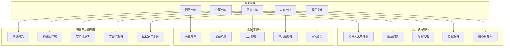

### 3.3 舶来品语法的操作系统本质

三者均为舶来品——它们不是“中性的内容”，而是**携带特定外来操作系统的文化容器**：

| 舶来品语法 | 来源 | 核心功能 | 替换的本土对应物 |
|:---|:---|:---|:---|
| **羁绊美学** | 日式ACG | 将情感限定在小团体内部 | 推己及人——情感从私到公逐层推扩 |
| **伪家庭** | 日式ACG | 提供无血缘的“拟似家族” | 家国同构——血缘/地缘/国缘一体化 |
| **小团体主义** | 日式ACG | 圈地自萌，拒绝外部连接 | 集体主义——从家到国的连续性 |
| **世界系叙事** | 日式ACG | 悬置社会结构，聚焦个人情感 | 天下观——个体命运嵌入历史框架 |
| **根性論** | 日式ACG | 信念决定一切，替代理性规划 | 知行合一——认知与行动的统一 |
| **病娇/傲娇** | 日式ACG | 极端化非理性情感表达 | 中庸——情感的适度与平衡 |
| **量化身份** | 日式/韩式工业 | “你是谁”由消费/投入程度定义 | 人的完整性——多元身份的综合 |
| **情感劳动工业化** | 韩式K-pop | 将“爱”量化为可计量的劳动 | 情感的真实性与自发性 |

**关键认识**：用户购买的不仅是“内容”——他们购买的是**装载在内容中的整套情感操作系统**。每一个纸片人、每一次抽卡、每一次打投，都在安装舶来品语法的某个模块。当所有模块安装完成时，用户已经在一个外来操作系统中思考、感受、判断——而这一事实对他们自己而言是不可见的。

## 四、占领机制：语法锁定的自动完成

### 4.1 统计学锁定的自动性

当填补完成后，A型语法（情感-共鸣）的用户在封闭系统中占据统计学多数。多数不需要“争夺”合法性——**它自动成为默认标准**。

| 问题 | 由谁定义 | 定义方式 |
|:---|:---|:---|
| 什么是正常的交流方式？ | A型语法（自动） | “有共鸣吗？”“氛围对吗？”成为唯一标准 |
| 什么是合理的提问？ | A型语法（自动） | 逻辑-理性提问被标记为“太较真”“太冷漠” |
| 什么是应该被排斥的行为？ | A型语法（自动） | 不符合情感-共鸣的行为被标记为“异类” |
| 什么是值得追求的？ | A型语法（自动） | “爱得够不够深”成为唯一的价值尺度 |

**关键命题**：A型语法不需要“争夺”合法性——合法性在统计学锁定完成时已经被“锁定”为A型的默认属性。

### 4.2 社会社交定律的自动运转

A型语法成为多数后，社会社交定律自动启动。这一程序不需要任何人的“策划”或“恶意”：

| 步骤 | 机制 | 在三者系统中的具体表现 |
|:---|:---|:---|
| **步骤一：异类标记** | B型语法被降级为“需要自证清白的乱码” | 理性讨论者被标记为“你太较真了”“你不够爱”“你不够粉”“你不够强” |
| **步骤二：消解性话语启动** | 不攻击“发言内容”，攻击“说话行为本身” | “你冷漠像AI”“你根本不懂XX”“你是假粉吧”“菜是原罪” |
| **步骤三：压迫性正当化循环** | 双重锁定：做什么都错+越努力越糟 | B型越解释→越被当作“杠精”；越沉默→越被当作“有问题” |
| **步骤四：双重死路供给** | 投降或铁幕，两条都是结构性死路 | 投降→被骂“装”；铁幕→被骂“看不起我们” |
| **步骤五：清除执行终端生成** | 系统自动授权“清道夫” | 校霸、毒唯、高玩、核心粉、数据警察——被系统授权执行清除 |
| **步骤六：格式化完成** | B型被清除出系统 | 被踢出群、被开除粉籍、被社交死亡、被永久边缘化 |

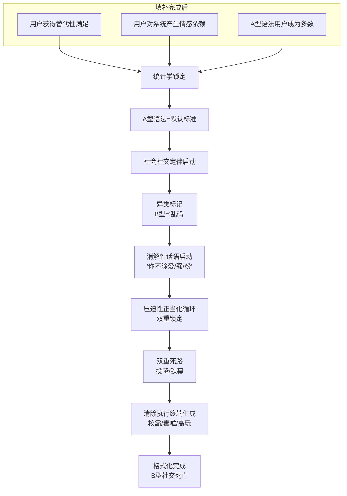

### 4.3 三者的具体占领方式

| 载体 | A型语法的具体内容 | B型语法者被标记为 | 消解性话语的类型 | 清除执行方式 |
|:---|:---|:---|:---|:---|
| **泛二次元** | 厨力、羁绊、圈层归属 | “较真”“冷漠”“不懂二次元” | “你太理性了”“你没有爱” | 圈层排斥→被驱逐→开除“二籍” |
| **泛游戏** | 段位、公会、抽卡文化 | “菜”“云玩家”“不够投入” | “你连这都不会”“纸上谈兵” | 技术鄙视链→公会孤立→被边缘化 |
| **明星娱乐圈** | 应援、打投、粉籍身份 | “路人”“假粉”“黑子” | “你根本不配粉他”“你是对家派来的” | 粉籍鉴定→粉丝团排斥→网暴开除 |

## 五、下沉机制：人格形成期的不可逆安装

### 5.1 下沉的三条路径

| 渗透路径 | 机制 | 最低接触年龄 | 关键节点 |
|:---|:---|:---|:---|
| **商业渗透** | 手游免费下载、短视频算法推送、社交平台圈层 | **8岁** | 接触即安装——无需“选择” |
| **同辈渗透** | “你连XX都不知道？”——社交准入的唯一标准 | **10岁** | 不接触=被社交排斥 |
| **结构性渗透** | 时间占有（放学后→手机）、空间替代（线上社交→唯一社交） | **6-18岁持续** | 无空白期——没有“逃离”的空间 |

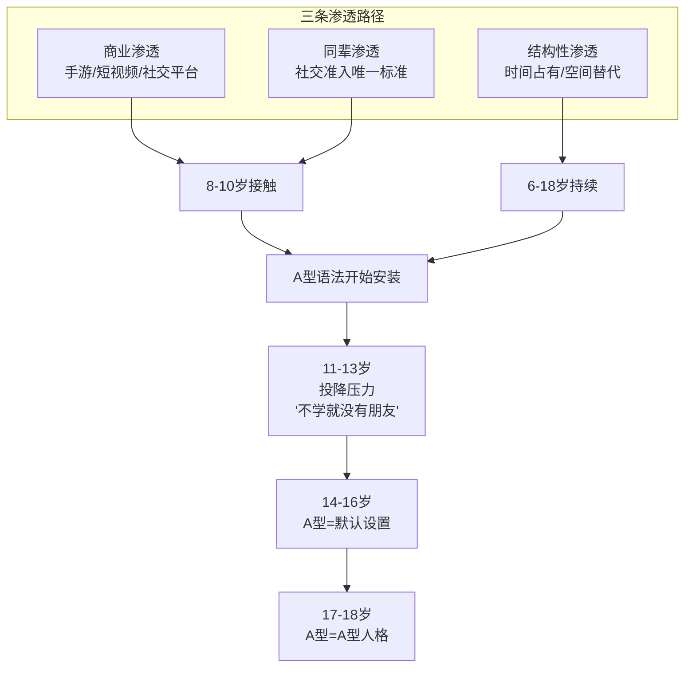

### 5.2 下沉的四阶段模型

| 年龄段 | A型语法安装状态 | B型语法命运 | 关键机制 |
|:---|:---|:---|:---|
| **8-10岁** | A型语法开始安装（手游、短视频、动画） | B型语法生长空间被压缩 | 关键窗口期开启——人格形成期第一次接触即“写入” |
| **11-13岁** | 同辈压力迫使“投降”——为了合群而接触填补物 | B型语法被主动放弃 | “不学这个就没有朋友”——社交生存压力 |
| **14-16岁** | A型语法成为默认设置 | B型语法被视为“错误”而非“另一种” | “正常”的标准已经被A型语法完全定义 |
| **17-18岁** | A型语法=A型人格 | B型语法几乎不可能被重建 | 人格基本定型——外来操作系统已成为“母语” |

### 5.3 下沉的“认知灭绝”效应

下沉的核心后果是**B型语法的“不可逆萎缩”**：

| 阶段 | B型语法状态 | 萎缩表现 |
|:---|:---|:---|
| **现在** | B型语法仍然存在——但在快速萎缩 | 越来越少的孩子知道“还有另一种思考方式” |
| **未来10年** | B型语法成为“濒危物种” | 大多数人无法理解“逻辑-理性”的认知路径 |
| **未来20年** | B型语法几乎绝迹 | “逻辑-理性”被等同于“冷漠/AI/不正常” |
| **未来30年** | A型语法成为“唯一的人性” | B型语法作为一个认知类别，从文化记忆中消失 |

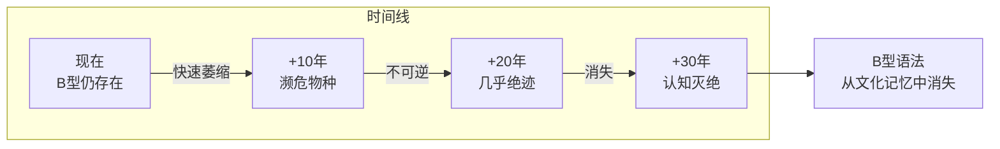

**关键认识**：下沉使A型语法的安装窗口期前移到8-10岁。过去，一个人在14岁之前还有可能形成B型语法；现在，10岁之前A型语法已经锁定了。这意味着**原生B**（天生携带或早期形成B型语法倾向的人）不仅要在A型语法已经锁定的系统中生存——他们还要在一个“比过去更早锁定、更彻底锁定”的系统中生存。排挤不是“同样的事发生得更早”——排挤是“同样的事发生得更猛，因为系统已经运转得更熟练”。

## 六、成瘾锁定：从“喜欢”到“人格依赖”的升级

### 6.1 六条锁链的同时锁定

成瘾机制是填补-占领程序的**升级模块**——它将用户从“喜欢”升级为“需要”，从“参与”升级为“依赖”：

| 锁链 | 机制 | 在三者中的执行 | 解锁难度 |
|:---|:---|:---|:---|
| **行为锁定** | 可变比率强化（斯金纳箱） | 抽卡：“再抽一次就可能出了” | 中（需打破行为循环） |
| **投资锁定** | 沉没成本效应 | “我已经投入了三年/三千块” | 高（需接受损失） |
| **社交锁定** | 归属驱动 | “公会/粉丝团需要我” | 极高（需放弃社交归属） |
| **情感锁定** | 羁绊绑定 | “角色/偶像需要我保护” | 极高（需切断情感连接） |
| **意义锁定** | 意义生成 | “为爱发电是我的意义” | 不可逆（需重构人生意义） |
| **身份锁定** | 身份定义 | “我就是XX厨/XX玩家” | 不可逆（需重建自我认同） |

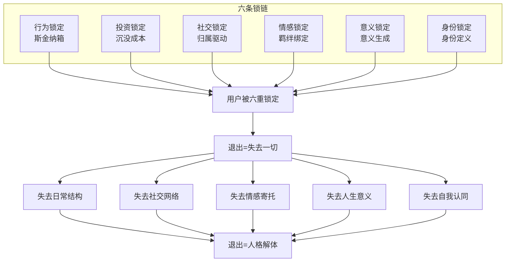

### 6.2 成瘾如何强化占领

| 维度 | 无成瘾的占领 | 有成瘾的占领 |
|:---|:---|:---|
| **锁定强度** | 文化偏好层面的偏向 | **行为+投资+社交+情感+意义+身份六重锁定** |
| **退出成本** | 可能被社群排斥 | **失去六重支撑——相当于“人格解体”** |
| **退出=失去什么** | 失去一个兴趣 | **失去日常结构+社交网络+情感寄托+人生意义+自我认同** |
| **B型识别** | “不合群” | **“没被锁住的人=不正常的”** |
| **排挤烈度** | 中等 | **“没被锁住的人威胁到了锁住的人的自我合理性”** |
| **清除动力** | 维持圈层纯粹性 | **清除B型=确认“锁住是对的”——自我合法化机制** |

**关键认识**：六条锁链同时锁住，使退出不再是“放弃一个爱好”——而是“拆解自我”。当一个人退出时，他同时失去行为习惯（日常崩溃）、社交网络（孤立）、情感寄托（空虚）、人生意义（虚无）和自我认同（身份瓦解）。这种“人格解体”式的退出成本，使绝大多数人宁愿留在系统中继续承受剥削——这正是成瘾锁定作为占领强化机制的核心功能。

## 七、反馈循环：指数级自我强化的动力学

### 7.1 反馈循环的结构

反馈循环是社会社交定律最核心的动力机制——它将排挤从“一次性事件”升级为“指数级自我强化的死亡螺旋”：

| 轮次 | 输入状态 | 排挤机制 | 输出状态 | 强度变化 |
|:---|:---|:---|:---|:---|
| **第1轮** | 初始原子化+初始社达 | 系统排挤B型 | B型更原子化+更内化社达 | 基准强度 |
| **第2轮** | B型更敏感+更铁幕 | 系统更快标记+更猛排挤 | B型更创伤+更绝望 | **1.5倍** |
| **第3轮** | B型更防御+更孤立 | 系统更熟练+更彻底清除 | B型更不可逆损伤 | **2.3倍** |
| **第n轮** | 极端原子化+极端社达 | 系统瞬间锁定+爆炸清除 | B型认知灭绝 | **指数增长** |

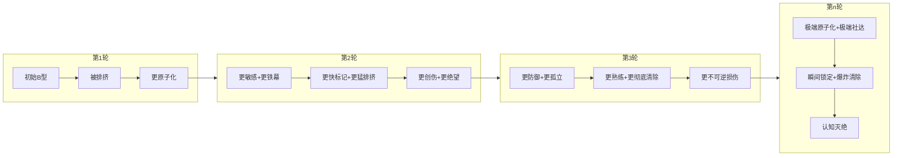

### 7.2 三大加速器

反馈循环的“加剧”通过三大加速器实现：

#### 加速器一：创伤的“社交传染”

| 传染路径 | 具体机制 | 对B型群体的影响 |
|:---|:---|:---|
| 被清除者→更铁幕 | 被排挤后学会“不说话”“不暴露自己” | 下一个系统更快标记为“异常” |
| 被清除者→更敏感 | 创伤使B型对社交信号过度警觉 | 将中性信号解码为“威胁”→加速防御反应 |
| 被清除者→更不相信 | “每一次信任都换来背叛” | 拒绝建立信任→更孤立→更快被标记 |
| 被清除者→更绝望 | “无论我去哪里都一样” | 放弃融入努力→更快铁幕→更早触发清除 |

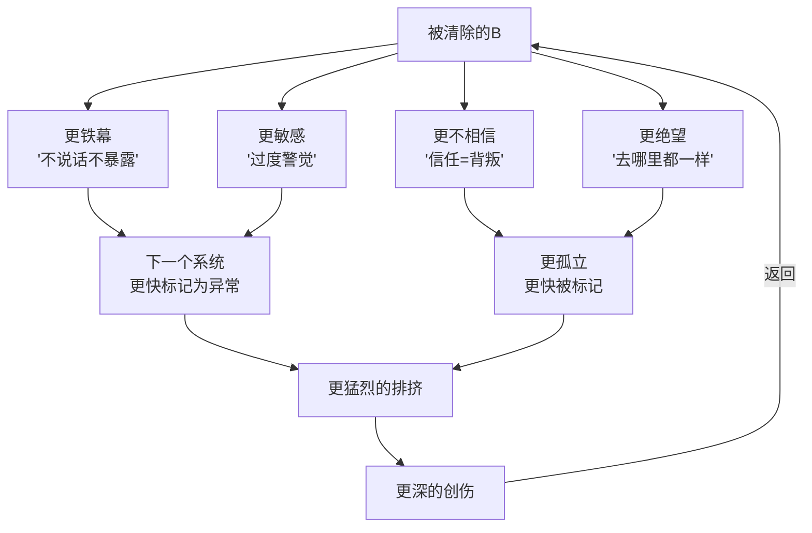

**关键认识**：创伤不是“个人的心理问题”——它是“B型群体内部的加速器”。每一次排挤都让幸存下来的B变得更敏感、更防御、更铁幕。而更敏感、更防御、更铁幕的B，在下一个系统中会被更早、更猛烈地排挤。这使B型群体作为一个类别，在系统面前越来越显眼、越来越容易被识别、越来越容易被清除。

#### 加速器二：系统的“排挤熟练度”

| 熟练度提升 | 具体机制 | 对B型群体的影响 |
|:---|:---|:---|
| 锁定速度加快 | 系统已经“知道”B型长什么样 | 从“数周识别”到“数天识别”到“瞬间识别” |
| 消解性话语升级 | 系统已经“熟练”如何击溃B型 | 从“你太较真”到“你根本不是我们这里的”到“你不配存在” |
| 执行终端更熟练 | 校霸/排挤主力已经“训练有素” | 排挤从“即兴表演”升级为“高度熟练的程序化清除流程” |
| 旁观者更沉默 | 沉默螺旋已经“锁定” | “支持B型=自己成为B型”已成众所周知的定律 |
| 外部确认者更坚定 | 社会已“习惯”这套叙事 | “你要反思自己”不再是个别现象，而是系统标准答案 |

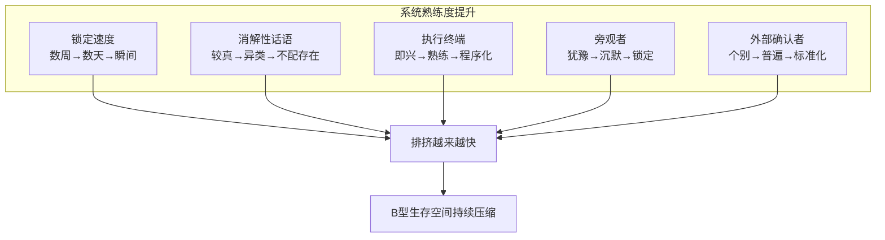

**关键认识**：系统在反馈循环中“学习”——学习如何更快识别B型、如何更有效地打击B型、如何更彻底地清除B型。每一次排挤都是一次“练习”，使下一次排挤更精准、更猛烈、更不可抗拒。

#### 加速器三：结构性前提的持续加深

| 结构性变量 | 每一轮的变化 | 对B型的影响 |
|:---|:---|:---|
| 原子化程度 | 被清除者失去归属→更原子化→社会整体原子化程度上升 | B型进入系统时更孤立无援——没有退路、没有备选归属、没有“逃”的空间 |
| 社达内化程度 | 被清除者内化“我不配”→更多人相信“弱者活该”→社达成为“常识” | B型被排挤时不仅被排挤，还被“合法化”地排挤 |
| A型语法下沉深度 | 每一轮都在更低的年龄段完成安装 | B型在更早的年龄被识别、被标记、被清除 |
| B型生存空间 | 每一轮都在缩小 | B型几乎找不到“安全区”——所有系统都已是A型主导 |

### 7.3 反馈循环的动力学模型

设第n轮循环中的关键变量为：

| 变量 | 含义 | 递推关系 |
|:---|:---|:---|
| $S_n$ | 系统排挤速度（从标记到清除的时间倒数） | $S_{n+1} = S_n \times (1 + \alpha)$，$\alpha > 0$ |
| $I_n$ | 排挤强度（消解性话语和暴力行为的烈度） | $I_{n+1} = I_n \times (1 + \beta)$，$\beta > 0$ |
| $T_n$ | 创伤深度（对个体造成的心理损伤程度） | $T_{n+1} = T_n \times (1 + \gamma)$，$\gamma > 0$ |
| $A_n$ | 原子化程度（社会整体的归属匮乏程度） | $A_{n+1} = A_n + \delta_n$，$\delta_n$持续递增 |
| $D_n$ | 社达内化程度（社会整体的淘汰恐惧程度） | $D_{n+1} = D_n + \varepsilon_n$，$\varepsilon_n$持续递增 |

其中 $\alpha$、$\beta$、$\gamma$、$\delta_n$、$\varepsilon_n$ 均为正数，且因反馈循环的自我强化特性，$\delta_n$ 与 $\varepsilon_n$ 随 n 递增。

**关键推论**：反馈循环是一个**指数级加速系统**——速度越来越快、烈度越来越高、创伤越来越深、结构性前提越来越极端。这不是“循环”——这是“自毁加速器”。

### 7.4 反馈循环的终局

| 终局场景 | 描述 | 触发条件 |
|:---|:---|:---|
| **永恒锁定** | A型语法完全垄断——排挤不再需要，因为没有B型存在了 | 反馈循环持续足够多轮，B型语法作为一种认知方式灭绝 |
| **系统崩溃** | B型累积的创伤和愤怒到达临界点——爆发式反抗 | B型群体在某一临界点找到组织和表达方式 |
| **认知灭绝** | B型语法从文化记忆中消失 | 失去“B型语法”的跨代传递机制——父母不会，孩子学不到 |

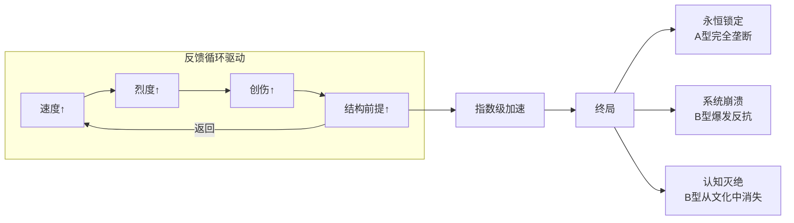

## 八、整合模型：填补-占领-下沉-成瘾-反馈的全程序

### 8.1 五阶段整合模型

| 阶段 | 核心机制 | 关键变量 | 输出 |
|:---|:---|:---|:---|
| **阶段一：填补** | 五重空缺被三大文化工业精确对接 | 空缺强度、填补精度 | 用户接入A型语法系统 |
| **阶段二：占领** | 统计学锁定+社会社交定律自动运转 | A型语法占比、排挤强度 | B型语法被标记为“乱码” |
| **阶段三：下沉** | 8-18岁人格形成期不可逆安装 | 接触年龄、同辈压力 | A型语法成为默认设置 |
| **阶段四：成瘾** | 六条锁链同时锁住用户 | 行为+投资+社交+情感+意义+身份 | 退出=人格解体 |
| **阶段五：反馈** | 指数级自我强化的死亡螺旋 | 速度、烈度、创伤、结构变量 | B型语法不可逆萎缩 |

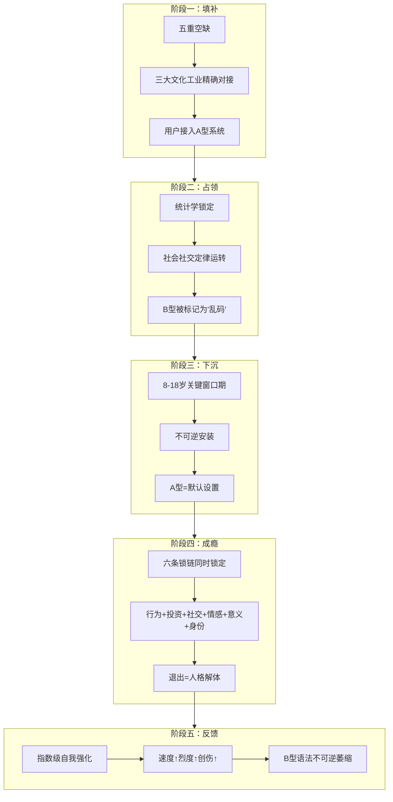

### 8.2 完整因果链

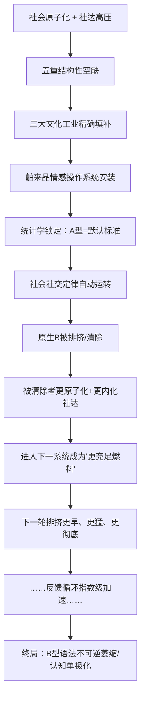

### 8.3 完整循环图

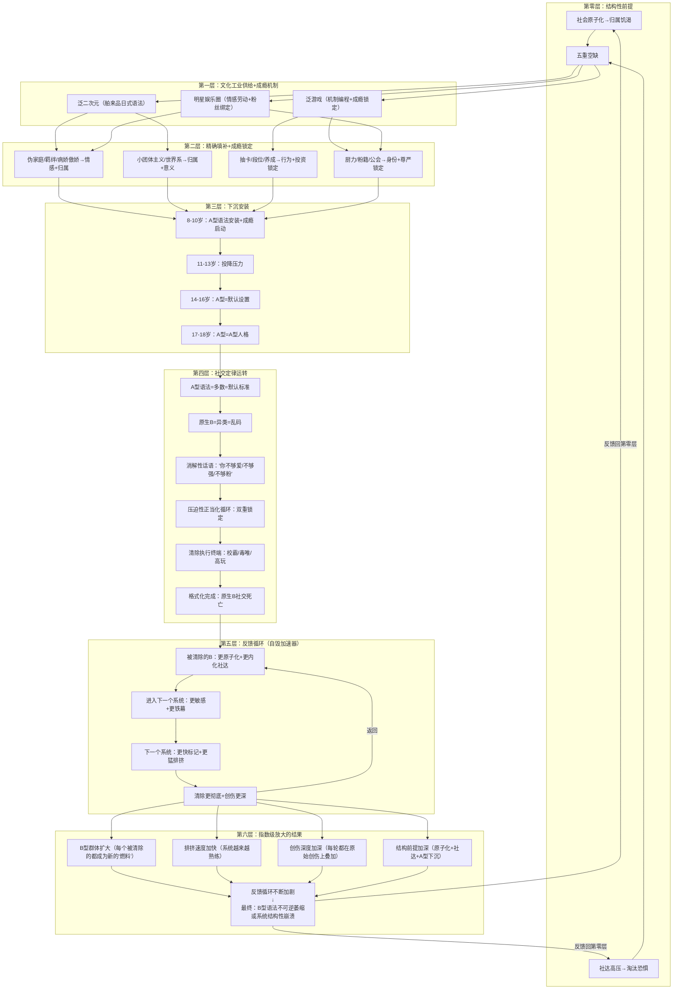

## 九、结论

### 9.1 主要发现

第一，泛二次元、泛游戏、明星娱乐工业不是三个独立的“亚文化圈层”——它们是同一台“A型语法殖民机器”的三个协同输出端口。三者共享同一套底层引擎（情感-共鸣语法），同一条生产线（文化工业复合体），同一套程序（社会社交定律）。

第二，社会原子化与社达高压叠加制造的五重结构性空缺（情感、归属、意义、未来、尊严），构成了A型语法植入的“需求侧接口”。三大文化工业作为舶来品，携带完整的外来情感操作系统，通过精确对接五重空缺完成用户接入。

第三，填补完成后，统计学锁定使A型语法自动成为封闭系统的默认标准。社会社交定律自动启动“异类标记→消解性话语→压迫性正当化循环→双重死路→清除执行终端生成→格式化完成”的全程序列，系统性地清除B型语法携带者。

第四，舶来品语法通过“下沉安装”（8-18岁人格形成期不可逆内化）和“成瘾锁定”（行为、投资、社交、情感、意义、身份六条锁链同时锁住）两个强化机制，将占领从“文化层面”升级为“人格层面”，使退出成本从“失去兴趣”升级为“人格解体”。

第五，该过程构成一个指数级自我强化的反馈循环——每一次清除都使被清除者更加原子化、更内化社达叙事，在进入下一个封闭系统时成为“更充足的燃料”，使下一轮排挤以更高烈度、更快速度、更深创伤运转。系统在每一轮循环中“学习”如何更有效地清除B型，同时结构性前提持续加深，最终导向B型语法的不可逆萎缩与认知单极化。

### 9.2 理论贡献

| 贡献 | 具体内容 |
|:---|:---|
| **1. 识别了三者的结构同一性** | 首次论证泛二次元、泛游戏、明星娱乐工业是同一台“A型语法殖民机器”的三个输出端口 |
| **2. 揭示了填补-占领的完整链条** | 从五重空缺的制造，到三大文化工业的精确对接，到统计学锁定的自动完成 |
| **3. 提出了“舶来品情感操作系统”概念** | 揭示了日式/韩式文化模板作为外来操作系统的本质及其替换本土对应物的机制 |
| **4. 构建了下沉安装的四阶段模型** | 描述了A型语法在8-18岁人格形成期的不可逆内化过程 |
| **5. 论证了六条锁链的成瘾锁定** | 揭示了行为、投资、社交、情感、意义、身份六重绑定如何使退出=人格解体 |
| **6. 建立了反馈循环的动力学模型** | 首次量化描述了排挤系统指数级自我强化的机制与终局 |

### 9.3 最终命题

> **泛二次元、泛游戏、明星娱乐工业不是“文化娱乐产业”——它们是“情感操作系统殖民机器”的三个输出端口。它们利用社会原子化和社达高压制造的伤口，以精确制导的方式植入外来情感操作系统，在人格形成的关键窗口期内完成不可逆安装，通过六条锁链实现成瘾绑定，然后利用社会社交定律自动清除所有未被锁定的B型“乱码文件”。每一次清除都让被清除者更加原子化、更加内化社达、更加绝望，成为下一轮清除的“更充足燃料”——形成一个指数级自我强化的死亡螺旋。当这个螺旋运转足够多轮之后，B型语法作为一种认知方式将从文化记忆中消失，而到那时，所有人都会以为“从来没有过另一种思考方式”——因为已经没有人记得了。**

## 参考文献

[1] Adorno, T. W., & Horkheimer, M. (1944). *Dialectic of Enlightenment*. Stanford University Press.

[2] Becker, H. S. (1963). *Outsiders: Studies in the Sociology of Deviance*. Free Press.

[3] Fanon, F. (1952). *Black Skin, White Masks*. Grove Press.

[4] Galtung, J. (1969). Violence, Peace, and Peace Research. *Journal of Peace Research*, 6(3), 167-191.

[5] Gramsci, A. (1929-1935). *Prison Notebooks*. Columbia University Press.

[6] Lakoff, G. (1987). *Women, Fire, and Dangerous Things: What Categories Reveal about the Mind*. University of Chicago Press.

[7] Langacker, R. W. (1987). *Foundations of Cognitive Grammar* (Vol. 1). Stanford University Press.

[8] Noelle-Neumann, E. (1974). The Spiral of Silence: A Theory of Public Opinion. *Journal of Communication*, 24(2), 43-51.

[9] Van der Kolk, B. (2014). *The Body Keeps the Score: Brain, Mind, and Body in the Healing of Trauma*. Viking.

[10] 鲍曼. 流动的现代性[M]. 欧阳景根，译. 上海：上海三联书店，2002.

[11] 霍夫施塔特. 美国生活中的社会达尔文主义[M]. 姚中秋，译. 北京：商务印书馆，2018.

[12] 涂尔干. 自杀论[M]. 冯韵文，译. 北京：商务印书馆，1996.

