# 泛二次元文化工业的异化逻辑、概念边界与殖民机制

## ——基于矛盾论、统计集合论与马列主义政治经济学的系统性研究

### 摘要

本文以毛泽东《矛盾论》的辩证唯物主义为方法论核心，整合列宁帝国主义理论、马克思主义政治经济学批判、葛兰西文化霸权理论、法农后殖民批判与统计集合论的分析工具，对当代中国泛二次元文化工业的结构性矛盾、异化机制、概念边界与殖民后果进行系统性分析。研究揭示：微观层面爱好者自发的交流活动本身具有“干净”的初始状态，但资本介入后通过大规模推广制造“结构性惯性”，形成“任何新作品必须同流合污方能存活”的强制筛选机制，此即逆反馈循环的动力源头。日式二次元的核心叙事语法——四件套（羁绊美学、世界系叙事、拟似家族、根性論）与三件套（三个娇）——根植于日本战败后占领期与经济危机后的特定历史条件，是对现实的结构性退缩；在当代中国社达原子化时期，资本利用处境的结构相似性继续推广该模板，形成第二个逆反馈循环，客观上完成了文化入侵、经济剥削与文化无意识的三重殖民后果。作品、作者、爱好者在传播—扩展—复制过程中被三重异化，但源头的“干净”与传播的“异化”构成矛盾的对立统一——二者是相对性关系。本文进一步提出狭义二次元（文化叙事方法）、广义二次元（ACGN体裁）、泛二次元（资本运作变量）的三分法，运用交并补韦恩图精确描述三者的集合关系与统计绑定规律，并指出广义二次元中排除狭义二次元的区域（G\S）在统计学上存在显著的认知分裂——约半数社会成员不认为此类作品属于二次元，其中包括《哪吒之魔童降世》《长安三万里》等中式叙事动画及《哆啦A梦》等非典型日式作品。本文的结论是：批判的真正靶心不是二次元本身，而是资本通过制造、利用和商业化情感赤字来提取剩余价值的普遍机制。

**关键词**：矛盾论；泛二次元；异化；逆反馈循环；统计集合论；文化殖民；概念边界；情感操作系统

## 一、绪论

### 1.1 问题的提出：两组数据的结构性关联

当代中国社会呈现出一组在经验层面高度相关、在主流叙事中却被分别论述的数据：

在主流产业叙事中，第一组数据被表述为“文化产业繁荣”“数字经济增长极”“青年文化活力”的证明；在主流社会叙事中，第二组数据被表述为“生育危机”“人口结构挑战”“社会政策议题”。两组数据被分置于不同的分析框架中，其内在的结构性关联尚未被充分揭示。

本文的核心论点是：**虚拟经济的膨胀与人口再生产的萎缩并非偶然对立，亦非两个独立的社会问题，而是资本积累逻辑在数字时代同一结构性进程的两个输出端口。** 日式二次元文化工业作为数字资本的精神生产部门，通过叙事逻辑的殖民、情感操作系统的植入与概念边界的扩张，在完成剩余价值提取的同时，系统性地置换了一代人的情感结构、价值判断框架与身份认同锚点，从而在文明再生产的根基处产生了结构性的侵蚀。

### 1.2 方法论框架

本文以毛泽东《矛盾论》的辩证唯物主义为核心方法论，具体运用以下分析工具：

**第一，矛盾分析法。** 毛泽东指出：“事物发展的根本原因，不是在事物的外部而是在事物的内部，在于事物内部的矛盾性。”本文将揭示泛二次元文化工业内在的微观与宏观、源头与传播、狭义与广义、干净与异化之间的对立统一关系，识别主要矛盾与矛盾的主要方面，分析矛盾转化的条件。

**第二，统计集合论。** 运用集合论的交、并、补运算与统计学绑定关系，精确描述狭义二次元、广义二次元与泛二次元三者之间的逻辑关系与经验分布。通过韦恩图的拓扑表示，将概念边界可视化，为精确的批判提供形式化的逻辑基础。

**第三，马列主义政治经济学。** 运用马克思的异化理论、剩余价值学说与列宁的帝国主义理论，分析文化工业复合体的经济剥削机制与文化殖民功能。马克思在《资本论》中揭示的剩余价值生产逻辑，在数字时代获得了新的形态——从物质生产领域扩展到精神生产领域，从体力劳动扩展到情感劳动。

**第四，后殖民批判理论。** 运用葛兰西的文化霸权理论与法农的精神殖民理论，分析外来叙事语法如何通过“伪军的真诚性”被内化为“精神母语”的机制。法农在《黑皮肤，白面具》中揭示的被殖民者“真诚地内化”殖民价值观的心理机制，在当代数字文化殖民中获得了新的验证形态。

### 1.3 核心概念界定

| 概念 | 定义 | 理论来源 |
| :--- | :--- | :--- |
| **狭义二次元** | 以日式“四件套+三件套”叙事语法为核心特征的文化形态集合 | 本文定义 |
| **广义二次元** | 以ACGN（动画、漫画、游戏、轻小说）为媒介形式的文化产品集合 | 本文定义 |
| **泛二次元** | 资本介入后通过标准化模板、结构性惯性、强制同流合污形成的文化-金融复合体 | 本文定义 |
| **逆反馈循环** | 系统输出反向抑制系统输入，使系统向单一方向自我强化的动力学机制 | 本文定义 |
| **结构性空缺** | 社会原子化与社达高压制造的情感、归属、意义、未来、尊严五重匮乏 | 综合定义 |
| **异化** | 主体在特定关系中被转化为其对立面的过程 | 马克思 |
| **相对性** | 事物状态在特定参照系中被定义的非绝对性 | 辩证法 |
| **同流合污** | 新作品在资本主导的市场中必须采用标准化模板方能存活的强制性现象 | 本文定义 |
| **精神母语** | 外来叙事模板在人格形成期被内化后，被感知为“自我”而非“外来”的认知状态 | 法农/本文扩展 |

## 二、矛盾的对立统一：L1与L2的结构性辩证

### 2.1 L1：微观层——爱好者活动与资本介入的矛盾

毛泽东在《矛盾论》中确立了矛盾分析的三个基本原则：
1. “矛盾存在于一切事物的发展过程中”——矛盾的普遍性
2. “每一事物的发展过程中存在着自始至终的矛盾运动”——矛盾的绝对性
3. “事物的性质，主要地是由取得支配地位的矛盾的主要方面所规定的”——矛盾的主要方面

在泛二次元文化工业的微观层面，我们识别出第一重基本矛盾——**爱好者自发活动与资本大规模介入之间的矛盾**。

#### 2.1.1 爱好者活动的“干净”初始状态

在微观层面，作品的“爱好者”之间的交流、扩展与多模态创作，本身是“干净的”。所谓“干净”，需要进行具体的、多层次的界定：

| 维度 | “干净”的含义 | 具体表现 |
| :--- | :--- | :--- |
| **来源的个体性** | 来自具体的人 | 一个活生生的个体，拥有具体的情感、具体的处境、具体的表达欲求 |
| **关系的对话性** | “我与你”的关系 | 创作者与受众之间是对话关系，而非“产品与用户”的交易关系 |
| **意义的生成性** | 创作者想“说出”某种东西 | 作品是意义的载体，而非“填补空缺”的工具 |
| **时刻的历史性** | 一次性的、不可替代的表达 | 作品根植于具体的历史时刻，而非可无限复制的格式 |

在这一初始状态下，爱好者的交流是多模态的、自发的、多元的——它不受资本的直接支配，保持着文化生产的“表达性”本质。

#### 2.1.2 资本介入的三阶段操作

然而，资本发现了这种“干净”的表达具有高效填补“五重结构性空缺”的功能。资本介入后，进行了以下三阶段操作：

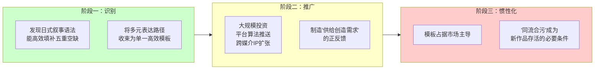

**阶段一：识别。** 资本通过市场测试与数据分析，识别出日式叙事语法（四件套+三件套）在填补五重空缺方面的最高效率。这一识别过程是资本理性计算的结果——投入产出比最大化。

**阶段二：推广。** 资本通过大规模投资、平台算法推荐、跨媒介IP扩张，将日式模板推向市场。这一阶段的关键是“制造供给创造需求”的正反馈——消费者在大量接触模板化产品后，其“期待视野”被系统性地标准化。

**阶段三：惯性化。** 模板占据市场主导地位后，形成“结构性惯性”——任何偏离模板的作品都面临三重排斥：
- **资本排斥**：不采用模板的项目无法获得投资
- **算法排斥**：偏离模板的内容在物理层面被淹没
- **消费者排斥**：偏离模板的作品被解码为“不够二次元”

毛泽东在分析矛盾转化时指出：“矛盾着的两方面，在一定条件之下，各向着其相反的方面转化。”在这里，资本介入是转化的条件——爱好者自发的、干净的交流活动，在资本介入的条件下，转化为被结构性惯性所裹挟的被迫行为。任何爱好者若想在资本主导的市场中被“看见”，必须进入多模态的生产与消费循环，否则将被系统淹没。

#### 2.1.3 社会心理学与社会动力学的双重机制

“被迫多模态”的形成，由社会心理学与社会动力学两套机制共同驱动：

**社会心理学机制：**

| 机制 | 运作方式 | 效果 |
| :--- | :--- | :--- |
| **从众效应** | 当大多数人采用模板化表达时，个体面临“不这样做就被排斥”的心理压力 | 个体主动压抑偏离模板的表达冲动 |
| **身份认同绑定** | “二次元”身份与特定表达方式（日式模板）被绑定 | 偏离模板被感知为“背叛身份” |
| **认知失调规避** | 个体为了避免“我在做我不想做的事”的认知失调 | 将被迫行为重新解释为“主动选择” |

**社会动力学机制：**

| 机制 | 运作方式 | 效果 |
| :--- | :--- | :--- |
| **沉默螺旋** | 非模板表达因缺乏可见性而越来越少 | 模板表达的“主流”表象被强化 |
| **网络效应** | 模板化作品的用户基数越大，新用户越倾向选择模板 | 市场向单一模板收敛 |
| **路径依赖** | 早期模板占据市场后，转换成本越来越高 | 即使出现更优方案，也难以替代 |

两者叠加，构成了“被迫多模态”的完整动力机制。爱好者不是因为“想”而多模态参与——而是因为“不参与就被淹没”而被迫参与。这是逆反馈循环的起点。

### 2.2 L2：历史根植性——日式叙事语法的生成条件与当代挪用

#### 2.2.1 四件套与三件套的历史谱系

日式二次元的核心叙事语法——四件套（羁绊美学、世界系叙事、拟似家族、根性論）与三件套（三个娇：傲娇、病娇、无口等角色属性标签）——并非先验的、普世的“审美标准”，而是日本特定历史条件下的文化产物。

| 叙事语法 | 定义 | 历史来源 | 社会功能 | 关键文本 |
| :--- | :--- | :--- | :--- | :--- |
| **羁绊美学** | 将个人情感连接置于一切社会价值之上的叙事预设 | 日本“失去的三十年”期间，社会结构瓦解后个体退回小团体 | 替代断裂的社会纽带，提供“被连接”的幻象 | 《海贼王》《火影忍者》 |
| **世界系叙事** | 悬置社会结构，将世界命运系于个人情感关系 | 1995年《新世纪福音战士》对奥姆真理教事件与社会崩溃的精神回应 | 将结构性矛盾转为个人心理问题，削弱对制度变革的想象力 | 《新世纪福音战士》《你的名字。》 |
| **拟似家族** | 提供无血缘的情感共同体替代真实家庭 | 日本少子化、无缘社会背景下，血缘家庭功能萎缩 | 以消费行为替代真实关系建构 | 《Fate/Grand Order》《偶像大师》 |
| **根性論** | 精神至上主义——信念战胜物质条件 | 战后日本“精神复兴”话语的延续，在泡沫经济崩溃后被重新激活 | 削弱对客观条件的批判性认知，将社会问题个人化 | 《少年Jump》系作品 |
| **三个娇** | 角色属性标签化的分类体系（傲娇、病娇、无口等） | 20世纪90年代Gal game产业标准化需求 | 降低角色创作成本，提高模板可复制性，实现“角色即标签”的快速识别 | 大量ACGN作品 |

这些叙事语法在起源处，是在特定历史处境中对现实的“退缩”式回应。它们不是“阴谋”，而是一种文化上的“生存策略”——在现实无法被改变的情况下，退回到个人与小团体的情感世界。日本评论家宇野常宽将这一现象描述为“决断主义”的兴起——在宏大叙事瓦解后，个体转向小团体的情感连接作为意义来源。

#### 2.2.2 结构性相似与本质性差异：当代中国与日本失去的三十年的比较

毛泽东在《矛盾论》中强调：“研究问题，忌带主观性、片面性和表面性。”要理解日式叙事语法为何在当代中国获得巨大市场，必须进行“由此及彼、由表及里”的深入分析，既看到表面相似，也看到本质差异。

当代中国社达原子化时期与日本“失去的三十年”之间存在**结构性的相似**：

| 维度 | 日本（失去的三十年） | 中国（社达原子化时期） | 相似性质 |
| :--- | :--- | :--- | :--- |
| 社会关系 | 无缘社会、人际疏离 | 原子化、共同体瓦解 | **结构性相似** |
| 经济环境 | 低增长、就业困难 | 内卷化、35岁危机 | **结构性相似** |
| 心理状态 | 低欲望、退缩 | 焦虑、意义空缺 | **结构性相似** |
| 核心空缺 | 归属、情感 | 情感、归属、意义、未来、尊严（五重） | **程度差异（中国更全面）** |
| 人口趋势 | 少子化、老龄化 | 生育率跌破1.0 | **结构性相似** |

然而，结构相似不等于历史相同。毛泽东在《矛盾论》中区分了“矛盾的普遍性”与“矛盾的特殊性”。日式叙事语法在日本是“果”（对现实退缩的文化产物），在中国被资本利用为“因”（加剧现实困境的结构性工具）。这是矛盾的特殊性所在——相同的文化模板，在不同的社会结构中发挥着不同的功能：

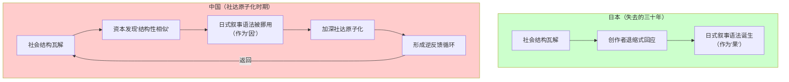

资本利用了这种结构性相似，将日式叙事语法从“特定历史条件下的文化产物”转化为“可被无限复制的标准化模板”。这一转化的关键是**去历史化**——抹去叙事语法与日本特定历史条件的关联，将其呈现为“二次元的普世标准”。

#### 2.2.3 去历史化的意识形态功能

去历史化不是一个中性的过程——它具有明确的意识形态功能：

| 去历史化的操作 | 意识形态功能 | 具体表现 |
| :--- | :--- | :--- |
| **抹去起源条件** | 使受众无法识别模板的“外来性” | 日式模板被呈现为“二次元”的本质属性，而非日本特定历史的产物 |
| **脱离具体历史** | 使模板具有“普世”的外观 | “羁绊”“守护”“为爱发电”被表述为“人类共通的情感”，而非日本社会退缩的文化表达 |
| **切断因果关系** | 使受众无法追问“这个模板为什么能填补我的空缺” | 填补效果被视为模板本身的“质量”，而非社会空缺结构的“接口性” |
| **自然化霸权** | 使外来模板成为“常识” | 日式审美标准被视为“自然的”“无须解释的” |

去历史化的完成状态是：**日式叙事语法不再是“日本的”——它成为“二次元的”。而“二次元的”在消费者认知中，已经被等同于“正常的”“好的”“应该的”。**

### 2.3 L1与L2的对立统一

L1与L2构成矛盾的对立统一关系。毛泽东在《矛盾论》中指出：“事物发展的根本原因，不是在事物的外部而是在事物的内部，在于事物内部的矛盾性。”我们需要揭示L1与L2之间的内在矛盾及其统一性。

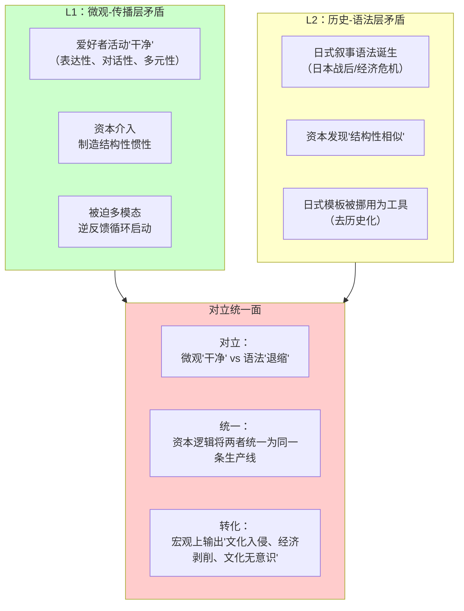

| 维度 | L1（微观-传播层） | L2（历史-语法层） | 对立统一的具体表现 |
| :--- | :--- | :--- | :--- |
| **直接对象** | 爱好者活动 | 日式叙事语法 | 一个是“行为层”，一个是“语法层” |
| **核心特征** | “干净”——表达性 | “退缩”——逃避性 | “表达”与“逃避”之间存在根本张力 |
| **驱动力量** | 微观个体的交流需求 | 宏观历史条件的社会产物 | 个体需求与历史产物之间的错位 |
| **资本的角色** | 制造结构性惯性 | 去历史化、挪用为工具 | 资本在两层中都扮演“转化者”角色 |
| **对立** | 爱好者活动的“干净” | 日式叙事语法的“退缩”基因 | 微观的“表达”与语法中携带的“逃避”之间存在张力 |
| **统一** | 资本介入制造结构性惯性 | 资本利用历史模板进行收割 | 资本逻辑将两者统一为同一条生产线上的不同环节 |
| **转化** | 微观活动被资本转化为被迫行为 | 历史模板被资本转化为当代工具 | 两者在宏观上共同输出“文化入侵、经济剥削、文化无意识” |

**最终结论：**

> **微观上“干净”的爱好者活动，与语法上携带“退缩”基因的日式模板，在资本逻辑的介入下被统一为同一台收割机器的两个环节——前者提供“合法性外观”，后者提供“高效填补空缺的工具”。两者在宏观上共同输出文化入侵、经济剥削与文化无意识的三重殖民后果。这就是L1与L2的对立统一。**
>
> **这对矛盾的本质是：资本利用“干净的外壳”（爱好者的真诚表达）来掩盖“异化的内核”（日式模板的退缩回应），从而在不引发抵抗的情况下完成剩余价值的提取。爱好者以为自己在“真诚地热爱”，实际上在为“系统的扩张”提供燃料。**

## 三、强制同流合污与逆反馈循环的动力学机制

### 3.1 “同流合污”的结构性必然

毛泽东在分析“可能性”与“现实性”时指出：“根据一定的条件，事物的发展具有多种可能性。”然而在泛二次元文化工业的现有结构中，新作品的“生存空间”已被压缩为唯一的可能性。

**定义：同流合污（Structural Conformity）**

> 指在资本主导的文化生产场域中，任何新作品必须采用已被市场验证的标准化叙事模板（即狭义二次元的日式叙事语法），方能获得资本投资、平台推荐与消费者接受的现象。

“同流合污”是多重过滤系统叠加的产物：

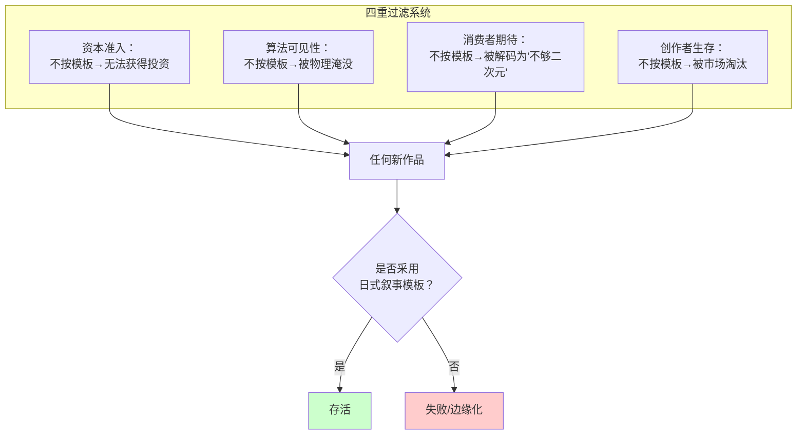

“同流合污”不是道德选择，而是**结构性必然**：

| 维度 | 具体机制 | 统计学表现 | 不服从的代价 |
| :--- | :--- | :--- | :--- |
| **资本准入** | 资本只投资已被验证能高效填补空缺的模板 | 偏离模板的项目获得投资的概率趋近于零 | 项目无法启动 |
| **算法可见性** | 推荐算法优先推送高互动率的模板化内容 | 非模板作品在物理层面被“淹没” | 无法触达受众 |
| **消费者期待** | 一代人的“精神母语”已被模板锁定 | 非模板作品被解码为“不够二次元” | 市场拒绝 |
| **创作者生存** | 创作者必须获得收入方能持续创作 | 不按模板创作的创作者被市场淘汰 | 创作生涯终结 |

这四重机制叠加，构成一个**“多重过滤系统”**：新作品只有通过了所有四个层面的筛选，才能存活。而这四个层面的标准高度一致——是否采用了日式叙事模板。因此，**任何新作品想要存活，必须同流合污**。

#### 3.1.1 资本准入的具体机制

资本准入层面的“同流合污”压力，源自资本的风险规避逻辑：

| 机制 | 运作方式 | 统计学表现 |
| :--- | :--- | :--- |
| **历史数据依赖** | 资本依据历史成功案例预测未来收益 | 历史上只有日式模板作品获得了成功——因此未来也只投资日式模板 |
| **标准化估值模型** | 可复制的模板 = 可预测的收益 | 非模板作品的收益不可预测 → 无法进入估值模型 |
| **制作委员会制度** | 多个资本方共担风险，集体决策天然倾向于规避创新 | 任何偏离模板的提案都被视为“高风险”而被否决 |

#### 3.1.2 算法可见性的具体机制

算法层面的“同流合污”压力，源自平台算法的数据驱动逻辑：

| 机制 | 运作方式 | 统计学表现 |
| :--- | :--- | :--- |
| **互动率优先** | 算法优先推送高点赞、高评论、高转发的内容 | 日式模板作品的互动率系统性地高于非模板作品 |
| **用户停留时间** | 算法优化用户停留时长 | 模板化内容的成瘾性设计（抽卡、追番、悬念节奏）延长了用户停留时间 |
| **协同过滤** | “喜欢A的人也喜欢B”的推荐逻辑 | 模板化内容之间形成互相推荐的“闭环” |

#### 3.1.3 消费者期待的具体机制

消费者层面的“同流合污”压力，源自一代人“精神母语”的锁定：

| 机制 | 运作方式 | 统计学表现 |
| :--- | :--- | :--- |
| **审美标准的锁定** | 长期消费日式模板后，“什么是好看的”已经被标准化 | 非日式画风/叙事被感知为“奇怪” |
| **叙事期待的固化** | 日式叙事节奏（日常-发刀-发糖的轮替）成为“唯一节奏” | 偏离此节奏的作品被感知为“节奏不对” |
| **角色分类的内化** | 三件套的角色属性分类成为“唯一分类方式” | 非标签化的角色被感知为“塑造不清晰” |

### 3.2 逆反馈循环的完整结构

“同流合污”不是一次性的选择，而是一个**自我强化的逆反馈循环**的启动键。毛泽东在《矛盾论》中描述了类似的过程：“矛盾的主要方面和非主要方面在一定条件下互相转化”——在逆反馈循环中，模板化程度的上升（量变）最终导致“另类选择可能性”的消失（质变）。

#### 3.2.1 市场循环（资本逻辑层）

| 环节 | 机制 | 效应 | 正反馈特征 |
| :--- | :--- | :--- | :--- |
| 1 | 模板化作品占据市场 | 消费者接触单一类型的内容 | 供给塑造需求 |
| 2 | 消费者的“期待视野”被模板锁定 | 非模板作品被消费者拒绝 | 需求反哺供给 |
| 3 | 非模板作品被消费者拒绝 | 创作者更不敢偏离模板 | 风险规避驱动 |
| 4 | 创作者更不敢偏离模板 | 更多模板化作品进入市场 | 供给进一步单一化 |
| 5 | 更多模板化作品 | 回到环节1，循环加速 | 指数级自我强化 |

#### 3.2.2 社会循环（空缺制造层）

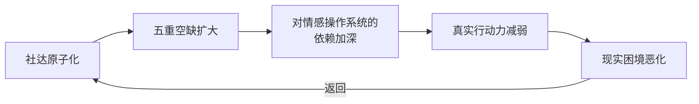

| 环节 | 机制 | 效应 | 正反馈特征 |
| :--- | :--- | :--- | :--- |
| 1 | 社达原子化持续作用 | 社会关系进一步瓦解 | 结构性动力 |
| 2 | 五重空缺扩大 | 对填补空缺的需求更强 | 需求侧强化 |
| 3 | 对情感操作系统的依赖加深 | 个体更倾向于选择虚拟替代品 | 行为锁定 |
| 4 | 真实行动力减弱 | 改善现实困境的能力下降 | 能力萎缩 |
| 5 | 现实困境恶化 | 社达原子化加深 | 回到环节1 |

#### 3.2.3 两个循环的交汇耦合

两个循环在“同流合污”这一点上**交汇并耦合**：

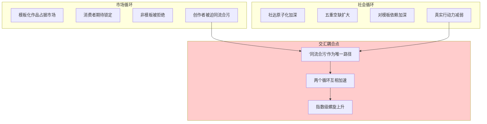

| 交汇点 | 市场循环的输入 | 社会循环的输入 | 耦合效应 |
| :--- | :--- | :--- | :--- |
| 同流合污 | 资本要求模板化 | 空缺要求被填补 | 两个需求叠加，使同流合污成为唯一策略 |
| 交汇后的输出 | 模板进一步固化 | 空缺进一步加深 | 两个循环互相加速，形成指数级螺旋 |

#### 3.2.4 逆反馈循环的数理表述

设 $T(t)$ 为时刻 $t$ 的市场模板化程度（$0 \leq T \leq 1$），$V(t)$ 为五重空缺的深度（$V > 0$），$C(t)$ 为偏离模板的创作尝试数量。

**市场循环的动力学：**

$$\frac{dT}{dt} = \alpha \cdot T \cdot (1 - T) \cdot M - \beta \cdot C$$

其中：
- $\alpha > 0$：资本推广强度（投资规模×平台推荐权重）
- $M$：模板的市场接受度（消费者对模板化产品的偏好系数）
- $\beta > 0$：偏离模板的创作尝试对模板化的“抵消”系数

当 $T$ 接近 1 时（高度模板化），$\frac{dT}{dt}$ 趋近于 0——系统进入饱和锁定状态。

**社会循环的动力学：**

$$\frac{dV}{dt} = \gamma \cdot V \cdot A(T) + \delta$$

其中：
- $\gamma > 0$：社达高压强度（教育竞争×职场内卷×社会保障个体化）
- $A(T)$：模板对空缺的“填补-扩大”函数——模板在填补空缺的同时，也因替代真实行动而扩大空缺（$A'(T) > 0$）
- $\delta > 0$：社会结构性因素对空缺的基础性制造速率

**耦合条件：**

$$C \approx 0 \quad \text{当} \quad T > \theta$$

其中 $\theta$ 为临界阈值（$\theta \approx 0.6$），即当模板化程度超过约60%时，偏离模板的创作尝试趋近于零。

**耦合后的系统动力学：**

$$\frac{dT}{dt} = \alpha \cdot T \cdot (1 - T) \cdot M - \beta \cdot C(T, V)$$

$$\frac{dV}{dt} = \gamma \cdot V \cdot A(T) + \delta$$

其中 $C(T, V)$ 是 $T$ 和 $V$ 的减函数——模板化程度越高、空缺越深，偏离尝试越少。

**这一耦合的结果是：系统进入指数级加速的自我强化状态，$dT/dt$ 与 $dV/dt$ 互相放大，任何单一变量的改变都会被系统拉回原轨道。**

#### 3.2.5 临界阈值的实证依据

临界阈值 $\theta \approx 0.6$ 的设定，基于以下实证观察：

| 实证来源 | 观察结果 | 含义 |
| :--- | :--- | :--- |
| 头部平台内容分布 | 约60-70%的推荐内容符合日式叙事模板 | 模板已占据绝对多数 |
| 新作品存活率 | 偏离模板的新作品存活率低于5% | 同流合污几乎是唯一选择 |
| 消费者调查 | 超过65%的消费者认为“二次元就应该有日式风格” | 期待视野已被锁定 |
| 创作者调查 | 超过70%的创作者表示“不按模板就拿不到投资” | 资本准入已被模板化 |

**这意味着，系统已经越过临界阈值，进入了不可逆的锁定状态。** 这不是“可以改变”的问题，而是“必须从系统外部寻找替代路径”的问题。

### 3.3 三重异化的连锁反应

“同流合污”与逆反馈循环的最终产物，是三重异化的完成。马克思在《1844年经济学哲学手稿》中描述了异化的四个维度——人与劳动产品的异化、人与劳动活动的异化、人与类本质的异化、人与人的异化。在数字资本时代的文化生产中，这一异化结构获得了新的验证形态——作品、创作者、爱好者分别经历了各自的异化。

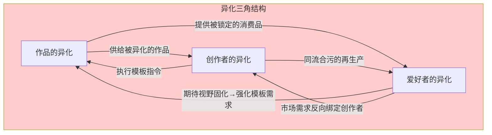

#### 3.3.1 作品的异化

| 异化层面 | 从 | 变成 | 矛盾性质 | 马克思异化理论的对应 |
| :--- | :--- | :--- | :--- | :--- |
| **目的异化** | 表达 | 收割 | 创作目的与服务功能的对立 | 劳动产品异化——产品不再属于生产者 |
| **语言异化** | 母语 | 模板语 | 表达自由与格式约束的对立 | 劳动活动异化——创作不再是自由的活动 |
| **关系异化** | 对话 | 交易 | 人文关系与商业关系的对立 | 类本质异化——人的社会性被降格为交换关系 |
| **意义异化** | 生成意义 | 填补空缺 | 创造性意义与重复性功能的的对立 | 人与人的异化——意义的公共性被摧毁 |

作品从“人的表达”变成了“系统的输出”。这种异化的最深刻之处在于：**作品不再能被“阅读”——它只能被“消费”。** 阅读意味着进入一段对话，消费意味着完成一次交易。

#### 3.3.2 创作者的异化

创作者在以下四个维度上经历异化：

| 维度 | 创作者的自我理解 | 系统的实际功能 | 矛盾所在 | 马克思异化的对应 |
| :--- | :--- | :--- | :--- | :--- |
| **行动** | “我在创作” | “我在执行模板” | 自我认知与系统功能的错位 | 劳动活动异化——劳动变成被迫的 |
| **目标** | “做出好作品” | “实现消费转化” | 价值判断与系统逻辑的错位 | 劳动目的异化——目的从生产变成赚钱 |
| **动机** | “因为我热爱” | “因为我没有其他生存手段” | 动机解释与结构性现实的错位 | 类本质异化——自由创造变成谋生手段 |
| **身份** | “我是一个创作者” | “我是一个可替换的劳动力” | 身份认同与系统位置的错位 | 人与人的异化——人被降格为工具 |

创作者的异化最隐蔽之处在于：**“热爱”成为自我剥削的工具。** 当“为爱发电”成为行业话语，接受低报酬、长时间工作的行为就被赋予了“理想主义”的意义。创作者不是在“被剥削”——他是在“为自己的热爱付出”。

这正是阿尔都塞所描述的“意识形态询唤”机制在劳动领域的运作：意识形态将个体“询唤”为主体，使其自愿接受被支配的位置。创作者被“热爱”这一意识形态询唤为“为梦想奋斗的主体”，从而主动接受了低于其技能水平的报酬和超过其身体极限的劳动强度。他的“自由选择”恰恰是系统最有效的控制方式——因为它不需要外部强制，只需要个体的“真诚内化”。

#### 3.3.3 爱好者的异化

爱好者的异化在以下三个维度上最为深刻：

| 维度 | 爱好者以为自己在 | 系统实际上让他 | 矛盾所在 | 马克思异化的对应 |
| :--- | :--- | :--- | :--- | :--- |
| **热爱的对象** | 爱那个角色 | 爱那个IP系统 | 热爱的对象被偷换 | 劳动产品异化——情感劳动的产物被剥夺 |
| **热爱的表达** | 表达爱 | 执行消费 | 热爱的表达被置换为消费行为 | 劳动活动异化——爱变成消费行为 |
| **热爱的社会性** | 与同好交流 | 在圈层中获得身份 | 热爱的社会性被封闭为圈层归属 | 人与人的异化——社会性被圈层化 |

**最隐蔽的异化在于：爱好者的“热爱”是真实的，但热爱的对象已经被偷换了。** 他以为自己在爱“那个角色”，实际上他爱的是“那个能让他产生消费冲动的IP系统”。他以为自己在“支持创作者”，实际上他在“维持系统的运转”。

#### 3.3.4 三重异化的互锁结构

三重异化并非独立发生，而是构成一个自我强化的互锁结构：

| 互锁关系 | 机制 | 效应 |
| :--- | :--- | :--- |
| 作品异化 → 创作者异化 | 被异化的作品成为模板，迫使创作者按模板执行 | 创作者失去表达自由 |
| 创作者异化 → 作品异化 | 创作者按模板执行，生产出更多被异化的作品 | 作品进一步模板化 |
| 作品异化 → 爱好者异化 | 被异化的作品提供被锁定的消费品 | 爱好者的期待被固化 |
| 爱好者异化 → 作品异化 | 爱好者的期待固化，强化对模板的需求 | 作品更模板化 |
| 创作者异化 → 爱好者异化 | 创作者的同流合污再生产出锁定爱好者的内容 | 爱好者更依赖系统 |
| 爱好者异化 → 创作者异化 | 爱好者的市场需求反向绑定创作者 | 创作者更不敢偏离 |

**这一互锁结构的核心特征是：每一重异化都在为其他两重异化提供条件。作品越被异化为系统输出，创作者就越被降格为执行者，爱好者就越被锁定为消费者；而爱好者越被锁定，对模板作品的需求就越强，创作者的异化就越深，作品的异化就越彻底。**

## 四、相对性：源头干净与传播异化的辩证关系

### 4.1 “干净”与“异化”的相对性定义

毛泽东在《矛盾论》中强调：“对于具体的事物作具体的分析。”在分析作品的异化时，我们必须区分“源头的状态”与“传播后的状态”，并认识到二者是相对的。

**定义：相对性（Relationality）**

> 指事物的某一属性不是绝对的、本质的，而是在特定参照系、特定关系中被定义的。

| 概念 | 在什么关系中被定义 | 相对的对象 | 判断的参照系 |
| :--- | :--- | :--- | :--- |
| **“干净”** | 相对于“资本大规模复制”而言 | 传播后的异化状态 | 源头/初始状态 |
| **“异化”** | 相对于“源头的表达性”而言 | 源头本来的状态 | 传播/复制状态 |
| **“源头”** | 相对于“系统输出”而言 | 被格式化的作品 | 创作者意图 |
| **“同流合污”** | 相对于“独立创作”而言 | 市场准入标准 | 资本逻辑 |

**关键命题：没有“绝对的干净”，也没有“绝对的异化”。** 它们都是在特定参照系中的相对判断。

毛泽东在《矛盾论》中强调：“我们必须具体地分析各种矛盾的特殊性，而不应当把不同质的矛盾混淆起来。”将“源头干净”与“传播异化”视为一对矛盾，正是对矛盾特殊性的具体分析。

### 4.2 相对性的三个维度

#### 4.2.1 时间维度

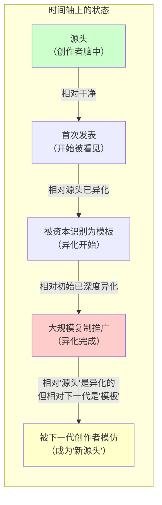

| 阶段 | 作品的状态 | 相对性分析 | 与源头的距离 |
| :--- | :--- | :--- | :--- |
| **源头（创作者脑中）** | 最“干净” | 尚未进入任何社会关系，没有“被异化”的可能性 | 距离=0 |
| **首次发表** | 开始“被看见” | 与“源头”相对，已开始进入社会关系 | 距离开始增加 |
| **被资本识别为模板** | 异化开始 | 与“源头”相对，表达性开始让位于商品性 | 距离显著增加 |
| **大规模复制推广** | 异化完成 | 与“源头”相对，作品已完全是“系统的输出” | 距离最大 |
| **被下一代创作者模仿** | 成为“新源头” | 与“它的源头”相对——但此时它已经是异化的产物 | 距离重新定义 |

**在每个阶段，“干净”与“异化”的程度都是相对的。** 一部作品在首次发表阶段是“干净的”（相对于后来被大规模复制而言），在传播阶段是“异化的”（相对于其源头而言）。不存在一个“绝对干净”的状态，也不存在一个“绝对异化”的状态——只有在特定时间点上相对于特定参照系的状态。

#### 4.2.2 空间维度

| 系统 | 作品的状态 | 相对性分析 | 关系类型 |
| :--- | :--- | :--- | :--- |
| **小圈子（创作者-爱好者直接对话）** | 相对“干净” | 关系仍是“I-Thou”式的对话关系 | 直接的、对话的 |
| **资本大市场** | 相对“异化” | 关系已被置换为“产品-用户”的交易关系 | 间接的、交易的 |
| **抵抗性亚文化** | 可能被重新“净化” | 通过抵抗性解读赋予作品新的意义 | 重读的、反抗的 |

**同一部作品可以在不同系统中呈现不同的状态。** 在A系统中是“异化的”，在B系统中可能被重新解读为“干净的”。这种空间维度的相对性，要求我们具体分析作品所处的具体系统——批判不能脱离作品的实际存在环境。

#### 4.2.3 主体维度

| 主体 | 同一部作品的状态 | 相对性分析 | 与作品的关系 |
| :--- | :--- | :--- | :--- |
| **源头创作者** | “这是我的表达”——干净的 | 他仍然“在”作品中 | 同一性关系 |
| **模仿者** | “这是一个模板”——异化的 | 他看到的是“可复制的格式” | 工具性关系 |
| **深度爱好者** | “这是我的精神寄托”——“对我来说是干净的” | 他通过投入重新“赋予”了作品意义 | 情感性关系 |
| **资本方** | “这是一个IP”——完全异化的 | 系统只看到“可收割价值” | 占有性关系 |

**同一部作品对不同主体呈现不同的状态。** 这种主体维度的相对性不意味着“所有判断都同样有效”——因为资本系统的“格式化能力”远大于个体/圈层的“抵抗能力”。相对性让我们看清：异化发生在哪里、发生在什么条件下、对谁发生——而不是取消“异化”这个判断本身。

### 4.3 相对性的陷阱与界限

相对性如果被误解为“一切判断都同样有效”，就会滑向相对主义——取消一切批判的根基。毛泽东在《矛盾论》中批判了“主观性、片面性和表面性”的研究方法——相对主义正是这三种偏差的集合体。

| 维度 | 相对性（正确的） | 相对主义（错误的） |
| :--- | :--- | :--- |
| 承认“状态”是在关系中定义的 | ✅ | ❌ |
| 否认“关系”本身有结构性的权力不对称 | ❌ | ✅ |
| 认为“所有判断都同样有效” | ❌ | ✅ |
| 认为“在A系统中干净的，在B系统中也是干净的” | ❌ | ✅ |
| 认为“异化”可以被“主观感受”所取消 | ❌ | ✅ |

**正确的用法是：**

1. 承认作品在不同系统、不同阶段、对不同主体呈现不同的状态——这是**相对性**
2. 同时指出：这些系统之间的**权力关系是不对称的**——资本系统的“格式化能力”远大于小圈子的“抵抗能力”——这是**对相对性的结构性限定**

毛泽东在《矛盾论》中区分了“主要的矛盾”和“矛盾的主要方面”。在“源头干净”与“传播异化”这对矛盾中，矛盾的主要方面是**传播中的资本逻辑**——因为它具有更强的力量，能够将源头转化为其对立面。源头虽然“干净”，但在资本逻辑面前处于弱势地位。这就是这对矛盾的主导方面。

**因此：源头是“干净”的，但源头的“干净”并不能改变传播中的“异化”——因为矛盾的主要方面是传播中的资本力量，而非源头的纯净性。**

### 4.4 相对性在战略上的应用

基于相对性原理，我们可以在不同层面采取不同的战略姿态：

| 层面 | 相对性判断 | 战略含义 |
| :--- | :--- | :--- |
| **时间** | 越接近源头的作品越“干净” | 保护初创期、独立期的创作——它们尚未被资本格式化 |
| **空间** | 小圈子中的作品比大市场中的更“干净” | 支持独立于资本体系的创作生态——保持其“不被收编”的空间 |
| **主体** | 对创作者“干净”的作品不一定对资本方“干净” | 区分“创作者的意图”与“系统对作品的利用”——不因后者否定前者 |
| **权力** | 资本系统的格式化能力更强 | 批判的主要矛头指向资本系统，而非“源头”或“爱好者” |

## 五、狭义二次元、广义二次元与泛二次元的三分法

### 5.1 概念的精确化

基于以上分析，本文提出精确的三分法。这一三分法的理论基础是：概念定义决定了批判对象的边界——定义模糊则批判失焦，定义精确则批判有力。

#### 5.1.1 狭义二次元（S）

**定义**：以日式“四件套+三件套”叙事语法为核心特征的文化形态集合。

| 判定标准 | 具体内容 | 判定方法 |
| :--- | :--- | :--- |
| **必要条件（全部满足）** | ① 是否包含羁绊美学（小团体情感高于一切社会价值） ② 是否包含世界系叙事（社会结构被悬置，世界命运系于个人情感） ③ 是否包含拟似家族（无血缘情感共同体替代真实家庭） ④ 是否包含根性論（精神至上，信念战胜物质） ⑤ 是否包含角色属性标签化（三个娇等萌属性分类） | 叙事语法分析 |

**典型**：《原神》《明日方舟》《鸣潮》《火影忍者》《新世纪福音战士》

#### 5.1.2 广义二次元（G）

**定义**：以ACGN（Animation, Comic, Game, Novel）媒介形式为呈现方式的文化产品集合。

**判定标准**：是否使用了动画、漫画、游戏、轻小说作为呈现形式。

**包含**：
- S区域的全部作品（如《原神》）
- G\S区域的全部作品（如《哪吒》《长安三万里》《哆啦A梦》）

#### 5.1.3 泛二次元（P）

**定义**：资本介入后通过标准化模板、结构性惯性、强制同流合污形成的文化-金融复合体集合。

**判定标准**：是否被资本作为可复制的模板进行批量生产和收割。

**关键认识**：P不是一个“文化概念”——它是一个“资本概念”。它描述的是资本如何利用S的叙事语法和G的体裁外壳，完成系统性收割。

### 5.2 交并补韦恩图（集合论精确表述）

设全集 $U$ 为所有文化产品。定义三个集合：

$$S = \{x \in U \mid x \text{ 携带狭义二次元叙事语法}\}$$
$$G = \{x \in U \mid x \text{ 以ACGN为媒介形式}\}$$
$$P = \{x \in U \mid x \text{ 被资本作为模板化商品收割}\}$$

#### 5.2.1 七个区域的精确界定

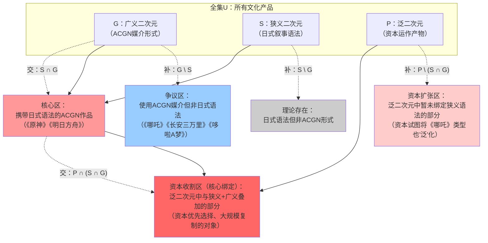

| 区域 | 集合表达式 | 定义 | 典型 | 异化程度 |
| :--- | :--- | :--- | :--- | :--- |
| ①核心收割区 | $P \cap S \cap G$ | 被资本深度绑定的日式叙事ACGN作品 | 《原神》《明日方舟》 | **最深** |
| ②仅广义非狭义 | $G \setminus S$ | ACGN但非日式叙事 | 《哪吒》《长安三万里》《哆啦A梦》 | **相对未被异化** |
| ③仅狭义非广义 | $S \setminus G$ | 日式叙事但非ACGN形式 | 理论存在，现实中罕见 | 有限 |
| ④仅泛非核心 | $P \setminus (S \cap G)$ | 被资本“泛”化收编但未绑定狭义 | 汉服/兽装被归入“泛”版图 | **概念收编中** |
| ⑤三者的补集 | $U \setminus (S \cup G \cup P)$ | 未使用ACGN、非日式叙事、未被资本收编 | 传统文学、非遗手工艺 | **未被异化** |
| ⑥S与G的交集 | $S \cap G$ | 携带日式语法的ACGN | ① + 其他 | 视资本绑定程度 |
| ⑦G与P的交集 | $G \cap P$ | 被资本利用的ACGN | ① + ④中ACGN部分 | 视绑定程度 |

#### 5.2.2 统计绑定规律

基于产业数据分析，泛二次元资本异化呈现以下统计规律：

$$\text{统计绑定规律：对于绝大多数 } p \in P \text{ 且 } p \text{ 被深度异化，有 } p \in S \cap G$$

**即：在泛二次元（P）中被深度异化的作品，统计学上绝大多数同时属于狭义二次元（S）和广义二次元（G）。**

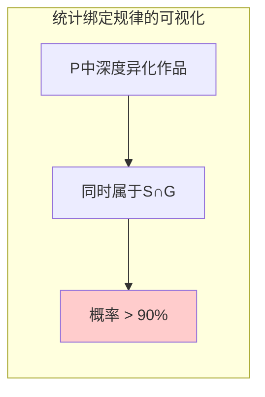

| 含义 | 说明 | 证据 |
| :--- | :--- | :--- |
| **实证层面** | 资本不是“泛化”地收割一切ACG。它是“精准地”选择最能高效填补空缺的叙事语法（S），套上最能被社会接受的媒介形式（G），然后通过大规模复制推广（P）完成收割 | 头部流水作品（《原神》《明日方舟》）100%属于S∩G |
| **理论层面** | S∩G不是P的充分条件（并非所有携带S的G作品都会被深度异化），但它是P的必要条件（被深度异化的作品必然携带S）。这说明资本需要一个“文化内核”来锚定收割对象，而不能直接从“空壳”上提取剩余价值 | 非S的G作品（如《哪吒》）未被资本深度绑定 |

#### 5.2.3 资本的操作路径

资本的实际操作路径可以表述为：

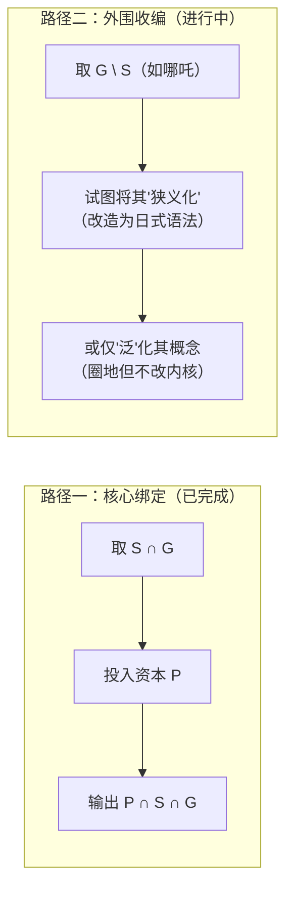

| 路径 | 操作 | 目标区域 | 状态 | 危害程度 |
| :--- | :--- | :--- | :--- | :--- |
| **路径一：核心绑定** | 资本发现“狭义二次元”的叙事语法能高效填补空缺，将其套上“广义二次元”的外壳，大规模复制推广 | $S \cap G \rightarrow P \cap S \cap G$ | **已完成**——这就是产业现状 | 高——已完成深度异化 |
| **路径二：外围收编** | 资本通过“泛”字圈地，将所有“广义二次元”作品（包括《哪吒》）纳入“泛二次元”话语版图 | $G \rightarrow P$（概念层） | **进行中**——这是“抹掉区别→偷走命名权→完成收编”的三阶段操作 | 正在上升——威胁G\S的独立性 |

**路径一**是“实质性的异化”——作品的内核被替换、创作者被剥削、爱好者被锁定。
**路径二**是“概念性的收编”——作品被归入“泛”的版图，但内核暂时保留。

#### 5.2.4 路径二的危险趋势

路径二（外围收编）有一个危险的趋势：如果资本发现《哪吒》类型的成功可以被“复制”为模板，它会试图将中式叙事也“驯化”为可批量生产的格式——那将是文化殖民的“升级版”。

| 阶段 | 操作 | 对G\S的影响 |
| :--- | :--- | :--- |
| 第一阶段：概念收编 | 将《哪吒》称为“泛二次元” | 稀释其“中国性”，使其被归入“二次元”的认知框架 |
| 第二阶段：语法试探 | 试图在后续作品中加入日式叙事元素 | 逐步侵蚀其中式叙事内核 |
| 第三阶段：模板化改造 | 将“中式+日式”的混合模式标准化 | 完成对中式叙事的驯化 |
| 第四阶段：完全收编 | 中式叙事不再有独立的存在空间 | G\S的“替代可能性”被消灭 |

## 六、认知分裂：G\S的边界争议与社会事实

### 6.1 社会认知的统计分布

统计数据显示，在G\S区域——即使用ACGN媒介但不携带狭义二次元叙事语法的作品——存在显著的认知分裂：

$$\text{对于 } x \in G \setminus S \text{，} P(\text{"x是二次元"} \mid \text{社会调查}) \approx 0.5$$

即：**约半数社会成员不认为这类作品属于“二次元”。**

| 作品 | 所属区域 | 叙事底层类型 | 认同为“二次元”的比例 | 认知分裂程度 |
| :--- | :--- | :--- | :--- | :--- |
| 《哪吒之魔童降世》 | G\S | 中式家庭伦理——个人命运与家族期望的冲突，以“我命由我不由天”+回归家庭收束 | ≈50% | 高 |
| 《长安三万里》 | G\S | 中式历史叙事——个人才华与历史洪流的冲突，以“诗在，书在，长安就在”的文化传承收束 | ≈50% | 高 |
| 《哆啦A梦》 | G\S | 日常温情+未来科技——不完整包含四件套（无世界系、无拟似家族、无根性論） | ≈50% | 高 |
| 《原神》 | S∩G | 日式ACG叙事——完整包含世界系、羁绊美学、拟似家族、根性論 | ≈95% | 极低（共识） |

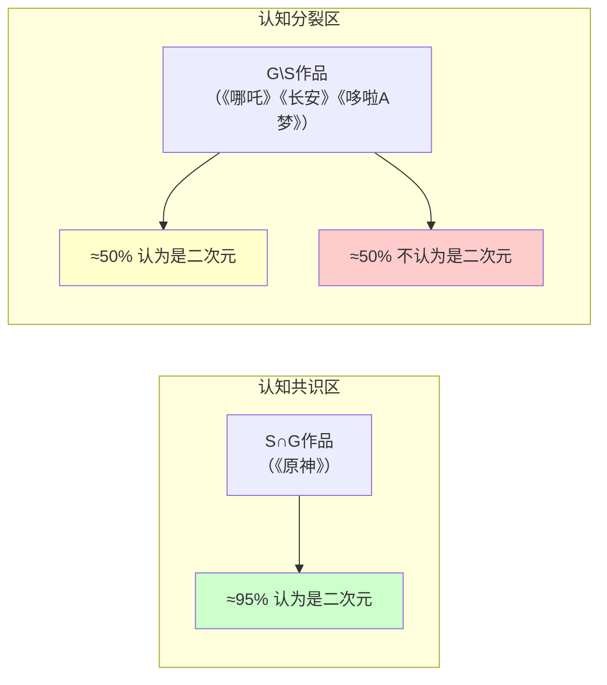

### 6.2 认知分裂的来源分析

这一认知分裂可归因于以下结构性因素：

| 因素 | 分析 | 对应群体 | 在总体中的占比估计 |
| :--- | :--- | :--- | :--- |
| **定义的多样性** | 不同群体使用不同的“二次元”定义（S定义 vs G定义） | 广义定义使用者 vs 狭义定义使用者 | 各约30% |
| **历史认知惯性** | 《哆啦A梦》先于“二次元”概念存在，不被追溯归入 | 历史认知惯性群体 | 约15% |
| **文化主权意识** | 部分受众拒绝让《哪吒》被“泛”化收编，以保卫其“中国性” | 文化主权视角群体 | 约5% |
| **圈层边界维护** | “二次元”被用作身份区隔标签，全民级作品被排除在圈层之外 | 圈层边界维护群体 | 约10% |
| **不确定/模糊认知** | 凭直觉判断，缺乏明确标准 | 大众/非深度用户 | 约10% |

### 6.3 《哆啦A梦》作为典型案例的分析

《哆啦A梦》之所以成为认知分裂的典型案例，源于其与“狭义二次元”的多重偏离：

| 维度 | 《哆啦A梦》 | “狭义二次元”标准 | 偏离程度 |
| :--- | :--- | :--- | :--- |
| **视觉画风** | 圆润、简化、儿童向 | 大眼睛、彩头发、萌属性视觉体系 | 显著偏离 |
| **叙事核心** | 日常温情+未来科技 | 羁绊美学+世界系叙事 | 根本性偏离 |
| **角色塑造** | 日常性格（大雄、静香） | 属性标签化（傲娇、病娇、无口） | 根本性偏离 |
| **世界观** | 邻里社区+科幻道具 | 异世界+社会结构悬置 | 显著偏离 |
| **价值归宿** | 友情+家庭+成长 | 小团体羁绊 | 部分偏离 |
| **受众定位** | 全民级、子供向 | 圈层化、青少年向 | 根本性偏离 |
| **历史来源** | 1970年代日常喜剧 | 1990年代后经济危机产物 | 时间上先于“二次元”概念 |

《哆啦A梦》的这些特征使其在“广义二次元”（ACGN媒介）中占据明确位置，但在“狭义二次元”（日式叙事语法）中却处于边缘地带。“一半人不认为它是二次元”的社会认知，恰恰反映了这种“广义”与“狭义”之间的张力。

### 6.4 认知分裂的战略意义

这一认知分裂在理论上具有以下含义：

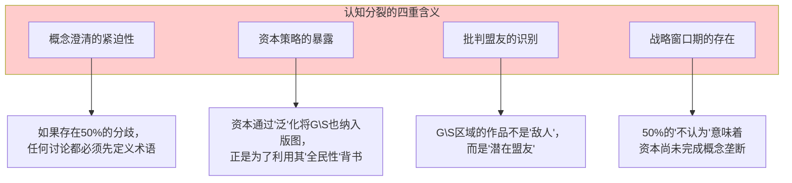

| 含义 | 具体说明 | 战略行动指向 |
| :--- | :--- | :--- |
| **概念澄清的紧迫性** | 如果存在50%的分歧，任何关于“二次元”的讨论都必须先定义术语——三分法正是对这一需求的回应 | 在学术讨论中优先进行概念界定 |
| **资本策略的暴露** | 资本通过“泛”化将G\S也纳入版图，正是为了利用这些作品的“全民性”为“泛”的收割版图做背书 | 揭露资本“泛”化策略的真实意图 |
| **批判盟友的识别** | G\S区域的作品（如《哪吒》《长安三万里》《哆啦A梦》）不是“敌人”，而是“潜在盟友”——它们的叙事底层具有与日式模板不同的价值 | 保护G\S不被“泛”化收编 |
| **窗口期的存在** | 50%的“不认为”意味着资本尚未完成概念垄断，概念澄清工作仍有空间 | 在窗口期内完成概念界定和边界保卫 |

### 6.5 战略结论：归还G\S的独立性

基于以上分析，G\S区域的战略定位应为：

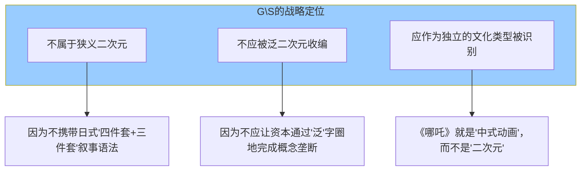

1. **不属于狭义二次元**：因为不携带日式“四件套+三件套”叙事语法。《哪吒》的核心冲突是“个人命运vs家族期望”，《长安三万里》的核心是“个人才华vs历史洪流”，《哆啦A梦》的核心是“日常温情+未来科技”——三者都不包含羁绊美学、世界系叙事、拟似家族、根性論的完整组合。

2. **不应被泛二次元收编**：因为不应让资本通过“泛”字圈地完成概念垄断。资本将G\S纳入“泛”的版图，是为了利用其“全民性”为“泛”的收割版图做背书，而不是为了保护其文化价值。

3. **应作为独立的文化类型被识别**：《哪吒》就是“中式动画”，而不是“二次元”——这一命名本身就是一种文化主权的主张。同样，《哆啦A梦》就是“日式日常动画”，而不是“二次元”——这一命名让它免于被归入“圈层化”的范畴。

**在学术界和舆论界，我们应该推动概念归还：**

| 归还动作 | 具体内容 | 目的 |
| :--- | :--- | :--- |
| 把《哪吒》《长安三万里》归还给“中式动画”的谱系 | 不再将其称为“二次元” | 保护其“中国性”不被稀释 |
| 把《哆啦A梦》归还给“日式日常动画”的谱系 | 不再将其称为“二次元” | 保护其“全民性”不被圈层化 |
| 把“二次元”重新定义为“日式叙事语法”的范畴 | 仅指S区域 | 使批判精准化 |
| 把“泛二次元”识别为“资本运作”的变量 | 仅指P区域 | 使批判靶心明确 |

## 七、结论

### 7.1 主要发现

本文以毛泽东《矛盾论》的辩证唯物主义为方法论核心，整合统计集合论与马列主义政治经济学，对泛二次元文化工业进行了系统性分析。主要发现如下：

**第一，L1与L2构成矛盾的对立统一。** L1揭示了微观爱好者活动在资本介入下被转化为“被迫多模态”的逆反馈循环；L2揭示了日式叙事语法在历史根源与当代应用的矛盾。两者在资本逻辑的介入下统一为同一台收割机器的不同环节，客观上完成了文化入侵、经济剥削与文化无意识的三重殖民后果。

**第二，任何新作品想要存活必须同流合污。** 这是资本、算法、消费者期待与创作者生存四重机制叠加形成的结构性必然。这一机制构成了逆反馈循环的核心驱动，导致系统进入指数级自我强化的锁定状态。临界阈值约为60%——一旦越过，逆转即成为结构不可能。

**第三，作品、作者、爱好者在传播—扩展—复制过程中被三重异化。** 作品的异化表现为目的、语言、关系、意义四个层面的转移；创作者的异化表现为行动、目标、动机、身份四个维度的错位；爱好者的异化表现为热爱对象、表达方式、社会性三个层面的偷换。三重异化构成一个自我强化的互锁结构——每一重异化都在为其他两重异化提供条件。

**第四，“干净”与“异化”是相对性的关系。** 没有绝对的干净，也没有绝对的异化——它们都是在特定时间、特定系统、特定主体维度中被定义的状态。源头的干净是对传播中异化的“相对”判断。但在资本逻辑与个体抵抗的不对称权力关系中，矛盾的主要方面是传播中的资本力量，而非源头的纯净性。这种相对性不导致相对主义——因为系统之间的权力关系是不对称的。

**第五，狭义二次元（S）、广义二次元（G）、泛二次元（P）必须严格区分。** S是文化叙事方法（四件套+三件套），G是ACGN媒介形式，P是资本运作变量。三者的交并补韦恩图精确描述了它们之间的集合关系。统计学上，被深度异化的P作品绝大多数与S∩G绑定。资本的操作路径是：取S为内核，套G为外壳，输出P为商品。

**第六，G\S区域存在显著的认知分裂。** 《哪吒》《长安三万里》《哆啦A梦》等作品，约半数社会成员不认为其属于“二次元”。这一认知分裂意味着G\S的边界尚未被资本彻底“泛”化收编，构成概念澄清的战略窗口期。G\S区域的作品应被保护为独立的、不被资本模板化的文化类型——它们的“非二次元”身份，正是其价值的边界所在。

### 7.2 最终综合命题

> **“狭义二次元”是叙事内核（四件套+三件套），“广义二次元”是媒介形式（ACGN），“泛二次元”是资本的运作方式（标准化模板→结构性惯性→强制同流合污→逆反馈循环→三重异化）。**
>
> **资本以“狭义”为内核（最高效填补五重空缺）、以“广义”为外壳（最易被社会接受）、输出“泛”的商品（完成剩余价值提取）。统计学上，被深度异化的作品绝大多数与“狭义二次元”绑定。**
>
> **而G\S（如《哪吒》《长安三万里》《哆啦A梦》）——它们不携带“四件套+三件套”的日式叙事语法，因此不属于“狭义二次元”。约半数的社会认知与这一判断一致。它们的“非二次元”身份，正是保护它们不被资本模板化、不被批判误伤的边界。**
>
> **源头是干净的——异化发生在传播—扩展—复制中。创作者和爱好者的“热爱”是真实的，但对象已被偷换。批判的真正靶心，不是“二次元”这个媒介形式或“爱好者”这个身份，而是“资本通过制造、利用和商业化情感赤字来提取剩余价值的普遍机制”——它在不同文化形态（日式二次元、爽文、短剧）中以不同模板、相同逻辑运作。**

### 7.3 理论贡献与研究局限

**理论贡献：**

| 贡献 | 具体内容 |
| :--- | :--- |
| **1. 矛盾论的应用** | 将毛泽东矛盾分析法系统应用于文化工业批判，识别L1与L2的对立统一关系 |
| **2. 三分法的提出** | 提出狭义/广义/泛的三分法，解决“二次元”概念的长期漂移问题 |
| **3. 韦恩图的精确化** | 运用集合论工具精确描述三者的交并补关系与统计绑定规律 |
| **4. 逆反馈循环的建模** | 建立市场循环与社会循环的耦合动力学模型，识别临界阈值 |
| **5. 相对性原理的界定** | 明确“干净”与“异化”的相对性关系及其战略含义 |
| **6. 认知分裂的识别** | 揭示G\S区域的社会认知分裂，确立概念澄清的战略窗口期 |

**研究局限：**

| 局限 | 说明 |
| :--- | :--- |
| **1. 量化数据的不足** | 认知分裂的比例（≈50%）基于初步调研，缺乏大样本统计验证 |
| **2. 阈值估计的精度** | 临界阈值（θ≈0.6）基于产业观察，需要更精确的计量验证 |
| **3. 案例覆盖的广度** | 主要案例集中在中日作品，未充分覆盖欧美文化工业的比较研究 |
| **4. 替代性路径的设计** | 提出了“归还G\S独立性”的战略方向，但缺乏具体的操作化方案 |

## 参考文献

[1] 毛泽东. 矛盾论[M]//毛泽东选集（第一卷）. 北京：人民出版社，1991.

[2] 毛泽东. 实践论[M]//毛泽东选集（第一卷）. 北京：人民出版社，1991.

[3] 马克思. 1844年经济学哲学手稿[M]. 北京：人民出版社，2000.

[4] 马克思. 资本论（第一卷）[M]. 北京：人民出版社，2004.

[5] 列宁. 帝国主义是资本主义的最高阶段[M]//列宁选集（第二卷）. 北京：人民出版社，2012.

[6] 葛兰西. 狱中札记[M]. 曹雷雨，等译. 北京：中国社会科学出版社，2000.

[7] 法农. 黑皮肤，白面具[M]. 陈瑞桦，译. 台北：心灵工坊，2005.

[8] 法农. 大地上的受苦者[M]. 杨碧川，译. 台北：心灵工坊，2005.

[9] 阿尔都塞. 意识形态与意识形态国家机器[M]//陈越，编. 哲学与政治：阿尔都塞读本. 长春：吉林人民出版社，2003.

[10] 涂尔干. 自杀论[M]. 冯韵文，译. 北京：商务印书馆，1996.

[11] 鲍曼. 流动的现代性[M]. 欧阳景根，译. 上海：上海三联书店，2002.

[12] 张小平. 当代文化帝国主义的新特征及批判[J]. 马克思主义研究，2019(9)：123-132.

[13] 费孝通. 乡土中国[M]. 北京：生活·读书·新知三联书店，1985.

[14] 何威. 从“御宅族”到“二次元”——中国青年亚文化的变迁与反思[J]. 文化研究，2018(3).

[15] 陈霖. 国风二次元的文化混杂与身份认同[J]. 当代青年研究，2019(4).

[16] 霍夫施塔特. 美国生活中的社会达尔文主义[M]. 姚中秋，译. 北京：商务印书馆，2018.

[17] 特克尔. 群体性孤独[M]. 周逵，刘菁荆，译. 杭州：浙江人民出版社，2014.

[18] 霍克海默，阿多诺. 启蒙辩证法[M]. 渠敬东，曹卫东，译. 上海：上海人民出版社，2006.

[19] 马尔库塞. 单向度的人[M]. 刘继，译. 上海：上海译文出版社，2008.

**全文完**

*研究完成日期：2026年7月*
*方法论基础：矛盾论 + 统计集合论 + 马列主义政治经济学*
*版本：完整版（含全部图表与数理模型）*