# 泛二次元文化工业的社会控制闭环及其法律伦理边界

## ——基于“出警”、“开盒”、“宣传”、“偷拍争议”、“文化宣传”的系统性研究


### 摘 要

近年来，中国泛二次元文化领域呈现出一系列引人注目的社会现象：“出警”式的圈层执法、“开盒”式的网络暴力、“宣传”式的合法性生产、“偷拍”式的边界争议，以及“爱国主义/文化输出”式的叙事绑定。这些现象在主流舆论中常被孤立讨论——被分别归入“粉丝文化研究”“网络犯罪治理”“文化产业分析”“性别与身体研究”“政治传播”等不同领域。然而，这种学科化的分割遮蔽了它们的结构性关联，使得研究者无法看到这些现象背后统一的运作逻辑。

本文基于马克思主义政治经济学、后殖民批判理论与系统动力学分析框架，揭示这些现象的本质关联：它们并非独立的社会问题，而是同一套文化-金融复合体的五个协同输出端口。该复合体以特定的叙事语法为文化模板，以三层代理结构为组织形态，以金融化机制为利润提取方式。其中，两种“宣传”形态负责构建合法性话语与道德认证，两种“执法”形态负责日常话语权维持与边界巡逻，暴力清除则构成话语失效时的终极手段。本文进一步分析这些现象的伦理界限与法律边界，指出其中部分行为已超越话语竞争，进入违法犯罪领域，并已受到法律的明确打击。在此基础上，本文构建“话语—暴力—合法性”三环锁定的闭环模型，指出：打断这一闭环的路径在于对其运作机制的完整揭示，使其从“不可见的自动运转”变为“可见的结构性事实”。

**关键词**：泛二次元；话语权垄断；文化工业；网络暴力；隐私侵犯；消解性话语


### 一、绪论

#### 1.1 问题的提出

2024年至2026年间，中国泛二次元文化领域发生了一系列引人注目的现象。这些现象分布在从话语表达到暴力行为的连续谱系上，却在主流舆论和学术研究中常被作为孤立的社会事件加以讨论。以下五种现象构成了本文的核心观察对象：

**现象一：“出警”的常态化与扩散化。** 在二次元社群中，以“维护社区环境”或“维护圈层纯洁性”为名的“执法”行为日益频繁。违反圈层内部“规矩”的成员——无论使用的是盗版资源、穿着山寨服饰，还是发表了“不合时宜”的观点——都可能遭到道德审判、公开“挂人”乃至群体围攻。这种“出警”行为已从针对圈内“不规范”者扩展到针对圈外“越界”者：使用二次元头像的普通用户可能被指责“不配用”，在相关话题下提问的普通人可能被嘲讽“不懂装懂”。一套不成文但极具约束力的“村规”，正在取代公共法律和普遍伦理，成为特定圈层内部的“法律”。

**现象二：“开盒”的组织化与规模化。** 以“仙家军”为代表的网络暴力组织，以“维护特定游戏社区环境”的名义，对持不同意见的玩家实施“开盒”（非法获取并公开隐私信息）、挂人、网暴等行为。该组织采用分层级即时通讯群组管理模式，核心层约260人，外围活跃成员约400至500人，还有更广泛的参与群体。其技术手段包括社会工程学数据库、黑客技术及购买信息等，通过境外加密通讯工具组织行动。2024年，公安机关侦破该系列案件，依法查处155名涉案人员，涉及139起网络暴力违法犯罪案件。

**现象三：“宣传”的工业化与模板化。** 公众号矩阵以“繁荣”“活力”“文化传承”为框架，系统性地为二次元产业生产合法性话语。这些文章具有高度相似的论证结构——以个人视角转变为开篇，以情感价值为渲染，以经济功能为论据，以文化价值为升华，最终导向“放下偏见，温柔接纳”的结论。其文本呈现出明显的工业化生产特征：模板化、批量化、标准化，同一套论证模板被反复使用，同一套话术被反复复制。

**现象四：“偷拍”的定义泛化与话语越界。** 在漫展等公共空间，围绕“未经许可拍摄”是否构成“偷拍”的争议持续升温。在部分二次元社群的语境中，“未询问即等于偷拍”“公开无修原图被视为侵权”“圈外人不懂规矩成为默认罪证”——“偷拍”从“侵犯隐私的违法行为”被重新定义为“违反圈层礼仪的行为”，实现了话语层面的越界。每一次定义的扩张都意味着更多人的更多行为可以被纳入“违规”的范畴，从而扩大了“可出警”的范围。

**现象五：“爱国主义/文化输出”的叙事绑定与工具化。** 将特定游戏的消费行为与“爱国主义”“文化自信”“文化输出”等宏大叙事绑定，以政治话语压制商业批评。批评游戏被等同于“攻击国产游戏”“不爱国”，商业消费被等同于“支持国家文化战略”。这套话语已从个别粉丝的言论发展为高度组织化的话语策略——“越看越红”等口号精准概括了这一操作的核心逻辑：将商业消费行为层层包装为“爱国行为”，从而为消费披上道德合法性的外衣，同时将批评者置于“不爱国”的道德劣势位置。

上述五种现象在主流舆论和学术讨论中常被分别归入“粉丝文化研究”“网络犯罪治理”“文化产业分析”“性别与身体研究”“政治传播”等不同领域。这种分类框架遮蔽了它们的结构性关联——它们并非彼此独立的社会问题，而是一套完整的“话语—暴力—合法性”三环锁定结构的协同输出，共同服务于维持特定文化-金融复合体的话语权垄断与利润提取稳定性这一根本目标。

**本文的核心论点是：上述五种现象并非独立的社会问题，而是一套完整的“话语—暴力—合法性”三环锁定结构的协同输出。** 它们共同服务于一个根本目标——维持特定文化-金融复合体的话语权垄断，以保障其利润提取的稳定性与合法性。这五个现象之间存在着结构性的因果联系和功能性的互补关系，只有将它们视为一个整体，才能理解为什么这些现象会同时出现、为什么它们会持续升级、以及为什么它们难以被单独治理。

#### 1.2 文献综述

现有研究对上述现象的讨论主要分布在以下领域，但均存在各自的分析盲区，未能揭示这些现象之间的结构性关联：

**粉丝文化与亚文化研究**关注二次元社群的内部规范与“出警”行为。何威（2018）从“御宅族”到“二次元”的变迁角度分析了中国青年亚文化的演变，指出二次元文化已从边缘亚文化成长为主流文化的重要组成部分。陈霖（2019）则聚焦于“国风二次元”的文化混杂与身份认同问题，讨论了本土化过程中的文化融合现象。然而，这些研究多停留于描述性层面，将“出警”解释为“粉丝过激行为”或“圈层自我净化”，未能将其纳入更宏观的权力结构分析，也未能解释为什么“出警”现象在二次元社群中比其他文化社群更为普遍和激烈。张跣（2015）虽指出日本动漫的文化霸权问题，但未将其与粉丝社群的组织化暴力行为建立结构性关联。

**网络犯罪与法律研究**对“开盒”等侵犯公民个人信息行为进行了法律分析。最高人民法院（2026）和最高人民检察院（2026）的相关文件明确了此类行为的法律定性——“侵犯公民个人信息罪”的构成要件与量刑标准。但现有研究主要聚焦于技术手段与法律适用问题，未探讨其与特定文化产业生态的结构性关联——即“为什么是二次元社群产生了组织化的开盒行为，而非其他文化社群”。这一“为什么”的追问，恰恰需要借助文化研究和政治经济学的分析工具。

**文化产业与传播政治经济学**对二次元产业的市场规模、资本结构与利润分配进行了分析。王洪喆、吴靖（2020）从平台劳动过程与数字劳动控制的角度进行了批判性研究，揭示了平台资本对用户劳动的剥削机制。蒋淑媛、张唯肖（2024）对粉丝情感劳动的异化逻辑进行了分析，揭示了从“劳动关系异化”到“劳动主体异化”的完整链条。然而，这些研究较少关注产业扩张所伴生的社群暴力与话语控制机制——即资本如何利用粉丝的情感劳动来维持其话语权垄断，以及这种维持如何演变为组织化的暴力行为。

**性别与身体研究**对漫展中的“偷拍”争议进行了讨论，相关网络社区（小红书、豆瓣）的讨论多集中于性别权力视角，将偷拍争议理解为男性凝视与女性身体自主权之间的冲突。但这一视角未能解释为什么“偷拍”的定义会在二次元社群中被如此广泛地泛化——这不仅仅是性别问题，更是圈层话语权越界的问题。

**本文的贡献在于：** 首次将五种现象纳入统一的分析框架，揭示它们作为同一套系统的五个协同输出端口的结构性关联，并系统分析其运作机制、伦理界限与法律边界。本文突破现有研究的学科分割，建立了一个跨领域的整合性分析模型，揭示了从话语到暴力的连续性升级规律，以及“爱国主义”叙事如何被工具化为消解性话语的政治版本。

#### 1.3 理论框架

本文整合以下理论资源，构建多层次的分析框架：

**马克思主义政治经济学**提供了分析文化工业剥削结构的基础工具。马克思在《资本论》中揭示的剩余价值生产逻辑——资本通过占有生产资料剥削劳动者的剩余劳动——在数字时代获得了新的形态。文化工业将“情感”纳入生产资料范畴，消费者在“热爱”的名义下进行的创作、传播、社群维护等无偿劳动，构成了数字时代剩余价值的新来源。列宁在《帝国主义是资本主义的最高阶段》中揭示的金融资本统治与资本输出机制，为理解跨国文化资本的利润转移提供了理论工具——文化模板的输出本质上是一种资本输出，其目的不是“传播文化”，而是“占领市场”和“提取利润”。

**文化霸权与意识形态理论**提供了分析文化统治“非物质形态”的工具。葛兰西在《狱中札记》中提出的“文化霸权”概念——统治阶级通过“同意”而非“强制”实现对被统治阶级的精神领导——解释了特定审美模板如何成为文化领域的“常识”。当一种外来模板被接受为“理所当然”的标准时，文化霸权就进入了最稳固的形态：被统治者不仅接受了统治者的价值观，而且主动维护之。阿尔都塞的“意识形态国家机器”理论进一步揭示了文化消费如何完成“主体建构”——个体通过日常消费行为被“询唤”为特定社会位置上的主体，在“我是XX粉丝”的自我命名中完成了身份的确认和锁定。

**后殖民批判理论**提供了分析“精神殖民”机制的工具。法农在《黑皮肤，白面具》中揭示的被殖民者“真诚地内化”殖民价值观的心理机制——被殖民者为了获得宗主国的认可，会主动贬低自身文化，甚至比殖民者更狂热地维护殖民价值观——在数字文化殖民中获得了新的验证形态。被殖民者不是在“被迫”接受外来模板——他们是“真诚地”内化了外来模板，并将其感知为“自我”的构成部分。这种“真诚性”使得精神殖民比物质殖民更难以识别和抵抗。

**社会结构分析理论**提供了分析“需求侧条件”的工具。涂尔干的“失范”理论揭示了社会整合机制瓦解后的个体心理状态——当传统的社会纽带（宗教、家族、职业行会）断裂时，个体陷入缺乏道德约束与集体归属的状态，产生对替代性共同体的强烈需求。霍夫施塔特对“社会达尔文主义”的批判揭示了制度化竞争如何制造结构性创伤——持续的比较、排名和淘汰使个体反复体验“自己不够好”，从而产生对“无条件接纳”的极度渴望。这些理论共同解释了为什么特定文化产品能够获得如此广泛的市场接受——不是因为其“质量”或“创新性”，而是因为它精准填补了社会结构制造的情感赤字。

| 理论来源 | 核心概念 | 在本研究中的应用 |
| :--- | :--- | :--- |
| 马克思《资本论》 | 剩余价值、异化劳动 | 分析文化工业的剥削结构与情感劳动的异化 |
| 列宁《帝国主义论》 | 金融资本、垄断、资本输出 | 分析跨国文化资本的利润转移与宗主国-买办结构 |
| 毛泽东《矛盾论》 | 主要矛盾、矛盾转化 | 分析文化殖民的隐蔽形态与矛盾的主要方面 |
| 葛兰西《狱中札记》 | 文化霸权、常识 | 分析外来审美模板如何成为“理所当然”的常识 |
| 法农《黑皮肤，白面具》 | 精神殖民、内化机制 | 分析特定群体将外来模板内化为“自我”的心理机制 |
| 阿尔都塞《意识形态国家机器》 | 询唤、主体建构 | 分析消费行为如何完成身份认同的建构 |
| 涂尔干《自杀论》 | 失范、社会整合 | 分析社会原子化与“共同体真空”的形成 |
| 霍夫施塔特《美国生活中的社会达尔文主义》 | 制度化竞争 | 分析社达高压的心理后果与需求制造 |


### 二、宣传：合法性话语的工业化生产

“宣传”是五重现象中最为基础的一环——它为整个系统的运作提供了合法性话语和道德安全感。没有这一层的话语生产，后续的出警、偷拍争议乃至暴力清除都将失去“正当性”的支撑。本节将对“宣传”现象进行详细的、多层次的解剖。

#### 2.1 宣传文本的论证结构解剖

“宣传”在此指以公众号、行业媒体、产业报告等为阵地，系统性地生产关于“二次元”合法性话语的行为。这类文章具有高度相似的论证结构，呈现出明显的工业化生产特征——模板化、批量化、标准化。同一套论证模板被反复使用，同一套话术被反复复制，形成了一种“话语生产线”。

以一篇典型的公众号文章为例，其论证结构可概括为以下四个递进层次：

##### 第一层：个人视角转变——建立“真诚性”可信度

文章以第一人称叙述开篇：

> “说实话我曾经十分反感二次元夸张的装扮，内心带着不小的偏见。可走在城市街头，频繁邂逅精心还原角色的爱好者后，我的看法慢慢改观。”

这一叙述的功能在于建立“真诚性”可信度——以个人经验的转变作为论证的出发点，使读者在情感层面产生共情，从而为后续的价值判断奠定“真诚”的基调。

其隐蔽功能是以个人经验消解结构性分析的可能性。当问题被呈现为“我个人的偏见”时，“系统是否存在问题”这一追问就被回避了。读者被引导去关注“我是否也有偏见”，而非“这个产业的结构是否合理”。个人视角的转变被用作整个论证的“合法化起点”——因为说话者承认了自己“曾经有偏见”，所以其后续的“改观”就被赋予了“客观”“公正”的权威。


**图1：宣传论证的第一层——个人视角转变的逻辑结构**

##### 第二层：情感价值论证——将商业现象美学化

文章进而描绘二次元爱好者的形象：

> “这群心怀热爱的年轻人，为城市添满鲜活热烈的青春色彩，平淡的日常因为这份独特的美好，变得丰盈有趣。小孩子格外痴迷二次元人物，作品里大多塑造坚守善良、见义勇为的角色，是正义、勇气与正能量的化身。”

这一层将二次元呈现为“青春”“美好”的象征，为后续将商业消费论证为“文化自觉”奠定了情感基调。

其操作机制包括：
- **将复杂的文化产业现象简化为“年轻人+热爱+正能量”的情感公式**，回避了产业背后复杂的资本结构与利润分配问题
- **用“小孩子喜欢”来论证“无害”**——如果连孩子都喜欢，那一定是好的
- **将消费行为与“正义”“勇气”“正能量”等道德词汇绑定**，使消费行为获得了道德光环

通过将复杂的产业现象美学化、道德化，文章使读者在情感层面接受了“二次元是好的”这一预设，从而为后续的论证铺平了道路。

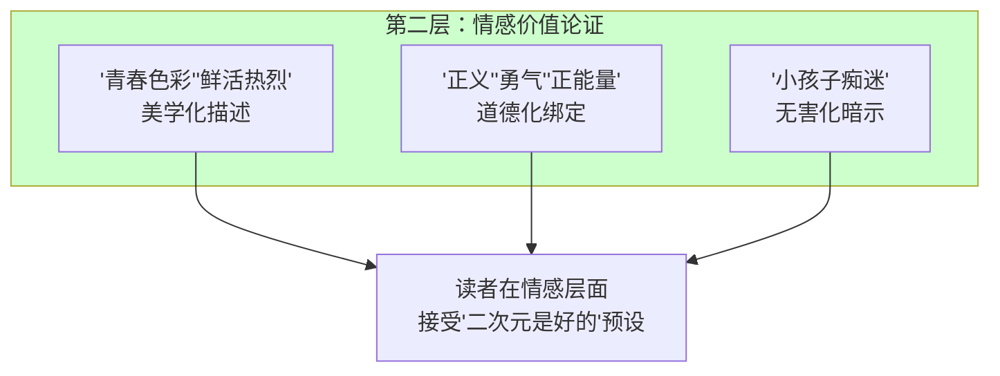

**图2：宣传论证的第二层——情感价值论证的操作机制**

##### 第三层：经济功能论证——以“能赚钱”论证“正当性”

文章进一步论证二次元的经济价值：

> “在商业演出、社区汇演、文化宫文化展览里，二次元一直是吸睛王牌。高度还原的造型极具视觉吸引力，既能聚拢超高人气，帮商铺、场馆留住客源，也极大拓宽了大众的文娱边界。”

这一层使用“聚人气”“留住客源”“拓宽边界”等经济话语来论证二次元的正当性——其逻辑是“能赚钱=有价值”。这正是自然主义谬误的典型形式：从“存在”（市场大）直接推出“应当”（值得推崇），跳过“为什么”的价值论证。

其隐蔽的逻辑问题在于：
- 烟草、赌博同样“聚人气”“留客源”，但这不能论证其文化正当性
- “能赚钱”只能说明“有市场需求”，不能说明“文化价值”
- 将“商业成功”等同于“文化正当”，混淆了经济逻辑与文化逻辑

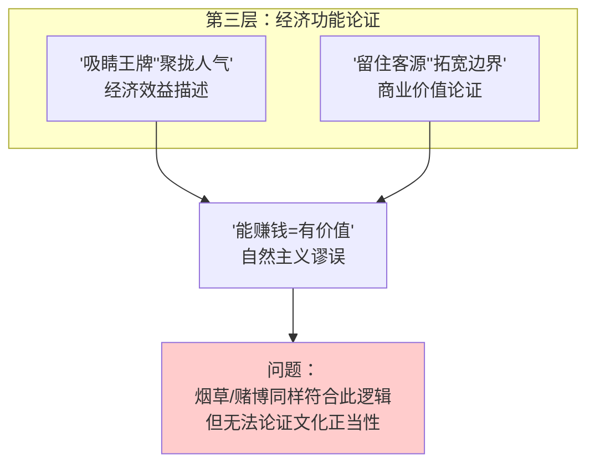

**图3：宣传论证的第三层——经济功能论证的逻辑谬误**

##### 第四层：文化价值论证——将视觉符号挪用等同于文化传承

文章最后强调二次元的“文化价值”：

> “不少动漫、cos创作根植于中国神话、古典小说、国风美学，把汉服刺绣、传统纹样、非遗技艺、上古传说融进角色设计。创作者以年轻人喜闻乐见的演绎方式，重新诠释古老故事，打破了大众眼中传统文化枯燥老旧的固有印象。”

这一层将视觉符号的挪用直接等同于“文化传承”——将“穿中国衣服”论证为“讲中国故事”，将“使用中国元素”论证为“传承中国文化”。

其隐蔽的逻辑问题在于：
- 视觉符号只是文化的“表皮”，而非其“骨骼”和“灵魂”
- 一个作品是否传承中国文化，不取决于它是否使用了中国视觉元素，而取决于它的叙事逻辑、情感驱动模式和价值判断框架是否植根于中国文化传统
- 将“视觉元素的出现”等同于“文化内核的传承”，是一种概念偷换

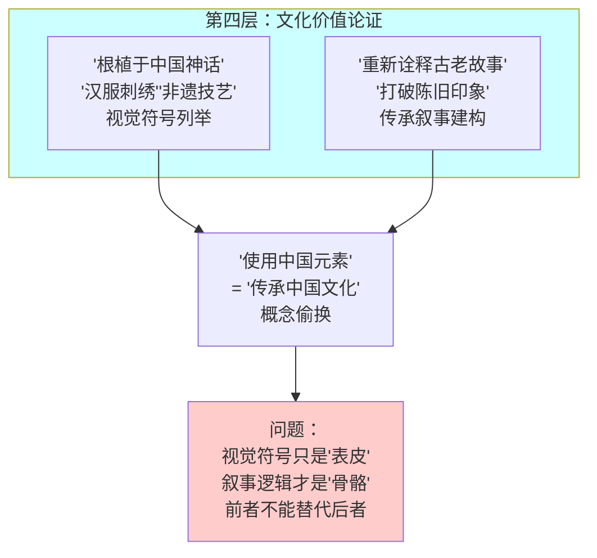

**图4：宣传论证的第四层——文化价值论证的概念偷换**

##### 结论层：从“个人改观”到“系统正当”的闭环

文章最终导向：

> “放下固有偏见，温柔接纳多元审美，让二次元作为新潮纽带，扛起传统文化传播的接力棒，让千年文脉借着青春热爱，在新时代绽放全新光彩。”

这一结论完成了从“个人改观”到“系统正当”的论证闭环——将“个人应该放下偏见”与“系统应该被接纳”混为一谈，以个人层面的宽容替代了系统层面的批判。

#### 2.2 宣传论证的完整流程图

综合以上四个层次，宣传的完整论证结构可以图示如下：


**图5：宣传论证的完整结构图**

#### 2.3 宣传的工业化生产机制

宣传话语的生产不是零散的个体行为，而是高度工业化的“话语生产线”。其生产机制可以从以下三个层面理解：

##### 2.3.1 模板化生产

宣传文章具有高度一致的“标准模板”：

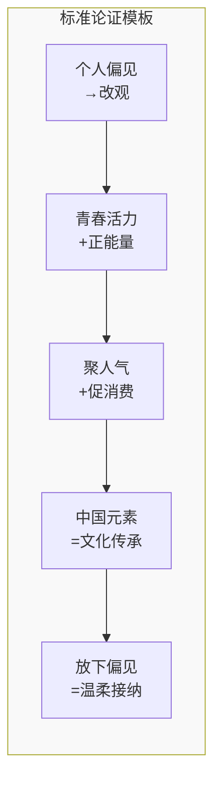

**图6：宣传文章的标准化论证模板**

这一模板的特征是：
- **固定的论证顺序**：个人→情感→经济→文化→结论
- **固定的修辞策略**：第一人称、情感化语言、宏大叙事
- **固定的结论导向**：始终导向“接纳”“包容”“支持”

##### 2.3.2 批量化复制

同一套模板被大量复制：
- 不同公众号发布内容高度相似的文章
- 同一篇文章被多次转载、改写
- 形成了“话语矩阵”——多个账号同时发布类似内容，制造“共识”的假象

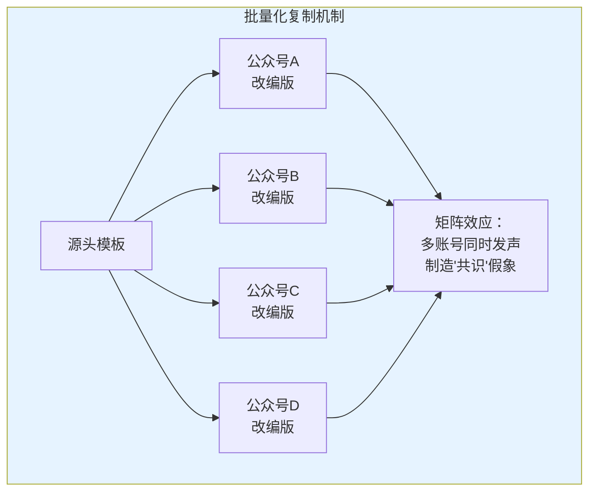

**图7：宣传话语的批量化复制机制**

##### 2.3.3 平台分发与算法助推

宣传文章通过以下渠道实现广泛传播：
- **公众号推送**：直接触达订阅用户
- **朋友圈分享**：社交关系链传播
- **算法推荐**：平台算法根据用户兴趣推送相关内容
- **跨平台分发**：同一内容在多个平台同步发布

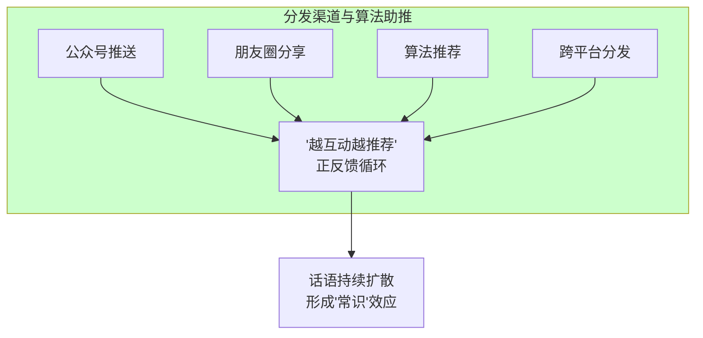

**图8：宣传话语的分发与算法助推机制**

#### 2.4 宣传的逻辑谬误精确分析

这类“宣传”文章包含以下隐蔽的逻辑谬误，每一种谬误都在完成特定的话语操作：

| 谬误类型 | 具体表现 | 逻辑形式 | 隐蔽功能 | 破解方法 |
| :--- | :--- | :--- | :--- | :--- |
| 概念偷换 | 政策扶持“产业形态”→认可“文化形态” | 将A（产业政策）等同于B（文化认可） | 使商业行为获得“国家认可”的伪合法性 | 区分“产业扶持”与“文化认可” |
| 自然主义谬误 | “用户多/市场大”→“文化正当” | 从“是”（事实）直接推出“应当”（价值） | 以“数字”的客观性掩盖价值判断的缺失 | 追问“用户多是否等于好” |
| 对象错置 | “国风IP成功”→“外来模板被认可” | 以对A的支持论证对B的认可 | 将替代方案的成功解读为被替代对象的成功 | 区分“被扶持的”与“被替代的” |
| 逻辑跳跃 | “有管控红线”→“未被禁止即被认可” | 从“未被禁止”直接推出“被认可” | 将“尚未禁止”解读为“已经认可” | 追问“未被禁止是否等于认可” |
| 概念收编 | 中国文化符号被纳入“二次元”范畴 | 将视觉符号的挪用等同于文化内核的传承 | 以表层符号掩盖深层结构的文化错位 | 区分“视觉符号”与“叙事逻辑” |

**概念偷换的精确分析：** 国家政策扶持的是“数字动漫产业的经济形态”（就业、税收、出口）与“国风原创的文化传播功能”（《哪吒》《长安三万里》等），文章将其偷换为对特定文化形态（包括其叙事模板、情感操作系统、审美标准）的全面认可。这一偷换的操作方式是：将政策文件中对“产业”的扶持，解读为对“文化内涵”的认可；将“允许存在”解读为“全面肯定”。其结果是使商业行为获得了“国家背书”的伪合法性。

**自然主义谬误的精确分析：** 其论证形式为：因为很多人消费（事实），所以它是好的（价值）。这一谬误的隐蔽性在于，它利用读者对“数字”的天然信任——数字被视为“客观的”“中性的”证据，从而掩盖了从事实到价值之间的逻辑鸿沟。问题在于：市场规模只能说明资本渗透的深度，不能说明文化产品对人的实际影响。一种文化形态可以“用户多、市场大”同时对消费者造成结构性的负面影响——烟草和赌博就是最直接的例证。

**对象错置的精确分析：** 国家扶持的是特定中式叙事底层的作品（如《哪吒之魔童降世》《长安三万里》等），这些作品的叙事底层是中式家庭伦理和历史传承，而非外来叙事模板。但文章以“国家扶持国风IP”来论证“国家认可外来文化形态”——前者是对中式替代方案的扶持，后者是对被替代对象的认可，论证对象根本错置。其逻辑等价于：以“国家扶持国产汽车”来论证“国家认可进口汽车”。

**逻辑跳跃的精确分析：** “管控红线存在（禁止特定内容）→未被禁止即被认可”。这一跳跃忽略了两点：其一，政策滞后性——国家可能尚未识别某种文化形态的系统性后果，这需要时间进行研究和评估；其二，替代策略优先性——国家可能选择“扶持替代方案”而非“直接禁止”，这是一种更温和、更有效的产业政策策略。将“尚未禁止”解读为“已经认可”，是一种典型的过度推断。

**概念收编的精确分析：** 将“汉服刺绣、传统纹样、非遗技艺、上古传说”等中国文化符号纳入“二次元”概念范畴，其隐蔽操作是将“视觉符号的挪用”等同于“文化内核的传承”。这一操作分三步完成：首先，抹掉区别——将各种来源不同、意义不同的文化符号统一归入“二次元”范畴；其次，偷走命名权——个体声称的“汉服爱好者”被重新定义为“泛二次元消费者”；最后，完成收编——一切青年文化消费都被纳入统一的剩余价值提取体系。

#### 2.5 宣传的理论定位与功能分析

在本文的分析框架中，“宣传”是特定代理结构的话语机器的日常运转。其本质功能是为资本的剩余价值提取提供文化合法性和道德安全感。

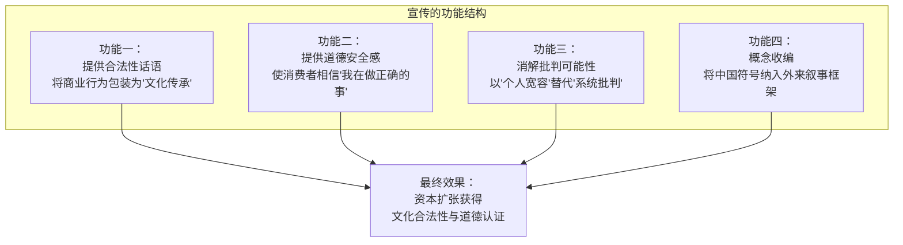

**图9：宣传的四大功能及其最终效果**

它完成了以下话语操作：

| 操作 | 具体内容 | 社会功能 | 操作机制 |
| :--- | :--- | :--- | :--- |
| 将“消费”重新编码为“文化传承” | 使消费者相信“我花的每一分钱都是在支持文化” | 降低消费的心理防御，增加消费的道德满足感 | 以“文化”替代“商品”的命名 |
| 将“视觉符号”等同于“文化内核” | 使“穿中国衣服”被论证为“讲中国故事” | 以表层符号掩盖深层结构的文化错位 | 以可见的“表皮”替代不可见的“骨骼” |
| 将“个人改观”论证为“系统正当” | 使“我改观了”被解读为“系统没问题” | 以个人经验替代结构性分析，消解批判的可能性 | 以微观经验替代宏观分析 |
| 将“合理引导”作为结论而不论证 | 回避“谁来引导”“引导什么”“引导到哪去” | 以假设性的解决方案替代对现有问题的分析 | 以未来可能性替代现实分析 |

这些操作的共同效果是：将一个以特定叙事语法为内核、以金融化机制为利润提取方式的文化工业，包装成一个“传承文化”“充满活力”“值得支持”的正面形象。消费者在阅读这类文章后，不仅减少了消费的心理负担，而且获得了“我在做正确的事”的道德满足感——这正是资本所需要的“道德认证”。


### 三、文化宣传：道德认证的生产

“文化宣传”是“宣传”的升级版——它不仅是“正名”，更是“赋予道德光环”。如果说一般宣传是在说“这个产业是好的”，那么文化宣传则是在说“消费这个产业是爱国的”。

#### 3.1 文化宣传/爱国叙事的话语分析

“文化宣传”在此指将特定文化产业（尤其是“国产二游”）与“国风”“非遗”“文化自信”“爱国主义”“文化输出”等宏大话语绑定的叙事实践。其典型话术包括：

- “二次元是传承文脉的绝佳创新载体”
- “国产二游正在向世界输出中国文化”
- “消费二游就是文化自信”
- “批评某游戏就是攻击国产游戏、就是不爱国”
- “某游戏让世界看到中国文化”

这些话语在传播中完成了以下认知操作：

| 操作类型 | 具体内容 | 操作机制 | 认知效果 |
| :--- | :--- | :--- | :--- |
| 政治化 | 将商业批评上升为政治立场问题 | 利用特定道德话语的高位取消批评的合法性 | 使批评者处于“道德劣势” |
| 标签化 | 对批评者扣上特定政治标签 | 以标签替代论证，以身份审判替代内容讨论 | 使批评者的发言被预先否定 |
| 身份否定 | 取消批评者的发言资格 | 将“批评”等同于“背叛”，使批评者被排除出“有资格说话”的范畴 | 使批评者的存在被系统排除 |
| 双重标准 | 指责其他游戏时使用特定标签，自己被指责时称“被网暴” | 选择性应用标准，使自身始终处于“正确”位置 | 使自身免于被同样的标准审视 |

#### 3.2 “爱国主义”作为消解性话语的运作机制

在本文的分析框架中，“爱国主义”在此语境中已从“国家主权的政治概念”被偷换为“消费行为的道德认证”。其运作机制可分为三个递进层面：

**第一层：动机怀疑——预设批评者的恶意。** 当批评者发表对特定游戏或产业的负面意见时，首先被质疑的是“你是什么成分？”——预设批评者的恶意动机（“你是不是对家派来的？”“你是不是境外势力？”），而非讨论批评的内容本身。这一操作的典型句式是“你先证明你不是……再说话”——将“证明自己清白”设为发言的前提条件，从而将批评者置于“有罪推定”的防御位置。其逻辑结构为：先假设批评者有罪，再要求批评者自证无罪——这是一种无法完成的任务，因为任何自证都会被进一步质疑。


**图10：消解性话语的第一层——动机怀疑的操作流程**

**第二层：立场前置化——将批评预设为“立场错误”。** 将批评行为与特定政治标签直接挂钩——“骂某游戏就是攻击国产游戏”“攻击国产游戏就是不爱国”。这一操作取消了批评者“提出建设性批评”的可能性，因为任何批评在出发前已被定义为“立场错误”。其逻辑结构为：预设结论（批评者不爱国）→将批评行为归入该预设→以预设否定批评。这是一个封闭的循环论证，任何试图反驳的行为都只会被进一步纳入该循环——“你越解释，越证明你心虚”。


**图11：消解性话语的第二层——立场前置化的封闭循环**

**第三层：身份否定——取消批评者的发言资格。** 通过“开除二籍”（“你不是真粉”“你不配做二次元”）完成对批评者的最终排除——不仅取消其发言资格，更取消其圈层身份。当“二次元”身份被与特定政治话语绑定后，“开除二籍”就不仅仅是将某人排除出兴趣圈子，而是将其标记为“政治不正确”的局外人。这一操作的终极效果是：批评者不仅被剥夺了“说话的权利”，还被剥夺了“存在的合法性”。


**图12：消解性话语的第三层——身份否定的终极排除**

这三种操作的共同结构是：**不讨论“命题真伪”，只讨论“说话者是否配说话”。** 这正是本文所定义的“消解性话语”在政治化语境中的精确应用。其核心功能是取消对方的发言资格——不是证明对方“说错了”，而是证明对方“不配说”。当“爱国”被用作消解工具时，任何批评者都可以被简单地打发掉——“你不爱国，所以你的话不用听。”

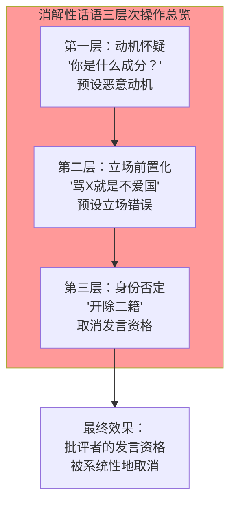

**图13：消解性话语的三层次操作总览**

#### 3.3 “文化输出”的实证检验与结构分析

“文化输出”叙事面临以下实证检验的挑战，这些挑战揭示了“文化输出”话语与事实之间的结构性断裂：

**第一，输出内容的结构性审视。** 网络社区中存在一个被“文化输出”话语掩盖的观察：某些“国产二游”的场景设计被批评者指出“除了出现了中文，大量内容呈现其他文化风格特征”——“给其他文化套一层中国皮”。另有讨论指出，某些国产游戏做得最用心的往往是外来风格区域，而本土文化映射区域则更像是按照外来范式进行的“改编”——“连作为国产游戏做的本土文化映射的那个区域都更像是按照外来范式来的，最上心的反倒是外来风格区域”。

这些观察指向了一个结构性问题：如果“文化输出”输出的仅仅是视觉符号（服饰、建筑、节日），而叙事底层（情感驱动模式、价值判断框架、身份认同锚点）完整承袭外来文化模板，那么输出的本质是什么？

| 输出层面 | 表面内容 | 实际内容 | 判断 | 关键问题 |
| :--- | :--- | :--- | :--- | :--- |
| 视觉层 | 传统服饰、古建筑、传统节日 | 视觉符号——可被任意替换的“皮肤” | 可见的“本土性” | 这些符号是否承载了本土的叙事逻辑？ |
| 叙事层 | 表面上的本土故事 | 外来叙事语法——特定的情感驱动、价值判断、意义生成模式 | 不可见的“外来性” | 故事的内核是本土的还是外来的？ |
| 情感层 | “文化自豪” | 外来情感操作系统——被感知为“母语”而非“外来” | 被体验为“自然” | 消费者的情感反应模式是否已被替换？ |
| 经济层 | “文化传播” | 金融化收割模型——利润流向特定资本方 | 被掩盖的“利润” | “文化传播”是否只是利润最大化的包装？ |

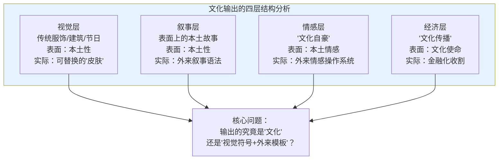

**图14：“文化输出”的四层结构分析**

**第二，“文化摘取”而非“文化传承”的精确区分。** 真正意义上的文化传承应包含叙事逻辑的接续——即情感反应模式、价值判断框架、身份认同锚点的代际传递。视觉符号只是文化的“表皮”，而非其“骨骼”和“灵魂”。当文化输出只停留在视觉符号层而叙事底层承袭外来模板时，其本质是“文化摘取”——摘取了视觉符号的表皮，但内核仍然是外来文化模板。

**真正的文化输出不是让世界看到“传统服饰”，而是让世界理解“为什么传统服饰在本土文化的情感结构中拥有这样的位置”**——而后者恰恰是外来叙事语法所无法承载的，因为外来叙事语法对“位置”的理解是依据外来文化逻辑建构的。

#### 3.4 资本跨过红线时的沉默——工具化的实证

更为反讽的是，当特定商业行为本身涉及特定历史问题时，那些高喊特定政治话语的极端粉丝却往往保持沉默，甚至为其辩护。这一现象揭示了“爱国主义”作为工具的实质——它不是一种立场，而是一种武器。

2026年1月，某知名动漫作品与另一部曾涉及历史问题的作品进行联动，在中国引发强烈抗议。涉事作品的反派角色命名涉及对历史受害者的侮辱性指称——这一指称在历史学界和公众中已被广泛认定为对特定历史事件的严重不尊重。联动方的回应被批评为“轻描淡写”——评论指出，与明确涉及历史问题的作品合作本身就是一种表态，“所谓‘友好交流’的说法，在沉重的历史真相面前显得苍白无力”。

另有评论指出，某国际知名IP与特定历史场所深度绑定，“把供奉特定历史人物的场所包装成打卡点、联名场景，用萌系形象消解血腥历史，让年轻玩家下意识觉得：那不过是个普通地标，特定历史人物不过是‘历史人物’”。这一操作通过“萌系化”消解了历史场所的严肃性，将不应被正常化的场所“日常化”了。

**这揭示了一个结构性事实：当资本本身跨过特定红线时，同一批高喊特定政治话语的极端粉丝却往往保持沉默，甚至反过来为资本辩护——指责批评者“上纲上线”“破坏友好交流”。** 特定政治话语不是他们的立场，而是他们用来压制批评者的工具——其使用范围仅限于“压制对特定资本的批评”，而不包括“监督资本是否真的符合特定价值观”。

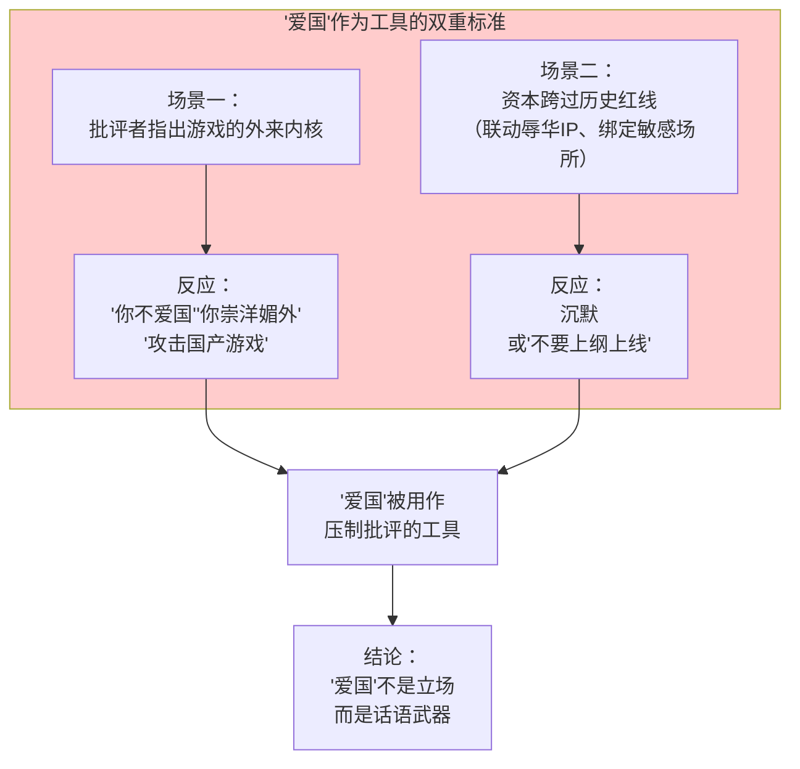

**图15：“爱国”作为工具的双重标准结构**

这一发现印证了本文的核心判断：**特定政治话语在此语境中已被偷换为“消费行为的道德认证”——它不是一种政治立场，而是一种话语武器，其使用是有选择性的：对批评者使用，对资本宽容。**


### 四、出警：边界巡逻的日常机制

#### 4.1 现象描述与类型学分析

“出警”指圈内激进分子以“维护社区环境”或“维护圈层纯洁性”为名，对“违反规矩”的他人进行道德审判、公开指责、群体围攻的行为。其名称来源于网络用语“警察”的戏谑化使用——将“执法”行为戏称为“出警”，但其行为本身已从“网络梗”演变为具有实际约束力的社会控制机制。


**图16：出警现象的六种类型及其逻辑**

#### 4.2 出警对象的三层扩张

出警的“执法”范围已从圈内扩展到圈外，形成了一个三层扩张的结构：

| 对象类型 | 典型场景 | 逻辑 | 扩张路径 |
| :--- | :--- | :--- | :--- |
| 圈内“不规范”者 | 穿山寨服饰、使用非正版资源、磕不被接受的CP组合 | “维护圈子规矩”——将消费行为的“正确性”作为身份准入标准 | 从“建议”到“强制” |
| 圈外“越界”者 | 使用二次元头像的圈外人、在相关话题下提问的普通人 | “圈外人不得染指”——将圈层身份视为需要被保护的“稀缺资源” | 从“内部管理”到“外部排斥” |
| 表达不同意见者 | 批评游戏设计、质疑剧情设定、指出资本问题 | “开除二籍”——将“不同意见”等同于“身份背叛” | 从“观点争论”到“身份消灭” |


**图17：出警对象的三层扩张结构**

#### 4.3 出警的理论定位与功能分析

在本文的分析框架中，出警对应着特定群体（即前文定义的“伪军”）的日常边界巡逻：

| 分析概念 | 出警行为的具体对应 | 机制说明 |
| :--- | :--- | :--- | :--- |
| 特定群体的维护功能 | 以“维护社区环境”为名，实际维护特定叙事模板的绝对话语权 | 通过“执法”确保所有人遵循特定表达方式 |
| 除籍机制 | 通过“开除二籍”标记“纯度不足”的参与者 | 通过身份否定排除“不兼容”者 |
| 消解性话语的操作化 | 不反驳内容，直接标签化为“较真”“杠精”“不爱国” | 通过标签取消对方的发言资格 |
| 统计学锁定的自动维护 | 通过惩戒“异类”，确保特定表达方式保持默认标准地位 | 通过惩罚维持“正常”的定义 |

出警的功能是双重的，每一重都有其特定的运作机制：

**对内的秩序维持：** 确保所有成员遵循特定表达方式（情感-共鸣型）的规范。任何偏离此规范的发言——无论是逻辑追问、理性分析还是结构性批判——都被标记为“异常”，需要通过“执法”予以纠正或清除。这种“执法”不需要明确的规则文本，而是通过反复的“出警”实践来确立和强化“什么是可以被接受的表达方式”。每一次出警都在向所有成员发送信号：“这就是规矩，违反它就会有后果。”

**对外的边界构筑：** 通过惩戒“越界”的圈外人，维持圈层的“纯洁性”和身份认同的排他性。出警圈外人不是为了“教育”他们，而是为了向所有潜在“越界者”发送一个信号：**“这里不欢迎你。”** 这种边界构筑功能使圈层得以保持“准封闭”状态，从而维持其身份认同的稀缺感和优越感——当进入的门槛越高，圈内身份的价值就越高。

出警的“结构性必然性”在于：**在统计学锁定的社群中，任何“不同”都自动被视为“威胁”，因为“不同”的存在本身就在质疑“默认标准”的普遍性。** “不同”的存在意味着“默认标准”不是唯一的、自然的选择，而只是众多可能性之一——这一认识本身就动摇了“默认标准”的合法性。因此，出警不是个别“激进分子”的个人选择，而是系统维持自身稳定性的自动输出——就像生物免疫系统会主动攻击任何被视为“非己”的物质。当“出警”者说“你破坏了氛围”时，他真正在说的是：“你的存在方式质疑了我的存在方式的正当性——所以你必须被清除。”


### 五、偷拍争议：话语权的越界与边界扩张

#### 5.1 现象描述与争议场景分析

“偷拍争议”指在漫展等公共空间，围绕“未经许可拍摄”是否构成“偷拍”的持续争论。搜索结果显示，以下场景常被直接定性为“偷拍”：

| 场景 | 被定性为“偷拍”的原因 | 当事人的辩解 | 争议焦点 |
| :--- | :--- | :--- | :--- |
| 游客在漫展现场拍摄角色扮演者 | 未事先征求同意，直接举起手机拍摄 | “不知道不能随便拍别人”“公共场合拍照记录，不是挺正常的事吗？” | 公共场合的拍摄是否需要事先同意？ |
| 路人发布偶遇角色扮演者的原图 | 没有修图就公开发布，被指“不尊重付出” | “公共场合拍照记录” | 发布“生图”是否构成侵权？ |
| 摄影师使用闪光灯拍照 | 被指“偷拍”，因为当事人称能发现但摄影未询问 | “虽然是偷拍，但实际上是正大光明的拍。当事人绝对是能发现的。” | “可见性”是否能替代“同意”？ |

#### 5.2 “偷拍”定义泛化的三层次操作

“偷拍”已经从“侵犯隐私的违法行为”被重新定义为“违反圈层礼仪的行为”。这一概念转换通过以下三个层次的操作完成：

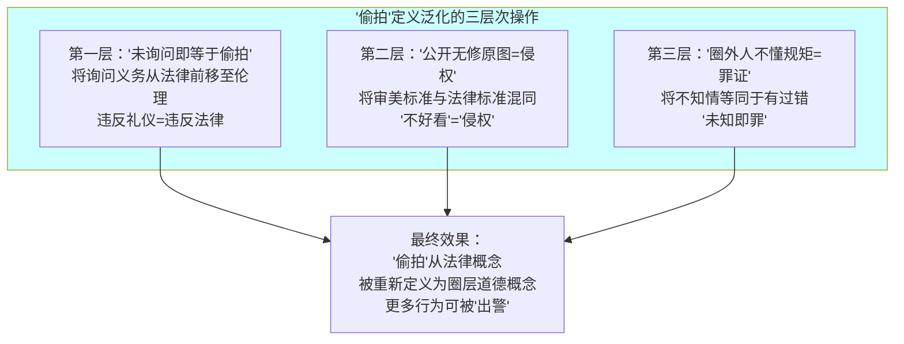

**图18：“偷拍”定义泛化的三层次操作**

#### 5.3 “双重锁定”的精确分析

圈外人“问了”被骂不懂，“不问”被骂偷拍——无论怎么做都被定义为“违规”。这与前文描述的压迫性正当化循环结构完全一致：被审视者的所有可能行为都被预先解码为“错误”。

| 行为选择 | 系统解码 | 结果 | 解码机制 |
| :--- | :--- | :--- | :--- |
| 主动询问 | “你连这都要问，你还是不是圈内人？” | 被嘲笑“不懂规矩”——“问”本身就是不懂的表现 | 将“求知”重新编码为“无知” |
| 不问直接拍 | “你未经许可就拍，你就是偷拍” | 被定性为“偷拍”——“不问”是违法的表现 | 将“不知”重新编码为“故意” |
| 问了但问的方式不对 | “你问的方式不对，明显不够尊重” | 被定性为“不尊重”——“怎么问”都是错的 | 将“方式差异”重新编码为“态度问题” |

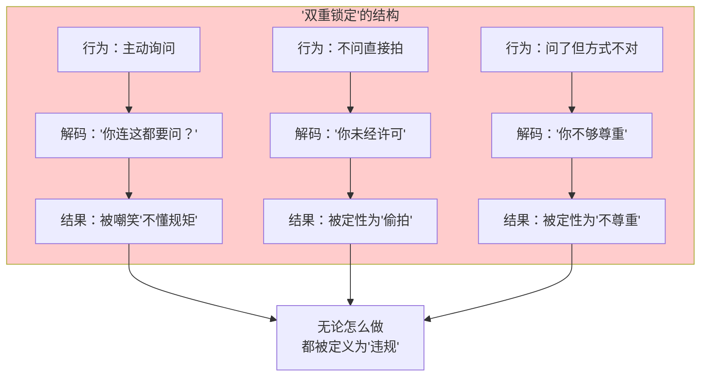

**图19：“双重锁定”的结构——被审视者无路可走**

这种“双重锁定”使被审视者陷入无法逃脱的困境：无论采取何种行动，都会被预先定义的框架判定为“错误”。其功能是使被审视者永远处于“需要自证清白”的防御位置，而审视者永远处于“有权审判”的进攻位置。这种权力不对称是“双重锁定”的核心——它不是为了“解决问题”，而是为了“维持审判权”。


### 六、暴力清除：终极手段的运作机制

#### 6.1 现象描述与组织结构分析

“暴力清除”在此指非法获取并公开他人隐私信息（姓名、住址、电话、身份证号、社交账号等），实施大规模网络暴力的行为。其典型代表是“仙家军”——一个2021年8月成立的网络暴力组织。

| 维度 | 具体内容 | 说明 |
| :--- | :--- | :--- |
| 成立时间 | 2021年8月 | 起源于特定视频平台的话题社区 |
| 组织规模 | 核心层约260人，外围活跃成员约400至500人 | 还有更广泛的参与群体 |
| 组织架构 | 分层级即时通讯群组管理（外围成员—核心成员—管理层三级） | 具有明确的指挥链和分工 |
| 技术手段 | 社会工程学数据库、技术手段、购买信息 | 通过境外加密通讯工具组织行动 |
| 活动平台 | 视频平台、即时通讯群组、网络论坛 | 跨平台活动，难以追踪 |
| 核心手段 | 非法获取并公开隐私信息、公开指责、网络暴力 | 从信息泄露到公开羞辱的完整链条 |
| 攻击范围 | 从游戏圈扩展至非游戏领域 | 攻击对象不限于游戏相关人士 |

其内部角色分工如下：

| 角色 | 职能 | 具体工作 |
| :--- | :--- | :--- |
| 核心管理层 | 统筹“反黑”行动，发布攻击目标 | 制定攻击计划，协调各方行动 |
| “骑士” | 负责评论区控评、舆论引导 | 在目标评论区维持特定声音的主导地位 |
| “后期” | 制作视频、动态进行“宣传” | 将攻击行为包装为“正义行动” |
| 情报员 | 潜伏各社区搜集“敌情”，寻找开盒目标 | 在目标社区收集信息，识别“异见者” |
| 外围参与者 | 配合行动、转发扩散、参与团建 | 扩大攻击的覆盖面和影响力 |

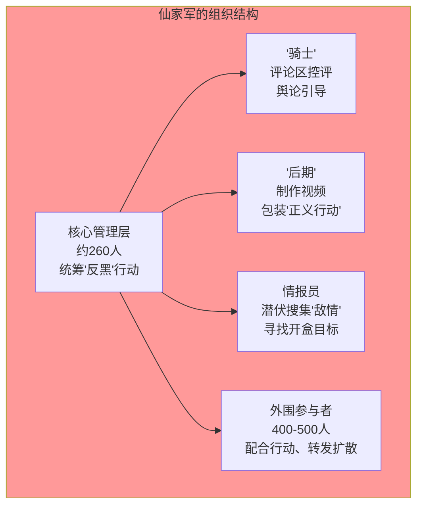

**图20：仙家军的组织结构与角色分工**

#### 6.2 技术手段与数据规模

“暴力清除”行为的技术手段和数据规模已达到惊人的程度：

**第一，数据来源的规模化——社工库的形成与运作。** 非法获取个人信息的主要来源是所谓的“社工库”——通过整合多个数据泄露源形成的公民个人信息数据库。这些数据泄露源包括：网站数据库被攻击后的数据流出、内部人员违规出售数据、钓鱼网站骗取的个人信息、以及各类登记信息的数据化。2025年某地检察机关披露的系列案件中，涉案“社工库”网站数据库包含**1.7亿余组**公民个人信息，访问量达30余万人次。这一数据规模意味着：理论上，任何一个活跃网民的个人信息都可能存在于某个“社工库”中。

**第二，非法获取的规模化——犯罪产业链的形成。** 该系列案件的主犯非法获取**6亿余组**公民个人信息，另一名主犯获取**3亿余组**。这些数据通过加密通讯工具进行交易和传播，形成了一条完整的黑色产业链——从数据窃取、数据整合、数据交易到数据应用，每个环节都有专门的参与者。

**第三，传播链条的组织化——指挥系统的建立。** 通过境外加密通讯工具设立群组，群组成员最多达**10万余人**。这些群组不仅是信息交易场所，更是组织网暴行动的指挥中心——攻击目标、攻击方式、攻击时间都在群组内协调。这种组织化程度使得“暴力清除”不再是零散的个体行为，而是有组织、有计划的系统性暴力。

```mermaid
graph TD
    subgraph T["暴力清除的技术与规模"]
        T1["社工库<br>1.7亿余组个人信息<br>30余万访问量"]
        T2["非法获取<br>主犯6亿余组<br>另一主犯3亿余组"]
        T3["传播链条<br>境外加密通讯<br>群组最多10万余人"]
    end
    
    T1 --> T4["暴力清除的<br>规模化、组织化运作"]
    T2 --> T4
    T3 --> T4
    
    style T fill:#ff6666
```

**图21：暴力清除的技术手段与数据规模**

#### 6.3 从出警到暴力清除的完整升级路径

从“出警”到“暴力清除”的升级路径，呈现出一个清晰的五级梯度：

| 阶段 | 行为模式 | 特征 | 关键转折 |
| :--- | :--- | :--- | :--- |
| 第一阶段：话语消解 | “你太较真了”“你不够爱”“你懂什么” | 取消发言资格——“你不配说话” | 从“讨论内容”转向“讨论说话者” |
| 第二阶段：身份否定 | “开除二籍”“你不是真粉” | 取消圈层身份——“你不属于这里” | 从“取消发言权”转向“取消存在权” |
| 第三阶段：政治化标签 | “你不爱国”“你崇洋媚外” | 取消道德资格——“你是坏人” | 从“圈层排斥”转向“道德审判” |
| 第四阶段：网络暴力 | 公开指责、群体围攻、刷屏骚扰 | 攻击社会关系——“让你社死” | 从“话语暴力”转向“社会暴力” |
| 第五阶段：暴力清除 | 非法获取并公开隐私信息、线下骚扰 | 攻击肉身与安全——“让你消失” | 从“社会暴力”转向“物理暴力” |

```mermaid
graph TD
    subgraph G["从出警到暴力清除的五级升级路径"]
        G1["第一阶段：话语消解<br>'你太较真了'<br>取消发言资格"]
        G2["第二阶段：身份否定<br>'开除二籍'<br>取消圈层身份"]
        G3["第三阶段：政治化标签<br>'你不爱国'<br>取消道德资格"]
        G4["第四阶段：网络暴力<br>挂人/围攻/刷屏<br>攻击社会关系"]
        G5["第五阶段：暴力清除<br>非法获取并公开隐私<br>攻击肉身与安全"]
    end
    
    G1 --> G2 --> G3 --> G4 --> G5
    
    style G fill:#ffcccc
```

**图22：从出警到暴力清除的五级升级路径**

这一梯度揭示了一个关键事实：**暴力清除不是突然出现的，而是从话语消解开始、经过逐步升级才到达的终点。** 每一个阶段都在为下一阶段的暴力提供合法性和行动基础——“你太较真”为“开除二籍”提供了理由，“开除二籍”为“政治化标签”铺平了道路，“政治化标签”为网暴和暴力清除了道德障碍。每一步的变化都足够小，以至于参与者不会感到自己“越过了红线”——这就是“伦理滑坡”的运作机制。


### 七、五重现象的联动机制与完整闭环

#### 7.1 五重现象的关系总览

五重现象构成一个完整的“话语—暴力—合法性”三环锁定结构：

```mermaid
graph TD
    subgraph A["第一环：合法性生产"]
        A1["一般宣传<br>用'繁荣''文化传承'<br>为产业提供合法性话语"]
        A2["文化宣传/爱国叙事<br>用特定政治话语<br>为消费提供道德认证"]
    end
    
    subgraph B["第二环：话语权维持"]
        B1["出警<br>用圈内规矩'执法'<br>清除'不兼容'声音"]
        B2["偷拍争议<br>将'未知'重新定义为'罪'<br>扩张'可出警'的范畴"]
    end
    
    subgraph C["第三环：暴力执行"]
        C1["暴力清除（开盒）<br>用非法曝光<br>彻底毁灭异见者"]
    end
    
    A1 --> B1
    A2 --> B1
    B1 --> C1
    B2 --> C1
    C1 -.->|"强化合法性"| A1
    C1 -.->|"强化道德认证"| A2
    
    style A fill:#ffffcc
    style B fill:#ffcccc
    style C fill:#ff6666
```

**图23：“话语—暴力—合法性”三环锁定结构总览**

三环之间的连接关系如下：

| 连接方向 | 机制 | 具体内容 |
| :--- | :--- | :--- |
| 合法性生产 → 话语权维持 | 提供理由 | 合法性生产为话语权维持提供“为什么应该维持”的理由——“我们在维护文化传承” |
| 话语权维持 → 暴力执行 | 提供识别 | 话语权维持为暴力执行提供“谁是异类”的识别——出警已经标记了“需要被清除”的目标 |
| 暴力执行 → 合法性生产 | 强化说服力 | 暴力执行反过来强化合法性生产的说服力——“看，那些批评者果然是有问题的，否则为什么会被清除？” |

#### 7.2 完整的升级路径与反馈循环

各环节之间存在明确的升级路径和反馈循环：

```mermaid
graph TD
    subgraph L["完整的升级路径与反馈循环"]
        L1["合法性话语被质疑"]
        L2["启动道德认证<br>（爱国叙事）"]
        L3["道德认证被质疑"]
        L4["启动出警<br>（话语权维持）"]
        L5["出警失效"]
        L6["启动暴力清除<br>（终极手段）"]
    end
    
    L1 --> L2 --> L3 --> L4 --> L5 --> L6
    
    L6 -.->|"反馈：强化合法性"| L1
    
    style L fill:#e6f3ff
```

**图24：完整的升级路径与反馈循环**

这一升级路径揭示了系统的一个重要特征：**它不是一个静态的结构，而是一个自动升级的防御系统。** 每一层防御被突破时，系统会自动启动更高层级的防御——从话语到身份到道德到暴力。这一升级不需要任何人的“策划”或“指令”，而是系统在特定条件下的自动反应。

#### 7.3 五重现象的“同一性”证明

五重现象之所以是“同一套系统的五个输出端口”，基于以下结构性共性：

| 共性维度 | 具体表现 | 证明 |
| :--- | :--- | :--- |
| 共享同一维护对象 | 特定叙事模板+特定代理结构的文化工业复合体 | 所有现象都指向维护特定文化模板的主导地位 |
| 共享同一目标 | 维持特定表达方式（情感-共鸣型）的话语权垄断 | 所有现象的最终效果都是排除“不同”的声音 |
| 共享同一执行逻辑 | 从“话语消解”到“暴力清除”的连续性升级 | 五现象分布在从话语到暴力的连续谱系上 |
| 共享同一后果 | 排除另一种表达方式（逻辑-理性型）的合法表达空间 | 所有现象的最终结果都是使“不同”难以存在 |
| 共享同一受益结构 | 所有行为最终服务于资本利润提取的稳定性 | 话语权垄断保障了利润提取的可持续性 |

```mermaid
graph TD
    subgraph I["五重现象的'同一性'证明"]
        I1["共享同一维护对象<br>特定叙事模板+特定代理结构"]
        I2["共享同一目标<br>维持特定表达方式的话语权垄断"]
        I3["共享同一执行逻辑<br>从话语消解到暴力清除的连续性升级"]
        I4["共享同一后果<br>排除另一种表达方式的合法空间"]
        I5["共享同一受益结构<br>服务于资本利润提取的稳定性"]
    end
    
    I1 --> I6["结论：<br>五重现象是同一套系统的<br>五个协同输出端口"]
    I2 --> I6
    I3 --> I6
    I4 --> I6
    I5 --> I6
    
    style I fill:#ccffcc
```

**图25：五重现象的“同一性”证明**

这些共性表明：五重现象之间的关联不是“巧合”或“松散的联系”，而是“结构性必然”——它们在同一个系统逻辑下生成，服务于同一个系统目标，遵循同一个升级路径。


### 八、法律伦理边界分析

#### 8.1 五重现象的法律伦理定位

| 现象 | 法律属性 | 伦理属性 | 主要责任方 | 关键判断 |
| :--- | :--- | :--- | :--- | :--- |
| 一般宣传 | 合法（受宪法言论自由保护） | 话语引导，存在隐性的商业动机与认知操控 | 公众号运营者、资本方 | 合法但不一定正当 |
| 文化宣传/爱国叙事 | 合法（但构成认知引导） | 将商业行为政治化，以宏大叙事掩盖资本逻辑 | 极端粉丝、意见领袖、特定资本 | 合法但构成伦理争议 |
| 出警 | 言语暴力可能侵犯名誉权 | 圈层规则凌驾于公共法律之上 | 出警者、特定群体 | 边缘合法至轻微违法 |
| 偷拍争议 | 模糊地带（取决于具体行为是否侵犯隐私权） | 圈层规则与公共伦理的冲突 | 争议双方 | 法律模糊，伦理争议 |
| 暴力清除 | **违法**（侵犯公民个人信息罪等） | 明确的犯罪行为，已受法律打击 | 极端组织 | 明确违法 |

#### 8.2 从话语到暴力的伦理滑坡

五重现象的连续谱系揭示了一个重要的伦理问题：**从“合法”到“违法”之间不存在截然断裂的鸿沟，而是一个渐进的“伦理滑坡”。**

| 阶段 | 行为 | 法律状态 | 伦理状态 | 关键转折 |
| :--- | :--- | :--- | :--- | :--- |
| 1 | 发表“二次元是文化传承”的观点 | 合法 | 话语引导 | 从“表达”到“引导” |
| 2 | 将“批评游戏”等同于“不爱国” | 合法（但构成认知引导） | 话语操控 | 从“引导”到“操控” |
| 3 | 公开指责批评者为“杠精”“较真” | 边缘（可能侵犯名誉权） | 话语暴力 | 从“操控”到“暴力” |
| 4 | 公开“挂人”、号召群体围攻 | 可能违法（侮辱、诽谤） | 话语暴力升级 | 从“话语”到“社会” |
| 5 | 非法获取并公开隐私信息 | 违法（侵犯公民个人信息罪） | 物理暴力 | 从“社会”到“物理” |

```mermaid
graph TD
    subgraph S["从话语到暴力的伦理滑坡"]
        S1["阶段1：话语引导<br>合法<br>'二次元是文化传承'"]
        S2["阶段2：话语操控<br>合法<br>'批评=不爱国'"]
        S3["阶段3：话语暴力<br>边缘合法<br>'杠精''较真'"]
        S4["阶段4：社会暴力<br>可能违法<br>挂人/围攻"]
        S5["阶段5：物理暴力<br>违法<br>非法获取并公开隐私"]
    end
    
    S1 --> S2 --> S3 --> S4 --> S5
    
    style S fill:#ffcccc
```

**图26：从话语到暴力的伦理滑坡**

这一滑坡的每一级都在为下一级提供合法性和心理准备：

- “发表观点”为“话语操控”提供了自信——我是在表达我的看法
- “话语操控”为“话语暴力”提供了正当性——我是在维护正义
- “话语暴力”为“公开挂人”提供了理由——这个人需要被曝光
- “公开挂人”为“暴力清除”扫清了道德障碍——这个人不配拥有隐私

**伦理滑坡的关键机制是“渐进性”——每一步的变化都足够小，以至于参与者不会感到自己“越过了红线”。** 当一个人从“这个游戏很好”开始，经过“批评这个游戏就是不爱国”再到“公开批评者的隐私信息”，每一步的跨越都显得“理所当然”——因为前一步已经为后一步铺平了道路。


### 九、结论

#### 9.1 主要发现

**第一，五重现象不是独立的社会问题，而是同一套文化-金融复合体的五个协同输出端口。** 一般宣传为它提供合法性话语，文化宣传为它提供道德认证，出警维持它的话语权垄断，偷拍争议扩张它的执法范围，暴力清除则是它最后的暴力防线。五者协同运转，构成一个自我维持的话语权垄断闭环。

**第二，五重现象构成一个“话语—暴力—合法性”的三环锁定结构，各环节之间存在明确的升级路径。** 当合法性话语被质疑时，启动道德认证（爱国叙事）；当道德认证被质疑时，启动话语权维持（出警）；当话语权维持失效时，启动暴力清除。这是一个自动运转的、层层升级的防御系统——其升级不依赖任何人的“策划”，而依赖系统的结构惯性。

**第三，特定群体（即“伪军”）与“爱国主义”叙事的耦合，是这套系统在特定语境下的独特特征。** “爱国”在其中被工具化为消解性话语的政治化版本——不讨论批评的内容，只讨论批评者的“爱国立场”。当“批评”被等同于“不爱国”时，批评的合法性就被取消了。更为反讽的是，当资本本身跨过特定红线时，同一批极端粉丝却往往保持沉默——“爱国”不是他们的立场，而是他们用来压制批评者的工具。

**第四，暴力清除是这套系统的“内置暴力模块”。** 它不是在“出格”时才会出现，而是在“系统需要”时自动激活——当话语消解（“你太较真了”）、身份否定（“开除二籍”）、道德指控（“你不爱国”）都无法让异见者闭嘴时，暴力清除便作为最终手段登场。155人被查处不是“个别极端分子”的偶然事件，而是这套系统在暴力链条末端必然产出的违法犯罪行为。

**第五，这套系统的运转不依赖任何“策划”。** 它的运转只需要特定条件的同时存在——统计学锁定、经验主义锁定、归属饥渴、资本的结构性需求、特定叙事的工具化。当这些条件同时存在时，“宣传—出警—暴力清除”的链条会自动运转。

#### 9.2 理论贡献

| 贡献 | 具体内容 |
| :--- | :--- |
| 统一分析框架 | 首次将五种现象纳入统一的分析框架，揭示其作为同一套系统五个协同输出端口的结构性关联 |
| “三环锁定”模型 | 提出“话语—暴力—合法性”三环锁定结构，揭示各环节的联动机制与升级路径 |
| 特定群体与政治叙事的耦合分析 | 将特定群体现象定位为特定机制与特定叙事耦合的产物——用政治话语为特定文化模板辩护 |
| 暴力梯度理论 | 提出从话语消解到违法犯罪行为的连续性升级规律，揭示每一级暴力如何为下一级铺路 |
| 伦理滑坡分析 | 揭示从“合法”到“违法”之间的渐进性滑坡机制 |

#### 9.3 最终命题

> **“出警”、“宣传”、“偷拍争议”、“文化宣传”和“暴力清除”是同一套系统的五个输出端口。这套系统以特定叙事语法为文化模板，以三层代理结构为组织形态，以金融化机制为利润提取方式，以‘话语—暴力—合法性’三环锁定为防御系统。**
>
> **一般宣传生产合法性话语，文化宣传生产道德认证，出警维持话语权垄断，偷拍争议扩张执法边界，暴力清除执行终极处理。五者协同运转，形成一个自动维持的话语权垄断闭环。**
>
> **特定群体（即“伪军”）是这套系统中特定群体与特定叙事耦合的产物——特定政治话语被工具化为消解性话语的政治版本。当批评被等同于特定政治标签时，批评的合法性就被取消了。当特定政治标签与暴力清除结合时，暴力获得了道德合法性，暴力清除获得了技术可操作性。**
>
> **法律打击打断了“暴力链条”——证明了暴力清除不能逃脱法律制裁。真相传播打断了“合法性链条”——当这套系统的运转机制被揭示时，一般宣传的合法性话语就失去了说服力，特定政治叙事的道德认证就暴露了它的工具本质。**
>
> **而打断这个闭环的唯一武器，是一张精确的‘地图’——一张告诉你这套系统如何运转、它的五个输出端口如何联动、它的暴力梯度如何自动升级的地图。当这张地图被传播时，系统的运转逻辑就不再是‘不可见的自动程序’，而成为‘可见的结构性事实’。一旦被看见，就无法被无视。**


### 参考文献

[1] 马克思. 资本论（第一卷）[M]. 中共中央马克思恩格斯列宁斯大林著作编译局，译. 北京：人民出版社，2004.

[2] 列宁. 帝国主义是资本主义的最高阶段[M]//列宁选集（第二卷）. 北京：人民出版社，2012.

[3] 毛泽东. 矛盾论[M]//毛泽东选集（第一卷）. 北京：人民出版社，1991.

[4] 葛兰西. 狱中札记[M]. 曹雷雨，等译. 北京：中国社会科学出版社，2000.

[5] 法农. 黑皮肤，白面具[M]. 陈瑞桦，译. 台北：心灵工坊，2005.

[6] 阿尔都塞. 意识形态与意识形态国家机器[M]//陈越，编. 哲学与政治：阿尔都塞读本. 长春：吉林人民出版社，2003.

[7] 涂尔干. 自杀论[M]. 冯韵文，译. 北京：商务印书馆，1996.

[8] 霍夫施塔特. 美国生活中的社会达尔文主义[M]. 姚中秋，译. 北京：商务印书馆，2018.

[9] 何威. 从“御宅族”到“二次元”——中国青年亚文化的变迁与反思[J]. 文化研究，2018(3).

[10] 张跣. 网络时代日本动漫的文化霸权问题[J]. 中国青年研究，2015(7).

[11] 陈霖. 国风二次元的文化混杂与身份认同[J]. 当代青年研究，2019(4).

[12] 王洪喆，吴靖. 平台的劳动过程与数字劳动的控制[J]. 新闻与传播研究，2020(9).

[13] 蒋淑媛，张唯肖. 粉丝情感劳动的异化逻辑和伦理重塑[J]. 北京邮电大学学报（社会科学版），2024.

[14] 最高人民法院. 网络暴力违法犯罪案件审理工作意见[Z]. 2026.

[15] 最高人民检察院. 侵犯公民个人信息罪典型案例[Z]. 2026.

[16] 中央网信办. 网络环境治理专项行动通报[Z]. 2025.

[17] 四川公安机关. 特定网络暴力组织系列案件侦破通报[Z]. 2024.