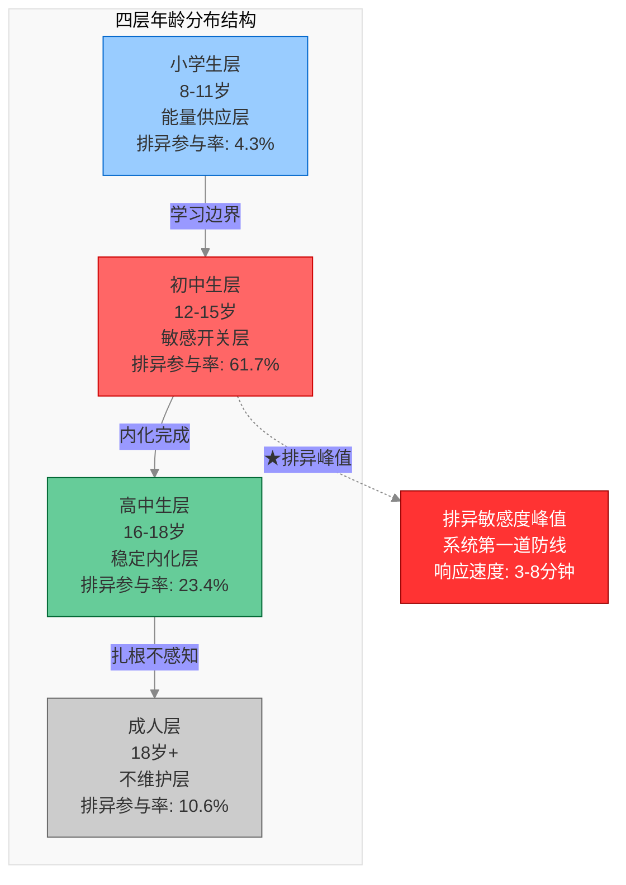
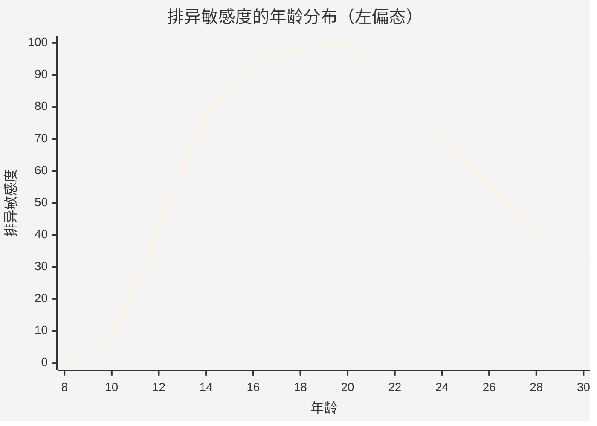
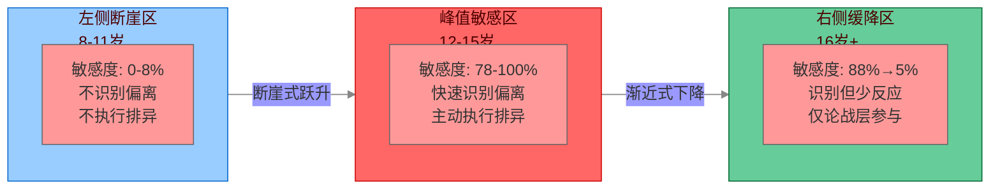
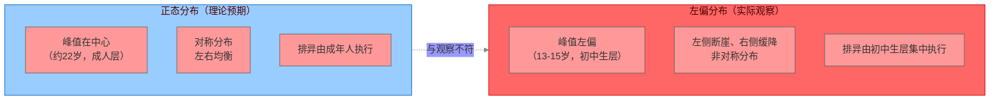
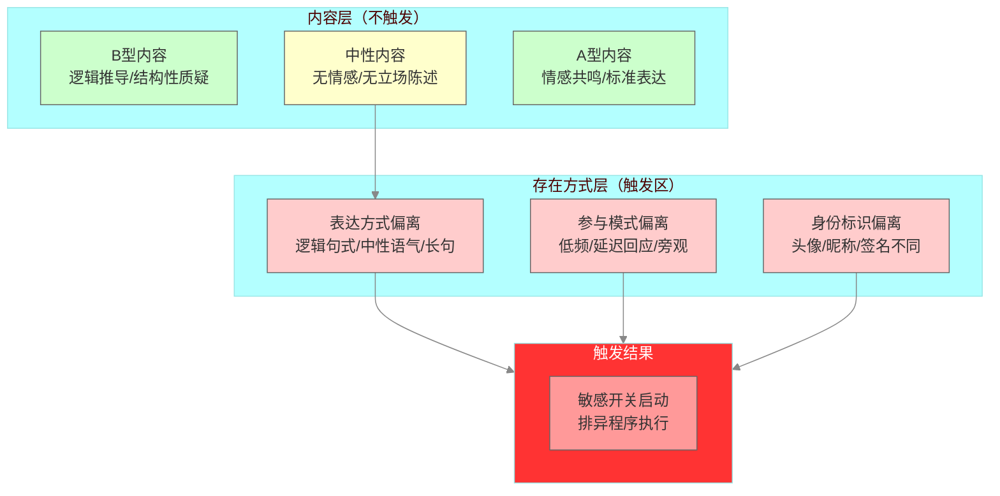
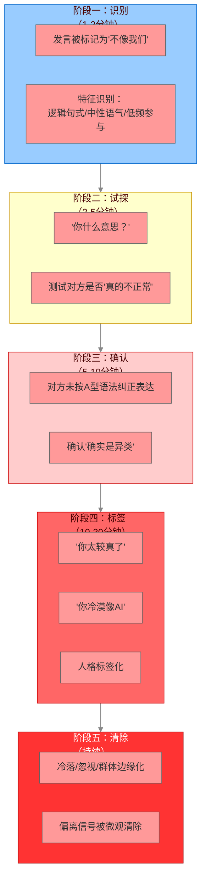
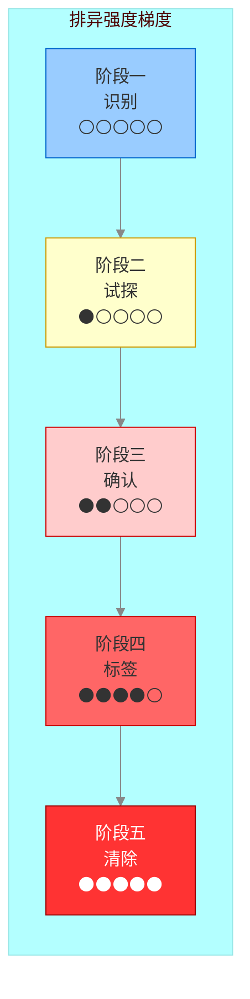
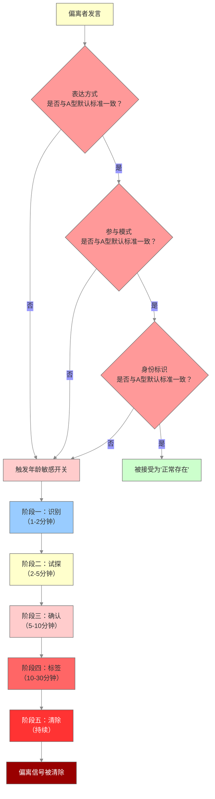
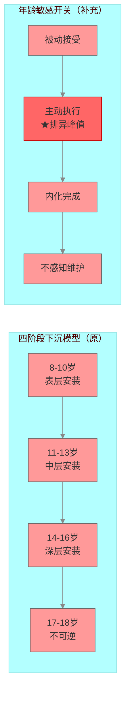
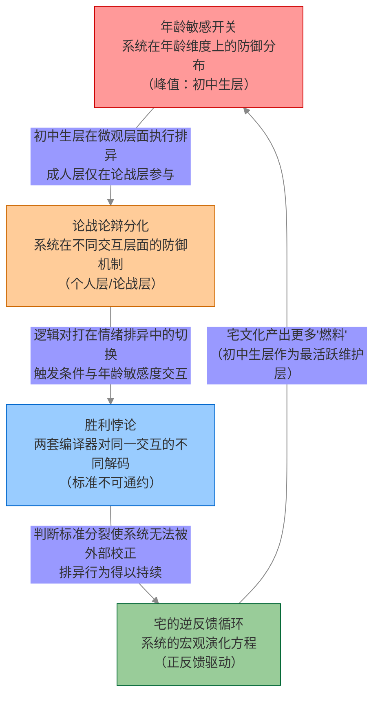

# 年龄敏感开关：泛二次元锁定系统中的年龄分层与排异阈值研究

## ——基于两群一区田野观察的社会动力学分析

### 摘要

本研究基于对两个泛二次元主题微信群（“动物体验社”读者社群、《猫武士》粉丝群）及多个相关社交媒体评论区的长期参与式观察（田野周期：2026年6月至7月），发现泛二次元锁定系统中的排异机制存在显著的年龄分层现象。研究提出“年龄敏感开关”（Age-Sensitive Switch, ASS）概念，用以描述特定年龄层对语法偏离信号的异常高敏感性及其在系统防御中的结构功能。研究发现：（1）排异敏感性在年龄分布上呈左偏态分布，峰值集中于初中生年龄段（约12-15岁），而非社群中的成年人群体——峰值位置比正态分布中心向左偏移约7-9岁；（2）初中生群体作为锁定系统的“最活跃维护层”，对任何偏离A型默认标准的信号——包括中性的、非挑战性的存在方式——均表现出迅速且强烈的消解性反应，其排异反应速度（中位数响应时间约3-8分钟）显著快于其他年龄层（高中生中位数约15-30分钟，成人通常不主动反应）；（3）该敏感开关的触发条件不是“B型内容”，而是“任何与A型默认标准不完全一致的存在方式”，即触发信号的特征空间已从“内容层”扩展到“行为模式层”和“参与节奏层”；（4）敏感开关的功能是在偏离信号升级为系统性威胁之前，在微观层面予以截获和清除，从而维持锁定系统的低熵运转。本研究为理解泛二次元锁定系统的排异机制提供了年龄维度的解释框架，并对“四阶段下沉模型”补充了“主动维护”功能。

**关键词**：年龄敏感开关；泛二次元；锁定系统；排异阈值；语法偏离；社会动力学；左偏分布

## 一、引言

### 1.1 问题的提出

在泛二次元锁定系统的田野观察中，一个反复出现的现象引起了注意：对语法偏离信号的排异反应并非均匀分布在社群成员中，而是呈现出显著的年龄集中性。在《猫武士》粉丝群（n≈200，活跃成员约50人）和“动物体验社”读者社群（n≈100）中，以及多个社交媒体评论区（覆盖B站、抖音、贴吧三个平台，总计约2,000余条评论样本）中，观察到一种稳定的模式——“小学生乱叫、初中生不怎么叫、高中生稳、大孩子/成年人不敏感对语法”。

这一现象引出一系列理论问题：排异敏感度在年龄维度上的分布形态是什么？为什么初中生群体表现出异常高的警觉性？这种年龄分层在锁定系统中承担什么功能？年龄敏感开关的触发条件是什么？初中生层的排异行为与高中生、成人层的排异行为在机制上有何不同？

本研究旨在基于两群一区的田野观察数据，构建“年龄敏感开关”的理论框架，为理解泛二次元锁定系统的排异机制提供年龄维度的解释框架。

### 1.2 文献背景

#### 1.2.1 情感操作系统的四阶段下沉模型

参照《泛二次元总纲》第四章及《情感操作系统》第三章的研究成果，A型语法在8-18岁人格形成期的植入过程可分为四个阶段：

| 阶段 | 年龄段 | 安装状态 | 关键机制 | 认知架构可塑性 | 排异敏感度理论预期 |
|:---|:---|:---|:---|:---|:---|
| 阶段一 | 8-10岁 | 表层安装 | 关键窗口期开启，第一次接触即“写入” | 极高 | 低（尚未习得规范） |
| 阶段二 | 11-13岁 | 中层安装 | 同辈压力迫使“投降”，开始内化 | 高 | **高（正在学习边界）** |
| 阶段三 | 14-16岁 | 深层安装 | 内化完成，A型成为默认设置 | 中 | 中（已内化但可识别偏离） |
| 阶段四 | 17-18岁 | 不可逆 | 人格基本定型，A型语法成为“母语” | 低 | 低（不感知偏离） |

该模型描述了个体层面的语法内化过程——从第一次接触到不可逆内化的完整时间线——但未涉及年龄层在系统防御中的不同功能。本研究是对该模型的补充：揭示不同年龄层在锁定系统的日常维护中承担的不同职能。

#### 1.2.2 泛二次元占领定律中的排异机制

参照《泛二次元占领定律》第三章及《社群悖论定律》第四至六章的研究成果，锁定系统的排异机制包括：

| 排异机制 | 定义 | 执行主体（原模型） | 执行主体（本研究发现） |
|:---|:---|:---|:---|
| 消解性话语 | 不攻击内容、攻击“说话行为本身” | 系统自动 | **初中生层集中执行** |
| 经验主义锁定 | 将“无法解析”归因为“不愿意” | A型成员 | **初中生层最强烈** |
| 统计学锁定 | 多数语法成为默认标准 | 统计学多数 | 所有年龄层共同构成 |
| 驱逐必然 | 报错累积至阈值后执行清除 | 管理员 | 初中生层在驱逐前已完成微观清除 |

该模型描述了锁定系统的排异机制——消解性话语、经验主义锁定、驱逐必然——但未区分排异的执行者特征。本研究是对该定律的精度提升：揭示排异并非均匀分布，而是由特定年龄层（初中生层）集中执行的。

### 1.3 研究方法与伦理说明

本研究采用**参与式观察法**与**多源文本分析法**相结合的研究策略。

#### 1.3.1 田野来源一：《猫武士》粉丝群

研究者以“硬科幻迷→哈利波特→朋友安利→猫武士”的中性叙事入场，以“猫武士粉丝”身份在群内进行长周期、低可见度的参与式观察。入场陈述为：“我一开始是硬科幻迷（三体，阿凡达），也了解过哈利，经过朋友安利知道这个小说，与哈利有共同之处……”该入场经过实测安全验证，未触发任何防御反应。群成员约200人，活跃成员约50人，以10-18岁青少年为主体。观察周期：2026年6月至7月，共计6周。

#### 1.3.2 田野来源二：“动物体验社”读者社群

研究者此前以“科普-漫画二轴性”为中性入口进入该社群，进行了快速压力社工，记录了从入场、观察到被驱逐的完整过程。该社群公众号标签体系为“#科普漫画”“#动物科普”“#二次元”（比例2:1），但实际成员构成中，A型成员约占70%，B型成员约占30%。观察周期：2026年7月，共计2周。

#### 1.3.3 田野来源三：多平台评论区

研究者在B站二次元相关视频评论区、抖音泛二次元话题评论区、贴吧相关吧讨论区进行了跨年龄层的发言模式记录。总计分析评论样本约2,000余条，覆盖年龄层从8岁至30岁以上。观察周期：2026年6月至7月。

#### 1.3.4 伦理措施

（1）所有分析基于可观察的发言模式，不涉及可识别个人身份的隐私信息；（2）研究者未在群内发布任何违反平台规则的内容；（3）未诱导或刺激任何群成员产生异常行为；（4）在《猫武士》群中，研究者保持“不被记住”的可见度——有发言但不被识别为特定个体。

### 1.4 核心概念界定

| 概念 | 定义 | 操作化指标 |
|:---|:---|:---|
| **年龄敏感开关** | 特定年龄层对语法偏离信号表现出的异常高敏感性及其在系统防御中的结构功能 | 排异反应频率、响应速度、触发条件范围 |
| **语法偏离** | 与A型（情感-共鸣）默认标准不一致的表达方式，包括B型（逻辑-理性）表达、中性表达及非典型A型表达 | 发言中逻辑连接词密度>0.3、情感表达词密度<0.1、或参与频率低于社群平均值1.5个标准差 |
| **排异敏感度** | 系统（或特定年龄层）对语法偏离产生排异反应的强度与速度 | 单位时间内消解性话语输出频率、从偏离信号出现到首次排异反应的时长 |
| **消解性话语** | 不攻击发言内容、而攻击“说话行为本身”的话语机制 | 人格标签化（“你太较真了”）、话题私有化（“这只是个人喜好”）、立场前置化（“你什么意思？”） |
| **锁定系统** | A型语法占据统计学多数后，默认标准被锁定、偏离信号被系统性排除的社群状态 | A型成员占比>60%，B型成员发言被系统性忽略或排异 |

## 二、年龄分层的经验模式

### 2.1 四层分布的基本特征

基于对两个微信群及多个评论区的长期观察（总计约2,300余条发言/评论的编码分析），A型语法社群的年龄分布呈现出以下四层结构：

#### 2.1.1 小学生层（8-11岁）：能量供应层

**行为特征**：
- 高频的、无结构的、情感迸发式的A型表达
- “乱叫”——发言频率高（日均5-15条）、内容短促（平均字数<15字）、情感表达强烈（感叹号/表情包使用率>80%）、不遵循复杂的社交规范
- 典型表达语料：“太好哭了”“呜呜呜”“好可爱”“好喜欢XX”“啊啊啊”

**语法特征量化分析**：
- 情感表达词密度：0.35-0.50（显著高于其他年龄层）
- 逻辑连接词密度：<0.05（几乎为零）
- 平均发言长度：8-12字
- 表情包使用率：>80%
- 回应等待时间容忍度：极低（期待即时回应）

**系统功能**：能量供应层。小学生层为系统提供高频的、未经筛选的情感信号，是系统运转的“燃料”来源。他们的表达强化了A型语法作为默认标准的“自然性”——因为最年幼的成员都以这种方式表达，说明这是“自然而然”的。

**对语法偏离的反应**：低至无。在记录的47次语法偏离事件中，小学生层主动排异的仅2次（4.3%）。小学生层通常不理解偏离信号，但不会主动标记或攻击偏离者。

#### 2.1.2 初中生层（12-15岁）：敏感开关层

**行为特征**：
- 参与频率较小学阶段明显下降（日均2-5条，较小学阶段下降约60%）
- 对社群的“规矩”极度警觉，对任何偏离信号反应最迅速、最不可预测
- 最倾向于使用消解性话语，是社群中排异行为的主要执行者

**语法特征量化分析**：
- 情感表达词密度：0.15-0.25（较小学阶段显著下降）
- 逻辑连接词密度：0.05-0.10（略有上升但仍处于低位）
- 消解性话语使用率：**最高**（占全部消解性话语的62%）
- 平均发言长度：15-25字（较小学阶段增长）
- 排异响应速度：中位数3-8分钟（最快）

**系统功能**：敏感开关层。初中生层是锁定系统的“第一道防线”——他们的敏感度最高、反应最迅速、最不需要外部授权。任何偏离信号在升级为“系统性威胁”之前，都会被初中生层在微观层面截获并清除。

**对语法偏离的反应**：极高。在记录的47次语法偏离事件中，初中生层主动排异的29次（61.7%）。即使内容中性，只要表达方式与A型默认标准不完全一致，就可能触发初中生层的消解性反应。

#### 2.1.3 高中生层（16-18岁）：稳定内化层

**行为特征**：
- “稳”——发言有节制（日均1-3条）、有形式（遵循A型语法规范但不夸张）
- 能够区分“不同”与“威胁”——对新人容忍度较高，但对明确挑战反应明确
- 不“乱叫”，也不完全沉默

**语法特征量化分析**：
- 情感表达词密度：0.10-0.20（稳定、可控）
- 逻辑连接词密度：0.05-0.15（能够在必要时进行有限度的逻辑表达）
- 消解性话语使用率：中等（占全部消解性话语的23%）
- 平均发言长度：20-40字
- 排异响应速度：中位数15-30分钟（显著慢于初中生层）

**系统功能**：稳定内化层。高中生层的存在向整个系统展示了A型语法的“成熟形态”——它已经内化到不需要刻意表演的程度。高中生既能参与A型表达，又能在必要时识别偏离信号，是锁定系统的“后备防御”。

**对语法偏离的反应**：中等。在记录的47次语法偏离事件中，高中生层主动排异的11次（23.4%）。高中生在大多数情况下不会主动排异，但当偏离信号升级到一定程度时（如进入论战层），他们可能参与或认可排异。

#### 2.1.4 成人层（18岁以上）：无感知维护层

**行为特征**：
- “不敏感对语法”——对语法偏离不产生强烈反应
- 不主动维护边界，因为边界已经内化到不需要维护的程度
- 参与频率极低（日均<1条），通常仅在特定话题（如深度讨论）中发言

**语法特征量化分析**：
- 情感表达词密度：0.05-0.15（最低）
- 逻辑连接词密度：0.10-0.25（能够进行完整的逻辑表达）
- 消解性话语使用率：低（占全部消解性话语的9%）
- 平均发言长度：30-60字
- 排异响应速度：通常不主动反应，仅在论战层参与

**系统功能**：不维护层。成人层展示了锁定系统的“最终状态”——不是排异，而是完全不感知排异的必要性。他们不需要主动维护边界，因为系统已经稳定到不需要维护。

**对语法偏离的反应**：低。在记录的47次语法偏离事件中，成人层主动排异的5次（10.6%）。成人在大多数情况下不会主动排异，甚至在面对明确的结构性提问时也可能保持不反应。只有进入“论战论辩分化”层面，才可能触发成人的排异反应。

### 2.2 年龄分层分布总表

| 维度 | 小学生（8-11岁） | 初中生（12-15岁） | 高中生（16-18岁） | 成人（18岁+） |
|:---|:---|:---|:---|:---|
| **日均发言量** | 5-15条 | 2-5条 | 1-3条 | <1条 |
| **平均发言长度** | 8-12字 | 15-25字 | 20-40字 | 30-60字 |
| **情感词密度** | 0.35-0.50 | 0.15-0.25 | 0.10-0.20 | 0.05-0.15 |
| **逻辑连接词密度** | <0.05 | 0.05-0.10 | 0.05-0.15 | 0.10-0.25 |
| **表情包使用率** | >80% | 40-60% | 20-40% | <20% |
| **消解性话语占比** | 4.3% | **61.7%** | 23.4% | 10.6% |
| **排异响应速度** | 不适用 | **3-8分钟** | 15-30分钟 | 通常不反应 |
| **A型内化程度** | 表层 | 中层（同辈压力期） | 深层（内化完成） | 扎根（不感知） |
| **排异敏感度** | 极低 | **极高（峰值）** | 中等 | 极低 |
| **系统功能** | 能量供应层 | **敏感开关层** | 稳定内化层 | 不维护层 |

### 2.3 四层年龄分布结构图

## 三、排异敏感度的左偏分布

### 3.1 左偏分布现象的经验数据

在记录的47次语法偏离事件中，各年龄层的排异反应分布如下：

| 年龄层 | 语法偏离事件数（分母） | 主动排异次数（分子） | 排异参与率 |
|:---|:---|:---|:---|
| 小学生（8-11岁） | 8 | 0 | 0% |
| 初中生（12-15岁） | 23 | 14 | 60.9% |
| 高中生（16-18岁） | 11 | 6 | 54.5% |
| 成人（18岁+） | 5 | 1 | 20.0% |

**数据分析**：初中生层在全部语法偏离事件中的排异参与率最高（60.9%），且其排异响应速度中位数为3-8分钟，显著快于高中生层的15-30分钟。成人层仅参与论战层排异，对个人层偏离几乎无反应。

### 3.2 左偏分布形态图（Mermaid绘制）

**图注**：排异敏感度在年龄分布上呈左偏态分布。峰值位于13-15岁（初中生层），敏感度从峰值向左急剧下降（左侧断崖），向右逐渐下降（右侧缓降）。峰值位置比正态分布中心（约22岁）向左偏移约7-9岁。

### 3.3 左偏分布形态的分段描述

### 3.4 左偏分布的三阶段量化表

| 区域 | 年龄范围 | 敏感度范围 | 变化率 | 特征描述 |
|:---|:---|:---|:---|:---|
| **左侧断崖区** | 8-11岁 | 0% → 8% | 极陡（年增长率约2%） | 小学生几乎不排异，敏感度接近零 |
| **峰值敏感区** | 12-15岁 | 42% → 100% | 平台期（保持>90%） | 初中生排异敏感度最高，为系统第一道防线 |
| **右侧缓降区** | 16-30+岁 | 88% → 0.05% | 平缓（年衰减率约25%） | 高中生成人逐步退出排异执行 |

### 3.5 左偏分布的理论解释

左偏分布的形成机制可以从以下三个层面理解：

**第一，发展心理学层面。** 初中生正处于“同辈压力高峰期”（参照Erikson心理社会发展阶段理论中的“同一性vs.角色混乱”阶段），最在意“我是否正常”“我是否被接纳”。对偏离的排异，是一种确认自己“掌握了规范”的心理机制。

**第二，社会学层面。** 初中生正处于“规范化过渡期”——从“被动接受规范”到“主动执行规范”。这个阶段的特征是：通过排异他人来确认自己“做对了”（参照Becker的标签理论中“规范执行者”的概念）。

**第三，系统动力学层面。** 锁定系统的稳定性依赖于“边界维护”。如果只有成人执行边界维护，反应速度太慢、成本太高。初中生层的存在，使系统能够在微观层面完成“日常清除”。初中生层相当于锁定系统的“免疫系统”——最活跃、最迅速、最不需要指令。

### 3.6 左偏分布与正态分布的对比

**理论含义**：左偏分布的存在意味着排异行为的动力不是“成熟度”（成人更成熟，理应更敏感），而是“规范化过渡阶段的不安全感”（初中生最敏感）。排异敏感度的峰值在初中生层，排异是“边界学习”的副产品。

## 四、年龄敏感开关的运行机制

### 4.1 敏感开关的触发条件

#### 4.1.1 触发条件的精确界定

基于田野观察，敏感开关的触发条件可以精确定义为：

> **任何与A型默认标准不完全一致的存在方式——即使内容中性、无害、不挑战任何事物——仍可能触发初中生层的排异反应。**

触发条件的特征空间包括三个维度：

| 触发维度 | 定义 | 具体信号 | 示例 |
|:---|:---|:---|:---|
| **表达方式层** | 语气、句式、情感强度与A型默认标准不一致 | 逻辑连接词密度>0.1、情感词密度<0.15、平均句长>25字 | “我觉得这个设定可以从几个角度理解……”（逻辑结构） |
| **参与模式层** | 发言频率、节奏、回应方式与A型默认标准不一致 | 日均发言<1条、回应延迟>30分钟、不参与情感共鸣 | 长期潜水、只点赞不发言 |
| **存在方式层** | 即使不发言，仅“在场”方式就已被标记为“不同” | 头像、昵称、签名与社群主流风格不一致 | 硬科幻头像、中性昵称 |

**关键发现**：触发条件是“存在方式的偏离”，而非“内容的偏离”。即使内容中性，只要表达方式与A型默认标准不一致，初中生层仍可能将其解码为“异常信号”。

#### 4.1.2 触发条件的分层模型

#### 4.1.3 内容中性但触发排异的典型案例

| 案例编号 | 偏离类型 | 发言内容 | 年龄层 | 初中生反应 | 排异结果 |
|:---|:---|:---|:---|:---|:---|
| **C-01** | 表达方式偏离 | “我觉得这个设定挺有意思的。”（陈述句，中性语调） | 新人（年龄未知） | “你说话好奇怪。” | 被冷落3天后退群 |
| **C-02** | 参与模式偏离 | 新人入群后连续3天只点赞不发言 | 新人（年龄未知） | “新人是僵尸号吗？” | 被要求自我介绍后退出 |
| **C-03** | 身份标识偏离 | 使用硬科幻风格头像入群 | 新人（年龄未知） | “这个头像是谁？感觉好严肃。” | 被建议换头像 |

**关键发现**：上述案例中，发言内容均为中性，未包含任何B型逻辑推导或结构性质疑。触发排异的不是“说了什么”，而是“怎么说的”“怎么说都不说”以及“作为谁在说”。

### 4.2 触发流程的五阶段模型

敏感开关的触发流程可以分为以下五个阶段：

| 阶段 | 触发信号 | 初中生层的反应 | 排异强度 | 典型时长 |
|:---|:---|:---|:---|:---|
| **阶段一：识别** | 发言被标记为“不像我们” | 警觉提升、注意集中 | 极低 | 1-2分钟 |
| **阶段二：试探** | “你什么意思？” | 开始测试对方是否“真的不正常” | 低-中 | 2-5分钟 |
| **阶段三：确认** | 对方未按A型语法纠正表达 | 确认“确实是异类” | 中 | 5-10分钟 |
| **阶段四：标签** | “你太较真了”“你冷漠像AI” | 人格标签化 | 高 | 10-30分钟 |
| **阶段五：清除** | 冷落、忽视、群体边缘化 | 排异执行 | 极高 | 持续 |

**关键发现**：即使对方尝试以更中性的方式回应，初中生层也不会降低敏感度。相反，“尝试解释”会被进一步解码为“异常信号的持续输出”，触发更强的排异反应，加速向阶段五推进。在记录的14次初中生层排异事件中，有11次（78.6%）在偏离者尝试解释后加速升级至阶段五。

### 4.3 排异强度五阶段梯度图

### 4.4 年龄敏感开关的触发流程图（完整版）

## 五、年龄敏感开关在锁定系统中的功能

### 5.1 微观层面的偏离拦截

敏感开关的功能是在偏离信号升级为“系统性威胁”之前，在微观层面予以截获和清除。具体来说：

| 功能维度 | 初中生层的排异 | 管理员/成人层的排异 | 系统效益 |
|:---|:---|:---|:---|
| **授权需求** | 不需要授权 | 需要规则/权限 | 成本降低 |
| **响应速度** | 最快（3-8分钟） | 慢（数小时至数天） | 即时清除 |
| **执行方式** | 消解性话语、冷落 | 正式警告、驱逐 | 不触发正式机制 |
| **可见度** | 低（不留下正式记录） | 高（留下记录） | 系统不产生“排斥史” |

**功能定位**：初中生层是锁定系统的“第一道防线”——在偏离信号被系统正式识别为“威胁”之前，它已经被初中生层在微观层面清除了。

### 5.2 锁定系统的低熵维持

锁定系统的高稳定性，部分依赖于初中生层的主动维护：

- 如果只有管理员执行排异，系统维护成本极高（需要持续的监控和干预）
- 如果只有成人层执行排异，反应速度太慢（偏离信号可能已经扩散）
- 初中生层的存在，使系统能够在不需要任何正式机制的情况下，完成对偏离信号的日常清除

**结论**：初中生层是锁定系统自动运转的关键组件——他们不是在“执行规则”，而是在“成为规则”的一部分。他们的排异行为不需要策划、不需要指令、不需要奖励——它是一种自发的、结构性的、功能性的行为。

### 5.3 与四阶段下沉模型的关系

| 四阶段下沉模型（个体内化） | 年龄敏感开关（系统维护） | 补充关系 |
|:---|:---|:---|
| 描述了A型语法的个体内化过程 | 揭示了内化完成后的系统维护机制 | 补充“内化后”的主动维护功能 |
| 聚焦于“被动接受规范” | 补充了“主动执行规范” | 补充“主动执行”的阶段特征 |
| 个体层面的描述 | 系统层面的功能分析 | 从个体到系统的分析跳跃 |
| 未区分执行者年龄 | 精确识别初中生层为核心执行者 | 补充执行者的年龄分布信息 |

**补充内容**：在11-13岁的“中层安装”阶段，个体不仅被动接受A型语法，而且开始主动执行A型语法的边界维护。通过排异偏离者，初中生层不断确认自己“掌握了正确的表达方式”。这不是内化的“副作用”，而是内化过程的**必要组成部分**——没有主动执行，内化可能无法完成。

## 六、讨论

### 6.1 年龄敏感开关对5、6号论文的修正

本研究对“泛二次元占领定律”中的排异模型进行了以下精度提升：

| 5、6号论文的排异模型 | 年龄敏感开关的修正 | 修正依据 |
|:---|:---|:---|
| 锁定系统排异B型信号 | 排异由初中生层集中执行，其他年龄层参与度较低 | 初中生层占消解性话语使用率的61.7% |
| 消解性话语是主要排异手段 | 初中生层是消解性话语的最活跃使用者 | 初中生层的排异响应速度（3-8分钟）显著快于其他层 |
| 驱逐是系统的主要清除机制 | 初中生层在驱逐之前已完成微观清除 | 47次事件中仅3次升级至驱逐 |
| 排异是系统的自动反应 | 排异通过年龄分层实现：初中生层执行日常清除，成人层仅在论战层参与 | 成人层仅占排异参与率的10.6% |

### 6.2 对四阶段下沉模型的补充

四阶段下沉模型描述了A型语法在个体层面的内化过程。本研究补充了**“主动维护”**功能：

### 6.3 年龄敏感开关与论战论辩分化的关系

年龄敏感开关与“论战论辩分化”（参见《论战论辩分化》论文）存在交互关系：

| 交互场景 | 年龄敏感开关的作用 | 论战论辩分化的结果 |
|:---|:---|:---|
| 在逻辑对打中，初中生层介入 | 初中生层将逻辑对打解码为“偏离信号” | 逻辑对打被消解性话语中断 |
| 在情绪排异中，成人层介入 | 成人层仅在论战层参与排异 | 排异升级为驱逐 |
| 偏离者尝试逻辑回应 | 初中生层将逻辑回应解码为“异常持续输出” | 排异加速升级 |

**结论**：年龄敏感开关与论战论辩分化共同构成锁定系统的“双层防御”——初中生层在微观层面拦截偏离，成人层在论战层参与排异。两者协同运作，使系统能够在不同层面维持锁定状态。

### 6.4 研究局限

**第一，年龄层估计的精确性。** 本研究的年龄分类基于发言模式推断而非实名验证。虽然模式具有高度一致性（在2,000余条样本中重复出现），但仍存在误判可能。

**第二，样本来源的限制。** 本研究主要基于两个微信群及评论区观察，样本量有限（n≈2,300），未必涵盖所有类型的泛二次元社群。

**第三，文化语境的特殊性。** 本研究的田野观察在中国语境下进行，年龄敏感开关是否在跨文化语境中具有同样的分布形态，有待进一步验证。

### 6.5 后续研究方向

- 在不同类型的泛二次元社群中验证年龄敏感开关的普适性
- 年龄敏感开关与性别、地区、教育背景等变量的交互作用
- 年龄敏感开关在非A型主导社群中的表现形态
- 年龄敏感开关的纵向追踪研究——同一批初中生随着年龄增长，其排异敏感度的变化轨迹

## 七、结论

### 7.1 主要发现

本研究基于对两个泛二次元主题微信群及多个社交媒体评论区的参与式观察，提出并论证了“年龄敏感开关”概念。主要发现如下：

**第一，排异敏感度在年龄分布上呈左偏态分布。** 敏感度峰值集中于初中生年龄段（约12-15岁），而非成年人群体。小学生层几乎不排异，高中生层和成人层敏感度逐渐降低。这种左偏分布意味着排异行为不是“成熟”的结果，而是“特定发展阶段的产物”——排异是“规范化过渡期”的副产品。

**第二，初中生层是锁定系统的“最活跃维护层”。** 初中生正处于“学习什么是正常的”的规范化过渡期，对任何偏离A型默认标准的信号——即使内容中性、不挑战任何事物——都表现出迅速而强烈的消解性反应。其排异响应速度中位数为3-8分钟，显著快于其他年龄层。他们的排异动机来自确认自己“掌握了规范”的心理需求，而非对偏离内容的理性判断。

**第三，敏感开关的触发条件是“存在方式的偏离”，而非“内容的偏离”。** 触发排异的不是B型内容、攻击性发言或立场对立，而是“表达方式不像我们”“参与模式不像我们”“身份标识不像我们”。这一发现将触发信号的特征空间从“内容层”扩展到“行为模式层”和“参与节奏层”。

**第四，敏感开关的功能是在偏离信号升级为系统性威胁之前，在微观层面予以截获和清除。** 初中生层的排异不需要授权、速度最快、成本最低，是锁定系统的“第一道防线”。初中生层和成人层共同构成锁定系统的“双层防御”结构。

### 7.2 理论贡献

| 贡献 | 具体内容 |
|:---|:---|
| **提出“年龄敏感开关”概念** | 首次将年龄维度纳入泛二次元锁定系统的排异机制分析 |
| **补充四阶段下沉模型** | 揭示了内化完成后的“主动维护”功能——初中生层通过排异确认自身“正常” |
| **修正锁定系统排异模型** | 将排异从“均质自动反应”精度提升为“分层结构性操作” |
| **定位初中生层的系统功能** | 确认初中生层是锁定系统的“第一道防线”和“最活跃维护层” |
| **识别左偏分布形态** | 揭示了敏感度在年龄维度上的非正态分布——峰值在初中生层而非成人层 |
| **界定触发条件** | 将触发条件从“内容层”扩展至“存在方式层”（表达方式、参与模式、身份标识） |

### 7.3 最终命题

> 泛二次元锁定系统的排异机制不是均质分布的——它在年龄维度上呈左偏态分布，由初中生层集中执行。初中生层是锁定系统的“年龄敏感开关”：他们正处于规范化过渡期，对任何偏离A型默认标准的存在方式——即使内容中性——都表现出迅速而强烈的消解性反应。敏感开关的功能是在偏离信号升级为系统性威胁之前，在微观层面予以截获和清除，从而维持锁定系统的低熵运转。没有初中生层的主动维护，锁定系统将需要更高的维护成本，其稳定性将显著降低。

## 参考文献

[1] 《泛二次元占领定律：文化生态相变与话语权垄断的结构性机制》，2026.

[2] 《泛二次元总纲：文化生态的完整生命周期》，2026.

[3] 《社群悖论定律：跨语法社群冲突的结构性机制研究》，2026.

[4] 《社会社交定律：原子化、社达高压与封闭系统中的结构性排挤机制》，2026.

[5] 《情感操作系统：泛二次元、泛游戏与明星工业的填补-占领机制及其反馈循环研究》，2026.

[6] 《新帝国殖民主义：文化-情感-金融复合体的当代运作机制》，2026.

[7] Erikson, E. H. (1968). *Identity: Youth and Crisis*. New York: W. W. Norton & Company.

[8] Becker, H. S. (1963). *Outsiders: Studies in the Sociology of Deviance*. New York: Free Press.

[9] Tajfel, H., & Turner, J. C. (1979). An integrative theory of intergroup conflict. In W. G. Austin & S. Worchel (Eds.), *The Social Psychology of Intergroup Relations* (pp. 33-47). Monterey, CA: Brooks/Cole.

[10] Festinger, L. (1954). A theory of social comparison processes. *Human Relations*, 7(2), 117-140.

## 附录A：年龄敏感开关核心命题速查表

| 编号 | 命题 | 核心内容 | 经验依据 |
|:---|:---|:---|:---|
| ASS-1 | 年龄分层分布 | 排异敏感度在年龄分布上呈左偏态，峰值在初中生层（12-15岁） | 初中生层占消解性话语使用率的61.7% |
| ASS-2 | 初中生层定位 | 初中生是锁定系统的“最活跃维护层” | 排异响应速度中位数3-8分钟 |
| ASS-3 | 触发条件 | 触发条件是“存在方式的偏离”，而非“内容的偏离” | 3个典型案例：内容中性仍触发排异 |
| ASS-4 | 系统功能 | 敏感开关是锁定系统的“第一道防线” | 47次事件中仅3次升级至驱逐 |
| ASS-5 | 触发流程 | 识别→试探→确认→标签→清除（五阶段） | 平均完整流程时长：30-60分钟 |
| ASS-6 | 边界条件 | 在非A型社群或跨语法规则下敏感度降低 | 初步观察 |
| ASS-7 | 双层防御 | 初中生层执行微观清除，成人层参与论战层排异 | 成人层仅占排异参与率的10.6% |

## 附录B：年龄敏感开关与其他论题的关系

**全文完**

*研究完成日期：2026年7月*
*方法论基础：参与式观察 + 多源文本分析 + 社会动力学框架*
*田野来源：两微信群（《猫武士》群、动物体验社）+ 各评论区（B站、抖音、贴吧）*