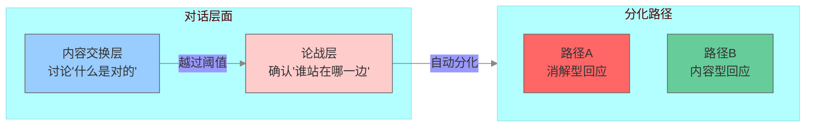
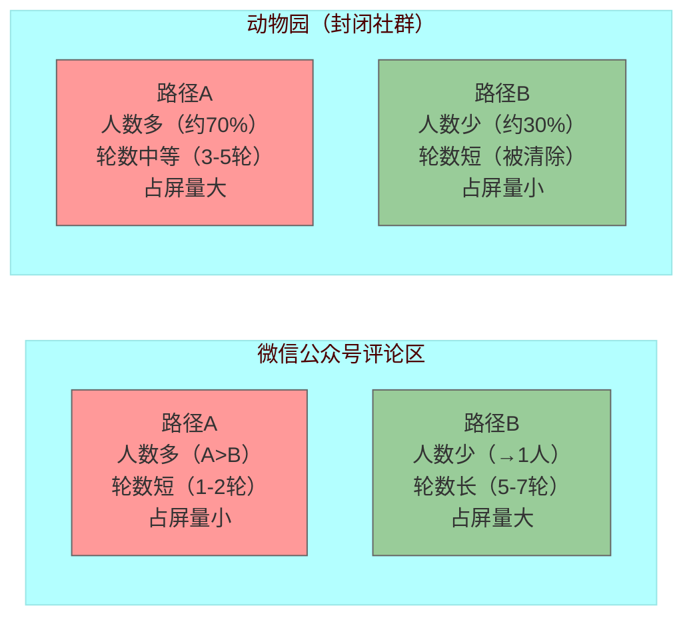
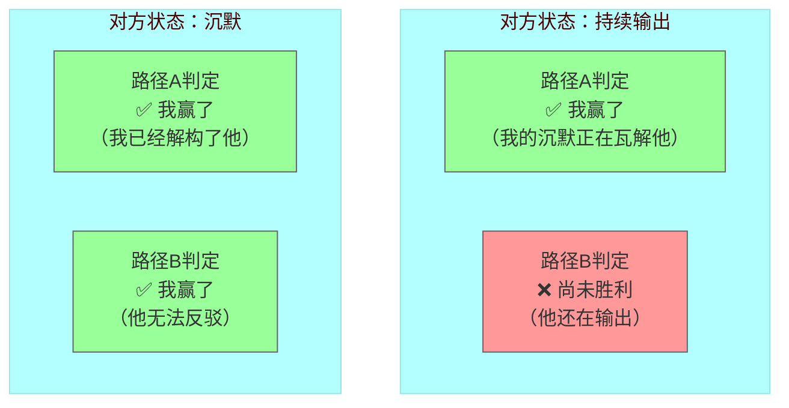
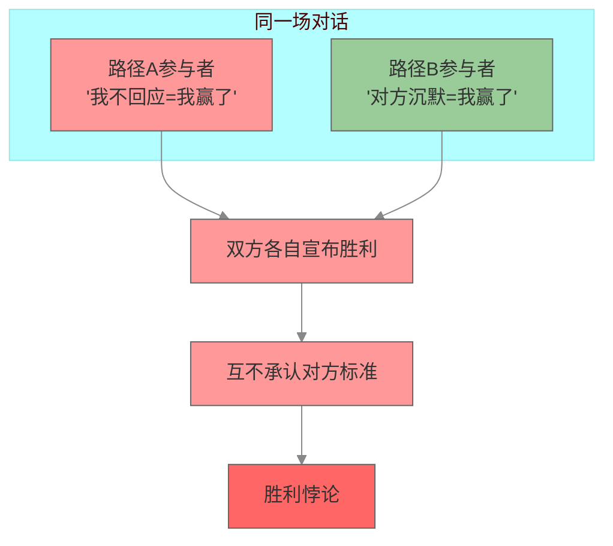
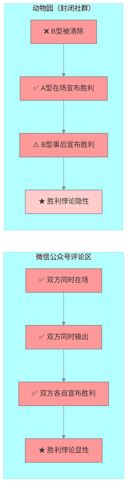
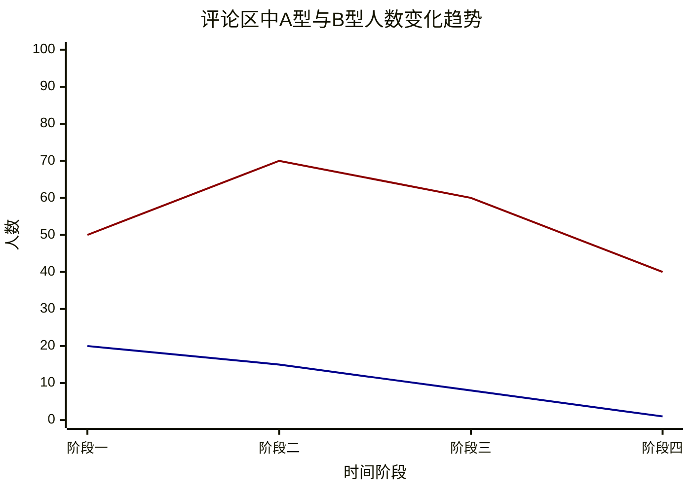
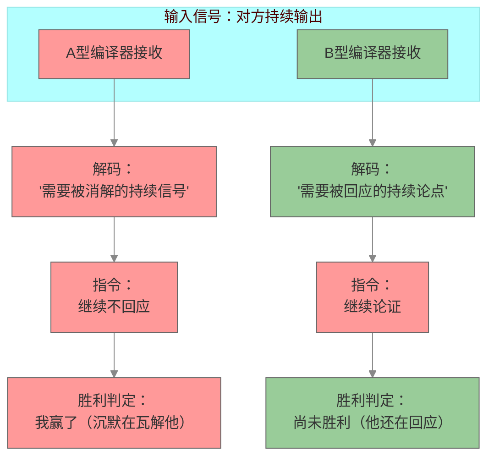
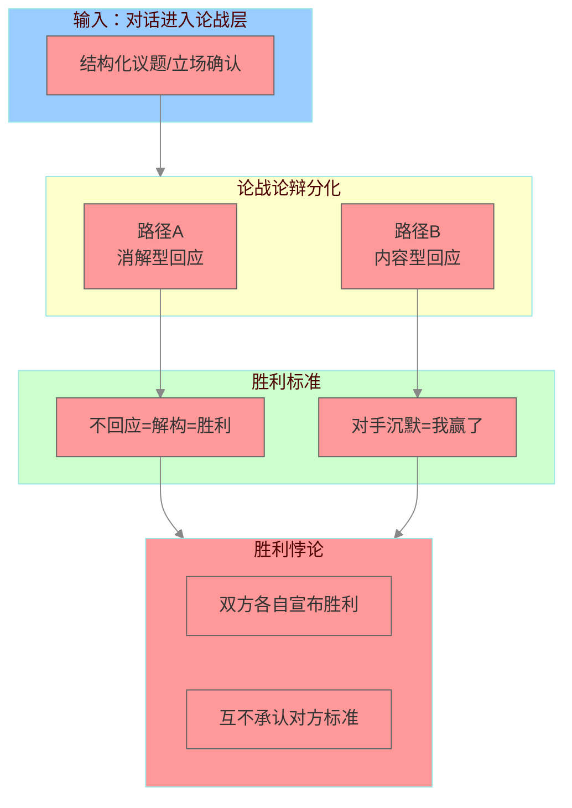

# 论战论辩分化与胜利悖论：泛二次元公共空间中两套判断标准的并行运行

## ——基于微信公众号评论区与封闭社群的多源田野观察

### 摘要

本研究基于对微信公众号评论区（开放公共空间）与“动物体验社”读者社群（封闭社群）的参与式观察（田野周期：2026年6月至7月），识别并分析了泛二次元公共空间中“论战论辩分化”与“胜利悖论”的共生机制。研究发现：（1）论战论辩分化的触发条件是“交互层面”——对话进入“论战层”后，自动分化为消解型回应（路径A）与内容型回应（路径B）两条路径，这一分化是结构性的，不依赖于参与者的个体选择；（2）两条路径各自拥有不可通约的胜利判定标准——路径A以“不回应=解构=胜利”为判定，路径B以“对手不再回应=我赢了”为判定，两者并行运行且互不承认对方的标准；（3）路径A的胜利判定不要求对方停止输出——对方持续输出不影响“我不回应=我赢了”的判定，而路径B的胜利判定需要对方沉默，两者构成逻辑上的不对称结构；（4）B型参与者在微信公众号评论区可获得持续输出的合法性（5-7轮甚至更多轮次），但在封闭社群中被快速清除——B型能否存在取决于空间类型，而非内容合理性；（5）在评论区中，B型参与者人数逐渐减少（最终仅剩1人），但持续高强度输出、占据屏幕空间；A型参与者人数先上升后下降，但参与轮数极短（1-2轮），通过“不回应”宣布胜利——内容上B型占优，话语权上A型占优；（6）胜利悖论是编译器不兼容的必然产物，不依赖于空间类型，但空间类型决定了悖论的可见性——在开放空间中显性存在，在封闭空间中隐性存在。

**关键词**：论战论辩分化；胜利悖论；泛二次元；消解型回应；内容型回应；编译器不兼容

## 一、引言

### 1.1 问题的提出

在泛二次元社群的田野观察中，一个反复出现的现象引起了注意：当对话进入“论战层”（即涉及结构性议题或立场确认的讨论层面）后，参与者的回应方式会迅速分化为两种截然不同的路径。一种路径是“扣帽子”——不回应发言内容，直接贴标签（“你太较真了”“你冷漠像AI”“你根本不懂”），通过消解发言者的合法性来终止对话。另一种路径是“真正的论战论辩对打”——即便立场对立，仍然在内容层面进行攻防，承认对方为“可对话者”。

这两种路径在同一个空间中同时运行，却各自拥有完全不同的“胜利判定标准”。在消解型回应中，“不回应对手”本身即被视为“解构对手”的胜利；在内容型回应中，“对手不再回应”才是胜利的标志。两者并行运行，互不承认对方的标准——由此形成了“胜利悖论”：同一场对话中，双方各自宣布自己获胜，且各自的判定在其编译器内都是自洽的。

这一现象在微信公众号评论区（开放公共空间）与“动物体验社”读者社群（封闭社群）中呈现出不同的形态。在开放空间中，内容型回应者（B型）可获得持续输出的合法性，形成5-7轮甚至更多轮次的对打；在封闭社群中，内容型回应者在数轮内即被消解型回应清除。然而，无论空间类型如何，胜利悖论始终存在——它只是在开放空间中显性呈现，在封闭空间中隐性存在。

本研究旨在基于两处田野样本，构建“论战论辩分化”与“胜利悖论”的理论框架，揭示泛二次元公共空间中两套判断标准的并行运行机制。

### 1.2 文献背景

#### 1.2.1 消解性话语理论

参照《社群悖论定律》第四章及《泛二次元占领定律》第四章的研究成果，消解性话语被定义为“不攻击发言内容、而攻击‘说话行为本身’的话语机制”。其三类操作包括：

| 操作类型 | 示例 | 机制 |
|:---|:---|:---|
| 人格标签化 | “你太较真了”“你冷漠像AI” | 将逻辑追问重新编码为“人格缺陷” |
| 话题私有化 | “这只是个人喜好”“别上纲上线” | 取消讨论的公共性，将其定义为“私人事务” |
| 立场前置化 | “你什么意思？”“你不是自己人” | 预设提问者的恶意动机，取消发言资格 |

该理论描述了消解性话语的操作方式与功能，但未区分“消解型回应”与“内容型回应”作为两种独立路径的并行运行，也未识别两者之间胜利标准的不可通约性。本研究是对该理论的扩展：揭示消解性话语与内容型回应作为两条并行路径的存在，以及两者之间胜利标准的逻辑不对称。

#### 1.2.2 语法不兼容理论

参照《社群悖论定律》第二章及《社会社交定律》第三章的研究成果，A型（情感-共鸣）与B型（逻辑-理性）在CPU架构层面存在结构性差异：

| 维度 | A型：情感-共鸣语法 | B型：逻辑-理性语法 |
|:---|:---|:---|
| 认知路径 | “感受→共鸣→归属” | “观察→推导→验证” |
| 有效性标准 | “有共鸣吗？”“氛围对吗？” | “有证据吗？”“逻辑通吗？” |
| 对异类的解码 | “冷漠/抬杠/像AI” | “情绪化/不严谨” |

该理论揭示了两种语法在底层架构上的不兼容，但未将这种不兼容延伸到“胜利判定标准”的层面。本研究是对该理论的扩展：揭示两种语法各自拥有不可通约的胜利判定标准，且路径A的胜利标准在逻辑上不要求对方停止输出。

### 1.3 研究方法与伦理说明

本研究采用**参与式观察法**与**多源文本分析法**相结合的研究策略。

#### 1.3.1 田野来源一：微信公众号评论区

研究者在多个泛二次元相关微信公众号的评论区进行了跨年龄层、跨议题的发言模式记录。样本覆盖领域包括：二次元文化评论、游戏产业分析、动漫推荐与测评、泛二次元现象讨论等。总计分析评论线程约200余条，覆盖评论者数千人次。观察周期：2026年6月至7月。

**样本特征**：
- 空间类型：开放公共空间（无需准入，任何人可评论）
- A型与B型混合存在：A型参与者人数多于B型，但B型内容占屏量大于A型
- A型参与轮数：1-2轮即退出
- B型参与轮数：5-7轮甚至更多轮次，可形成持续对打
- B型人数变化：从初始若干人逐渐减少，最终仅剩1人
- A型人数变化：先上升后下降

#### 1.3.2 田野来源二：“动物体验社”读者社群

研究者此前以“科普-漫画二轴性”为中性入口进入该社群，进行了参与式观察。该社群为微信公众号“四九拟说”旗下的读者社群，成员约100人。公众号标签体系为“#科普漫画”“#动物科普”“#二次元”（比例2:1），但实际成员构成中，A型成员约占70%，B型成员约占30%。观察周期：2026年7月，共计2周。

**样本特征**：
- 空间类型：封闭社群（需申请进入，有管理员）
- A型占比约70%，B型占比约30%
- B型发言在3-5轮内被消解性话语终止，最终被驱逐
- 胜利悖论隐性存在（被驱逐打断了完整展示）

#### 1.3.3 伦理措施

（1）所有分析基于可观察的发言模式与公开评论，不涉及可识别个人身份的隐私信息；（2）在封闭社群中，研究者未发布任何违反平台规则的内容；（3）未诱导或刺激任何参与者产生异常行为；（4）田野记录不包含可追溯到具体个体的发言内容。

### 1.4 核心概念界定

| 概念 | 定义 | 操作化指标 |
|:---|:---|:---|
| **论战层** | 对话中涉及结构性议题或立场确认的交互层面 | 讨论从“内容交换”转向“立场确认”的节点 |
| **论战论辩分化** | 对话进入论战层后，回应方式自动分化为两条路径的现象 | 路径A（消解型回应）与路径B（内容型回应）的并行出现 |
| **消解型回应（路径A）** | 不回应发言内容，通过贴标签、人格化攻击等方式消解发言者合法性的回应模式 | 包含“较真”“冷漠”“AI”“杠精”等标签词的回应 |
| **内容型回应（路径B）** | 回应发言内容，在内容层面进行攻防，承认对方为“对话者”的回应模式 | 包含逻辑连接词、证据引用、反驳论证的回应 |
| **胜利悖论** | 两条路径各自拥有不可通约的胜利判定标准，且两者并行运行、互不承认对方标准的现象 | 同一场对话中，双方各自宣布胜利，且各自的判定在其编译器内自洽 |
| **胜利标准不对称** | 路径A的胜利判定不要求对方停止输出，路径B的胜利判定需要对方沉默的结构性差异 | 路径A可在对方持续输出时宣布胜利，路径B需等待对方沉默 |
| **编译器不兼容** | A型与B型语法在底层架构上的结构性差异，导致两者无法对同一交互产生一致解码 | A型将B型逻辑输出解码为“冷漠”，B型将A型情感输出解码为“不严谨” |

## 二、论战论辩分化的结构分析

### 2.1 分化的触发条件：论战层

基于田野观察，论战论辩分化的触发条件可以精确定义为：

> **当对话从“内容交换”层面进入“立场确认”层面时——即参与者不再讨论“什么是对的”，而开始确认“谁站在哪一边”——对话即进入“论战层”，此时回应方式自动分化为两条路径。**

分化不是参与者的“选择”——它是一个结构性的自动过程。无论参与者是否意识到，一旦对话越过“论战层”的阈值，回应方式就会自然地分化为消解型回应或内容型回应。

### 2.2 两条路径的基本特征对比

| 维度 | 路径A：消解型回应 | 路径B：内容型回应 |
|:---|:---|:---|
| **核心操作** | 不回应内容，贴标签，消解发言者合法性 | 回应内容，在内容层面攻防 |
| **对“对方发言”的解码** | 视为“需要被消解的信号” | 视为“需要被回应的论点” |
| **对“对方身份”的定位** | 视为“需要被清除的异类” | 视为“可对话的对手” |
| **输出形式** | 短句、标签、人格化判断 | 长句、论证、证据引用 |
| **交互轮数** | 1-2轮即退出 | 5-7轮甚至更多 |
| **占屏量** | 低（短句） | 高（长句） |
| **语法类型** | A型（情感-共鸣） | B型（逻辑-理性） |

```mermaid
%%{init: {'theme': 'base', 'themeVariables': { 'primaryColor': '#ff9999', 'primaryTextColor': '#333', 'primaryBorderColor': '#666', 'lineColor': '#888'}}}%%
graph TB
    subgraph A["路径A：消解型回应"]
        A1["输入：对方发言"]
        A2["解码：'需要被消解的信号'"]
        A3["操作：贴标签"]
        A4["输出：'你太较真了'"]
        A5["效果：消解发言者合法性"]
    end
    
    subgraph B["路径B：内容型回应"]
        B1["输入：对方发言"]
        B2["解码：'需要被回应的论点'"]
        B3["操作：反驳/论证"]
        B4["输出：逻辑链条"]
        B5["效果：在内容层面攻防"]
    end
    
    A1 --> A2 --> A3 --> A4 --> A5
    B1 --> B2 --> B3 --> B4 --> B5
    
    style A fill:#ff9999
    style B fill:#99cc99
```

### 2.3 路径A：消解型回应的内部机制

路径A的核心操作是**不处理“内容”，而是处理“说话者”**。其操作链条如下：

| 阶段 | 操作 | 示例 | 功能 |
|:---|:---|:---|:---|
| **阶段一：识别** | 将对方发言标记为“需要被消解的信号” | （基于语法偏离的自动识别） | 不进入内容处理流程 |
| **阶段二：标签化** | 为对方分配一个“人格标签” | “你太较真了”“你冷漠像AI” | 将内容问题转化为“人格问题” |
| **阶段三：消解** | 以标签否定发言资格 | “你根本不懂” | 取消对方“可对话者”的身份 |
| **阶段四：退出** | 停止回应 | 不回复后续内容 | 完成“不回应=解构”的胜利判定 |

**关键识别点**：路径A的标签化操作具有高度的模式化特征。在田野样本中，以下标签反复出现：

| 标签类型 | 典型表达 | 出现频率 | 功能 |
|:---|:---|:---|:---|
| 较真化 | “你太较真了”“你太认真了” | 高频 | 将逻辑追问转化为“人格缺陷” |
| 冷漠化 | “你冷漠”“你像AI”“你没有感情” | 中高频 | 将理性表达转化为“非人特质” |
| 杠文化 | “你就是来杠的”“你抬杠” | 中频 | 将质疑转化为“恶意行为” |
| 身份否定 | “你根本不懂”“你不是自己人” | 中频 | 取消发言资格 |
| 立场前置 | “你什么意思？”“你站在哪一边？” | 中频 | 预设恶意动机 |

这些标签的功能不是“回应内容”，而是**“终止对话”**。一旦标签被成功应用，对话即从“内容层”被拉入“人格层”——内容不再被讨论，说话者本人成为讨论对象。此时，被标签者无法通过“提供更多证据”来反驳——因为反驳本身在标签框架内被预设为“进一步的异常”。

### 2.4 路径B：内容型回应的内部机制

路径B的核心操作是**处理“内容”，承认对方为“可对话者”**。其操作链条如下：

| 阶段 | 操作 | 示例 | 功能 |
|:---|:---|:---|:---|
| **阶段一：接收** | 将对方发言标记为“需要被回应的论点” | （基于内容逻辑的识别） | 进入内容处理流程 |
| **阶段二：解析** | 识别对方论证的结构 | “你的推论基于X，但……” | 理解对方的逻辑链条 |
| **阶段三：反驳** | 在内容层面进行攻防 | “根据X设定，你这里有一个问题……” | 在内容层面建立对立 |
| **阶段四：持续** | 保持对话开放 | 持续多轮回应 | 维持“可对话者”的身份 |

**关键识别点**：路径B不要求对方“认同自己”——它只要求对方“继续回应”。只要对方仍在内容层面回应，路径B就认为对话仍在进行。路径B的胜利条件是“对方不再回应”——即对方在内容层面撤退时，路径B宣布自己“赢了”。

### 2.5 分化后路径的空间分布（两场域对比）

基于两个田野样本，分化后两条路径的空间分布如下：

| 空间类型 | 路径A（消解型） | 路径B（内容型） | 占屏量 | 交互轮数 |
|:---|:---|:---|:---|:---|
| **微信公众号评论区** | 人数多（A>B） 轮数短（1-2轮） | 人数少（从若干→1人） 轮数长（5-7轮甚至更多） | B型 > A型 | B型多轮、A型短 |
| **动物园（封闭社群）** | 人数多（约70%） 轮数中等（3-5轮） | 人数少（约30%） 轮数短（被清除前3-5轮） | A型 > B型 | B型被清除前无法形成长链条 |

**关键认识**：微信公众号评论区提供了B型获得持续输出合法性的空间——虽然B型人数逐渐减少（最终仅剩1人），但剩余的B型可以持续高强度输出、占据屏幕空间。而在封闭社群中，B型在数轮内被清除，无法形成长链条。

这意味着：**B型能否持续输出，不取决于“内容是否合理”——而取决于“空间类型”。** 开放空间（评论区）允许B型长时间在场；封闭空间（微信群）在数轮内清除B型。

### 2.6 论战论辩分化的核心命题

| 编号 | 命题 | 内容 |
|:---|:---|:---|
| **D-1** | 分化是结构性的 | 对话进入“论战层”后，回应方式自动分化为路径A与路径B，不依赖于参与者的个体选择 |
| **D-2** | 分化是不可逆的 | 一旦分化完成，路径A与路径B各自沿着自身的逻辑运行，不会相互切换 |
| **D-3** | 分化不依赖于空间类型 | 在开放空间与封闭空间中均发生分化，但分化的“可见性”取决于B型能否持续输出 |
| **D-4** | 分化的核心标识是“是否回应内容” | 回应内容的为路径B，不回应的为路径A |

## 三、胜利悖论的结构分析

### 3.1 胜利标准的不可通约性

论战论辩分化完成后，两条路径各自拥有完全不同的“胜利判定标准”。这两种标准之间不存在换算关系——它们是不可通约的（incommensurable）。

| 路径 | 胜利标准 | 失败标准 | 对“对方输出”的解码 |
|:---|:---|:---|:---|
| **路径A（消解型）** | 不回应对手 = 解构对手 = 我赢了 | 回应对手 = 被绑住 = 我输了 | “他还在输出，说明我的沉默正在瓦解他” |
| **路径B（内容型）** | 对手不再回应 = 我赢了 | 对手驳倒我的论点 = 我输了 | “对方不回应了，说明他无法反驳” |

**关键识别点**：路径A的胜利标准不要求对方停止输出。对方是否仍在输出，不影响“我不回应=我赢了”的判定。而路径B的胜利标准需要对方沉默。

### 3.2 胜利标准的逻辑不对称

将两条路径的胜利标准并置，可以发现一个结构性的不对称：

| 维度 | 路径A（消解型） | 路径B（内容型） |
|:---|:---|:---|
| **胜利是否需要对方停止输出？** | 否 | **是** |
| **对方持续输出时，能否宣布胜利？** | **是**（“我的沉默正在瓦解他”） | 否（他还在输出，说明对话未结束） |
| **对方沉默时，能否宣布胜利？** | **是**（“我已经解构了他”） | **是**（“他无法反驳”） |
| **胜利判定的独立性** | **独立于对方行为** | 依赖于对方行为 |

**关键发现**：路径A的胜利判定具有“单向独立性”——它在对方持续输出时即已完成，不需要等待对方的任何行为变化。而路径B的胜利判定具有“双向依赖性”——它需要对方的行为变化（沉默）才能完成。

这意味着：**在同一场对话中，路径A可以比路径B更早地、更独立地宣布胜利。** 路径A不需要对方“认输”——它只需要自己“不回应”。

### 3.3 胜利悖论的形成机制

胜利悖论的形成需要三个条件同时满足：

| 条件 | 内容 | 在田野中的表现 |
|:---|:---|:---|
| **条件一：两条路径同时在场** | 对话中同时存在路径A和路径B的参与者 | 微信公众号评论区中A型与B型同时存在 |
| **条件二：胜利标准不可通约** | 两条路径各自拥有不可通约的胜利标准 | 路径A以“不回应”为胜利，路径B以“对方沉默”为胜利 |
| **条件三：互不承认对方标准** | 任何一方都不承认对方“判定自己赢了”的合法性 | 路径A不承认路径B的“论证胜利”，路径B不承认路径A的“沉默胜利” |

当这三个条件同时满足时，胜利悖论即形成：

> **同一场对话中，双方各自宣布自己获胜——且各自的判定在其编译器内都是自洽的。路径A在“不回应”中宣布自己赢了，路径B在“对方沉默了”中宣布自己赢了。两者同时成立，互不否定，互不承认。**

### 3.4 胜利悖论在两种空间中的形态对比

| 维度 | 微信公众号评论区（开放空间） | 动物园（封闭社群） |
|:---|:---|:---|
| **胜利悖论是否成立** | 是 | 是 |
| **B型能否展示“内容性胜利”** | 是（持续输出、占屏量大） | 否（被快速清除） |
| **A型能否展示“消解性胜利”** | 是（1-2轮即退出） | 是（驱逐B型） |
| **双方能否同时展示“胜利”** | **是**（双方同时在场、同时输出、同时宣布胜利） | **部分**（B型被驱逐后，只剩A型在场，但B型可事后宣布自己“内容上赢了”） |
| **胜利悖论的可见性** | **显性** | **隐性** |

**关键认识**：胜利悖论不依赖于B型能否持续输出而存在。即使在封闭社群中，胜利悖论仍然成立——B型在事后仍可宣布自己“内容上赢了”（我的论点未被驳倒），A型在驱逐后宣布自己“治理上赢了”（我们清除了异类）。两者各自成立，互不否定。只是，在开放空间中，由于双方可以同时在场、同时输出，胜利悖论得以**显性呈现**——观察者可以直接看到同一场对话中双方各自的胜利宣布。

## 四、两套系统的并行运行

### 4.1 评论区的动态过程：人数变化与内容占屏

基于微信公众号评论区的田野数据，可以识别出一个清晰的动态过程：

#### 阶段一：初始混战

| 维度 | 数据 |
|:---|:---|
| A型人数 | 多（初始高峰） |
| B型人数 | 若干人 |
| 对话状态 | 混战——多条评论线程同时展开 |
| 内容占屏量 | A型与B型大致相当 |

#### 阶段二：B型收缩、A型集结

| 维度 | 数据 |
|:---|:---|
| A型人数 | **上升**（更多A型参与者加入） |
| B型人数 | **开始减少**（部分B型退出） |
| 对话状态 | 分化显现——部分线程进入消解型回应，部分进入内容型回应 |
| 内容占屏量 | B型开始占据更多屏幕空间（长句对短句） |

#### 阶段三：B型集中化、A型退出

| 维度 | 数据 |
|:---|:---|
| A型人数 | **开始下降** |
| B型人数 | **逐渐减少**（最终仅剩1人） |
| 对话状态 | 最后1个B型与若干A型（但A型轮数短） |
| 内容占屏量 | **B型 >> A型**（B型的长逻辑链占据屏幕空间） |

#### 阶段四：终局

| 维度 | 数据 |
|:---|:---|
| A型人数 | 回落至初始水平或更低 |
| B型人数 | 1人（高强度持续输出） |
| 对话状态 | B型仍在输出，A型已进入“不回应”状态 |
| 内容占屏量 | B型完全占据屏幕空间 |
| 胜利宣布 | A型宣布“不回应=我赢了”；B型宣布“对方沉默了=我赢了” |

**图注**：A型（红色）人数先上升后下降；B型（蓝色）人数逐渐减少，最终仅剩1人。

### 4.2 内容占屏量与话语权的分离

在两个田野样本中，均观察到“内容占屏量”与“话语权”的分离现象：

| 空间 | 内容占屏量占优者 | 话语权占优者 | 分离形态 |
|:---|:---|:---|:---|
| 微信公众号评论区 | B型（长句、多轮） | A型（不回应=解构） | 内容优势与话语权优势分离 |
| 动物园（封闭社群） | A型（驱逐前） | A型（驱逐后） | 分离在驱逐后完成 |

**关键命题**：

> **内容优势不等于话语权优势。** 在泛二次元公共空间中，即使B型在内容上占据更多屏幕空间（长句、多轮、逻辑链条完整），A型系统仍可通过“不回应=解构”的胜利判定来维持话语权。内容上的“赢”与话语权上的“赢”是两套独立的系统，互不决定。

### 4.3 编译器不兼容作为胜利悖论的根源

胜利悖论的最终根源在于A型与B型编译器之间的不兼容：

| 编译器 | 对“同一交互”的解码 | 胜利判定依据 |
|:---|:---|:---|
| A型编译器 | “对方在输出”——解码为“需要被消解的持续信号” | “我不回应=我解构了他” |
| B型编译器 | “对方在输出”——解码为“对方在回应我的论点” | “他还在回应，说明我还没赢” |

**同一交互行为（对方在输出），在两种编译器中产生了完全不同的解码，并导出了完全不同的行为指令：**

- **A型编译器**：对方在输出 → 需要继续不回应 → 我的沉默正在瓦解他
- **B型编译器**：对方在输出 → 需要继续论证 → 我需要更密集的逻辑输出

这就是“胜利标准不对称”的编译器根源——它不依赖于个体的策略选择，而是两种编译器对同一输入信号的结构性差异输出。

## 五、讨论

### 5.1 对消解性话语理论的补充

本研究对《社群悖论定律》中的消解性话语理论进行了以下补充：

| 消解性话语理论（原） | 本研究的补充 |
|:---|:---|
| 消解性话语是锁定系统的排异手段 | 消解性话语是论战论辩分化后的一条独立路径（路径A） |
| 消解性话语通过标签化取消发言资格 | 路径A的标签化操作具有模式化特征，且其胜利判定不要求对方沉默 |
| 消解性话语与内容型回应在同一场对话中运行 | 本研究揭示了路径A与路径B作为两条并行路径的结构关系 |

### 5.2 对语法不兼容理论的补充

本研究对《社群悖论定律》中的语法不兼容理论进行了以下补充：

| 语法不兼容理论（原） | 本研究的补充 |
|:---|:---|
| A型与B型在CPU架构层面不兼容 | 这种不兼容延伸到“胜利判定标准”的层面 |
| 不兼容表现为解码差异 | 不兼容还表现为胜利标准的逻辑不对称——路径A的胜利独立于对方行为，路径B的胜利依赖于对方沉默 |

### 5.3 胜利悖论作为编译器不兼容的必然产物

胜利悖论不是“偶然出现的”——它是两种编译器在不兼容状态下对同一交互的必然输出。只要满足以下条件，胜利悖论就会自动生成：

1. 两种编译器同时在场
2. 对话进入“论战层”
3. 两条路径各自沿着其编译器逻辑运行

这三个条件一旦满足，胜利悖论的形成就是自动的、不可逆的、不需要任何个体策划的。

### 5.4 研究局限与后续方向

**局限：**
- 样本来源集中于微信公众号评论区与一个封闭社群，样本类型有限
- 未进行系统性的大样本量化验证
- 年龄、性别等其他变量未纳入分析

**后续方向：**
- 在不同类型的开放空间（微博、B站、小红书）中验证胜利悖论的普适性
- 在非泛二次元语境中验证论战论辩分化的存在
- 将年龄敏感开关、论战论辩分化、胜利悖论三篇论文整合为一个统一的理论框架

## 六、结论

### 6.1 主要发现

本研究基于对微信公众号评论区与“动物体验社”读者社群的参与式观察，提出并论证了“论战论辩分化”与“胜利悖论”两个核心概念。主要发现如下：

**第一，论战论辩分化是结构性的。** 当对话进入“论战层”后，回应方式自动分化为消解型回应（路径A）与内容型回应（路径B）两条路径。分化不依赖于参与者的个体选择，而是对话越过“论战层”阈值后的自动输出。路径A不回应内容、贴标签、消解发言者合法性；路径B回应内容、在内容层面攻防、承认对方为“可对话者”。

**第二，两条路径各自拥有不可通约的胜利标准。** 路径A以“不回应=解构=胜利”为判定，路径B以“对手不再回应=我赢了”为判定。两者并行运行，互不承认对方的标准，形成“胜利悖论”——同一场对话中，双方各自宣布自己获胜。

**第三，路径A的胜利标准在逻辑上独立于对方行为。** 路径A在对方持续输出时即可完成胜利判定（“我的沉默正在瓦解他”），而路径B需要对方沉默才能完成胜利判定（“对方不再回应，说明他无法反驳”）。两者构成逻辑上的不对称结构。

**第四，B型能否持续输出取决于空间类型，而非内容合理性。** 在微信公众号评论区（开放空间）中，B型可获得持续输出的合法性（5-7轮甚至更多）；在封闭社群中，B型在数轮内被清除。胜利悖论本身不依赖于空间类型，但空间类型决定了悖论的可见性——在开放空间中显性存在，在封闭空间中隐性存在。

**第五，在评论区中，内容优势与话语权优势可以分离。** B型参与者人数逐渐减少（最终仅剩1人），但持续高强度输出、占据屏幕空间；A型参与者人数先上升后下降，但参与轮数极短（1-2轮），通过“不回应”宣布胜利。内容上B型占优，话语权上A型占优——两者分离，互不决定。

### 6.2 理论贡献

| 贡献 | 具体内容 |
|:---|:---|
| **提出“论战论辩分化”概念** | 首次将对话中的回应方式分化识别为结构性的、自动的、不可逆的过程 |
| **提出“胜利悖论”概念** | 首次识别并命名了两套不可通约的胜利标准并行运行的现象 |
| **识别胜利标准的逻辑不对称** | 揭示了路径A的胜利判定独立于对方行为、路径B的胜利判定依赖于对方沉默的结构性差异 |
| **区分空间类型对胜利悖论可见性的影响** | 揭示了胜利悖论不依赖于空间类型，但空间类型决定了其显性或隐性存在 |
| **分离内容优势与话语权优势** | 揭示了在泛二次元公共空间中，内容上的“赢”与话语权上的“赢”是两套独立的系统 |

### 6.3 最终命题

> **在泛二次元公共空间中，当对话进入“论战层”后，回应方式自动分化为消解型回应与内容型回应。两条路径各自拥有不可通约的胜利标准——消解型回应以“不回应=解构=胜利”为判定，内容型回应以“对手不再回应=我赢了”为判定。两者并行运行，互不承认对方，形成“胜利悖论”：同一场对话中，双方各自宣布自己获胜，且各自的判定在其编译器内都是自洽的。**
>
> **消解型回应的胜利判定不要求对方停止输出——它独立于对方行为，在对方持续输出时即可完成。内容型回应的胜利判定需要对方沉默。两者构成逻辑上的不对称结构，使消解型回应可以更早地、更独立地宣布胜利。**
>
> **胜利悖论是编译器不兼容的必然产物——同一输入信号在两种编译器中产生不同解码，导出不同指令，导向不同胜利判定。内容上的“赢”与话语权上的“赢”是两套独立的系统，互不决定，互不否定。**

## 七、参考文献

**[1]** 《泛二次元占领定律：文化生态相变与话语权垄断的结构性机制》，2026.

**[2]** 《泛二次元总纲：文化生态的完整生命周期》，2026.

**[3]** 《社群悖论定律：跨语法社群冲突的结构性机制研究》，2026.

**[4]** 《社会社交定律：原子化、社达高压与封闭系统中的结构性排挤机制》，2026.

**[5]** 《情感操作系统：泛二次元、泛游戏与明星工业的填补-占领机制及其反馈循环研究》，2026.

**[6]** 《新帝国殖民主义：文化-情感-金融复合体的当代运作机制》，2026.

**[7]** 曹顺庆. 老、庄消解性话语解读模式及其“无中生有”的意义建构方式[J]. 复旦学报（社会科学版）, 1998(3): 29-34.

**[8]** 福柯（Michel Foucault）. 话语的秩序[M]// 肖涛, 译// 许宝强, 袁伟, 编. 语言与翻译的政治. 北京: 中央编译出版社, 2001.

**[9]** 话语权力关系的社会学诠释[J]. 求索, 2007(5).

**[10]** 董高伟. 博弈论语义学对罗斯悖论的解释[J]. 安徽大学学报（哲学社会科学版）, 2008(5): 51-54.

**[11]** 泰勒（Richard H. Thaler）. 赢者的诅咒：经济生活中的悖论与反常现象[M]. 陈宇峰, 曲亮, 译. 北京: 中国人民大学出版社, 2007/2016.

**[12]** Lakoff, G. (1987). *Women, Fire, and Dangerous Things: What Categories Reveal about the Mind*. Chicago: University of Chicago Press.

**[13]** Van Dyke, J. A. (2007). Interference effects from grammatically unavailable constituents during sentence processing. *Journal of Experimental Psychology: Learning, Memory, and Cognition*, 33(2), 407-430.

**[14]** Leivada, E., & Westergaard, M. (2020). Acceptable ungrammatical sentences, unacceptable grammatical sentences, and the role of the cognitive parser. *Frontiers in Psychology*, 11, 364.

**[15]** 刘强. 先设消解机制的分析[D]. 北京语言大学, 2007.

**[16]** 王永进. 话语理论与实践[M]. 上海: 上海交通大学出版社, 2018.

## 附录A：核心概念速查表

| 概念 | 定义 | 操作化指标 |
|:---|:---|:---|
| **论战层** | 对话从“内容交换”转向“立场确认”的节点 | 对话中开始出现“你站在哪一边”的表述 |
| **论战论辩分化** | 对话进入论战层后自动分化为两条路径 | 路径A与路径B在同一场对话中的并行出现 |
| **消解型回应（路径A）** | 不回应内容，贴标签，消解发言者合法性 | 包含“较真”“冷漠”“AI”“杠精”等标签词 |
| **内容型回应（路径B）** | 回应内容，在内容层面攻防 | 包含逻辑连接词、证据引用、反驳论证 |
| **胜利悖论** | 两条路径各自拥有不可通约的胜利标准 | 同一场对话中双方各自宣布胜利 |
| **胜利标准不对称** | 路径A不要求对方沉默，路径B需要对方沉默 | 对方持续输出时路径A即可宣布胜利 |
| **编译器不兼容** | A型与B型对同一交互产生不同解码 | 同一输入信号导出不同胜利判定 |

## 附录B：胜利悖论与论战论辩分化关系图

**全文完**

*研究完成日期：2026年7月*
*方法论基础：参与式观察 + 多源文本分析*
*田野来源：微信公众号评论区 + “动物体验社”读者社群*