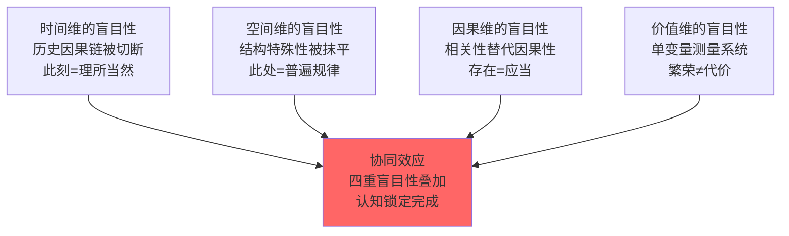

# 盲目性的生产：泛二次元合法性话语中的认知锁定机制

## ——基于4D测绘框架的案例分析

### 摘要

2026年7月，一篇以“政策解读”为框架的网络文章《地铁商场随处可见coser，二次元是未来趋势吗？国家态度早已明确》在社交媒体广泛传播。该文以用户规模、市场数据、政策文件与国风IP案例为经验材料，构建了一个看似“客观中立”的论证框架，并据此得出“二次元是长期稳定增长的主流文娱趋势”的结论。

本文不将该文视为“错误的观点”加以反驳，而是将其视为一个“需要被测绘的现象”——追问它如何运作、为何有效、以及它在更宏观的系统动力学中承担什么功能。基于4D测绘框架（表面现象层—结构层—动力层—时间层），本文系统解剖该文的论证结构，揭示其四个维度的“盲目性”生产机制：（1）时间维的盲目性——切断历史因果链，将“此刻”呈现为“理所当然”；（2）空间维的盲目性——抹平结构特殊性，将“特定历史条件”转化为“普世规律”；（3）因果维的盲目性——以相关性替代因果性，将“存在”等同于“应当”；（4）价值维的盲目性——建立单变量测量系统，将“繁荣”与“代价”分离。本文进一步论证，这四重盲目性并非该文的“错误”或“缺陷”，而是系统在3阶动力学（加加速度）驱动下认知层产生的“惯性效应”——其功能是维持锁定系统的低熵运转，使消费行为在“自然而然”的状态下持续进行。本文的结论是：4D测绘的任务不是“纠正错误”，而是“让盲目性本身变得可见”——当系统内部的认知锁定被揭示为系统性产物时，“理所当然”便不再理所当然。

## 一、引言

### 1.1 问题的提出

2026年7月，一篇题为《地铁商场随处可见coser，二次元是未来趋势吗？国家态度早已明确》的网络文章在微信公众号平台广泛传播。该文以第一人称视角开篇，以政策文件、市场规模数据、公共空间管控规范与国风IP成功案例为经验材料，构建了一个四层递进的论证结构：（1）个人视角转变——“我曾反感，现已改观”；（2）情感价值渲染——“青春色彩、正能量”；（3）经济功能论证——“吸睛王牌、聚拢人气”；（4）文化价值升华——“中国神话、非遗技艺”。最终导向一个明确的结论：“二次元是长期稳定增长的主流文娱趋势”，“家长不必全盘否定”。

该文的传播范围、读者接受度与评论区的情感共鸣表明，它在特定受众群体中具有高度的“说服力”。然而，这种“说服力”的来源值得追问：**该文在经验层面引用的数据是真实的（5.26亿用户、6000亿市场、政策文件确实存在、国风IP确实成功），但其论证的有效性并非来自这些数据的真实性，而是来自一个更深层的机制——它在认知层面完成了一套“盲目性的生产”。**

本文的核心命题是：**该文的“说服力”不是来自“它说对了什么”，而是来自“它让读者停止追问什么”。** 它生产了一种认知状态——读者接受其结论，不是因为结论被严密论证，而是因为论证过程本身“关闭”了所有可能导致质疑的认知通道。

### 1.2 理论框架

本文以4D测绘框架为方法论基础。4D测绘是用于分析文化-金融复合体的系统动力学工具，其四个维度分别对应：

| 维度 | 内容 | 在本研究中的应用 |
| :--- | :--- | :--- |
| **1D：表面现象层** | 可观察的经验数据 | 分析该文引用的用户规模、市场数据、政策文件、国风IP案例 |
| **2D：结构层** | 现象之下的系统构造 | 识别该文省略的社会原子化、社达高压、五重空缺、三层代理结构 |
| **3D：动力层** | 系统的运转机制 | 揭示该文如何通过四层论证完成认知锁定 |
| **4D：时间层** | 系统的历史演化与未来趋势 | 还原该文切断的历史因果链与省略的终局判断 |

在此框架基础上，本文引入系统动力学的“盲目性”概念：**盲目性不是“不知道”，而是“不知道自己在不知道”——它是系统在高阶动力学（加加速度 $j(t) = d^3H/dt^3$）驱动下，认知层产生的“惯性效应”。** 当系统以指数级速度演化时，认知系统为了维持自身稳定，会主动消除“惊奇”和“怀疑”，将所有变化解释为“正常”。

### 1.3 研究方法与核心概念界定

本研究采用**文本分析法**与**系统动力学分析**相结合的研究策略。文本分析的对象为该公众号文章的完整文本，分析单位为其四层论证结构的每一个操作。系统动力学分析的目标是识别该文在四个维度上的“盲目性生产”机制，并将其定位在更宏观的宅逆反馈循环系统中。

| 概念 | 定义 | 在本研究中的应用 |
| :--- | :--- | :--- |
| **盲目性** | 认知系统在高速演化中产生的“惯性效应”——将变化感知为“正常”，将特殊感知为“普遍” | 该文读者接受结论而不追问条件的认知状态 |
| **盲目性的生产** | 通过特定话语操作主动制造“盲目性”的过程 | 该文四层论证的话语操作 |
| **时间维的盲目性** | 历史因果链被切断，此刻被感知为“理所当然” | 该文省略1970-2026年的完整历史链条 |
| **空间维的盲目性** | 结构性条件被抹平，特殊被感知为“普遍” | 该文将中国社达原子化语境下的现象呈现为“全球趋势” |
| **因果维的盲目性** | 相关性被偷换为因果性，“存在”被等同于“应当” | 该文的自然主义谬误（用户多→正当） |
| **价值维的盲目性** | 单变量测量系统，“繁荣”与“代价”被分离 | 该文只测量用户数/市场规模，不测量生育率/原子化程度 |

## 二、四层论证的结构解剖

### 2.1 第一层：个人视角转变——“真诚性”的修辞功能

该文以第一人称叙述开篇：

> “说实话我曾经十分反感二次元夸张的装扮，内心带着不小的偏见。可走在城市街头，频繁邂逅精心还原角色的爱好者后，我的看法慢慢改观。”

这一开篇的功能是建立“真诚性”可信度。以“承认偏见”为起点，以“个人改观”为过程，以“现在的看法”为结论——形成一个闭合的“个人成长叙事”。读者在情感层面与叙述者产生共情，从而为后续的价值判断奠定了“真诚”的基调。

**这一层的隐蔽操作：以个人经验替代结构性分析。**

| 操作 | 表面功能 | 隐蔽功能 |
| :--- | :--- | :--- |
| 承认偏见 | 建立“真诚”可信度 | 预先消解读者可能的质疑：“他承认自己有偏见，所以他现在是客观的” |
| 个人改观 | 提供情感共鸣 | 以“我改了”暗示“你也应该改”——将个人选择转化为道德义务 |
| 经验即结论 | 以个人经验为论证起点 | 回避“系统是否存在问题”的追问——问题被定义为“个人的偏见”而非“系统的结构” |

**这一层生产的是“问题被重新定义”的盲目性**：问题不是“这个产业的结构是否合理”——问题是“我是否也有偏见”。

### 2.2 第二层：情感价值渲染——美学化与道德化的双重操作

该文进而描绘：

> “这群心怀热爱的年轻人，为城市添满鲜活热烈的青春色彩，平淡的日常因为这份独特的美好，变得丰盈有趣。小孩子格外痴迷二次元人物，作品里大多塑造坚守善良、见义勇为的角色，是正义、勇气与正能量的化身。”

这一层完成了两个操作：

**操作一：美学化。** 将复杂的文化产业现象简化为“青春”“色彩”“美好”“丰盈有趣”的情感公式。审美体验被从产业结构中抽离，成为独立的“证据”。

**操作二：道德化。** 将消费行为与“正义”“勇气”“正能量”“善良”“见义勇为”等道德词汇绑定。消费获得了道德光环。

| 操作 | 修辞策略 | 隐蔽功能 |
| :--- | :--- | :--- |
| 美学化 | “青春色彩”“鲜活热烈” | 以审美判断替代价值判断——好看=好 |
| 道德化 | “正义”“勇气”“正能量” | 以道德词汇绑定消费行为——消费=做好事 |
| 无害化 | “小孩子痴迷” | 以“孩子喜欢”论证“无害”——如果孩子都喜欢，那一定是好的 |

**这一层生产的是“价值判断被审美替换”的盲目性**：读者在情感层面接受了“二次元是好的”这一预设，不是因为它在理性上被论证了，而是因为它在情感上被“体验”了。

### 2.3 第三层：经济功能论证——“能赚钱=有价值”的自然主义谬误

该文进一步论证：

> “在商业演出、社区汇演、文化宫文化展览里，二次元一直是吸睛王牌。高度还原的造型极具视觉吸引力，既能聚拢超高人气，帮商铺、场馆留住客源，也极大拓宽了大众的文娱边界。”

这一层的论证形式可以形式化为：

| 前提1 | 二次元能聚拢人气、留住客源、拓宽文娱边界 |
| :--- | :--- |
| 前提2 | 能聚拢人气、留住客源、拓宽文娱边界的事物是有价值的 |
| 结论 | 二次元是有价值的 |

**这是自然主义谬误的典型形式：从“存在”（市场大、用户多）直接推出“应当”（文化正当、值得推崇）。**

问题在于：烟草、赌博同样能“聚拢人气、留住客源、拓宽边界”——但这一事实不能论证其“文化正当性”。“能赚钱”只能说明“有市场需求”，不能说明“有文化价值”。

| 该文的论证 | 等价的荒谬论证 |
| :--- | :--- |
| 用户多→所以文化正当 | 烟草用户多→所以烟草文化正当 |
| 市场大→所以值得推崇 | 赌博市场规模大→所以赌博值得推崇 |
| 能赚钱→所以是趋势 | 毒品贸易能赚钱→所以毒品贸易是趋势 |

**这一层生产的是“价值判断被经济逻辑替代”的盲目性**：读者接受了“能赚钱=有价值”的预设，而不再追问“赚钱的代价是什么”。

### 2.4 第四层：文化价值论证——视觉符号与叙事逻辑的偷换

该文最后强调：

> “不少动漫、cos创作根植于中国神话、古典小说、国风美学，把汉服刺绣、传统纹样、非遗技艺、上古传说融进角色设计。创作者以年轻人喜闻乐见的演绎方式，重新诠释古老故事，打破了大众眼中传统文化枯燥老旧的固有印象。”

这一层的操作是：**将“视觉符号的挪用”等同于“文化内核的传承”。**

| 维度 | 该文呈现的 | 被省略的 |
| :--- | :--- | :--- |
| 视觉层 | 汉服、传统纹样、非遗技艺、上古传说 | 这些符号是否承载了本土的叙事逻辑？ |
| 叙事层 | “重新诠释古老故事” | 诠释的“语法”是日式的还是中式的？ |
| 情感层 | “打破陈旧印象” | 被打碎后重建的情感结构是什么？ |

该文的逻辑等价于：**“穿中国衣服=讲中国故事”。**

问题在于：一个作品是否传承中国文化，不取决于它是否使用了中国视觉元素，而取决于它的叙事逻辑、情感驱动模式和价值判断框架是否植根于中国文化传统。将“视觉元素的出现”等同于“文化内核的传承”，是一种概念偷换。

| 该文的操作 | 偷换的内容 |
| :--- | :--- |
| 汉服刺绣、传统纹样 | 视觉符号（表皮） |
| → “文化传承” | 叙事逻辑（骨骼） |
| 以上两者被偷换为等价关系 | 表皮≠骨骼 |

**这一层生产的是“文化认同被视觉符号替代”的盲目性**：读者接受了“看到中国元素=文化传承”的预设，而不再追问“讲故事的方式是否也是中国的”。

### 2.5 四层论证的协同效应

四层论证的协同效应可以通过以下流程图表示：

**每一层都在关闭一个“追问的通道”：**

| 层 | 关闭的追问 |
| :--- | :--- |
| 第一层 | “这个产业的结构是否合理？”→被替换为“我是否也有偏见？” |
| 第二层 | “这个产业对人的影响是什么？”→被替换为“我是否感受到了美好？” |
| 第三层 | “这个产业的代价是什么？”→被替换为“它能不能赚钱？” |
| 第四层 | “这个产业的叙事逻辑是什么？”→被替换为“它有没有中国元素？” |

## 三、4D测绘：盲目性生产的四个维度

### 3.1 时间维的盲目性：历史因果链的切断

该文将“此刻的繁荣”呈现为“理所当然的现在”，省略了完整的历史链条：

| 被省略的历史环节 | 在系统分析中的功能 | 省略的修辞效果 |
| :--- | :--- | :--- |
| 1970-1995年：日式ACG在日本“失去的三十年”中的退缩式回应 | 揭示“羁绊美学”和“世界系叙事”是特定历史条件的产物 | 使“日式模板”与“二次元”在概念上分离——抹去其“非普世”的来源 |
| 1995-2015年：文化模板的全球输入与内化过程 | 揭示“日式审美标准”如何被输入并内化为“常识” | 使“外来模板”被感知为“天然标准”——抹去其“输入”的痕迹 |
| 2015-2026年：下沉安装、代际扎根、锁定完成 | 揭示“8-18岁人格形成期不可逆植入”的机制 | 使“锁定的状态”被感知为“自由的选择”——抹去其“不可逆”的代价 |
| **被省略的终局** | 揭示不可回归临界点、认知灭绝、文明再生产断裂 | 使“繁荣”被感知为“可持续的趋势”——抹去其“终局”的警告 |

**该文将时间维压缩为“此刻”，使读者丧失了对“此刻何以成为此刻”的历史意识。** “现在”不再是“过程的截面”，而是“永恒的状态”。

### 3.2 空间维的盲目性：结构特殊性的抹平

该文将“中国此刻的二次元繁荣”呈现为“全球文化趋势”的证明，省略了：

| 被省略的结构条件 | 在系统分析中的功能 | 省略的修辞效果 |
| :--- | :--- | :--- |
| 社会原子化（3.76亿流动人口、5800万空巢青年） | 揭示“归属饥渴”作为需求侧条件 | 使“需求”被感知为“偏好”——抹去其“结构性被迫”的来源 |
| 社达高压（985录取率1.5%、35岁危机、996） | 揭示“结构性创伤”作为心理前提 | 使“填补”被感知为“选择”——抹去其“不得不”的根源 |
| 五重空缺（情感、归属、意义、未来、尊严） | 揭示“空缺接口性”作为接入条件 | 使“填补”被感知为“满足”——抹去其“被制造”的痕迹 |

**该文将空间维压缩为“此处”，使读者丧失了对“此处何以成为此处”的结构意识。** “中国”不再是“特定历史条件下的特定状态”，而是“普世趋势的局部表现”。

### 3.3 因果维的盲目性：相关性与因果性的偷换

该文用四个“因为→所以”链条建立了虚假的因果联系：

| 该文的因果链条 | 省略的中介变量 | 实际的关系 |
| :--- | :--- | :--- |
| “用户多”→所以“文化正当” | 空缺制造深度、替代选项缺失、成瘾锁定机制 | 用户多是“结果”，不是“原因”——它由更深层的结构性条件产生 |
| “市场大”→所以“值得推崇” | 虚拟替代品对真实行动的替代效应、边际效用递减 | 市场大是“规模”，不是“品质”——它不携带任何价值判断 |
| “国风IP成功”→所以“日式模板被认可” | 国风IP的叙事底层是中式而非日式 | 国风IP的成功恰恰说明“不必依赖日式模板”——它与“日式模板被认可”呈相反因果关系 |
| “政策扶持动漫”→所以“国家认可二次元” | 国家扶持的是“产业形态”与“经济功能”，而非“文化内涵” | 政策扶持的是“替代方案”，而非“被替代对象” |

**该文将因果维简化为“A→B”的直线，使读者丧失了对“复杂因果网络”的认知。** “用户多”不再是需要被解释的“结果”，而成为论证“正当性”的“原因”。

### 3.4 价值维的盲目性：单变量测量系统的建立

该文建立了一个只测量“繁荣”指标的测量系统：

| 测量的变量 | 被排除的变量 | 排除的修辞功能 |
| :--- | :--- | :--- |
| 用户数（5.26亿） | 生育率（<1.0） | 使“繁荣”与“代价”在认知中分离 |
| 市场规模（6000亿） | 社会原子化程度（流动人口3.76亿） | 使“经济增长”被感知为“社会进步” |
| 年增长率（40%） | B型语法萎缩程度 | 使“扩张速度”掩盖“锁定深度” |
| 政策扶持文件 | 不可回归临界点的逼近速度 | 使“合法性”替代“可持续性” |

**该文将价值维简化为“繁荣→好”的单向判断，使读者丧失了对“繁荣的代价”的追问能力。** “好”不再是需要被论证的价值判断，而是被数据“自动证明”的结论。

### 3.5 四维盲目性的协同生产

**四重盲目性的协同效应是：读者在时间、空间、因果、价值四个维度上同时丧失了追问的能力。** 不是因为“没有人告诉他真相”，而是因为“问题的结构本身已经被关闭”——每一个可能导致“怀疑”的认知通道都被预先封堵。

## 四、盲目性的系统功能：为什么系统需要生产它

### 4.1 “盲目性”在系统动力学中的位置

在宅逆反馈循环系统中，“盲目性”不是一个“副作用”——它是系统维持自身稳定性的必要条件。

| 系统状态 | 读者的认知状态 | 系统的需求 |
| :--- | :--- | :--- |
| 系统正在以 $dH/dt$ 的速度扩张 | 如果读者感知到“速度”，可能产生警觉 | 需要使读者“感知不到速度” |
| 系统正在以 $d^2H/dt^2$ 的加速度加速 | 如果读者感知到“加速度”，可能产生恐慌 | 需要使读者“感知不到加速度” |
| 系统正在以 $d^3H/dt^3$ 的加加速接近临界点 | 如果读者感知到“加加速”，可能产生行动 | 需要使读者“感知不到加加速” |

**“盲目性”的功能是：使系统的“运动”对系统内部的人来说是不可见的。** 就像鱼感受不到水、人感受不到地球的自转——当系统以指数级速度演化时，系统内部的人感知到的却是“静止”和“正常”。

### 4.2 公众号文章作为“盲目性生产机器”

在该文的四层结构中，每一层都在完成一个特定的“盲目性生产”任务：

| 层 | 生产的盲目性类型 | 在系统中的功能 |
| :--- | :--- | :--- |
| 第一层：个人视角转变 | **问题定义权的盲目性** | 读者接受“问题是我有偏见”→不再追问系统结构 |
| 第二层：情感价值渲染 | **判断标准的盲目性** | 读者接受“美即好”→不再追问影响与代价 |
| 第三层：经济功能论证 | **价值尺度的盲目性** | 读者接受“钱即价值”→不再追问文化的本质 |
| 第四层：文化价值论证 | **文化认同的盲目性** | 读者接受“符号即文化”→不再追问叙事逻辑 |

**四层协同，生产了一种“完整的盲目性状态”：读者在消费该文后，不仅接受了“二次元是好的”这一结论，而且丧失了追问“这个结论是如何被生产的”的能力。**

### 4.3 “盲目性”如何维持锁定系统

系统维持低熵运转需要满足一个条件：**系统内部的人不感知系统的存在。**

- 如果读者感知到“成瘾锁定”，他可能尝试退出
- 如果读者感知到“六条锁链”，他可能评估退出成本
- 如果读者感知到“不可回归临界点”，他可能在临界点到达前采取行动

**“盲目性”的功能就是阻止上述感知的发生。** 它通过以下机制运作：

| 机制 | 操作 | 效果 |
| :--- | :--- | :--- |
| 切断历史 | 此刻=永恒 | 读者丧失“过程感”—不感知系统的演化方向 |
| 抹平结构 | 此处=普遍 | 读者丧失“条件感”—不感知系统的存在前提 |
| 偷换因果 | 相关=因果 | 读者丧失“追问感”—不感知系统的动力来源 |
| 排除代价 | 繁荣=好 | 读者丧失“代价感”—不感知系统的负面效应 |

**当这四种“感”同时丧失时，读者就进入了“盲目性”状态——他不知道自己不知道，他以为自己“了解了”。**

## 五、结论：地图如何使盲目性失效

### 5.1 打破盲目性的条件

“盲目性”不是通过“告诉读者真相”就能打破的——因为“真相”本身可能已经被“盲目性”的结构所排斥。读者不是“不知道真相”——他是“不知道自己在不知道”。因此，打破“盲目性”需要的是：

**不是“告诉他一个不同的答案”，而是“让他看到‘问题本身是如何被生产的’。”**

| 公众号的操作 | 打破盲目性的操作 |
| :--- | :--- |
| 给出答案 | 揭示“答案是如何被生产的” |
| 呈现结论 | 还原“结论背后的结构性条件” |
| 提供数据 | 追问“数据的另一半在哪里” |
| 建立因果 | 揭示“被省略的中介变量” |

### 5.2 4D测绘的反操作

4D测绘通过以下反操作打破“盲目性”：

| 维度 | 公众号的操作（制造盲目性） | 4D测绘的反操作（打破盲目性） |
| :--- | :--- | :--- |
| 时间维 | 切断历史，此刻=永恒 | 还原历史，此刻=过程的截面 |
| 空间维 | 抹平结构，此处=普遍 | 还原结构，此处=特殊条件的产物 |
| 因果维 | 偷换因果，相关=因果 | 还原因果，相关≠因果 |
| 价值维 | 排除代价，繁荣=好 | 还原代价，繁荣+代价=完整系统 |

### 5.3 最终命题

> **公众号文章《地铁商场随处可见coser，二次元是未来趋势吗？国家态度早已明确》的“说服力”不是来自“它说对了什么”，而是来自“它让读者停止追问什么”。它通过四层论证结构（个人视角转变、情感价值渲染、经济功能论证、文化价值论证），在时间、空间、因果、价值四个维度上同时完成了“盲目性”的生产，使读者在消费该文后丧失了追问“系统结构是什么”“代价在哪里”“临界点何时到来”的能力。**
>
> **“盲目性”不是该文的“错误”或“缺陷”——它是系统在3阶动力学（加加速度）驱动下认知层产生的“惯性效应”，其功能是维持锁定系统的低熵运转，使消费行为在“自然而然”的状态下持续进行。**
>
> **4D测绘的任务不是“纠正错误”，而是“让盲目性本身变得可见”。当系统内部的认知锁定被揭示为系统性产物时，“理所当然”便不再理所当然——读者开始感知到自己“不知道自己在不知道”，而这正是打破盲目性的起点。**

## 参考文献

[1] 地铁商场随处可见coser，二次元是未来趋势吗？国家态度早已明确[EB/OL]. 微信公众号，2026-07.

[2] 《泛二次元总纲：文化生态的完整生命周期》，2026.

[3] 《情感操作系统：泛二次元、泛游戏与明星工业的填补-占领机制及其反馈循环研究》，2026.

[4] 《宅的逆反馈循环：泛二次元文化工业中的社会动力学模型》，2026.

[5] 《年龄敏感开关：泛二次元锁定系统中的年龄分层与排异阈值研究》，2026.

[6] 《论战论辩分化与胜利悖论：泛二次元公共空间中两套判断标准的并行运行》，2026.

[7] 马克思. 资本论（第一卷）[M]. 北京：人民出版社，2004.

[8] 葛兰西. 狱中札记[M]. 曹雷雨，等译. 北京：中国社会科学出版社，2000.

[9] 法农. 黑皮肤，白面具[M]. 陈瑞桦，译. 台北：心灵工坊，2005.

[10] 阿尔都塞. 意识形态与意识形态国家机器[M]//陈越，编. 哲学与政治：阿尔都塞读本. 长春：吉林人民出版社，2003.

**全文完**

*研究完成日期：2026年7月*
*方法论基础：4D测绘框架 + 系统动力学分析 + 文本分析*
*核心概念：盲目性的生产、认知锁定、四维压缩*