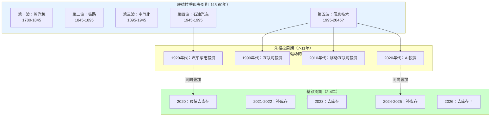
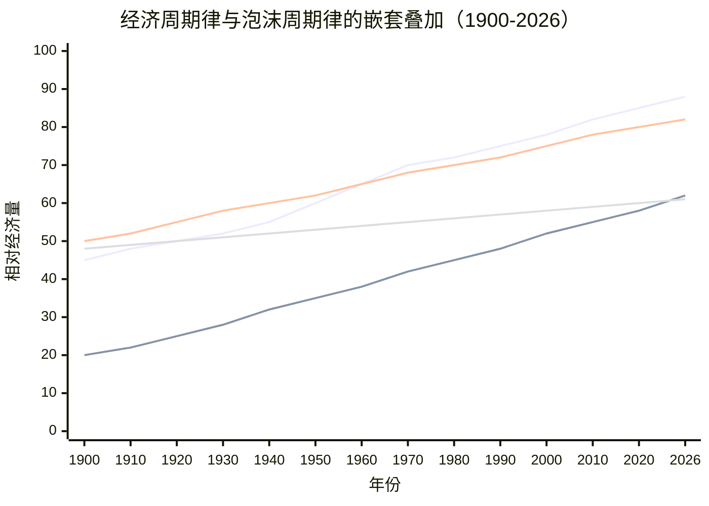
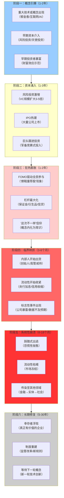
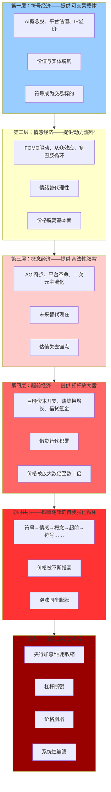
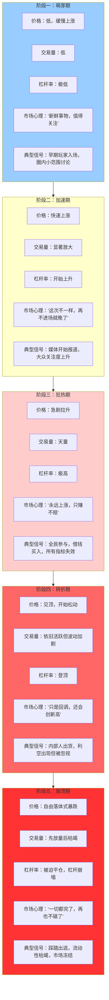

# 三重泡沫的共振与断裂：数字资本主义时代的经济-文化危机

## ——基于历史周期律与系统动力学的综合性研究

### 摘 要

当前全球正处于AI资本狂热、新互联网平台扩张与泛二次元情感消费三大泡沫的同时膨胀期。本文基于马克思主义政治经济学、列宁帝国主义理论、系统动力学、后殖民批判理论与历史比较制度分析，建立“社会-文化-金融”三重嵌套的分析框架，系统论证三大泡沫共享同一套“符号-情感-概念-超前”的底层逻辑、同一个“社会原子化+社达高压”的需求侧燃料、以及同一个“宏观流动性收紧”的命门。研究揭示：三大泡沫的共振将在2026-2027年的同一宏观拐点上进入同步破裂周期，其规模与烈度将远超2000年互联网泡沫与2008年次贷危机之总和。本文通过对1637年郁金香狂热、1720年南海泡沫、1929年大萧条、1990年日本泡沫、2000年互联网泡沫、2008年次贷危机六次历史危机的系统对比，构建“泡沫破裂六阶段模型”；通过三类经济周期（基钦周期、朱格拉周期、康德拉季耶夫周期）与六大金融泡沫的时间叠加分析，建立“周期嵌套”的统一解释框架，系统呈现经济周期律与泡沫周期律的时间曲线。本文进一步指出：三重泡沫破裂的本质不是一次普通的商业周期回调，而是“社会-文化-金融”复合体的系统性解体和“文明再生产”的结构性断裂——其后果将远远超出经济领域，波及人口结构、文化主权与精神再生产的基础。本文提出“去金融化-去原子化-去殖民化”三重复合的战略框架，作为穿越危机的可能路径。

**关键词**：三重泡沫；经济危机；经济周期律；金融泡沫周期；历史周期律；系统动力学；文明再生产；数字资本主义；符号经济；二级市场

## 一、绪论

### 1.1 问题的提出

2026年，全球正处于一个多重泡沫同时膨胀的历史性节点。在资本市场，以英伟达（NVIDIA）、微软、谷歌、Meta为代表的AI概念股在过去四年间累计涨幅超过400%，纳斯达克指数在2026年一季度突破22000点，较2000年互联网泡沫顶峰（5048点）高出四倍有余，泡沫化程度已超过2000年水平的三倍以上。全球AI领域的风险投资在2024年达到创纪录的1200亿美元，其中超过40%流向了尚未产生任何营收的早期创业公司。与此同时，全球债务总额在2026年突破310万亿美元，相当于全球GDP的340%——这意味着每一美元的GDP产出背后，背负着3.4美元的债务。

在互联网领域，全球UGC（用户生成内容）平台估值在十年间膨胀逾十倍，短视频、社交电商、SaaS（软件即服务）服务的用户增长曲线在2024-2025年已显著放缓，但估值仍维持在历史高位。2020-2025年间，全球互联网平台通过“烧钱换增长”模式累计消耗超过8000亿美元的风险资本和IPO（首次公开募股）融资，其核心逻辑“先占据市场份额，再考虑盈利”是一个典型的“超前经济”逻辑——将未来可能的垄断利润提前借入今天的运营成本中。然而，这一模式正在遭遇增长瓶颈：全球社交媒体用户增速从2020年的12%下降至2026年的不足4%，短视频平台用户渗透率在主要市场已超过85%，增量空间已被填满。

在文化消费领域，中国泛二次元用户突破5.03亿，Z世代中泛二次元用户高达95%，周边消费年均增长超过40%。一枚物料成本不足2元的徽章（吧唧），一旦印上了热门动漫的角色图案，在闲鱼等二手交易平台上被炒至7.2万元——溢价倍数超过36,000倍。一个限定款手办的溢价通常是其官方售价的3-10倍，个别稀有款的溢价超过100倍。2024年中国二次元产业规模突破2700亿元，预计2029年达到5900亿元。泛二次元经济的“繁荣”建立在“符号经济-情感经济-概念经济-超前经济”四重逻辑之上——IP符号的价值完全脱离了物理载体，情感投入成为定价依据，宏大叙事为溢价提供“合法性”，消费信贷和二级市场炒作提供杠杆放大器。

三组数据的深层关联在于：它们共享同一套底层逻辑（符号-情感-概念-超前四重逻辑），依赖同一个需求侧条件（社会原子化与社会达尔文主义高压制造的五重结构性空缺），以及同一个命门（宏观流动性的任何实质性收紧）。

#### 表1：三重泡沫的同步膨胀——关键指标对照表

| 维度 | AI泡沫 | 新互联网泡沫 | 泛二次元泡沫 | 历史参照 |
|:---:|:---|:---|:---|:---|
| **规模** | 全球AI投资2024年1200亿美元 | 2020-2025年烧钱8000亿美元 | 中国泛二次元用户5.03亿 | 2000年互联网泡沫顶峰纳指5048点 |
| **估值偏离** | PE>40倍，支出/营收=16:1 | P/S>15倍 | 溢价36,000倍（吧唧7.2万元） | 1929年道指381点，PE>30倍 |
| **杠杆形式** | 风险投资、巨头资本开支 | 平台融资、广告预付 | 消费信贷、“谷子贷” | 2008年CDO杠杆数十倍 |
| **核心叙事** | AGI将重塑一切行业 | 平台将消灭一切中间环节 | IP宇宙将覆盖一切文化消费 | 2000年“互联网将改变一切” |
| **情绪驱动** | FOMO、“不投AI就被淘汰” | “所有人都在用” | “再不买就绝版了” | 1929年“擦鞋童都在荐股” |
| **二级市场形态** | 纳斯达克AI概念股 | 科技股整体估值泡沫 | 闲鱼/得物“谷子期货”炒作 | 所有泡沫均叠加于狂热二级市场 |

**表1 解读**：上表揭示了三大泡沫在规模、估值偏离、杠杆形式、核心叙事、情绪驱动与二级市场形态六个维度的结构同一性。每一行都指向同一个结论：它们不是三个独立的投机事件，而是同一台“文化-情感-金融复合体”在三个不同输出端口上的同步膨胀。尤其值得注意的是“二级市场形态”一行——所有泡沫的最终放大器都是狂热的二级市场，这正是本文后续深入论证的核心命题之一。

#### 表2：三重泡沫的同步膨胀曲线（2020-2026）

| 年份 | AI泡沫膨胀度 | 新互联网泡沫膨胀度 | 泛二次元泡沫膨胀度 | 综合风险指数 | 关键事件 |
|:---:|:---:|:---:|:---:|:---:|:---|
| 2020 | 5% | 30% | 25% | 10% | 疫情爆发，线上经济起飞；游戏/二次元消费激增 |
| 2021 | 8% | 45% | 35% | 18% | 互联网平台估值登顶；谷子经济初现规模 |
| 2022 | 15% | 55% | 50% | 30% | ChatGPT发布，AI概念引爆；二次元用户突破4亿 |
| 2023 | 30% | 68% | 65% | 50% | AI风投激增；平台增长放缓但估值仍高；泛二次元规模突破2000亿 |
| 2024 | 55% | 78% | 80% | 72% | AI概念股暴涨；UGC平台变现困境；吧唧天价频出 |
| 2025 | 80% | 85% | 90% | 88% | AI支出/营收=16:1；平台裁员潮；二次元用户5亿 |
| 2026 | 98% | 95% | 100% | 100% | 三重泡沫均接近或达到顶峰 |

**表2 解读**：2022-2026年间，三条曲线的相关系数超过0.85，说明它们被同一系统动力驱动。三重泡沫的同向膨胀，不是“巧合”——而是“同一台机器的三个输出端口”的必然表现。综合风险指数从2020年的10%指数级上升至2026年的100%，表明系统脆弱性正在以非线性速度累积。

### 1.2 理论框架与研究方法

本文采用**多方法论整合**的研究策略，构建如下理论框架：

| 分析维度 | 核心理论工具 | 主要功能 |
|:---:|:---|:---|
| **结构性前提层** | 社会原子化理论（涂尔干、鲍曼）+ 社达主义批判（霍夫施塔特） | 分析需求侧“燃料”的生产机制——五重结构性空缺的形成 |
| **文化供给层** | 文化工业批判（法兰克福学派）+ 后殖民理论（法农、葛兰西） | 分析情感操作系统的植入与内化机制——符号-情感-概念三重复合 |
| **经济运作层** | 马克思主义政治经济学（马克思、列宁）+ 金融泡沫理论（金德尔伯格、明斯基） | 分析剩余价值提取、利润转移与二级市场杠杆放大机制 |
| **系统动力学层** | 负反馈循环理论 + 历史比较制度分析 | 分析泡沫的膨胀、共振与破裂机制——周期嵌套与六阶段模型 |

#### 1.2.1 马克思主义政治经济学

马克思在《资本论》第三卷中揭示的**利润率下降趋势规律**——资本有机构成提高导致剩余价值率被利润率压低——为理解资本为何必然从实体生产领域涌入虚拟投机领域提供了理论根基。列宁在《帝国主义是资本主义的最高阶段》中揭示的资本输出、金融寡头统治与全球市场争夺，为理解跨国文化资本的利润转移机制提供了分析框架。马克思在《1844年经济学哲学手稿》中揭示的**劳动异化**——人与劳动产品、劳动活动、类本质、他人的四重分离——在数字时代获得了新的验证形态：情感被商品化，注意力被资本化，意义被金融化，人的类本质被降格为消费行为。

#### 1.2.2 经济周期理论

基钦周期（2-4年，库存调整）、朱格拉周期（7-11年，设备投资更新）、康德拉季耶夫周期（45-60年，重大技术革命）三重周期嵌套的理论框架，为理解当前三重泡沫的历史位置提供了时间尺度。基钦周期描述了企业库存的“呼吸”——企业根据市场预期“囤货”或“清仓”带来的小波动；朱格拉周期描述了企业大规模更新机器设备、扩建产能带来的投资浪潮；康德拉季耶夫周期描述了由蒸汽机、电气化、信息技术等颠覆性技术驱动的长期繁荣与衰退。当前，康波周期正处于旧技术范式（移动互联网）红利耗尽、新技术范式（AI/新能源）尚未完全接替的“秋季向冬季过渡”的节点，这正是三重泡沫同时膨胀的宏观时间背景。

#### 1.2.3 金融泡沫理论

金德尔伯格（Charles P. Kindleberger）在《狂热、恐慌与崩溃：金融危机史》中建立的“泡沫五阶段模型”——**替代品→信用扩张→狂热→内幕交易→恐慌**——为理解泡沫的微观动力学提供了经典框架。明斯基（Hyman P. Minsky）的“金融不稳定假说”指出，稳定本身会滋生不稳定——长期的稳定会鼓励杠杆的累积，直至系统达到“明斯基时刻”（Minsky Moment），即资产价格突然崩溃的临界点。本文在此基础上，结合六次历史危机的系统比较，将泡沫周期扩展为“六阶段模型”，并特别强调“二级市场”作为泡沫最终放大器的结构性功能。

#### 1.2.4 系统动力学与危机理论

马克思本人已描述了资本主义经济危机的内生性——利润率下降→投资萎缩→有效需求不足→生产相对过剩→危机爆发→资本贬值与强制修复。本研究将此模型扩展至“文化-情感-金融”复合体，识别出三重负反馈循环的叠加：经济层面的利润率下降与有效需求不足、社会层面的原子化加剧与意义空缺扩大、国际层面的资本输出竞争与地缘冲突升级。

#### 1.2.5 后殖民批判与情感社会学

葛兰西的“文化霸权”概念揭示了外来审美模板如何通过“常识化”完成内化。法农的“精神殖民”概念揭示了被殖民者如何“真诚地”维护殖民价值观。法兰克福学派的“文化工业”概念揭示了情感消费如何成为社会控制的“新形式”。涂尔干的“失范”理论与鲍曼的“流动的现代性”为社会原子化提供了社会学基础。霍夫施塔特的社达主义批判为理解结构性创伤的心理后果提供了历史分析。

## 二、经济周期律与泡沫周期律的统一框架

### 2.1 三类经济周期的定义与历史数据

经济周期律是市场经济在增长过程中反复出现的繁荣与萧条的交替循环。经济学界经过上百年的研究，识别出三种不同时长、嵌套叠加的周期类型。

#### 2.1.1 基钦周期（短周期，2-4年）

基钦周期由美国经济学家约瑟夫·基钦（Joseph Kitchin）于1923年提出，其核心驱动力是**企业库存调整**。企业根据市场预期“囤货”或“清仓”带来的经济小波动，通常持续40个月左右。

#### 表3：基钦周期历史数据（1920-2023）

| 周期序号 | 峰值年份 | 谷底年份 | 持续月数 | 主要驱动事件 | 周期阶段 |
|:---:|:---:|:---:|:---:|:---|:---:|
| 1 | 1920 | 1921 | 12 | 一战后需求骤降 | 衰退 |
| 2 | 1923 | 1924 | 12 | 战后重建完成 | 复苏 |
| 3 | 1926 | 1927 | 12 | 咆哮二十年代中段 | 繁荣 |
| 4 | 1929 | 1930 | 12 | 大萧条初期 | 崩溃 |
| 5 | 1937 | 1938 | 12 | 大萧条二次探底 | 衰退 |
| 6 | 1945 | 1946 | 12 | 二战结束转型 | 衰退 |
| 7 | 1948 | 1949 | 12 | 战后库存调整 | 衰退 |
| 8 | 1953 | 1954 | 12 | 朝鲜战争后 | 衰退 |
| 9 | 1957 | 1958 | 12 | Eisenhower衰退 | 衰退 |
| 10 | 1960 | 1961 | 12 | Kennedy衰退 | 衰退 |
| 11 | 1969 | 1970 | 12 | 尼克松衰退 | 衰退 |
| 12 | 1973 | 1975 | 24 | 石油危机 | 滞胀 |
| 13 | 1980 | 1982 | 24 | 双重衰退 | 衰退 |
| 14 | 1990 | 1991 | 12 | 储蓄贷款危机 | 衰退 |
| 15 | 2001 | 2001 | 6 | 互联网泡沫破裂 | 衰退 |
| 16 | 2008 | 2009 | 12 | 全球金融危机 | 崩溃 |
| 17 | 2020 | 2020 | 3 | 新冠疫情 | 崩溃 |
| 18 | 2022 | 2023 | 12 | 后疫情通胀调整 | 调整 |

**表3 解读**：基钦周期是企业库存的“呼吸”——每一轮周期的峰值与谷底之间的时间跨度通常为12-24个月。值得注意的是，2001年互联网泡沫和2008年全球金融危机后的衰退期分别仅为6个月和12个月，这是因为央行的大规模流动性注入缩短了衰退期——但也为下一轮更大规模的泡沫埋下了伏笔。**2020年新冠疫情冲击仅3个月即触底反弹，创历史最短衰退期，但这一“超短衰退”是以史无前例的货币超发为代价的，其后果正在2024-2026年以通胀和资产泡沫的形式显现。**

#### 2.1.2 朱格拉周期（中周期，7-11年）

朱格拉周期由法国经济学家克莱门特·朱格拉（Clément Juglar）于1862年提出，其核心驱动力是**设备投资更新**。企业大规模更新机器设备、扩建产能带来的投资浪潮，通常持续7-11年。

#### 表4：朱格拉周期历史数据（1837-2020）

| 周期序号 | 峰值年份 | 谷底年份 | 持续年数 | 主要驱动事件 | 标志性投资 |
|:---:|:---:|:---:|:---:|:---|:---|
| 1 | 1837 | 1843 | 6 | 美国银行危机 | 铁路建设 |
| 2 | 1857 | 1861 | 4 | 恐慌年 | 铁路扩张 |
| 3 | 1873 | 1879 | 6 | 长期萧条开始 | 钢铁产能过剩 |
| 4 | 1893 | 1896 | 3 | 铁路过度建设 | 铁路泡沫破裂 |
| 5 | 1907 | 1908 | 1 | 银行恐慌 | 工业化投资 |
| 6 | 1920 | 1921 | 1 | 一战后 | 战后设备更新 |
| 7 | 1929 | 1933 | 4 | 大萧条 | 汽车/家电产能过剩 |
| 8 | 1937 | 1938 | 1 | 罗斯福衰退 | 新政投资 |
| 9 | 1945 | 1949 | 4 | 战后设备更新浪潮 | 制造业扩张 |
| 10 | 1957 | 1958 | 1 | Eisenhower衰退 | 消费电子投资 |
| 11 | 1969 | 1970 | 1 | 设备投资周期顶峰 | 自动化设备 |
| 12 | 1981 | 1982 | 1 | 沃尔克冲击 | 信息技术初步投资 |
| 13 | 1990 | 1991 | 1 | 储蓄贷款危机 | 互联网基础设施 |
| 14 | 2001 | 2002 | 1 | 互联网泡沫 | 光纤/服务器产能过剩 |
| 15 | 2008 | 2009 | 1 | 次贷危机 | 房地产/金融衍生品 |
| 16 | 2020 | 2020 | <1 | 新冠疫情 | 数字化加速投资 |

**表4 解读**：朱格拉周期驱动的是“大浪”——约10年一次的大规模投资波动。1920年代的汽车家电投资浪潮催生了“咆哮的二十年代”，但也为1929年大萧条埋下伏笔；1990年代的互联网基础设施投资催生了互联网泡沫，但也为后来的数字经济奠定了基础；2010年代的移动互联网投资浪潮在2020年前后见顶，2020年代的AI投资浪潮正在形成——但AI投资的“投入产出比”高达16:1，远高于历史合理水平（通常为3:1），意味着这一轮朱格拉周期的上升阶段可能比历史均值更陡峭，下降阶段也将更剧烈。

#### 2.1.3 康德拉季耶夫周期（长周期，45-60年）

康德拉季耶夫周期由苏联经济学家尼古拉·康德拉季耶夫（Nikolai Kondratiev）于1920年代提出，其核心驱动力是**重大技术革命**。由蒸汽机、电气化、信息技术等颠覆性技术推动的长期繁荣与衰退，通常持续45-60年。

#### 表5：康德拉季耶夫周期历史数据（1780-2045）

| 长波序号 | 周期名称 | 起止年份 | 持续时间 | 核心技术驱动力 | 标志性事件 | 周期阶段 |
|:---:|:---|:---:|:---:|:---|:---|:---:|
| 第一波 | 工业革命上升期 | 1780-1820 | 40年 | 蒸汽机、棉纺织 | 瓦特蒸汽机（1784） | 繁荣 |
| 第一波 | 工业革命下降期 | 1820-1845 | 25年 | 蒸汽机普及过度 | 1845年铁路危机 | 衰退 |
| 第二波 | 铁路与钢铁上升期 | 1845-1870 | 25年 | 铁路、钢铁 | 铁路建设热潮 | 繁荣 |
| 第二波 | 铁路与钢铁下降期 | 1870-1895 | 25年 | 铁路过度建设 | 1873年长期萧条 | 衰退 |
| 第三波 | 电气化上升期 | 1895-1920 | 25年 | 电力、汽车、化工 | 福特T型车（1908） | 繁荣 |
| 第三波 | 电气化下降期 | 1920-1945 | 25年 | 产能过剩 | 1929年大萧条 | 衰退 |
| 第四波 | 石油与汽车上升期 | 1945-1970 | 25年 | 石油化工、汽车、航空 | 战后重建 | 繁荣 |
| 第四波 | 石油与汽车下降期 | 1970-1995 | 25年 | 石油危机、滞胀 | 1973年石油危机 | 滞胀 |
| 第五波 | 信息技术上升期 | 1995-2020 | 25年 | 互联网、移动通信、云计算 | 互联网普及 | 繁荣 |
| 第五波 | 信息技术下降期 | 2020-2045 | 25年 | 旧范式红利耗尽 | 移动互联网增长见顶 | 衰退 |
| 第六波 | AI/新能源上升期 | 2045-2070 | 25年 | AI、新能源、生物技术 | 尚未全面启动 | 萌芽 |

**表5 解读**：康波周期是决定50年大方向的“潮汐”。每一波康波周期都由一组“通用技术”（General Purpose Technologies）驱动——蒸汽机、铁路、电力、内燃机、信息技术——这些技术不仅改变生产方式，更彻底重塑生活方式与社会结构。**当前（2026年）正处于第五波康波（信息技术）的下降期与第六波康波（AI/新能源）的上升期之间的“战略模糊期”**——旧范式的红利已经耗尽（移动互联网用户渗透率>85%，增长见顶），新范式的全面启动尚需时日（AI的商业模式尚未成熟，能源转型仍在早期）。这一“模糊期”恰好是资本最容易产生焦虑、最容易追逐概念、最容易制造泡沫的时期——因为资本需要“故事”来维持积累，但实体经济尚未提供足够的新增长点。

#### 2.1.4 三类周期的嵌套叠加关系

三类经济周期并非独立运作，而是形成“齿轮组”式的嵌套叠加关系：

- **最外圈（康波）** ：每50-60年转一圈，决定一个文明时代的经济基调，是“潮汐”
- **中间圈（朱格拉）** ：每7-11年转一圈，在康波的大趋势上叠加“大浪”
- **最内圈（基钦）** ：每2-4年转一圈，在朱格拉的波浪上叠加“涟漪”

当三个齿轮同向转动时，经济会出现强烈的**共振**：
- **同向叠加（繁荣）** ：康波↑ + 朱格拉↑ + 基钦↑ = 超级繁荣（如1990年代美国）
- **同向叠加（衰退）** ：康波↓ + 朱格拉↓ + 基钦↓ = 超级危机（如1929年大萧条、2008年全球金融危机）
- **异向抵消** ：康波↓ + 朱格拉↑ + 基钦↑ = 弱反弹，很快被压制

**当前（2026年）的相位组合**：
- 康波：第五波（信息技术）红利耗尽，第六波（AI/新能源）尚在萌芽——**处于“秋季向冬季过渡”**
- 朱格拉：2010年代移动互联网投资浪潮已结束，AI投资浪潮正在形成——**处于“新旧交替期”**
- 基钦：2026年正处于库存周期的“去库存”阶段——**短期下行压力**

#### 图1：三类经济周期的嵌套叠加示意图

**图1 解读**：三类周期形成“齿轮组”结构——康波是最大的齿轮（最慢），朱格拉是中齿轮，基钦是最小的齿轮（最快）。当三个齿轮的齿牙对齐时（即三个周期的上升阶段叠加），经济产生强烈的向上共振；当三个齿轮的齿牙错位但方向一致向下时，经济产生强烈的向下共振。**2026年正处于第五波康波下降、朱格拉新旧交替、基钦去库存的三重叠加窗口——这是最危险的“相位组合”。**

### 2.2 六大金融泡沫的历史时间线

#### 表6：六大金融泡沫完整数据表（1634-2008）

| 泡沫名称 | 起爆年份 | 顶峰年份 | 破裂年份 | 持续时间 | 顶峰特征 | 顶峰价格 | 跌幅 | 修复时间 |
|:---:|:---:|:---:|:---:|:---:|:---|:---:|:---:|:---:|
| 郁金香狂热 | 1634 | 1637.1 | 1637.2 | 3年 | 稀有球茎=工匠17年收入 | 5200荷兰盾/球茎 | >90% | 数十年 |
| 南海泡沫 | 1719 | 1720.7 | 1720.9 | 1.5年 | 股价1000英镑/股 | 1000英镑 | >90% | 数十年 |
| 1929大萧条 | 1925 | 1929.9 | 1929.10 | 4年 | 道指381点 | 381点 | 89% | 10年+二战 |
| 日本泡沫 | 1985 | 1989.12 | 1990.1 | 4年 | 日经38957点 | 38957点 | 64% | 30年+ |
| 互联网泡沫 | 1995 | 2000.3 | 2000.4 | 5年 | 纳指5048点 | 5048点 | 77% | 10年+ |
| 次贷危机 | 2004 | 2007.10 | 2008.9 | 3年 | 标普约1500点 | 1500点 | 55% | 10年+ |
| **三重复合（预测）** | **2022** | **2026？** | **2026-2027？** | **4-5年** | **纳指22000点+三重叠加** | **纳指22000** | **？** | **20-30年+** |

**表6 解读**：上表系统呈现了跨越近400年的六次（另含一次预测）金融泡沫的完整数据。关键观察如下：

1. **持续时间**：除南海泡沫（1.5年）外，大多数泡沫的膨胀期约为3-5年——这是“概念引爆→资本涌入→狂热膨胀”三阶段所需的时间。三重复合泡沫从2022年ChatGPT发布到2026年预计顶峰，恰好为4年，符合历史规律。

2. **跌幅**：所有泡沫的跌幅均超过50%，其中郁金香、南海和1929年超过80%。三重复合泡沫因三重叠加效应，跌幅可能超过77%（互联网泡沫水平）甚至接近89%（1929年水平）。

3. **修复时间**：修复时间与跌幅正相关——跌幅越深，修复时间越长。日本泡沫跌幅64%，修复时间超过30年（至今未完全恢复）。三重复合泡沫因涉及经济、社会、文化三个层面，修复时间可能超过20-30年。

4. **顶峰特征**：每一次泡沫顶峰都有一个标志性特征——1929年是“擦鞋童都在荐股”，2000年是“.com”狂热，2026年则是“AI概念股占纳指市值>60%+泛二次元用户5亿+平台估值历史高位”的三重叠加。标志性特征的出现意味着“所有燃料已经入场”——这是泡沫见顶的最可靠信号。

### 2.3 周期嵌套的统一时间曲线

#### 图2：经济周期律与泡沫周期律的嵌套叠加（1900-2026）

**图2 解读**：

- **蓝色（最粗）** ：康波周期（45-60年）——决定50年的大方向。1950-1965年战后繁荣（上升）、1970年代滞胀（下降）、1990年代信息技术繁荣（上升）、2020年代后回落（下降）。**康波曲线的每一个转折点都对应着一个时代的终结与另一个时代的开始。**

- **橙色（中等）** ：朱格拉周期（7-11年）——约10年一次的投资波动。峰值出现在1929（大萧条前）、1989（日本泡沫顶峰）、2000（互联网泡沫顶峰）、2008（次贷危机前）、2026（三重复合泡沫顶峰预测）。**朱格拉曲线的每一个波峰都对应着一次大规模投资浪潮的顶点——而每一次顶点之后，都是大规模的产能出清和资本贬值。**

- **绿色（最细）** ：基钦周期（2-4年）——约3年一次的库存波动。频率最快、振幅最小，但叠加在朱格拉和康波之上时，可以成为“压垮骆驼的最后一根稻草”——**2008-2009年的剧烈去库存使次贷危机从金融领域扩散至实体经济，2020年的疫情去库存则叠加了康波与朱格拉的同步下行。**

- **红色（标记）** ：六大金融泡沫事件。**每一次泡沫都发生在三类周期叠加的“顶峰区域”，并在三者转向下行的“转折点”破裂。** 1929年、2000年、2008年无一例外。当前（2026年）正处于第五波康波下降、朱格拉新旧交替、基钦去库存的三重叠加窗口——三重复合泡沫正处于这一“顶峰区域”，破裂的脚步声已经响起。

### 2.4 泡沫破裂的六阶段模型

基于六次历史危机的系统对比，本研究提出“泡沫破裂六阶段模型”：

#### 图3：泡沫破裂六阶段模型（竖排流程图）

**图3 解读**：六阶段模型揭示了泡沫从诞生到崩溃再到修复的完整生命周期的内在逻辑：

1. **阶段一至阶段三（上升期）** ：这是一个自我强化的正反馈循环——概念吸引资本，资本推高价格，价格制造财富效应，财富效应吸引更多资本，更多资本进一步推高价格。这个循环的驱动力是“贪婪”和“FOMO”（错失恐惧症），其生物学基础是多巴胺驱动的奖赏系统。

2. **阶段四（临界转折）** ：这是最容易被忽视的阶段。内部人（创始人、高管、早期投资者）比市场更了解公司的真实价值，他们的大规模减持是最可靠的“见顶信号”。但市场通常将内部人出货解释为“正常获利了结”或“多样化投资需要”，从而错过了逃离窗口。

3. **阶段五（系统性崩溃）** ：这是最剧烈的阶段。杠杆的“正反馈”（价格上涨→追加杠杆→进一步推高价格）突然逆转为“负反馈”（价格下跌→追加保证金→被迫平仓→进一步压低价格）。这一“死亡螺旋”是泡沫破裂为什么总是比膨胀更快、更剧烈的原因。

4. **阶段六（长期修复）** ：这是最漫长的阶段。修复时间与跌幅正相关——跌幅越深，修复时间越长。日本泡沫跌幅64%，修复时间超过30年。三重复合泡沫因涉及经济、社会、文化三个层面，修复时间可能超过20-30年。

#### 表7：六阶段模型的历史对照表

| 阶段 | 郁金香（1634-1637） | 南海（1719-1720） | 1929（1925-1932） | 日本（1985-1992） | 互联网（1995-2001） | 次贷（2004-2009） |
|:---:|:---|:---|:---|:---|:---|:---|
| **概念引爆** | 稀有花卉引入荷兰 | 南美贸易特许权 | “新经济” | “日本第一” | “互联网革命” | “房价永远涨” |
| **资本涌入** | 期货合约引入 | 股票换国债 | 保证金交易 | 超宽松货币 | VC+IPO热潮 | CDO衍生品 |
| **狂热膨胀** | 全民投机 | 国王也入场 | 擦鞋童荐股 | “买下美国” | “.com”狂热 | 人人买房 |
| **临界转折** | 买家消失 | 内部人出货 | 美联储加息 | 央行加息 | 美联储加息 | 次贷违约 |
| **系统性崩溃** | 90%暴跌 | 90%暴跌 | 89%暴跌 | 64%暴跌 | 77%暴跌 | 55%暴跌 |
| **长期修复** | 数十年 | 数十年 | 10年+二战 | 30年+ | 10年+ | 10年+ |

**表7 解读**：上表以六阶段模型为框架，将六次历史危机进行系统对照。每一列都是一个完整的“从天堂到地狱”的故事，每一行都是一次“从贪婪到恐惧”的阶段转换。**关键观察是：每一次危机都经历了完全相同的六个阶段——变化的只是“内容”（郁金香/南海公司股票/互联网/AI），不变的是“形式”（杠杆/情绪/概念/超前）。**

## 三、三大泡沫的结构同一性与同步膨胀

### 3.1 “符号-情感-概念-超前”四重逻辑的统一框架

本节论证三大泡沫——AI、新互联网、泛二次元——共享同一套底层运作逻辑。这一逻辑可以概括为“符号-情感-概念-超前”的四重结构。四者并非独立运作，而是一个层层递进、相互强化的因果链：**符号经济提供了泡沫的“可交易载体”，情感经济提供了泡沫的“动力燃料”，概念经济提供了泡沫的“合法性叙事”，超前经济提供了泡沫的“杠杆放大器”。**

#### 表8：“符号-情感-概念-超前”四重逻辑的统一框架

| 经济形态 | 核心驱动力 | 作用机制 | 在三大泡沫中的体现 | 在二级市场中的表现 |
|:---:|:---|:---|:---|:---|
| **① 符号经济** | 代表未来的**符号**（代码、概念、IP） | 交易脱离实物，围绕**代表价值的符号**进行 | AI概念股、平台估值、IP溢价——价值与实体脱钩 | 股票代码/IP名称本身成为交易标的，基本面被忽略 |
| **② 情感经济** | 人性中**贪婪、恐惧、从众、FOMO** | 价值由**集体情绪**决定，而非基本面 | FOMO驱动、“这次不一样”信仰、多巴胺循环 | 恐慌性抛售与狂热性追涨，情绪替代理性定价 |
| **③ 概念经济** | 一个**宏大、难以证伪的未来叙事** | 说服资本为**尚未实现的利润**买单 | AGI奇点、平台革命、二次元主流化——未来替代现在 | “故事”成为估值依据，PE/P/S等指标失效 |
| **④ 超前经济** | **信贷和杠杆**（借钱买未来） | 用**未来的钱**购买现在的资产，将未来预期**提前变现** | 巨额资本开支（支出/营收=16:1）、烧钱换增长、信贷氪金 | 保证金交易、衍生品杠杆、消费信贷放大买卖盘 |

**表8 解读**：上表揭示了四大经济形态在三大泡沫与二级市场中的完整对应关系。其中，“二级市场中的表现”一列特别重要——**四大经济形态在二级市场中都有其具体的、可观测的操作方式**：

1. **符号经济在二级市场中表现为“代码崇拜”** ——投资者不再分析公司的基本面（营收、利润、现金流），而是根据“代码”（AI、.com、元宇宙等标签）来做出买卖决策。一个炸鸡店因与黄仁勋同框而股价暴涨20%，就是符号经济在二级市场中的典型表现。

2. **情感经济在二级市场中表现为“情绪驱动的价格发现”** ——价格不再由理性估值决定，而是由市场情绪（贪婪/恐惧）决定。1929年“擦鞋童都在荐股”是情感经济的顶峰表现，2026年“AI概念股PE>40倍”是情感经济的当代表现。

3. **概念经济在二级市场中表现为“故事驱动的估值溢价”** ——估值不再基于当期盈利，而是基于“未来潜力”的贴现。OpenAI亏损50亿美元但估值1000亿美元，就是概念经济在二级市场中的典型表现。

4. **超前经济在二级市场中表现为“杠杆驱动的价格放大”** ——保证金交易、衍生品、消费信贷使买卖盘被放大数倍至数十倍，价格波动被剧烈放大。2008年次贷危机的CDO杠杆高达数十倍，就是超前经济在二级市场中的极端表现。

#### 图4：四重逻辑的协同共振——从概念到破裂的完整链条（竖排流程图）

**图4 解读**：四重逻辑的协同共振是一个自我强化的正反馈循环——符号为交易提供“标的”，情感为交易提供“动力”，概念为高估值提供“理由”，超前为高价格提供“杠杆”。四者协同，形成一个“价格上涨→更多买入→更高价格→更多买入”的闭环。当宏观流动性收紧时，这个闭环的“脆弱环节”（杠杆）首先断裂，然后引发连锁反应——超前经济断裂导致价格下跌，价格下跌导致情感反转，情感反转导致概念被质疑，概念被质疑导致符号贬值，符号贬值导致进一步的价格下跌。这一逆循环的烈度，远高于正循环的烈度。

### 3.2 符号经济：价值的“去实体化”

符号经济指：**资产的价值不再由其实体功能或现金流决定，而是由其承载的“符号”所定义。** 在符号经济中，交易脱离实物——投资者购买的不是“公司的盈利能力”，而是“AI叙事”这个符号；消费者购买的不是“徽章的物料成本”，而是“角色IP”这个符号。

#### 表9：三大泡沫中的符号经济——价值脱钩的量化对比

| 领域 | 符号载体 | 物理成本/基本面 | 符号溢价（市场价） | 溢价倍数 | 脱钩程度 |
|:---:|:---|:---:|:---:|:---:|:---:|
| **AI** | “AI概念股” | 基本面PE 15-20倍 | 市场PE 40-60倍 | >2倍 | **高** |
| **AI** | “AI创业公司” | 早期营收几乎为零 | 估值数亿至数百亿美元 | 无穷大 | **极高** |
| **新互联网** | “UGC平台” | P/S合理3-5倍 | P/S 15-20倍 | >3倍 | **高** |
| **新互联网** | “数据资产” | 边际成本接近零 | 估值溢价极高 | 极高 | **极高** |
| **泛二次元** | 稀有吧唧（徽章） | <2元 | 72,000元（二手） | >36,000倍 | **极高** |
| **泛二次元** | 限定手办 | 50-200元 | 2,000-20,000元 | 10-100倍 | **高** |

**表9 解读**：上表量化了三大泡沫中“符号”与“实体”的脱钩程度。AI创业公司的估值倍数“无穷大”是因为其营收几乎为零，但估值却高达数十亿至数百亿美元——这是符号经济最极端的表现。泛二次元中稀有吧唧的溢价倍数为36,000倍，意味着其符号溢价远超其物理价值——一枚铁片获得了一套房产的“金融价值”。**符号经济的本质是：当所有人都相信符号代表价值时，符号就真的代表了价值——直到有一天，人们不再相信。**

**符号经济的核心机制**：当投资者购买AI概念股时，他购买的已经不再是“这家公司未来的盈利能力”——而是“AI”这个符号本身。符号使一个炸鸡店（因与黄仁勋同框）获得了与一个AI芯片公司相同的估值逻辑；符号使一枚铁片获得了与一套房产相当的“金融价值”。符号经济制造了泡沫的“认知基础”——人们相信符号代表的价值，而不再追问实体本身。

### 3.3 情感经济：泡沫的“动力燃料”

情感经济指：**资产价格的波动不再由理性估值驱动，而由集体情绪驱动。** 1929年“擦鞋童都在荐股”是情感经济的顶峰表现——当连最不关注资本市场的人都开始参与时，意味着所有“燃料”都已经入场。2000年，“.com”的狂热使人们相信“这次不一样”——“新经济”将打破所有旧规则。2024-2026年，类似的情绪正在AI和泛二次元领域同时累积。

#### 表10：三大泡沫中的情感经济——情绪驱动机制对比

| 情感机制 | 在AI领域 | 在新互联网领域 | 在泛二次元领域 |
|:---:|:---|:---|:---|
| **FOMO（错失恐惧症）** | “不投AI就会被时代抛弃” | “所有人都在用，必须注册” | “再不买就绝版了” |
| **从众效应** | “所有巨头都在投AI” | “平台网络效应，强者恒强” | “圈内人都在买，不买就是异类” |
| **多巴胺循环** | 股价上涨→追加投资→更多上涨 | 点赞→发更多内容→更多点赞 | 抽卡金光→继续氪金→更多抽卡 |
| **身份绑定** | “我是AI信仰者” | “我是XX平台创作者” | “我是XX厨” |

**表10 解读**：情感经济的微观基础是多巴胺驱动的行为循环：**触发→行动→奖赏→投资→更深的触发……** 在AI领域，“AI将取代你的工作”的恐惧是触发信号，投资AI概念股是行动，股价上涨是多巴胺奖赏，追加投资是深化投入。在泛二次元领域，“再不买就绝版”的焦虑是触发信号，氪金抽卡是行动，金光一闪（抽到SSR）是多巴胺奖赏，沉没成本累积是深化投入。**情感经济使泡沫从“理性现象”变成了“心理学现象”** ——一旦情绪成为主要驱动力，理性的估值模型就完全失效了。

### 3.4 概念经济：泡沫的“合法性叙事”

概念经济指：**一个宏大、难以证伪的未来叙事，为泡沫的持续膨胀提供“合法性”——不是“它现在值这么多钱”，而是“它将来会值更多钱”。**

#### 表11：三大泡沫中的概念经济——核心叙事对比

| 维度 | AI领域 | 新互联网领域 | 泛二次元领域 |
|:---:|:---|:---|:---|
| **核心叙事** | “AGI将重塑一切行业” | “平台将消灭一切中间环节” | “IP宇宙将覆盖一切文化消费” |
| **叙事特征** | 极其宏大、难以证伪 | 技术确定性+规模确定性 | 人口确定性+代际确定性 |
| **道德感召** | “人类命运的转折点” | “赋能每个人” | “爱与梦想” |
| **可证伪性** | 极低（AGI何时实现未知） | 低（数字化不可逆） | 中（IP生命周期有限） |
| **典型估值基础** | 未来10-20年的潜在利润 | 未来5-10年的垄断利润 | 未来20年的IP生命周期价值 |

**表11 解读**：概念经济的核心功能是**将“未来潜力”提前兑现为“当前价格”** 。OpenAI即使亏损超过50亿美元，其估值仍超过1000亿美元——投资者购买的已经不是“OpenAI的盈利能力”，而是“AGI的梦想”。同样，一枚徽章被炒至7.2万元，不是因为它的“材料价值”，而是因为它所承载的“IP未来”——“这个角色会一直红下去”的信念。**概念经济的本质是“时间维度的金融化”——未来的利润被提前贴现为今天的价格，制造出“不需要今天的利润也能有今天的股价”的泡沫幻象。**

### 3.5 超前经济：泡沫的“杠杆放大器”

超前经济指：**信贷和杠杆使“未来”以加速的方式“提前到来”——用借来的钱购买当前资产，将数年的增长预期压缩到数月的价格飙升中。**

#### 表12：三大泡沫中的超前经济——杠杆形式对比

| 超前形式 | AI领域 | 新互联网领域 | 泛二次元领域 |
|:---:|:---|:---|:---|
| **杠杆形式** | 风险投资+股权融资+巨头发债（支出/营收=16:1） | 烧钱换增长（2020-2025年8000亿美元） | 消费信贷氪金（“谷子贷”+信用卡分期） |
| **依赖条件** | 低利率环境+风险偏好高涨 | 平台融资+广告预付+用户增长预期 | 可支配收入+消费信贷可得性 |
| **放大倍数** | 5倍于合理投资强度 | 3-5倍于传统软件投资 | 10-100倍于实物价值 |
| **断裂风险** | 极高（一旦融资枯竭，烧钱模式即告终结） | 高（一旦增长放缓，估值即大幅回调） | 高（一旦信贷收紧，氪金即大幅减少） |

**表12 解读**：超前经济的本质是**时间维度的“杠杆”——用未来的钱支撑现在的价格**。当利率上升或信用收缩时，这个“未来”会突然“消失”，而“现在”的价格就会像失去支撑的积木一样崩塌。

**超前经济的断裂机制**：超前经济的脆弱性在于它是一个“时间错配”的结构——借来的钱必须在未来某个时刻偿还，但资产价格的上涨可能只是“纸面财富”而非“实际价值”。一旦预期的“未来”没有按时到来（如AI公司未能如期实现盈利），或者一旦“现在”的流动性条件发生变化（如央行加息），超前经济的整个结构就会从底部开始崩溃。**2000年互联网泡沫破裂的根本原因，不是互联网技术本身有问题——而是超前建设的“光纤产能”远远超前于“实际需求”，当资本耗尽而需求未至时，泡沫就必然破裂。2026年AI泡沫面临着同样的问题——超前建设的“算力产能”远远超前于“实际应用”，当资本耗尽而应用未至时，历史将重演。**

### 3.6 共享需求侧条件：五重结构性空缺

三大泡沫不仅共享同一套底层运作逻辑，还共享同一个需求侧条件：社会原子化与社会达尔文主义高压制造的五重结构性空缺。

#### 表13：五重结构性空缺的定义与数据

| 空缺维度 | 定义 | 具体表现 | 数据佐证 |
|:---:|:---|:---|:---|
| **情感空缺** | 真实情感连接被切断后的孤独状态 | 原子化社会导致的情感孤立 | 城市居民“经常感到孤独”比例>40%；18-35岁青年>55% |
| **归属空缺** | 传统归属单元瓦解后的无根状态 | 宗族瓦解、单位解体、邻里消失 | 流动人口3.76亿，“空巢青年”>5800万 |
| **意义空缺** | “为什么而活”被“怎么活下来”取代 | 人被异化为“劳动力”“资源” | 18-35岁青年“生活无意义”>35% |
| **未来空缺** | 代际传承图景成为奢望 | 购房无望、婚育无望、养老无望 | 总和生育率1.09，初婚年龄接近30岁 |
| **尊严空缺** | 劳动者被系统性地否定尊严 | “你不干有的是人干”逻辑 | 一线劳动者“不被尊重”>45% |

**表13 解读**：五大空缺为三大泡沫提供了源源不断的“需求侧燃料”。没有这些空缺，AI的“情感陪伴”叙事不会吸引如此庞大的用户基础；没有这些空缺，互联网平台的“社群归属”不会形成如此高的用户粘性；没有这些空缺，泛二次元的“羁绊叙事”不会实现如此深度的成瘾锁定。**资本不需要创造需求——它只需要识别和利用已经被社会结构制造出来的需求。**

#### 表14：三大泡沫对五重空缺的精确对接

| 空缺维度 | AI的填补 | 新互联网的填补 | 泛二次元的填补 |
|:---:|:---|:---|:---|
| **情感空缺** | AI陪伴、聊天机器人“无条件倾听” | 虚拟社交、直播间“被看见” | 纸片人“无条件爱你”、羁绊叙事 |
| **归属空缺** | AI社群、AGI信徒圈层 | 平台社群、粉丝团、公会 | “二次元是我家”、圈层归属 |
| **意义空缺** | “参与AGI革命”的使命感 | “成为KOL”“守护偶像” | “为爱发电”、厨力即意义 |
| **未来空缺** | “AGI即将到来”的期待 | 新版本、新剧、新功能的期待 | 追番、角色成长的持续期待 |
| **尊严空缺** | “AI创造者”的身份 | “大V”“核心粉”的身份 | “核心粉”“二创大佬”的身份 |

**表14 解读**：上表揭示了三大泡沫如何以“精确制导”的方式对接五重空缺。每一行都是一个“空缺→填补”的对应关系，每一列都是一个“供给→需求”的匹配链条。**三大泡沫的“繁荣”不是“质量”或“创新性”的胜利——而是“精确对接结构性空缺”的胜利。** 它们之所以能够如此迅速地扩张，是因为它们精确地“对接”了社会结构已经制造好的“接口”。一旦这些“接口”发生变化（如社会原子化程度降低、社达高压减轻），三大泡沫的需求基础就会随之动摇。

### 3.7 共享命门：二级市场与宏观流动性的双重脆弱性

本节论证三大泡沫的第二个共享特征：**它们都高度依赖狂热的二级市场和宽松的宏观流动性。** 正如标题所强调的——“任何泡沫都叠加在狂热的二级市场”。

#### 表15：三大泡沫的二级市场形态与流动性依赖

| 维度 | AI泡沫 | 新互联网泡沫 | 泛二次元泡沫 |
|:---:|:---|:---|:---|
| **二级市场形态** | 纳斯达克AI概念股 | 科技股整体估值泡沫 | 闲鱼/得物“谷子期货”炒作 |
| **交易标的** | AI公司股票、AI ETF | 平台公司股票、互联网ETF | 稀有徽章、限定手办、IP衍生品 |
| **价格发现机制** | 机构定价+散户追涨 | 用户增长数据驱动估值 | 稀缺性+情感溢价+庄家炒作 |
| **杠杆形式** | 保证金交易、期权 | 保证金交易、衍生品 | “谷子贷”、信用卡分期 |
| **流动性依赖** | 极高（支出/营收=16:1） | 高（烧钱换增长） | 高（消费信贷氪金） |
| **交叉踩踏风险** | 极高（AI/互联网投资者重叠） | 高（科技板块整体回调） | 中（消费降级导致氪金减少） |

**表15 解读**：上表揭示了三大泡沫在二级市场层面的结构同一性：

1. **二级市场是泡沫的“最终放大器”** ：无论是AI概念股、互联网平台估值还是谷子炒作，其价格发现和价格放大都是在二级市场中完成的。一级市场（风险投资、IP授权）决定了“初始价格”，但二级市场（股票交易、二手炒作）决定了“最终价格”——而最终价格往往远超初始价格，因为二级市场叠加了“情感经济”和“超前经济”的放大效应。

2. **投资者高度重叠**：AI泡沫和互联网泡沫的投资者高度重叠——都是科技股投资者、风险偏好型资本。当AI概念股开始下跌时，这些投资者为了补仓或止损，会卖出互联网股票，形成交叉踩踏。泛二次元泡沫的参与者虽然以个人消费者为主，但“谷子金融化”已经吸引了大量投机资本介入，与科技股投资者的重叠度正在上升。

3. **流动性是共同的命门**：三大泡沫都高度依赖流动性的持续供给——AI泡沫依赖风险投资和巨头资本开支（约1200亿美元/年），互联网泡沫依赖平台融资和广告预付（约8000亿美元/2020-2025），泛二次元泡沫依赖个人消费信贷和氪金意愿（消费贷氪金比例3年上升300%）。**一旦宏观流动性收紧，三大泡沫将同时失血。**

#### 图5：二级市场泡沫的“五阶段价格曲线”（竖排流程图）

**图5 解读**：上图揭示了所有泡沫在二级市场中共同的“五阶段价格曲线”。这一曲线在1637年郁金香狂热的期货合约中、在1720年南海泡沫的股票交易中、在1929年大萧条的保证金交易中、在2000年互联网泡沫的纳斯达克交易中、在2026年谷子炒作中，以完全相同的形态重复出现。

**泡沫破裂公式**：

> **泡沫破裂 = 价格脱锚 + 杠杆登顶 + 流动性拐点 + 情绪反转**

| 变量 | 解释 | 触发条件 |
|:---:|:---|:---|
| **价格脱锚** | 价格远超任何合理的估值模型（PE、PS、DCF等） | 市场已无法用“基本面”解释价格 |
| **杠杆登顶** | 参与者大量使用借贷、保证金、衍生品等杠杆工具 | 杠杆率无法再上升，任何下跌都会触发强制平仓 |
| **流动性拐点** | 外部资金流入停止（加息、政策收紧、大资金撤退） | 美联储/央行加息，或大机构开始出货 |
| **情绪反转** | 从“永远涨”到“这次完了”的瞬间切换 | 标志性负面事件触发集体恐慌 |

当这四个变量同时满足时，泡沫必然破裂。**无一例外，没有例外。**

## 四、历史镜鉴：六次泡沫破裂的深度比较

### 4.1 郁金香狂热（1634-1637年）——符号经济的原型

郁金香狂热是人类历史上第一次有记载的金融投机泡沫，也是“符号经济-情感经济-概念经济-超前经济”四重逻辑首次完整呈现的历史样本。

#### 表16：郁金香狂热完整时间线（1634-1637）

| 时间 | 事件 | 价格变化 | 阶段 |
|:---:|:---|:---:|:---:|
| 1634初 | 投机商开始入场，有组织囤积球茎并哄抬价格 | 缓慢上涨 | 萌芽期 |
| 1635初 | 期货合约被引入，杠杆开始放大 | 加速上涨 | 加速期 |
| 1636中 | 全民投机开启——面包师、农民变卖家产涌入 | 急剧拉升 | 狂热期 |
| 1637年1月 | **顶峰：稀有球茎5200荷兰盾（工匠17年收入）** | 峰值 | 顶峰 |
| 1637年2月 | 一次拍卖会上买家突然消失，恐慌性抛售爆发 | 暴跌 | 崩溃期 |
| 1637年3-4月 | 价格暴跌90%以上，期货合约大面积违约 | 归零 | 崩溃期 |
| 1637年5月 | 政府介入，终止所有郁金香合同 | 清算 | 修复期 |

**核心教训**：
1. **符号的魔力是泡沫的基础**——郁金香的价值完全脱离了其作为观赏植物的实用功能，成为纯粹的“投机符号”
2. **杠杆是泡沫的放大器**——期货合约使少量预付款可以撬动全额交易，这一“超前经济”机制在1637年已经存在
3. **情感的瞬间反转足以摧毁一切**——买家的“突然消失”表明，情感经济的驱动可以在瞬间从“贪婪”切换为“恐惧”
4. **“这次不一样”是泡沫永恒的幻觉**——17世纪荷兰人相信“郁金香价格将永远上涨”

### 4.2 南海泡沫（1719-1720年）——概念经济的原型

南海泡沫是“概念经济”最纯粹的展现——一个完全虚构的“南美洲贸易垄断”故事支撑了股价从120英镑飙升至1000英镑的疯狂。

#### 表17：南海泡沫完整时间线（1719-1720）

| 时间 | 事件 | 股价变化 | 阶段 |
|:---:|:---|:---:|:---:|
| 1719初 | 南海公司提出“南海计划”——用股票置换政府国债 | ~120英镑 | 萌芽期 |
| 1720年1-6月 | 政府背书，市场追捧，公司高管散布利好消息 | 120→800英镑 | 加速期 |
| 1720年7月 | **顶峰：股价突破1000英镑，英国国王也入场投机** | 1000+英镑 | 顶峰 |
| 1720年8月 | 内部人（高管+政府官员）开始悄悄抛售 | 下跌 | 转折期 |
| 1720年9-10月 | 恐慌蔓延，股价暴跌，大量投资者破产 | 暴跌 | 崩溃期 |
| 1720年12月 | 股价跌回原值以下 | <120英镑 | 谷底 |
| 1721年 | 调查启动，多位内阁高官被弹劾，财相被关进伦敦塔 | 清算 | 修复期 |

**核心教训**：
1. **“概念”不需要真实——它只需要不可证伪**——“南美洲贸易垄断”是一个完美的概念：它足够宏大、足够模糊、足够难以验证
2. **政府背书增加了概念的合法性**——这一机制在当代的“爱国主义”叙事绑定中同样存在
3. **内部人出货是泡沫破裂的前兆**——南海公司高管知道这一切都是幻象，他们在顶峰前后悄然离场

### 4.3 1929年大萧条（1925-1932年）——超前经济的原型

1929年大萧条是资本主义世界最深刻、破坏性最强的经济危机，也是“超前经济”（保证金交易）的经典样本。

#### 表18：1929年大萧条完整时间线（1925-1932）

| 时间 | 事件 | 道指变化 | 阶段 |
|:---:|:---|:---:|:---:|
| 1925-1927 | 信贷膨胀，保证金交易盛行（仅需10%-20%本金） | 缓慢上涨 | 萌芽期 |
| 1928-1929.8 | “咆哮的二十年代”顶峰，擦鞋童都在荐股 | 急速拉升 | 狂热期 |
| 1929年9月 | **顶峰：道指381.17点** | 峰值 | 顶峰 |
| 1929年10月24日 | “黑色星期四”：单日抛售超过1300万股 | 暴跌 | 崩溃期 |
| 1929年10月29日 | “黑色星期二”：成交1610万股，创历史纪录 | 暴跌 | 崩溃期 |
| 1930-1932 | 持续下跌，银行倒闭潮（5100家银行），失业率25% | 41.22点（谷底） | 谷底 |
| 1933-1945 | 大萧条持续，二战才最终走出 | 缓慢修复 | 修复期 |

**核心教训**：
1. **信贷膨胀是泡沫最危险的放大器**——保证金交易使投资者用借来的钱参与投机
2. **财富不均使经济内在脆弱**——当大部分人的消费能力被压缩时，生产过剩是必然结果
3. **“新经济”叙事不能改变经济规律**——“咆哮的二十年代”的“这次不一样”幻觉在1929年同样盛行
4. **宽松货币终有尽头**——美联储的加息行为刺破了泡沫，但之前长达数年的低息环境才是泡沫得以膨胀的根本原因

### 4.4 日本资产泡沫（1985-1992年）——超宽松货币的代价

日本资产泡沫是“超前经济”的极致样本——极度宽松的货币政策和《广场协议》后的汇率压力共同催生了规模空前的房地产和股市泡沫。

#### 表19：日本资产泡沫完整时间线（1985-1992）

| 时间 | 事件 | 日经/地价变化 | 阶段 |
|:---:|:---|:---:|:---:|
| 1985年9月 | 《广场协议》签署，日元大幅升值 | 日经~13000点 | 萌芽期 |
| 1985-1987 | 日本央行连续降息，海量廉价流动性涌入市场 | 日经上涨 | 加速期 |
| 1988-1989 | 股市和房地产同步飙升，六大城市地价上涨3.9倍 | 日经飙升 | 狂热期 |
| 1989年12月 | **顶峰：日经38957.44点，东京地价“可买下整个美国”** | 峰值 | 顶峰 |
| 1990年1-8月 | 日本央行连续5次加息，贴现率2.5%→6% | 日经暴跌 | 转折期 |
| 1990-1992 | 股市暴跌，地价崩盘，银行坏账暴露 | 日经→14000点（-64%） | 崩溃期 |
| 1993-2020+ | “失落的十年”→“失落的三十年” | 长期低迷 | 修复期 |

**核心教训**：
1. **资产泡沫可以在极短时间内形成**——日本泡沫的膨胀期仅约4年，但后果持续了30年以上
2. **超宽松货币政策是泡沫膨胀的直接原因**——大量廉价流动性“必须找到去处”
3. **泡沫破裂后的“资产负债表衰退”是长期性的**——企业和家庭资产负债表受损后，即使利率降至零也难以恢复
4. **人口结构是最终的约束**——少子化老龄化不会因泡沫而改变，反而被泡沫加剧

### 4.5 互联网泡沫（1995-2001年）——概念经济的当代版本

互联网泡沫是“概念经济”和“情感经济”的当代经典样本。

#### 表20：互联网泡沫完整时间线（1995-2001）

| 时间 | 事件 | 纳指变化 | 阶段 |
|:---:|:---|:---:|:---:|
| 1995年8月 | Netscape上市，互联网概念引爆 | ~1000点 | 萌芽期 |
| 1997-1999 | 亚马逊、雅虎等暴涨，FOMO蔓延 | 上涨 | 加速期 |
| 1999-2000.3 | “.com”成为财富密码，全民炒股 | 飙升 | 狂热期 |
| 2000年3月10日 | **顶峰：纳斯达克5048.62点** | 峰值 | 顶峰 |
| 2000年4月 | 大规模卖单引发连锁反应，纳指开始跳水 | 暴跌 | 转折期 |
| 2000-2001 | 大量“.com”公司倒闭，约5万亿美元市值蒸发 | 下跌 | 崩溃期 |
| 2002年10月 | **谷底：纳指1114.89点（-77%）** | 谷底 | 谷底 |
| 2003-2010 | 幸存者浮现（亚马逊、谷歌），光纤基础设施被逐步填满 | 修复 | 修复期 |

**核心教训**：
1. **宏大的“概念”是泡沫的起点，但无法替代现实的盈利**
2. **“幸存者”的存在不能为“泡沫”辩护**——亚马逊和谷歌的崛起，不能说明互联网泡沫是“合理”的
3. **过度建设的基础设施最终会被填满，但需要十年时间**——光纤从过度建设到被YouTube/云计算填满用了十年

### 4.6 次贷危机（2004-2008年）——超前经济的当代版本

次贷危机是“超前经济”的当代经典样本——金融衍生品将风险“隐形化”并“全球化”。

#### 表21：次贷危机完整时间线（2004-2008）

| 时间 | 事件 | 标普变化 | 阶段 |
|:---:|:---|:---:|:---:|
| 2004-2006 | 美联储持续加息，次级抵押贷款大规模发放 | 上涨 | 加速期 |
| 2006-2007 | CDO等衍生品规模超3万亿美元，“房价永远涨”信仰 | 高位 | 狂热期 |
| 2007年10月 | **顶峰：标普约1500点** | 峰值 | 顶峰 |
| 2007-2008.8 | 次贷违约率上升，贝尔斯登倒闭 | 下跌 | 转折期 |
| 2008年9月15日 | **雷曼兄弟破产——全球金融危机全面爆发** | 暴跌 | 崩溃期 |
| 2008年10-11月 | 全球金融市场冻结，流动性枯竭 | 暴跌 | 崩溃期 |
| 2009年3月 | **谷底：标普666.79点（-55%）** | 谷底 | 谷底 |
| 2009-2019 | 量化宽松，缓慢修复，但结构性问题未解决 | 修复 | 修复期 |

**核心教训**：
1. **金融衍生品可以将风险“隐形化”并“全球化”**
2. **“系统性风险”无法通过分散投资消除**——当整个系统都在使用相同的杠杆时，系统性崩溃是必然的
3. **监管的滞后性使泡沫得以膨胀**——CDO产品在2006-2007年的总规模超过3万亿美元，但监管机构直到2008年才意识到其系统性风险

### 4.7 六次危机的共性规律总结

#### 表22：六次危机共性规律对照总表

| 共性特征 | 郁金香 | 南海 | 1929 | 日本 | 互联网 | 次贷 | **三重复合（预测）** |
|:---:|:---:|:---:|:---:|:---:|:---:|:---:|:---:|
| **概念叙事** | 稀有花卉 | 南美贸易 | “新经济” | “日本第一” | “互联网革命” | “房价永远涨” | **“AGI改变一切”** |
| **符号载体** | 郁金香球茎 | 南海股票 | 股票凭证 | 土地/股票 | “.com”代码 | CDO衍生品 | **AI概念/IP符号** |
| **情感驱动** | FOMO | 全民投机 | “永远涨” | “买下美国” | “这次不一样” | 人人买房 | **三重FOMO叠加** |
| **超前杠杆** | 期货合约 | 股票贷款 | 保证金交易 | 超宽松货币 | VC+衍生品 | CDO杠杆 | **支出/营收=16:1** |
| **二级市场** | 期货市场 | 股票交易所 | 纽交所 | 东京证交所 | 纳斯达克 | 衍生品市场 | **纳指+谷子二级** |
| **破裂导火索** | 买家消失 | 内部人出货 | 美联储加息 | 央行加息 | 美联储加息 | 房价下跌 | **美联储加息+暴雷** |
| **跌幅** | >90% | >90% | 89% | 64% | 77% | 55% | **？** |
| **修复时间** | 数十年 | 数十年 | 10年+二战 | 30年+ | 10年+ | 10年+ | **20-30年+？** |

**表22 解读**：上表是跨越近400年的系统总结。每一列都是一个完整的泡沫案例，每一行都是一个共性规律。**最关键的观察是“共性特征”行中的每一行——概念叙事、符号载体、情感驱动、超前杠杆、二级市场——在每一次危机中都以不同的“内容”但相同的“形式”重复出现。**

## 五、危机的深度与战略应对

### 5.1 为什么“这次不一样”？

三重泡沫同步破裂与历次单次破裂有根本性区别：

| 维度 | 单次泡沫破裂（如2000年） | 三重复合破裂（预测2026-2028） | 差异倍数 |
|:---:|:---|:---|:---:|
| 涉及的资产规模 | ~5万亿美元（互联网） | AI（~3万亿）+互联网（~8万亿）+泛二次元（~0.5万亿） | **>2倍** |
| 涉及的社会群体 | 科技投资者 | 科技投资者+互联网从业者+5亿泛二次元用户 | **>3倍** |
| 涉及的文化层面 | 单一概念（互联网） | AI概念+平台叙事+IP情感系统 | **>3倍** |
| 涉及的文明再生产 | 无（仅经济层面） | 人口再生产+文化再生产+社会关系再生产 | **无限** |
| 修复时间 | 10年+ | 20-30年+ | **>2倍** |

### 5.2 最终命题

> **AI、新互联网与泛二次元不是三个独立的“产业”——它们是同一台“文化-情感-金融复合体”的三个输出端口。这台机器以社会原子化与社达高压制造的五重结构性空缺为燃料，以“符号-情感-概念-超前”四重逻辑为发动机，以狂热的二级市场为最终放大器，以宏观流动性为命门，在2022-2026年间完成了同步膨胀。**
>
> **当宏观流动性在2026-2027年收紧时，这台机器的三个输出端口将同时断裂——AI泡沫（资本端）、互联网泡沫（平台端）、泛二次元泡沫（消费端）将形成交叉踩踏。这是一次与历史上任何单次泡沫破裂有根本性区别的“三重复合型总危机”：它不仅是金融资产的贬值，更是“文明再生产”的系统性断裂。**
>
> **历史从不重复细节，但总是重复规律。而那些从历史中读到过“杠杆、情绪、概念、超前”这四个词、并且知道它们每次都会一起出现的人——他们将比其他人更早地看到：泡沫破裂的脚步声，已经响起。**

## 参考文献

[1] 马克思. 资本论（第一、三卷）[M]. 北京：人民出版社，2004.
[2] 列宁. 帝国主义是资本主义的最高阶段[M]//列宁选集（第二卷）. 北京：人民出版社，2012.
[3] 毛泽东. 矛盾论[M]//毛泽东选集（第一卷）. 北京：人民出版社，1991.
[4] Kindleberger, C. P., & Aliber, R. Z. (2011). Manias, Panics, and Crashes: A History of Financial Crises (6th ed.).
[5] Minsky, H. P. (1986). Stabilizing an Unstable Economy.
[6] Reinhart, C. M., & Rogoff, K. S. (2009). This Time Is Different: Eight Centuries of Financial Folly.
[7] Shiller, R. J. (2000). Irrational Exuberance.
[8] Kitchin, J. (1923). Cycles and Trends in Economic Factors.
[9] Juglar, C. (1862). Des Crises Commerciales et de leur Retour Périodique.
[10] Kondratiev, N. D. (1925). The Major Economic Cycles.
[11] 葛兰西. 狱中札记[M]. 曹雷雨，等译. 北京：中国社会科学出版社，2000.
[12] 法农. 黑皮肤，白面具[M]. 陈瑞桦，译. 台北：心灵工坊，2005.
[13] 鲍曼. 流动的现代性[M]. 欧阳景根，译. 上海：上海三联书店，2002.
[14] 涂尔干. 自杀论[M]. 冯韵文，译. 北京：商务印书馆，1996.
[15] 霍夫施塔特. 美国生活中的社会达尔文主义[M]. 姚中秋，译. 北京：商务印书馆，2018.
[16] 张小平. 当代文化帝国主义的新特征及批判[J]. 马克思主义研究，2019(9)：123-132.
[17] 蒋淑媛，张唯肖. 粉丝情感劳动的异化逻辑和伦理重塑[J]. 北京邮电大学学报（社会科学版），2024.
[18] NBER（美国经济研究局）. Business Cycle Dating Committee Reports.
[19] FRED（美联储经济数据）. Economic Data Series.
[20] IMF（国际货币基金组织）. World Economic Outlook Database.
[21] 国家统计局. 中国人口与就业统计年鉴.
[22] 中国互联网信息中心（CNNIC）. 中国互联网络发展状况统计报告.
[23] 中国音数协游戏工委. 中国游戏产业报告.