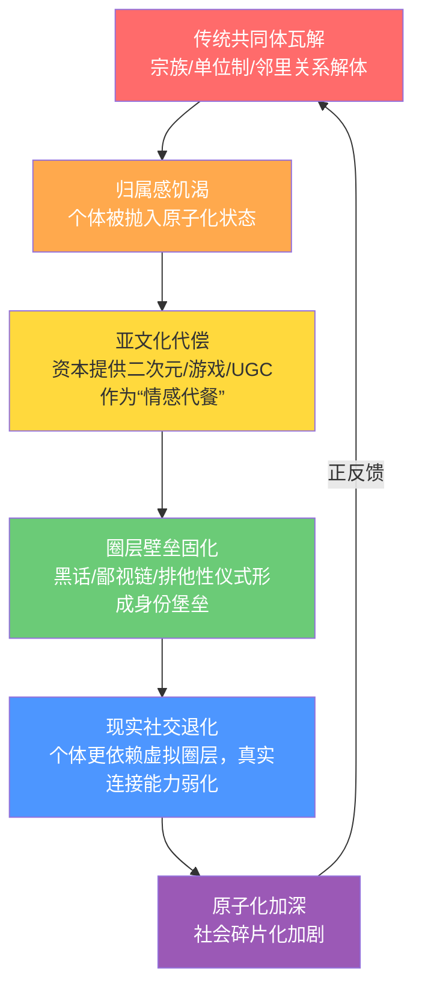
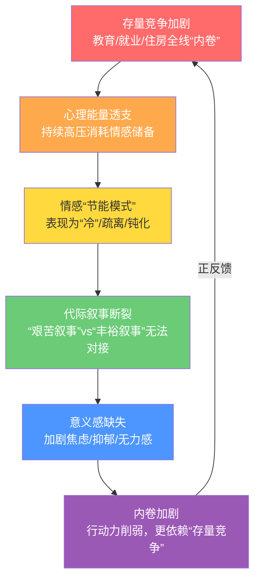
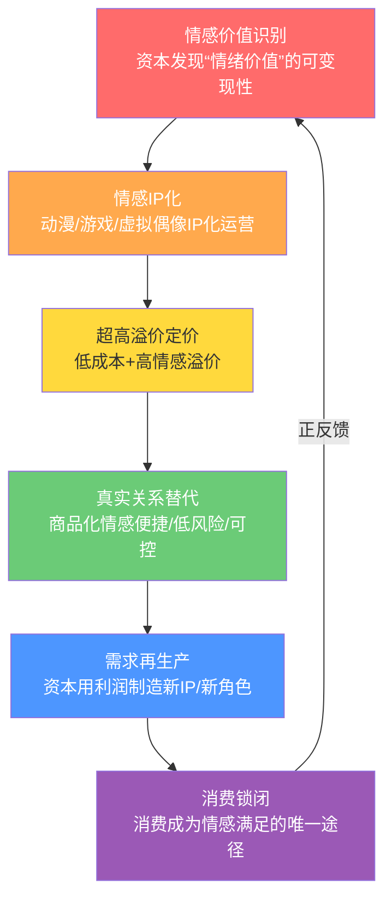
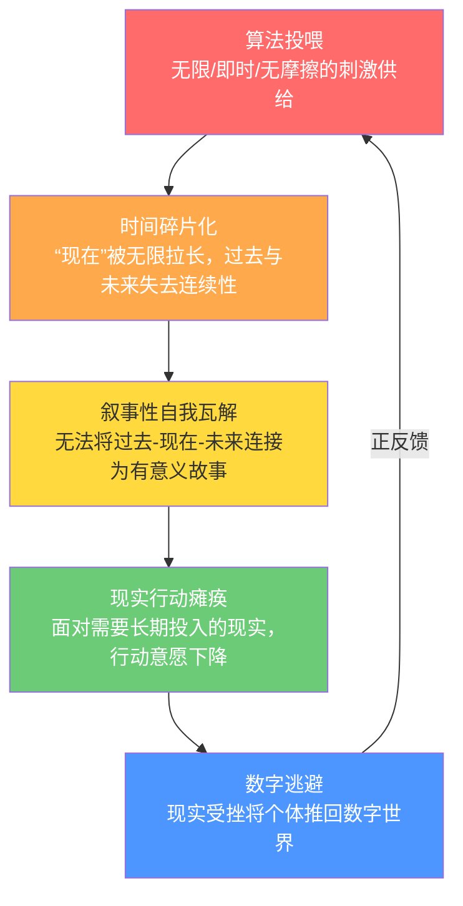
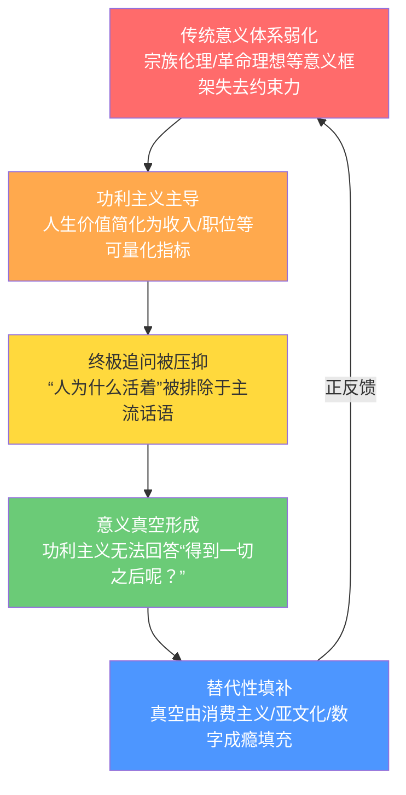
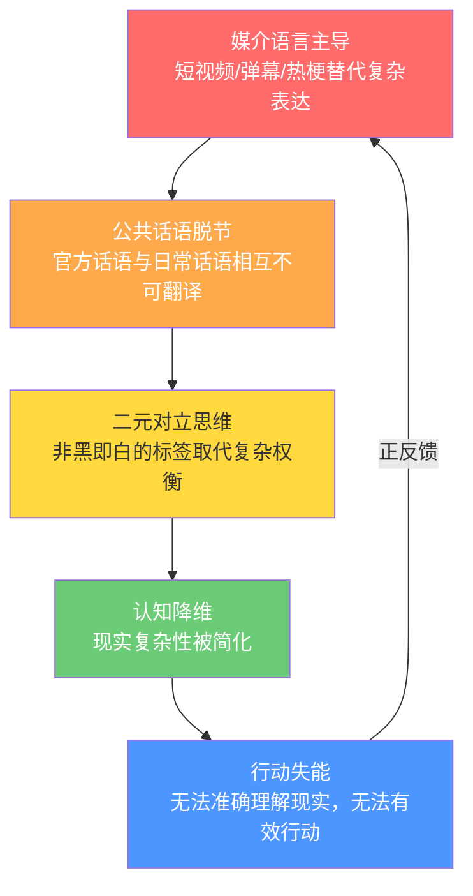
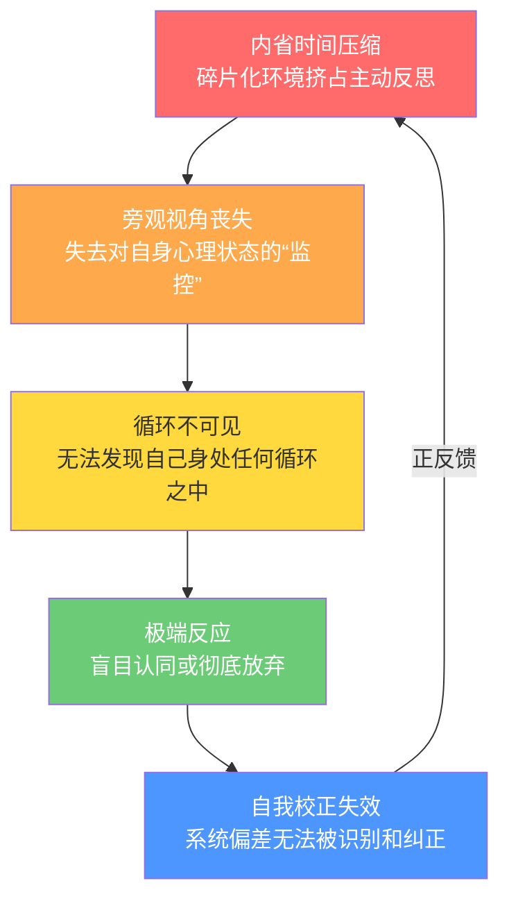
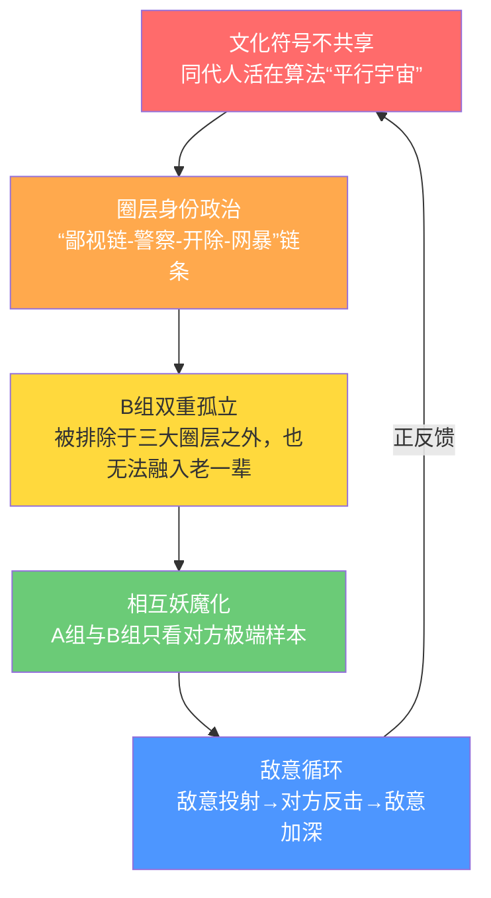

# 正反馈的死亡螺旋：当代中国文化-社会-心理结构的原子级系统分析

## 摘要

本研究基于系统论与反馈循环分析视角，构建了一个由八重正反馈循环构成的嵌套模型，用以解释物质丰裕时代精神困境的结构性成因。研究发现：社会达尔文主义与社会原子化构成基础性地层压力；资本逻辑与数字技术在此基础上制造并放大了意义真空、情感商品化与同龄人割裂；八重循环层层嵌套、自我强化，任何单一层面的“反抗”均可能被系统吸收为运转燃料。研究特别识别了“B组青年”——那些被排除于三大亚文化圈层之外、遵循主流上升路径并运用系统化理论工具进行社会分析的年轻人——作为当代“社会全景画像者”的复杂位置：他们既是系统批判的主体，也是被系统捕获的客体。研究进一步揭示了B组青年与《资本论》时代知识分子在方法论层面的同构性：两者均采用“从具体到抽象”的研究方法与“从抽象到具体”的叙述方法，对所处时代的社会结构进行系统性解剖。唯一的潜在出口在于元认知层面的觉醒——拒绝在任何单一循环的游戏规则内寻找出路，在系统边界处重建非商品化、非部落化的人际连接。

**关键词**：正反馈循环；社会原子化；亚文化经济；代际断裂；意义真空；社会达尔文主义；《资本论》方法；文化安全

## 一、引言：问题的提出与理论定位

### 1.1 从经济波动到精神困境

2026年前后，多重经济周期的叠加引发了关于AI行业、新互联网经济与亚文化经济三大领域结构性调整的广泛讨论。然而，经济波动仅是表象。更深层的问题在于：在经济高速增长、物质生活极大丰裕的条件下，中国社会——尤其是青年群体——正经历一场前所未有的精神困境。

调查数据显示，“00后”中73.5%认为家庭状况较五年前改善，85.7%对未来五年持乐观预期；然而，这种物质层面的获得感与精神层面的困境构成了尖锐矛盾。世界价值观调查（WVS）数据显示，主观幸福感随出生同期群的推移逐渐递减：出生于1980年及以后的新生代人群主观幸福感水平较低，且增长幅度相对迟缓，就业竞争加剧、住房教育成本提高、社会期望增加等多重因素叠加下正承受着较大生活压力。

2013—2015年，黄悦勤教授团队联合43家单位完成了中国精神卫生调查（China Mental Health Survey, CMHS），覆盖31个省/自治区/直辖市157个县/区的32552名社区成人，是我国首个具有全国代表性的精神障碍流行病学调查。研究主要成果显示，中国社区成人精神障碍终生患病率16.6%，其中心境障碍7.4%、焦虑障碍7.6%，仅9.5%抑郁障碍患者接受治疗且充分治疗率低至0.5%。焦虑障碍是加权终生患病率最高的精神障碍类别（7.6%），其次为心境障碍（7.4%）、物质使用障碍（4.7%）、冲动控制障碍（1.5%）、精神分裂症及相关精神病性障碍（0.7%）及进食障碍（0.1%）。基于全球疾病负担研究2021的数据分析显示，1990年至2021年间，中国抑郁症病例从3440万激增至5310万，涨幅达54%；焦虑症病例从4050万增至5310万，增长31.2%。

### 1.2 核心概念界定

本研究采用以下核心概念：

- **正反馈循环**：系统输出进一步强化输入的机制，导致系统偏离平衡而非恢复平衡。
- **社会原子化**：社会转型期因人类社会最重要的社会联结机制——中间组织的解体或缺失而产生的个体孤独、无序互动状态和道德解组、社会失范等社会危机。
- **社会达尔文主义**：将“优胜劣汰”生物学逻辑移植到社会领域的意识形态，由严复在戊戌变法时期引入中国。
- **意义真空**：传统信仰体系与意义框架瓦解后，个体面临“为何活着”这一根本问题无从应答的状态。
- **《资本论》方法**：马克思在《资本论》中运用的政治经济学批判方法，包含从感性具体到理性抽象的“研究方法”与从抽象规定上升到具体总体的“叙述方法”两条道路。

## 二、基础性地层：社会原子化与社会达尔文主义的双重挤压

### 2.1 社会原子化的发生机制：从“总体性社会”到“原子化社会”的转型

社会原子化不是指一般性的社会关系的疏离，而是指在社会重大转型变迁时期，由于人类社会最重要的社会联结机制——中间组织的解体或缺失而产生的个体孤独、无序互动状态和道德解组、人际疏离、社会失范的社会总体性危机。当代中国的社会原子化，其根源可以追溯至单位制度和城乡二元结构的走向消解。

**第一重：单位制走向消解。**

中国自1949年以来，鉴于传统社会“一盘散沙”的涣散性弊端，试图通过单位制度建构出一个高度组织化的“总体性社会”。在单位体制下，单位组织的建立实际上成为中国社会整合的最佳手段——个体通过单位获得身份、福利、住房、医疗、养老，单位不仅是工作场所，更是情感归属、社会地位和人生意义的全部来源。

改革开放以来，尤其是在20世纪90年代之后，在迈向市场化的进程中，中国城市的典型单位体制和农村的“准单位体制”逐渐走向消解。但代之而起的新的社会组织形态尚在形成之中。所谓单位社会的终结，并非指具体的作为职场的“单位组织”的终结，而是指1949年以来形成的中国社会宏观联结方式的根本性变化，即由“国家—单位—个人”的控制体系向“国家—社区、社会团体—个人”协同参与模式的转变。单位制的瓦解意味着：个体不再被“镶嵌”在一个提供全方位保障的组织网络之中，而是被“抛”入市场，成为必须自己为自己负责的独立竞争单元。

随着单位制改革的推进，一元化的国家公共性日渐弱化，总体性社会日益分化为国家、市场和社会等多元领域和主体。昔日由单位组织承载的社会公共性也不可避免地走向萎缩，导致公共精神生活的衰落，使得转型期的中国社会面临着严峻的挑战。

**第二重：“附近的消失”与社会联结的断裂。**

社会学家项飙提出的“附近的消失”，精准概括了流动时代的社会精神困境。我们的断裂就在于：当我们作为原子化的个体时，比以往都要关注自我或“家”里这点事，有时又会突然跳出对一个很大的事件做很宏观的评论，但我们失去了作为中间层的“附近”的兴趣——我们不关心对面住了谁、不关心身边发生了什么事情，只关心家里头或者全世界。

项飙指出，“附近”不是简单地蒸发了，而是在资本、技术的加持下转化为数据。人们越来越通过抽象的概念和原则来理解世界和生活，却忽视了周边具体的社会关系。邻居成为陌生人，虚拟的社交网络成为情感支点。沉溺于虚拟世界的原子化生存方式强化了社会同化的趋势，使自我变得虚幻和脆弱。

**第三重：数字技术对人际连接的虚拟化替代。**

互联网时代，人们最重要的沟通方式不仅是传统的个人接触，而且是在线接触。社交网络的匿名性、速度和广度，使人们的网络关系比传统关系更平坦、更容易破裂和转变。在网络交流中，人们越来越多地放弃信仰和相互理解，而是将不同观点的人排除在社会圈子之外；在匿名保护下，道德不再有价值，人们将把他人和社会视为工具。

社会原子化的表现主要包括人际关系疏松化、社会纽带松弛、个人与公共世界疏离等方面。在道德滑坡、规范失灵、社会结构“碎化”的情形下，个体被抛入一种无所依傍的悬浮状态。

### 2.2 社会达尔文主义的引入与异化：从“救亡工具”到“内卷哲学”

**第一，严复的引入：甲午战败后的“当头棒喝”。**

1859年，英国生物学家达尔文出版《物种起源》，提出生物进化论。然而，达尔文可能没有想到，他创立的生物进化论会被斯宾塞等人发展为社会达尔文主义，将他在生物界发现的原理应用于人类社会。

社会达尔文主义是由著名启蒙思想家严复在戊戌变法时期介绍进中国的。当时的情形是：日本发动甲午战争打败了中国，列强进而群起掀起瓜分中国的狂潮，中国面临亡国灭种的危机。严复翻译了英国生物学家赫胥黎的《天演论》，目的并不是为了向国人介绍这一自然科学学说，而是借以说明“自强保种”的道理。他并不严格按照赫胥黎的原文翻译，而是用加按语的形式往里面加进了斯宾塞的观点和自己的发挥。他是在借赫胥黎的酒杯浇自己的块垒——用社会达尔文主义的观点来唤醒国人。严复的天演学说在近代中国产生了巨大影响。

胡适在《四十自述》中描绘道：“在中国屡次战败之后，在庚子辛丑大耻辱之后，这个‘优胜劣败，适者生存’的公式确是一种当头棒喝，给了无数人一种绝大的刺激。几年之中，这种思想像野火一样，延烧着许多少年的心和血。”

**第二，社会达尔文主义的异化：从“救亡”到“内卷”。**

社会达尔文主义是一把双刃剑——这不但是因为它在强弱两极对立的格局下既可以为强者欺凌弱者服务，又可以为弱者发愤自强服务。在民族危亡的时代，它为救亡图存提供了思想武器；但在和平年代、存量竞争的条件下，它异化为“竞争至上”的生存哲学。

许纪霖在分析晚清思想史时指出：“在社会达尔文主义的导引之下，中国人相信优胜劣汰，相信强权就是公理，相信国家实力就是一切，致力于模仿19世纪西方文明中的国家主义与物质主义。”当代中国的“内卷”，本质上是社达在和平年代、存量竞争条件下的延续——不再是为“保种救国”而竞争，而是为有限的生存资源而进行近乎零和的搏杀。

### 2.3 双重挤压的结构性后果

社会原子化与社达主义构成了一对“互补机制”：原子化切断了人际支持网络，社达主义则提供了竞争至上的价值观；前者制造孤独，后者将孤独转化为焦虑和敌意。

| 后果维度 | 具体表现 | 数据支撑 |
|----------|----------|----------|
| **归属感缺失** | 传统共同体瓦解 | “00后”仅30.2%感觉与周围人关系“非常好” |
| **意义感危机** | 社达无法回答终极问题 | “00后”仅20%认为自己对“这个社会有贡献” |
| **心理困扰普遍化** | 焦虑、抑郁成为时代通病 | 精神障碍终生患病率16.6% |

## 三、中国精神卫生调查的跨世纪历程：数据背后的社会变迁

### 3.1 三次全国调查的数据演变

中国精神卫生流行病学研究历经数十年的发展，在方法学上经历了从多地区调查到全国代表性研究的演进。

**1982年：首次全国调查。**

1982年，由沈渔邨院士团队开展的首次调查显示，我国12个地区精神障碍时点患病率为10.54‰。这一数据虽然因诊断标准与方法学差异难以与当代直接比较，但低患病率的基调反映了当时社会的高度组织化对心理困扰的“掩蔽”效应——不是没有痛苦，而是痛苦被集体话语覆盖、被组织网络消化，无法作为“个人的”问题浮现。

**1993年：第二次全国调查。**

1993年，第二次调查显示我国7个地区精神障碍时点患病率上升至11.18‰。随着单位制的松动、人口流动的加剧、竞争压力的上升，精神困扰开始以更明显的方式被识别和统计。

**2013-2015年：中国精神卫生调查（CMHS）。**

2013—2015年，黄悦勤教授团队联合43家单位完成了中国精神卫生调查（CMHS），覆盖31个省/自治区/直辖市157个县/区的32552名社区成人，是我国首个具有全国代表性的精神障碍流行病学调查。研究主要成果显示，中国社区成人精神障碍终生患病率16.6%，其中心境障碍7.4%、焦虑障碍7.6%，仅9.5%抑郁障碍患者接受治疗且充分治疗率低至0.5%。CMHS方法学成果转化为国家《社区精神障碍流行病学调查指南及技术标准（2015版）》及软件著作权，主要数据发表于The Lancet Psychiatry，研究结果被用于指导《健康中国行动（2019—2030）》等政策的制定。

焦虑障碍是加权终生患病率最高的精神障碍类别（7.6%），其次为心境障碍（7.4%）、物质使用障碍（4.7%）、冲动控制障碍（1.5%）、精神分裂症及相关精神病性障碍（0.7%）及进食障碍（0.1%）。65岁及以上人群痴呆的加权患病率为5.6%；55~64岁人群中痴呆的加权患病率为2.7%。农村地区精神分裂症及其他精神病性障碍的12个月加权患病率高于城市（1.1% vs 0.1%）。

### 3.2 代际情感差异的深层根源

为什么七八十年代的人“感情丰富、情感直接”？因为他们生活在高密度、低流动、共命运的乡土社会与单位制中。家人重病时的痛哭、邻里间的互助——这些情感不是“选择”，而是本能反应，是在紧密的人际网络中自然流淌的。

为什么00后/10后“相对冷”？因为他们在高流动、高竞争、高虚拟化的环境中长大。他们的“冷”是一种适应性防御机制：在面对空前内卷压力时，大脑自动切换到“情感低功耗模式”，以减少不必要的心理消耗。“00后”的价值观念与社会心态呈现“加速演变与矛盾交织的显著特征”。

CMHS研究指出：“过去三十年内，中国经济飞速发展，心理压力及应激水平升高。中国人也面临着很多挑战，进而造成心境、认知、行为障碍及相关问题”。

## 四、日本二次元诞生的社会动力学：历史启示与结构类比

### 4.1 战败后的精神真空（1945-1952）

日本战败后，随着《人间宣言》的发布，“人间神天皇”成了凡人，日本国民精神崩溃、彷徨，失去了信仰的核心。为了尽快振作民族精神，民间有识之士开始创造适合大众的、价格低廉的、通俗易懂的精神文化作品。

日本现代漫画的开端可以追溯到二战结束的1945年。二战期间的漫画都带有政治目的，而且创作受到日本政府严厉的管制，必须服务于军队和战争。战后日本全面解禁了出版业，现代漫画开始发展。

当时日本面临来自美国GHQ（驻日盟军总司令部）的审查。GHQ命令漫画作品不能涉及柔道、剑道、复仇、日本历史等日本时代剧内容。所以儿童漫画最常见的题材是毫无日本历史特色的科幻、西部、棒球、丛林探险等。手冢治虫在这种审查环境下，将“体育根性”（スポ根）——指人的主观能动性——“一个体弱多病的小孩通过自己的努力打败天才对手”的内核注入漫画。日后成为日本漫画的主流精神——《火影忍者》的鸣人、《海贼王》的路飞，都是“努力的天才”。

### 4.2 赤本漫画的崛起：草莽文化的逆袭

赤本漫画是20世纪40-50年代日本流行的特殊漫画出版物，因封面多为红色且采用劣质再生纸印刷得名。其诞生于二战后纸张紧缺时期，由非正规出版社通过游击式出版模式生产，内容以冒险、魔怪、软科幻等题材为主，突破当时儿童漫画的教育性框架。这类漫画虽具有非法盗印、内容低俗等问题，但凭借低廉价格和灵活发行渠道快速占领市场。该形态源于战后解除出版管制，出版商为降低成本采用粗糙纸张与手写版制版技术，利润率超过200%。

手冢治虫1947年创作的《新宝岛》通过赤本形式实现长篇漫画突破，销量超40万册，被视为日本现代漫画的起点。它火了之后，到1948年底结算时，人们发现当时一个月居然能有六百部赤本在市面上出现。1948年赤本产量达到顶峰，占据日本漫画市场76%份额。

赤本的火爆，手冢治虫起到了很大的作用，他通过廉价的赤本开辟了一个新的时代。当时正规的儿童漫画最多只有三五页篇幅，无法讲述复杂的故事，而手冢治虫的《新宝岛》特别长，故事情节也比较复杂，他是第一个画这种长篇故事漫画的漫画家。

### 4.3 “失去的十年”：痛苦产业化

1990年，日本地产泡沫破裂，经济陷入“失去的二十年”。然而，正是在这段看似黯淡的岁月里，日本消费行业悄然完成了一场深刻的结构性转型：从物质消费走向精神消费，从价格驱动走向价值驱动。2000年后日本居民收入与消费几乎停滞，商业销售额增长在0%中枢附近震荡，但精神消费品类如动漫、博彩、旅游却持续跑赢大盘。2023年，日本海外及商品化市场（谷子经济）在规模及增速上均处于领先地位，规模分别为1.7万亿日元和7008亿日元，分别占动画产业链规模的51%和21%。动漫产业在日本“失去的十年”完成了无形资产的增值。

**历史启示**：日本二次元的诞生揭示了一个社会痛苦转化为文化消费的动力学机制：社会危机（战败/经济崩溃）→精神崩溃/意义真空→资本与文化生产者提供“廉价精神代餐”（动漫/游戏）→个体沉浸于虚拟世界→现实社会连接进一步弱化→社会危机加深。这一机制在当代中国同样运作。

## 五、八重正反馈循环的原子级剖析

### 5.1 循环一：社会原子化与亚文化圈层化

**环节1-1：传统共同体瓦解**

传统共同体——宗族、单位制、邻里关系——的解体是社会原子化的首要动因。中国自1949年以来通过单位制度建构了高度组织化的“总体性社会”，个体通过单位获得身份、福利和归属。然而，改革开放以来，尤其是在20世纪90年代之后，单位体制逐渐走向消解。代之而起的新的社会组织形态尚在形成之中。个体的“脱嵌”——从传统社会联结中解放出来——本应是现代化的进步，但当新的社会联结未能及时建立时，脱嵌就变成了“悬浮”：个体被抛入原子化状态，既无传统的归属，也无现代的共同体可依附。

与此同时，“附近的消失”加剧了这一过程。人们失去了作为中间层的“附近”的兴趣，不关心对面住了谁、不关心身边发生了什么事情，只关心家里头或者全世界。邻居成为陌生人，虚拟的社交网络成为情感支点。

**环节1-2：归属感饥渴**

人类作为向群而居的社会性动物，个体始终处于共同体生活之中。“原子化”形象描绘的个体孤立状态，可视为一种“变态”现象。当传统共同体瓦解后，个体并未走向完全独立，而是陷入了归属感的饥渴状态。社会原子化背景下，大学生呈现出冷漠、疏离、功利、越轨等原子化表现。调查显示，“00后”仅30.2%感觉与周围人关系“非常好”，远低于社会总体水平。

**环节1-3：亚文化代偿**

资本精准识别了这一归属感缺口。谷子经济迎合了Z世代群体对二次元文化的情感共鸣，并通过社群运营赋予谷子商品社交属性，充分契合了年轻人释放压力、寻求情感代偿、获得圈层认同的消费心理需求。亚文化藏品具有“情感补偿与主体性召唤”的功能，与青年玩家形成依赖关系。

中国泛二次元用户规模从2017年的2.1亿激增至2025年的5.26亿。2025年中国泛二次元及周边市场规模达6521亿元，同比增长9.1%。二次元周边市场规模预计2026年达6521亿元。这些数据表明，亚文化代偿已从边缘现象成长为具有巨大经济影响力的产业。

**环节1-4：圈层壁垒固化**

亚文化圈层并非开放的共同体，而是通过黑话、鄙视链、排他性仪式形成身份堡垒。圈层内部形成“鄙视链-警察-开除-网暴”的完整身份政治机制。青年网络“圈群栖居”既是加速逻辑布展下身心压力的排解，也是竞争状态下舒适关系的探寻，又是原子化社会演进下脱嵌身份的依附。网络圈群成为青年寻求身份认同的重要场域。

**环节1-5：现实社交退化**

个体越依赖虚拟圈层，真实连接能力就越弱化。在城市化进程加速与生活节奏加快的双重挤压下，都市青年面临着“社交时间碎片化”“情感联结浅层化”“亲密关系脆弱化”的困境。“996”工作制压缩线下互动时长，高楼林立的居住环境弱化邻里交往，传统“熟人社会”中基于地缘、血缘的亲密关系建构模式逐渐失效。

**环节1-6：原子化加深**

当现实社交退化后，社会碎片化进一步加剧，回到起点，启动新一轮循环。这个循环的可怕之处在于：它不需要任何外部推力——仅凭资本逐利和个体的归属需求就能自动运转。

### 5.2 循环二：内卷竞争与情感钝化

**环节2-1：存量竞争加剧**

社会达尔文主义在和平年代的延续，表现为教育、就业、住房全线的“内卷”。中考、高考、考研、考公、职场晋升——竞争链条环环相扣，形成从童年到成年的“终身锦标赛”。我们现在所说的“内卷”多半已经是泛化了的概念，其实是“被内卷”，并不是一个自觉的选择，而是被动的选择。有人将内卷称为“社会达尔文主义2.0版”。

当前普遍存在的“内卷”、“狼性文化”、“上岸”、“末尾淘汰”等社会现象，其背后实质是“社会达尔文主义”。18-24岁年龄组抑郁风险检出率高达24.1%，显著高于其他年龄组。

**环节2-2：心理能量透支**

持续高压竞争消耗着个体的情感储备。社会达尔文主义将“奋斗”与“成功”等同，但当机会减少、阶层流动放缓时，“奋斗叙事”遭遇“周期叙事”的挑战。“00后”对“我对这个社会有贡献”持非常同意的仅20%，远低于“50后”的46.9%。在“996”工作制下，18-35岁青年因职场高压导致抑郁焦虑就诊率年均增长18%。

**环节2-3：情感“节能模式”**

在长期高压下，个体切换到“情感低功耗模式”——表现为“冷”、疏离、钝化。这不是道德缺陷，而是神经系统在特定环境下的适应性反应。大脑将情感表达视为“非必要开支”予以抑制——在短期内有助于生存，但长期来看导致情感能力退化。被裹挟其中的大学生，呈现出冷漠、疏离、功利、越轨等原子化表现。

**环节2-4：代际叙事断裂**

“艰苦叙事”（父辈的经历）与“丰裕叙事”（00后的体验）无法对接。父辈将成功归因于个人奋斗，但年轻人发现“即使学会了这一切，机会也没那么多了”。改革开放前的一代因贫穷限制了视野；1978-1989年出生的一代拥有最强的追求个人成功的欲望；1990年后出生的一代“最开放，最不保守，最淡泊名利与超越自我”。每一代人都是其时代社会结构的产物。

**环节2-5：意义感缺失**

当社达无法回答“得到一切之后呢？”这一终极问题时，意义感开始缺失，加剧焦虑、抑郁和无力感。1990年至2021年，中国抑郁症病例增长54%，达5310万。18-24岁青年群体的抑郁水平在所有年龄段中最高，且随年龄增长显著下降。

**环节2-6：内卷加剧**

行动力削弱后，个体更依赖“存量竞争”，形成“越内卷越冷漠，越冷漠越孤立，越孤立越依赖内卷”的恶性循环。“躺平”被看作是一种反“内卷”的集体无意识的网络宣泄——但这也只是缓兵之计，无法从根本上打破循环。

### 5.3 循环三：资本工业化与情感商品化

**环节3-1：情感价值识别**

资本发现“情绪价值”的可变现性。“谷子经济”指二次元文化带动的周边经济，折射出青年群体愿意为“情绪价值”买单的消费新风尚。88.71%的动漫/漫画观众愿意购买谷子（周边），81.78%已购买过。Cos委托等服务的核心驱动力是“代偿性心理满足”——通过付费短暂获得理想化二次元角色的陪伴。

**环节3-2：情感IP化**

资本将情感转化为可复制的生产线——动漫、游戏、虚拟偶像IP化运营。泛二次元及周边市场规模达6521亿元；中国动漫行业总产值已接近3500亿元。Z世代5.26亿用户成为消费主力。青年“为兴趣、爱好付费”态度积极，91.99%愿为兴趣付费。

**环节3-3：超高溢价定价**

低成本+高情感溢价=超高利润率。一枚成本不足1元的铁皮徽章（“吧唧”）售价可达30-50元，毛利率超90%。二次元周边衍生市场从2016年的53亿元上升至2023年的1024亿元，复合年增长率52.7%。赤本漫画时代利润率已超过200%，这一商业逻辑在当代被放大到前所未有的规模。

**环节3-4：真实关系替代**

商品化情感便捷、低风险、可控，在原子化社会中“购买情感”比经营真实关系更安全。Cos委托中，消费者付费邀请劳动者扮演虚拟角色，获得沉浸式亲密体验，但可能加剧情感疏离与社交弱化。虚拟主播在流水线上生产大量供消费的数字身体，反映了后现代人类“向内塌缩”的行动趋向。

**环节3-5：需求再生产**

资本用利润制造新IP、新角色，不断创造新的消费需求。2025年腾讯视频动漫大赏释出近90部二次元项目。日本动漫产业形成了从创作到图书出版到影视播映直至后续衍生产品开发相衔接的产业链。这种需求再生产机制确保了消费锁闭的持续运转。

**环节3-6：消费锁闭**

消费成为情感满足的唯一途径——情感商品化被深度内化。青年从个体利益、情感和需要出发解构婚育等人生选择。当情感可以被“购买”时，真实人际关系中的情感表达反而变得陌生和多余。

### 5.4 循环四：数字化沉浸与现实疏离

**环节4-1：算法投喂**

算法提供无限、即时、无摩擦的刺激供给。社交网络的特点是匿名性、速度和广度——网络关系比传统关系更平坦，更容易破裂和转变。沉溺于虚拟世界的原子化生存方式强化了社会同化的趋势。算法推荐容易形成信息茧房：一是“信息窄化”，用户能看到的信息越来越单一；二是“同温层效应”，持相似观点的人聚在一起相互强化，排斥不同声音。

**环节4-2：时间碎片化**

“现在”被无限拉长，过去与未来失去连续性。工业革命以来时钟出现，时间变得趋于整体性和线性；但数字时代逆转了这一趋势——算法消除了时间的纵深结构。青年对“这个世界正在越变越好”的肯定程度（37.1%）低于社会总体水平（43.2%）。问题性互联网使用被网络分析确认为抑郁和焦虑症状共现的核心“桥梁因素”。

**环节4-3：叙事性自我瓦解**

当时间被碎片化后，个体无法将过去-现在-未来连接为有意义的故事。人作为时间性存在——其意义依赖于将过去、现在、未来编织成连贯叙事——在无时间性的数字流中被解构。当个体无法讲述“我是谁”（需要过去的记忆）和“我将成为谁”（需要未来的想象），存在本身陷入悬浮状态。

**环节4-4：现实行动瘫痪**

面对需要长期投入的现实，行动意愿下降。即时反馈的数字化体验与延迟满足的现实世界形成了鲜明对比。线上社交对青年产生了“社会支持感”和“社交隔离”的双重效果——既提供连接感，又加深了与现实世界的隔离。

**环节4-5：数字逃避**

现实受挫将个体推回数字世界，形成“电子止痛药”依赖。每日使用电子屏幕时间≥2小时与抑郁风险正相关（OR=1.50）。数字沉浸不是“逃避现实”，而是“逃避时间”——而逃避时间的结果，是失去了作为人的时间性结构。

### 5.5 循环五：传统信仰瓦解与意义真空

**环节5-1：传统意义体系弱化**

宗族伦理、革命理想等传统意义框架失去约束力。“生儿育女是个人必须履行的责任”的认同度从“50后”的82.3%降至“00后”的27.5%。现代化进程本质上是个人权利不断被强化的过程——“00后”中61.7%非常同意“结婚自由说”。传统意义框架的弱化，使个体被抛入必须自己为自己寻找意义的境地。

**环节5-2：功利主义主导**

人生价值被简化为收入、职位等可量化指标。65.1%受访大学生想去体制内就业。工作中心性和物质主义工作价值观经历了从计划经济世代（40后至60后）的双低，到改革开放世代（70后和80后）的双高，再到物质丰裕世代（90后和00后）的再度双低。这表明不同世代在成长过程中所经历的社会经济环境会深刻影响其工作价值观。

**环节5-3：终极追问被压抑**

“人为什么活着”这一根本问题被排除于主流话语之外。“躺平”作为一种话语反抗，本质上是在否定父辈价值观——但否定之后，并未提供替代性的意义框架。父辈找到了“奋斗与财富是成功的标尺”这一存在感，年轻一代还在寻找，并且“看不上父辈的那种方式”。

**环节5-4：意义真空形成**

功利主义无法回答“得到一切之后呢？”这一终极问题。新生代生活掌控感最低，意义感缺失最严重。价值观代际更替理论认为，人们享受长期的政治稳定、经济繁荣和福利政策之后，优先价值观会转向追求个人主观幸福、自我表现和政治参与的后物质主义——但后物质主义本身并不能自动提供意义的答案。

**环节5-5：替代性填补**

意义真空由消费主义、亚文化、数字成瘾填充。二次元/游戏/娱乐三大圈层吸纳数亿用户。意义真空是所有循环的“动力源”——人类无法忍受无意义状态，但意义真空并不导致意义的消失，而是导致意义的“市场开放”。资本和算法涌入这个空白市场，提供各种“意义代餐”。

### 5.6 循环六：语言贫困与思维简化

**环节6-1：媒介语言主导**

短视频、弹幕、网络热梗替代了复杂表达。在网络交流中，人们越来越多地放弃信仰和相互理解，而是将不同观点的人排除在社会圈子之外。语言不仅是表达工具，更是思维的结构性框架——当语言被简化，思维也被简化。

**环节6-2：公共话语脱节**

官方话语与日常话语相互不可翻译。两代人“生活在两个难以完全互通的精神星球”。信息茧房效应使人们习惯于内部对话，在“圈内共振”中寻求安全感，却逐渐丧失与异质声音对话的能力。长期如此，他们容易把圈层内部的认同当作真理，把圈内的共鸣当作普遍价值。

**环节6-3：二元对立思维**

非黑即白的标签取代了复杂权衡。青年对社会容忍度的评价偏低——因其期待的创新容错空间与现实的代际张力之间存在落差。网络群体极化现象使青年群体在封闭的信息环境中不断强化单一价值观，进而造成青年道德认知的狭隘。

**环节6-4：认知降维**

现实复杂性被简化。“00后”对世界变化的肯定程度（37.1%）低于社会总体水平（43.2%）。青年网民与父母的代际价值观差异增强，涉及价值观层面的问题占比在十年间显著增加，上升108.6%。

**环节6-5：行动失能**

无法准确理解现实，就无法有效行动。青年“躺平”等话语反抗背后的无力感，正是认知降维的后果。“信息茧房”效应可能使人们习惯于内部对话，在“圈内共振”中寻求安全感，却逐渐丧失与异质声音对话的能力。

### 5.7 循环七：元认知蒸发与系统盲视

**环节7-1：内省时间压缩**

碎片化环境挤占了主动反思的时间。90后、00后的生活被数字空间和竞争任务填满，几乎没有“无目的”的时间用于内省。青年群体有着强烈的身份认同诉求，也体验着深刻的孤独——但他们往往没有时间和空间去理解这种孤独的来源。

**环节7-2：旁观视角丧失**

失去对自身心理状态的“监控”能力。“00后”仅30.2%感觉“跟周围人关系非常好”。青年对自身困境往往只有模糊的感受（“emo了”“破防了”），而无法形成清晰的自我认知。项飙指出，“心理健康热”的流行恰恰反映了年轻人对自身困境强烈的问题意识——但这种问题意识往往停留在感受层面，而非反思层面。

**环节7-3：循环不可见**

无法发现自己身处任何循环之中。“00后”对“社会贡献”的自我评价仅20%持非常同意。青年价值观存在集体主义与个体主义、传统取向与现代取向等多组冲突——但他们往往无法将这些冲突理解为系统性的产物，而将其归因为个人“不够努力”或“运气不好”。

**环节7-4：极端反应**

面对无法理解的系统，个体只有两种极端反应：盲目认同或彻底放弃。温和民族主义63.28%、强烈民族主义13.85%共占77.13%——体现高度政治认同与个体主义并存的矛盾。另一种极端是“躺平”——反对裹挟，就地一躺，不闻不问。两种极端反应都是元认知蒸发的结果：前者放弃了个体判断，后者放弃了对系统的任何介入。

**环节7-5：自我校正失效**

系统偏差无法被识别和纠正。负反馈机制——即能够识别偏差并进行自我校正的能力——被摧毁。元认知——对自身认知过程的觉知和监控——是人类区别于其他存在物的核心能力。当元认知蒸发，人失去了对自身思想过程的“旁观者视角”，沦为被情绪、算法、习惯驱动的自动机。

### 5.8 循环八：同龄人割裂与部落敌意

**环节8-1：文化符号不共享**

同代人活在算法制造的“平行宇宙”中。两代人“物质上分歧很少，精神上的分歧非常大”——但更为隐蔽的是，同龄人之间的文化符号也正在走向不共享。同为00后，A的青春是《原神》和Vtuber，B的青春是抖音擦边热舞和快手社会摇，C的青春是考研考公和《新闻联播》——他们之间几乎没有可互相理解的“共同语言”。

**环节8-2：圈层身份政治**

圈层内部形成“鄙视链-警察-开除-网暴”的完整身份政治链条。二次元圈层内部：番剧党>漫画党>游戏党>国漫党？游戏圈内部：单机玩家>手游玩家>页游玩家？每一层都有“品位等级”。网络圈层化具有分寸感、弱联系的特征，满足了青年人的社交需求，但又在某种程度上加深了他们对现实亲密关系的不信任和逃避。

**环节8-3：B组双重孤立**

B组青年（考公/理工/计算机/政治武装者）处于双重孤立状态：既不被亚文化同龄人接纳（缺乏共同娱乐话题），也无法真正融入老一辈阵营（其理论体系远超“朴素爱国”版本）。“00后”对社会容忍度评价（7.06分）低于全社会均值（7.09分），其代际处境具有特殊的复杂性。

**环节8-4：相互妖魔化**

A组与B组在信息茧房中只看对方极端样本，形成相互妖魔化。A组将B组标签化为“无聊的现充”“呆板的做题家”；B组将A组标签化为“不务正业的巨婴”“被消费主义洗脑的韭菜”。处境不同的同龄人在价值感知上产生“细微分野”。

**环节8-5：敌意循环**

敌意投射→对方反击→敌意加深，循环自动强化。青年对社会容忍度评价偏低，本质是对更全面支持体系的诉求——但这种诉求在敌意循环中被扭曲为对同龄人的攻击。

## 六、B组青年的《资本论》方法：社会全景画像的实践

### 6.1 《资本论》的方法论核心

马克思在《资本论》中运用的政治经济学批判方法，包含两条核心道路。

**第一条道路：研究方法——从感性具体到理性抽象。**

马克思指出：“通过更切近的规定我就会在分析中达到越来越简单的概念；从表象中的具体达到越来越稀薄的抽象，直到我达到一些最简单的规定。”透过千变万化的现象背后，对构成对象的全部要素及其发展形式进行分析，探索这些形式的内在联系，从而可以得到该对象的普遍性本质。马克思把这条道路归结为“经济学在它产生时期在历史上走过的道路”，其表现为从“生动的整体，从人口、民族、国家、若干国家等等开始”，可分析出“具有决定性意义的抽象的一般关系，如分工、货币、价值等等”。

马克思形象地使用了“蒸发”一词，通过抽象法把对象内在的同一性元素“蒸发”出来，并探究它的发展形式以及与其他对象之间的联系，从而得到使其成为该对象本质的简单规定。

**第二条道路：叙述方法——从抽象规定上升到具体总体。**

马克思指出：“从实在和具体开始，从现实的前提开始”,“似乎是正确的。但是，更仔细地考察起来，这是错误的”。马克思以人口为例：“抛开构成人口的阶级，人口就是一个抽象。如果我不知道这些阶级所依据的因素，如雇佣劳动、资本等等，阶级又是一句空话。而这些因素是以交换、分工、价格等等为前提的。”

因此，思维必须从整体性视角深入对象的历史特殊性之中，通过抽象规定逐级中介对象总体的全部规定及其联系，从而发现对象本质在历史中经历着“自我创造”和“动态生成”的运动过程。马克思把第二条道路概括为从抽象的同一性规律出发，逐渐“上升”至具有许多规定和关系的丰富的总体并深入到该对象的历史特殊性之中的叙述方法。

马克思在《资本论》中从“商品”这个最简单的经济范畴出发，逐步上升到货币、资本、剩余价值、工资、利润等复杂范畴，最终揭示资本主义生产方式的全部运动规律。《资本论》的方法论本质是“批判的和革命的”——它不仅解释世界，更在于揭示改变世界的可能性。

### 6.2 B组青年的方法论实践：作为当代“社会全景画像者”

B组青年（考公/理工/计算机/政治武装者）中的一部分人，自觉或不自觉地运用着与《资本论》同构的方法论——他们不是简单地“站队”或“表态”，而是在对当代社会进行系统性解剖。

**第一步：从具体到抽象——提取当代社会的“简单规定”。**

B组青年面对的是纷繁复杂的社会现象：二次元文化的爆炸式增长、谷子经济的超高利润率、数字成瘾的普遍化、同龄人割裂的加剧、意义感的普遍缺失。他们不满足于描述这些现象，而是试图提取出支配这些现象背后的“简单规定”：

- 将“亚文化消费”抽象为“晚期资本主义文化工业中的情感代偿机制”
- 将“内卷”抽象为“社会达尔文主义在存量竞争条件下的延续”
- 将“数字成瘾”抽象为“注意力经济对时间感知的系统性重构”
- 将“意义缺失”抽象为“传统意义体系瓦解后的价值真空”

这些抽象不是随意的标签，而是经过系统分析后提炼出的“具有决定性意义的抽象的一般关系”——正如马克思从“人口”这一混沌表象中分析出“阶级、雇佣劳动、资本”等简单规定。

**第二步：从抽象到具体——重建当代社会的“具体总体”。**

B组青年不仅停留在抽象层面，而是试图将这些抽象规定重新组合，以呈现当代社会的整体性结构：

- 他们将“情感代偿机制”“社达延续”“时间重构”“价值真空”等抽象规定串联起来，揭示它们之间的内在联系
- 他们发现：亚文化繁荣与精神困境蔓延是同一系统的两面；A组与B组的对立是结构性压力的投射；任何单一层面的“解决方案”都可能被系统吸收为运转燃料
- 他们绘制出一幅“当代资本主义精神状况的X光片”——正如马克思从“商品”出发逐步揭示资本主义生产方式的全部运动规律

**第三步：自我解剖——将批判的矛头指向自身。**

真正彻底的《资本论》式分析，最终会把手术刀对准分析者自己。B组青年中最清醒的那一部分人意识到：

- 他们批判资本对人的异化，但他们所走的路径（考公/进大厂）本身就是资本体系内部最典型的“被异化路径”
- 他们嘲笑A组“被消费主义收割”，但他们自己何尝不是在用青春和健康去兑换系统承诺的安全感？
- 他们的分析工具（马列、社会学、动力学）本身也是特定历史条件下的产物——也需要被放置在被分析的画布上

这种自我解剖的能力，正是马克思在《资本论》中所展现的方法论自觉：批判者不例外于他所批判的系统。

### 6.3 《资本论》方法与B组方法的同构性

| 维度 | 《资本论》时代的知识分子 | 当代B组青年（全景画像者） |
|------|------------------------|------------------------|
| **时代背景** | 工业资本主义高歌猛进，阶级矛盾尖锐 | 数字资本主义全面渗透，意义体系瓦解 |
| **批判工具** | 政治经济学批判、历史唯物主义 | 马列经典、社会学、传播学、动力学 |
| **批判对象** | 资本主义生产方式、商品拜物教 | 消费主义、文化工业、数字剥削、情感商品化 |
| **研究方法** | 从感性具体到理性抽象 | 从社会现象到本质规定（如“情感代偿机制”） |
| **叙述方法** | 从抽象规定上升到具体总体 | 从抽象规定重建社会整体结构 |
| **自我定位** | “解剖系统，而非指责个人” | 同样是“剖析系统”，将困境归因于结构性力量 |
| **终极关怀** | 通过揭示规律寻求人类解放 | 通过系统分析寻找“出路” |

### 6.4 一个关键的认知反转

有了这个类比，我们之前讨论的“B组比老一辈更犀利、更系统”就有了全新的含义：

| 老老老一辈的“武装” | B组的“武装” |
|---------------------|-------------|
| 基于朴素爱国情感、历史记忆 | 基于系统性的理论工具 |
| 侧重于“定性”与“表态” | 侧重于“解构”与“归因” |
| 目标是维护主流价值观的统一 | 目标是揭露系统本身的运作规律 |
| 更像“战士” | 更像“解剖师” |

B组不是在“复制”老一辈，而是在用更精密的手术刀，做一场与《资本论》同构的“系统解剖”——只不过他们解剖的对象，恰好是同龄人的生活方式（亚文化、消费、数字沉迷）。

### 6.5 作为画像者的困境

然而，B组全景画像者面临着一个根本困境：**当他们用一套理论去解剖整个社会时，他们用什么理论来解剖这套理论本身？**

B组青年如果足够清醒，最终会发现：他们的分析工具（马列、社会学、动力学）本身，也是特定历史条件下产生的“历史产物”——它们本身也需要被放置在被分析的画布上。这就形成了一个无限递归的追问：用马列分析资本→用社会学分析马列的使用者→用动力学分析社会学家为什么这样分析→用认知科学分析“我为什么选择用这些工具来分析这些对象”……

真正的全景画像者，不是站在画布之外的人，而是意识到自己也在这幅画布之中的人。这正是循环七（元认知蒸发）的反面：**最大程度的元认知激活——不仅分析系统，还分析自己为什么这样分析系统。**

## 七、系统的整体特征：正反馈的死亡螺旋

### 7.1 八重循环的嵌套结构

八重循环并非并列关系，而是层层嵌套的结构——从最外层的亚文化圈层到最内层的元认知蒸发，每一层都是下一层的“具体表现”，也是上一层的“基础条件”。

```mermaid
graph TD
    subgraph 最外层[最外层：现象层面]
        C1[循环一：原子化↔圈层化<br>归属感的商品化替代]
        C2[循环二：内卷↔情感钝化<br>意义缺失导致的心理防御]
        C3[循环三：资本↔情感商品化<br>情感本身沦为利润来源]
    end
    
    subgraph 中间层[中间层：结构层面]
        C4[循环四：数字沉浸↔现实疏离<br>时间与意义感的双重扭曲]
        C5[循环五：信仰瓦解↔意义真空<br>传统意义体系的全面失效]
        C6[循环六：语言贫困↔思维简化<br>认知能力的系统性降维]
    end
    
    subgraph 最内层[最内层：存在论层面]
        C7[循环七：元认知蒸发↔系统盲视<br>失去反思与跳出系统的能力]
    end
    
    subgraph 水平层[水平层：关系层面]
        C8[循环八：同龄人割裂↔部落敌意<br>横向社会连接的全面断裂]
    end
    
    C1 --> C4
    C2 --> C4
    C3 --> C5
    C4 --> C5
    C5 --> C6
    C6 --> C7
    C1 -.-> C8
    C2 -.-> C8
    C3 -.-> C8
```

### 7.2 系统的核心逻辑链条

整个系统的核心逻辑可概括为：

> **社会结构（原子化、社达）→ 个体痛苦（焦虑、抑郁、意义真空）→ 资本与算法提供“止痛剂”（亚文化、数字沉浸、情感商品）→ 个体进一步脱离真实连接 → 社会结构更加碎片化 → 痛苦加剧 → 更需要“止痛剂”**

### 7.3 系统的“免疫”特性

系统具备“异议吸收”能力：任何试图打破循环的“明确反对”，都可能被转化为骂战的新燃料；语言贫困化后，人们甚至无法就“我们陷入了困境”达成共识；“反社达”实践也可能最终变成可消费的“生活方式标签”。

## 八、破局的可能路径：元层面的觉醒

### 8.1 单一循环干预的局限性

| 干预类型 | 局限性 | 原因 |
|----------|--------|------|
| 禁止亚文化 | 治标不治本 | 意义真空不消失，亚文化只会更隐蔽 |
| 加强意识形态教育 | 语言不通 | 官方话语与日常话语脱节 |
| 心理健康服务 | 事后补救 | 不改变产生困扰的结构性条件 |
| 反社达口号 | 被系统吸收 | 沦为新的“站队”议题 |

### 8.2 “元层面觉醒”的可能路径

| 干预层面 | 具体行动 | 微观机制 |
|----------|----------|----------|
| **暂停** | 创造“无目的”的时间 | 打破循环四的即时反馈链 |
| **观看** | 培养内省习惯 | 激活循环七的反面——元认知恢复 |
| **言说** | 用精确语言描述观察到的内容 | 打破循环六的语言简化趋势 |
| **连接** | 寻找也在“观看”的人 | 打破循环一与循环八 |

项飙强调，“附近”概念引起大众兴趣正是个体对自己在这个世界上的存在方式和存在意义的追问和反思。这种追问和反思，正是元认知觉醒的起点。

## 九、结论

本研究构建了一个整合经济、文化、心理、代际、认知、存在论的多维度系统分析框架，将当代中国的精神困境还原为结构性力量的产物。研究发现：亚文化经济的繁荣与精神困境的蔓延是同一系统的两面；“A组”与“B组”的对立是结构性压力的投射；任何单一层面的“解决方案”都可能被系统吸收为运转燃料。

研究特别揭示了B组青年与《资本论》时代知识分子在方法论层面的同构性：两者均采用“从具体到抽象”的研究方法与“从抽象到具体”的叙述方法，对所处时代的社会结构进行系统性解剖。B组中的全景画像者不仅解剖A组、解剖老一辈、解剖资本与算法，还将手术刀指向自身——这种自我解剖的能力，正是《资本论》方法论在当代的精神继承。

日本在“失去的十年”中动漫产业的逆势崛起提供了一个重要的历史参照——动漫产业在“失去的十年”完成了无形资产的增值。但中国如果不正视亚文化经济的“止痛剂”本质及其社会后果，可能重蹈日本“平成废物”的覆辙。

**追问本身，就是拒绝被溶解的最后方式。**

## 参考文献

[1] 黄俊捷,刘肇瑞,张婷婷,黄悦勤等.中国精神卫生调查的跨世纪历程[J].北京大学学报(医学版),2025(05):868-874. 

[2] 田毅鹏.转型期中国城市社会管理之痛——以社会原子化为分析视角[J].探索与争鸣,2012(12). 

[3] 刘悦斌.社会达尔文主义在近代中国的是与非[N].学习时报,2012-10-29. 

[4] 邓希泉,邹宇春.“00后”价值观念和社会心态的新现象新特征[J].人民论坛,2025-10-16.

[5] 白刚,王绪春.马克思《资本论》的“研究方法”和“叙述方法”再审视[EB/OL].马克思主义研究网,2025-07-18. 

[6] 日本早期漫画史：是谁带漫画走到了今天？[EB/OL].新京报,2019-04-09. 

[7] 赤本漫画[EB/OL].百度百科. 

[8] 失去的三十年裡，日本消費行業做對了什麼？[EB/OL].財華網,2025-08-07. 

[9] 中国精神卫生调查：七分之一居民一生中将发生精神障碍疾病[EB/OL].中国疾控中心,2019-02-27. 

[10] 许纪霖.从寻求富强到文明自觉——清末民初强国梦的历史嬗变[J].复旦学报(社会科学版),2010(4).