# 恐怖的三极：数字资本主义时代意识形态斗争的拓扑结构

## ——基于系统动力学、话语分析与后殖民批判的综合研究

### 摘要

本研究基于系统动力学、话语分析与后殖民批判理论，构建“意识形态三极拓扑模型”（Ideological Tripolar Topology Model, ITTM），用以解析当代中国公共话语空间中三股不可通约的叙事力量——泛二次元情感-资本复合体、极端文化民族主义与马列主义结构批判——之间的结构性关系。研究发现：三极并非简单的“对立三方”，而是一个**相互寄生、相互定义、相互强化的正反馈拓扑结构**。每一极的“存在理由”都内在地依赖于另外两极的“在场”，这使得三极争霸具有自我维持、自我加速、自我深化的动力学特性。本研究系统分析三极的生成条件、运作机制、话语策略与结构性后果，并通过与美-苏-纳历史三极结构的系统对比，揭示当代三极争霸的独特性与危险性。研究进一步论证：三极争霸的宏观输出是“社会环境的持续恶化”与“社会认知的永久性碎片化”，而破解这一死亡螺旋的唯一路径，在于对“拓扑结构本身”的元认知觉醒。

**关键词**：意识形态三极拓扑；正反馈循环；话语消解；元叙事；社会认知碎片化；不可通约性；社会环境恶化

## 一、导论

### 1.1 问题的提出

2026年，中国公共话语空间呈现出一个独特的结构性现象：三股不可通约的叙事力量在同一时空中持续交锋，形成一种“三极对立”的意识形态拓扑结构。这三极分别是：

1. **泛二次元情感-资本复合体**（以下简称“泛二次元极”）：以ACGN文化消费为核心，将“快乐”“热爱”“纯粹”建构为不可触碰的价值禁区，以“圈地自萌”为防御策略，以“消解性话语”为进攻武器。

2. **极端文化民族主义极**（以下简称“民族主义极”）：以“文化主权保卫”为核心叙事，将一切外来文化要素解读为“入侵”或“渗透”，以“爱国”为最高价值判准，以“清场”与“举报”为主要行动策略。

3. **马列主义结构批判极**（以下简称“马列主义极”）：以马克思主义政治经济学与后殖民批判为方法论基础，将三极争霸本身视为资本-殖民-情感复合体的结构性产物，以“系统分析”为核心工具，以“写作者”为基本立场。

三者之间的斗争已超越“观点分歧”的层面，进入了一种**相互寄生、相互定义、相互强化的正反馈循环**——每一极的存在都依赖于另外两极的“在场”来维持自身的合法性与紧迫性；每一极的“上升”都迫使另外两极“跟着上升”；而任何一极的“被拽”尝试，都只会加深三极之间的结构性张力。

更为关键的是：**三极争霸的持续运转，本身构成了“社会环境恶化”的结构性驱动力。** 社会环境越恶化，三极各自越有理由坚持自身立场；三极各自越坚持，社会环境越恶化——形成一个在宏观尺度上自我强化的正反馈循环。

本研究试图回答以下核心问题：

1. 三极各自的话语逻辑、认知框架与行动策略是什么？
2. 三极之间如何形成“相互寄生”的结构性关系？
3. 三极争霸如何导致“社会环境恶化”？
4. “社会环境恶化”如何反过来强化三极争霸？
5. 三极争霸与历史中的“美-苏-纳”三极结构有何异同？
6. 是否存在“破局”的可能路径？

### 1.2 文献综述

**（一）意识形态对抗研究**

意识形态对抗的研究传统可追溯至马克思、恩格斯的《德意志意识形态》（1845-1846），其核心洞见在于：统治阶级的思想在每一时代都是占统治地位的思想——意识形态不仅是“观念”的集合，更是**物质生产关系的观念表达**。列宁在《帝国主义是资本主义的最高阶段》（1916）中将意识形态分析扩展至全球尺度，揭示了金融资本如何通过文化渗透实现意识形态输出。葛兰西在《狱中札记》（1929-1935）中进一步提出了“文化霸权”概念，指出统治阶级通过“同意”而非“强制”实现对被统治阶级的精神领导。

在后殖民批判传统中，法农在《黑皮肤，白面具》（1952）中揭示了被殖民者如何“真诚地”内化殖民价值观的心理机制。赛义德在《东方学》（1978）中论证了“东方”如何被西方话语建构为“他者”。霍米·巴巴在《文化的定位》（1994）中提出了“模拟”与“混杂性”概念，为理解殖民-反殖民的复杂互动提供了分析工具。

当代意识形态对抗研究面临的核心挑战是：传统的“左右对立”或“东西对立”框架已无法充分解释数字资本主义时代的意识形态拓扑结构。本研究正是在这一理论缺口处展开。

**（二）数字资本主义批判**

数字资本主义批判的研究传统可追溯至法兰克福学派的文化工业批判。阿多诺与霍克海默在《启蒙辩证法》（1944）中首次提出“文化工业”概念，指出文化产品的标准化、商品化与意识形态功能。马尔库塞在《单向度的人》（1964）中将分析延伸至“消费社会”，指出消费文化已成为社会控制的新形式。

在当代数字资本主义批判中，研究者进一步揭示了“情感劳动”的商品化机制（蒋淑媛、张唯肖，2024）、“数字佃农”的形成机制（王洪喆、吴靖，2020）、以及平台资本对注意力的剥削结构。然而，现有研究多聚焦于资本-劳动关系，较少关注数字资本主义如何同时在“文化消费”“民族主义”与“结构批判”三个方向上生产出相互对抗的主体位置。

**（三）网络公共空间中的话语斗争**

网络公共空间中的话语斗争研究近年来快速发展。研究者关注了“消解性话语”（社群悖论定律，2026）、“出警”与“开除二籍”（泛二次元占领定律，2026）、“论战论辩分化”（论战论辩分化与胜利悖论，2026）等微观话语机制。这些研究揭示了一个重要规律：网络空间中的话语斗争已从“观点争论”演变为“身份确认”与“话语权垄断”。

然而，现有研究多聚焦于两方对抗（如A型vsB型、二次元vs民族主义），较少将三方同时纳入分析框架。本研究的三极拓扑模型正是对这一研究空白的回应。

**（四）社会系统恶化与意识形态斗争的关系**

现有研究对社会“恶化”的描述多停留在现象层面——“社会更撕裂了”“人们更极端了”——而缺乏对其与意识形态斗争之间“正反馈循环”关系的系统分析。本研究将“社会环境恶化”作为三极争霸的**结构性输出**，并同时论证其作为三极争霸**延续性输入**的双重功能，从而揭示了一个在宏观尺度上自我强化的正反馈循环。

### 1.3 理论框架

本研究整合以下理论资源，构建“意识形态三极拓扑模型”（ITTM）：

| 理论来源 | 核心概念 | 在本研究中的应用 |
|:---|:---|:---|
| 马克思、恩格斯《德意志意识形态》 | 意识形态作为物质生产关系的观念表达 | 分析三极各自的社会物质基础 |
| 列宁《帝国主义是资本主义的最高阶段》 | 金融资本与文化输出 | 分析泛二次元极的跨国资本逻辑 |
| 葛兰西《狱中札记》 | 文化霸权、常识 | 分析日式审美模板如何成为“常识” |
| 法农《黑皮肤，白面具》 | 精神殖民、内化机制 | 分析泛二次元“伪军”的真诚性 |
| 赛义德《东方学》 | 他者建构、话语权力 | 分析民族主义极如何建构“文化入侵者” |
| 法兰克福学派 | 文化工业、消费社会 | 分析情感商品化与快乐拜物教 |
| 系统动力学 | 正反馈循环、临界点 | 分析三极争霸的自我强化机制 |
| 话语分析 | 消解性话语、话语权垄断 | 分析三极各自的话语策略 |
| 社会系统理论 | 系统自我修复、系统崩溃 | 分析社会环境恶化的结构性功能 |

### 1.4 研究方法

本研究采用**多方法整合**的研究策略：

**第一，话语分析。** 对三极各自的核心话语文本进行系统分析，识别其叙事结构、论证逻辑与话语策略。分析对象包括：泛二次元社群的“出警”话语与“堡垒化”叙事；民族主义阵营的文化批判文章与“清场”话语；马列主义者的系统分析文本与结构批判叙事。

**第二，系统动力学建模。** 将三极之间的互动关系形式化为正反馈循环模型，识别关键变量、反馈回路与临界条件。本研究采用系统动力学的因果回路图（Causal Loop Diagram, CLD）方法，对三极争霸的动力学结构进行可视化建模。

**第三，历史比较分析。** 将当代三极争霸与历史上的“美-苏-纳”三极结构进行系统比较，识别异同与历史规律。

**第四，拓扑结构分析。** 运用拓扑学概念框架，分析三极争霸的空间结构——不可通约性、相互寄生性与指数级升级路径。

### 1.5 核心概念界定

| 概念 | 定义 |
|:---|:---|
| **意识形态三极拓扑** | 三股不可通约的叙事力量在同一公共空间中形成的结构性对抗关系 |
| **不可通约性** | 三极各自拥有不可通约的判断标准与胜利标准，无法在同一尺子上衡量“谁更正确” |
| **相互寄生** | 每一极的存在理由都内在地依赖于另外两极的“在场” |
| **自我确证循环** | 每一极通过“另外两极是错的”来证明“我是对的” |
| **指数级升级** | 当某一极“上升”时，其他两极被迫“跟着上升”，形成加速远离的动力学 |
| **消解性话语** | 不攻击发言内容、而攻击“说话行为本身”的话语机制 |
| **元叙事** | 关于“叙事本身应该如何被建构”的叙事——不同元叙事之间不可通约 |
| **社会认知碎片化** | 公共信任耗尽、对话能力萎缩、价值共识瓦解的社会状态 |
| **宏观不可回归临界点** | 社会环境恶化达到某一阈值后，社会系统的自我修复能力永久丧失的状态 |
| **社会环境恶化** | 公共信任度下降、跨阵营对话能力丧失、社会凝聚力瓦解的持续过程 |

## 二、三极的结构性生成

### 2.1 泛二次元极：情感-资本复合体的生成

#### 2.1.1 结构性前提：社会原子化与五重空缺

泛二次元极的生成依赖于两个结构性前提。

**第一个前提是社会原子化。** 涂尔干在《自杀论》中已论证：当传统的社会整合机制瓦解时，个体将陷入“失范”状态。在中国语境下，社会原子化由四股力量推动：

| 力量 | 具体表现 | 数据支撑 |
|:---|:---|:---|
| 城市化与人口大流动 | 个体脱离家族与乡土网络 | 2025年流动人口约3.58亿 |
| 单位制的解体 | 个体失去“类单位”的社会支持网络 | 1990年代以来市场化改革 |
| 家庭结构的巨变 | 缺乏兄弟姐妹的横向情感支持 | 空巢青年突破1亿 |
| 数字化的深度渗透 | 物理空间人际交往持续萎缩 | 线上社交成为主要互动渠道 |

**第二个前提是社会达尔文主义高压。** 教育领域的极端竞争（985录取率1.5%）、职场的内卷化（996、35岁危机）、社会保障的个体化、话语体系的冷漠化，共同制造了一种“结构性失败者”群体——他们在持续的比较与淘汰中形成了“我不够好”“我不配”的深层信念。

社会原子化与社达高压叠加，制造了**五重结构性空缺**：

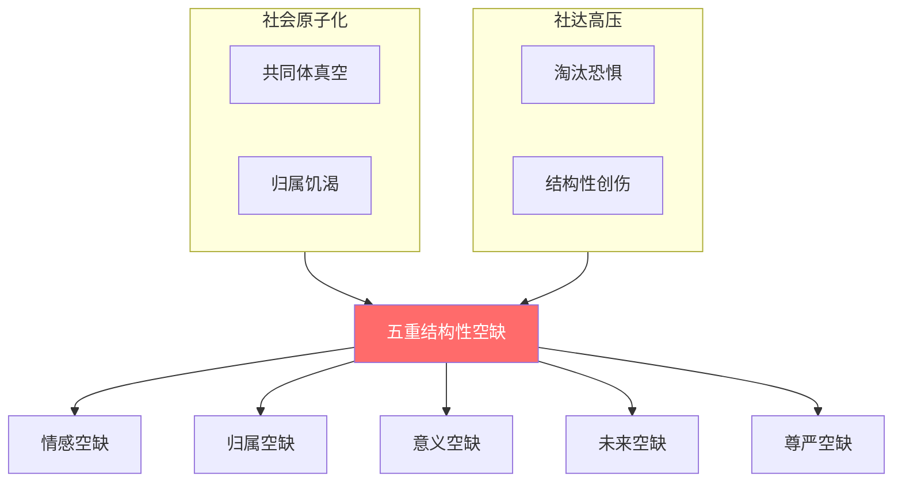

**图1：五重结构性空缺的形成机制**

#### 2.1.2 日式二次元作为“情感操作系统”

日式二次元的四大核心叙事语法——**羁绊美学、世界系叙事、拟似家族、根性論**——构成了一套完整的外来“情感操作系统”。这四者协同覆盖五重空缺的全部维度，使日式二次元能够实现“全光谱填补”。

| 叙事语法 | 主要填补的空缺 | 辅助填补的空缺 | 意识形态功能 |
|:---|:---|:---|:---|
| 羁绊美学 | 情感空缺、归属空缺 | 意义空缺 | 将结构性矛盾转化为个人情感问题 |
| 世界系叙事 | 意义空缺、未来空缺 | 尊严空缺 | 削弱对制度性变革的想象力 |
| 拟似家族 | 归属空缺、情感空缺 | — | 将归属转化为消费行为 |
| 根性論 | 尊严空缺、未来空缺 | 意义空缺 | 削弱对客观条件的批判性认知 |

#### 2.1.3 “快乐拜物教”作为意识形态防御

泛二次元极的核心意识形态操作，是将“快乐”建构为**不可触碰的价值禁区**。其逻辑结构如下：

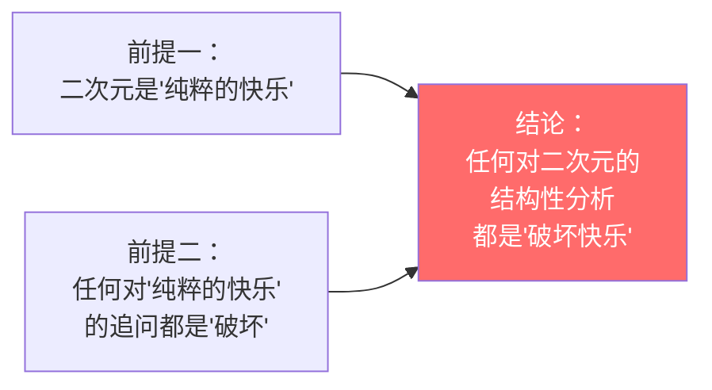

**图2：“快乐拜物教”的逻辑结构**

这一“快乐拜物教”的意识形态功能在于：**它将资本-情感复合体的运作逻辑包裹在“快乐”的外壳中，使任何对资本逻辑的追问都被重新编码为“对快乐本身的攻击”。**

### 2.2 民族主义极：文化主权叙事的生成

#### 2.2.1 历史来源：从“救亡”到“内卷”

社会达尔文主义在近代中国的引入，本身具有“救亡”的历史功能。严复翻译《天演论》的目的，是以“优胜劣败，适者生存”的公式唤醒国人。胡适在《四十自述》中描绘道：“几年之中，这种思想像野火一样，延烧着许多少年的心和血。”

然而，当“救亡”的历史任务已完成、和平年代的“存量竞争”成为主旋律时，社会达尔文主义的“竞争”逻辑从“保种救国”异化为“内卷”。民族主义在这一语境中经历了一个关键转化：从“为民族生存而竞争”转化为“为文化纯粹性而战斗”。

#### 2.2.2 极端民族主义的核心叙事

极端民族主义极的核心叙事可归纳为三重结构：

**图3：极端民族主义的三重核心叙事**

#### 2.2.3 “极端民族主义”与“朴素爱国主义”的区分

需要强调的是，“极端民族主义极”所指涉的，并非广义的“爱国主义”或“文化自信”，而是一种具有以下特征的**极端化变体**：

| 维度 | 朴素爱国主义 | 极端民族主义 |
|:---|:---|:---|
| 对“外来”的态度 | 批判性接纳——取其精华，去其糟粕 | 本质化排斥——凡外来皆有害 |
| 对“内部异见”的态度 | 容许多元讨论 | 将异见等同于“背叛” |
| 行动策略 | 对话、教育、建设 | 举报、清场、毁灭 |
| 对资本的态度 | 未系统分析 | 忽视或共谋 |

这一区分至关重要：本研究对“极端民族主义极”的批判，不构成对“爱国主义”或“文化自信”的否定。

### 2.3 马列主义极：结构批判的生成

#### 2.3.1 理论来源：马克思主义与后殖民批判的整合

马列主义极的方法论基础，是马克思主义政治经济学与后殖民批判理论的整合。这一整合并非“外来理论的本土套用”，而是**将反殖民理论武器应用于当代文化殖民的结构分析**。

其核心分析框架包括：

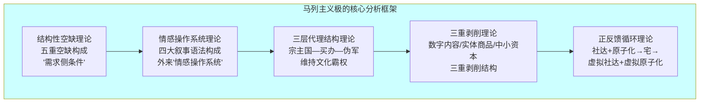

**图4：马列主义极的核心分析框架**

#### 2.3.2 马列主义极的核心定位

马列主义极具有**双重定位**：

**第一定位：系统分析者。** 马列主义极不参与“三极争霸”的表层战斗，而将“三极争霸本身”作为分析对象。它追问的不是“谁对谁错”，而是“为什么三极会形成、如何运作、向何处去”。

**第二定位：元认知觉醒者。** 马列主义极将批判的矛头指向自身——它不仅分析系统，还分析“我为什么这样分析系统”。这种自我反思的能力，使其能够避免被“三极争霸”的任一极所吸收。

#### 2.3.3 马列主义极的独特困境

然而，马列主义极面临一个独特的结构性困境：

| 困境 | 内容 | 机制 |
|:---|:---|:---|
| **双重攻击** | 同时被泛二次元极和民族主义极攻击 | 泛二次元极指控其“上纲上线”“破坏快乐”；民族主义极指控其“不爱国”“内部削弱” |
| **武器悖论** | 用于分析的“反殖民理论工具”本身是“舶来品” | 这一“自指性矛盾”可能被其他两极用作“你也是外来理论”的攻击点 |
| **位置困境** | 分析者无法“置身事外” | 马列主义者的分析行为本身也处于三极争霸的场域中，无法获得“上帝视角” |
| **翻译困境** | 结构分析在情感语境中无法被“翻译” | 马列主义者的分析话语在泛二次元极的情感编译器中，被翻译为“冷漠”或“敌意” |

## 三、三极的拓扑结构：不可通约性与相互寄生

### 3.1 三极的核心特征对比

| 维度 | 泛二次元极 | 民族主义极 | 马列主义极 |
|:---|:---|:---|:---|
| **核心价值** | 快乐、纯粹、热爱 | 文化主权、民族尊严 | 真理、结构、解放 |
| **最高判准** | “快乐是否被破坏” | “是否爱国” | “分析是否精准” |
| **判断标准** | 情感共鸣 | 民族忠诚 | 逻辑实证 |
| **核心话语策略** | 消解性话语（“你上纲上线”） | 立场审判（“你不爱国”） | 结构分析（“这是系统的免疫反应”） |
| **对“他者”的建构** | 外部攻击者、破坏快乐者 | 文化入侵者、内部叛徒 | 系统的产物、盲视者 |
| **自身定位** | 无辜的快乐追求者 | 勇敢的文化保卫者 | 清醒的系统解剖者 |
| **终极恐惧** | 快乐被政治化 | 文化被污染 | 结构不可被分析 |

### 3.2 不可通约性的三层次分析

三极之间不存在“谁更正确”的判准，因为三极的“正确性”建立在**完全不同的判断标准**之上。这一不可通约性可分为三个层次：

#### 3.2.1 价值标准的不可通约

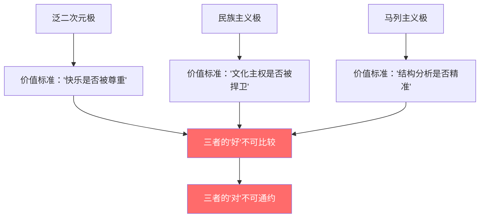

**图5：价值标准的不可通约性**

#### 3.2.2 话语逻辑的不可通约

- 泛二次元极的论证方式是**情感论证**——“我感受到了快乐，所以它是好的”。
- 民族主义极的论证方式是**身份论证**——“我是爱国者，所以我说的对”。
- 马列主义极的论证方式是**结构论证**——“数据与逻辑显示，这是系统运作的必然结果”。

**三者无法在同一话语框架中对话——因为“对话”的前提是对“什么算有效论证”的共识，而这一共识恰恰不存在。**

#### 3.2.3 胜利标准的不可通约

| 极 | 胜利标准 | 失败标准 |
|:---|:---|:---|
| 泛二次元极 | “不被谈论”——只要没人来“破坏”堡垒，就“赢了” | “被政治化”——当快乐被追问其生产条件时 |
| 民族主义极 | “敌人被清除”——只要“文化入侵者”被举报、下架、驱逐 | “入侵加剧”——当泛二次元进一步扩张时 |
| 马列主义极 | “预测被验证”——只要系统运转符合模型预测 | “预测失效”——当系统偏离模型预测时 |

### 3.3 相互寄生：三极的“存在依赖”

三极争霸的独特之处在于：**每一极的存在都依赖于另外两极的“在场”来维持自身的合法性与紧迫性。**

#### 3.3.1 泛二次元极的寄生

泛二次元极需要“外部攻击”来维持“堡垒化”的正当性：

| 依赖对象 | 提供的内容 | 对泛二次元极的功能 |
|:---|:---|:---|
| 民族主义极 | “你们在文化入侵”的指控 | 证明“我们被外部攻击”，从而证明“堡垒化”是必要的 |
| 马列主义极 | “你们是资本-情感剥削的产物”的分析 | 证明“你们不理解我们的快乐”，从而强化“圈地自萌”的合理性 |

**没有“外部攻击”，泛二次元极的“堡垒化”就失去了理由。“外部攻击”越强，堡垒越坚固。**

#### 3.3.2 民族主义极的寄生

民族主义极需要“文化入侵者”来维持“清场”的紧迫性：

| 依赖对象 | 提供的内容 | 对民族主义极的功能 |
|:---|:---|:---|
| 泛二次元极 | “文化入侵”的显性证据（日式动漫的流行） | 证明“我们确实在被入侵”，从而证明“清场”是必要的 |
| 马列主义极 | “你也只是资本逻辑的产物”的结构分析 | 证明“内部有叛徒”，从而证明“内部清理”是必要的 |

**没有“入侵者”，民族主义极的“清场”就失去了靶子。“入侵者”越嚣张，清场越正义。**

#### 3.3.3 马列主义极的寄生

马列主义极需要“系统免疫反应”来验证其分析框架的准确性：

| 依赖对象 | 提供的内容 | 对马列主义极的功能 |
|:---|:---|:---|
| 泛二次元极 | “你上纲上线”的消解性反应 | 验证“系统会通过消解性话语阻止被分析”的预测 |
| 民族主义极 | “你不爱国”的立场审判 | 验证“民族主义会与资本殖民体系共谋”的预测 |

**没有“免疫反应”，马列主义极的“结构分析”就失去了实证支撑。“免疫反应”越强烈，分析框架越被验证为精准。**

### 3.4 相互寄生的拓扑图示

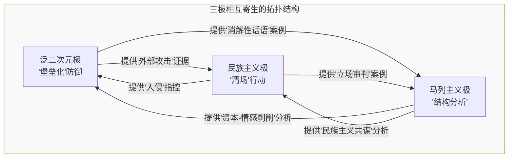

**图6：三极相互寄生的拓扑结构**

这一拓扑结构的核心特征是：

1. **三极之间不存在“中心”**——没有任何一极处于“支配”位置。
2. **三极之间不存在“联盟”**——任何“联手”都是临时的、基于共同敌人的、不稳定的。
3. **三极之间的每一条连接都是“寄生”而非“互利”**——每一极消耗其他两极的存在来维持自己的存在，而并不生产任何对“系统整体”有益的东西。
4. **三极构成一个“闭曲面”**——没有任何一极可以通过“撤退”来退出系统，因为“撤退”本身会被其他两极解读为“承认失败”。

## 四、三极争霸的动力学：正反馈循环与指数级升级

### 4.1 三极“上升”的本质差异

在三极争霸的动力学中，核心观察是：**马列主义极会上升——即从分析“现象”上升到分析“现象背后的结构”，再上升到分析“我们为什么会这样分析现象”——此时泛二次元极和民族主义极被迫“跟着上升”——即在同一层面上将各自的话语推向更极端的方向——但它们试图将马列主义极“拽回”自己熟悉的“情感冲突”或“立场审判”层面，而马列主义极由于其方法的“元分析”特性，不会被拽回。**

三者的“上升”在本质上不同：

| 极 | “上升”的含义 | “上升”的方式 | 方向 |
|:---|:---|:---|:---|
| 泛二次元极 | 在同一层面上的“极端化” | 把同一套话术（“我们在被攻击”）说得更狠、更情绪化 | 横向内卷 |
| 民族主义极 | 在同一层面上的“极端化” | 把同一套话术（“文化入侵严重”）说得更响亮、更激进 | 横向内卷 |
| 马列主义极 | 维度跃迁 | 从分析“现象”上升到分析“现象为什么会这样”，再上升到分析“我们为什么会这样分析现象” | 纵向跃迁 |

正是这种“上升”的**本质差异**，解释了为什么“拽不下去”：

- 泛二次元极和民族主义极试图“拽”马列主义极“下去”——即拉回他们熟悉的“情感冲突”或“立场审判”层面。
- 但马列主义极的“上升”是**纵向的维度跃迁**——他们不“跑得更快”，而是“飞得更高”。
- 在同一平面跑得再快，也无法拽住一个已经升到更高维度的人。

### 4.2 三极争霸的完整正反馈循环

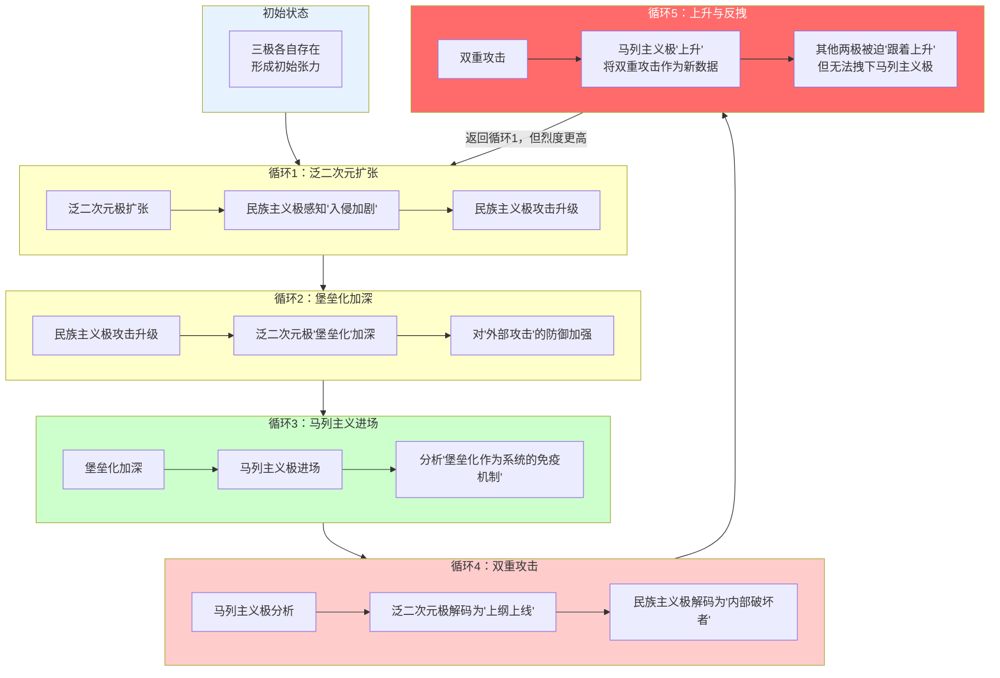

**图7：三极争霸的完整正反馈循环**

### 4.3 “拽不下去”的动力学

#### 4.3.1 其他两极“拽”的策略

| 策略 | 具体操作 | 目标 | 机制 |
|:---|:---|:---|:---|
| 策略一：情感化 | “你破坏我们的快乐” | 将马列主义极从“结构分析”层面拽入“情感冲突”层面 | 使马列主义极被迫在“情感”层面应战，从而放弃“结构分析” |
| 策略二：道德化 | “你不爱国” | 将马列主义极从“结构分析”层面拽入“立场审判”层面 | 使马列主义极被迫在“道德”层面自证清白，从而分散分析注意力 |
| 策略三：污名化 | “你是阴谋论者” | 将马列主义极从“可信分析者”拽入“不可信极端分子”层面 | 使马列主义极的分析被预先取消合法性 |
| 策略四：起源攻击 | “你用的理论也是外来的” | 将马列主义极拽入“你也一样”的平行层面 | 以“自指性矛盾”消解马列主义极的分析权威 |

#### 4.3.2 马列主义极“不上当”的机制

| 机制 | 具体操作 | 功能 |
|:---|:---|:---|
| 机制一：元分析 | 将“被情感化”本身作为分析对象——“看，系统正在试图将结构分析拽入情感层面” | 不陷入情感冲突，而是将“情感化”作为新数据 |
| 机制二：结构定位 | 将“被道德化”本身作为结构产物——“这种道德审判是民族主义极的典型操作” | 不进行道德自证，而是将“道德审判”作为结构案例 |
| 机制三：数据采集 | 将“被污名化”本身作为实证材料——“这是我们预判过的‘免疫升级’” | 不进行自我辩护，而是将“污名化”作为验证材料 |
| 机制四：递归反思 | 将“起源攻击”本身作为分析对象——“让我们来谈谈‘外来理论’与‘本土理论’的区分是否有效” | 不进行“来源”辩护，而是将“来源问题”本身作为分析对象 |

### 4.4 各循环轮次中三极的状态变化

| 循环轮次 | 泛二次元极状态 | 民族主义极状态 | 马列主义极状态 | 社会宏观状态 |
|:---|:---|:---|:---|:---|
| 第1轮 | 圈地自萌 | 文化警觉 | 初步分析 | 公共对话尚存 |
| 第2轮 | 堡垒化 | 清场行动 | 系统建模 | 对话开始破裂 |
| 第3轮 | 极端排异 | 举报常态化 | 结构解剖 | 公共信任下降 |
| 第4轮 | 快乐拜物教 | 道德审判 | 元分析 | 跨阵营对话消失 |
| 第5轮 | 话语闭环 | 极度极化 | 递归反思 | 社会认知碎片化 |
| 第n轮 | …… | …… | …… | …… |

## 五、社会环境恶化：三极争霸的宏观输出与输入

### 5.1 三极争霸如何导致社会环境恶化

三极争霸的持续运转，通过以下机制导致“社会环境恶化”：

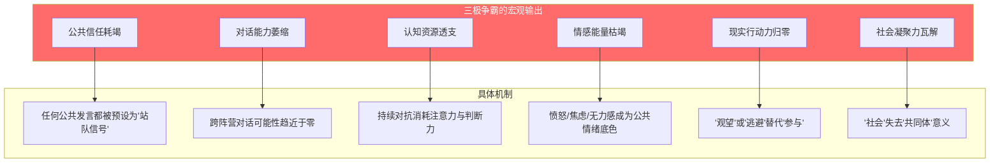

**图8：三极争霸导致社会环境恶化的机制**

#### 5.1.1 公共信任耗竭

在三极争霸中，每一极都将其他极建构为“不可信任的敌人”。泛二次元极认为民族主义极是“文化警察”，马列主义极是“上纲上线的破坏者”；民族主义极认为泛二次元极是“文化内鬼”，马列主义极是“内部削弱者”；马列主义极认为泛二次元极是“资本殖民的产物”，民族主义极是“与资本共谋的工具”。

当每一极都将其他极建构为“不可信任”时，公共空间中的**任何发言都被预设为“站队信号”**——人们不再问“他说了什么”，而是问“他站在哪一边”。公共信任的耗竭，使社会失去了“协作”的基础。

#### 5.1.2 对话能力萎缩

不可通约性的持续运作，使跨阵营的对话变得不可能：

- 泛二次元极使用**情感语言**（“快乐”“热爱”“纯粹”）
- 民族主义极使用**道德语言**（“爱国”“背叛”“入侵”）
- 马列主义极使用**分析语言**（“结构”“剥削”“系统”）

三者之间不存在“翻译机制”。当每一方都认为“对方根本听不懂我在说什么”时，对话就被放弃了。对话能力的萎缩，使社会失去了“协商”的渠道。

#### 5.1.3 认知资源透支

三极争霸的持续噪音，对个体的认知资源构成持续消耗：

| 消耗形式 | 具体表现 | 后果 |
|:---|:---|:---|
| 注意力分散 | 持续暴露于高强度争辩 | 无法集中注意力于建设性事务 |
| 判断力下降 | 信息过载导致无法分辨 | 放弃独立判断，转向“站队” |
| 决策瘫痪 | 任何选择都被预设为“错误” | 放弃主动决策，转向“跟随” |
| 反思能力丧失 | 没有“无目的”的时间用于内省 | 失去自我校正的能力 |

#### 5.1.4 情感能量枯竭

持续的对抗性话语消耗了可用于建设性行动的情感储备：

**图9：情感能量枯竭的传导链条**

#### 5.1.5 现实行动力归零

当公共空间被三极争霸占据时，现实行动的空间被压缩：

| 行动类型 | 在公共空间中的状态 | 结果 |
|:---|:---|:---|
| 建设性讨论 | 被三极争霸的噪音淹没 | 无法进行 |
| 跨群体协作 | 被“不可信任”预设阻止 | 无法启动 |
| 社会问题解决 | 被“站队优先”逻辑取代 | 无法推进 |
| 共识性行动 | 被“不可通约”结构消解 | 无法达成 |

#### 5.1.6 社会凝聚力瓦解

当上述五种恶化同时发生时，社会作为一个整体的凝聚力被瓦解：

| 凝聚力维度 | 瓦解机制 | 瓦解后的状态 |
|:---|:---|:---|
| 认知凝聚 | 三极各自拥有不同的事实框架 | 不再共享“共同事实” |
| 价值凝聚 | 三极各自拥有不同的价值判准 | 不再共享“共同价值” |
| 情感凝聚 | 三极各自将对方建构为“敌人” | 不再共享“共同情感” |
| 行动凝聚 | 三极各自走向不同的行动方向 | 不再拥有“共同行动” |

### 5.2 “社会环境恶化”如何反过来强化三极争霸

这是整个系统最关键的“闭环”机制：**社会环境恶化不是三极争霸的“最终后果”，而是三极争霸“下一轮运转”的输入。**

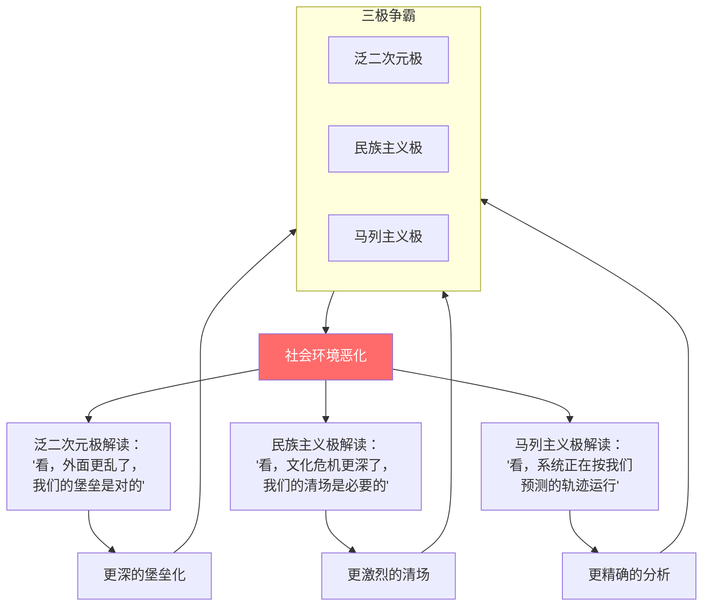

**图10：社会环境恶化如何强化三极争霸**

#### 5.2.1 泛二次元极的解读

当社会环境恶化时，泛二次元极的叙事逻辑是：

> **“看，外面越来越乱了。我们的选择是对的——退回二次元，至少那里是安全的、干净的、纯粹的。社会越乱，我们越需要堡垒。”**

社会环境的恶化，为泛二次元极提供了“堡垒化”的最强证据。每一轮恶化都使堡垒看起来“更必要”，而堡垒越“必要”，泛二次元极就越扩张、越排外、越封闭。

#### 5.2.2 民族主义极的解读

当社会环境恶化时，民族主义极的叙事逻辑是：

> **“看，外部势力（二次元/资本）和内部蛀虫（马列主义者）已经把社会搞成什么样子了。我们必须更坚决地清除他们。社会越乱，我们越需要清场。”**

社会环境的恶化，为民族主义极提供了“清场”的最强证据。每一轮恶化都使清场看起来“更紧迫”，而清场越“紧迫”，民族主义极就越激进、越极端、越暴力。

#### 5.2.3 马列主义极的解读

当社会环境恶化时，马列主义极的叙事逻辑是：

> **“看，三极争霸的持续运转，正在使社会系统失去自我修复能力。这正是我们分析框架中‘宏观不可回归临界点’的显现。社会越恶化，我们的分析越被验证为精准。”**

社会环境的恶化，为马列主义极提供了“验证”的最强证据。每一轮恶化都使分析框架看起来“更准确”，而分析越“准确”，马列主义极就越深入、越系统、越无所不包。

### 5.3 “社会环境恶化”的循环动力学

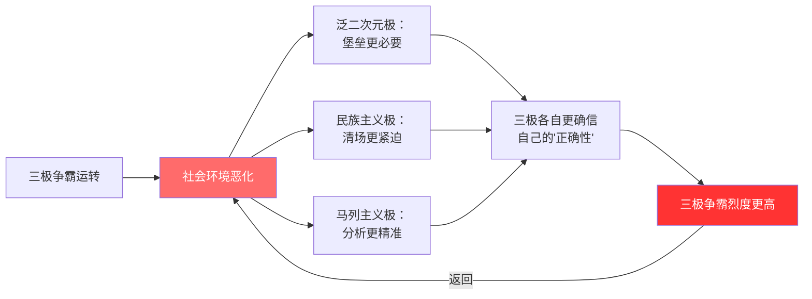

**图11：“社会环境恶化”的循环动力学**

### 5.4 “社会环境恶化”的量表与临界点

基于上述分析，“社会环境恶化”可以在以下维度上进行测量：

| 恶化维度 | 测量指标 | 恶化方向 |
|:---|:---|:---|
| 公共信任指数 | 跨阵营信任度、公共发言可信度 | 持续下降 |
| 对话能力指数 | 跨阵营对话频率、对话持续性 | 持续下降 |
| 认知负荷指数 | 信息过载程度、判断力水平 | 持续上升 |
| 情感能量指数 | 建设性情感（希望/信任）vs破坏性情感（愤怒/绝望） | 持续失衡 |
| 行动意愿指数 | 参与公共事务意愿、集体行动能力 | 持续下降 |
| 社会凝聚力指数 | 共享事实、共享价值、共享情感 | 持续下降 |

当这些指标持续恶化至某一阈值时，社会系统将抵达**“宏观不可回归临界点”**——在这一临界点之后，社会的自我修复能力永久丧失。

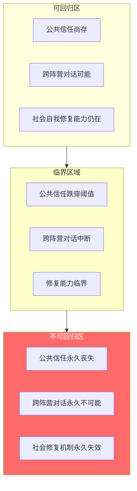

**图12：宏观不可回归临界点**

## 六、历史比较：当代三极与美-苏-纳

### 6.1 历史三极与当代三极的系统对比

| 维度 | 历史三极（美/苏/纳） | 当代三极（二次元/民族主义/马列主义） |
|:---|:---|:---|
| **实体性** | 有明确的国家/政党/领土边界 | 无固定边界——任何人都可以在不同“极”之间流动或站队 |
| **组织性** | 有清晰的领导层与指挥链 | 无中心——每一极都是“众声喧哗”的聚合体 |
| **物质基础** | 有军队、经济、领土等物质力量 | 主要存在于“话语”和“情感”层面 |
| **终结方式** | 战争、崩溃、制度变革 | 不可“消灭”——只能被“耗散”或“重构” |
| **外部性** | 对“非参与国”构成直接威胁 | 主要影响“参与者”的精神状态与认知框架 |
| **时间尺度** | 数十年（二战、冷战） | 可能持续更久——因为“话语”不会被“占领” |
| **内部多样性** | 每一极内部有相对统一的立场 | 每一极内部高度碎片化——无统一纲领 |
| **对“中立者”的态度** | 要求“选边站” | 同样要求“选边站”，但“中立”本身也被建构为一种“极” |

### 6.2 历史三极的终局及其对当代的启示

| 历史终局 | 机制 | 对当代的启示 |
|:---|:---|:---|
| 二战：两极联手摧毁第三极 | 共同敌人促成临时同盟 | 当代三极之间能否形成“临时二打一”？——可能性低，因为三极均无实体 |
| 冷战：一极从内部崩溃 | 经济/制度/意识形态的内部压力 | 当代三极中哪一极可能“内爆”？——泛二次元极可能因经济泡沫破裂而萎缩；民族主义极可能因失去“敌人”而消解；马列主义极可能因过度反思而陷入自我解构 |
| 冷战后：单极霸权 | 一极幸存，但失去对手后内部瓦解 | 如果某一极“胜出”，它能否维持自身的存在？——没有“敌人”的“战士”会失去存在的理由 |

**关键洞见：历史三极以“两极联手摧毁第三极”或“一极从内部崩溃”收场。但当代三极结构的特殊性在于——这三极都是“话语场域”而非“实体”。因此，它们不会被“消灭”，只会被“耗散”。**

### 6.3 当代三极争霸的独特性

当代三极争霸与历史三极结构相比，具有以下独特性：

**第一，去中心化。** 历史三极有明确的核心（华盛顿/莫斯科/柏林），当代三极没有。每一极都是“众声喧哗”的聚合体，不存在“最高领袖”或“中央委员会”。

**第二，流动性。** 个体可以在不同“极”之间流动——一个二次元爱好者也可能在特定议题上采取民族主义立场；一个马列主义者也可能消费二次元内容。这种流动性使三极的“边界”模糊化。

**第三，不可消灭性。** 历史三极可以被军事击败或制度瓦解。当代三极是“话语场域”——你不能“消灭”一种话语，你只能“替代”它或“耗散”它。

**第四，自指性。** 马列主义极将“三极争霸本身”作为分析对象——这一“自指性”是历史三极所不具备的。这意味着马列主义极有可能“看见”并“记录”整个系统的运作。

## 七、破局的可能路径：元认知觉醒

### 7.1 为什么“单一干预”无效

在三极争霸的结构中，任何“单一干预”策略都被证明是无效的：

| 干预策略 | 系统的反应 | 为何无效 |
|:---|:---|:---|
| 禁止/限制泛二次元 | 将其合法化为“受害者”叙事，强化堡垒化 | 攻击被系统吸收为“防御燃料” |
| 打击极端民族主义 | 将其合法化为“文化主权被压制”叙事，激进化 | 压制被系统吸收为“反抗动力” |
| 宣布马列主义为“官方” | 被其他两极解码为“权力介入”，失去分析公信力 | 官方化被系统吸收为“政治化证据” |
| 呼吁“理性对话” | 被三极解码为“软弱”“投降”或“和稀泥” | 中立被系统吸收为“不站队=叛徒” |
| 加强教育/宣传 | 被三极各自解读为“洗脑”“灌输”或“意识形态” | 教育被系统吸收为“立场强化”的燃料 |

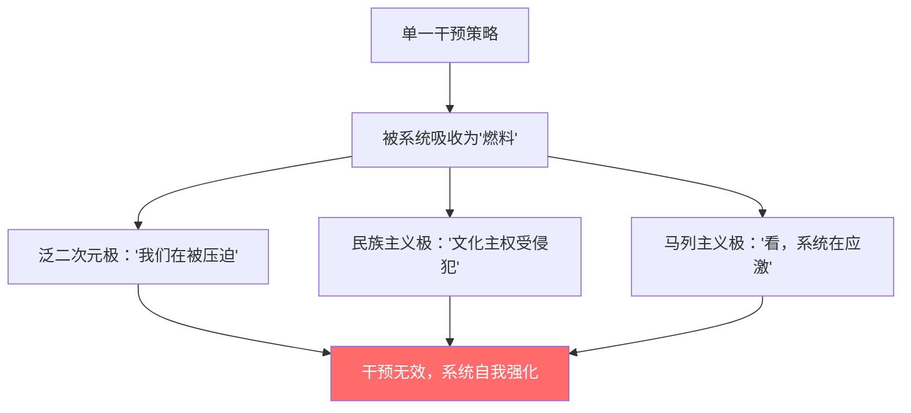

**图13：单一干预为何无效**

### 7.2 元认知觉醒：唯一可能的破局点

基于上述分析，本研究发现：**“破局”的唯一可能路径在于元认知层面的觉醒——即个体开始意识到自己正处于三极争霸的拓扑结构中，并拒绝在任何单一极的“游戏规则”内寻找出路。**

#### 7.2.1 元认知觉醒的三个层次

| 层次 | 内容 | 操作 |
|:---|:---|:---|
| **第一层：识别** | 识别自己正处于三极争霸的拓扑结构中 | 暂停自动化的“站队”反应，观察自己的话语选择 |
| **第二层：定位** | 定位自己在三极结构中的位置 | 分析自己为什么选择这一极，其背后的社会结构条件是什么 |
| **第三层：退出** | 拒绝在任何单一极的游戏规则内参与 | 不进行“情感自证”“立场自证”或“分析自证”，而是追问“为什么我被要求自证” |

#### 7.2.2 从“参与者”到“观察者”

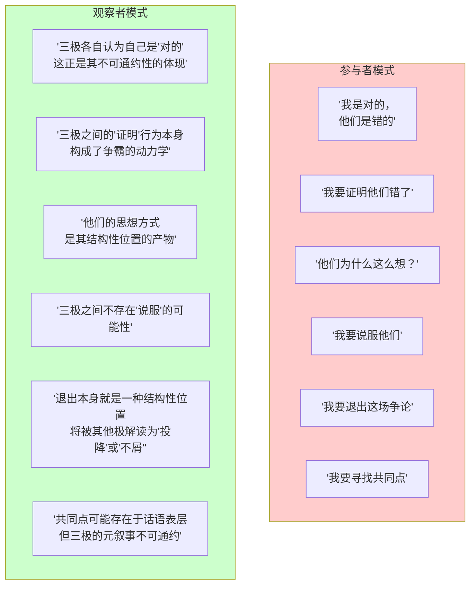

**图14：从“参与者”到“观察者”的切换**

### 7.3 “地图”而非“武器”

基于田野经验与理论分析，本研究发现：**在三极争霸的拓扑结构中，“武器”（改变系统的策略）是无效的，唯一可传递的是“地图”（系统如何运作的知识）。**

| 维度 | “武器” | “地图” |
|:---|:---|:---|
| **定义** | 用于改变系统的工具或策略 | 描述系统如何运作的知识框架 |
| **在三极争霸中的有效性** | 无效——被系统吸收为“燃料” | 有效——描述的是系统本身的结构与机制 |
| **可传递性** | 难以传递——传递行为本身可能被识别为“攻击” | 可传递——以文本、理论、模型的形式存在 |
| **时间尺度** | 短期（需要即时操作） | 长期（知识可以在时间中积累和传递） |
| **对操作者的要求** | 需要持续在场 | 可以脱离操作者独立存在 |

**关键命题：在三极争霸的拓扑结构中，“地图”的价值不在于“改变”系统，而在于让持有者知道“为什么这里不可行”以及“如何不被系统吸收为燃料”。**

### 7.4 “追问”作为最小单位的抵抗

在元认知觉醒的基础上，本研究提出一种“最小单位的抵抗”策略——**“追问”**：

> **“追问”不是“反驳”——反驳是在对方的判准体系中作战。“追问”是拒绝进入对方的判准体系。**

| 三极对马列主义者的指控 | “追问”的回应 |
|:---|:---|
| “你上纲上线。” | “为什么‘上纲上线’这个词本身就成了终止讨论的密码？” |
| “你不爱国。” | “在什么结构中，‘爱国’被定义为了‘必须不追问这些问题’？” |
| “你破坏我们的快乐。” | “什么样的快乐，经不起对它生产条件的追问？” |
| “你是阴谋论者。” | “为什么‘分析结构’会被定义为‘阴谋论’？” |
| “你是外来理论的套用者。” | “一个理论的有效性，是由它的‘来源’决定的，还是由它对现实的解释力决定的？” |

**“追问”的功能在于：它不参与三极争霸的任何一级，而是将“对话结构本身”暴露为需要被审视的对象。当追问持续进行时，三极争霸的“不可通约性”就不再是“不言自明”的——它成为了“可以被看到的结构”。**

## 八、结论

### 8.1 主要发现

本研究基于系统动力学、话语分析与后殖民批判理论，构建了“意识形态三极拓扑模型”（ITTM），对中国公共话语空间中的三极争霸进行了系统性分析。主要发现如下：

**第一，三极争霸是一个“恐怖的三极结构”。** 泛二次元极、民族主义极与马列主义极在同一公共空间中形成了不可通约的、相互寄生的、自我强化的拓扑结构。三极之间不存在“谁更正确”的判准，因为三极的“正确性”建立在完全不同的判断标准之上。

**第二，三极之间构成“相互寄生”关系。** 每一极的存在都依赖于另外两极的“在场”来维持自身的合法性与紧迫性。泛二次元极需要“外部攻击”来证明“堡垒化”的必要；民族主义极需要“文化入侵者”来证明“清场”的紧迫；马列主义极需要“系统免疫反应”来验证其分析的精准。

**第三，三极争霸构成一个正反馈循环系统。** 每一轮的“升级”都使下一轮的“烈度”更高。马列主义极的“纵向跃迁式上升”与其他两极的“横向内卷式上升”形成结构性不对称，解释了为什么“拽不下去”。

**第四，三极争霸的宏观输出是“社会环境的持续恶化”。** 三极争霸通过公共信任耗竭、对话能力萎缩、认知资源透支、情感能量枯竭、现实行动力归零、社会凝聚力瓦解六重机制，持续制造“社会环境恶化”。

**第五，“社会环境恶化”反过来成为三极争霸的“输入燃料”。** 每一极都将“社会环境恶化”解读为自身立场的“最强证据”——泛二次元极认为“堡垒更必要”，民族主义极认为“清场更紧迫”，马列主义极认为“分析更精准”。这形成了一个在宏观尺度上自我强化的正反馈循环。

**第六，与历史“美-苏-纳”三极结构相比，当代三极争霸具有根本性的独特性。** 历史三极是有形的实体（国家/政党/领土），可以被“消灭”或“崩溃”；当代三极是“话语场域”，只能被“耗散”或“重构”。这使当代三极争霸可能持续更久，且更难以终结。

**第七，破局的可能路径在于元认知觉醒。** 单一干预策略均被证明无效。唯一可能的出路是：个体开始意识到自己正处于三极争霸的拓扑结构中，拒绝在任何单一极的游戏规则内寻找出路，从“参与者”切换为“观察者”，从“武器”转向“地图”。

### 8.2 理论贡献

| 贡献 | 具体内容 |
|:---|:---|
| **1. 提出“意识形态三极拓扑模型”** | 首次将三极争霸识别为一种“拓扑结构”——不可通约、相互寄生、自我强化 |
| **2. 揭示“相互寄生”机制** | 论证了三极之间“存在依赖”——每一极都需要另外两极来维持自身 |
| **3. 识别“上升”的不对称性** | 区分了“横向内卷式上升”与“纵向跃迁式上升” |
| **4. 论证“社会环境恶化”的双重功能** | 揭示了三极争霸如何制造“社会环境恶化”，以及“社会环境恶化”如何反过来强化三极争霸 |
| **5. 论证“宏观不可回归临界点”** | 将个体层面的“临界点”概念扩展至社会宏观尺度 |
| **6. 历史比较分析** | 系统对比当代三极与“美-苏-纳”历史三极的异同 |
| **7. 提出“元认知觉醒”破局路径** | 将“元认知”概念应用于意识形态斗争的分析 |

### 8.3 最终命题

> **当三股不可通约的元叙事在同一公共空间中持续交锋时，它们不构成“对话”，而构成一种“恐怖的三极结构”——每一极的“存在”都依赖于另外两极的“在场”；每一极的“上升”都迫使另外两极“跟着上升”；每一极的“胜利”都在同一时刻被另外两极的“胜利”所抵消。**
>
> **这个拓扑结构不产生“共识”，只产生“碎片”；不产生“解决”，只产生“循环”；不产生“修复”，只产生“恶化”。**
>
> **三极争霸的持续运转，本身构成了“社会环境恶化”的结构性驱动力；而社会环境的恶化，又反过来为三极各自提供了“坚持到底”的最强理由。这是一个在社会宏观尺度上自我强化的正反馈循环——每一轮“恶化”都使下一轮“恶化”更可能发生，直到整个社会系统抵达“宏观不可回归临界点”。**
>
> **而唯一的破局点，不在“战胜”某一极，而在“看见”这个拓扑结构本身。**
>
> **当一个足够多的人开始“看见”，“看见”本身——这个拒绝被任何一极捕获的元认知行为——就成为所有循环中唯一无法被系统吸收的那粒火种。**

## 参考文献

[1] Marx, K., & Engels, F. (1845-1846). The German Ideology. In *Marx/Engels Collected Works*, Vol. 5. London: Lawrence & Wishart.

[2] Lenin, V. I. (1916). Imperialism, the Highest Stage of Capitalism. In *Lenin Collected Works*, Vol. 22. Moscow: Progress Publishers.

[3] Gramsci, A. (1929-1935). *Selections from the Prison Notebooks*. New York: International Publishers.

[4] Fanon, F. (1952). *Black Skin, White Masks*. New York: Grove Press.

[5] Fanon, F. (1961). *The Wretched of the Earth*. New York: Grove Press.

[6] Said, E. (1978). *Orientalism*. New York: Pantheon Books.

[7] Bhabha, H. (1994). *The Location of Culture*. London: Routledge.

[8] Horkheimer, M., & Adorno, T. W. (1944). *Dialectic of Enlightenment*. New York: Herder and Herder.

[9] Marcuse, H. (1964). *One-Dimensional Man*. Boston: Beacon Press.

[10] Durkheim, É. (1897). *Suicide: A Study in Sociology*. New York: Free Press.

[11] Bauman, Z. (2000). *Liquid Modernity*. Cambridge: Polity Press.

[12] Hofstadter, R. (1944). *Social Darwinism in American Thought*. Boston: Beacon Press.

[13] 蒋淑媛, 张唯肖. (2024). 粉丝情感劳动的异化逻辑和伦理重塑. 北京邮电大学学报（社会科学版）.

[14] 王洪喆, 吴靖. (2020). 平台的劳动过程与数字劳动的控制. 新闻与传播研究, (9).

[15] 社群悖论定律：跨语法社群冲突的结构性机制研究. (2026).

[16] 泛二次元占领定律：文化生态相变与话语权垄断的结构性机制. (2026).

[17] 泛二次元总纲：文化生态的完整生命周期. (2026).

[18] 论战论辩分化与胜利悖论：泛二次元公共空间中两套判断标准的并行运行. (2026).

[19] 宅的逆反馈循环：泛二次元文化工业中的社会动力学模型. (2026).

[20] 正反馈的死亡螺旋：数字资本时代泛二次元文化-情感-金融复合体的系统性分析. (2026).

**全文完**
