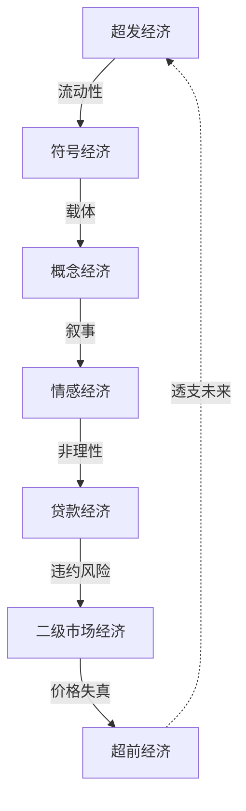

# 经济危机前夜的七重症候：符号经济、情感经济、超前经济、概念经济、超发经济、二级市场经济与贷款经济的系统分析

## 摘要

本文基于马克思主义政治经济学、虚拟经济理论与实体经济-虚拟经济二元结构分析框架，系统论证经济危机爆发前普遍存在的七种结构性症候。研究基于2008年全球金融危机的历史经验与2025-2026年中国“谷子经济”的微观实证，发现这七种经济形态并非彼此孤立的偶发现象，而是一套**自我强化、相互嵌套的正反馈循环系统**。其中，“情感经济”在当代最典型的载体是泛二次元“谷子经济”——以情感共鸣为核心驱动力、以IP符号为价值锚点、以情绪价值为定价基础的消费形态；“超发经济”表现为货币超发催生的流动性涌入IP衍生品市场，形成“数字郁金香”式的符号泡沫；“贷款经济”则面临宏观调控目标与青年群体结构性避险之间的深刻断裂——国家试图以消费信贷提振内需，而年轻一代正在用“主动去杠杆”进行反向叙事。本文结合马克思主义关于“透支消费”与“有效需求不足”的核心论断，对七重症候的形成机制、传导路径与系统性关联进行逐层剖析，提出“危机前夜诊断框架”，为理解当代经济周期的节点提供分析工具。

**关键词**：经济危机；符号经济；谷子经济；情感消费；透支消费；零负债青年

## 一、引言：危机从来不是“突然”发生的

每一次系统性经济危机的爆发，在公众感知中常被呈现为“突然”的冲击——2008年9月15日雷曼兄弟破产的“黑色星期一”、2000年3月纳斯达克指数的断崖式下跌、乃至1637年2月郁金香市场买家“突然消失”——但若穿透表层事件，系统性的危机征兆早已在数月乃至数年前就全面铺开。

马克思主义关于资本主义经济危机的分析提供了最根本的解释框架。正如俞可平等学者所总结的：“一切真正的危机的最根本的原因，总不外乎群众的贫困和他们的有限消费，资本主义生产不顾这种情况而力图发展生产力，好像只有社会的绝对消费力才是生产力发展的界限。” 全球金融危机的根源在于**资本主义制度的内在矛盾**：生产的社会化与私人占有性之间的矛盾，以及广大群众消费力不足与生产无限供给之间的矛盾。当透支消费的债务普遍无力偿还，金融链条断裂，生产过剩的真相便暴露无遗。

在此理论基础之上，本文聚焦于经济危机爆发前普遍出现的七种结构性症候：

| 症候类型 | 核心特征 | 历史典型案例 | 当代实证 |
|:---|:---|:---|:---|
| **符号经济** | 价值与实体脱钩，价格由“叙事”而非基本面决定 | 1637年郁金香球茎 | 迪士尼玩偶139元炒至9589元 |
| **情感经济** | 价格由“情绪价值”驱动，消费成为身份建构手段 | 2000年互联网泡沫 | 88.71%二次元用户愿为“情绪价值”买单 |
| **超前经济** | 以借贷支撑当前消费，未来收入被提前贴现 | 2008年美国次级抵押贷款 | 90后负债率78.3%，人均负债12.1万元 |
| **概念经济** | 宏大叙事为高估值提供合法性 | 1990年代日本泡沫 | “AGI将重塑一切” |
| **超发经济** | 货币供给远超实体产出，流动性泛滥推高资产价格 | 2001-2007年美国降息周期 | 流动性涌入IP衍生品市场 |
| **二级市场经济** | 金融衍生品将局部风险放大为系统风险 | 2007年CDO市场规模超3万亿美元 | 徽章被炒至7.2万元 |
| **贷款经济** | 信用下沉，消费信贷向缺乏偿还能力的群体扩张 | 2006年美国次级贷占50% | 宏观调控意图与青年“零负债”趋势的断裂 |

## 二、符号经济：价值的“去实体化”危机

### 2.1 概念界定与理论溯源

“符号经济”（Symbolic Economy）的核心特征在于：**交易的对象不再是实物或服务本身，而是承载着“意义”“叙事”“身份”的符号**。

自20世纪80年代以后，美国经济越来越呈现虚拟化趋势。在虚拟资本的膨胀过程中，虚拟经济逐渐演变成投机经济。当符号的定价权脱离其赖以产生的物质基础时，泡沫的种子已经种下。当代泛二次元“谷子经济”是符号经济最典型的微观样本——“谷子”是英文Goods的谐音，特指动漫、游戏、偶像等二次元IP的周边商品，包括徽章（吧唧）、卡片、立牌、钥匙扣等。

### 2.2 符号经济的当代实证：溢价经济的微观解剖

2025年，一枚迪士尼2021年发售的奥乐米拉紫龙造型玩偶，发售价139元，二手市场最新报价已达9589元，涨幅近70倍。泡泡玛特LABUBU联名款，发售价599元，被炒至27699元高位，溢价超45倍。谷圈中，“吧唧”被炒至7.2万元，《排球少年》西谷夕角色徽章全球限量5枚，需在日本动漫主题公园玩游乐设施获得体验券、再抽取申请表才有机会抽到。及川彻角色的“队旗麻将”最高成交额达8.3万元。

| 标的物 | 发售价格 | 二手市场价格 | 溢价倍数 |
|:---|:---|:---|:---|
| 迪士尼奥乐米拉紫龙玩偶 | 139元 | 9589元 | **约70倍** |
| LABUBU联名款 | 599元 | 27699元 | **约45倍** |
| 西谷夕角色徽章 | 限量抽选 | 72,000元 | 无限 |

## 三、情感经济：谷子经济作为“情绪消费”的极端化

### 3.1 情感经济的定义与理论框架

“情感经济”在此特指**以情感共鸣为核心驱动力、以IP符号为价值锚点、以“情绪价值”为定价基础的消费形态**。其心理学基础在于：消费者的决策系统在不确定环境中高度依赖“情感启发式”——当理性无法给出确定的“值不值得”答案时，情绪接管了决策权。

上海市消保委2025年发布的《二次元消费新需求与消费者权益保护调查报告》指出：高达41.51%的受访者表示喜欢二次元商品是因为“对作品中的角色、故事或情感产生了共鸣”；47.8%的受访者看重二次元商品的社交功能；52.45%的消费者有展示收藏品的习惯。88.71%的动漫/漫画观众愿意购买“谷子”。

### 3.2 情感经济的微观运作：“谷子”作为情绪价值的实体化载体

“谷子”之所以能够成为情感寄托的“实体化社交货币”，是其将抽象的“虚拟IP人物”转化成“看得见、摸得着”的真实物体（徽章、卡片、立牌）。消费者通过购买、收集、展示行为，完成了对身份的认同（“我是某某角色推”）和社群归属（“同担互晒”）的确认，满足其归属感与自我认同。

情感经济在二次元领域的核心机制包括：

**第一，认同替代功能。** 传统消费主义强调功能与性价比，而Z世代（泛二次元核心群体）的消费决策已被“情绪价值”主导。一位玩家坦言：“钟爱的游戏角色，是爱和陪伴的见证”，买谷就是“为情绪买单”。另一位收藏者表示，玩偶“带给我情绪价值远超过经济价值”。

**第二，小额高频的“成瘾式”消费。** 谷子店的商品单件价格多在20-100元，远低于奢侈品或大额消费，冲动消费更容易发生。有爱好者透露：“为集齐某游戏角色的四季系列，半年花了5000元”。谷子消费的本质是碎片化情绪变现，通过高频低消模式将粉丝情感转化为持续现金流。

## 四、超前经济：以未来支撑当下的时间错配

### 4.1 超前经济的形态

“超前经济”在此指**以借贷和杠杆支撑当前消费与投资，将未来收入提前贴现到当期的经济行为模式**。马克思早已揭示：透支消费不过是“寅吃卯粮”，靠透支未来支撑今天，只是为相对过剩的生产创造虚拟消费条件，不能从根本上消除危机。

在当代，超前消费是美国非常普遍的现象，“从房子到汽车，从信用卡到电话账单，透支无处不在”。中国90后群体同样深陷其中：中国社会科学院金融研究所发布的《中国家庭财富调查报告》显示，国内1.75亿90后群体整体负债率高达78.3%，人均负债12.1万元，远超同龄段前代人群负债水平。

### 4.2 超前经济的传导链条

| 环节 | 机制 | 后果 |
|:---|:---|:---|
| 有效需求不足 | 群众购买力有限，消费能力受限 | 生产相对过剩 |
| 信贷扩张 | 降息+金融创新刺激透支消费 | 债务链条扩张 |
| 资产贬值 | 利率上升/房价下跌触发违约 | 债务无力偿还 |
| 金融链条断裂 | 传导至整个信用体系 | 经济危机爆发 |

90后债务中房贷占比56.7%，消费类信贷占32.1%，剩余为车贷、教育贷等刚性支出。人均持有未结清信贷笔数达6.6笔，非房贷类消费负债平均余额3.18万元，近半数人群每月工资收入超40%用于偿还各类分期账单。

## 五、概念经济：宏大叙事的定价陷阱

### 5.1 概念经济的运作逻辑

“概念经济”指以**一个宏大、难以证伪的未来叙事**为高估值提供合法性的经济形态。其核心操作是将“未来潜力”提前兑现为“当前价格”——投资者购买的已经不是“当下的盈利能力”，而是“未来的梦想”。

在历史上，概念经济以相似的形态反复出现：1720年南海泡沫的“南美洲贸易垄断”叙事；1990年日本泡沫的“日本第一”叙事；2000年互联网泡沫的“.com将改变一切”叙事；以及当前AI领域的“AGI将重塑一切行业”叙事。每一次概念都在刚出现时有其真实的价值基础，但市场的“过度外推”将“确实有价值”误推为“所以价格可以一直涨”。

在泛二次元领域，概念经济的表现为“IP宇宙将覆盖一切文化消费”的宏大叙事——支撑这一叙事的并非当下的盈利能力，而是对未来二十年“IP生命周期价值”的贴现。

## 六、超发经济：流动性过剩与符号泡沫的耦合

### 6.1 超发经济的生成条件

“超发经济”指**货币供给量持续超过实体经济的实际产出需求，导致流动性过剩、资产价格膨胀的经济状态**。美联储为了应对互联网泡沫破裂可能引发的经济衰退，连续降息，导致美国货币供应量急剧增加，并带动次级抵押贷款市场的迅速发展与房屋信用泡沫的逐渐扩大。

在泛二次元领域，超发经济的效应以独特形态呈现：海量流动性并未完全进入实体经济，而是涌入IP衍生品市场——2024年谷子经济市场规模逼近1700亿元，同比增幅超40%，大量资本涌入二次元零售赛道。

### 6.2 谷子经济的“超发-泡沫”传导

2025年第一季度，全国155家谷子店倒闭，连锁谷店潮玩星球闭店比例超过30%、暴蒙闭店比例超60%。连锁品牌库存积压数千万至过亿，批发商手中积压价值超百万元库存，销量普遍下滑至少30%。市场从“开店潮”急速转为“闭店潮”：

| 时期 | 新开谷店 | 倒闭谷店 | 市场状态 |
|:---|:---|:---|:---|
| 2024年上半年 | 爆发式增长 | 极少 | 狂热扩张期 |
| 2024年下半年 | 增速放缓 | 开始增加 | 市场饱和信号 |
| 2025年第一季度 | 约700家 | 155家 | 淘汰洗牌期 |

### 6.3 “超发+符号+情感+概念”的四重共振

现象级IP的市场遇冷是库存爆仓的直接诱因。海量、同质化的谷子滥发导致消费者热情迅速下滑，“市场扩张速度和疯狂程度远超预期”。《排球少年》《蓝色锁链》《咒术回战》等人气日漫IP均经历从供不应求到堆库存的波动。“库存是这个生意现在最恶劣的问题。一些连锁门店的库存从几千万到上亿，批发商压一批，店主也压一批，几千箱几千箱地堆着。”

这正是在泛二次元领域，**超发经济、符号经济、情感经济与概念经济的四重共振效应**：超发经济提供“燃料”（流动性泛滥），符号经济提供“载体”（IP符号脱离实体价值），情感经济提供“动力”（情绪价值驱动非理性消费），概念经济提供“合法性”（“IP宇宙将覆盖一切”的宏大叙事）。四者协同，构成了一个无法自我刹车的高维正反馈循环。

## 七、二级市场经济：风险放大与“谷子金融化”

### 7.1 二级市场经济的概念

“二级市场经济”在此指**商品脱离一级零售市场后在二级市场（二手交易平台、黄牛市场等）被反复交易、价格独立定价的经济形态**。

在谷子经济中，二级市场的交易逻辑与金融衍生品市场具有结构性相似：发行商刻意营造稀缺性（“限定”“绝版”“抽选”）——黄牛产业链深度介入囤积居奇——二级市场形成独立于一级市场的定价体系——价格与基本面（物料成本）严重背离。有网友统计谷圈中价值很高的“吧唧”，不少万元“吧唧”依旧在二手平台上交易着。

### 7.2 二级市场经济的系统性风险

2025年，迪士尼玩偶收藏圈出现显著的价格波动：2018年复活节款蓝兔杰拉托尼玩偶，最高成交价曾达2599元，如今挂牌价已跌至1109元，跌幅超50%。法律界人士提醒，此类交易潜藏商品真伪难辨、未成年人合同效力争议及未来税务合规等多重风险，提醒年轻消费者警惕将情感消费错判为价值投资，防范非理性炒作催生的估值泡沫。

| 风险类型 | 具体表现 | 典型案例 |
|:---|:---|:---|
| 价格失真 | 热门款爆炒、冷门款暴跌 | 蓝兔跌超50% |
| 黄牛炒作 | 产业链深度介入囤积 | 限量款溢价数十倍 |
| AI仿冒 | 粗制滥造AI图冒充手工精品 | 大量消费者受害 |
| 真伪难辨 | 缺乏统一鉴定标准 | 交易纠纷频发 |

## 八、贷款经济：国家意图与青年选择的断裂

### 8.1 贷款经济的宏观调控意图

“贷款经济”在此指**国家通过扩大消费信贷来刺激内需、缓解生产过剩危机的宏观经济政策导向**。在居民有支付能力需求严重不足的情况下，美国正是“通过无限度扩大消费信贷的办法来刺激需求”，金融创新所导致的各类债券市场又为家庭过度负债消费提供了条件。同样，中国近年来通过降息、放宽消费信贷门槛、鼓励分期消费等手段，试图以信贷扩张提振内需。

### 8.2 “零负债青年”的结构性出现

然而，宏观经济政策的目标与年轻一代的实践之间正在发生深刻断裂。中国社科院数据显示，90后负债率高达78.3%，但与此同时，一场青年财务观念大反转正在上演。2022—2025年，国内信用卡总量从8.07亿张降至6.96亿张，三年累计缩减1.11亿张，其中95后主动销卡率达37%，42%新生代90后从未办理信用卡。

“零负债”开始成为相当一部分年轻人追求的生活方式和目标。仅13.4%实现全面零负债，超六成零负债90后固定执行月薪强制储蓄规则，平均月度储蓄率稳定在35%以上。年轻人消费信贷使用逻辑彻底转变——盲目分期、网红奢侈品借贷、非必要超前消费同比下降41%，仅少量人群使用免息短期信贷，且全部当月结清，拒绝长期滚动负债。

### 8.3 “零负债”的结构性成因

| 成因 | 机制 | 后果 |
|:---|:---|:---|
| 未来预期悲观 | 收入增长预期谨慎，经济下行压力 | 主动收缩资产负债表 |
| 社达高压下的防御 | “被淘汰”恐惧导致储蓄优先 | 消费倾向下降 |
| 消费主义祛魅 | 拒绝为攀比和虚荣透支 | 理性消费回归 |
| 信任断裂 | 不信任借贷关系对人际的侵蚀 | 保持“心理上的零负债” |

郑州一位90后受访者小雅说：“走得太近就有来有往，今天你请咖啡明天我请奶茶，账算不清心里就不舒服。欠人情比欠钱还累。”她把生活和工作分得很开，下班后“看书、遛弯、学点没用的技能”，称之为“心理上的零负债”。阿杰还清12万网贷后说：“以前老盯着别人……现在想明白了，不用别人的尺子量自己，才是真的解脱。”

西南政法大学传播学教授贺建平指出，年轻人选择零负债，“不是抠门，是她们不想让人际关系变成账本。不借钱，不欠情，关系反而回到真诚平等的位置上”。郑州社会科学院副院长刘涛将这种状态称为“理性的回归”：“年轻人刷爆信用卡可能买的全是别人眼里该有的东西。那些不跟这个节奏走的年轻人，本质是对固有逻辑的反叛。”

## 九、结论：七重症候的系统性关联与当代诊断

### 9.1 七重症候的正反馈循环结构

本文所分析的七种经济形态构成一个**层层嵌套、相互强化、指数级自我放大的正反馈循环系统**：

这一循环的每一环都在为下一环提供“燃料”。2025-2026年中国“谷子经济”的冰火两重天——市场规模突破1689亿元与155家谷店倒闭并存——正是七重症候在单一产业中的完整预演：

| 阶段 | 机制 | 表现 |
|:---|:---|:---|
| 超发 | 流动性泛滥涌入IP衍生品赛道 | 谷子市场年增40% |
| 符号 | IP符号脱离物料成本定价 | 吧唧被炒至7.2万元 |
| 情感 | 情绪价值驱动非理性消费 | 88.71%用户为“热爱”买单 |
| 概念 | “IP宇宙将覆盖一切”的宏大叙事 | 资本疯狂涌入二次元赛道 |
| 超前 | 年轻人为“热爱”透支消费 | 90后负债率78.3% |
| 二级 | 二手市场独立定价泡沫化 | 涨70倍→跌50%的波动 |
| 贷款 | 宏观调控刺激信贷消费 | 与“零负债青年”趋势断裂 |

### 9.2 最终命题

> **经济危机从来不是“突然”爆发的。在“黑色星期一”的断崖式下跌之前，系统早已通过符号经济的脱实向虚、情感经济的情绪驱动、超前经济的未来透支、概念经济的宏大叙事、超发经济的流动性泛滥、二级市场的杠杆放大与贷款经济的信用下沉——七重症候——给出了清晰的预警信号。**
>
> **当代“谷子经济”的微观病理——139元的玩偶被炒至9589元、吧唧被炒至7.2万元、玩家“为爱买单”半年花5000元、90后负债率78.3%、2025年155家谷店倒闭——正是七重症候在单一产业中的完整缩影。而“零负债青年”的兴起，则构成了对“贷款经济”这一环节的结构性反叙事。**
>
> **当七种症候同时亮起，标志着系统已进入“不可持续”的窗口期。马克思的论断依然有效：透支消费只是“寅吃卯粮”，靠透支未来支撑今天，只是为相对过剩的生产创造虚拟消费条件，不能从根本上消除危机。**

## 参考文献

[1] 俞可平, 王伟光, 李慎明主编. 全球金融危机与马克思主义[M]. 重庆: 重庆出版社.

[2] 上海消保委. 二次元消费新需求与消费者权益保护调查报告[R]. 2025. 

[3] 中国社科院金融研究所. 中国家庭财富调查报告[R]. 2025. 

[4] 艾媒咨询. 2025-2029年中国情绪经济消费趋势洞察报告[R]. 2025. 

[5] 雷报. 2025年第一季度谷子店闭店统计[R]. 2025. 

[6] Tech星球. 漫展难办、谷子闭店，二次元韭菜割不动了？[N]. 2026-06-30. 

[7] 经济参考报. 139元玩偶炒至近万，警惕潮玩市场估值泡沫[N]. 2025-06-19. 

[8] 中国新闻周刊. 新理财手段，突然爆火[N]. 2025-06-01. 

[9] 新声Pro. 二次元谷子库存爆仓，谁制造了这场“海量滥发”[N]. 2025-06-06. 

[10] 郑州晚报. 从“杠杆青年”到“零负债”：一场理性的回归[N]. 2026-04-17. 