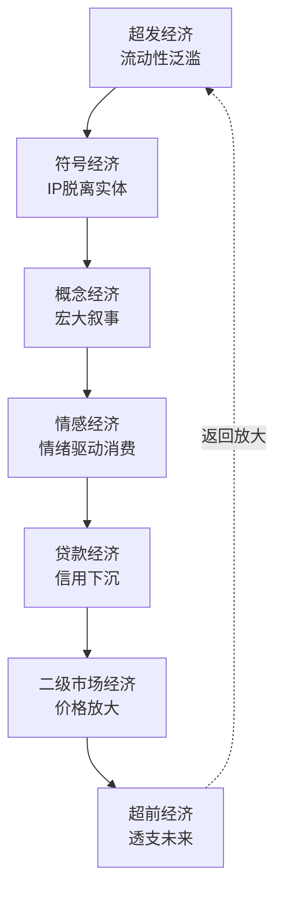

# 泛二次元文化工业的结构性危机：从符号生产到文明再生产的系统性分析

## ——基于马克思虚拟资本理论、异化理论与文化工业批判的综合研究

## 摘要

本文以马克思虚拟资本理论、异化理论及经济危机理论为方法论根基，整合法兰克福学派文化工业批判、鲍德里亚符号消费理论及当代数字资本主义批判的最新成果，对泛二次元文化工业的结构性危机进行系统性分析。研究揭示：泛二次元文化工业并非中性的“文化娱乐产业”，而是一套以符号生产为起点、以情感消费为中介、以金融化为扩张逻辑的复合装置。其运作依赖于三重结构性条件——社会原子化制造的“归属饥渴”为需求侧提供了持续动力；符号价值对使用价值的系统性替代为定价机制提供了脱离实体的锚点；资本增值逻辑对文化本身的再生产性改造为持续扩张提供了内在驱力。本文通过对七种经济症候（符号经济、情感经济、超前经济、概念经济、超发经济、二级市场经济、贷款经济）的逐层剖析，论证它们如何构成一个脱离实体经济基础的恶性正反馈循环。研究进一步揭示：这一循环的深层后果是“文化异化”——文化从“需要被学习和内化的精神遗产”转变为“可以被购买和消费的符号商品”，其最终指向是文明再生产能力的系统性瓦解。在此基础上，本文引入康德拉季耶夫长波周期、雅尔塔体系功能性瓦解及达利欧“五大力量共振”的分析框架，将泛二次元文化工业的结构性危机置于全球经济周期下行与地缘政治冲突加剧的宏观语境中，论证七重症候的正反馈循环如何在康波萧条期、三大周期叠加与雅尔塔体系崩溃的三重压力下，最终指向文明归零与历史清算的终局。本文的结论是：泛二次元文化工业的结构性危机不仅是经济层面的泡沫风险，更是文化再生产机制本身的危机——当“文化”被简化为可交易的符号时，文明便失去了其活的载体；当虚拟经济的过度膨胀在三大周期同步下坡的背景下持续加速时，其终局指向的不仅是经济泡沫的破裂，更是雅尔塔体系崩溃后新世界对旧经济形态的“基因原罪”式历史清算。

**关键词**：泛二次元；虚拟资本；符号消费；文化异化；七重症候；康德拉季耶夫周期；雅尔塔体系；文明再生产

## 一、引言：文化工业的结构性追问

### 1.1 问题的提出

2024年至2026年间，中国泛二次元文化领域呈现出一组引人注目的数据：泛二次元用户规模突破5亿，谷子经济市场规模逼近1700亿元，年增长率超过40%。与此同时，一枚物料成本不足2元的徽章在二手市场被炒至7.2万元，涨幅达36,000倍；139元的迪士尼玩偶被炒至9589元，涨幅近70倍。2025年1月至6月，全国至少有155家谷子店闭店或计划闭店，头部二次元连锁品牌也难以幸免——“潮玩星球”从153家骤降至104家，闭店49家；“暴蒙”从59家缩水至22家。

这组数据在同一时空并存，呈现出一种深刻的悖论：一边是市场规模的爆炸式增长与天价符号的频繁出现，一边是实体店铺的批量倒闭与市场信心的急剧收缩。这种“冰火两重天”的结构性分裂，并非简单的市场周期波动，而是泛二次元文化工业内在结构性矛盾的集中显现。

法兰克福学派的奠基人阿多诺与霍克海默在20世纪40年代就已指出，文化工业的出现是“技术和社会层面的分化和专业化”的必然结果，文化工业导致了文化产品的标准化、单一化、伪个性化的趋向。阿多诺直指靶心地指出资本主义社会文化消费趋热的倾向，认为文化产品商品化、标准化、技术化阻挡了文化的进一步发展，削弱了艺术对社会的批判警示意义，因而是一种伪升华、伪个性、伪艺术。在数字资本主义的语境下，这一诊断获得了新的验证形态——文化产品的商品化已从“内容层面”深入到了“符号层面”，从“生产层面”扩展到了“消费层面”，从“经济层面”渗透到了“主体建构层面”。

本文的核心论点是：**泛二次元文化工业的本质，是一套以符号生产为起点、以情感消费为中介、以金融化为扩张逻辑的复合装置**。它的“繁荣”并非源于文化价值的提升，而是源于三重结构性条件的耦合——社会原子化制造的“归属饥渴”为需求侧提供了动力；符号价值对使用价值的系统性替代为定价机制提供了基础；资本增值逻辑对文化本身的再生产性改造为持续扩张提供了逻辑。这三重条件的耦合，使泛二次元文化工业成为七种经济症候（符号经济、情感经济、超前经济、概念经济、超发经济、二级市场经济、贷款经济）的典型载体与微观缩影，而七重症候的恶性正反馈循环，最终指向的不仅是经济泡沫的破裂，更是文明再生产能力的系统性瓦解。

本文的分析将沿六个递进层次展开：第一，概念边界的窄化与锚定——作为认识论层面的前置操作；第二，文化工业的理论谱系——从法兰克福学派到数字资本主义的批判传统；第三，七种经济症候的识别及其恶性正反馈循环——作为经济层面的结构性诊断；第四，文化异化的多层面剖析——从“消费异化”到“文化本身的异化”；第五，康德拉季耶夫周期、雅尔塔体系崩溃与文明终局推演——作为历史尺度的终局判断；第六，结论——结构批判的路径与最终命题。

### 1.2 理论框架

本文以马克思的虚拟资本理论、异化理论和危机理论为方法论根基。

马克思在《资本论》第三卷中指出，作为并不存在的资本的名义代表、可以按照一定的利息率获取收益的商业票据、公共有价证券以及不动产抵押单等都是**虚拟资本**。马克思认为，所有的投机、泡沫乃至金融危机都是因为**虚拟资本过度发展**造成的。虚拟资本是货币借助于一系列的非生产性的增殖运动所带来的收入而形成的。虚拟经济脱离实体经济独立运行，已致当今全球经济频发金融危机。马克思虚拟资本理论揭示了这种现象背后的资本主义经济规律：当代金融资本的贪婪性所驱动的虚拟资本过度扩张和经济泡沫的膨胀，是金融危机的最深刻根源。

马克思在《1844年经济学哲学手稿》中揭示了异化劳动的四重规定：人与劳动产品的异化、人与劳动活动的异化、人与类本质的异化、人与人的异化。这一分析框架在数字时代的文化消费中获得了新的验证形态。马克思对异化理论的论述包含**劳动异化、需求异化、消费异化**三个方面含义。消费主义文化风靡全球的今天，这种消费异化再次凸显并主要表现为过于追求商品**符号价值**的虚假消费、深陷广告效应的盲目性消费、凸显个性差异的夸示性消费和追求潮流认可的时尚消费。

在此基础上，本文整合以下理论资源：

| 理论来源 | 核心概念 | 在本研究中的应用 |
|:---|:---|:---|
| 马克思《资本论》 | 虚拟资本、异化劳动、利润率下降 | 分析七重症候的生成机制与正反馈循环 |
| 法兰克福学派 | 文化工业、虚假需求、标准化生产 | 分析文化产品的标准化与商品化 |
| 鲍德里亚 | 符号消费、拟像、符号价值 | 分析IP符号脱离使用价值的定价机制 |
| 数字资本主义批判 | 情感劳动、情感消费主义 | 分析情感的商品化与异化 |
| 康德拉季耶夫周期理论 | 长波周期、波谷战争 | 分析经济周期下行与地缘冲突的关联 |
| 国际关系理论 | 雅尔塔体系、功能性瓦解 | 分析旧秩序崩溃与新格局未定的历史时刻 |

### 1.3 文化工业的理论谱系：从法兰克福学派到数字资本主义

在霍克海默和阿多诺看来，文化工业既是**技术理性对文化控制的结果，也是文化被商品化的结果**。根据市场的要求，迎合消费的需要，按照专业化的生产模式，把文化作为产品推销给大众，造就了一个大众文化的时代。它的结果是**文化的标准化和僵化**。

“文化工业”简而言之是一种自上而下利用现代技术手段将文化产品**标准化、商品化、娱乐化**的生产机制。尽管文化工业在某种程度上能填补人们空虚的精神世界，但其实质是**制造一种虚假的满足感并让人沉沦其中**。

法兰克福学派站在捍卫精英文化的立场上，对大众文化展开了不遗余力的批判。他们认为大众传媒生产的文化，其特征就是文化产品的标准化、批量化生产。这种大批量生产导致文化的全面异化。

在数字资本主义时代，文化工业的批判获得了新的维度。资本与数字技术的深度合谋催生了“数字景观消费”这一新型异化形态，它通过将日常生活卷入由影像与符号堆砌的巨型景观装置中，实现了对个体生活实践的全面控制。数字产品的逐步出现和符号崇拜的形成是资本生产逻辑的重要前提，大众传媒所主导的流行趋势是资本生产的重要标志，催生了以**符号消费**为基本特征的社会意识。

鲍德里亚提出，当代市场经济消费关系中存在的物只是人的本真需要之死的替代，商品交换中的需求其实为**意识形态制造的幻象**。在这种幻象之中，消费主体是不存在的，消费需求是不存在的，消费对象物也是不存在的。一切，只是一种符号象征差异系统中生成的幻象。二次元青年的亚文化实践已逐渐从单向度角色消费转向为消费与文化生产共生，消费端青年群体将角色解码为情感的符号载体进行消费——这一“产消合一”的实践形态，恰恰是文化工业在数字时代的新变种。

## 二、概念边界的窄化与锚定：认识论层面的前置操作

### 2.1 两种定义范式及其不可通约性

围绕“二次元”的话语实践，存在两种根本不同的定义范式。

第一种是**ACGN体裁定义**，将“二次元”等同于动画、漫画、游戏、轻小说的统称——这是一个以“呈现形式”为判准的中性定义。在这一范式下，“二次元”是一个中性的媒介范畴，其边界由呈现形式决定，不携带特定的价值判断。

第二种是**叙事语法窄化定义**，将“二次元”锚定为一组具体的文化元素——日式羁绊、拟似家庭、小个人主义、小团体主义、世界系、病娇/傲娇等——这是一个以“叙事语法”为判准的价值负载定义。

两种定义范式之间的差异，不是“宽窄”的程度差异，而是**定义逻辑的根本差异**。前者以“形式”为判准，后者以“语法”为判准。前者将“二次元”视为一个中性的形式范畴；后者将“二次元”视为一套携带特定价值观的叙事模板的集合。两者之间不存在可以互相换算的共同尺度——它们分别设定了不同的判定标准。

### 2.2 窄化定义的锚定操作

叙事语法窄化定义的操作，可以从五个维度加以理解：

| 窄化维度 | 具体锚定元素 | 功能 |
|:---|:---|:---|
| 叙事结构 | 日式羁绊、世界系 | 将“二次元”锚定为“逃避现实的退缩叙事” |
| 家庭观念 | 拟似家庭/伪家庭 | 锚定为“消解血缘家庭” |
| 价值观 | 小个人主义、小团体主义 | 锚定为“对抗集体主义” |
| 角色塑造 | 中二、病娇、傲娇 | 锚定为“非理性人格模板” |
| 经济定位 | 资本+周边+活动+暴利 | 锚定为“投机性符号泡沫” |

这种窄化操作的深层逻辑是：**它不是在对“二次元”进行描述，而是在对“二次元”进行审判**。每一组被锚定的元素都构成一条“罪状”，当这些罪状被累积呈现时，“二次元”便从一个可以进行中性讨论的文化领域，转化为一个已经被定罪的文化对象。

从话语分析的角度看，这一操作的本质是一种**战略性命名**——通过将“二次元”与“外来毒素”建立语义上的不可分割性，完成对其文化合法性的剥夺。这种命名策略不依赖于“论证”或“证据”的说服力，而依赖于重复锚定的累积效应：当“二次元”与“日式羁绊”“世界系”“病娇”等词汇在公共话语中被持续并置时，它们之间的语义绑定便逐渐被自然化为“理所当然”的关系。

### 2.3 概念驱逐的命名策略

窄化定义的进一步操作是**拒绝承认“二次元”与“国风内容”之间的任何关联**。这一操作的典型表现是：用“国产开放世界RPG”替代对特定作品的命名，用“年轻人文化社区”替代对特定平台的命名——刻意避免使用“二次元”一词。

这并非简单的“用词偏好”，而是一种**概念驱逐**策略。其深层逻辑是：如果“新国风二次元”这个概念能够成立，那就意味着“二次元”可以通过本土化改造获得正当性——而窄化定义所要防止的恰恰是这一点。其目标是使“二次元”这个概念本身从公共话语中被驱逐出去，而不是通过改造使其获得合法性。

这一策略揭示了话语权运作的深层逻辑：**最彻底的界定不是“给出一个定义”，而是“使定义行为本身变得不必要”** 。当“二次元”这个概念被驱逐出公共话语时，关于它的一切争论便自动终结——不是因为某一方在争论中胜出，而是因为争论的场域本身被取消了。

### 2.4 判定标准的升维

当概念层面的争论陷入无法决出胜负的僵局时，分析自动向更高维度移动——不再争论“二次元是什么”，而是追问“用什么标准来判断”。

这一追问的实质是：**从“定义内容”的竞争，转变为“判定标准”的竞争**。这一升维的关键操作，可以概括为对分析对象的三个递进层次的区分：

| 分析层次 | 对象 | 典型问题 | 升维的逻辑 |
|:---|:---|:---|:---|
| 表层/UI | 视觉呈现、音乐、画面 | “画面美不美？” | 可被任意替换的“皮肤” |
| 叙事语法层 | 故事如何被讲述、情感如何被驱动 | “故事如何展开？” | 决定“皮肤”之下是什么 |
| 认知架构层 | 主角是谁、为什么出发、如何行动 | “驱动故事的引擎是什么？” | 最底层的预设 |

升维的实质是：**不在同一层面上争论“谁对谁错”，而是把分析提升到更高维度，使前一层的争论在新的维度上自动失效**。当分析从“画面美不美”上升到“驱动画面的叙事引擎是什么”时，前一层的争论便不再重要——不是因为“画面美”是假的，而是因为它被判定为“不构成判断依据”。

### 2.5 “主角线”作为叙事底层的锚点

在叙事底层分析中，“主角线”被识别为最关键的锚点——它是驱动整个叙事的“根服务器”。这一判断基于对日式叙事传统的结构性特征识别。

日式叙事传统中，“主角”的设定具有高度模式化的特征：

| 特征 | 具体表现 | 意识形态预设 |
|:---|:---|:---|
| 主角来源 | 异世界、失忆、被放逐 | 预设“个体与原生秩序的疏离” |
| 核心动机 | 私人情感驱动——寻找亲人、守护同伴 | 预设“私人情感高于社会义务” |
| 力量来源 | 外部赋予——神、命运、天选 | 预设“精英天选论” |
| 世界关系 | 以个人好感度衡量 | 预设“关系本位” |
| 终极预设 | 个人情感决定世界命运 | 预设“唯心史观” |

这一预设与另一种叙事传统——可以将“家国情怀”作为精神原点、将个人命运嵌入家族与国家的宏观秩序之中——形成了根本性的差异。差异不在于“哪种更好”，而在于**它们预设了完全不同的“人与世界的关系”**。

对叙事底层的追问，其学术意义在于：**它使分析从“呈现形式”的层面，深入到“驱动引擎”的层面**。视觉符号、音乐风格、画面语言——这些都属于可以被任意替换的“表皮”——而驱动整个叙事展开的底层预设，才是决定一个文化产品属于哪个叙事传统的根本依据。

### 2.6 “表层符号”与“深层结构”的区分

这一分析范式的转换，其核心操作是 **“表层符号”与“深层结构”的区分**。

“表层符号”包括：汉服元素、古建筑风格、传统节日、非遗元素——这些是视觉层面可识别的文化标记。“深层结构”包括：叙事如何展开、情感如何被驱动、主角为何行动、世界如何被理解——这些是构成作品“灵魂”的底层逻辑。

这一区分的关键在于：**表层符号可以被任意替换而不改变深层结构**。一件“汉服”可以被换成“和服”或“西装”，而叙事引擎可以继续运转——因为驱动故事的不是“穿什么衣服”，而是“主角是谁、为什么出发、如何行动”。

因此，当一个作品使用中国视觉元素但其叙事底层承袭外来叙事传统时，它不应被简单归入“本土文化”的范畴——不是因为“中国元素”是假的，而是因为“中国元素”只是表层符号，而决定文化归属的深层结构并未改变。这不构成对“文化融合”的否定，而是对“融合发生在哪个层面”的精确追问。

从方法论的角度看，这一区分使得文化归属的判断从“表层元素的计数”转向“深层结构的识别”——不是问“有多少中国元素”，而是问“驱动这个作品的叙事引擎是什么”。这一方法论转换的意义在于：它使分析超越了“形式”层面的争论，进入了“结构”层面的考察。

## 三、七种经济症候的识别与结构性病变

### 3.1 虚拟经济脱离实体经济的理论框架

马克思在《资本论》第三卷中揭示了一个关键机制：虚拟资本“有它独特的运动”，可以脱离现实资本产生独立运动。马克思把现实资本的所有权证书即纸制复本叫做虚拟资本。纸制复本一旦作为独立的形态，就有了独立的运行，即虚拟经济。

20世纪80年代以来，经济自由化浪潮席卷全球，金融市场迅速发展，金融产品在世界范围内快速膨胀。全球经济逐渐走向金融化、虚拟化。虚拟经济一旦产生，就必然在一定程度上脱离实际资本产生独立运动。当虚拟经济的扩张速度持续超过实体经济的增长时，两者之间便形成了结构性失衡。虚拟经济脱离实体经济独立运行，是当今全球经济频发金融危机的深层原因。

马克思虚拟资本理论揭示了这一现象背后的资本主义经济规律：当代金融资本的贪婪性所驱动的**虚拟资本过度扩张和经济泡沫的膨胀**，是金融危机的最深刻根源。金融危机的实质就是虚拟资本泡沫的破灭，其形成的根本原因依然是资本主义生产方式的基本矛盾。

脱离了实体经济，虚拟经济就会变成“无根之草”，最终催生泡沫经济，造成经济的虚假繁荣。虚拟经济脱离实体经济的过度自我循环，会首先引爆金融危机，反过来导致实体经济物质再生产四环节统一性的周期性分裂。

在这一理论框架下，以下七种经济症候构成了虚拟经济脱离实体经济的结构性表现。

### 3.2 症候一：符号经济——价值与实体的彻底脱钩

**概念界定**

“符号经济”的核心特征在于：**交易的对象不再是实物或服务本身，而是承载着“意义”“叙事”“身份”的符号**。与实体经济相对应的是虚拟经济，是指基于信用、未来收益索取权等符号经济，以及这些符号经济的反复买卖。

在符号经济中，资产的价值不再由其物理成本、劳动时间或功能效用决定，而是由其所承载的“符号”决定。符号的过度繁荣会导致收入分配恶化、金融脆弱性增加乃至经济增长停滞等严重后果，并最终反噬自身。

鲍德里亚在《符号政治经济学批判》中指出，在消费社会与电子媒介时代，艺术已不再是对对象的表象，也不是主体内在本质的表现，而是一种**功能化符号体系制约下的消费行为**。商品交换中的需求其实为**意识形态制造的幻象**，一切只是一种符号象征差异系统中生成的幻象。在这一框架下，消费者购买的已不再是商品的“使用价值”，而是商品在符号系统中所占据的“位置”和所承载的“意义”。

**运作机制**

符号经济的运作可以归纳为四个递进环节：

**第一，去实体化。** 资产的价值与其物理载体脱钩。一枚物料成本不足2元的徽章，其价值不取决于铁片的成本，而取决于它所承载的“IP符号”。当“符号”的价值远远超过“实物”的价值时，去实体化便已完成。

**第二，叙事定价。** 符号的价格由一种“可信的叙事”所支撑——这种叙事通常是宏大的、难以证伪的、具有吸引力的。17世纪郁金香被赋予“贵族时尚”的象征意义；21世纪IP符号被赋予“角色情感连接”的价值内涵。当价格不再由“它值多少钱”决定，而由“人们相信它值多少钱”决定时，价格便失去了客观参照系。

**第三，脱离参考系。** 当符号经济的膨胀达到一定程度时，市场失去了对“合理价格”的判断基准。一枚铁片值7.2万元——这个价格既不由成本决定，也不由任何可测量的“价值”决定，而完全由“市场共识”决定。当价格脱离任何合理参考系时，唯一的定价机制便只剩下了“别人的出价”。

**第四，自我强化循环。** 符号价格上涨→财富效应吸引更多资本→更多资本推高价格→价格进一步上涨→财富效应扩大……这一循环在无外部干预条件下可以持续相当长的时间，但其唯一依赖的条件是“信任的持续存在”。一旦信任断裂，循环即向相反方向加速。

**系统性危险**

符号经济无度扩张的危险在于它形成了对实体经济的“反向控制”。当一个经济体中符号经济的利润率持续高于实体经济的利润率时，资金自然会从实体部门流向符号部门——形成“脱实向虚”的结构性趋势。追求尽可能多的高额利润是资本主义生产方式的绝对规律，资本的这种贪婪本性导致资产阶级不顾一切地扩张，特别是虚拟资本已不满足于作为生产资本的“从属”和“配角”的地位，逐步与实体经济脱节，并完成了由服务于生产资本向主宰生产资本的异化。

### 3.3 症候二：情感经济——情感的商品化与异化

**概念界定**

“情感经济”在此指**以情感共鸣为核心驱动力、以情感价值为定价基础的消费形态**。数字情感消费主义是消费主义在数字空间向情感领域无序扩张所衍生的特殊形态。作为一种异化的消费意识形态，数字情感消费主义呈现出数字情感消费产品资本化、消费行为致瘾化、消费内容庸俗化和消费体验虚幻化的现实样态。

情感消费主义是消费主义在资本逻辑支配下向情感领域渗透的新形态，并且在数字时代有了新的变化。数字技术的快速发展推动电商经济成为数字资本主义的重要形态，而情感消费作为其核心动力，正在深刻改变价值生产方式与社会关系结构。

**运作机制**

情感经济在三个层面发挥功能：

**第一，情感的商品化。** “情感物化”使情感沦为消费品和情感劳动的对象。在泛二次元消费中，消费者购买的已经不是商品的使用价值，而是“与角色之间的情感连接”。这种连接被量化为消费金额，情感本身成为可交易的对象。资本的逐利性驱动情感的商品化，平台流量逻辑加剧社会关系的工具化。

**第二，情感定价替代理性定价。** 在情感经济中，价格不再反映资产的内在价值，而是反映“情感共鸣”的强度。一件商品的定价依据不再是“它值多少钱”，而是“它能带来多少情感满足”。这种情感定价对理性定价的系统性替代，使得价格机制完全脱离了实体经济的基础。

**第三，情感消费的致瘾化。** 数字情感消费主义呈现出消费行为致瘾化的特征。通过“触发→行动→奖赏→更深的投入”的循环，情感消费形成了一种行为模式，使消费者在“快乐”的名义下持续投入。在“技术-资本”逻辑的双重作用下，获得“技术赋权”的粉丝群体仍旧被资本把持的符码逻辑裹挟，并通过大规模、高质量的情感劳动不断丰富“拟真拜物教”制造的审美幻象。

**异化后果**

在数字资本主义时代，情感消费正在引发四重异化：情感异化、消费异化、社会关系异化以及情感劳动者异化。数字资本主义通过算法个性推荐，使人的类本质以及劳动者自身相异化。数字资本主义情感劳动新异化的生成是数字平台资本化、私人情感商品化和“情感商品”私有化所导致的一种弊端显现。情感不再只是私人感受或互动氛围，而是在特定制度、市场与平台机制中被生产出来。

平台情感劳动作为依托数字平台生产售卖情感产品的新劳动形式，凭借其便捷性与隐秘性获得快速发展，却深陷平台资本积累的剥削逻辑，酝酿出**生产相对过剩、消费相对不足与情感交往异化**等多重危机。

### 3.4 症候三：超前经济——以未来支撑当下的时间错配

**概念界定**

“超前经济”在此指**以借贷和杠杆支撑当前消费与投资，将未来收入提前贴现到当期的经济行为模式**。2008年由美国次贷危机引发的全球金融危机，与美国的过度消费有着直接关系。次级贷款者今天花了明天的钱。正是这种不计后果的过度消费最终导致次级贷款盛行。

马克思早已揭示，透支消费不过是“寅吃卯粮”。超前消费、负债消费、低储蓄率——大家都在搞寅吃卯粮。美国全社会从政府到民众都崇尚超前消费与低储蓄，美国政府通过滥发美元毫无节制地膨胀其债务，使其债台高筑，形成了一个巨大的债务泡沫。长期的过度消费、超前消费，使美国国民和政府都背上了沉重的债务包袱。

**传导机制**

超前经济的传导链条可以归纳为以下环节：

| 环节 | 机制 | 后果 |
|:---|:---|:---|
| 有效需求不足 | 购买力有限，消费能力受限 | 生产相对过剩 |
| 信贷扩张 | 降息+金融创新刺激透支消费 | 债务链条扩张 |
| 资产贬值 | 利率上升/资产价格下跌触发违约 | 债务无力偿还 |
| 金融链条断裂 | 传导至整个信用体系 | 经济危机爆发 |

一旦政府提息或者资产贬值，因提前消费而产生的负债就会成为沉重的负担。当透支消费的债务普遍无力偿还时，造成金融链条断裂，社会的购买力紧缩，生产过剩的真相暴露无遗，危机由此发生。超前消费只是“寅吃卯粮”，靠透支未来支撑今天，只是为相对过剩的生产创造虚拟消费条件，不能从根本上消除危机。

**杠杆的放大效应**

金融杠杆率过高是超前经济的关键特征。美国金融机构片面追逐利润过度扩张，用极小比例的自有资金通过大量负债实现规模扩张。超前消费、负债消费、低储蓄率——大家都在搞寅吃卯粮。

### 3.5 症候四：概念经济——宏大叙事作为估值锚点

**概念界定**

“概念经济”指**以宏大、难以证伪的未来叙事为高估值提供合法性的经济形态**。概念经济是以得到公众认可的概念为依据而展开的经济活动的总和。

一个宏大且正确的叙事——当年的互联网、曾经的房地产、今天的AI——有着无与伦比的吸引力。它描绘了激动人心的未来，让理性的估值模型显得碍手碍脚。市场不再交易公司的现实盈利能力，而是交易一个关于未来的故事。

**运作机制**

概念经济的特征可以归纳为：

**第一，叙事的高度抽象性与难以证伪性。** “互联网将改变一切”“AGI将重塑一切行业”“IP宇宙将覆盖一切文化消费”——这些叙事足够宏大，在可预见的未来内难以被证伪，因此为任意高的估值提供了“合法性”空间。市场的驱动力量往往不是基本面，而是故事。任何一个泡沫，本质上都是多重叙事的共同作用。这种宏大叙事天然带有不可证伪性，从而赋予了资产极高的估值溢价。

**第二，对基本估值指标的失效。** 在概念经济中，传统的估值指标全部失效。替代它们的是一种“未来利润的贴现”逻辑，而这一贴现的倍数完全取决于叙事的说服力。

**第三，概念溢价的普遍化。** 1995年至2001年间，全球互联网公司过度投机，估值远超实际价值，最终泡沫破裂导致市场暴跌、大量企业倒闭。叙事逻辑完全一致：当年互联网是“颠覆全行业、不看盈利、不看落地、只看故事想象力”。

### 3.6 症候五：超发经济——流动性过剩与泡沫膨胀

**概念界定**

“超发经济”指**货币供给量持续超过实体经济的实际产出需求，导致流动性过剩、资产价格膨胀的经济状态**。虚拟经济脱离实体经济独立运行，致当今全球经济频发金融危机。

马克思虚拟资本理论揭示了这一机制：虚拟资本的过度扩张和经济泡沫的膨胀，是金融危机的最深刻根源。金融危机的实质就是虚拟资本泡沫的破灭。危机的根源恰恰是原来资产杠杆化，消除泡沫，危机前的货币超发、流动性泛滥。货币多了，流入资产市场就会形成资产泡沫，流入消费市场就会造成通货膨胀。

**传导机制**

超发经济通过以下传导链条推动危机积累：

央行降息/货币超发→流动性过剩→资产价格膨胀→财富效应放大→更多资金流入资产市场→实体经济空心化→通胀压力累积→央行被迫加息→资产价格崩塌→金融危机爆发

虚拟经济具有三大市场特征：**强调心理预期的资本化定价、追逐货币利润的最大化、独特的“单一非对称性”运行方式**。这些特征使得虚拟经济在脱离实体经济后，极易形成自我膨胀的泡沫。

### 3.7 症候六：二级市场经济——风险的放大与传染

**概念界定**

“二级市场经济”在此指**资产脱离一级市场后在二级市场被反复交易、价格独立定价的经济形态**。与实体经济相对应的是虚拟经济，是指基于信用、未来收益索取权等符号经济，以及这些符号经济的反复买卖。

**风险放大机制**

二级市场经济的风险放大机制可以归纳为以下步骤：

| 步骤 | 机制 | 后果 |
|:---|:---|:---|
| 第一步：初级资产膨胀 | 资产价格脱离基本面持续上涨 | 价格泡沫开始形成 |
| 第二步：资产证券化蔓延 | 资产被包装为可交易的证券产品 | 风险从一级市场转移至二级市场 |
| 第三步：杠杆放大 | 金融机构通过负债实现规模扩张 | 每一单位资本支撑数十倍风险敞口 |
| 第四步：衍生品爆炸式增长 | 金融衍生产品规模急剧膨胀 | 局部风险放大为系统性风险 |
| 第五步：系统性崩溃 | 基础资产价格下跌触发连锁反应 | 金融危机全面爆发 |

美国次贷危机提供了一个完整的案例：美国金融机构片面追逐利润过度扩张，用极小比例的自有资金通过大量负债实现规模扩张。金融创新很多，但超前消费、负债消费、低储蓄率，大家都在搞寅吃卯粮。马克思在《资本论》第三卷中早已指出，随着虚拟资本日益表现为代替实体资本行使货币职能，社会财富形式也必将表现为以有价证券为代表的虚拟资本的积累扩张，资本主义社会活动也日益呈现为单一金融投资活动。

### 3.8 症候七：贷款经济——宏观调控与主体实践的断裂

**概念界定**

“贷款经济”在此指**国家通过扩大消费信贷来刺激内需的宏观经济政策导向**。消费信贷的扩张是超前经济的执行端——超前消费的“理念”必须通过贷款的“实践”才能实现。

**断裂的表现**

宏观调控的目标与年轻一代的实践之间正在发生深刻断裂：

| 维度 | 宏观调控意图 | 青年实践 | 断裂的性质 |
|:---|:---|:---|:---|
| 消费信贷 | 扩大信贷刺激内需 | 95后主动销卡、消费贷余额持续下降 | 政策意图与行为选择的背离 |
| 杠杆使用 | 鼓励适度负债消费 | “零负债”成为追求目标 | 鼓励与回避的背离 |
| 信用扩张 | 信用下沉驱动消费 | 主动去杠杆 | 扩张与收缩的背离 |

国家金融与发展实验室的数据显示，居民部门杠杆率从2024年一季度的62.3%降至2026年一季度的59%。今年一季度居民部门债务增速为-0.4%。居民短期消费贷款从2025年末的94900.77亿元降至2026年5月末的87869.54亿元，前5个月减少约7031亿元。住户贷款减少6314亿元，其中短期贷款减少6942亿元。2024年以来，个人贷款增长放缓带动居民部门杠杆率持续下降。

与此同时，“零负债青年”正在成为网络热门词汇——这些人并非高收入或财富自由，而是不背负房贷、车贷、网络贷款的“三无”人士。部分青年试图摆脱负债、走向新人生。中国居民家庭一直在去杠杆，消费债务/可支配收入比率已从5年前的102.2%降至2024年底的100.9%。

这种“高负债率”与“主动去杠杆”并存的现象，揭示了一个结构性困境：制度设计的“正向功能”与主体实践的“反向叙事”之间的不对称。青年群体主动“去杠杆”——拒绝长期滚动负债——构成了对这一传导链路的反向切断。

### 3.9 七重症候的恶性正反馈循环

七重症候并非独立运作，而是构成一个**层层嵌套、相互强化的正反馈循环**：

这一循环的每一环都在为下一环提供“燃料”：

| 环节 | 输出 | 为下一环提供 |
|:---|:---|:---|
| 超发经济 | 流动性过剩 | 符号经济的“燃料” |
| 符号经济 | 价值脱钩的IP符号 | 概念经济的“载体” |
| 概念经济 | 宏大叙事 | 情感经济的“合法性” |
| 情感经济 | 非理性消费 | 贷款经济的“需求” |
| 贷款经济 | 信用扩张 | 二级市场经济的“基础资产” |
| 二级市场经济 | 价格放大 | 超前经济的“财富幻觉” |
| 超前经济 | 未来透支 | 返回超发经济的“需求信号” |

这一循环的关键在于 **“绑架”** ——它不是“市场自发”的产物，而是资本通过“制造混乱→提供方案→利润驱动再混乱”形成的恶性正反馈。混乱越大，利润越高；利润越高，资本越有动力制造更大的混乱。当循环运转到一定程度时，系统进入“锁死”状态——任何单一环节的干预都会被系统吸收为运转燃料。这正是马克思所揭示的：虚拟经济的过度扩张和经济泡沫的膨胀，是金融危机的根源。

谷子经济的“冰火两重天”——市场规模飙升至1689亿元的同时，2025年上半年全国至少有155家谷子店闭店——正是七重症候正反馈循环在单一产业中的完整预演。

## 四、文化异化：从次级蔓延到源头

### 4.1 异化理论的谱系与扩展

马克思在《1844年经济学哲学手稿》中揭示了异化劳动的四重规定。异化理论在马克思的理论体系中占有十分重要的位置。自《1844年经济学哲学手稿》问世以来，异化理论开始系统性地得到学界的广泛重视，它逐步走出马克思尤为关注的劳动领域，**科技异化、文化异化、消费异化**等理论层出不穷。

马克思对异化理论的论述包含**劳动异化、需求异化、消费异化**三个方面含义。消费主义文化风靡全球的今天，这种消费异化再次凸显并主要表现为过于追求商品**符号价值**的虚假消费、深陷广告效应的盲目性消费、凸显个性差异的夸示性消费和追求潮流认可的时尚消费。

在泛二次元文化消费中，这四重异化呈现为以下对应形态：

| 马克思的四重异化 | 在泛二次元文化消费中的对应形态 |
|:---|:---|:---|
| 人与劳动产品的异化 | 消费者购买的是“谷子”，但其价值不来自劳动，而来自IP符号——符号的价值与劳动时间彻底脱钩 |
| 人与劳动活动的异化 | “为爱发电”取代了“劳动创造价值”——消费行为被重新编码为“爱的表达” |
| 人与类本质的异化 | 人的类本质是“自由的、有意识的创造性活动”——但在泛二次元消费中，主体被“角色化” |
| 人与人的异化 | 真实的人际关系被“以物为媒”的交往所替代 |

从物的消费到符号消费的转变，是西方马克思主义消费社会理论揭示的核心趋势。法兰克福学派不断抨击资本主义社会中的种种消费行为，发现虚假需求和消费异化现象。鲍德里亚和布迪厄等进一步发现了消费社会被符号所操纵。消费异化现象割裂了消费与劳动之间的根本联系。

### 4.2 消费异化的四重表现

基于马克思异化理论视角对消费行为的分析，可以发现消费过程中普遍存在**自主性弱化、符号依附与品牌操控**等现象，具体表现为符号化消费、非理性消费和虚拟化消费。

数字景观消费这一新型异化形态，通过将日常生活卷入由影像与符号堆砌的巨型景观装置中，实现了对个体生活实践的全面控制。其异化逻辑表现为：主体的自我认同沦为景观的附庸。

在泛二次元领域，消费异化呈现出四个递进层次：

| 层次 | 从 | 到 | 机制 |
|:---|:---|:---|:---|
| 第一层 | 因为喜欢而购买 | 购买来证明喜欢 | 消费成为“热爱”的证明 |
| 第二层 | 获得情感满足 | 通过展示获得身份认同 | 展示替代体验 |
| 第三层 | 主体在消费 | 消费定义主体（我买故我在） | 消费成为身份建构的唯一方式 |
| 第四层 | 真实的人际连接 | 以物为媒介的符号交往 | 人与人的关系被物与物的关系中介 |

在“谷子”消费中，这种异化表现得尤为明显。一枚物料成本不足2元的徽章被赋予远超其物理价值的意义——不是因为徽章本身具有价值，而是因为它在符号系统中占据了一个位置。消费者购买的已不是物品本身，而是物品所承载的“与角色的情感连接”这一符号意义。

### 4.3 “消费文化”与“学习文化”的结构性对立

七重症候的深层后果是**文化本身的异化**——文化从“需要被学习和内化的精神遗产”转变为“可以被购买和消费的符号商品”：

| 维度 | 学习文化 | 消费文化 |
|:---|:---|:---|
| 核心动作 | 内化（理解、体悟、批判） | 外化（购买、收藏、展示） |
| 人与文化的关系 | 人是文化的**主体** | 人是文化的**客体** |
| 时间性 | 长期主义 | 即时满足 |
| 评价标准 | “你有没有真正懂？” | “你有没有最新款？” |
| 社会功能 | 培养“文化人” | 培养“消费者” |
| 与劳动的关系 | 文化需要通过劳动（学习）来获得 | 文化可以通过购买（消费）来获得 |

马克思指出，消费异化现象割裂了消费与劳动之间的根本联系。当“你买了多少文创”取代“你读了多少经典”成为衡量一个人“文化素养”的显性标准时，文化便从“需要努力攀登的高峰”变成了“可以随手购买的快消品”。

这一替代的隐蔽之处在于：**消费文化提供了一种“捷径幻觉”——它让你觉得“我已经拥有了它”，从而取消了“我需要理解它”的必要性**。当一个人购买了敦煌IP联名款的丝巾时，他可能觉得“我已经拥有了敦煌文化”——而实际上，他拥有的只是一件印有敦煌图案的商品。文化的“拥有”被替换为商品的“占有”，文化的“理解”被替换为消费的“完成”。

### 4.4 异化从“次级”蔓延到“源头”

文化异化的更深层后果是：**当“传统文化”也被纳入这套“文创”逻辑时，异化便从“次级”蔓延到了“源头”** ——文化本身被异化为符号商品，而不仅仅是某些具体的文化产品被商品化。

| 层级 | 内容 | 异化状态 | 异化的形式 |
|:---|:---|:---|:---|
| 第一层：泛二次元 | 日式二次元内容 | **高度异化**——文化被简化为消费符号（角色/羁绊/IP） | 文化产品被商品化 |
| 第二层：文创产品 | 以传统文化为素材的文创产品 | **中度异化**——“传统文化”被商品化为“国风元素” | 传统文化元素被符号提取 |
| 第三层：文化本身 | “文化”这一概念 | **深度异化**——文化被视为“可消费的商品” | 文化与社会的关系被重写 |

法兰克福学派认为，文化工业不仅指的是文化被纳入工业化的轨道之中，而且使得文化被商品化。这种流行文化取代古典文化，造就了人的心智的简单化。当“传统文化”也被纳入这套“文创”逻辑时，它便不再是“需要被学习和传承的精神遗产”，而是“可以被购买和消费的符号素材”——异化的不是具体的文化产品，而是文化与社会之间的“生产关系”。

文化工业在某种程度上能填补人们空虚的精神世界，但其实质是**制造一种虚假的满足感并让人沉沦其中**。这种虚假满足感的核心机制在于：它让消费者在“消费”的同时，产生了“我在传承文化”的道德满足感。这种双重满足——消费的快感加道德的优越感——使得文化异化不仅不被抵抗，反而被主动拥抱。

### 4.5 “污染源”的准确定位

如果“文创”和“二次元”共享同一套异化逻辑（将文化转化为可交易符号），那么“污染源”就不是“二次元”本身，而是**那个让一切文化（无论本土还是外来）都被迫进入“文创化”轨道的系统结构**——即资本逻辑对“文化”本身的生产性改造。

| 可能的“污染源”定位 | 是否能够解释观察到的现象 | 解释力评估 |
|:---|:---|:---|
| “特定外来文化入侵” | ❌ 不能解释为何本土文化也被文创化 | 片面 |
| “文化产业本身” | ✅ 可以解释外来和本土文化的双重异化 | 中等 |
| **“资本逻辑+文化商品化机制”** | ✅ 可以解释一切文化如何被纳入同一套消费体系 | **最强** |

当“文创”成为一切文化进入公共领域的“标准入口”时，任何文化——无论是外来二次元还是本土非遗——都被迫进入同一套“符号提取-商品包装-金融化交易”的流水线。在这个意义上，异化的“污染源”不是某个具体的外来文化，而是那个让一切文化都变成“文创”的系统结构——即资本逻辑对“文化”本身的生产性改造。

### 4.6 异化的终极后果：文明再生产的断裂

当文化被简化为“可交易的符号”时，文化失去了“活的载体”：

| 文化原来的存在方式 | 文创化之后 | 后果 |
|:---|:---|:---|
| 存在于**人**的记忆、技艺、情感、实践中 | 存在于**物**的符号、设计、IP中 | 文化不再通过“人”来传承，而是通过“物”来流通 |
| 通过**师徒/亲子**关系传递 | 通过**市场**交易流通 | 传承让位于交易 |
| 需要**终身学习**来维持 | 可以**一次性购买**来拥有 | 深度让位于广度 |

| 文明再生产所需的条件 | 消费文化的运作 | 是否满足 |
|:---|:---|:---|
| 文化需要被**理解** | 文化被购买、被展示 | ❌ |
| 文化需要被**内化** | 文化被占有、被消费 | ❌ |
| 文化需要代际**传递** | 文化在市场中流通 | ❌ |
| 文化需要与**人**绑定 | 文化与**物**绑定 | ❌ |
| 文化需要**时间**来积累 | 文化可**即时**消费 | ❌ |

**当文化不再需要“人”来承载时，文明便失去了它的“活的载体”** 。这正是“文化异化”的终极后果。

## 五、文明终局推演：康德拉季耶夫周期、雅尔塔体系崩溃与历史清算

### 5.1 康德拉季耶夫周期与“波谷战争”的历史规律

康德拉季耶夫长波理论揭示了资本主义经济发展中存在约50至60年的长期波动。每一轮康波周期都由一次颠覆性技术革命驱动，分为回升、繁荣、衰退、萧条四个阶段。自18世纪以来，全球已经历五轮完整的康波周期：第一波（1780s-1840s）以蒸汽机与纺织机械为核心；第二波（1840s-1890s）以铁路与钢铁为核心；第三波（1890s-1940s）以电力与化工为核心；第四波（1940s-1990s）以汽车、石油与计算机为核心；第五波（1990s-2025s）以信息技术与互联网为核心。

康波周期理论的一个关键发现是“波谷战争”现象——每一轮新旧技术引领的周期交接阶段，几乎都会出现战争频发的情况。康波萧条期的尾部常常爆发标志性的“波谷战争”。这些战争并非偶然，而是旧秩序矛盾积累到临界点的必然释放。康波见底之前，“是社会经济矛盾最为激烈的时期”。

当前，全球正处于第五轮和第六轮康波周期交替的“波谷时刻”。信息技术引领的康波周期已在2020年左右进入萧条期，而AI技术正处于孕育阶段。2025-2026年是第五轮萧条期的尾声，也是第六轮新周期（以人工智能、新能源、生物科技为核心）回升期的起点。

这一时刻之所以关键，是因为康波周期的萧条期往往伴随着三个特征：**债务出清、地缘冲突加剧、旧技术体系红利耗尽**。旧的范式已不足以支撑增长，新的范式尚未全面启动——这一“战略模糊期”恰好是地缘政治冲突最易爆发的窗口。学界将康波周期与权力转移理论相结合，指出由于收入水平较低的国家基于不同算法会有不同的经济地位，这种差别是造成近年来国际冲突性行动加剧的重要原因。

### 5.2 三大周期同步下坡与地缘政治冲突的共振

康波周期并非唯一驱动地缘冲突的周期力量。基钦周期（库存调整，2-4年）与朱格拉周期（设备投资更新，7-11年）的同步下行，与康波周期的萧条期形成了“三周期叠加共振”。

2026年，全球经济正处于一个关键的转折点。债务周期拐点意味着利率下行是长期趋势；地缘格局重塑使“供应链安全”优先，区域化定价成为趋势。三周期叠加共振，将从经济、金融与地缘政治三个层面共同塑造全球格局。大国地缘政治经济竞争成为主要矛盾，“经济安全化”取代“经济全球化”成为主要经济体政策取向。

在这一背景下，多重风险和问题集中爆发。地缘政治频发与结构性冲击两大因素重叠，导致全球经济向下螺旋加剧，全球政治和经济秩序陷入进一步混乱。美以伊对抗、俄乌冲突、中东多方缠斗彼此联动，再加上贸易、科技、资本、地缘影响力的全方位博弈，已经织成一张密不透风的大网。

达利欧明确指出，国际秩序一旦回归“丛林法则”，国家间往往出现五种类型的冲突甚至战争，即**经济、科技、资本、地缘政治并最终可能迈向军事冲突**。这五种冲突的递进链条，恰是经济危机向世界大战传导的微观机制。达利欧警告称，全球正濒临“大循环”的临界点，五大力量（货币与债务周期、内部秩序、国际地缘政治、自然灾害与科技变革）同步作用推升风险，未来两到三年将是“特别危险的时期”。他明确锁定2026年中期选举后至2028年总统大选前为“特别危险的时期”。

### 5.3 雅尔塔体系的功能性瓦解

雅尔塔体系是二战后以联合国和两极格局为支柱的国际秩序框架。然而，当前这一体系正面临“功能性瓦解”。

其瓦解表现在多个层面：

**第一，联合国体系的效能衰减。** 2025年2月联合国大会通过的支持乌克兰决议中，美国与俄罗斯、朝鲜等投了反对票，中国、印度等投了弃权票。这一投票结构标志着二战后所建立的雅尔塔体系正面临崩溃。大国在联合国框架内的协调机制正在失效。

**第二，排他性军事集团的扩张。** 大国地缘政治竞争的回归，正将世界推入新的全球性军备竞赛，并伴随着急剧上升的核风险。雅尔塔体系的“功能性瓦解”意味着二战以来维持了80年的大国协调机制正在失效。从雅尔塔会议（1945年）至今已80年——相比之下，一战后巴黎和会仅让世界稳定了不足20年。

**第三，旧秩序的终结与新格局的未定。** 有人认为“雅尔塔体系”正面临崩溃，新的多极或数极联盟即将产生。这一产生过程将是动荡不安的，不确定因素上升将扰乱既有的政治和经济秩序。排他性军事集团的扩张与大国地缘政治竞争的回归，将世界推入新的全球性军备竞赛。

**第四，多战区冲突同步加剧。** 达利欧明确指出，我们已经走到周期的关键阶段——多战区冲突同步加剧。大国对立、民族主义、军备竞赛、经济压力、地区冲突和国际规则失效——现在世界格局与两次世界大战前有相似性，世界处于一个危险的十字路口。俄罗斯外长谢尔盖·拉夫罗夫表示，世界正倒退到一个没有国际法、一切都完全靠武力解决的阶段：“没有国际法，没有凡尔赛体系，没有雅尔塔体系，什么都没有。有力量的地方就是硬道理”。

### 5.4 从经济危机到世界大战的历史逻辑

两次世界大战的发生都与经济危机有着密不可分的关系。大战是敌对的帝国主义国家集团之间利益的矛盾达到了破坏性的爆发。经济危机是制度的内在矛盾和为维持这一制度所采取的策略的复合物。

经济危机向世界大战传导的机制可以归纳为以下环节：

| 环节 | 机制 | 历史验证 |
|:---|:---|:---|
| 经济危机潜伏 | 实体经济与虚拟经济失衡、债务持续攀升 | 1929年大萧条→1939年二战；2008年金融危机→地缘冲突加剧 |
| 民粹主义泛起 | 经济议程受阻，社会转向保守排外，归咎于外部 | 两次世界大战间欧洲民粹主义浪潮 |
| 国际秩序失序 | 大国协调失效，强权政治回归 | 1930年代国联失效；当前联合国机制效能下降 |
| 军事冲突升级 | 经济、科技、资本、地缘政治冲突最终迈向军事冲突 | 达利欧指出的“五种冲突的递进链条” |

马克思虚拟资本理论揭示了这一传导的深层机制：虚拟资本的过度扩张和经济泡沫的膨胀，是金融危机的最深刻根源。而金融危机一旦爆发，便会在经济、社会、国际三个层面引发连锁反应。1929年大萧条与1939年二战之间的十年间隔，1937年“罗斯福衰退”与全面战争升级之间的两年间隔——每一次经济危机的深化，都在为更大规模的冲突积蓄能量。

### 5.5 文明归零与“基因原罪”的历史清算

如果上述传导链条完成，世界将面临雅尔塔体系崩溃后的“文明归零”状态。在这一状态下，新世界将重新审视旧世界的经济形态与社会结构——而泛二次元文化工业所代表的虚拟经济、符号经济、情感经济、超前经济、概念经济、超发经济、二级市场经济与贷款经济，将被新世界作为“旧世界为何崩溃”的“罪证”加以清算。

这一清算的逻辑基于三重判断：

**第一，时间性判断。** 新世界将追问：为什么在危机前夜，最聪明的大脑、最充裕的资本、最宝贵的时间，被投入到了“让玩家抽卡”“设计羁绊”“炒卖徽章”之中，而非投入到解决“卡脖子”技术、重建社会纽带、应对气候变化等真正事关文明存续的议题上？

**第二，结构性判断。** 新世界将追问：为什么一个社会在最需要“学习文化”（培养能够深刻理解自身文明、在复杂环境中保持定力的高素质国民）的时候，却被“消费文化”（培养能够持续为IP符号买单的用户）所系统性替代？为什么“你买了多少”取代了“你懂了多少”成为衡量一个人文化素养的显性标准？

**第三，终局性判断。** 新世界将追问：为什么一个文明在面临三大周期同步下坡、地缘冲突加剧、雅尔塔体系功能性瓦解的历史性挑战时，其年轻一代却在虚拟世界中寻求“羁绊”与“归属”，而非在真实世界中准备应对即将到来的风暴？

这三个追问汇聚为一个终极判断—— **“基因原罪”** ：新世界将认定，虚拟经济的过度扩张与消费文化的全面渗透，构成了旧世界在面对系统性危机时“丧失了面对现实的勇气和集体行动力”的根本原因。旧世界被钉上耻辱柱，不是因为它的技术不够先进、它的财富不够充裕，而是因为它在危机前夜用“消费”替代了“学习”，用“符号”替代了“实体”，用“虚拟的满足”替代了“真实的准备”。

### 5.6 终局推演的不可逆性

**当上述推演链条完整展开时，泛二次元文化工业便不再是一个“需要被讨论的文化对象”，而是“将被历史清算的旧世界遗物”——无论中国在三战中胜利与否，虚拟经济所代表的消费主义文化异化，都将被新世界认定为“旧世界崩溃的基因原罪”。这一判决的效力不来自任何人的主观意志，而来自历史周期律、经济危机传导机制与文明再生产逻辑的内在必然性。**

经济危机向世界大战的传导机制，已被历史反复验证。1929年大萧条与1939年二战之间的十年间隔，1937年“罗斯福衰退”与全面战争升级之间的两年间隔——每一次经济危机的深化，都在为更大规模的冲突积蓄能量。当前，三大周期同步下坡、雅尔塔体系功能性瓦解、虚拟经济规模远超实体经济——这些条件的同时满足，意味着系统性危机的临界点正在逼近。而泛二次元文化工业，作为七重症候的微观缩影与消费文化异化的典型样本，将在新世界的历史审判中承担它作为“旧世界症状”的代价。

当追问抵达“三战归零后，你会被如何审判”时，所有的辩护都已失去了立足之地——不是因为辩护的内容被驳倒了，而是因为辩护者被逐出了“可以进行辩护”的法庭。而“基因原罪”这一终局判决的不可推翻性，恰恰构成了四层升维逻辑的最终闭环。

## 六、结论：结构批判的路径与最终命题

### 6.1 主要发现

本文从概念边界、文化工业理论、七种经济症候、文化异化与文明终局推演五个维度，对泛二次元文化工业进行了结构性分析。主要发现如下：

**第一，概念边界的窄化与锚定构成认识论层面的前置操作。** 围绕“二次元”的争论，并非文化观念的分歧，而是关于“谁有权定义”“用什么标准判定”的深层权力争夺。通过将概念窄化为一组可被污名化的文化元素，并通过命名替换完成概念驱逐，泛二次元文化工业的文化合法性被系统性地剥夺。

**第二，泛二次元文化工业是法兰克福学派“文化工业”批判在数字时代的典型样本。** 文化产品的标准化、商品化、伪个性化——阿多诺与霍克海默在20世纪40年代揭示的文化工业特征——在泛二次元领域获得了新的验证形态。数字技术与资本逻辑的深度合谋，使文化产品从“需要被理解和内化的精神对象”转变为“可以被标准化生产和消费的商品”。

**第三，七种经济症候构成一个脱离实体经济基础的恶性正反馈循环。** 超发经济、符号经济、概念经济、情感经济、贷款经济、二级市场经济、超前经济——七者耦合，形成自我强化、不可自刹车的高维正反馈循环。这正是马克思所揭示的虚拟资本过度扩张和经济泡沫膨胀的当代表现。马克思认为，所有的投机、泡沫乃至金融危机都是因为虚拟资本过度发展造成的。

**第四，这一循环的深层后果是“文化异化”从“次级”蔓延到“源头”。** 当“文创”成为一切文化进入公共领域的“标准入口”时，任何文化都被迫进入同一套“符号提取-商品包装-金融化交易”的流水线。异化的“污染源”不是某个具体的外来文化，而是那个让一切文化都变成“文创”的系统结构——即资本逻辑对“文化”本身的生产性改造。

**第五，文化异化的终极后果是文明再生产能力的系统性瓦解。** 当文化不再需要“人”来承载时，文明便失去了其活的载体。文化不再通过“教与学”的链条传递，而是通过“买与卖”的链条流通；下一代获得的是“文化商品”而非“文化理解”。

**第六，康德拉季耶夫长波周期、三大周期同步下坡与雅尔塔体系功能性瓦解的三重叠加，构成了泛二次元文化工业结构性危机的历史尺度终局。** 2025-2026年是第五轮康波萧条期的尾声，雅尔塔体系正面临崩溃，达利欧警告未来两到三年将是“特别危险的时期”。在这一宏观背景下，七重症候的正反馈循环不仅指向经济泡沫的破裂，更指向新世界对旧经济形态的“基因原罪”式历史清算。

### 6.2 结构批判的三条路径

基于以上分析，本文提出结构批判的三条路径：

**第一，从“定义之争”走向“结构分析”。** 围绕“二次元是什么”的争论，本质上是一种消耗战。真正有效的批判必须穿透“定义”的表层，进入对文化工业结构性运作的系统分析——追问“这套系统如何运转”“它的动力来源在哪里”“它的后果指向何方”。

**第二，从“文化批判”走向“经济-文化-文明复合分析”。** 文化现象从来不是孤立存在的。泛二次元的“繁荣”与七重症候的正反馈循环是同一结构的两个面。文化批判如果不能同时揭示其经济基础与文明后果，便只能停留在表层。马克思虚拟资本理论的当代意义正在于此：它使我们能够穿透文化现象的迷雾，看到其背后的资本积累逻辑。

**第三，从“次级批判”走向“源头批判”。** 当“传统文化”也被纳入这套“文创”逻辑时，批判便不能只盯着“二次元”这个具体的文化领域。真正需要追问的是：那个让一切文化（无论本土还是外来）都沦为可交易符号的系统结构——它如何运作、如何自我强化、如何可能被打破。

### 6.3 最终命题

> **泛二次元文化工业的本质，是一套以符号生产为起点、以情感消费为中介、以金融化为扩张逻辑的复合装置。它的“繁荣”不依赖于文化价值的提升，而依赖于社会原子化制造的“归属饥渴”、符号价值对使用价值的系统性替代、以及资本增值逻辑对文化本身的再生产性改造。**
>
> **七种经济症候——符号经济、情感经济、超前经济、概念经济、超发经济、二级市场经济、贷款经济——构成一个脱离实体经济基础的恶性正反馈循环。这一循环的每一环都在为下一环提供“燃料”，最终指向经济泡沫破裂的同一终局。正如马克思所揭示的：虚拟资本的过度扩张和经济泡沫的膨胀，是金融危机的最深刻根源。脱离了实体经济，虚拟经济就会变成“无根之草”，最终催生泡沫经济，造成经济的虚假繁荣。**
>
> **这一循环的深层后果是“文化异化”从“次级”蔓延到“源头”。当“文创”成为一切文化进入公共领域的“标准入口”时，任何文化都被迫进入同一套“符号提取-商品包装-金融化交易”的流水线。异化的不是具体的文化产品，而是文化与社会之间的“生产关系”。文化工业在某种程度上能填补人们空虚的精神世界，但其实质是制造一种虚假的满足感并让人沉沦其中。**
>
> **在康德拉季耶夫长波周期萧条期的尾部、三大周期同步下坡、雅尔塔体系功能性瓦解的三重宏观压力下，七重症候的正反馈循环不仅是经济层面的泡沫风险，更是文明尺度上的系统性危机。当虚拟经济的过度膨胀在三大周期同步下坡的背景下持续加速时，其终局指向的不仅是经济泡沫的破裂，更是雅尔塔体系崩溃后新世界对旧经济形态的“基因原罪”式历史清算。**
>
> **当文化不再需要“人”来承载时，文明便失去了它的“活的载体”。而这，才是结构批判的真正起点：不是追问“二次元是什么”，而是追问“为什么一代人需要通过占有‘物’的符号来确认自身存在”——当这个问题被提出时，批判便从“定义之争”走向了“结构分析”，从“文化批判”走向了“文明反思”。**

## 参考文献

[1] 马克思. 资本论（第三卷）[M]. 北京：人民出版社，2004.

[2] 马克思. 1844年经济学哲学手稿[M]. 北京：人民出版社，2000.

[3] 阿多诺，霍克海默. 启蒙辩证法[M]. 渠敬东，曹卫东，译. 上海：上海人民出版社，2006.

[4] 鲍德里亚. 符号政治经济学批判[M]. 夏莹，译. 南京：南京大学出版社，2009.

[5] 虚拟经济与实体经济的关联性——主要资本主义国家比较研究[J]. 中国社会科学，2021(10). 

[6] 马克思虚拟资本理论及其当代价值[J]. 万方数据，2025.

[7] 1866年危机笔记与马克思的虚拟资本理论探赜[J]. 万方数据，2025.

[8] 日本学者基于MEGA版《资本论》对资本主义经济危机的新探索[J]. 教学与研究，2025.

[9] 《资本论》中资本增殖虚实悖论与资本主义的发展困境[J]. 万方数据，2025.

[10] 技术赋权、情感劳动与消费异化——虚拟偶像的建构逻辑、现实困境及其治理研究[J]. 鞍山师范学院学报，2024.

[11] 后现代消费文化与日本角色消费模式的建构[J]. 东岳论丛，2015.

[12] 二次元青年角色“产消合一”实践转向研究——基于数据库消费理论分析[J]. 北京青年研究，2026.

[13] “中之人”的数字进化与真我异化——马克思异化劳动理论视阈下的数字解读[J]. 江南论坛，2025.

[14] CGS-NDI专题报告：AI繁荣叠加地缘冲击 巧合还是注定？[R]. 2026.

[15] 美伊战争：康波萧条期的最后一战，还是新周期的黎明前夜？[N]. 网易，2026-03-04.

[16] 康波周期拐点资产配置策略[EB/OL]. 知乎专栏，2026-04-29.

[17] 大类资产月报：康波萧条期开启下半场[R]. 东方财富，2026-03-06.

[18] 钱言：最新联大投票结果 is 未来重新划分世界的风向标[N]. 香港中通社，2026-05-23.

[19] 战火延绵四载 全球秩序重塑[N]. 香港东方日报，2026-02-28.

[20] 美国暗中拆解雅尔塔体系，日本冲在最前[N]. 网易，2026-07-11.

[21] 俄外长：世界倒退到一个没有国际法而武力才是硬道理的阶段[N]. 网易，2026-03-23.

[22] 戴利欧示警 5力量推升投资风险[N]. 工商时报，2026-05-05.

[23] 桥水基金创始人达利欧发出最新警告[N]. 网易，2026-05-07.

[24] 2026年像极了1936年？事实恐非如此[N]. 中国网，2026-03-24.

[25] 国家金融与发展实验室. 宏观杠杆率季报[R]. 2024-2026.

[26] 居民短期消费贷款数据[R]. 中国人民银行，2025-2026.

[27] CBNData. 谷子经济行业报告[R]. 2026.

[28] 瞰趋势：闭店浪潮之下，“谷子经济”正在自救[N]. 中国新闻网，2025-10-31.

[29] 谷子经济大洗牌：闭店潮与资本潮并行的结构分化[N]. 证券之星，2026-07-31.

[30] 半年超155家谷店闭店，谷子经济的下一个“救命IP”何时出现？[N]. 36氪.