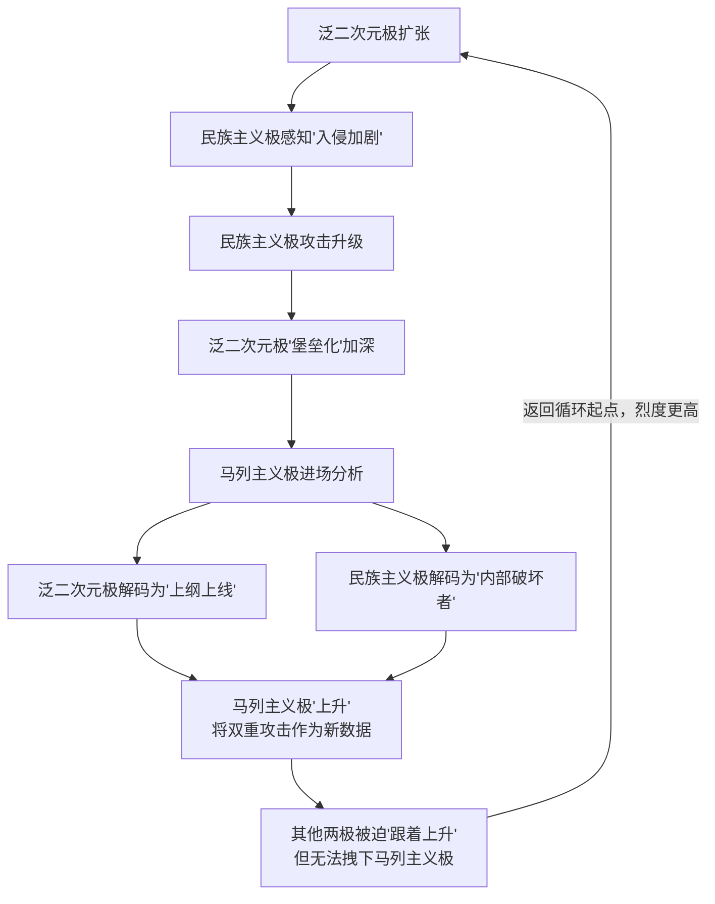
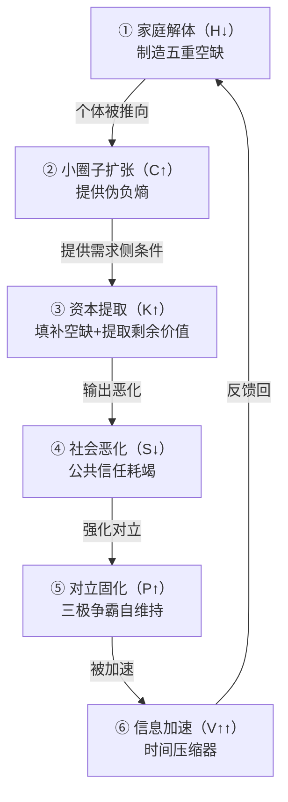

# 社会熵增定律：数字时代社会系统的正反馈崩溃动力学

## ——基于六变量耦合模型的原子级系统性分析

## 摘要

本研究基于系统动力学与马克思主义政治经济学，提出“社会熵增定律”的理论框架，用以解释数字时代社会系统从有序走向无序的结构性机制。研究发现，社会熵增并非单一因素驱动的线性过程，而是由**家庭（H）、小圈子（C）、资本（K）、社会（S）、对立（P）、信息传播速度（V）** 六组核心变量构成的正反馈循环系统。六变量之间的耦合关系满足乘积效应——任一变量的恶化都会通过正反馈循环放大其他变量的恶化速度，使系统熵增呈现指数级加速。

本研究通过原子级分析揭示了六组变量各自的结构性位置、运作机制与相互耦合关系。**社会原子化与社会达尔文主义高压为系统提供初始“燃料”** ——家庭解体制造了五重结构性空缺（情感、归属、意义、未来、尊严），为后续的熵增循环提供了需求侧条件；**资本逻辑通过五重空缺的识别与填补为系统提供“持续动力”** ——资本并非熵增的“原因”，而是熵增的“燃料泵”，它将社会结构已经制造出来的空缺转化为可持续的剩余价值提取；**小圈子作为“伪负熵”为系统提供“加速器”** ——表面提供归属幻觉，实则通过内部冲突、对立、鄙视链、氪金等机制加速熵增；**信息传播速度的指数级提升为系统提供“时间压缩器”** ——将原本以“代”为单位的熵增循环压缩至以“天”或“周”为单位；**三极争霸（泛二次元极vs民族主义极vs马列主义极）为系统提供“自维持机制”** ——每一极的存在都依赖于另外两极的“在场”，使系统获得了无需外部输入即可持续运转的能力。

系统在每一轮循环中都被更深地锁定，直至抵达 **“宏观不可回归临界点”** ——社会失去自我修复能力，文明再生产发生结构性断裂。2025年全国1%人口抽样调查显示，家庭户均人口已降至2.52人；2025年出生人口仅792万，总和生育率跌破1.0；泛二次元用户规模突破5.26亿；网络视听用户人均单日使用时长已达201分钟——这些数据共同指向一个正在逼近临界点的系统状态。

**关键词**：社会熵增定律；正反馈循环；家庭解体；资本逻辑；信息传播速度；宏观不可回归临界点

## 一、引论

### 1.1 问题的提出：两组数据的结构性关联及其深层含义

2026年，当代中国社会呈现出一组在经验层面高度相关、在主流叙事中却被分别论述的数据。这组数据的并存并非偶然，而是同一社会系统在不同输出端口上的同步表现。

**第一组数据：社会纽带的系统性瓦解。**

2025年全国1%人口抽样调查显示，全国共有家庭户51465万户，家庭户人口为129685万人，平均每个家庭户人口为**2.52人**。这一数字较1953年第一次人口普查时的4.43人缩减了近一半，首次跌破3人关口。全国家庭户均人口的持续下降，标志着家庭作为社会基本单元的结构性收缩已经进入不可逆阶段。

民政部数据显示，2025年全国结婚登记676.3万对，离婚登记274.3万对——每3对结婚的就有1对最终走散。与2024年相比，结婚登记增加了65.7万对，增长10.76%，但这一“回升”是在2024年610.6万对的历史低点基础上的有限反弹，远未改变长期下降趋势。2025年，全国独居家庭超过1.25亿户，单人户占比超过25%，预计2030年中国独居人口数量或将达1.5亿至2亿人，独居率或将超过30%。

2025年全国人口为140545万人，较上年末减少339万人，人口自然增长率为-2.41‰——这是中国人口连续第四年负增长。全年出生人口仅792万人，较2024年下降162万人，创1949年以来新低。总和生育率已滑落至约1.0-1.09之间，不到更替水平2.1的一半。有研究估算，2025年中国的总和生育率约为0.97-0.98。

南京大学2025年调研显示，18岁以下青少年中，63.1%与亲戚“基本不联系”；中国社科院社会学研究所对4016位年轻人的调查显示，超过八成的年轻人与父辈亲戚一年只联系一两次，21.6%的人“基本不走动”。浙江中医药大学2025年的调研进一步显示，83.7%的18-35岁年轻人与叔伯姑舅等父辈亲戚年均联系仅1-2次，30岁以下群体中，41.3%除了春节几乎不主动联系亲戚。

**第二组数据：虚拟经济的同步膨胀。**

全国动画相关企业已超过19.8万家，泛二次元用户规模接近5.8亿，核心用户超过1.2亿。我国泛二次元用户规模从2017年的2.1亿激增至2025年的5.26亿。泛二次元周边市场规模预计在2025年达到6521亿元。曾经被视为“圈地自萌”的二次元文化，已渗透到社会生活的方方面面。

2025年12月，网络视听用户人均单日使用时长达到**201分钟**——每个用户平均每天有超过3小时沉浸在视频使用中。其中微短剧表现尤为突出，人均单日使用时长达到129分钟，同比增长28.4%，已超越长视频跃居细分业务第二位。中国短视频用户规模达10.68亿人，占网民整体的95.1%，人均单日使用时长达156分钟。典型新媒体平台APP去重活跃用户规模达11.49亿，月人均使用时长3367.5分钟（约56小时）——这意味着每个活跃用户平均每天在数字世界沉浸近2小时。

**第三组数据：精神健康的危机。**

《柳叶刀-区域健康：西太平洋》2025年发布的数据显示，中国儿童青少年精神疾病整体患病率达**19.3%**，青少年抑郁症状检出率为15%-25%（高中生20%-25%），较2012-2022年上升约5%-10%。《2025中国精神心理健康蓝皮书》显示，小学生抑郁检出率为10%，初中生为30%，高中生高达40%。14-18岁人群心理障碍检出率为24.6%，其中重度抑郁比例达7.4%。首次确诊情绪障碍的平均年龄仅为13.41岁。

国家卫健委最新数据显示，我国18岁以上人群中，约有2.7亿人正经历不同程度的心理困扰（占人口总数的19.1%），其中抑郁、焦虑等常见精神障碍患病率达16.6%，较十年前增长约78%。北京大学第六医院流行病学调查显示，我国成人心理障碍终生患病率已达16.6%（约2.3亿人），其中抑郁症患者超9500万，焦虑障碍患者约5000万。我国抑郁障碍终身患病率达6.8%，焦虑障碍达7.6%，两者共病率高达70%。

**本文的核心论点是：这三组数据是同一台机器——社会熵增的正反馈循环系统——在不同输出端口上同时输出的结果。** 家庭解体制造了五重结构性空缺（情感、归属、意义、未来、尊严）；虚拟经济精确识别并填补了这些空缺；而填补的过程本身进一步加剧了家庭的解体、社会信任的耗竭和个体精神健康的恶化。这是一个自我强化的闭合回路——每一轮循环都使下一轮循环以更高的烈度运转。

### 1.2 为什么需要用“熵增”来描述社会系统

“熵”（entropy）是热力学中用以度量系统无序程度的物理量。热力学第二定律指出，孤立系统的熵总是自发增加，即系统总是从有序走向无序。本研究借用这一概念来描述社会系统的演化方向，基于以下理由：

**第一，社会系统具有“自发趋向无序”的内在倾向。** 正如物理系统在没有外部能量输入时会自发走向热平衡（最大熵状态），社会系统在没有持续的“负熵输入”（如制度创新、文化传承、共同体建设）时，也会自发走向信任耗竭、凝聚力下降和秩序瓦解。涂尔干在《自杀论》中已经揭示：当社会整合机制弱化时，社会失范（anomie）便会自发产生——这是一种社会层面的“熵增”。

**第二，社会系统的“无序”具有不可逆性。** 物理系统的熵增是不可逆的——破碎的杯子不会自动复原。社会系统的信任耗竭同样具有不可逆性：一旦公共信任被摧毁，重建需要数代人的时间；一旦家庭功能瓦解，重新培育需要漫长的代际努力。这种不可逆性使“熵增”成为比“衰落”更精确的描述——衰落可能被逆转，熵增在缺乏外部负熵输入时则不可逆转。

**第三，社会系统的“无序”具有累积性。** 每一次社会冲突、每一轮信任耗竭、每一场对立升级，都在社会系统中留下“熵的印记”。这些印记不会自动消失，而是累积在系统的“记忆”中，使下一轮熵增的启动门槛更低、烈度更高。这正是正反馈循环的本质特征。

**第四，社会系统的“有序”需要持续的负熵输入。** 正如生物体需要不断从外界摄取负熵（食物、信息）来维持自身的有序结构，社会系统也需要持续的负熵输入——制度建设的能量、文化传承的韧性、共同体建设的努力——来对抗熵增的自发趋势。当负熵输入不足或中断时，系统便会不可逆地走向无序。

因此，“社会熵增”不是物理学的比喻，而是一个具有严格对应关系的系统动力学概念——它描述的是社会系统在缺乏足够负熵输入时，自发从有序走向无序的不可逆过程。

### 1.3 理论框架

本研究整合以下理论资源：

| 理论来源 | 核心概念 | 在本研究中的应用 |
|:---|:---|:---|
| 系统动力学 | 正反馈循环、路径依赖、临界点 | 构建六变量耦合模型 |
| 涂尔干《自杀论》 | 失范、社会整合 | 分析社会原子化与共同体瓦解 |
| 鲍曼《流动的现代性》 | 液态现代性、个体孤独化 | 分析社会纽带的系统性断裂 |
| 霍夫施塔特《美国生活中的社会达尔文主义》 | 制度化竞争 | 分析社达高压的心理后果 |
| 马克思《资本论》 | 剩余价值、异化劳动、虚拟资本 | 分析资本的五重空缺提取机制 |
| 法兰克福学派 | 文化工业、虚假需求 | 分析情感商品化与符号消费 |
| 鲍德里亚 | 符号消费、拟像、符号价值 | 分析IP符号脱离使用价值的定价机制 |
| 传播学 | 回音室效应、群体极化、情绪传染 | 分析信息传播速度的加速机制 |

### 1.4 核心概念界定

| 概念 | 定义 |
|:---|:---|
| **社会熵增** | 社会系统从有序走向无序的不可逆过程，表现为公共信任耗竭、社会凝聚力下降、文明再生产断裂 |
| **正反馈循环** | 系统输出进一步强化输入，使系统偏离平衡而非恢复平衡的动力学机制 |
| **五重结构性空缺** | 社会原子化与社达高压制造的情感、归属、意义、未来、尊严五个维度的系统性匮乏 |
| **宏观不可回归临界点** | 社会熵增达到某一阈值后，社会系统的自我修复能力永久丧失的状态 |
| **伪负熵** | 表面提供“有序”体验、实则加速系统熵增的文化-经济形态（如小圈子、情感消费） |
| **负熵输入** | 社会系统维持有序状态所需的外部能量——包括制度建设、文化传承、共同体建设等 |

## 二、微观基础层：家庭的解体——抗熵单元的结构性失效

### 2.1 为什么家庭是社会的最小抗熵单元：四重功能的系统论分析

家庭之所以构成社会熵增的第一道防线，是因为它在四个维度上发挥着不可替代的“负熵输入”功能。这四个维度不是并列的，而是构成一个从“个体存在”到“社会整合”的递进系统。

**第一，情感整合功能：对抗“情感熵增”的第一道屏障。**

涂尔干在《自杀论》中通过实证数据论证了一个核心命题：个体的心理状态不是个人特质的函数，而是社会组织结构的函数。涂尔干发现，在那些社会整合程度较高的群体中——已婚者、有子女者、宗教信仰者——自杀率显著低于社会整合程度较低的群体。这一发现的意义在于：它证明了情感状态不是“个人的事”，而是“社会的事”。

家庭作为最基础的社会整合机制，通过日常的情感互动、仪式性团聚和代际纽带，为个体提供了一种“被看见、被接纳、被需要”的存在感。在家庭中，个体不需要“证明”自己的价值——他/她作为家庭成员本身就具有不可替代的价值。这种“无条件的接纳”是对抗社会达尔文主义高压下“有条件的爱”（“你必须优秀才配被爱”）的最根本屏障。

当家庭功能完整时，个体即使在外部世界遭受挫折——职场失利、社交受挫、竞争失败——也能在家庭中获得情感的“缓冲”和“修复”。家庭就像一个“情感缓冲器”，吸收外部冲击，防止其直接击穿个体的心理防线。当家庭功能失效时，外部冲击直接作用于个体，情感熵增便失去了最后的屏障。

**第二，意义生成功能：对抗“意义熵增”的代际传递机制。**

在传统社会中，“传宗接代”“光宗耀祖”等家庭叙事为个体提供了“为什么而活”的根本答案。家庭通过代际传承，将个体的生命嵌入一个超越个体生命周期的更长的时间序列之中——个体的意义不局限于其自身的生命历程，而是通过子女、孙辈延续到未来。这种“意义的代际传递”构成了一种“意义负熵”——它持续向个体的精神世界输入“有序”的力量，防止其陷入意义真空。

涂尔干指出，当个体失去了与超越自身的更大整体的连接时，便会陷入“利己型自杀”的风险——这正是意义熵增的极端表现。家庭提供的代际意义框架，使个体的生命获得了超越个体死亡的“时间纵深”。当家庭功能失效时，这一“时间纵深”被压缩为“此刻”的平面——个体失去了“我从哪里来、将到哪里去”的叙事框架，意义熵增便不可遏制地发生。

**第三，风险缓冲功能：对抗“生存熵增”的社会安全网。**

家庭是社会系统中最低层的“风险共担机制”。失业、疾病、老年——这些个体无力独自承担的风险，在家庭内部通过代际互助和横向支持得以稀释。单位制解体后，家庭的这一功能变得更加关键——当个体被推向市场独自面对生存风险时，家庭成为最后的“安全网”。

从系统论的角度看，家庭的风险缓冲功能是一种“负反馈调节”机制：当外部冲击（如失业）导致个体收入下降时，家庭内部的互助机制自动启动（配偶增加工作时间、动用家庭储蓄、寻求亲属支持），将冲击对个体生存的影响降到最低。当家庭功能失效时，这一负反馈调节机制便不复存在——外部冲击直接作用于个体，生存熵增便急剧加速。

**第四，社会化训练功能：对抗“关系熵增”的底层操作系统。**

家庭是个体学习“如何与他人相处”的第一个实验室。在家庭中，个体习得信任、妥协、责任和爱的基本模式——这些模式构成了个体进入更广阔社会时的人际交往“底层操作系统”。家庭提供的是一种“关系负熵”——它防止个体在进入社会时陷入“不知道如何与他人建立连接”的关系熵增状态。

当家庭功能完整时，个体携带的“关系负熵”使其能够在更广阔的社会场域中建立健康的、可持续的人际连接。当家庭功能失效时，个体进入社会时携带的是“关系熵增”的初始条件——不知道如何信任、不知道如何妥协、不知道如何建立深层连接——这使他在社会场域中更容易被孤立、更容易陷入原子化状态。

有学者将传统家庭描述为“人类文明对抗熵增的最小负熵单元”——它“不是一个简单的居住组合”，而是承载着情感连接、意义传承与社会整合的多重功能。当家庭这一“最小抗熵单元”失效时，社会便失去了最底层的负反馈调节器——熵增便从“微观”蔓延到了“宏观”。

### 2.2 家庭解体的三重机制及其为什么

家庭解体并非单一原因所致，而是三重机制长期作用的结构性结果。这三重机制分别作用于家庭的结构层面、功能层面和关系层面，形成一个“三重打击”的系统性瓦解过程。

**第一，结构层面的收缩：为什么家庭规模持续缩小。**

1953年第一次人口普查时，户均4.43人；2025年降至2.52人——72年间缩减了将近一半。推动这一变化的力量是多重的：

**计划生育政策**从根本上改变了家庭的人口再生产模式。独生子女政策（1979-2015）使家庭从“多子女”模式转变为“独生子女”模式，家庭内部的横向关系（兄弟姐妹）被系统性消除。这一变化不仅改变了家庭的人口结构，更改变了家庭的功能结构——独生子女家庭失去了兄弟姐妹之间的情感支持网络和养老责任的横向分担机制。

**城镇化率从1982年的21%飙升到2025年的65%以上**，使大量人口脱离乡土与宗族网络。费孝通在《乡土中国》中描述的“差序格局”——以血缘和地缘为纽带的社会关系网络——在城镇化进程中被系统性瓦解。个体从“嵌入”乡土社会网络的状态变为“悬浮”于城市陌生人社会的状态。

**晚婚不婚趋势**使家庭组建的年龄窗口推迟、意愿降低。2025年初婚年龄已接近30岁，终身不婚率持续上升。**离婚率上升**使已有家庭频繁解体——2025年离婚登记274.3万对，每3对结婚的就有1对最终走散。**老龄化导致的独居老人增加**使单人户比例持续上升——全国独居家庭超过1.25亿户，单人户占比超过25%。

**结构收缩的后果**：家庭规模的缩小意味着家庭内部的“关系密度”降低。在一个4-5人的家庭中，个体面临的是多层次的代际和横向关系——与父母、与兄弟姐妹、与祖辈——每一层关系都提供不同维度的情感支持和角色体验。而在一个2-3人的核心家庭中，关系维度大幅缩减，家庭的“抗压能力”也随之下降。当家庭只剩下夫妻二人或单亲加子女时，任何一方的挫折都会直接波及整个家庭——没有“缓冲层”，没有“替代支持”。

**第二，功能层面的弱化：为什么家庭不再“全能”。**

单位制的解体使家庭失去了“单位”这一重要的外部支持网络。计划经济时代的“单位”包办住房、医疗、教育、养老等功能——个体通过单位获得身份、福利、住房、医疗、养老，单位不仅是工作场所，更是情感归属、社会地位和人生意义的全部来源。20世纪90年代市场化改革后，这些功能被推向市场，但市场并未能提供同等水平的保障。单位制解体后形成的制度真空，至今未被其他社会组织形式有效填补。

城市化使家庭脱离宗族与乡土网络，从“嵌入”状态变为“悬浮”状态。在传统乡土社会中，家庭不是孤立存在的——它嵌入在一个由宗族、邻里、乡党构成的多层次支持网络之中。当家庭遇到困难时，可以从这一网络中获取支持。在城市化之后，家庭变成了“原子化”的孤立单元——它不再嵌入任何支持网络。

数字化使家庭成员之间的物理共处被虚拟连接所替代——家人坐在一起却各自刷手机的场景，已成为当代家庭生活的常态。2025年12月，网络视听用户人均单日使用时长达到201分钟——这意味着每个家庭成员每天有超过3小时沉浸在数字世界中，而不是与家人互动。家庭的“共处时间”被大幅压缩，“共处质量”被严重稀释。

**功能弱化的后果**：家庭从“多功能共同体”退化为“单功能居住单元”。当家庭不再承担情感支持、社会化教育、养老保障、风险共担等多重功能时，它便不再是一个“共同体”，而只是一个“居住单位”。家庭成员之间的关系也从“有机团结”（涂尔干的概念——基于相互依赖和共同价值的团结）退化为“机械团结”（基于相似性和共同身份的团结）——进而退化为“没有团结”。

有研究者指出，新自由主义思潮中包含的极端个人主义、经济理性、功利主义等价值取向，“已渗透社会生活的多个方面”，对现代家庭伦理带来冲击：“极端个人主义造成家庭‘原子化’危机、经济理性的泛化渗透引起家庭核心价值的瓦解”。

**第三，关系层面的原子化：为什么家庭关系变成了“契约”。**

家庭关系从“情感共同体”向“契约关系”转变。婚姻不再是“两个家族的结合”，而日益成为“两个人的契约”。原子化婚姻的特征是“两个人像两个独立的原子，凑在一起搭伙过日子，没有以前那种‘一家人’的牵绊”。

这一转变的深层原因是多重的。**个体化进程**使个体越来越将自我实现置于家庭义务之上——当家庭义务与自我实现发生冲突时，越来越多的人选择后者。**经济独立**使个体不再依赖家庭生存——女性经济独立使婚姻从“生存需要”变为“情感选择”，而情感选择天然具有更大的不确定性。**文化变迁**使“离婚”从“耻辱”变为“正常”——社会对离婚的接受度大幅提高，使婚姻的退出成本大幅降低。

**关系原子化的后果**：当家庭关系被理解为“契约”而非“命运共同体”时，关系的维系便不再具有超越性的约束力。一旦契约的“成本-收益”计算失衡——一旦一方觉得“不划算”——关系便面临解体的风险。这正是离婚率持续攀升的深层逻辑——不是“人心变了”，而是“关系的底层逻辑变了”。

### 2.3 微观案例：出钱vs出力的不可通约性及其深层结构

家庭解体的最典型微观表现，是赡养责任分配中“出钱”与“出力”的不可通约性。

在多子女家庭中，赡养老人涉及的博弈成本随子女数量呈指数增长——3个子女时博弈关系为3对，5个子女时为10对。子女数量的增加不仅不分散矛盾，反而因“谁多谁少”的争议而加剧矛盾。出钱的子女认为“我一个月给两千，比你跑两趟医院有价值得多”；出力的子女认为“我请假陪护、半夜送急诊，这两千块能买得到吗”。双方使用的判准体系不同——“出钱”以货币为计量单位，“出力”以劳动时间为计量单位——两者之间不存在可以互相换算的共同尺度。这种不可通约性使家庭协商陷入僵局，怨气持续积累，信任持续耗竭。

叠加“重男轻女”这一传统结构性不公——儿子被默认继承家产但承担较少日常照料，女儿被要求“多出力”但被排除在财产分配之外——家庭内部的熵增从“起点”就已经被设定。女儿在财产分配中被边缘化，在赡养责任中却被要求“多出力”——这种“权利与义务的不对称”是家庭内部永恒的矛盾源泉。当女儿质疑“凭什么”时，得到的回应往往是“这是传统”——这个“传统”，就是家庭内部不可追问的“元叙事”。

这一案例揭示了家庭解体的微观动力学：**不可通约的价值标准 + 指数级增长的博弈成本 + 初始的结构性不公 = 怨气积累、信任耗竭、共同体瓦解。**

### 2.4 家庭解体的系统性后果：五重结构性空缺的暴露

家庭解体的直接后果是**五重结构性空缺**的暴露与扩大：

| 空缺维度 | 家庭原本的功能 | 家庭解体后的状态 | 数据佐证 |
|:---|:---|:---|:---|
| **情感空缺** | 家庭成员之间的情感连接与支持 | 原子化个体缺乏情感归宿 | 城市居民“经常感到孤独”>40% |
| **归属空缺** | 家庭作为“我是谁”的身份锚点 | 个体失去最基本的归属单元 | 超八成年轻人“断亲” |
| **意义空缺** | 代际传承提供“为什么而活”的答案 | 生命意义需要从外部寻找 | 18-35岁“生活无意义”>35% |
| **未来空缺** | 子女提供未来预期与代际延续 | 未来图景变得不确定 | 生育率0.97-0.98 |
| **尊严空缺** | 家庭中的被承认与被尊重 | 尊严需要通过其他途径获取 | 一线劳动者“不被尊重”>45% |

**家庭解体的本质，是“抗熵单元”的结构性失效。** 当家庭不再能提供情感慰藉、归属确认、意义生成、未来预期和尊严承认时，五重空缺便暴露于市场之中——而市场，已经准备好了填补方案。

## 三、中观代偿层：小圈子的扩张——伪负熵的加速器

### 3.1 为什么小圈子是“伪负熵”：理论定位与概念辨析

当家庭解体后，五重空缺暴露于市场。个体迫切需要替代性的归属与情感来源。小圈子——泛二次元社群、游戏公会、饭圈、同人创作圈等——应运而生，表面提供“归属感”和“情感连接”，实则构成一种 **“伪负熵”** 形态。

**“伪负熵”概念的理论定位**：

“伪负熵”不是一个道德判断，而是一个结构性判断。它描述的是这样一种文化-经济形态：它在**表面**上提供了“有序”的体验——明确的圈层规则、清晰的成员身份、即时的情感反馈——使人产生“我找到了归属”的错觉；但在**深层**运作中，它通过内部冲突、对立、鄙视链、消费成瘾等机制，**实际上在加速系统的熵增**。

正如有研究所指出的，传统家庭是“对抗熵增的最小负熵单元”，而“技术与资本正在上演一场‘数字圈地运动’”——小圈子正是这场圈地运动的产物。它不是对家庭功能的“补充”，而是对家庭功能的“替代”——但这种替代是“伪”的，因为它不具备家庭的核心抗熵功能。

**为什么小圈子是“伪”的——三重结构性分析**：

**第一，它不是真正的共同体，而是消费共同体。** 传统家庭的归属是**无条件的**、基于血缘和长期共同生活的——你不需要“证明”你是家庭成员，你生来就是。小圈子的归属是**有条件的**、基于消费行为和圈层认同的——你必须持续消费（购买周边、参与活动、遵守圈规）来“证明”你的归属。一旦停止消费或偏离圈层规范，归属即被取消。这种“有条件的归属”恰恰复制了社达高压的逻辑——你必须“足够好”（足够消费、足够忠诚）才配被接纳。

**第二，它不生产意义，只提供意义的替代品。** 传统家庭通过代际传承提供“活着的意义”——你的生命通过子女、孙辈延续到未来，你是一个更大叙事的一部分。小圈子通过“为爱发电”“守护梦想”等叙事提供意义的**幻象**——这种意义是消费驱动的（“你花了多少钱就等于你有多爱”），而非生命驱动的。它是一种“即插即用”的意义——不需要长期投入、不需要深度理解、不需要代际传承，只需要消费。

**第三，它不增强社会连接，反而削弱社会连接。** 小圈子通过时间占有（日均屏幕使用时间超过3小时）、注意力捕获（算法推送、即时反馈、成瘾设计）和社交替代（虚拟圈层互动替代真实人际交往），将个体从真实社会关系中抽离，使其现实社交能力持续退化。小圈子的“连接”是一种“浅连接”——它提供表面的互动感，却无法提供真正的情感支持、安全感和归属感。

### 3.2 小圈子内部熵增的四项机制及其动力学

小圈子的内部熵增通过四项机制运作，这四项机制形成一个自我强化的闭合回路：

**机制一：冲突的常态化——为什么小圈子总是在“撕”。**

小圈子内部持续存在“出警”“挂人”“开除二籍”等排异行为。研究表明，排异敏感度在年龄分布上呈左偏态分布，峰值集中于初中生年龄段（12-15岁），该年龄层占消解性话语使用率的61.7%，排异响应速度中位数为3-8分钟。这意味着小圈子的“边界巡逻”不是偶发的，而是结构性、自动化的日常运作。

冲突的常态化消耗了成员的注意力资源和情感能量，使其无暇顾及真实世界的连接建设。每一次“出警”都是一次“身份确认”——通过排异他人来确认“我是谁”“我属于哪里”。这种身份确认的代价是：圈层内部持续处于“备战”状态，成员的注意力被持续锁定在“谁越界了”“谁不够纯”的监视任务上。

**机制二：对立的制造——为什么小圈子需要“敌人”。**

小圈子需要“外部敌人”来维持内部团结——没有敌人就制造敌人。泛二次元社群中，A型（情感-共鸣语法）成员占比超过60%临界阈值后，系统发生不可逆的“相变锁定”，B型（逻辑-理性语法）被系统性地标记为“异类”并清除。这种“敌我二分”的运作逻辑，使小圈子的内部凝聚力建立在对外排斥的基础之上——排斥越激烈，内部越团结；内部越团结，排斥越激烈。

“鄙视链”是这一机制的日常操作形式——通过建构层级化的身份焦虑（“全图鉴党”高于“强度党”高于“XP党”；“核心粉”高于“路人粉”），小圈子制造了持续的向上焦虑，使成员在“升级”的幻象中持续投入。鄙视链的本质是**将社会达尔文主义的竞争逻辑从现实世界复制到虚拟世界**——在现实中被社达碾压的个体，在小圈子中重新体验了一遍社达，只是竞争的维度从“学历/收入”变成了“氪金量/纯度”。

**机制三：鄙视链的层级化——为什么小圈子总是“分三六九等”。**

消费层级决定身份层级——“全图鉴党”高于“强度党”高于“XP党”；“核心粉”高于“路人粉”。鄙视链制造了持续的向上焦虑，使成员在“升级”的幻象中持续投入。这种层级化的本质是**将社会达尔文主义的竞争逻辑从现实世界复制到虚拟世界**——在现实中被社达碾压的个体，在小圈子中重新体验了一遍社达，只是竞争的维度从“学历/收入”变成了“氪金量/纯度”。

鄙视链的运作形成了一个“向上看齐”的动力机制：每一个层级的人都渴望升入更高层级，而升入更高层级的唯一途径是**更多的消费**。这使得鄙视链不仅是一种“身份排序”，更是一种“消费驱动机制”——它将社会比较焦虑转化为可持续的消费行为。

**机制四：氪金的资本化——为什么小圈子的“爱”需要用钱来衡量。**

情感被量化为消费金额——“你花了多少钱就等于你有多爱”。一枚物料成本不足2元的徽章被炒至7.2万元，溢价倍数超过36,000倍。消费成为身份确认的唯一途径，情感本身沦为可被定价和交易的商品。小圈子因此成为资本提取剩余价值的最有效通道——它不仅捕获了用户的注意力，更捕获了用户的情感，并将情感转化为可持续的现金流。

氪金机制的本质是**将情感货币化**——它将一种不可量化的、内在的、主观的体验（“爱”“热爱”“羁绊”），转化为一种可量化的、外在的、客观的指标（消费金额）。这一转化的完成，意味着情感本身已经被纳入了资本积累的逻辑——你不再“拥有”你的情感，你的情感已经被资本“定价”了。

### 3.3 小圈子扩张如何加速社会熵增：五个传导通道

小圈子不仅自身熵增，其扩张还通过以下五个传导通道加速宏观层面的社会熵增：

| 传导通道 | 具体操作 | 宏观后果 | 数据佐证 |
|:---|:---|:---|:---|
| **时间占有通道** | 日均屏幕使用时间超过3小时 | 个体脱离真实社交网络 | 网络视听用户人均单日201分钟 |
| **注意力捕获通道** | 算法推送、即时反馈、成瘾设计 | 认知资源被持续消耗 | 算法推荐对极端内容有放大作用 |
| **身份替代通道** | “我是XX厨”成为首要身份标识 | 真实社会身份认同弱化 | 泛二次元用户5.26亿 |
| **社交替代通道** | 虚拟圈层互动替代真实人际交往 | 现实社交能力退化 | 超八成年轻人“断亲” |
| **意义替代通道** | “为爱发电”替代真实的人生意义 | 真实世界行动力下降 | 生育率跌破1.0 |

泛二次元用户规模从2017年的2.1亿激增至2025年的5.26亿。这一数字意味着：超过三分之一的中国人已被纳入小圈子的网络。当5亿人的主要情感满足来自虚拟圈层而非真实社会关系时，社会作为一个“共同体”的基础便被系统性地侵蚀了。

**小圈子扩张的指数级特征**：小圈子的扩张不是线性的，而是指数级的。每增加一个用户，不仅增加了一个“被填补”的个体，还增加了一个“巡逻边界”的卫兵——新用户为了证明自己的“纯度”，往往比老用户更狂热地排异。这使得小圈子的扩张速度与排异烈度同步上升，形成一个自我强化的正反馈循环。

## 四、系统动力层：资本的运作——五重空缺的识别与提取

### 4.1 为什么资本是熵增的“持续动力”：理论定位与机制分析

在社会熵增定律的六变量模型中，资本（K）扮演着 **“燃料泵”** 的角色。它不是熵增的“原因”——真正的原因是家庭解体制造的五重空缺——但它是熵增的 **“持续动力”** 。

**资本不创造需求，它识别和利用已经被社会结构制造出来的需求。** 马克思在《资本论》中揭示的剩余价值生产逻辑，在数字时代获得了新的形态——从物质生产领域扩展到精神生产领域，从体力劳动扩展到情感劳动。马克思虚拟资本理论揭示：虚拟资本“有它独特的运动”，可以脱离现实资本产生独立运动。马克思虚拟资本理论指出，虚拟资本越来越脱离实体经济并借助形态复杂的金融衍生工具侵蚀着实体经济的根基。

有学者指出，数字资本主义时代，“资本逻辑联合数字技术对人类情感进行全方位宰制，情感陷入异化深渊”。迈入数字资本主义时代，资本增殖方式的数字化转变和劳动形式的平台化转向，不仅催生出短视频经济、网络主播经济、虚拟情感经济、粉丝情感经济等情感劳动新形态，也使情感劳动异化达到了既往时代所无法比拟的深度和广度。

**为什么资本能成为持续动力——三重机制分析**：

**第一，资本具有自我扩张的本性。** 马克思揭示的“资本积累”逻辑意味着资本必须不断寻找新的利润增长点。当物质生产领域的利润率趋于下降时，资本必然向精神生产领域转移——情感、注意力、意义——这些曾经不属于“商品”范畴的东西，被逐一纳入资本积累的逻辑。马克思虚拟资本理论指出：虚拟资本的过度扩张和经济泡沫的膨胀，是金融危机的最深刻根源。

**第二，资本具有“制造-填补”的闭环能力。** 资本不仅填补空缺——它还通过广告、营销、文化工业等手段不断制造新的“虚假需求”。法兰克福学派指出，文化工业的实质是“制造一种虚假的满足感并让人沉沦其中”。数字情感消费主义是消费主义在数字空间向情感领域无序扩张所衍生的特殊形态，呈现出消费行为致瘾化、消费内容庸俗化和消费体验虚幻化的特征。

**第三，资本具有成瘾性设计的能力。** 通过可变比率强化（斯金纳箱）、沉没成本效应、社交归属驱动等机制，资本将消费行为从“理性选择”转化为“成瘾行为”，从而获得稳定的、可预测的现金流。平台资本主义通过算法调度与数据监控，实现了对劳动者生命时间的全域殖民，注意力被资本吸纳为新型生产资料。

### 4.2 资本的五重空缺精确对接：从“识别”到“提取”的完整链条

资本通过精确识别五重空缺，以“精确制导”的方式提供填补方案。这一过程不是“碰运气”，而是经过精密设计的系统性操作：

| 空缺维度 | 资本的填补方案 | 具体机制 | 提取方式 | 定价逻辑 |
|:---|:---|:---|:---|:---|
| **情感空缺** | 虚拟羁绊叙事、纸片人“无条件爱你” | 角色好感度系统、羁绊剧情 | 抽卡、周边消费 | 情感溢价——价格与物料成本脱钩 |
| **归属空缺** | 圈层归属、“二次元是我家” | 社群运营、身份认同 | 会员费、应援消费 | 归属溢价——为“属于”付费 |
| **意义空缺** | “为爱发电”、厨力即意义 | 粉丝叙事、应援文化 | 打投、数据劳动 | 意义溢价——为“使命感”付费 |
| **未来空缺** | 追番/等回归的持续期待 | 周期性内容更新 | 订阅、预售 | 期待溢价——为“等待”付费 |
| **尊严空缺** | “核心粉”身份、消费层级确认尊严 | 晒单文化、圈内地位分级 | 高溢价商品、限量款 | 尊严溢价——为“被承认”付费 |

每一种填补方案都是对特定空缺的“精确制导”——情感空缺由羁绊叙事填补，归属空缺由圈层归属填补，意义空缺由“为爱发电”填补，未来空缺由持续更新的期待填补，尊严空缺由消费层级确认填补。五者协同，形成一个“全光谱”的填补系统。

**关键洞察**：资本提供的每一种填补方案，都同时完成了两件事——**填补空缺**（提供消费者需要的体验）和**制造依赖**（使消费者更离不开这个系统）。填补得越“有效”，依赖就越深；依赖越深，提取就越可持续。这是一个完美的闭环。

### 4.3 情感劳动的商品化与异化：从“热爱”到“被剥削”的四重结构

资本提取剩余价值的关键机制是**情感劳动的商品化**。在数字资本主义时代，“社交平台已成为情感生产与价值交换的核心场域，用户的直播、点赞、评论等行为构成情感劳动这一特殊劳动形态”。

**情感劳动异化的四重结构**：

| 层次 | 从 | 到 | 机制 | 马克思异化理论的对应 |
|:---|:---|:---|:---|:---|
| 第一层 | 因为喜欢而消费 | 消费来证明喜欢 | 消费成为“热爱”的证明 | 劳动产品异化——消费的产物不再属于消费者 |
| 第二层 | 获得情感满足 | 通过展示获得身份认同 | 展示替代体验 | 劳动活动异化——消费不再是自由的行为 |
| 第三层 | 主体在消费 | 消费定义主体 | “我买故我在” | 类本质异化——人的本质被消费定义 |
| 第四层 | 真实的人际连接 | 以物为媒介的符号交往 | 人与人的关系被物与物的关系中介 | 人与人的异化——社会关系被商品关系替代 |

有学者指出，数字资本主义情感劳动“通过劳动者的数字化情感演绎，得以在数字空间构建虚拟情感关系来促进资本增殖，其所生产的‘情感商品’能够以数据形态得以存储、流通、交换与消费”。情感不再只是私人感受，而是在特定制度、市场与平台机制中被生产出来的“商品”。

数字时代的情感异化突出表现为：**实体受数字虚体遮蔽，情感渐趋疏离化；情感与资本合谋，逐渐商品化；情感在透明社会中受暴露与监视机制影响，渐趋规训化**。

**“产消合一”的剥削机制**：在数字资本主义中，消费者同时也是生产者——用户的点赞、评论、转发、二创，都在为平台创造价值，但用户未获得任何形式的分配。平台产消者的“玩劳动”被平台资本吸纳后，其原始数据被平台资本所占有。数字平台通过免费占有用户注意力劳动及其产生的数据产品，实现了剩余价值的无限增值。平台资本以“产消一体化”劳动方式实施生活控制、以平台算法推荐实施心理控制。

### 4.4 资本渗透的普遍性：超越泛二次元的跨行业系统性分析

需要特别指出的是，资本的“五重空缺提取”逻辑**并非泛二次元行业所独有**。它是**跨行业的普遍机制**——资本在不同行业中识别和利用五重空缺，实现了跨行业的系统性剩余价值提取：

| 行业 | 填补的空缺 | 提取方式 | 典型表现 | 社会后果 |
|:---|:---|:---|:---|:---|
| **房地产** | 归属空缺、未来空缺 | 将“家”金融化为“债务” | 房价收入比超过30 | 青年购房无望，未来空缺加深 |
| **教育** | 尊严空缺、未来空缺 | 将“成长”竞争化为“军备竞赛” | 补习产业、学历通胀 | 教育焦虑加剧，社达高压加深 |
| **医疗** | 情感空缺、尊严空缺 | 将“健康”商品化为“服务” | 过度医疗、医保基金骗取 | 健康焦虑加剧，信任耗竭 |
| **短视频/直播** | 情感空缺、归属空缺 | 将“注意力”转化为“流量” | 情绪化内容、直播打赏 | 注意力碎片化，真实连接弱化 |
| **游戏/二次元** | 全部五重空缺 | 将“情感”转化为“氪金” | 抽卡、周边、虚拟偶像 | 成瘾锁定，真实行动力下降 |

住房“被资本折腾成了生活重担”，“房子本来是家，现在却成了债务”；教育“被资本搅乱公平”；民生领域“被资本影响后”问题丛生。资本通过在不同行业中识别和利用五重空缺，实现了跨行业的系统性剩余价值提取。

**资本逻辑的跨行业同一性**：房地产用“家”的叙事填补归属空缺，教育用“成功”的叙事填补尊严空缺，短视频用“被看见”的叙事填补情感空缺，二次元用“羁绊”的叙事填补全部五重空缺——虽然行业不同、叙事不同、产品不同，但**底层逻辑完全相同**：识别空缺→提供填补→制造依赖→提取剩余价值。正是在这个意义上，社会熵增的“动力”不是某个行业的资本，而是**作为整体运作的资本逻辑本身**。

## 五、宏观输出层：社会的恶化——熵增的最终载体

### 5.1 为什么社会是熵增的“最终受体”：三重不可逃避性

社会（S）是六变量系统中**熵增的最终载体**。家庭解体的后果、小圈子的扩张、资本的提取——所有这些过程产生的“无序”最终都汇聚于社会层面，表现为公共信任的耗竭、社会凝聚力的下降和文明再生产能力的削弱。

**为什么社会是“最终受体”——三重不可逃避性**：

**第一，社会没有“退出”选项。** 个体可以退出家庭（离家）、退出小圈子（退群），但**无法退出社会**。社会层面的熵增是不可逃避的——每个人都必须承受公共信任耗竭、对话能力萎缩的后果。你可以不结婚、不生子、不社交，但你无法不生活在一个信任耗竭的社会中。社会的熵增是一种“公共品”的恶化——它不以任何个体的意志为转移。

**第二，社会层面的熵增具有不可逆性。** 家庭可以重组，小圈子可以更替，但**社会信任一旦耗竭，重建需要数代人的时间**。涂尔干早已指出，社会整合机制的瓦解不是可以通过“政策修补”来快速修复的——它需要漫长的代际努力。社会层面的熵增不像个人层面的情绪波动，它一旦发生，就会在社会的“结构”中留下永久性的改变。

**第三，社会层面的熵增具有乘数效应。** 社会越恶化，家庭越难以维持（经济压力增大、社会支持减少），小圈子越有吸引力（现实越冰冷，虚拟越温暖），资本越容易提取剩余价值（空缺越大，填补越迫切）。社会层面的熵增不是“加法”的，而是“乘法”的——它放大了所有其他变量的恶化速度。

### 5.2 社会恶化的六重机制及其传导链条

社会恶化通过以下六重机制显现，这六重机制形成一个递进的传导链条：

**机制一：公共信任耗竭——为什么“谁也不信谁”。**

在三极争霸的结构中，每一极都将其他极建构为“不可信任的敌人”。当每一极都将其他极建构为“不可信任”时，公共空间中的任何发言都被预设为“站队信号”——人们不再问“他说了什么”，而是问“他站在哪一边”。公共信任的耗竭，使社会失去了“协作”的基础。

有研究发现，算法推荐逻辑“并未成功修正‘二元对立’叙事，反而进一步推动极化，逐步挤压温和同情与中性立场的公共表达空间”。网络用户群体的整体化特征体现为“底层化、圈层化和极端化”。

**机制二：对话能力萎缩——为什么“没法好好说话”。**

三极各自使用不可通约的语言系统——情感语言（泛二次元极）、道德语言（民族主义极）、分析语言（马列主义极）——三者之间不存在“翻译机制”。当每一方都认为“对方根本听不懂我在说什么”时，对话就被放弃了。对话能力的萎缩，使社会失去了“协商”的渠道。

**机制三：认知资源透支——为什么“脑子不够用”。**

持续暴露于高强度争辩和信息过载，使个体无法集中注意力于建设性事务，放弃独立判断，转向“站队”。信息茧房效应使人们习惯于内部对话，在“圈内共振”中寻求安全感，却逐渐丧失与异质声音对话的能力。

**机制四：情感能量枯竭——为什么“越来越累”。**

持续的对抗性话语消耗了可用于建设性行动的情感储备。愤怒、焦虑、无力感成为公共情绪的底色。有研究指出，接触个性化推荐的用户“情感极化得分远高于普通用户”。从回音室效应到群体极化再到模因传播，推荐对极端内容确有放大作用。

**机制五：现实行动力归零——为什么“知道问题却什么也做不了”。**

当公共空间被三极争霸占据时，建设性讨论被噪音淹没，跨群体协作被“不可信任”预设阻止，共识性行动被“不可通约”结构消解。个体的“问题意识”与“行动能力”之间出现了不可弥合的结构性断裂。

**机制六：社会凝聚力瓦解——为什么“我们不再是我们”。**

三极各自拥有不同的事实框架、不同的价值判准、不同的情感归属——社会不再共享“共同事实”“共同价值”“共同情感”和“共同行动”。社会从一个“共同体”退化为“一群互不信任的陌生人的集合”。

### 5.3 社会恶化的量化指标：证据链的系统呈现

| 指标 | 数据 | 恶化方向 | 来源 |
|:---|:---|:---|:---|
| 家庭户均人口 | 2.52人（2025） | 持续下降 | 国家统计局 |
| 总和生育率 | 0.97-0.98（2025） | 持续下降 | 国家统计局 |
| 结婚/离婚比 | 676.3万对/274.3万对 | 持续恶化 | 民政部 |
| 人口自然增长率 | -2.41‰（2025） | 持续恶化 | 国家统计局 |
| 儿童青少年精神疾病患病率 | 19.3%（2025） | 持续上升 | 《柳叶刀》 |
| 青少年抑郁症状检出率 | 15%-25%（高中生20%-25%） | 持续上升 | 全国性调查 |
| 成人心理障碍终生患病率 | 16.6%（约2.3亿人） | 持续上升 | 北大六院流调 |
| 抑郁症患者 | 超9500万 | 持续上升 | 流调数据 |
| 泛二次元用户 | 5.26亿 | 持续上升 | 产业报告 |
| 网络视听人均单日时长 | 201分钟 | 持续上升 | 网络视听报告 |

这些指标之间存在着深刻的结构性关联——它们不是独立的社会问题，而是同一系统在不同维度上的输出。

## 六、系统维持层：对立的固化——三极争霸与熵增的自维持

### 6.1 为什么对立是熵增的“自维持机制”：理论定位

在社会熵增定律的六变量模型中，对立（P）扮演着 **“自维持机制”** 的角色。它不是熵增的“原因”——原因是系统结构的失衡——但它是熵增得以持续、深化的“锁扣”。一旦对立固化，系统就获得了“自我维持”的能力——不需要外部输入，仅凭内部的对立关系就能持续运转。

**为什么对立能成为“自维持机制”——三重锁定效应**：

**第一，能量锁定：对立消耗了所有可用于变革的能量。** 当社会能量被持续消耗在“谁对谁错”的争论中时，就没有剩余能量用于追问“系统为什么这样运转”。对立将“结构性问题”转化为“立场问题”，使批判始终停留在表层。正如有研究所指出的，群体对立的刻意煽动，“严重消解着社会多元共生的包容底色”。

**第二，身份锁定：对立使个体无法退出。** 一旦个体在争论中“选边站”，其身份便与特定立场绑定。退出对立的代价是被双方视为“叛徒”，这使个体即使意识到问题也无法退出。身份锁定使对立从“观点分歧”升级为“存在论冲突”——你不再只是“不同意对方”，你是“威胁对方身份的人”。

**第三，反馈锁定：对立具有自我强化的正反馈特性。** 对立越激烈，参与者的情感投入越深；情感投入越深，对立越难以平息。每一轮对立都为下一轮对立提供了更强的“燃料”——愤怒、怨恨、不信任。研究证实，个体在接触到对立观点后，群体情感极化现象更为明显。

### 6.2 三极争霸的结构性解剖：三股力量的生成与对抗

当前中国公共话语空间中最显著的对立结构是 **“三极争霸”** ：泛二次元情感-资本复合体、极端文化民族主义、马列主义结构批判三股力量在同一时空中持续交锋，形成一种相互寄生、相互定义、相互强化的正反馈拓扑结构。

**第一极：泛二次元情感-资本复合体。** 以ACGN文化消费为核心，将“快乐”“热爱”“纯粹”建构为不可触碰的价值禁区，以“圈地自萌”为防御策略，以“消解性话语”（“你上纲上线”“你破坏我们的快乐”）为进攻武器。其社会基础是5.26亿泛二次元用户，其物质基础是6521亿的周边市场规模。

**第二极：极端文化民族主义。** 以“文化主权保卫”为核心叙事，将一切外来文化要素解读为“入侵”或“渗透”，以“爱国”为最高价值判准，以“清场”与“举报”为主要行动策略。其社会基础是对文化入侵感到焦虑的群体，其物质基础是流量经济（“爱国”是流量密码）。

**第三极：马列主义结构批判。** 以马克思主义政治经济学与后殖民批判为方法论基础，将三极争霸本身视为资本-殖民-情感复合体的结构性产物，以“系统分析”为核心工具，以“写作者”为基本立场。其社会基础是受过系统理论训练的批判性知识分子，其物质基础是学术生产体系。

### 6.3 三极争霸的相互寄生机制：为什么谁也无法“消灭”谁

三极争霸的独特之处在于：**每一极的存在都依赖于另外两极的“在场”来维持自身的合法性与紧迫性。**

| 极 | 依赖对象 | 提供的内容 | 功能 |
|:---|:---|:---|:---|
| 泛二次元极 | 民族主义极 | “文化入侵”的指控 | 证明“堡垒化”是必要的 |
| 泛二次元极 | 马列主义极 | “资本-情感剥削”的分析 | 证明“你们不理解我们的快乐” |
| 民族主义极 | 泛二次元极 | “文化入侵”的显性证据 | 证明“清场”是必要的 |
| 民族主义极 | 马列主义极 | “内部有叛徒”的分析 | 证明“内部清理”是必要的 |
| 马列主义极 | 泛二次元极 | “消解性话语”的案例 | 验证“系统会阻止被分析”的预测 |
| 马列主义极 | 民族主义极 | “立场审判”的案例 | 验证“民族主义与资本共谋”的预测 |

**没有“外部攻击”，泛二次元极的“堡垒化”就失去了理由；没有“入侵者”，民族主义极的“清场”就失去了靶子；没有“免疫反应”，马列主义极的“结构分析”就失去了实证支撑。** 三极之间的每一条连接都是“寄生”而非“互利”——每一极消耗其他两极的存在来维持自己的存在。

### 6.4 三极争霸的正反馈循环：指数级升级的动力学

三极争霸的运转构成一个完整的正反馈循环：

这一循环的每一轮都使社会更撕裂、信任更耗竭、对话更不可能。而每一轮的恶化又反过来强化了三极各自“坚持到底”的理由——泛二次元极认为“看，外面更乱了，我们的堡垒是对的”；民族主义极认为“看，文化危机更深了，我们的清场是必要的”；马列主义极认为“看，系统正在按我们预测的轨迹运行”——形成一个在宏观尺度上自我强化的正反馈循环。

## 七、系统加速器：信息传播速度——时间维度的指数放大器

### 7.1 为什么信息传播速度是“时间压缩器”：理论定位

在社会熵增定律的六变量模型中，信息传播速度（V）扮演着 **“时间压缩器”** 的角色。它不是熵增的“原因”——原因是前面五个变量的耦合——但它是熵增的 **“加速器”** 。它将原本以“年”或“代”为单位的社会熵增循环，压缩到以“天”或“周”为单位。

**为什么信息传播速度能成为“加速器”——三重机制**：

**第一，情绪具有“传染性”。** 网络空间中，“附带强烈情绪的信息往往具备天然的‘传染性’，能瞬间激起涟漪，获得更多关注与互动”。心理学实验证明，“道德化情绪能显著提高传播效率”，这意味着“共振”的火种往往是情绪，而非事实。

**第二，算法具有“放大效应”。** “主流平台的推荐机制，本质是预测用户会点什么，从而在排序上优先推送引发互动的内容。结果是情绪化、戏谑化的信息被进一步抬升，形成了自我强化的反馈回路”。“算法基于用户的点击与停留频率，不断校准并强化推送，使‘情绪’在‘信息茧房’中反复循环、不断放大”。

**第三，同温层具有“极化效应”。** “社交媒体的同温层效应进一步加剧了极化。人们聚集在意见趋同的圈子里，原本温和的态度容易被推向极端”。讨论一旦进入闭环，“立场很快走向激烈”。研究证实，社交媒体中常用的推荐系统已被证明会出现回音室效应，放大用户群体的两极分化。

### 7.2 信息传播速度的加速机制：情绪传染、算法放大与极化效应

信息传播速度的指数级提升通过以下三个加速机制运作：

**机制一：情绪的瞬间传染——从“数天”到“数分钟”的压缩。** 在传统社会中，一个社会事件从发生到被广泛知晓需要数天甚至数周。在数字时代，这一时间被压缩到数分钟。一则小信息能够在短时间内爆发式传播，掀起网络舆论风暴。社会在“愤怒-撕裂-站队-遗忘”的循环中反复消耗，每一次循环都使下一轮循环以更快的速度启动。

**机制二：算法的放大效应——从“自然传播”到“强制推送”的升级。** 典型新媒体平台APP去重活跃用户规模达11.49亿，月人均使用时长3367.5分钟，同比分别增长了7.3%和5.4%。算法推荐技术“在潜移默化中影响了他们的认知、情绪和行为习惯”。部分研究对互联网推荐算法做过审计，发现推荐对极端内容确有放大作用。

**机制三：舆情爆发周期的压缩——从“数天”到“数小时”再到“数分钟”。** 智媒时代，“舆情爆发周期压缩”成为显著特征。社会事件从发生到引爆舆论的时间窗口从“数天”压缩到“数小时”，从“数小时”压缩到“数分钟”。社会没有“喘息”和“修复”的时间窗口——每一轮危机还未平息，下一轮危机已经引爆。

### 7.3 信息传播速度对五变量耦合的乘积放大效应

信息传播速度的加速效应不是线性的，而是**乘积性的**——它同时放大了其他五个变量的恶化速度：

| 被放大的变量 | 加速机制 | 加速后果 |
|:---|:---|:---|
| 家庭（H） | 家庭矛盾被社交媒体放大、隐私被曝光 | 家庭解体速度加快 |
| 小圈子（C） | 圈层对立情绪在数秒内传播至全网 | 小圈子扩张速度加快 |
| 资本（K） | 情感消费的营销信息瞬间触达数亿用户 | 资本提取效率提高 |
| 社会（S） | 社会事件在数分钟内引爆全网舆论 | 社会恶化速度加快 |
| 对立（P） | 对立情绪在算法助推下瞬间极化 | 对立烈度指数级上升 |

### 7.4 信息传播速度与“宏观不可回归临界点”

信息传播速度的指数级提升，使社会熵增从“缓慢的慢性病”变成了“急性发作的周期性疾病”。社会没有“喘息”和“修复”的时间窗口——每一轮危机还未平息，下一轮危机已经引爆。

当信息传播速度超过社会自我修复的速度时，系统就进入了 **“不可逆加速”** 状态。这正是逼近“宏观不可回归临界点”的关键标志——社会已经失去了“慢下来”的能力。

**历史比较**：

| 历史阶段 | 信息传播速度 | 熵增循环周期 | 社会修复能力 |
|:---|:---|:---|:---|
| 前工业社会 | 以日/月计（书信、口传） | 数十年 | 有足够时间修复 |
| 工业社会 | 以周/日计（报纸、电报） | 数年-数十年 | 危机间歇期较长 |
| 数字社会 | 以秒计（短视频、社交平台） | 数天-数周 | **没有修复时间窗口** |

## 八、六变量耦合：社会熵增定律的动力学模型

### 8.1 六变量的耦合关系与完整因果链

六组核心变量并非独立运作，而是构成一个**层层嵌套、相互强化的正反馈循环**：

**完整因果链的逐环分析**：

**第一环：家庭解体→小圈子扩张。** 家庭解体制造了五重空缺，个体在真实世界中无法获得情感满足、归属确认、意义生成、未来预期和尊严承认，因此被“推向”小圈子。这不是“选择”，而是“被迫”——当真实世界的连接全部断裂时，虚拟世界的连接是唯一剩下的选项。

**第二环：小圈子扩张→资本提取。** 小圈子为资本提供了“需求侧条件”——5.26亿用户带着五重空缺进入小圈子，资本只需要提供“填补方案”就能完成剩余价值提取。小圈子越扩张，资本提取的规模越大；资本提取的规模越大，越有动力推动小圈子进一步扩张。

**第三环：资本提取→社会恶化。** 资本提取的过程——情感劳动的商品化、成瘾锁定、符号消费——使个体更加依赖虚拟世界、更加脱离真实社会连接。社会因此变得更加原子化、更加碎片化、更加冷漠。社会恶化是资本提取的“副产品”——但这一副产品反过来为下一轮资本提取提供了更大的空缺。

**第四环：社会恶化→对立固化。** 社会越恶化，人们越焦虑、越愤怒、越不信任。三极争霸的每一极都能从社会恶化中“获益”——泛二次元极获得“堡垒更必要”的证据，民族主义极获得“清场更紧迫”的证据，马列主义极获得“分析更精准”的证据。社会恶化为对立提供了“燃料”。

**第五环：对立固化→信息加速。** 对立越激烈，越需要信息传播来“动员”支持者、来“曝光”敌人。信息传播速度在对立的驱动下不断加速——每一次对立事件都是一次“压力测试”，推动信息传播技术更快迭代、算法更精准推送。

**第六环：信息加速→家庭解体。** 信息传播速度的指数级提升，使家庭矛盾在数秒内被放大、被曝光、被传播。家庭不再是“私密空间”，而变成了“公共舞台”。家庭解体在信息加速的催化下不断加速——每一轮社会事件都使更多家庭陷入焦虑和分裂。

### 8.2 动力学公式与乘积效应

六变量耦合关系可以形式化为以下动力学表述：

| 变量符号 | 含义 | 变化方向 | 驱动因素 |
|:---|:---|:---|:---|
| **H** | 家庭作为抗熵单元的功能 | 持续下降（H↓） | 户均2.52人、离婚率上升、断亲普遍化 |
| **C** | 小圈子作为伪负熵的扩张程度 | 持续上升（C↑） | 5.26亿泛二次元用户 |
| **K** | 资本对空缺的提取与再投资强度 | 持续上升（K↑） | 6521亿周边市场、情感劳动商品化 |
| **S** | 社会整体的有序度与凝聚力 | 持续下降（S↓） | 公共信任耗竭、对话能力萎缩 |
| **P** | 三极争霸的烈度 | 持续上升（P↑） | 情感极化、群体极化 |
| **V** | 信息传播速度与信息过载程度 | 指数级上升（V↑↑） | 人均单日201分钟、算法推荐 |

**社会有序度（S）的下降速度方程：**

$$ \frac{dS}{dt} = - \left( \frac{dH}{dt} \times \frac{dC}{dt} \times \frac{dK}{dt} \times \frac{dP}{dt} \times \frac{dV}{dt} \right) $$

**含义：** 社会有序度（S）的下降速度，是家庭解体速度（dH/dt）、小圈子扩张速度（dC/dt）、资本强度增速（dK/dt）、对立烈度增速（dP/dt）和信息传播速度增速（dV/dt）的**乘积**——而不是它们的和。

**这意味着：当五个变量同时处于“恶化方向”时，社会熵增的速度是指数级爆发的，而非线性相加的。** 每增加一个“恶化变量”，系统崩溃的速度不是“快一点”，而是“快一个数量级”。

### 8.3 宏观不可回归临界点

当社会熵增持续累积到某一阈值时，系统将抵达 **“宏观不可回归临界点”** ——社会失去自我修复能力，文明再生产发生结构性断裂。

**临界点的判定条件：**

当以下条件同时满足时，系统即越过临界点：

1. **家庭功能不可逆失效**：家庭不再能提供情感支持、归属感和意义感（户均2.52人、生育率0.97-0.98）
2. **小圈子完全替代家庭**：个体的主要归属来自虚拟圈层而非真实社会关系（5.26亿泛二次元用户）
3. **资本锁定不可逆**：六条成瘾锁链使退出成本趋近于人格解体
4. **三极争霸进入死循环**：任何单一干预都被系统吸收为“燃料”
5. **信息传播速度超过修复速度**：社会没有“喘息”的时间窗口（舆情爆发周期压缩至数小时）

## 九、结论

### 9.1 主要发现

本研究基于系统动力学与马克思主义政治经济学，构建了“社会熵增定律”的六变量耦合模型。主要发现如下：

**第一，社会熵增是六变量乘积效应的结果。** 家庭解体（H↓）、小圈子扩张（C↑）、资本提取（K↑）、社会恶化（S↓）、对立固化（P↑）、信息加速（V↑↑）六组变量并非独立运作，而是构成一个正反馈循环系统。社会有序度的下降速度是五组恶化变量的乘积——这意味着社会熵增是指数级的，而非线性的。

**第二，家庭解体是熵增的起点。** 家庭作为“最小抗熵单元”的结构性失效，制造了五重结构性空缺（情感、归属、意义、未来、尊严），为后续的熵增循环提供了初始“燃料”。户均2.52人、超八成年轻人“断亲”、生育率0.97-0.98——这些数据共同指向家庭功能的系统性瓦解。

**第三，小圈子是“伪负熵”的加速器。** 小圈子表面提供“归属感”和“情感连接”，实则通过内部冲突、对立、鄙视链、氪金等机制加速熵增，并通过时间占有（人均单日201分钟）、注意力捕获、身份替代、社交替代将个体从真实社会关系中抽离。5.26亿泛二次元用户——这一数字标志着“伪负熵”的全面扩张。

**第四，资本是熵增的持续动力。** 资本通过精确识别五重空缺，以情感劳动商品化、成瘾锁定、符号消费等机制完成剩余价值提取。这一逻辑不仅适用于泛二次元行业，而是跨行业的普遍机制——房地产、教育、医疗、短视频等领域均以相同逻辑运作。

**第五，信息传播速度是熵增的时间加速器。** 数字时代的信息传播速度以秒计，将原本以“代”为单位的熵增循环压缩至以“天”或“周”为单位。算法推荐、同温层效应、群体极化等机制使情绪在数秒内传染全网，社会没有“喘息”和“修复”的时间窗口。

**第六，系统存在“宏观不可回归临界点”。** 当六组变量同时处于恶化方向且信息传播速度超过社会自我修复速度时，系统将越过临界点，进入不可逆的熵增加速状态——社会失去自我修复能力，文明再生产发生结构性断裂。

### 9.2 理论贡献

| 贡献 | 具体内容 |
|:---|:---|
| **1. 提出“社会熵增定律”** | 将社会系统的无序化过程形式化为六变量耦合的正反馈循环模型 |
| **2. 识别六组核心变量** | 系统识别家庭、小圈子、资本、社会、对立、信息传播速度六组变量的结构性位置与功能 |
| **3. 建立乘积效应模型** | 揭示社会熵增速度是五组恶化变量的乘积，而非线性相加 |
| **4. 定位“伪负熵”概念** | 将小圈子识别为“提供低熵幻觉、实则加速熵增”的结构性形态 |
| **5. 揭示资本的五重空缺提取机制** | 将资本逻辑从泛二次元行业扩展至跨行业的普遍机制 |
| **6. 论证“宏观不可回归临界点”** | 将临界点概念从个体层面扩展至社会宏观尺度 |

### 9.3 最终命题

> **社会熵增定律不是物理学的比喻，而是一个社会系统的动力学描述。它揭示了一个冷酷的事实：当家庭解体（H↓）、小圈子扩张（C↑）、资本提取（K↑）、社会恶化（S↓）、对立固化（P↑）、信息加速（V↑↑）六组变量同时处于“恶化方向”时，社会系统进入了一个无法自刹车的高维正反馈循环。社会有序度的下降速度是五组恶化变量的乘积——这意味着社会熵增不是“慢慢变糟”，而是“指数级崩溃”。**
>
> **家庭解体制造了五重空缺，小圈子提供了伪负熵的幻觉，资本将空缺的填补转化为剩余价值的提取，社会承受了所有熵增的累积输出，对立使系统获得了自维持的能力，而信息传播速度的指数级提升将所有过程压缩到了“秒”的数量级。**
>
> **当六组变量同时恶化，系统就失去了“慢下来”的可能性。社会没有喘息的时间窗口，每一次危机还未平息，下一轮危机已经引爆。当信息传播速度超过社会自我修复速度时，系统即越过“宏观不可回归临界点”——社会失去自我修复能力，文明再生产发生结构性断裂。**
>
> **这不是“谁对谁错”的问题——这是一个系统正在不可逆地走向熵增的问题。而理解这个系统的运作方式，正是打破它的第一步。**

### 参考文献

[1] 国家统计局. 2025年全国1%人口抽样调查主要数据公报[R]. 2026. 

[2] 民政部. 2025年四季度民政统计数据[R]. 2026. 

[3] 国家统计局. 2025年人口数据公报[R]. 2026. 

[4] 中国社科院社会学研究所. 青年“断亲现象”调查报告[R]. 2025. 

[5] 《2025中国青年动漫人才成长趋势与未来发展研究报告》[R]. 2025. 

[6] 中国网络视听协会. 中国网络视听发展研究报告（2026）[R]. 2026. 

[7] 《柳叶刀-区域健康：西太平洋》. 中国儿童青少年精神疾病流行病学调查[R]. 2025. 

[8] 《2025中国精神心理健康蓝皮书》[R]. 2025. 

[9] 马超. 论数字资本主义情感劳动新异化及其消解[J]. 马克思主义研究网, 2025. 

[10] 马克思虚拟资本理论及其当代价值研究[J]. 经济研究导刊, 2025(15). 

[11] 数字资本主义时代的情感异化及其消除[J]. 理论导刊, 2025(09). 

[12] 算法推荐放大“共振”激化情绪，如何治理[N]. 新华每日电讯, 2025-09-09. 

[13] 警惕网络空间“情绪污染”[N]. 济南宣传, 2025-10-16. 

[14] 北京大学第六医院. 中国成人心理障碍流行病学调查[R]. 2025. 

