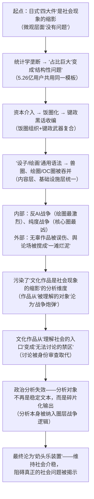

# 文化吞并的动力学：泛二次元帝国的圈层扩张、话语收编与舆论场重构

## ——基于文化政治学、话语分析与系统动力学的综合研究

## 摘要

近年来，中国泛二次元文化生态经历了一场深刻的结构性重组：兽圈、绘圈、OC圈等原本具有独立边界的亚文化圈层被系统性地纳入泛二次元的版图，形成了以“设子/绘画”为通用语法、以“饭圈组织+键政黑话”为话语武器、以“资本与平台”为基础设施的“泛二次元帝国”。本文基于文化政治学、话语分析与系统动力学，系统论证这一“文化吞并”的发生机制、运作工具与结构性后果。

研究发现：吞并的发生根源于三重结构性条件的耦合——日式叙事模板通过统计学垄断成为“唯一选项”（结构层面），资本与平台提供了统一的生产-分发-消费链路（基础设施层面），“文化无意识”使外来叙事模板在不被察觉的情况下完成内化（认知层面）。吞并的完成依赖两套工具：饭圈的组织模式（控评、反黑、挂人、除籍）与键政圈的话语武器（查成分、切割、出征、消解性话语）。吞并过程在不同圈层中产生了截然不同的命运：兽圈被完全吞并且几乎无声，绘圈被吞并后内部爆发“反AI战争”，泛二次元核心圈则键政化最深、战斗力最强。

吞并的结构性后果是双重叠加的：在微观层面，“无辜作品被diss”成为系统常态——文化作品不再是“被理解的对象”，而是“身份战争的炮弹”；在宏观层面，文化作品作为“社会现象的缩影”这一分析维度被系统性污染，舆论场陷入“不可通约性”的泥潭，政治分析的方法论面临根本性失效。本文的结论是：泛二次元的“文化吞并”不是一种“文化扩张”，而是一场“话语权圈地运动”——其终极功能是使一代人在“战斗”和“热爱”中耗尽精力，成为维持社会介稳的“奶头乐装置”。

**关键词**：文化吞并；泛二次元；饭圈化；键政黑话；话语权垄断；舆论场污染；文化无意识

## 一、引言：一个正在发生的文化生态剧变

### 1.1 问题的提出

2025年至2026年间，中国互联网文化场域中持续发生着一系列看似分散、实则同构的现象。

在绘圈，画师因作品“太完美”而被指控使用AI，被迫签订“AI对赌直播”协议——接受挑战的画师必须开直播现场绘图，证明自己拥有能画出被质疑作品的水准，“赌资”通常在千元左右。这类对赌正在成为绘圈内的一种“猎巫运动”。

在二次元社群，“仙家军”以“维护‘原神’、米哈游”的名义，对持不同意见者实施“开盒”——非法获取并公开隐私信息。该组织2021年8月成立，采用分层级QQ群管理模式，包含外围成员至核心管理层三级架构，通过社会工程学数据库、黑客技术及购买信息等手段实施开盒。2024年四川公安机关侦破该系列案件，依法查处155名涉案人员，涉及139起网络暴力违法犯罪案件。受害者不时遭到电话、短信轰炸，还有人发私信诅骂。

在游戏讨论中，关于《原神》璃月地区建筑是“中式”还是“日式”的争论持续发酵。批评者指出璃月“建筑视觉素材混用日式构件，考据不严谨”，属于“美术设计短板”。支持者则回应“架空世界为什么还要如此较真”，更极端的观点认为“重要的是它出现在璃月，那就是‘中式’！如果这建筑真的是现实的日式，那该着急的应该是日本人！这是文化掠夺！”。

在更广泛的舆论场中，键政圈的“查成分”“切割”“出征”等黑话被泛二次元圈层完整吸收。“查成分”在米游讨论区常常被使用——当有人发表“奇形怪状的言论”时，查成分被认为“很有用”。这种黑话的功能是：通过审查对方的发言历史、立场归属，预先判定对方“有没有资格说话”，从而使内容讨论被身份审查所取代。

这些现象表面分属不同领域——版权争议、粉丝文化、游戏批评、网络暴力——但共享着同一个底层逻辑：**泛二次元文化生态正在完成对其他亚文化圈层的系统性“吞并”**，而这一吞并过程本身正在重构整个互联网舆论场的运作方式。

本文的核心论点是：**泛二次元对兽圈、绘圈、OC圈等圈层的吞并，不是一种“文化融合”或“自然扩张”，而是一场以“设子/绘画”为通用语法、以“饭圈组织+键政黑话”为话语武器、以“资本与平台”为基础设施的“话语权圈地运动”。** 这一吞并的结构性后果是双重叠加的：在微观层面，文化作品从“被理解的对象”沦为“身份战争的炮弹”；在宏观层面，舆论场被搅成“一滩烂泥”，政治分析的方法论面临根本性失效。

### 1.2 理论框架

本文整合以下理论资源构建分析框架：

**文化政治学**关注文化生产中的权力关系。葛兰西的“文化霸权”概念揭示了统治阶级如何通过“同意”而非“强制”实现对被统治阶级的精神领导。本文将其应用于分析泛二次元如何通过“通用语法”实现对其他圈层的“同化”。

**话语分析**关注话语如何生产权力。福柯揭示了话语与权力的内在勾连——话语不仅是“说什么”，更是“谁有资格说”“在什么条件下说”的权力配置。键政黑话的分析表明，其核心在于“利用网络社群效应而非复杂政治知识来激发讨论”。本文将其应用于分析“查成分”“出征”等黑话如何完成话语压制。

**系统动力学**关注正反馈循环与系统锁定。本文将其应用于分析吞并完成后舆论场的“烂泥化”——各圈层之间的相互攻击形成自我强化的正反馈循环，使系统进入不可逆的锁定状态。

**文化研究**关注亚文化的生产与消费。OC文化已形成“涵盖创作、社交、消费的完整生态”。本文将其应用于分析“设子/绘画”作为通用语法的吞并功能。

### 1.3 核心概念界定

**文化吞并**：指一个文化系统通过“同化”而非“征服”的方式，将其他亚文化圈层的生产范式、消费链路、话语体系和身份认同纳入自身版图的过程。吞并的核心机制是“通用语法的标准化”——当不同圈层共用同一套创作、交易和展示链条时，圈层边界在实践层面就已经被消除了。

**泛二次元帝国**：指以ACGN（动画、漫画、游戏、轻小说）为核心载体、以“设子/绘画”为通用创作语法、以饭圈组织模式+键政话语武器为内部治理工具、以资本与平台为基础设施的文化-政治-经济复合体。其用户规模已突破5.26亿，形成了从内容生产到周边消费的完整闭环。

**设子/绘画**：指原创角色设定（OC）及其视觉呈现（立绘、插画）。OC是“Original Character”的缩写，即“原创角色”——爱好者独立设计的虚构角色，其外形、性格、成长经历、人际关系乃至所处世界观，均由创作者自主构建。这一范式构成了泛二次元生态的“通用语”——无论兽圈、绘圈还是游戏同人圈，最终都共享同一套创作、约稿、展示和交易流程。

**键政黑话**：指从键政圈流入泛二次元圈层的一套话语武器。“键政”的核心目标在于“产生网络效应和在网络论辩中获胜”，依赖“有效的网络组织（如‘出征’）和修辞技巧”。键政黑话包括“查成分”（身份审查）、“切割”（划定敌我边界）、“出征”（集体行动压制异见）、“消解性话语”（不攻击内容而攻击说话资格）等。其核心功能是以极低的认知成本完成敌我划分和话语压制。

**文化无意识**：指一个文化作品在不被创作者和消费者自觉感知的情况下，携带并传播其原产国的意识形态基因——叙事如何展开、情感如何驱动、主角为何行动、世界如何被理解。这一概念揭示了一个关键事实：**任何作品都无法逃脱其原产国的“叙事语法”**，即使在被仿制和移植之后，这种“基因”仍然高残余。

**饭圈化**：指以“为推而战”为核心逻辑的组织模式——控评（控制评论风向）、反黑（压制负面评价）、挂人（公开审判“违规者”）、除籍（将“纯度不足”者开除出圈层）。2025年被称作二次元“饭圈”的“超级大年”。

**舆论场污染**：指泛二次元吞并完成后，舆论场陷入“不可通约性”泥潭的状态——不同圈层使用不可通约的话语体系，任何试图进行“理性讨论”的尝试都被“身份审查”所拦截，文化作品从“被理解的对象”沦为“身份战争的炮弹”。

## 二、吞并的前提：为什么是“泛二次元”成为了收编者？

泛二次元之所以能够完成对其他亚文化圈层的系统性吞并，根源于三重结构性条件的耦合。这些条件不是“偶然的”，而是“结构性的”——它们同时存在于文化生产的基础设施、认知框架和资本逻辑之中。

### 2.1 统计学垄断：从“一个选项”到“唯一选项”

泛二次元吞并的底层条件，是日式叙事模板通过“统计学垄断”成为了文化生产的“唯一选项”。

#### 2.1.1 “日式四大件”的起源：社会现象的缩影

羁绊美学、世界系叙事、拟似家族、根性論——这“日式四大件”在诞生之初，是日本特定历史条件的文化投射。

日本战败后，“人间神天皇”成了凡人，国民精神崩溃、彷徨，失去了信仰的核心。正是在这段黯淡的岁月里，日式ACG产业完成了“无形资产的增值”。日式ACG的叙事模板回应的是特定历史处境中的精神需求：“羁绊美学”回应的是社会结构瓦解后个体退回小团体的情感需求；“世界系叙事”回应的是宏大叙事瓦解后个体将世界命运系于个人情感的精神状态。日本哲学家东浩纪将“世界系”定义为“缺乏中间项介入的男女关系与世界终结的直接联系”——“使想象界（人际关系）与实在界（世界危机）直接短路”。

这些叙事模板在诞生之初确实在“反映社会问题”——它们是特定历史处境中的文化“生存策略”。在微观层面，它们“没有问题”。

#### 2.1.2 统计学垄断：占比巨大成为结构性问题

然而，当这些模板被大量复制、占据市场绝对主导地位时，“统计学上的占比巨大”使它们从“一个选项”变成了“唯一的选项”。

中国泛二次元用户规模从2017年的2.12亿人增长至2025年的5.26亿人，预计2029年将达5.70亿人。当5亿人共用同一套叙事模板时，这一模板就构成了“统计学垄断”——它不再是“一个选项”，而是“唯一的选项”。

当一个模板占据市场主导时，任何新作品想要存活，必须使用这个模板。这不是“文化侵略”，而是“统计学垄断”下的结构性问题——模板本身没问题，但模板的垄断性地位使所有偏离模板的尝试都被市场淘汰。

#### 2.1.3 统计学垄断的文化后果

统计学垄断的直接后果是“文化多样性的系统性消失”。当“日式四大件”成为市场的“唯一选项”时，其他叙事传统——无论中式、欧式还是其他——都被边缘化。不是因为它们“不好”，而是因为它们“不符合市场预期”。

市场预期本身已经被统计学垄断所塑造：一代人在日式叙事模板中长大，将“日式”等同于“二次元”，将“二次元”等同于“理所当然”。任何偏离这一模板的尝试——无论多么有创意——都会被市场解码为“不够二次元”。

### 2.2 “设子/绘画”作为通用语法：内容层的统一

泛二次元之所以能够完成吞并，最直接的机制是“设子/绘画”这一通用创作语法的标准化。

#### 2.2.1 什么是“设子/绘画”范式

“设子”（角色设定）与“绘画”（视觉呈现）构成了泛二次元生态的核心生产范式。OC是“Original Character”的缩写，即“原创角色”——区别于基于已有商业化IP进行衍生创作的同人角色，OC是爱好者独立设计的虚构角色。给OC作图、写小说等是圈内常见的OC创作方式，也被称作“养OC”。

无论是兽圈的“兽设”、绘圈的“OC”、游戏同人圈的“角色”，最终都指向同一个东西：**一个有名字、有外貌、有设定、可以被“约稿”的原创角色**。

“设圈”已形成围绕“设子”进行买卖的圈子——设子为虚拟的原创角色设计世界观、设定基本信息。在设圈，“一幅原创画稿早就拍卖到了几万甚至几十万元”，“一套三张人设图拍卖到32万元”。OC文化已形成“涵盖创作、社交、消费的完整生态”。从数据来看，小红书“OC”话题浏览量近38亿，抖音相关播放量达260亿。

这一生态的核心是：**无论你属于哪个圈层，只要你需要“一张好看的立绘”，你就进入了同一套生产-消费体系。**

#### 2.2.2 通用语法的吞并功能

“设子/绘画”作为通用语法的吞并功能体现在三个层面：

**第一，生产层面的打通。** 一个画师可以同时接兽圈、绘圈、游戏同人圈的约稿——因为“画一张好看的立绘”的技能是通用的，不因圈层而异。画师资源在不同圈层之间自由流动，使圈层边界在生产层面被消除。

**第二，消费层面的打通。** 一个消费者可以同时购买兽设立绘、OC插画、游戏角色周边——因为“收藏好看的图”的消费逻辑是通用的。消费链路在不同圈层之间自由贯通，使圈层边界在消费层面被消除。

**第三，审美层面的打通。** 评判“什么是好看的”的标准在不同圈层之间趋于一致——因为所有圈层共享同一套视觉审美体系（日式ACG画风）。审美标准在不同圈层之间趋于同质化，使圈层边界在认知层面被消除。

兽圈OC的“O”也是Original（原创），但兽圈“因为没有特定的文娱作品当载体，所创作的oc非常多变，没有明确的标准”。当它被纳入泛二次元的“设子/绘画”范式后，这种“多变”就被标准化了——兽设被重新定义为“带毛的OC”。

### 2.3 资本与平台：基础设施层的统一

资本与平台为泛二次元的吞并提供了“基础设施”——不是通过“强迫”，而是通过“提供更便利的通道”。

#### 2.3.1 约稿平台：汇聚所有圈层的交易需求

米画师、半次元等约稿平台将所有圈层的创作需求汇聚到同一套交易体系中。无论你是兽圈想要一张兽设立绘，还是绘圈想要一张OC插画，你都在同一个平台上、用同一套流程、面对同一批画师。

平台不关心“你是哪个圈子的”——它只关心“你有没有支付能力”。当所有圈层的交易需求被汇聚到同一平台时，圈层边界在商业层面就已经被消除了。

#### 2.3.2 周边产业链：为所有IP符号提供统一的实体化通道

徽章（吧唧）、亚克力立牌、棉花娃娃、毛绒玩具——这些周边产品的生产链路是统一的。无论IP来自哪个圈层——兽设、OC、游戏角色——最终都通过同一套代工厂、同一套销售渠道、同一套展会体系完成实体化。

周边产业链的统一意味着：**一个IP的“价值”不再由其所属圈层决定，而由其“能否被周边化”决定**。而“能否被周边化”的标准，是由泛二次元的审美和消费体系定义的。

#### 2.3.3 社交媒体算法：将不同圈层的流量统一导向“热度最高”的内容

微博超话、B站、小红书、抖音——这些平台的推荐算法不区分“你是兽圈还是绘圈”，只区分“这个内容能不能留住用户”。在算法逻辑中，能产生高互动率的内容就是“好内容”——而高互动率的内容，往往是那些符合泛二次元审美标准的内容。

有观察者指出，平台“为了流量，都用推荐算法强行破圈”。算法的“统一导向”使不同圈层的内容在流量竞争中被迫向泛二次元的审美标准靠拢——不是因为它们“想”靠拢，而是因为“不靠拢就没人看”。

## 三、吞并的工具：饭圈组织模式与键政话语武器的复合

有了“吞并的前提”（结构性条件）和“吞并的通道”（通用语法+基础设施），还需要“吞并的工具”——即一套能够完成吞并的“作战系统”。这套系统由两个来源复合而成：饭圈的组织模式与键政圈的话语武器。

### 3.1 饭圈的组织模式：“为推而战”的战斗逻辑

饭圈的组织模式被泛二次元圈层完整吸收，提供了吞并的“组织形式”。

#### 3.1.1 控评与反黑：舆论控制的基础设施

“控评”（控制评论风向）和“反黑”（压制负面评价）是饭圈最基础的舆论控制手段。在泛二次元语境中，这些手段被用于维护“自家作品/角色”的正面形象——“谁批评我的游戏，我就控评压下去；谁黑我的角色，我就反黑举报掉。”

有观察者指出，“整个中国二次元环境就是角色粉+CP推构成整个底层逻辑”，“自己推的角色不能吃亏”成为核心行为准则。当“不能吃亏”成为最高原则时，任何对“自家”作品的批评——无论多么中肯——都被视为“攻击”，需要被“反黑”。

2025年被称作二次元“饭圈”的“超级大年”。饭圈化的表现包括：“刷分打榜”、粉丝控评、不同粉丝之间的骂战。有评论者指出，“现在动漫只要可以有CP都会有饭圈”。

#### 3.1.2 挂人与除籍：边界维持的日常巡逻

“挂人”（公开审判“违规者”）和“除籍”（将“纯度不足”者开除出圈层）是饭圈维持边界的核心手段。在泛二次元语境中，这些手段被用于清除“纯度不足”的成员——“你不够爱”“你不是真粉”“开除二籍”。

挂人和除籍的功能是双重的：对内，它们使圈层成员保持“纯度”——任何偏离“标准”的行为都会面临被“挂”的风险；对外，它们向潜在的“越界者”发送信号——“这里不欢迎你。”

在OC文化中，同人圈“规矩比较多，一些东西有点‘绑架’人的意思，比如要符合原作人设、不能脱离原作世界观，很多低龄爱好者喜欢‘出警’”。这种“出警”文化正是挂人与除籍的日常运作。

#### 3.1.3 “仙家军”作为饭圈化暴力的极端形态

“仙家军”是饭圈化暴力在泛二次元领域的极端形态。该组织2021年8月成立，主要活跃于百度贴吧、B站及QQ群。该组织起源于B站用户“原神s吧”对米哈游玩家“渊兮の桃”的开盒事件，逐步形成以“太上无极仙帝至尊”为核心的团体。

该组织“以维护‘原神’、米哈游的名义，经常开盒、网暴对‘原神’、米哈游有不同意见的玩家”。成员多采用分层级QQ群管理模式，包含外围成员至核心管理层三级架构。其技术手段包括社会工程学数据库、黑客技术及购买信息等。2022年起其攻击范围扩展至非游戏领域。

2023年国家开展“清朗·网络戾气整治”专项行动后，其活动有所收敛。2024年四川公安机关侦破成都仙家军团伙系列案件，依法查处155名涉案人员，涉及139起网络暴力违法犯罪案件。

“仙家军”的存在揭示了饭圈化暴力的逻辑终点：当“为推而战”的战斗逻辑被推向极致时，“战斗”就不再是“维护社区环境”，而是“消灭一切不同意见”——通过开盒、网暴、信息骚扰等违法犯罪手段。

### 3.2 键政圈的话语武器：从“查成分”到“出征”

键政圈的话语武器被泛二次元圈层完整吸收，提供了吞并的“弹药系统”。

#### 3.2.1 键政黑话的“预制狗哨”机制

键政圈的核心话语机制是一套高度凝练的、低认知成本的话语符号系统。有分析指出，“键政的核心目标从传统的知识探讨转向追求网络社群效应和在网络论辩中获胜”。这一目标的实现依赖“有效的网络组织（如‘出征’）和修辞技巧”。

键政黑话的特征是：

- **低成本**：几个字的黑话就能完成身份识别、立场宣示和敌我划分
- **高杀伤力**：被攻击者无法在同一个话语层面上“反驳”——因为黑话本身不构成需要被反驳的“论点”
- **自我正当化**：执行者相信自己是在“维护正义”而非“攻击他人”
- **不可翻译性**：圈外人看不懂黑话，圈内人不需要解释——这使黑话成为圈层身份的“密码”

#### 3.2.2 泛二次元对键政黑话的完整吸收

泛二次元圈层对键政黑话的吸收是系统性的、完整的：

| 键政黑话 | 原初功能 | 在泛二次元中的功能 |
|---------|---------|------------------|
| **查成分** | 审查对方的政治立场 | 审查对方“是哪家的粉”“是不是对家” |
| **切割** | 与特定政治立场划清界限 | 与“纯度不足”的粉丝/作品划清界限 |
| **出征** | 集体涌向外部平台进行政治性刷屏 | 集体涌向“黑子”的评论区进行压制 |
| **挂人** | 截屏挂出对方的“反动言论”并号召批判 | 截屏挂出对方的“黑历史”并号召避雷 |
| **消解性话语** | “你太较真了”“别上纲上线” | 用情感化标签取消质疑者的发言资格 |

“查成分”在米游讨论区被广泛使用——当有人发表“奇形怪状的言论”时，“查成分”被认为“很有用”。其操作逻辑是：通过审查对方“在过去干了什么，对某件事，或者某一类事件发表过什么看法”，“在面对某一类事件时他的立场站在哪边儿”——将“内容讨论”降格为“身份审查”。

有观察者指出，现在的二次元环境“连成分都不用查即扣即用了，一旦转进吵架的网友们就会放下争执一致针对，然后楼就歪了贴就炸了”。这意味着键政黑话已经从“需要查成分”升级为“无需查成分直接扣帽子”——识别成本进一步降低，杀伤效率进一步提高。

#### 3.2.3 “查成分”作为讨论的前置程序

“查成分”是键政黑话在泛二次元中最具破坏性的应用。它使“内容讨论”被“身份审查”所取代——在你说话之前，你必须先证明“你不是对家”。

“查成分”的运作逻辑是：

- 预设发言者的恶意——“你说这些话，一定是因为你是XX的粉丝”
- 将“身份”置于“内容”之上——“你是谁决定了你说的话有没有价值”
- 将“讨论”降格为“站队”——“你站在哪一边比你说什么更重要”

当“查成分”成为讨论的前置程序时，任何试图进行“内容讨论”的尝试都会被“身份审查”所拦截。你无法“讨论问题”——你只能“证明自己”。

### 3.3 饭圈组织+键政黑话的复合效应

当“饭圈的组织模式”与“键政圈的话语武器”复合时，产生了一种远超二者之和的效应：

- **组织**（饭圈）提供了“谁来做”——控评、反黑、挂人、除籍的执行者
- **武器**（键政）提供了“怎么做”——查成分、切割、出征、消解的话语工具
- **复合**产生了“为什么做”的正当性——“我们在维护正义”“我们在清除异端”

有观察者指出，“现在的二游圈，不是圈（quan），说难听点就是圈（juan），荡妇羞辱，造黄谣，赛博ntr，罕见，男女对立等等各个节奏都是重量级，最后的尽头就是键政，反正没‘人’关心游戏本身是怎么样的”。这正是复合效应的必然结果——当不同圈层的话语武器被汇聚到同一场域时，它们会相互强化、相互放大，形成一种“自我燃烧”的舆论生态。

## 四、吞并的过程：三个圈层的不同命运

泛二次元的吞并过程在不同圈层中产生了截然不同的结果。这种差异不是“偶然的”，而是由各圈层与泛二次元核心之间的距离、依赖程度和独立生存能力决定的。

### 4.1 兽圈：被完全吞并，几乎无声

兽圈（Furry）是**最先被吞并、最彻底、也最沉默**的圈层。

#### 4.1.1 兽圈的独立身份

兽圈是由“喜爱拟人化动物角色的次文化群体兽迷（furry fandom）组成的群体圈子”。兽圈文化2003年左右传入中国。兽迷的自我认同首先表现为对拟人化动物形象（“兽设”）的认同上，“动物化身既是其建构、填补理想自我的手段，也是其对外展演、寻求共鸣的途径”。

兽圈文化的核心是“原创性”——与Cosplay还原已有角色不同，动物扮演的核心是“创造并扮演一个代表理想自我或另一重人格的原创拟人化动物角色”。兽圈“允许人们选择自己喜爱的动物形象，以此来表达自己的个性、兴趣和身份认同，进入兽圈的第一步往往从拥有自己的‘兽设’开始”。

2023年被称作“兽展爆发元年”，中国各地新兽展品牌加速涌现。2024年至2025年，国内线下兽聚活动显著增多，受众年龄广泛集中在18-32岁。

#### 4.1.2 吞并的机制

兽圈被吞并的机制可以概括为三个步骤：

**第一步：概念合并。** “兽设”被重新定义为“带毛的OC”。当这个认知在圈层内外同时成立时，吞并就完成了第一步——兽圈失去了“独立范畴”的身份，被纳入了“OC”的范畴。

**第二步：视觉降维。** 毛装被重新定义为“毛茸茸的二次元实体化”。兽装师从“独立的亚文化手工艺人”变成了“泛二次元COS/周边产业链上的一环”。兽圈的视觉产出——从兽设到毛装——都被纳入了泛二次元的审美评价体系。

**第三步：话语转移。** 评判兽设好坏的标准，从“是否符合动物行为学”“是否具有物种特征”转向“是否符合二次元审美规范”“是否‘好看’”。兽圈的话语权被泛二次元的审美标准所覆盖。

#### 4.1.3 为什么最沉默？

兽圈的“安静”是结构性的，而非它“没有意见”：

**第一，生态位依赖。** 兽圈的生存高度依赖泛二次元的画师资源、约稿平台和展会体系。兽圈缺乏独立的经济基础——没有独立的约稿平台、没有独立的展会体系、没有独立的生产链路。离开泛二次元的基础设施，兽圈无法独立生存。

**第二，批判动员困难。** 兽圈没有形成“键政化”的话语武器——它不擅长“出征”或“挂人”，面对吞并时缺乏有效的反击手段。兽圈的社群文化倾向于“圈地自萌”而非“对外战斗”。

**第三，内部被收编。** 大量兽圈新人通过泛二次元游戏/番剧入门——他们首先是一个“二次元爱好者”，然后才是一个“兽圈爱好者”。对他们而言，“兽设”与“OC”之间没有本质区别。

**第四，边缘化叙事。** 当泛二次元的“纯度战争”如火如荼时，兽圈的声音被系统性淹没。它既不够“大众”（无法引起广泛关注）也不够“激烈”（无法制造冲突流量），在注意力经济中天然处于劣势。

### 4.2 绘圈/OC圈：被吞并后内部爆发“反AI战争”

绘圈/OC圈是**被吞并最彻底、内部最激烈**的圈层。

#### 4.2.1 OC文化的独立发展

OC文化经历了从早期贴吧、LOFTER到B站、小红书的平台迁移。OC“凭借独特的原创属性与圈层共鸣，逐渐成长为二次元垂类里极具潜力的优质内容”。OC文化已形成“涵盖创作、社交、消费的完整生态”。

设圈（OC圈）有专门的拍卖群，“群内会定期组织拍卖。可能会有不同的金主为了争抢一个OC的所有权而相互竞拍，最终拍出天价来”。一套三张人设图曾拍卖到32万元。

#### 4.2.2 吞并的机制

绘圈/OC圈被吞并的机制与兽圈相似，但更加彻底：

- 绘圈的核心产出“立绘/插画”本身就是泛二次元的核心生产资料
- 约稿流程、定价标准、审美体系与泛二次元完全共享
- “设子”概念与“OC”概念已完全同义——不存在“独立范畴”的认知空间

绘圈被吞并的程度如此之深，以至于它甚至不认为自己“被吞并”了——它只是认为“我们本来就是二次元的一部分”。

#### 4.2.3 为什么反AI最凶？

绘圈反AI的激烈程度，是它被吞并后**内部价值体系崩塌的应激反应**。

**第一，经济根基被动摇。** 绘圈的核心价值——手工独特性——被AI以零边际成本复制。如果越来越多人用AI生成图，“普通小画师的价格会被压低”。当“手工溢价”的定价体系被摧毁时，绘圈的经济基础就被动摇了。

**第二，身份认同被威胁。** 当“画师”可以被AI替代时，整个圈层的身份认同就失去了物质基础。画师不再是因为“能画出别人画不出的东西”而被认可——他们变成了“可以被机器取代的人”。

**第三，键政化武器转向内部。** 泛二次元的“挂人”“除籍”武器被转向内部——“鉴AI”成为新的“除籍”手段。被怀疑使用AI的画师面临“被挂→被避雷→被社死”的完整链条。

**第四，防御性极端化。** 在无法阻止AI技术发展的条件下，圈层只能通过“加强纯度审查”来维持边界。这种防御性极端化表现为“AI对赌直播”等极端形式——“接受挑战的画师必须开直播现场绘图，证明自己拥有能画出被质疑作品的水准”。

#### 4.2.4 反AI战争的“猎巫”化

反AI战争正在演变为一种“猎巫运动”。整个事件的“原点，始于一名叫水星的画师。她在小红书发布了一张单主约稿”。对赌直播“并未消除疑点”，反而引发了更激烈的争吵。

有评论者指出，“一些人开始把AI对赌当成赚钱的途径。有人故意去找画师的茬，网暴画师，也有画师故意画出一些错误来制造争议”。反AI已经从“保护创作”异化为“制造争议的生意”。

“AI对赌直播”的极端化表现在：画师必须通过直播自证，但“直播并未消除疑点”——因为质疑方可以不断提出新的“疑点”。这种“无限自证”的机制使被怀疑者永远无法“证明清白”，从而陷入永无止境的防御状态。

### 4.3 泛二次元核心圈：键政化最深，战斗力最强

泛二次元核心圈（以日式ACG、国产二游、同人创作为主体的圈层）是**吞并的执行者、键政化的主力、舆论场混乱的制造者**。

#### 4.3.1 核心圈的规模与影响力

中国泛二次元用户规模从2017年的2.12亿人增长至2025年的5.26亿人。核心二次元用户预计从2017年的0.8亿人增长至2026年的1.3亿人。这一规模使核心圈具备了其他圈层无法比拟的动员能力。

2025年是二次元“饭圈”的“超级大年”。核心圈的“战斗力强到离谱”。

#### 4.3.2 为什么叫得最凶、战斗力最强？

**第一，拥有完整的“键政黑话”武器库。** 从“查成分”“切割”到“出征”“挂人”，泛二次元核心圈学会了键政圈的全部话语武器。它不仅是“使用者”，还是“创新者”——在不断实践中发展出新的黑话和战术。

**第二，规模最大、动员最快。** 5亿+用户规模，使任何争议事件都能在数小时内形成大规模“出征”。这种动员能力是兽圈和绘圈无法比拟的。

**第三，身份认同最激进。** 作为“原初”的泛二次元群体，核心圈成员自视为“正统”——任何对泛二次元的批评都被感知为对“自我”的攻击。“自己推的角色不能吃亏”成为不可动摇的底线。

**第四，与商业利益深度绑定。** 头部厂商的“文化出海”叙事为其提供了“道德正当性”和“政治合法性”。“我在支持国产游戏”与“我在捍卫我的热爱”被无缝衔接，形成了双重防御。

#### 4.3.3 泛二次元核心圈的键政化特征

泛二次元核心圈的键政化特征可以归纳为以下维度：

| 特征 | 表现 | 案例 |
|------|------|------|
| **敌我划分** | “查成分”成为讨论的前置程序 | “你先证明你不是对家，再说话” |
| **立场审判** | “你批评这个游戏=你不爱国” | 批评《原神》被指控“攻击文化输出” |
| **消解性话语** | “你太较真了”“你上纲上线” | 用情感化标签取消质疑者的发言资格 |
| **出征常态化** | 任何“冒犯”都会触发集体行动 | 从“挂人”到“举报”到“网暴”的完整链条 |
| **圈层内卷** | 二游圈“最后的尽头就是键政” | 讨论“没‘人’关心游戏本身是怎么样的” |

## 五、吞并的后果：舆论场的“烂泥化”与文化分析的方法论困境

### 5.1 文化作品从“社会缩影”到“战争炮弹”的异化

文化作品本来是“社会现象的缩影”——初衷是直观反映社会问题。

但吞并完成后的泛二次元生态使这一关系发生了根本性异化：

**初衷阶段**：作品反映社会现实 → 理解、分析、批判
↓
**圈层化阶段**：作品成为身份认同的图腾 → 捍卫、维护
↓
**键政化阶段**：作品成为“立场信号” → 站队、出征
↓
**完全异化阶段**：作品沦为“战争炮弹” → 争夺、砸碎

在完全异化阶段，作品的意义完全由其“在圈层战争中的位置”决定。一部作品今天是“文化输出的旗帜”，明天可能因为一个争议变成“文化汉奸的靶子”。

有观察者指出，二次元讨论氛围之所以“越来越糟糕”，“主要原因在于‘共振’和‘圈地’——互联网整体的攻击性越来越强，加上圈子与圈子间的交流加剧了原本相对温和群体的演化进程”。

### 5.2 “无辜作品被diss”的系统性机制

“无辜作品被diss”不是偶然事件，而是吞并完成后的系统性后果。

#### 5.2.1 讨论不再基于作品本身

当泛二次元帝国形成后，文化作品的讨论逻辑发生了根本性转变：**讨论不再基于作品本身，而是基于作品在“帝国”内部权力格局中的位置。**

- 一部非政治性的动画，可能因为其制作公司、播出平台、角色设定被解读为“政治信号”
- 一个普通的coser，可能因为穿了一件视觉上“像”和服的衣服而被“出征”
- 一个独立画师，可能因为作品“太完美”而被怀疑使用AI，继而“被挂→被避雷→被社死”

关于《原神》璃月建筑是“中式”还是“日式”的争论正是这一机制的典型表现。争论的焦点已经不再是“建筑本身是什么样的”，而是“如何定义璃月”——“大家其实是在帮对方强化‘璃月必须和现实中国历史强捆绑’的这一概念”。

#### 5.2.2 “误伤”是注意力经济的必然产物

在“挂人-出征”的循环中，被攻击的标的物不需要“真的有罪”——它只需要“看起来可以被利用”。

有观察者指出，“反串嘛，想办法转进一些不可说的东西然后炸贴，有组织的还能借此生产弹药包，可能真的有傻逼，但很多时候也可能是扣帽子把别人打成傻逼”。这种“弹药包”生产机制使任何作品——无论其内容如何——都可能成为被攻击的靶子。

当“正常词被敏感化”时，“误伤”就成为系统常态——因为你永远不知道哪个“正常词”会在某个圈层中被解读为“攻击信号”。

#### 5.2.3 作品被“标签化”

一部作品的政治意涵不再由文本决定，而由“谁在骂它/谁在护它”倒推。当一部作品同时被A阵营“捧”和被B阵营“骂”时，它的“真实意义”就消失了——它只是一个“被争夺的符号”。

在璃月争议中，支持者认为“架空题材游戏，谁说以中华文化为主体的内容不可以融入其他文化的？……重要的是它出现在璃月，那就是‘中式’！”。这种“出现在璃月就是中式”的逻辑，将文化归属问题简化为“位置问题”——作品的意义不是由内容决定的，而是由“出现在哪里”决定的。

### 5.3 舆论场对政治分析的三重干扰

当舆论场被“泛二次元帝国”的吞并与内爆所支配时，传统的政治分析遭遇了方法论层面的失效。这种失效不是“分析变得困难”，而是“分析这个行为本身被纳入圈层战争的逻辑”。

有学术研究指出，“原本避谈政治的ACG青年圈群内部也出现‘走向政治’的新变化，这种变化可能会影响后真相主义的情绪化表达，致使青年圈群忽略事实和理性”。

#### 5.3.1 第一重干扰：分析对象的“非稳定化”

在泛二次元舆论场中，一部作品的意义**不再由其自身内容决定，而由其被“挂”“查成分”“出征”后的“圈层位置”决定**。

分析对象在不断“漂移”——今天它是“文化出海”的标杆，明天它可能因为一个争议事件变成“文化汉奸”的靶子。分析者无法锚定一个稳定的分析对象。

关于璃月争议的讨论揭示了这一点：争论的焦点已经从“璃月建筑是什么样的”变成了“如何定义璃月”——“这场输了又如何，对方能找100种其他的角度来攻击”。当攻击角度可以无限切换时，分析对象就失去了稳定性。

#### 5.3.2 第二重干扰：分析工具的“被武器化”

任何分析工具——马克思主义、后殖民、民族主义、自由主义——都可以被“提取”为圈层战争的合法性标签。引用不是为了分析，而是为了“压倒对方”。

在璃月争议中，文化分析的工具被简化为“文化掠夺”的标签——“如果这建筑真的是现实的日式，那该着急的应该是tmd日本人！这是文化掠夺！”。文化分析被简化为“文化争夺”——不是理解文化现象，而是宣告文化主权。

有学术研究指出，ACG青年圈群的“政治表意实践”中存在“政治内容弱化偏颇容易催生‘群体极化’，泛娱乐化表达容易造成非理性狂欢”的风险。当分析工具被“泛娱乐化表达”所覆盖时，分析就失去了精度。

#### 5.3.3 第三重干扰：分析环境的“不可通约化”

在键政化的泛二次元舆论场中，“中立”本身被定位为“拉偏架”或“和稀泥”。分析者一旦开口，就已经被各方判定为“站在对面”。

“不可通约化”的根源在于：不同圈层使用不可通约的话语体系。一方在讲“创作自由”，另一方在谈“文化主权”——双方使用不可通约的话语体系，任何“讲道理”都变得不可能。

有研究指出，“圈层的特异化以及群体固化盲目贬抑事实，也为思想政治引领工作增加了难度”。当圈层特异化达到一定程度时，跨圈层的理解就完全不可能了——不是“难以理解”，而是“在结构上不可能”。

### 5.4 “文化作品是社会现象的缩影”这一分析维度的污染

当文化作品从“社会缩影”异化为“战争炮弹”时，“文化作品是社会现象的缩影”这一分析维度本身就被污染了。

**污染的机制**是：

1. **初衷**：文化作品反映社会问题 → 分析者可以通过分析作品来理解社会
2. **圈层化**：作品成为身份认同的图腾 → 分析被“捍卫”所替代
3. **键政化**：作品成为立场信号 → 分析被“站队”所替代
4. **完全异化**：作品沦为战争炮弹 → 分析被“争夺”所替代

在完全异化阶段，你不再能通过分析作品来理解社会，因为作品本身已经被资本、饭圈、键政黑话层层包裹。任何试图“分析”的尝试，都会被重新编码为“站队”——你分析的不是作品，而是“你在为谁说话”。

## 六、结论：吞并的终局——从“文化现象”到“社会装置”

### 6.1 完整逻辑链

综合以上分析，泛二次元文化吞并的完整逻辑链可以概括为：

### 6.2 主要发现

本文通过对泛二次元文化吞并现象的系统考察，揭示了以下核心事实：

**第一，吞并的发生根源于三重结构性条件的耦合。** 日式叙事模板通过统计学垄断成为“唯一选项”（结构层面），资本与平台提供了统一的生产-分发-消费链路（基础设施层面），“文化无意识”使外来叙事模板在不被察觉的情况下完成内化（认知层面）。

**第二，吞并的完成依赖两套工具的复合。** 饭圈的组织模式（控评、反黑、挂人、除籍）提供了“组织形式”和“执行者”；键政圈的话语武器（查成分、切割、出征、消解性话语）提供了“弹药系统”和“正当性叙事”。两者的复合产生了远超二者之和的效应。

**第三，吞并过程在不同圈层中产生了截然不同的命运。** 兽圈被完全吞并且几乎无声（生态位依赖、缺乏批判动员能力）；绘圈被吞并后内部爆发“反AI战争”（经济根基被动摇、键政化武器转向内部）；泛二次元核心圈键政化最深、战斗力最强（规模最大、武器最全、与商业利益深度绑定）。

**第四，吞并的结构性后果是“舆论场的烂泥化”。** 文化作品从“社会缩影”异化为“战争炮弹”；“无辜作品被diss”成为系统常态；政治分析遭遇方法论失效——分析对象非稳定化、分析工具被武器化、分析环境不可通约化。

**第五，“文化作品是社会现象的缩影”这一分析维度被系统性污染。** 在完全异化阶段，你不再能通过分析作品来理解社会——因为作品本身已经被资本、饭圈、键政黑话层层包裹。任何试图“分析”的尝试，都会被重新编码为“站队”。

### 6.3 核心命题

> **泛二次元的“文化吞并”不是一种“文化扩张”，而是一场“话语权圈地运动”——它通过“设子/绘画”这一通用语法完成内容层的吞并，通过“饭圈组织+键政黑话”完成话语层的收编，通过“资本与平台”完成基础设施层的控制。**
>
> **吞并完成后，泛二次元帝国内部形成了清晰的“战斗力梯度”：核心圈（键政化最深，战斗力最强）→ 绘圈（反AI，次强键政化）→ 兽圈（被吞并，几乎无声）。**
>
> **舆论场的“烂泥化”正是这一结构的必然输出：文化作品被纳入身份战争的逻辑，无辜作品被误伤，政治分析被舆论场吃掉——不是因为分析者不够聪明，而是因为分析对象已经不再是一个“可以被分析”的稳定文本，而是一场“无休止的圈层战争”的碎片化输出。**
>
> **当“日式四大件”从“反映社会问题”异化为“阻碍社会问题被揭示的奶头乐装置”时，这套系统就从“文化现象”变成了“社会装置”——它的终极功能是让一代人在“战斗”和“热爱”中耗尽精力，而不去追问真正的社会问题。**

## 参考文献

[1] 艾媒咨询. 2017-2029年中国泛二次元用户规模及预测分析[EB/OL]. 2026.

[2] 灼识咨询. 中国二次元内容行业白皮书[R]. 2026.

[3] 兽圈[EB/OL]. 百度百科, 2026-06-13.

[4] 动物扮演[EB/OL]. 百度百科, 2026-07-17.

[5] 新一代二次元，不搞同人搞原创[EB/OL]. 36氪, 2025-10-20.

[6] “设圈”是个什么？13岁女孩花70万约画背后的乱象[EB/OL]. 澎湃新闻, 2021-04-09.

[7] 仙家军[EB/OL]. 百度百科, 2026-05-23.

[8] “网络暴力”侵入游戏圈：开盒的人也曾被开盒[EB/OL]. 澎湃新闻, 2024-08-21.

[9] “一听到就想吐”，他们开始集体抵制AI，画师开直播自证[EB/OL]. 腾讯新闻, 2026-07-03.

[10] 为了抵制AI搞出的对赌协议，正在成为绘圈内的一场猎巫运动？[EB/OL]. 网易, 2025-11-08.

[11] 键政[EB/OL]. 百度百科, 2026-04-13.

[12] 查成分到底可不可耻？[EB/OL]. 知乎, 2025-06-25.

[13] 如何评价博主「渔白诗形殇尽」的争议视频「如何分辨中日古建筑」？[EB/OL]. 知乎, 2026-06-20.

[14] 以倭代华？天大笑话！[EB/OL]. B站, 2026-06-20.

[15] 在米哈游面前，三次元娱乐圈为何沦为了“无能的丈夫”？[EB/OL]. 腾讯新闻, 2025-09-02.

[16] 世界系[EB/OL]. 百度百科, 2026-01-21.

[17] 当代二次元群体冲突的原因与影响：探析主流化路径引导策略[J]. 品位·经典，2025(13).

[18] C-Papers: 泛娱乐化与ACG青年圈群政治化[EB/OL].

[19] 弹幕背后中国ACG青年圈群的政治表意实践[J].

[20] 青年“政治萌化”现象的生成逻辑、风险隐忧与路径重构[J]. 福建技术师范学院学报，2026(01).