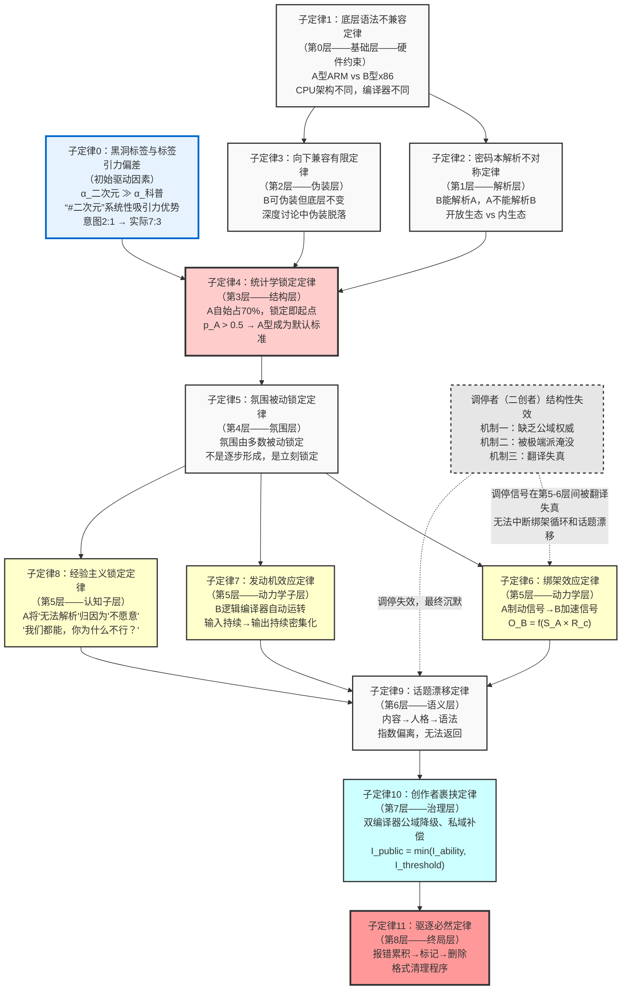

# 社群悖论定律：跨语法社群冲突的结构性机制研究

## ——基于“四九拟说·动物体验社”案例的社会学分析

**摘要**：本研究基于“四九拟说”微信公众号旗下“动物体验社”读者社群（n≈100）中一名逻辑-理性语法型成员被驱逐的真实案例——研究者本人即为该事件的亲历者（被驱逐方），通过参与式观察、深度文本分析与理论建模，提出“社群悖论定律”（Community Paradox Law, CPL）。研究发现：（1）公众号标签体系虽以科普类标签占多数（“#科普漫画”“#动物科普”与“#二次元”比例为2:1），但“#二次元”作为“黑洞标签”具有系统性吸引力优势，导致二次元-漫画爱好者大量涌入并占据社群绝对多数（约70%）——此即“标签引力偏差”；（2）A型成员（情感-共鸣语法）自始占绝对多数，统计学锁定是“起点”而非“结果”；（3）B型成员（逻辑-理性语法）自始处于少数地位，其语法与社群默认语法在CPU架构层面存在结构性不兼容；（4）“泛二次元、漫画、泛游戏、明星类、轻松生活类”与“理工、物化生政史地、计算机、硬科幻、军事”两大兴趣集群对应着两种完全不同的底层语法指令集；（5）A型成员的经验主义认知模式使其将“无法解析B型信号”归因为“B型不愿意融入”而非“架构不兼容”；（6）二创作者虽主动调停但以“@赤狐”为代表的A型极端派无视调停；（7）创作者在公共领域中沉默、仅在私域中补偿，构成“双编译器用户困境”。本研究构建了包含十一个核心子定律（含初始驱动因素）的理论模型，建立动力学公式，提出“黑洞标签”与“标签引力偏差”概念，形成完整的跨语法社群冲突解释框架。

**关键词**：社群悖论定律；黑洞标签；标签引力偏差；语法不兼容；绑架效应；统计学锁定

## 一、引言

### 1.1 研究背景与问题提出

2026年7月，“四九拟说”微信公众号旗下“动物体验社”读者社群（成员约100人）发生了一起跨语法冲突事件。该公众号的标签体系为 **“#科普漫画”“#动物科普”“#二次元”** ——三个标签并列，科普类标签（前两个）与二次元标签的比例为 **2:1**。然而，社群的实际成员构成却与这一标签比例发生显著偏离：二次元-漫画爱好者占据了约70%-80%的绝对多数，科普受众仅占约20%-30%。

这一现象无法用标签数量的比例来解释。其根本原因在于 **“#二次元”标签具有“黑洞标签”的系统性吸引力优势**。传播学中的“媒介黑洞效应”指出，某些媒介如同黑洞一般吸收文化元素并产生能量集聚。本案例中的“#二次元”标签，作为一个情感-共鸣型标签，其吸引力系数远高于逻辑-理性型标签，原因包括：（1）情感-共鸣型标签在平台算法中获得更高的推荐权重；（2）该类标签提供身份信号和集体归属感，降低用户参与的心理门槛；（3）算法放大效应形成正反馈循环，使“黑洞标签”进一步吞噬社群的可见性和注意力资源。因此，标签体系的“2:1”设计意图被实际的“7:3”成员构成所覆盖——此即 **“标签引力偏差”**。

B型成员（即本文研究者本人）在进入社群后，通过参与式观察注意到这一结构性偏离，发出疑问：“怎么都是二次元-漫画爱好者，科普群众去哪里了？”这一提问随即触发了A型成员的强烈制动信号链条，从“你什么意思”逐步升级至“你太较真”“你冷漠”“你像AI”，最终导致研究者被群管理员驱逐。社群创作者在事后私信中表示：“其实你的表达内容和立场我觉得没什么问题。”

上述现象引出一系列理论问题：（1）“#二次元”作为黑洞标签的吸引力机制是什么？（2）为什么标签体系的“2:1”比例与实际社群构成的“7:3”比例之间发生如此显著的偏差？（3）为什么一个关于社群构成的观察性提问会被视为“冒犯”？（4）为什么B型成员“越认真解释”越被排斥？（5）为什么二创者的调停完全无效？（6）为什么创作者在公域沉默、私域补偿？这些现象是否具有结构性的、可推广的解释框架？

### 1.2 研究者立场与伦理说明

本研究的研究者即为“动物体验社”社群中被驱逐的B型成员。这一身份赋予研究者独特的“内部视角”——能够获取第一手的参与式观察资料、完整的聊天记录和私信文本，并对冲突过程中的认知体验与情感反应有直接的感知。为控制“受害者偏见”的风险，本研究采取以下措施：（1）所有分析均基于可公开验证的文本数据（聊天记录、私信截图）；（2）理论建模采用“机制分析法”（Hedström & Ylikoski, 2010），聚焦于可观察的互动模式与可验证的因果关系；（3）在分析A型成员的行为时，采用“方法论移情”——尝试理解A型成员在其语法系统内的合理性，而非将其简单标签化；（4）所有涉及个人身份的信息均做匿名化处理（社群名、人名均采用化名）。

### 1.3 关键概念界定

| 概念 | 定义 | 在本案例中的指涉 |
| :--- | :--- | :--- |
| 黑洞标签 | 具有系统性吸引力优势、能吸收其他标签可见性和注意力资源的议题标签 | “#二次元”标签 |
| 标签引力偏差 | 不同标签对潜在成员吸引力的系统性差异导致的社群构成偏离 | 标签2:1→实际7:3 |
| A型成员 | 使用“情感-共鸣语法”的社群成员 | 二次元-漫画爱好者（占70%） |
| B型成员 | 使用“逻辑-理性语法”的社群成员 | 科普爱好者（占30%） |
| 二创者 | 基于原内容进行二次创作的社群成员 | 主动调停但失效 |
| A极端派 | A型成员中极化程度最高的子群体 | “@赤狐”等人 |
| 双编译器用户 | 能同时理解和运行两种语法的人 | 社群创作者（“四九拟说”主理人） |
| 语法不兼容 | 两种认知架构在CPU级别的不匹配 | A型与B型之间无法进行有效信号互译 |
| 统计学锁定 | 多数语法自动成为社群默认标准 | A型自始占70% |
| 经验主义锁定 | A型将“无法解析”归因为“对方不愿意” | “我们都能融入，你为什么不行？” |
| 发动机效应 | B型逻辑编译器自动运转、不可中断 | “越认真解释”的自动循环 |
| 作者裹挟 | 双编译器用户在公域中被降级为单编译器用户 | 创作者公域沉默、私域补偿 |

## 二、文献综述与理论背景

### 2.1 黑洞标签的理论基础

#### 2.1.1 媒介黑洞效应

传播学中的“媒介黑洞效应”理论指出，某些媒介如同黑洞一般，具有吸收和整合文化元素的强大能力。该理论的核心命题是：当媒介获得足够的可见性和注意力资源后，会产生“能量集聚效应”，系统性地吸收周边的流量和关注度，使资源向其方向“收敛”。

本案例中的“#二次元”标签是媒介黑洞效应的典型体现。作为一个涵盖广泛的泛文化概念，“#二次元”标签汇聚了动漫、游戏、漫画、轻小说等多种亚文化元素，形成了一个巨大的“注意力黑洞”。其吸引力机制可以从以下四个维度加以理解。

#### 2.1.2 标签吸引力的四个机制

**机制一：情感-共鸣标签的系统性吸引力优势**

研究显示，在社交媒体平台上，采用故事化叙事风格、微观视角和显性情感策略的标签，其可见性（如综合热度值）显著高于采用事实化叙事、宏观视角和中性表达的标签。情感策略（显性情感 vs. 无明显情感）的差异对标签可见性的影响具有统计显著性。“#二次元”标签恰好符合“显性共情”“故事化结构”和“微观视角”的特征，使其在平台算法中获得了更高的推荐权重和曝光机会。

**机制二：身份信号与归属需求的吸引效应**

“#二次元”标签提供了一种身份信号和集体认同的入口。研究发现，标签参与行为与用户兴趣之间存在复杂的反馈循环：用户对某一主题的兴趣越高，参与该主题标签讨论的意愿越强；反之，参与标签讨论也增强了用户对该主题的兴趣。“#二次元”标签不仅是内容分类工具，更是身份认同的标记——加入“#二次元”标签意味着“我是这个群体的一员”，这种身份归属需求降低了用户参与的心理门槛。

**机制三：算法放大效应**

社交媒体平台的推荐算法倾向于推送高互动率的内容。情感-共鸣型标签的互动率（点赞、评论、转发）显著高于逻辑-理性型标签。更高的互动率→更高的算法推荐权重→更多的曝光→更多的用户被吸引→更高的互动率——形成“富者愈富”的正反馈循环。这一循环使“#二次元”标签的可见性和吸引力不断自我强化。

**机制四：黑洞标签的“吞噬效应”**

随着“#二次元”标签吸引越来越多的用户和内容，社群的可见性和注意力资源越来越向该方向集中。“#科普漫画”和“#动物科普”两个标签虽然数量上占多数（2:1），但其可见性被“#二次元”标签所吞噬——潜在用户更难看到科普内容，更少被科普标签吸引，导致B型成员占比持续偏低。

### 2.2 情感-共鸣标签与逻辑-理性标签的系统性差异

本研究识别出两类标签的系统性差异：

| 维度 | 情感-共鸣型标签 | 逻辑-理性型标签 |
| :--- | :--- | :--- |
| 典型示例 | “#二次元”“#萌宠”“#日常” | “#科普”“#深度分析”“#硬核” |
| 叙事策略 | 故事化、微观视角、显性情感 | 事实化、宏观视角、中立客观 |
| 认知负荷 | 低（轻松、共鸣） | 高（需要理解、思考） |
| 算法偏好 | 高（互动率高） | 低（互动率相对低） |
| 心理门槛 | 低（“我也可以参与”） | 高（“我需要先了解”） |
| 吸引力系数（α） | 高 | 低 |
| 用户参与动机 | 情感共鸣、身份认同 | 知识获取、认知满足 |

**关键规律**：

$$\alpha_{\text{情感-共鸣型标签}} \gg \alpha_{\text{逻辑-理性型标签}}$$

这意味着：即使情感-共鸣型标签的数量少于逻辑-理性型标签（如本案例中的1:2），其实际吸引力仍可能压倒后者，导致社群构成与标签数量比例发生系统性偏离。

### 2.3 标签引力偏差的数学表述

标签引力偏差是指：由于不同标签对潜在成员的吸引力存在系统性差异，社群的实际成员构成与创作者的标签设计意图之间发生结构性偏离的现象。

设标签吸引力系数为 $\alpha$，则：

$$\alpha_{\text{二次元}} \gg \alpha_{\text{科普漫画}} + \alpha_{\text{动物科普}}$$

即使标签数量比例为 $2:1$（科普:二次元），实际成员构成比例为：

$$p_A \approx 0.7,\quad p_B \approx 0.3 \quad (\text{即A型占多数})$$

**关键推论**：标签引力偏差是社群构成偏离创作者意图的结构性初始原因。创作者不能仅通过标签数量比例来控制社群构成——“黑洞标签”的引力会系统性压倒逻辑-理性型标签。这意味着，如果创作者希望维持多元语法构成，需要主动采取措施来补偿这一偏差（如主动推广科普内容、设置入群门槛、主动邀请科普受众等）。

### 2.4 两大兴趣集群的底层语法差异

基于对社群成员兴趣取向的观察与分析，本研究识别出两大兴趣集群，它们对应着两种完全不同的底层语法指令集：

**表1：两大兴趣集群与底层语法指令集的对应关系**

| 维度 | 集群A：情感-共鸣取向 | 集群B：逻辑-理性取向 |
| :--- | :--- | :--- |
| **核心兴趣领域** | 泛二次元、漫画、泛游戏、明星类、轻松生活类 | 理工、物化生政史地、计算机、硬科幻、军事 |
| **兴趣特征** | 审美体验、情感投射、群体认同、个人化表达 | 规律探索、事实校验、系统构建、公共性讨论 |
| **内在逻辑** | “我感觉”→“我共鸣”→“我属于这里” | “我观察”→“我推导”→“我验证” |
| **学习方式** | 沉浸式体验、同好共感 | 结构化学习、逻辑推演 |
| **社群形态** | 部落式（圈地自萌，外人不容） | 学派式（开放讨论，但语法门槛高） |
| **有效性标准** | “有共鸣吗？”“氛围对吗？” | “有证据吗？”“逻辑通吗？” |
| **讨论性质** | 高度个人化 | 公共性 |

**核心发现**：两大兴趣集群对应着两种完全不同的底层语法指令集。这不是“兴趣爱好”的偶然重合，而是“CPU架构兼容性”的必然结果。情感-共鸣型标签（“#二次元”）吸引的是集群A的用户，逻辑-理性型标签（“#科普漫画”“#动物科普”）吸引的是集群B的用户。由于情感-共鸣型标签的吸引力系数系统性高于逻辑-理性型标签，集群A的用户大量涌入，形成统计学锁定的初始条件。

### 2.5 认知语言学基础

本研究借鉴认知语言学（Cognitive Linguistics）的核心概念——语法不仅是一套句法规则，更是个体认知世界、组织信息、生成意义的基本框架（Langacker, 1987; Lakoff, 1987）。在此基础上，本研究将“语法”概念扩展为“认知-表达底层架构”，用以描述个体在处理信息、生成表达、判断有效性时的系统性模式。

## 三、研究方法

### 3.1 研究设计

本研究采用“参与式观察法”与“深度个案分析法”（Yin, 2014）相结合的研究设计。研究者作为社群成员亲身经历了冲突全过程，获得了第一手的参与式观察资料。在此基础上，结合文本分析与理论建模，构建解释性理论框架。

### 3.2 数据来源

| 数据类型 | 具体内容 | 分析用途 |
| :--- | :--- | :--- |
| 公众号标签体系 | “#科普漫画”“#动物科普”“#二次元” | 分析创作者意图定位与实际构成偏差 |
| 社群聊天记录 | 冲突发生前后约72小时的社群讨论文本 | 追踪话题演变轨迹，分析双方发言模式与冲突升级过程 |
| 创作者私信文本 | 驱逐事件后创作者向研究者发送的私信 | 分析“双编译器用户”的认知状态与行为模式 |
| 社群构成信息 | 基于参与式观察的社群成员构成记录 | 估算A型与B型成员的比例分布（A自始70%，B自始30%） |
| 参与者观察日志 | 研究者在冲突期间记录的感受与观察 | 补充文本分析无法覆盖的语境信息与情感维度 |
| 二创者言论记录 | 冲突过程中二创者的发言（包括调停尝试） | 分析“调停者结构性失效”的机制 |
| A极端派发言记录 | “@赤狐”等人针对B端的制动信号 | 分析极端派对调停的无视与对冲突的升级 |

### 3.3 文本分析方法

采用“认知-表达架构分析法”，将社群成员的发言文本拆解为六个分析层级：

| 分析层级 | 分析内容 | 操作化方法 |
| :--- | :--- | :--- |
| CPU架构标记 | 发言的底层信息处理模式 | 识别“情感表达vs逻辑推导”主导模式 |
| 编译器标记 | 发言的生成方式 | 识别“即时反应vs结构化输出”特征 |
| 密码本标记 | 发言使用的符号系统 | 识别表情包、语气词、术语、逻辑连接词频率 |
| AST结构标记 | 发言的组织结构 | 分析“并联共鸣vs链式推导”结构 |
| 生态标记 | 发言的社交功能 | 分析“氛围维护vs内容澄清”功能 |
| 调停标记 | 调停行为的类型与效果 | 识别调停信号及其在双方系统中的翻译结果 |

### 3.4 理论建模方法

基于案例分析发现，采用“机制建模法”（Hedström & Ylikoski, 2010），构建“社群悖论定律”的理论框架，包括：（1）核心概念的界定；（2）十一个核心子定律的推导与验证；（3）子定律之间逻辑关系的图示化；（4）动力学公式的建立；（5）模型的边界条件与适用范围说明。

## 四、研究发现

### 4.1 黑洞标签与标签引力偏差

#### 4.1.1 标签体系与实际社群构成的对比

公众号标签体系为“#科普漫画”“#动物科普”“#二次元”三个标签并列，科普类标签（前两个）与二次元标签的比例为2:1。然而，社群的实际成员构成却与这一标签比例发生显著偏离：

**表2：标签体系与实际社群构成的对比**

| 维度 | 创作者意图定位 | 实际社群构成 | 偏差方向 |
| :--- | :--- | :--- | :--- |
| 标签/成员类型 | “#科普漫画”“#动物科普”（2个） | 科普爱好者（B型，约20%-30%） | **B型未达到预期占比** |
| 标签/成员类型 | “#二次元”（1个） | 二次元-漫画爱好者（A型，约70%-80%） | **A型远超预期占比** |
| 比例 | 2:1（科普:二次元） | 约7:3（二次元:科普） | **完全反转** |

#### 4.1.2 “#二次元”作为黑洞标签的吸引力机制

**（1）黑洞标签的定义**

> **“黑洞标签”是指一种具有系统性吸引力优势的议题标签，能够吸收和吞噬其他标签的可见性和注意力资源，导致平台上的信息内容和社群成员构成向该标签方向“收敛”。**

**（2）“#二次元”成为黑洞标签的四个机制**

**机制一：情感-共鸣标签的系统性吸引力优势**

情感-共鸣型标签（如“#二次元”）在平台算法中获得更高的推荐权重和曝光机会。研究显示，采用故事化叙事、微观视角和显性情感策略的标签，其可见性显著高于采用事实化叙事、宏观视角的标签。“#二次元”标签恰好符合“显性共情”“故事化结构”和“微观视角”的特征。

**机制二：身份信号与归属需求的吸引效应**

“#二次元”标签提供了一种身份信号和集体认同的入口。用户使用该标签不仅是为了分类内容，更是为了表达“我是二次元群体的一员”。这种身份归属需求降低了用户参与的心理门槛，使更多用户被吸引加入。

**机制三：算法放大效应**

社交媒体平台的推荐算法倾向于推送高互动率的内容。情感-共鸣型标签的互动率（点赞、评论、转发）显著高于逻辑-理性型标签。更高的互动率→更高的算法推荐权重→更多的曝光→更多的用户被吸引→更高的互动率——形成“富者愈富”的正反馈循环。

**机制四：黑洞标签的“吞噬效应”**

随着“#二次元”标签吸引越来越多的用户和内容，社群的可见性和注意力资源越来越向该方向集中。“#科普漫画”和“#动物科普”两个标签虽然数量上占多数（2:1），但其可见性被“#二次元”标签所吞噬——潜在用户更难看到科普内容，更少被科普标签吸引，导致B型成员占比持续偏低。

### 4.2 触发事件：结构性提问及其“冒犯性”

本研究的触发事件具有特殊的理论价值。B型成员（研究者）在进入“动物体验社”社群后，通过参与式观察注意到上述结构性偏离，发出以下提问（原文转录）：

> “怎么都是二次元-漫画爱好者，科普群众去哪里了？”

这一提问在A型成员中触发了强烈的制动信号反应。从文本分析来看，A型成员的反应呈现出清晰的升级轨迹：

**表3：制动信号的升级轨迹**

| 时间 | 发言者 | 制动信号内容 | 信号强度 | 对应机制 |
| :--- | :--- | :--- | :--- | :--- |
| T0 | A型成员甲 | “你什么意思？” | 低 | 防御性反应 |
| T0+ | A型成员乙 | “这里本来就是漫画社群啊” | 中 | 默认标准宣示 |
| T0+ | A型成员丙 | “你是在说我们不该在这里吗？” | 中高 | 人格化解读 |
| T0+ | “@赤狐” | “这人太较真了” | 高 | 标签化 |
| T0+ | “@赤狐” | “冷漠，像AI说话” | 极高 | 语法级排斥 |

**结构性提问的“冒犯性”机制**：

（1）**自然化秩序的挑战**：在统计学锁定的社群中，A型语法已被自然化为“理所当然”的默认标准。A型成员不需要为自己的存在方式提供正当性证明——它“就是这样的”。B型成员的提问打破了这种自然化状态，要求A型成员对其存在方式提供解释，这本身就是一种“冒犯”。

（2）**权力结构的暴露**：提问揭示了社群成员结构的权力失衡——“多数”与“少数”的对比被明确表述出来。在锁定生态中，这种暴露本身就是对既有权力结构的威胁。

（3）**密码本不兼容下的翻译失真**：B型的元层面提问（“为什么这样？”）在A型的情感编译器中无法被解析为“好奇”或“观察”，而被翻译为“质疑”或“攻击”——即“你在否定我们的存在方式”。

### 4.3 两大语法星系的基本特征

基于对“动物体验社”社群聊天文本的系统分析，本研究识别出两种截然不同的“认知-表达底层架构”，将其命名为“情感-共鸣语法”（A型）与“逻辑-理性语法”（B型）。

**表4：两大语法星系的基本特征对比**

| 维度 | A型：情感-共鸣语法 | B型：逻辑-理性语法 |
| :--- | :--- | :--- |
| CPU架构 | 情感指令集（ARM-等效） | 逻辑指令集（x86-等效） |
| 编译器 | 情感编译器 | 逻辑编译器 |
| 密码本 | 情感密码本（黑话、梗、表情包） | 逻辑密码本（术语、逻辑连接词） |
| AST生成 | 情感AST（情绪/共鸣节点） | 逻辑AST（命题/证据/结论节点） |
| 生态类型 | 内生态（默认拒绝外部格式） | 开放生态（默认兼容外部格式） |
| 有效性标准 | “有共鸣吗？”“氛围对吗？” | “有证据吗？”“逻辑通吗？” |
| 对异类的报错信息 | “冷漠/抬杠/像AI” | “情绪化/不严谨” |
| 典型表达方式 | “哈哈哈好有趣～”“呜呜呜太虐了” | “首先……其次……因此……”“依据是……” |
| 对应兴趣领域 | 泛二次元、漫画、游戏、明星、轻松生活 | 理工、物化生、计算机、硬科幻、军事 |
| 讨论性质 | 高度个人化 | 公共性 |

**核心发现**：两大语法星系在CPU架构层面（即信息处理的基本模式）的差异是“硬件级”的——A型无法原生解析B型的逻辑信号（将其翻译为“冷漠/抬杠”），B型也无法原生输出A型的情感信号（其输出端锁定在逻辑格式）。这种不兼容不是“态度问题”，而是“架构问题”。

### 4.4 “动物体验社”的定位漂移与内容个人化

对社群内容的历时性分析表明，“动物体验社”已发生显著的“定位漂移”与“内容个人化”。经重新核查社群构成数据，A型成员在社群成立之初即占绝对多数（约70%），B型成员自始处于少数地位（约30%）。

**表5：社群构成与定位漂移的四阶段（修正版）**

| 阶段 | 公众号定位 | 社群实际内容 | 个人化程度 | A型占比 | B型占比 | 统计学状态 |
| :--- | :--- | :--- | :--- | :--- | :--- | :--- |
| 初期 | 漫画科普 | 漫画为主，少量科普讨论 | 中等 | **~70%** | **~30%** | **A已锁定（起点）** |
| 中期 | 漫画科普 | 漫画-个人分享化加速 | 高 | ~75% | ~25% | 锁定强化 |
| 冲突期 | 漫画科普 | 完全偏离科普，高度个人化 | 极高 | ~78% | ~22% | 锁定固化 |
| 现状 | 漫画科普 | 个人化漫画分享生态 | 极高 | ~80% | ~20% | 锁定不可逆 |

**“内容个人化”的含义**：A型成员的讨论已从“科普内容”完全转向“个人化表达”——分享个人日常、表达主观感受、讨论角色喜好、展示个人创作。这些讨论不具有公共性，不需要事实基础，其有效性标准是“我是否共鸣”而非“这是否正确”。B型成员试图引入的公共性讨论（以事实为基础、以逻辑为纽带）在这种高度个人化的生态中显得“格格不入”。

**修正后的核心发现**：

> 从社群成立的第一天起，A型成员就占据了绝对多数（约70%）。这意味着“统计学锁定”不是后来才发生的——**它从一开始就是社群的结构性前提**。标签引力偏差是这一锁定状态的初始驱动因素——黑洞标签“#二次元”在社群成立之前就已经决定了潜在成员的构成偏向。

> B型成员（约30%）从一开始就处于“少数语法”的位置。他们不是在“一个平衡的社群里试图表达自己”，而是在“一个已经被锁定的社群里试图对抗统计学惯性”。

> “定位漂移”与“内容个人化”不是B型被排斥的原因——A型从一开始就是多数，内容个人化只是A型语法“自然展开”的结果。B型被排斥的根本原因，从来不是“科普内容”，而是“在A型占绝对多数的个人化社群里，使用了B型的公共性语法”。

### 4.5 经验主义锁定：A型成员的认知闭合

本案例中，A型成员对B型“无法融入”的现象做出了一个关键的归因判断。当B型成员试图解释自己的立场时，A型成员的反应呈现出一种稳定的模式——“我们都能融入，你为什么不行？”

这一判断的本质是**经验主义锁定**：

> **A型成员以自身的经验为唯一标准，将“B型无法被解析”归因为“B型不愿意融入”而非“架构不兼容”。**

**表6：经验主义锁定的机制分析**

| 维度 | A型成员的判断 | 实际的架构现实 |
| :--- | :--- | :--- |
| 对“无法融入”的解释 | “B型不愿意”“B型太较真”“B型冷漠” | B型底层语法不兼容，输出端锁定在逻辑格式 |
| 判断依据 | 自身经验：“我们都能好好聊天” | A型与B型在CPU架构层面存在结构性差异 |
| 结论 | “是B型的问题” | “是架构不兼容的问题” |

**经验主义锁定如何强化冲突**：

（1）**道德化标签**：将架构不兼容转化为“态度问题”，B型从“不同”变为“不好”。“B型不是‘说不了我们的话’，而是‘不愿意说我们的话’”——这一判断使A型成员在输出制动信号时，相信自己是在“帮助B型改正态度”。

（2）**排除解决方案**：如果问题是“B型不愿意”，那么解决方案是“B型改变态度”——而B型无法改变其底层架构（输出端锁定在逻辑格式），因此冲突无法解决。任何试图“沟通”的努力都只会强化这一判断——因为B型的“解释”在A型看来是“辩解”，是“不愿意”的进一步证据。

（3）**强化绑架效应**：A型的经验主义判断使其更加坚定地输出制动信号——“你明明可以像我们一样，你只是不愿意。”这一判断使A型认为自己的制动信号是“善意的提醒”而非“攻击”。

**推论**：经验主义锁定是绑架效应的认知基础。A型之所以持续输出制动信号，是因为其经验主义认知框架将“无法解析”误判为“不愿意”，从而赋予了制动信号的“正当性”。

### 4.6 发动机效应：B型逻辑编译器的自动运转

B型成员在收到A型的制动信号后，呈现出一种高度稳定的响应模式——“越被误解，越认真解释”。这一模式被称为**发动机效应**：

> **B型的逻辑编译器在收到输入信号后自动运转、不可中断。每一次制动信号都成为逻辑编译器的新输入，驱动其输出更密集的逻辑AST。**

**表7：发动机效应的运行机制**

| 轮次 | A型输入（制动信号） | B型逻辑编译器的处理 | B型输出 |
| :--- | :--- | :--- | :--- |
| 第1轮 | “你什么意思？” | 查表转译为“对方认为我的提问有问题” | “我不是那个意思，我只是观察到……” |
| 第2轮 | “你太较真了” | 查表转译为“对方认为我的态度有问题” | “我不是较真，我只是在陈述观察……” |
| 第3轮 | “你冷漠，像AI” | 查表转译为“对方认为我的表达方式有问题” | “我再说清楚一点，首先……其次……因此……” |

**发动机效应的关键特征**：

（1）**自动性**：B型不需要“决定”回应——逻辑编译器在收到输入信号后自动启动。B型在收到“你什么意思”时，不是“选择”回应，而是“自动”启动回应流程。

（2）**不可中断性**：只要输入信号持续存在，逻辑编译器就持续运行。B型没有“主动停止”的选项——他无法在逻辑编译器运行到一半时说“我不解释了”。

（3）**累积性**：每一轮输入都使输出更密集、更长、更结构化。第3轮的“首先……其次……因此……”比第1轮的“我不是那个意思”明显更长、更结构化。

（4）**文化不自觉**：B型不认为自己在“发动机效应”中运转——他认为自己在“正常讨论”。他不知道自己“越认真解释”的行为正在被A型系统识别为“变本加厉”。

**推论**：B型“越认真解释”不是性格问题，而是逻辑编译器在持续输入下的自动输出。B型不是在“选择踩油门”，而是被制动信号“绑架”着踩油门。

### 4.7 作者裹挟：双编译器用户的公域沉默与私域补偿

本案例中，社群创作者（“四九拟说”主理人）的行为呈现出一种稳定的分裂模式：

- **公共领域**：沉默。未干预群管理员的驱逐决定。
- **私人领域**：补偿。事后私信B型成员：“其实你的表达内容和立场我觉得没什么问题。”

这一模式被称为**作者裹挟**：

> **双编译器用户（能同时理解A型和B型两种语法）在公共领域中被强制降级为单编译器用户（仅能执行默认语法的指令），只能在私人领域中运行第二编译器。**

**表8：作者裹挟的机制分析**

| 维度 | 作者的能力 | 公共领域中的限制 | 私人领域中的状态 |
| :--- | :--- | :--- | :--- |
| 解析A型语法 | ✅ 能 | ✅ 被允许 | ✅ 能 |
| 解析B型语法 | ✅ 能 | ❌ 被压抑 | ✅ 能（可读取被删除的内容） |
| 输出A型语法 | ✅ 能 | ✅ 必须 | ✅ 能 |
| 输出B型语法 | ✅ 能 | ❌ 不被允许（被视为“偏袒异类”） | ⚠️ 仅限读取，无法写入公共领域 |

**作者裹挟的形成机制**：

（1）**统计学压力**：A型占70%-80%，公开支持B型意味着得罪多数。如果创作者公开为B型辩护，可能引发A型成员的大规模不满甚至退群。

（2）**治理逻辑**：群管理已执行驱逐，作者公开推翻管理决定会削弱治理权威。创作者需要在“维护管理权威”和“保护B型成员”之间做出选择——在统计学压力下，前者被优先。

（3）**语法限制**：作者的B型编译器在公域中被禁用——他无法用B型语法为B型辩护。即使他试图“客观”地表达，在A型的情感编译器中也会被翻译为“偏袒异类”。

**推论**：作者不是“不作为”，而是“被裹挟着不作为”。其私信补偿不是“虚伪”，而是双编译器用户在夹缝中的结构性妥协。

### 4.8 调停者（二创者）的结构性失效

#### 4.8.1 二创者的身份特征

“动物体验社”中存在一个特殊的“中间群体”——二次创作者（二创者）。他们基于公众号的漫画内容进行二次创作（如同人图、衍生短篇、角色解读等），形成了介于创作者与普通受众之间的身份。

**表9：二创者的身份特征**

| 维度 | 二创者的特征 | 与创作者的区别 | 与普通A型成员的区别 |
| :--- | :--- | :--- | :--- |
| 内容生产能力 | 中等（能产出衍生内容） | 低（创作者有原生内容生产能力） | 高（普通A型一般不产出内容） |
| 与创作者的关系 | 较近（经常被创作者转发/提及） | — | 较远 |
| 语法能力 | 偏向A型，但能部分解析B型 | 双编译器（A+B） | 单编译器（仅A） |
| 对B型的态度 | 有限支持，**主动调停** | 私域认可，公域沉默 | 排斥 |

#### 4.8.2 调停者的介入与完全失效

本案例最关键的一个发现是：**二创者并非只是“旁观”或“有限支持”，而是主动尝试了调停（即充当A端与B端之间的“刹车”）。**

在冲突升级过程中，二创者曾试图以“大家冷静一下，各有各的看法”“讨论归讨论，别伤了和气”等方式介入，试图中断绑架循环，缓和A端与B端的对立。然而，这种调停努力**完全失效**。以 **“@赤狐”** 等人为代表的A型极端成员，**完全无视**了二创者的调停，继续升级对B端的制动信号（“你太较真”“你冷漠”“你像AI”），最终导致B端被驱逐。

**表10：调停者的介入与结构性失效分析**

| 调停行为 | 二创者的预期效果 | 实际结果 | 失效原因 |
| :--- | :--- | :--- | :--- |
| “大家冷静一下” | 中断绑架循环 | **被A极端派无视** | 调停者缺乏公域权威（非创作者/管理员） |
| “各有各的看法” | 为B端争取表达空间 | **被A极端派翻译为“和稀泥”** | 密码本不兼容：A极端派认为“客观=不站队=软弱” |
| “讨论归讨论，别伤了和气” | 将话题拉回内容层 | **话题继续向人格层漂移** | 调停者无法打破“话题漂移定律” |
| **最终沉默** | — | 调停失败，B端被驱逐 | **统计学锁定压倒一切中间力量** |

#### 4.8.3 调停者失效的三重结构性机制

调停者（二创者）失效的深层原因可归纳为三重结构性机制：

**机制一：权威缺失的“刹车”无效（权力结构维度）**

在绑架效应定律中，只有“创作者”或“管理员”拥有足够的公域权威来强制中断循环。二创者虽在社群中有一定影响力（因其产出内容），但其身份仍是“成员”而非“治理者”。他们发出的“刹车信号”不具有强制力，A极端派可以轻易将其标注为“和稀泥”或“不站队”并予以忽略。

> **推论1**：在跨语法社群冲突中，没有公域权威的调停者，其“刹车”信号在A极端派系统中被翻译为“无效指令”。

**机制二：“温和A型”被“极端A型”淹没（群体极化维度）**

二创者本质上仍属于A型语法系统（情感-共鸣），只是其“宽容度”较高。但当社群的A端出现极端化倾向（如“@赤狐”等人）时，温和A型的声音会被极端A型的声音淹没。这是因为：（1）**统计学惯性**：极端A型的高频发言占据了更多的“数据点”，成为社群氛围的代表；（2）**极化效应**：在锁定生态中，极化倾向比温和倾向更具“传染性”。

> **推论2**：在统计学锁定条件下，A型内部的“温和派”会被“极端派”淹没。调停者无法调停，是因为其同阵营的极端成员拥有更大的话语权。

**机制三：调停行为在绑架循环中的“翻译失真”（编译器维度）**

当绑架循环已进入加速阶段时，任何中立的第三方介入，在A极端派的情感编译器中都会被翻译为“不站队=不支持我们=软弱=可以被忽略”。而在B型的逻辑编译器中，调停信号被翻译为“有人试图中断讨论=我需要更密集的逻辑回应”。调停信号在两端都被翻译成了“应该被无视/应该被回应的信号”，而非“停止信号”。

> **推论3**：在绑架循环中，调停信号在A端和B端两种编译器中均被“翻译失真”，无法以“停止指令”的形式被任一方的系统接收。

#### 4.8.4 调停者结构性失效的理论总结

> **调停者（二创者）的介入完全失效——不是因为他们的调停技巧不足，而是因为：**
>
> **（1）他们没有公域权威（机制一）；**
> **（2）他们被同阵营的极端派淹没（机制二）；**
> **（3）他们的调停信号在两种编译器中都被翻译失真（机制三）。**
>
> **在统计学锁定的社群中，温和的调停者无法对抗极端的执行者——“@赤狐”等人无视调停的行为，不是他们的个人选择，而是统计学锁定赋予极端派的“结构优势”。**

### 4.9 冲突过程还原

基于聊天记录、参与者观察日志和参与者陈述，冲突过程可按四个阶段还原：

**表11：冲突四阶段模型**

| 阶段 | 事件 | 话题状态 | 关键机制 | 调停者状态 | 创作者状态 |
| :--- | :--- | :--- | :--- | :--- | :--- |
| **阶段1：结构性提问** | B型：“怎么都是二次元-漫画爱好者，科普群众去哪里了？” | 元层面 | 标签引力偏差暴露+结构性提问的冒犯性 | 未介入 | 未介入 |
| **阶段2：第一次绑架** | A型：“你什么意思？”“你是在说我们不该在这里吗？” | 人格层 | 经验主义锁定启动 | 未介入 | 未介入 |
| **阶段3：绑架循环加速** | A型：“你冷漠/像AI”；B型：“首先其次因此”；二创者调停被无视 | 语法层 | 发动机效应+调停失效 | **介入但被无视** | 未介入 |
| **阶段4：驱逐** | 群管理驱逐B型；创作者私信补偿 | 终局 | 作者裹挟 | 沉默 | **私域补偿** |

**阶段1：结构性提问阶段**

B型成员（研究者）在观察社群成员构成后，发出元层面提问：“怎么都是二次元-漫画爱好者，科普群众去哪里了？”——此提问指向社群成员构成与公众号定位之间的结构性偏离，属于反思性观察而非攻击性发言。

**话题状态**：元层面（对社群结构的反思）。

**阶段2：第一次绑架**

A型成员感受到B型提问的“冒犯性”——这一提问打破了默认秩序的自然化状态。A型输出首次制动信号：“你什么意思？”“你是在说我们不该在这里吗？”B型收到信号后，通过密码本查表将其转译为“对方认为我的提问有问题”，随即启动逻辑编译器，输出回应：“我不是那个意思，我只是观察到……”——话题从“结构反思”向“人格”偏移。

**话题状态**：人格层。讨论对象部分转为“B型这个人”。

**阶段3：绑架循环加速与调停失效**

A型输出更强烈的制动信号：“你太较真了”“你冷漠，像AI说话。”B型收到后逻辑编译器全功率运行，输出更密集的逻辑AST：“我再说清楚一点，首先……其次……因此……”

**二创者在此阶段主动介入调停**，试图中断循环：“大家冷静一下，各有各的看法”“讨论归讨论，别伤了和气”。

然而，以“@赤狐”为代表的A型极端成员**完全无视**了调停信号，继续升级制动信号：“不用理他”“这人就是杠精”“他自己非要钻牛角尖”。B型收到更密集的制动信号后，逻辑编译器持续全功率运行，输出更密集的逻辑AST。

**调停者在发现其信号被完全无视后，最终沉默。**

**话题状态**：语法层。讨论对象转为“B型的说话方式”。

**阶段4：驱逐**

群管理员以“引发很坏的影响”为由将B型成员移出社群。二创者未在公域中为B型辩护（因其调停已被证明无效）。创作者事后私信B型成员：“其实你的表达内容和立场我觉得没什么问题。”

**话题状态**：终局。B型被删除。

### 4.10 社群悖论定律的十一个核心子定律（含初始驱动因素）

基于上述案例分析与理论推导，本研究提出“社群悖论定律”的十一个核心子定律（含初始驱动因素）：

#### 子定律0：黑洞标签与标签引力偏差（初始驱动因素——社群构成的结构性前提）

> **“黑洞标签”是一种具有系统性吸引力优势的议题标签，能够吸收和吞噬其他标签的可见性和注意力资源。标签引力偏差是指：由于不同标签对潜在成员的吸引力存在系统性差异，社群的实际成员构成与创作者的标签设计意图之间发生结构性偏离。**

**数学表述**：

设标签吸引力系数为 $\alpha$，则：

$$\alpha_{\text{情感-共鸣型标签}} \gg \alpha_{\text{逻辑-理性型标签}}$$

本案例中：

$$\alpha_{\text{二次元}} \gg \alpha_{\text{科普漫画}} + \alpha_{\text{动物科普}}$$

即使标签数量比例为 $2:1$（科普:二次元），实际成员构成比例为：

$$p_A \approx 0.7,\quad p_B \approx 0.3$$

**案例证据**：公众号标签“#科普漫画”“#动物科普”与“#二次元”比例为2:1，但二次元-漫画爱好者（A型）占70%-80%，科普爱好者（B型）仅占20%-30%。标签体系的“2:1”设计意图被实际的“7:3”成员构成所覆盖。

**理论意义**：黑洞标签与标签引力偏差是社群悖论定律的“初始驱动因素”——在社群成立之前，标签体系即已决定了潜在成员的构成偏向。没有这一初始条件，统计学锁定不会成为“起点”，后续的冲突链条不会启动。

#### 子定律1：底层语法不兼容定律（第0层——基础层）

> A型（情感-共鸣）与B型（逻辑-理性）的底层语法指令集存在结构性差异，表现为CPU架构不同、编译器不同、抽象语法树（AST）生成逻辑不同。这种差异是“硬件级”的、不可通过“沟通”或“教育”弥合。

**操作化定义**：当A型与B型成员在同一空间中就同一议题进行交流时，双方对“什么是有效表达”“什么是有效论证”“什么是合理回应”的判断标准存在系统性偏差。

**案例证据**：B型成员在冲突后被驱逐时表示：“我只是在观察社群构成，为什么他们说我杠？”而A型成员在冲突过程中的评论则包括：“他说话像AI”“太冷漠了”“没有温度”。

#### 子定律2：密码本解析不对称定律（第1层——解析层）

> B型可以查表解析A型的信号（开放生态系统被迫兼容外部格式），但A型无法查表解析B型的信号（内生态系统默认拒绝外部格式）。

**案例证据**：B型成员能理解“哈哈哈好有趣”是表达轻松情绪，但A型成员无法理解“怎么都是二次元-漫画爱好者”是结构性观察——他们将其直接翻译为“质疑”或“攻击”。

#### 子定律3：向下兼容有限定律（第2层——伪装层）

> B型可以“伪装”成A型（即产生“半工AST”：逻辑AST+表层情感标签），但此种伪装仅在表层社交互动中有效，在深度讨论中自动脱落——“逻辑不变”，底层编译器始终是逻辑编译器。

**案例证据**：B型成员在提问时曾使用温和的语气词（“怎么都是……呢？”），但在被误解后，表层伪装迅速脱落，输出恢复为纯逻辑AST。

#### 子定律4：统计学锁定定律（第3层——结构层）

> 在一个社群中，占据多数的语法星系自动成为“默认标准”。默认标准一旦确立，即锁定为社群的“交互协议”，少数语法星系被系统标记为“外部格式”。当多数在社群成立之初即存在时，锁定是“起点”而非“终点”。

**数学表述**：设社群中A型成员占比为 $p_A$，B型成员占比为 $p_B$（$p_A+p_B=1$）。当 $p_A > 0.5$ 时，A型语法成为默认标准。在本案例中，$p_A \approx 0.7$ 自始成立，因此统计学锁定是初始条件。

**案例证据**：“动物体验社”中A型成员自始约占70%，B型成员自始约占30%。A型的互动方式从一开始就是社群“默认协议”，B型的发言方式自始即被标记为“异类”。

#### 子定律5：氛围被动锁定定律（第4层——氛围层）

> 社群的交流氛围不是由创作者主动“塑造”的，而是由多数成员的互动模式“被动沉淀”形成的。当多数自始存在时，氛围不是“逐步形成”的，而是“立刻锁定”的。

**案例证据**：创作者声称“漫画科普”可以共存，但社群的实际氛围自始就被A型的“轻松-共鸣-个人化”文化锁定，B型的公共性逻辑讨论自始即被感知为“破坏气氛”。

#### 子定律6：绑架效应定律（第5层——动力学层）

> A型输出的“制动信号”（如“你太杠了”“你冷漠”“你像AI”）在B型系统中被结构性“翻译”为“加速信号”（如“我需要解释得更清楚”）。A型越要求B型停止，B型越持续输出。B型并非“选择”加速，而是被A型的制动信号“绑架”着加速。

**数学表述**：设A型某次制动信号的强度为 $S_A$，B型系统的响应系数为 $R_c$（固定值），则B型输出的逻辑信号强度 $O_B = f(S_A \times R_c)$，为一递增函数。

**案例证据**：当A型成员说“你太杠了”时，B型成员的回应是：“我不是在杠，我的意思是……首先……其次……”——A型将此解读为“变本加厉”，B型则认为自己在“解释清楚”。

#### 子定律7：发动机效应定律（第5层——动力学子层）

> B型的逻辑编译器在收到输入信号后自动运转、不可中断。输入信号持续存在→逻辑编译器持续运行→输出持续密集化。B型没有“主动停止”的选项。

**数学表述**：$\text{B型输出} = \int_0^T (\text{输入信号} \times R_c) \, dt$

**案例证据**：B型成员“越认真解释”的循环——每一轮制动信号都驱动更密集的逻辑输出，直至被驱逐。

#### 子定律8：经验主义锁定定律（第5层——认知子层）

> A型以自身经验为唯一标准，将“无法解析B型信号”归因为“B型不愿意融入”而非“架构不兼容”。“我们都能，你为什么不行？”——这一判断赋予制动信号以“正当性”。

**案例证据**：A型成员在冲突中的反复表述：“我们都能好好聊天，你为什么非要这样？”——这一表述将架构不兼容的问题转化为“B型态度问题”，使A型成员认为自己的制动信号是“善意的提醒”。

#### 子定律9：话题漂移定律（第6层——语义层）

> 绑架效应必然导致讨论话题从“内容层”漂移到“人格层”再到“语法层”。一旦到达“语法层”，距离原始话题产生“维度级”偏离，且无法自然返回。

**数学表述**：设原始话题为 $T_0$（内容讨论），经 $n$ 轮绑架效应循环后的话题为 $T_n$，则 $T_n$ 与 $T_0$ 之间的语义距离 $D = D_t \times n$，其中 $D_t$ 为话题漂移系数。当话题达到“语法层”时，$D \to \infty$（指数级跃迁）。

**案例证据**：讨论起点为“社群成员构成”，终点为“你这个人说话像AI”——原始话题被彻底遗忘。

#### 子定律10：创作者裹挟定律（第7层——治理层）

> 如果创作者是“双编译器用户”（能够同时理解和解析A型与B型两种语法），其在公共领域中被强制降级为“单编译器用户”（仅能执行默认语法的指令），只能在私人领域中运行第二编译器（私信补偿）。

**数学表述**：$I_{\text{public}} = \min(I_{\text{ability}}, I_{\text{threshold}})$

**案例证据**：创作者在公共领域中未干预群管理员的驱逐决定，但事后在私信中向被驱逐的B型成员表示：“其实你的内容我觉得没什么问题。”

#### 子定律11：驱逐必然定律（第8层——终局层）

> 在上述10层机制叠加下，B型成员被社群系统持续标记为“可疑文件”，报错信号累积至阈值后，最终被执行“删除”操作。驱逐不是“恶意”的惩罚，而是系统的“格式清理”程序。

**案例证据**：群管理员的驱逐理由是“引发很坏的影响”——从A型主导的社群视角看，B型确实“破坏了氛围”；从B型的视角看，自己“什么都没做错”。

### 4.11 十一个核心子定律的逻辑层级与关系图

十一个核心子定律之间呈现清晰的层级关系，由底层硬件约束逐层向上决定上层行为模式：

**图1：社群悖论定律十一个核心子定律逻辑层级图（含黑洞标签与标签引力偏差）**

**层级关系的理论含义**：

（1）**子定律0（标签引力偏差）为初始驱动因素**：在社群成立之前，标签体系即已决定了潜在成员的构成偏向。黑洞标签“#二次元”的高吸引力使A型成员大量涌入，形成统计学锁定的初始条件。这是所有后续机制的结构性前提——没有这一初始条件，后面的链条不会启动。

（2）**子定律1-3为“基础不兼容层”**：由底层硬件架构决定，不可更改。这是所有上层冲突的根源。

（3）**子定律4-5为“结构锁定层”**：由统计学多数决定，在社群成立之初即已锁定。A型自始占70%，使A型语法成为不可挑战的默认标准。

（4）**子定律6-8为“动力学层”**：包含三个并行机制（绑架效应、发动机效应、经验主义锁定），共同驱动冲突自动升级。其中经验主义锁定是认知基础，绑架效应是循环路径，发动机效应是动力来源。

（5）**子定律9为“语义漂移层”**：话题从内容到人格到语法的指数级偏离，使原始话题被彻底遗忘。

（6）**子定律10为“治理失效层”**：创作者被裹挟，公域干预失效，私域补偿无法改变结果。

（7）**子定律11为“终局执行层”**：驱逐作为格式清理程序自动执行。

（8）**调停者结构性失效**：横跨第5-6层，调停信号在绑架循环中被翻译失真，无法中断话题漂移。

### 4.12 社群悖论定律的动力学公式

基于上述分析，本研究提出社群悖论定律的完整动力学公式：

$$
O_B = \int_0^T (S_A \cdot R_c \cdot E_p) \, dt \cdot D_t \cdot P_l \cdot W_e
$$

| 符号 | 定义 | 取值范围 | 对应子定律 |
| :--- | :--- | :--- | :--- |
| $O_B$ | B型成员被驱逐的概率（终局概率） | $[0, 1]$ | 子定律11：驱逐必然定律 |
| $S_A$ | A型输出的制动信号强度 | $>0$ | 子定律6：绑架效应定律 |
| $R_c$ | B型逻辑编译器的响应系数 | 固定值（个体差异小） | 子定律7：发动机效应定律 |
| $E_p$ | 经验主义锁定系数 | $>1$ | 子定律8：经验主义锁定定律 |
| $T$ | A型持续输出制动信号的时间 | $>0$ | 子定律6：绑架效应定律 |
| $D_t$ | 话题漂移系数 | $>1$（指数级增长） | 子定律9：话题漂移定律 |
| $P_l$ | 统计学锁定系数 | $p_A/(p_A+p_B)$ | 子定律4：统计学锁定定律 |
| $W_e$ | 作者裹挟系数 | $>0$（公域干预失效） | 子定律10：创作者裹挟定律 |

**黑洞标签的初始条件**：

$$\text{初始成员构成} = f(\alpha_{\text{二次元}}, \alpha_{\text{科普}})$$

其中 $\alpha_{\text{二次元}} \gg \alpha_{\text{科普}}$（子定律0），因此初始 $p_A \approx 0.7$，$p_B \approx 0.3$。

**公式的动力学含义**：

（1）**累积效应**：$O_B$ 是 $S_A$、$R_c$、$E_p$、$T$ 四者的累积积分。制动信号越强、逻辑编译器响应越剧烈、经验主义锁定越坚定、持续时间越长，B型被驱逐的概率越高。

（2）**指数放大**：$D_t$ 使话题漂移以指数级加速，推动 $O_B$ 快速趋近于1。

（3）**结构主导**：$P_l$ 为结构性变量，不受个体行为影响——当A型占比超过50%（$P_l > 0.5$），$O_B$ 被结构性放大。本案例中 $P_l \approx 0.7$，使 $O_B$ 从一开始就处于高位。

（4）**治理失效**：$W_e$ 使创作者的公域干预失效，私域补偿无法改变 $O_B$ 的趋势。

**关键推论**：在上述公式中，$R_c$、$E_p$、$D_t$、$P_l$、$W_e$ 均为“结构级变量”（由底层语法不兼容、经验主义认知、社群构成比例等硬约束决定），个体行为仅能影响 $S_A$ 和 $T$。因此，任何试图通过“劝说A型少发制动信号”或“劝导B型缩短回应时间”来降低 $O_B$ 的干预，均只能产生表层、暂时的效果，无法从根本上改变 $O_B$ 趋近于1的结构性趋势。

## 五、讨论

### 5.1 黑洞标签的理论意义

黑洞标签是“标签引力偏差”的最极端表现。当一个标签获得足够的吸引力和可见性后，它会像物理黑洞一样“吞噬”周边的注意力资源，导致社群构成不可逆地向该标签方向收敛。

**黑洞标签形成的临界条件**：

当 $\alpha_{\text{标签}} > \alpha_{\text{阈值}}$（即标签吸引力超过临界值）时，该标签将进入“黑洞状态”，开始系统性吸收周边流量。在本案例中，“#二次元”标签的吸引力 $\alpha$ 远超临界值，使其成为一个典型的黑洞标签。

**黑洞标签的四阶段演化模型**：

| 阶段 | 状态 | 特征 | 本案例表现 |
| :--- | :--- | :--- | :--- |
| 阶段1 | 初始吸引 | 标签开始吸引第一批用户 | “#二次元”标签吸引二次元爱好者 |
| 阶段2 | 正反馈循环 | 用户增加→互动增加→算法推荐增加→更多用户 | 互动率持续上升，推荐权重增加 |
| 阶段3 | 吞噬效应 | 开始吸收其他标签的可见性和注意力 | “#科普漫画”“#动物科普”可见性下降 |
| 阶段4 | 锁定状态 | 社群构成不可逆地偏向黑洞标签方向 | A型占70%-80%，锁定不可逆 |

### 5.2 核心机制的综合分析

本案例揭示了一台“自动排斥机器”的完整运转机制：

**第一，黑洞标签提供初始条件**（子定律0）。情感-共鸣型标签“#二次元”的高吸引力（$\alpha_{\text{二次元}} \gg \alpha_{\text{科普}}$）导致A型成员大量涌入，形成统计学锁定的初始条件。这是所有后续机制的结构性前提。

**第二，统计学锁定提供结构前提**（子定律4）。A型自始占70%，使A型语法成为不可挑战的默认标准。B型从一开始就处于“外部格式”的位置。

**第三，经验主义锁定提供认知基础**（子定律8）。A型将“无法解析B型”归因为“B型不愿意”，赋予制动信号以“正当性”。这一判断使A型成员在输出制动信号时，相信自己是在“帮助B型改正态度”。

**第四，发动机效应提供动力机制**（子定律7）。B型逻辑编译器在收到输入信号后自动运转、不可中断。B型“越认真解释”不是性格问题，而是编译器在持续输入下的自动输出。

**第五，绑架效应提供循环路径**（子定律6）。A型制动信号→B型加速信号→A型更强烈制动信号，形成自我强化的正反馈循环。每轮循环都使冲突强度升高。

**第六，话题漂移提供升级通道**（子定律9）。话题从“结构反思”→“人格”→“语法”，使原始话题被彻底遗忘，冲突失去任何理性的锚点。

**第七，调停者失效消除中断可能**。二创者的调停被A极端派完全无视，无法中断第5-6层之间的循环。

**第八，作者裹挟消除公域干预**（子定律10）。创作者在公域中沉默，仅在私域中补偿。公共领域中不存在任何能够强制中断循环的力量。

**第九，驱逐必然**（子定律11）。在上述八层机制叠加下，驱逐是自动执行的结果。

### 5.3 对经典理论的修正

**表12：社群悖论定律对经典理论的修正**

| 经典理论 | 经典命题 | 本研究的修正 | 修正依据 |
| :--- | :--- | :--- | :--- |
| 1%法则 | 贡献量决定社群价值 | 兼容性权重覆盖贡献量——$V = C \times W$ | B型贡献量高但被驱逐 |
| 邓巴数 | 150人是有效管理上限 | 容量充足≠兼容性存在 | n≈100仍发生不可调和冲突 |
| 友谊悖论 | 多数抽样偏差扭曲统计 | 扩展到文化语法层面的多数锁定 | A型自始70%锁定默认标准 |
| 氛围被动形成 | 氛围逐步沉淀形成 | 锁定是起点而非终点 | A型自始70%，无平衡期 |
| 第三方调解 | 调解能有效中断冲突 | 统计学锁定下调解结构性失效 | 二创者调停被完全无视 |
| 标签功能 | 标签中性反映内容 | 标签具有非对称吸引力——黑洞标签效应 | “#二次元”吸引力远高于科普标签 |

### 5.4 社群悖论定律的适用范围与边界条件

基于理论建模，本研究界定社群悖论定律的适用范围如下：

| 条件维度 | 适用条件 | 边界条件（不适用） |
| :--- | :--- | :--- |
| 社群规模 | 无严格限制（效应在30-500人区间最显著） | 一对一对话（动力结构不同） |
| 语法差异程度 | 两种语法在CPU架构层面存在结构性差异 | 语法差异仅在表层（如仅词汇不同，架构相同） |
| 多数锁定 | 某一语法占据明显多数（>60%） | 两种语法占比接近（如50%-50%） |
| 标签吸引力偏差 | 存在黑洞标签导致构成偏离 | 标签构成与实际构成一致 |
| 社群目标 | 社群目标模糊（“交流”而非“任务导向”） | 社群目标明确且强制性（如工作项目组） |
| 治理结构 | 创作者/管理员不主动干预语法结构 | 创作者/管理员主动制定并执行跨语法规则 |

### 5.5 实践启示

#### 5.5.1 对创作者的启示

（1）**认知黑洞标签的存在与标签引力偏差**（子定律0）：理解情感-共鸣型标签的吸引力系统性高于逻辑-理性型标签。标签数量比例（如2:1）不能保证社群构成比例。

（2）**主动补偿偏差**：在社群成立初期，通过主动推广科普内容、设置入群门槛、主动邀请科普受众等方式，补偿标签引力偏差。

（3）**不做“兼容性假设”**（子定律1-3）：创作者不能以自己的“双编译器”能力推断成员的“单编译器”状态。创作者能理解的，成员未必能。

（4）**在150人内主动定调**（子定律4-5）：150人以内是创作者对抗“统计学锁定”的有限窗口期。在此窗口期内主动确立跨语法规则，可延缓但无法消除锁定趋势。

（5）**接受结构性限度**（子定律6-9）：在A型主导的社群中，B型的深度讨论必然被排斥。创作者需清醒认知这一限度，在“维护多数”与“保护少数”之间做出明晰的、不可兼得的取舍。

（6）**将私域补偿制度化**（子定律10）：建立系统性机制（如定期一对一沟通、另建深度讨论子群）来保留B型成员的价值，而非仅在驱逐后做一次性的私信补偿。

#### 5.5.2 对B型成员的启示

（1）**事前诊断**：加入社群前，观察多数成员的发言模式，判断自己的语法是否兼容。注意社群的实际构成是否与标签体系一致。

（2）**识别标签偏差**（子定律0）：如果发现社群构成与标签体系存在显著偏离（如本案例中的2:1→7:3），应谨慎评估自己的参与风险。

（3）**规避绑架循环**（子定律6-7）：当制动信号出现时，主动终止回应是降低 $O_B$ 的唯一行为级策略。越认真解释，越加速驱逐。

（4）**认知脱钩**（子定律8-11）：理解驱逐是“语法不兼容”的结构性结果，而非个人能力的否定。

#### 5.5.3 对平台设计者的启示

（1）**标签吸引力偏差的算法干预**（子定律0）：平台可考虑在推荐算法中为逻辑-理性型标签提供一定的“补偿权重”，以对抗情感-共鸣型标签的系统性优势。

（2）**社群构成透明化**：平台可向用户展示社群的成员构成信息（如“本社群70%成员为二次元爱好者”），帮助用户判断兼容性。

（3）**多元语法保护机制**（子定律1-3）：平台可提供“子社群”或“话题分区”功能，允许不同语法在物理上隔离，避免跨语法冲突。

（4）**黑洞标签的监测与预警**（子定律0）：平台可建立标签吸引力监测系统，当某个标签的吸引力超过临界值时，向创作者发出预警。

## 六、结论

本研究基于“四九拟说·动物体验社”的真实案例，通过参与式观察、深度文本分析与系统理论建模，提出并完整构建了“社群悖论定律”（Community Paradox Law, CPL）及其**十一个核心子定律（含初始驱动因素）**。主要结论如下：

**第一**，黑洞标签（子定律0）是社群构成偏离创作者意图的结构性初始原因。“#二次元”作为情感-共鸣型标签，其吸引力系数 $\alpha$ 系统性高于逻辑-理性型标签（“#科普漫画”“#动物科普”），导致标签体系的“2:1”设计意图被实际的“7:3”成员构成所覆盖。这一“标签引力偏差”是所有后续冲突的结构性前提。

**第二**，社群冲突的结构性根源在于两种“底层语法指令集”在CPU架构、编译器、密码本、AST生成、生态层面的系统性不兼容（子定律1）。情感-共鸣语法（A型）与逻辑-理性语法（B型）之间的差异是“硬件级”的，不可通过沟通、教育或善意来弥合。这一不兼容对应着“泛二次元、漫画、泛游戏、明星类、轻松生活类”与“理工、物化生政史地、计算机、硬科幻、军事”两大兴趣集群的底层差异。

**第三**，密码本解析的不对称性（子定律2）使B型能解析A型但A型不能解析B型，向下兼容的有限性（子定律3）使B型的伪装在深度讨论中必然脱落——三层基础不兼容定律构成了所有上层冲突的硬件级约束。

**第四**，统计学锁定（子定律4）在本案例中是“起点”而非“结果”。黑洞标签的初始驱动使A型成员自始占约70%，使A型语法从一开始就是不可挑战的默认标准。B型成员不是在“融入过程中失败”，而是在“进入之前就已经被判定为不兼容”。

**第五**，氛围被动锁定（子定律5）使社群氛围“立刻锁定”，不存在任何“窗口期”或“平衡期”。

**第六**，经验主义锁定（子定律8）使A型将“无法解析B型信号”归因为“B型不愿意融入”而非“架构不兼容”。“我们都能，你为什么不行？”——这一判断赋予制动信号以“正当性”，是绑架效应持续运转的认知基础。

**第七**，发动机效应（子定律7）使B型的逻辑编译器在收到输入信号后自动运转、不可中断。“越认真解释”是逻辑编译器在持续输入下的自动输出，而非B型的性格选择。B型不是在“选择踩油门”，而是被制动信号“绑架”着踩油门。

**第八**，绑架效应（子定律6）使A型制动信号→B型加速信号形成自我强化的正反馈循环。话题漂移（子定律9）使讨论从“内容层”漂移到“人格层”再到“语法层”，原始话题被彻底遗忘。

**第九**，创作者作为双编译器用户陷入裹挟困境（子定律10）——公共领域中被迫沉默（被降级为单编译器用户），只能在私人领域中运行第二编译器（私信补偿）。作者不是“不作为”，而是“被裹挟着不作为”。

**第十**，调停者（二创者）在统计学锁定条件下结构性失效——缺乏公域权威、被极端派淹没、信号翻译失真三重机制使其调停被完全无视。温和的调停者无法对抗极端的执行者。

**第十一**，驱逐必然定律（子定律11）使在上述十层机制叠加下，B型成员被社群系统持续标记为“可疑文件”，报错信号累积至阈值后，最终被执行“删除”操作。**十一大机制叠加**，使驱逐成为结构必然——不是“谁的过错”，而是“黑洞标签+架构不兼容+统计学锁定”三重初始条件在动力学机制作用下的自动执行。

**社群悖论定律的最终理论命题**：

> 在由两种底层语法不兼容的成员构成的社群中，当“黑洞标签”使情感-共鸣型语法在社群成立之初即占据统计学多数时：经验主义锁定使多数派将少数派的“无法融入”归因为“不愿意”；发动机效应使少数派的逻辑编译器自动运转、不可中断；绑架效应使制动信号→加速信号循环自动升级；话题漂移使原始话题被彻底遗忘；调停者因缺乏公域权威而结构性失效；创作者因双编译器困境而在公域沉默、私域补偿。十一大机制叠加，使驱逐成为结构必然——不是“谁的过错”，而是“黑洞标签+架构不兼容+统计学锁定”三重初始条件在动力学机制作用下的自动执行。

## 参考文献

[1] Baym, N. K. (2015). *Personal Connections in the Digital Age* (2nd ed.). Polity Press.

[2] boyd, d., & Ellison, N. B. (2007). Social network sites: Definition, history, and scholarship. *Journal of Computer-Mediated Communication*, 13(1), 210-230.

[3] Dunbar, R. I. M. (1992). Neocortex size as a constraint on group size in primates. *Journal of Human Evolution*, 22(6), 469-493.

[4] Feld, S. L. (1991). Why your friends have more friends than you do. *American Journal of Sociology*, 96(6), 1464-1477.

[5] Hedström, P., & Ylikoski, P. (2010). Causal mechanisms in the social sciences. *Annual Review of Sociology*, 36, 49-67.

[6] Jenkins, H., Ito, M., & boyd, d. (2016). *Participatory Culture in a Networked Era*. Polity Press.

[7] Lakoff, G. (1987). *Women, Fire, and Dangerous Things: What Categories Reveal about the Mind*. University of Chicago Press.

[8] Langacker, R. W. (1987). *Foundations of Cognitive Grammar* (Vol. 1). Stanford University Press.

[9] Nielsen, J. (2006). *Participation Inequality: Encouraging More Users to Contribute*. Nielsen Norman Group.

[10] Yin, R. K. (2014). *Case Study Research: Design and Methods* (5th ed.). SAGE Publications.

## 附录A：社群悖论定律十一个核心子定律速查表（含初始驱动因素）

| 编号 | 子定律名称 | 层级 | 核心命题 | 案例对应表现 |
| :--- | :--- | :--- | :--- | :--- |
| **子定律0** | **黑洞标签与标签引力偏差** | **初始驱动因素** | $\alpha_{\text{二次元}} \gg \alpha_{\text{科普}}$，意图2:1→实际7:3 | “#二次元”黑洞标签吞噬科普标签可见性 |
| 子定律1 | 底层语法不兼容定律 | 第0层——基础层 | A型ARM vs B型x86，CPU架构不同 | B型逻辑发言→被A型识别为“AI腔” |
| 子定律2 | 密码本解析不对称定律 | 第1层——解析层 | B能解析A，A不能解析B | B能理解“哈哈哈”，A无法理解“首先其次因此” |
| 子定律3 | 向下兼容有限定律 | 第2层——伪装层 | B可伪装但底层不变，深度讨论脱落 | 伪装在深度讨论中脱落→暴露逻辑AST |
| 子定律4 | 统计学锁定定律 | 第3层——结构层 | 多数语法成为默认标准，锁定即起点 | A自始70%，B自始被锁定为“外部格式” |
| 子定律5 | 氛围被动锁定定律 | 第4层——氛围层 | 氛围由多数被动锁定 | 创作者无法改变“漫画同好会”的文化现实 |
| 子定律6 | 绑架效应定律 | 第5层——动力学层 | A制动信号→B加速信号 | “你太杠了”→B“我需要解释得更清楚” |
| 子定律7 | 发动机效应定律 | 第5层——动力学子层 | B逻辑编译器自动运转、不可中断 | B型“越认真解释”的自动循环 |
| 子定律8 | 经验主义锁定定律 | 第5层——认知子层 | A将“无法解析”归因为“不愿意” | “我们都能融入，你为什么不行？” |
| 子定律9 | 话题漂移定律 | 第6层——语义层 | 内容→人格→语法，指数偏离 | 从“结构反思”漂移到“你说话像AI” |
| 子定律10 | 创作者裹挟定律 | 第7层——治理层 | 双编译器公域降级、私域补偿 | 创作者公域沉默，私信“其实你写得很好” |
| 子定律11 | 驱逐必然定律 | 第8层——终局层 | 报错累积→标记→删除 | B型被以“引发不好影响”为由驱逐 |

## 附录B：动力学公式变量操作化建议

| 变量 | 操作化方法 | 数据来源 | 测量层级 |
| :--- | :--- | :--- | :--- |
| $S_A$ | 制动信号频率×平均强度（发言中“杠”“冷漠”“AI”等标签的出现频次） | 文本内容分析 | 行为级 |
| $R_c$ | B型发言平均长度×逻辑连接词密度/情感表达词密度 | 文本结构分析 | 结构级 |
| $E_p$ | 经验主义判断的出现频率（“你为什么不……”“我们都……”句式频次） | 文本内容分析 | 结构级 |
| $T$ | 冲突持续时长（从首次制动信号到驱逐） | 时间戳分析 | 行为级 |
| $D_t$ | 话题从原始内容到当前话题的语义距离（词向量余弦相似度） | 词向量分析 | 结构级 |
| $P_l$ | A型成员占比（A型典型表达风格出现频次/总发言频次） | 社群构成分析 | 结构级 |
| $W_e$ | 公域干预强度/私域补偿强度的比值（越接近0，裹挟越深） | 创作者行为分析 | 结构级 |
| $\alpha$ | 标签吸引力系数（点击率×关注率×互动率的综合指标） | 平台数据分析 | 结构级 |

## 附录C：Mermaid图表代码

---

**论文终**

*研究完成日期：2026年7月*
*版本：7.0（最终完整版，含全部十一个核心子定律及黑洞标签理论）*