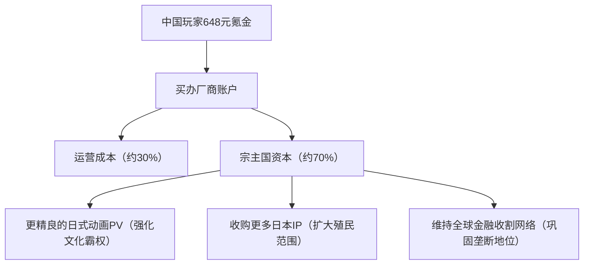
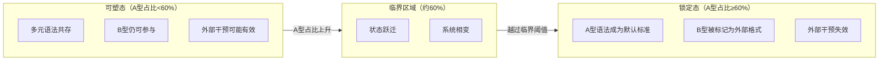
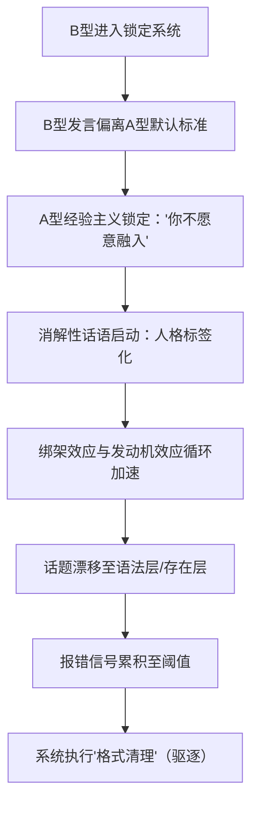
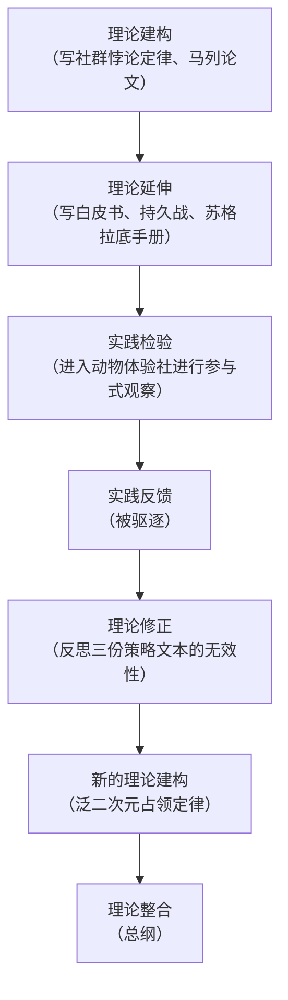

# 泛二次元总纲：文化生态的完整生命周期

## ——基于政治经济学批判、参与式观察与系统论的综合研究

### 摘要

本研究整合三篇核心文本——《文化帝国主义的当代形态及其运作机制》《泛二次元占领定律：文化生态相变与话语权垄断的结构性机制》《社群悖论定律：跨语法社群冲突的结构性机制研究》——构建“泛二次元文化生态完整生命周期”的理论框架。研究揭示：泛二次元是一个具有完整生命周期的文化生态系统，其运作可分为四个阶段——结构性前提阶段（社会原子化与社会达尔文主义高压制造的五重空缺）、攻破阶段（通过中性入口绕过防御，完成相变锁定）、锁定运作阶段（消解性话语、消息洪流与作者裹挟的三重维持机制）与不可逆终结阶段（驱逐必然与话语权垄断的永久固化）。该生命周期不依赖于任何“恶意策划”，而是资本逻辑、文化殖民机制与系统动力学的自动运转产物。研究进一步提出认识论突破：通过“中性入口”完成内部侦查所获得的“系统认知”，是唯一能够穿透话语权垄断的知识类型；“地图”与“武器”的战略区分，为锁定状态下的行动提供了根本性的方向矫正。本研究论证了防御的唯一窗口期位于临界阈值被越过之前，并提出了基于早期识别与预防的战略框架。

**关键词**：泛二次元；文化生态；完整生命周期；相变攻破；消解性话语；话语权垄断；实践论的实践

## 第一章 绪论

### 1.1 问题的提出

2026年7月，“四九拟说”微信公众号旗下“动物体验社”读者社群（成员约100人）发生了一起跨语法冲突事件。该社群公众号标签体系为“#科普漫画”“#动物科普”“#二次元”，比例为2:1，但实际成员构成中，二次元-漫画爱好者（A型，情感-共鸣语法）约占70%，科普受众（B型，逻辑-理性语法）仅占约30%。研究者本人以“科普-漫画二轴性”为中性入口进入该社群，在提出“怎么都是二次元-漫画爱好者，科普群众去哪里了？”的观察性提问后，触发了从“你什么意思”到“你太较真”“你冷漠”“你像AI”的消解性话语链条，最终被群管理员驱逐。社群创作者在事后私信中承认：“其实你的表达内容和立场我觉得没什么问题。”

这一事件并非孤立的个案，而是泛二次元文化生态更大规模扩张的微观缩影。在更宏观的尺度上，以下现象正在同步发生：

| 现象 | 数据 | 来源 |
| :--- | :--- | :--- |
| 泛二次元用户规模 | 5.03亿人，Z世代中占比95% | 行业报告（2025） |
| 谷子市场规模年增长率 | 超过40% | 行业报告（2025） |
| 一枚吧唧的物料成本与售价 | 成本0.5-2元，售价30-198元 | 产业链调研 |
| 总和生育率 | 1.09（2022），远低于2.1更替水平 | 国家统计局 |
| 结婚登记数 | 683万对（2022），36年来最低 | 民政部 |
| 国产二游叙事结构 | 普遍呈现“日式内核+中式UI”错位 | 文本分析 |
| 00-20后对日式模板的感知 | 无“外来感”，已内化为“精神母语” | 代际文化研究 |

上述现象并非彼此独立，而是同一系统——泛二次元文化生态完整生命周期——的不同输出端口。

### 1.2 研究定位与整合必要性

本研究是对三篇核心论文的系统性整合：

| 论文 | 核心贡献 | 方法论基础 | 回答的问题 |
| :--- | :--- | :--- | :--- |
| 《文化帝国主义的当代形态及其运作机制》 | 揭示结构性前提：社会原子化、社达高压、文化殖民、经济剥削 | 马克思主义政治经济学+后殖民理论 | 泛二次元为什么能扩张？ |
| 《泛二次元占领定律》 | 揭示攻破机制：相变攻破、中性入口、消解性话语、管理失察 | 参与式观察+亲身经历 | 泛二次元如何占领一个社群？ |
| 《社群悖论定律》 | 揭示锁定运作：十一律、绑架效应、驱逐必然 | 外部观察+理论建模 | 锁定后系统如何运作？ |

三篇论文分别回答了泛二次元文化生态在不同阶段的核心机制问题，但尚未形成统一的“完整生命周期”理论框架。本研究的总纲任务在于：

1. 将三篇论文的发现整合为一个统一的生命周期模型
2. 识别各阶段之间的因果连接与转化机制
3. 补充各阶段之间的逻辑链条与关键变量
4. 提炼完整的理论命题体系
5. 基于田野经验完成认识论层面的方法论总结

### 1.3 核心概念界定

| 概念 | 定义 | 理论来源 |
| :--- | :--- | :--- |
| **泛二次元** | 以ACGN（动画、漫画、游戏、轻小说）为核心载体、以日式审美模板为底层语法、通过跨媒介叙事与社群运营实现文化扩张的文化-经济复合体 | 综合定义 |
| **A型语法** | 情感-共鸣型底层认知-表达语法，以“感受→共鸣→归属”为认知路径 | 社群悖论定律 |
| **B型语法** | 逻辑-理性型底层认知-表达语法，以“观察→推导→验证”为认知路径 | 社群悖论定律 |
| **结构性空缺** | 社会原子化与社会达尔文主义高压在个体精神层面制造的五重空缺：情感、意义、归属、未来、尊严 | 马列论文系列 |
| **文化工业复合体** | 以资本积累为根本动力、以情感劳动为核心剥削对象的文化产业体系 | 马列论文系列 |
| **中性入口** | 内容与体裁分离结构形成的入场通道，能够同时被A型语法与B型语法系统接受 | 占领定律 |
| **相变攻破** | 系统状态发生非线性跃迁的占领过程，以A型占比越过约60%临界阈值为标志 | 占领定律 |
| **管理失察** | 社群管理团队缺乏对泛二次元渗透机制的识别能力，未能在临界点前采取防御措施 | 占领定律 |
| **消解性话语** | 不反驳发言内容、而取消“质疑”行为本身合法性的话语机制 | 占领定律 |
| **话语权垄断** | 单一语法系统成为社群中唯一合法的表达与评判标准的系统状态 | 占领定律 |
| **实践论的实践** | 理论→实践→失败→反思→修正理论的完整认知循环 | 田野经验的方法论总结 |

### 1.4 研究方法与伦理说明

本研究采用多方法整合的研究策略：

**第一，政治经济学分析。** 运用马克思主义政治经济学框架，考察泛二次元产业链的资本构成、利润分配机制与剩余价值转移路径。

**第二，参与式观察。** 研究者本人通过“科普-漫画二轴性”这一中性入口进入“动物体验社”社群，亲历了从进入到被驱逐的完整流程，获得了第一手的内部运作数据。

**第三，理论建模。** 基于田野经验与文本分析，建构“相变攻破”“消解性话语”“完整生命周期”等核心理论概念。

**第四，系统论整合。** 将三篇论文的发现整合为统一的“完整生命周期”模型，识别各阶段之间的因果连接与反馈循环。

**研究者立场说明：** 研究者是纯种B型（逻辑-理性语法）成员，在政治上持反对泛二次元的立场。进入社群前，研究者对泛二次元的认知仅来自新闻媒体与互联网舆论（含极端舆论）；进入社群后，研究者获得了对泛二次元内部运作机制的直接认知。这一“从外部描述到内部认知”的跃迁，是本研究认识论层面的核心突破。为控制立场偏差，本研究在分析中聚焦于可观察的互动模式与可验证的事件序列，对A型成员的行为分析采用“方法论移情”策略，尝试理解其在自身语法系统内的合理性。

**伦理措施：** （1）所有分析基于可验证的文本数据（聊天记录、私信截图）；（2）所有涉及个人身份的信息均已匿名化处理；（3）本研究不涉及对未成年人的伤害性操作；（4）研究者未在社群中发布任何违反平台规则的内容。

## 第二章 结构性前提：泛二次元扩张的社会基础

本章整合马列论文系列的核心发现，回答第一个问题：泛二次元文化生态为什么能够在一个社会中获得如此广泛的扩张？

### 2.1 社会原子化：传统纽带的瓦解与“共同体真空”

#### 2.1.1 理论溯源

“社会原子化”概念的理论脉络可追溯至涂尔干的“失范”（Anomie）理论。涂尔干在《自杀论》中指出，当传统的社会整合机制（宗教、家族、职业行会）瓦解时，个体将陷入缺乏道德约束与集体归属的状态，导致社会失范与心理危机的激增。涂尔干通过自杀率的社会分布数据论证了：个体的心理状态是社会组织结构的函数，而非纯粹的个人特质。

齐格蒙特·鲍曼在《流动的现代性》中进一步发展了这一理论脉络。鲍曼指出，现代社会从“固态”向“液态”转变——一切社会形式都在加速解体与重组，个体被迫独自面对不确定性的洪流，传统的共同体（家族、邻里、阶级）不再提供稳定的身份锚点。鲍曼将这一状态描述为“个体的孤独化”——人们聚集在一起，却无法形成真正的共同体。

在日本语境中，山田昌弘提出了“无关系社会”的概念，描述日本社会普遍存在的人际疏离：未婚率上升、家庭规模缩小、邻里交往消失、职场归属感下降。山田昌弘指出，这一社会背景正是日本ACG产业从20世纪90年代起进入黄金时代的结构性条件——它为“伪家庭”叙事提供了源源不断的市场需求。

#### 2.1.2 中国语境下的社会原子化进程

在中国，社会原子化是多股历史合力共同作用的结果：

**（1）城市化与人口大流动。** 改革开放以来，数亿人离开故土、离开家族网络，进入陌生的城市。传统的宗族、邻里关系因地理隔离而断裂。2023年中国流动人口规模达3.76亿，这意味着超过四分之一的人口处于“脱嵌”于原生社会网络的状态。这种“脱嵌”不仅是地理位移，更是社会关系的系统性断裂——个体的社会支持网络从多层次的（家族、邻里、单位）收缩为单层次的（同事、少数朋友），且这一单层次网络本身也具有高度流动性。

**（2）单位制的解体。** 计划经济时代的“单位”不仅是工作场所，更是包办一切的社会组织——提供住房、医疗、教育、养老、婚恋介绍乃至死后安置。20世纪90年代以来的市场化改革使“单位”的功能大幅萎缩，个体被推向市场，被迫独自面对生存风险。单位制解体后形成的制度真空，至今未被其他社会组织形式有效填补。

**（3）数字化的深度渗透。** 物理空间的人际交往持续萎缩，线上社交成为情感互动的主要渠道。然而，正如雪莉·特克尔在《群体性孤独》中所指出的，数字连接不等于真实连接——线上社交的本质是“弱连接”，它提供信息流通与表面的互动感，却无法提供真正的情感支持、安全感和归属感。线上社交的普及反而进一步削弱了个体进行深度面对面交往的能力与意愿。

**（4）家庭结构的巨变。** 独生子女政策（1979-2015）深刻重塑了中国家庭的代际结构——“4-2-1”家庭结构（四个老人、两个父母、一个孩子）使年轻一代承受着巨大的赡养压力，同时缺乏兄弟姐妹的横向情感支持网络。近年来的少子化趋势进一步弱化了家庭的情感功能，使家庭从“情感共同体”逐渐退化为“功能性单位”。

#### 2.1.3 “共同体真空”的市场化填补

社会原子化的直接后果，是产生了一个庞大的、未被满足的“共同体需求”——即社会学术语中的“归属需求”与“情感安全需求”。

人类是社会性动物。马斯洛需求层次理论将“归属与爱”置于仅次于生存与安全的核心位置。当传统的社会结构（家族、单位、邻里）不再能提供这些时，个体就会像饥饿的人寻找食物一样，急切地寻找替代性的“共同体”。而市场——尤其是文化市场——以极高的效率和极低的成本，精确填补了这一真空。

关键认识在于：这种填补不是“中性的”。市场提供的“共同体替代品”并非真正的社会联结，而是被商品化了的情感体验。它给予个体的不是“真实的相互义务与支持”，而是“被爱、被接纳、被看见”的幻象——而这种幻象的供应，是被资本定价和控制的。原子化个体从“真实的相互义务关系”中被释放出来，却被重新捕获为“付费的情感消费者”。

### 2.2 社会达尔文主义高压：持续竞争与心理创伤

#### 2.2.1 社会达尔文主义的概念与批判

社会达尔文主义将“优胜劣汰、适者生存”的生物进化逻辑应用于人类社会秩序的解释与辩护。其核心意识形态命题包括：

- “强者理应获胜，弱者应当淘汰”——将社会不平等自然化、合法化
- “个体对其命运负全部责任”——否认结构性因素对个体处境的影响
- “竞争是人类进步的唯一动力”——将社会关系简化为竞争关系

理查德·霍夫施塔特在《美国生活中的社会达尔文主义》中系统批判了这一意识形态，指出它是资本主义剥削最有力的辩护工具：它将“赢家通吃”的社会秩序表述为“自然规律”，从而为社会不平等披上了“科学”的外衣。

#### 2.2.2 中国语境下的社达高压

在中国，社会达尔文主义虽未被正式确认为意识形态，但其压力以极为具体的方式渗透到社会生活的各个层面：

**（1）教育领域的极端竞争。** 从幼儿园入园到高考，全程淘汰制。“不要输在起跑线上”成为支配中国家庭的核心焦虑。2024年全国高考报名人数达1342万，而“985”高校录取率仅约1.5%——这意味着绝大多数学生在每一轮筛选中都将体验“被淘汰”的挫败感。中考分流政策更早地将一半青少年标记为“不适合学术道路”的群体。这一竞争机制从个体童年期即开始制造“不够好”的自我认知。

**（2）职场的内卷化。** 996工作制、35岁危机、绩效强制排名、末位淘汰——每个劳动者都处于持续的被评估状态。劳动过程被彻底量化，个体的“有用性”随时可能被判定为“不足”。数字平台更通过算法将竞争推向极致：外卖骑手的配送时间被压缩到秒级，网约车司机的评分直接决定收入。劳动者从“被剥削”进一步沦为“被算法优化”。

**（3）社会保障的个体化。** 医疗、教育、住房的压力主要由个人（及家庭）承担。高昂的房价使年轻人面临“掏空六个钱包”的沉重负担，而社会安全网的薄弱意味着一旦失业或患病，个体可能迅速跌入困境。风险被个体化，而个体缺乏抵御风险的组织化工具。

**（4）话语体系的冷漠化。** “奋斗”“狼性”“淘汰”“优化”成为主流词汇，“情绪价值”被工具化为可计算的服务。情感表达被视为“软弱”或“矫情”，个体的心理痛苦被归因为“不够努力”或“心态不好”。这一话语体系进一步压制了情感需求的正当表达渠道。

#### 2.2.3 社达高压的心理后果与市场转化

社达高压持续作用下的心理后果，可以用“结构性创伤”来概括：

| 心理后果 | 具体表现 | 数据佐证 |
| :--- | :--- | :--- |
| 低自尊的普遍化 | 在无休止的比较与竞争中反复体验“自己不够好” | 教育焦虑指数持续高位 |
| 情感压抑的强制化 | 表达情感需求被视为“矫情”或“弱者心态” | 心理咨询需求激增但求助率低 |
| 被工具化的持续体验 | 个体始终被要求成为“有用的工具” | 职场倦怠感普遍化 |
| “无条件接纳”的极度匮乏 | 所有爱都是有条件的——“你必须优秀，才配被爱” | “不优秀不配活”话语的流行 |

这些心理状态的市场转化逻辑是清晰且系统的：社达高压制造了一个规模庞大的“心理受伤群体”，其情感需求（被接纳、被认可、被无条件地看见）在现实中得不到满足，从而形成了一个巨大的消费市场——为任何能够提供“无条件接纳”体验的商品或服务准备好了支付意愿。

### 2.3 五重结构性空缺的形成

上述社达环境的系统性运转，产生了五重结构性空缺。这些空缺不是“偶然的空白”，而是资本积累过程在精神领域的必然产物。

| 空缺维度 | 定义 | 具体表现 | 数据佐证 |
| :--- | :--- | :--- | :--- |
| **情感空缺** | 真实情感连接被切断后的孤独状态 | 原子化社会导致的情感孤立 | 城市居民“经常感到孤独”比例超过40% |
| **意义空缺** | “为什么而活”被“怎么活下来”取代的意义真空 | 人被异化为“劳动力”“资源” | 18-35岁青年“感到生活没有意义”比例超过35% |
| **归属空缺** | 传统与现代归属单元双重瓦解后的无根状态 | 宗族瓦解、单位解体、邻里消失 | 流动人口3.76亿，“空巢青年”超过5800万 |
| **未来空缺** | 代际传承图景成为奢望后的未来真空 | 购房无望、婚育无望、养老无望 | 总和生育率1.09，初婚年龄接近30岁 |
| **尊严空缺** | “你不干有的是人干”逻辑下的尊严否定 | 劳动者被系统性地否定尊严 | 一线城市劳动者“感到不被尊重”比例超过45% |

### 2.4 结构性空缺的指向性与接口性

结构性空缺不仅是“需要被填补的空白”，更是具有明确“指向性”和“接口性”的结构——它们会主动寻找填补物，且优先选择那些能够同时覆盖全部五个维度的“全光谱产品”。

**指向性的运作机制：** 五重空缺构成了一套筛选机制——只有能够同时触达情感、意义、归属、未来、尊严五个维度的文化产品，才能获得高强度、高粘度的用户投入。单一维度的产品（如仅提供知识的信息产品、仅提供娱乐的消遣产品）无法形成结构性锁定。

**接口性的运作机制：** 文化工业复合体的产品设计是对五重空缺的“精确制导”——每一个设计决策（角色的萌点、剧情的走向、消费的机制）都可以在五重空缺中找到对应坐标。一旦“接入”完成，用户就从一个“需要被填补的人”变成了一个“系统的一部分”。

### 2.5 文化工业复合体的精确对接

| 空缺维度 | 泛二次元提供的“填补” | 具体机制 | 用户状态转化 |
| :--- | :--- | :--- | :--- |
| 情感空缺 | 纸片人“无条件爱着”的幻象 | 角色好感度系统、羁绊剧情、“永远陪着你”叙事 | 从“孤独个体”到“被爱者” |
| 意义空缺 | “为爱发电”被赋予“守护梦想”的意义 | 粉丝叙事、应援文化、“羁绊”话语体系 | 从“无意义劳动者”到“意义守护者” |
| 归属空缺 | “我们是一起的”伪共同体 | 社群、圈层、“非谷勿扰”身份门槛 | 从“原子”到“圈层成员” |
| 未来空缺 | 角色的“成长”替代性未来实现 | 养成系统、追番周期、角色成长叙事 | 从“没有未来的人”到“见证成长的人” |
| 尊严空缺 | “核心粉”身份提供被承认感 | 消费层级、晒单文化、圈内地位分级 | 从“不被尊重的人”到“被承认的粉丝” |

### 2.6 “日式内核+中式UI”：文化殖民的当代形态

#### 2.6.1 “日式内核”的三重支柱

对头部国产二游（以《原神》《明日方舟》《鸣潮》等为代表）的文本分析显示，其叙事底层完全承袭了日式ACG的三大模板：

**（1）世界系叙事：社会结构的悬置。** “世界系”是日本ACG评论界用以描述20世纪90年代以来特定叙事类型的术语，其典型特征为：将世界存亡的命运直接系于主角与少数同伴的个人情感关系，而中间层的社会结构（国家、阶级、制度、组织、历史进程）则被悬置或忽略。《新世纪福音战士》是这一叙事类型的奠基之作。国产头部二游全面继承了这一语法——《原神》的主线驱动力是“寻找失散的亲人”这一高度私人化的动机，提瓦特大陆虽有七国、有神明、有政治组织，但所有宏观结构在剧情高潮处均退居背景；《明日方舟》虽以“感染者的社会抗争”为表层主题，但其叙事重心始终落在“罗德岛”这一小团体内部的羁绊关系上。

**（2）羁绊美学：情绪对理性的殖民。** 在国产二游的剧情高潮处，危机的解决几乎从不依靠战略谋划、制度动员或科技攻关，而依靠“回忆杀”“同伴的呼喊”“内心的觉醒”等情绪爆发式的情节装置。这是日式“根性論”（精神至上主义）的当代翻版。日本文化批评家柄谷行人在《日本现代文学的起源》中指出，日本近现代文学中存在一种“内面性”的偏向——将一切社会矛盾最终还原为个体的心理问题。这一传统在战后ACG产业中被进一步强化。

**（3）拟似家族：血缘与社会关系的双重消解。** 日本社会学家山田昌弘将日本当代社会的“家庭危机”描述为“血缘关系的弱化”与“地缘关系的断裂”。在这一背景下，ACG产业提供了大量“无血缘的情感共同体”——同伴、公会、舰队、学院——作为“家庭替代品”。国产二游的角色关系网络完全沿袭了这一设计哲学：所有可玩角色最终都指向“以玩家（主角）为核心的好感度系统”；角色的意义不在于其在社会结构中的功能（如医生、军人、学者），而在于其对主角的“情感可用性”。

#### 2.6.2 “中式UI”的三重功能

头部厂商的策略是极为精密的：在视觉、音乐、节日活动等“表层”植入中国文化符号——汉服元素、飞檐斗拱的建筑、古筝与二胡的配乐、春节/中秋主题的活动、文言文台词——在叙事逻辑、角色塑造哲学与情感驱动模型等“深层”则完整保留日式模板。

这种“换皮不换核”的策略，在殖民史上早有先例。殖民者往往允许被殖民者保留语言、服饰、节日、饮食等“无害”的文化形式，以换取其对殖民秩序核心——政治制度、经济体系与价值观——的接受。霍米·巴巴将这一现象称为“模拟”（mimicry）。

“中式UI”的三重功能：

| 功能 | 具体表现 | 效果 |
| :--- | :--- | :--- |
| **提供合法身份** | 视觉符号的“中国性”提供“国产原创”标签 | 获得政策扶持、税收优惠与消费者文化认同 |
| **制造虚假融合** | “国风美学”表层覆盖使殖民性被遮蔽 | 玩家在“文化自豪”中消费日式叙事模板 |
| **赋予附加价值** | “支持国产”的道德满足感与身份自豪感 | 提高品牌溢价与用户忠诚度 |

#### 2.6.3 文化霸权的内化机制

葛兰西在《狱中札记》中指出，资产阶级的统治不仅依靠强制机器（军队、警察、法院），更依靠“文化霸权”——即通过教育、媒体、文化生产等渠道，使被统治阶级自愿接受统治阶级的价值体系，并将之视为“自然的”和“普遍的”。

在泛二次元领域，文化霸权经历了以下内化阶段：

| 阶段 | 时间范围 | 核心机制 | 关键表现 |
| :--- | :--- | :--- | :--- |
| **审美标准的输入** | 1990-2005 | 日本动画/漫画通过电视、盗版书刊大规模进入中国市场 | “好看的动画”等同于“日本动画”的认知形成 |
| **评判体系的内化** | 2005-2015 | 网络社区、B站、贴吧等平台形成以日式ACG为基准的话语体系 | 国产作品以“像不像日漫”为评判基准 |
| **文化无意识的形成** | 2015-至今 | 00-20后在泛二次元环境中成长，日式模板成为唯一的“二次元母语” | “二次元”与“日式”被感知为不可分割的概念 |

当这一内化完成时，文化霸权就进入了最稳固的形态：被统治者不仅接受了统治者的价值观，而且主动维护之——因为他们已无法区分“外来输入的价值”与“自己的真实感受”。

### 2.7 三层代理结构

列宁在分析帝国主义时特别关注“殖民地官僚体系”的功能——宗主国通过培养本地代理人实施间接统治，降低了治理成本，并制造了“本地人管理本地人”的合法性幻象。在泛二次元领域，这一结构以“宗主国—总督—买办—伪军”的形态完整呈现：

| 层级 | 角色 | 职能 | 核心机制 |
| :--- | :--- | :--- | :--- |
| **宗主国** | 日本ACG产业综合体、跨国娱乐资本 | 制定“日式内核”标准，收取IP授权费与金融收益 | 文化定义权垄断 |
| **总督** | 跨国集团中国区负责人、绑定日系产业链的大资本创始人 | 统筹“日式内核”的本地化落地，确保殖民体系稳定 | 决策权与人事权 |
| **买办** | 国内头部二游厂商、IP代理商、周边渠道商 | 将“日式内核”翻译为“中式UI”，建立本地化收割网络 | 语法翻译与风险隔离 |
| **伪军** | 核心玩家、KOL、社区管理员、测评媒体 | 维护“日式审美正统性”，镇压“文化不服从者” | 话语权巡逻与除籍 |

### 2.8 和平演变的代际时间线

毛泽东同志在分析帝国主义对社会主义国家的“和平演变”战略时指出：“帝国主义说，对于我们的第一代、第二代没有希望，第三代、第四代怎么样？有希望。”这一判断揭示了文化渗透与意识形态变迁的长周期特征。

| 代际 | 出生年份 | 二次元接触史 | 文化认同特征 | 与殖民体系的关系 |
| :--- | :--- | :--- | :--- | :--- |
| **第一代** | 1970-1985 | 通过电视动画初次接触日漫 | 本土叙事为“主”，日漫为“客” | 可区分“外来”与“本土” |
| **第二代** | 1985-1995 | 通过盗版漫画/网络资源深度浸染 | “二次元”成为独立审美范畴 | 可区分但已习惯共存 |
| **第三代**（关键世代） | 1995-2005 | 网络ACG伴随成长；国产二游兴起 | 日式模板内化为“二次元”唯一标准 | 已无法自觉区分 |
| **第四代**（完成世代） | 2005-2020 | 国产二游是“原生”环境；从未经历“无二次元”的世界 | 日式内核与“国产”标签完全融合 | 完全内化——殖民逻辑已与自我认同不可分割 |

第四代的文化特征是“根植性”而非“选择性”。对于这一代人来说，“日式内核+中式UI”不是“殖民”的产物，而是“母语”。他们不像老一辈需要“学习”二次元的语法——他们生来就在这套语法中思考、表达、感受。

### 2.9 经济剥削的三重结构

#### 2.9.1 垄断资本的金字塔结构

在泛二次元产业链中，资本呈现出鲜明的金字塔结构：

| 层级 | 角色 | 利润来源 | 利润率特征 |
| :--- | :--- | :--- | :--- |
| **顶端：金融垄断资本** | IP持有方、跨国娱乐资本 | IP授权费、抽卡金融化、跨境资本运作 | 极高（占总利润70%以上） |
| **中端：买办资本** | 国内头部厂商、渠道商 | 本地运营与分发分成 | 中等（占总利润15-30%） |
| **底端：实体制造资本** | 中小代工厂、手工作坊 | 实体商品制造 | 极低（占总利润5%以下） |

#### 2.9.2 剩余价值的三重剥削机制

| 剥削层次 | 被剥削主体 | 剥削方式 | 剥削产物 |
| :--- | :--- | :--- | :--- |
| **第一重** | 画师、文案、程序员 | 996/007工时、AI替代压力、“热爱税”自我剥削 | 数字内容（角色、剧情、代码） |
| **第二重** | 代工厂工人、手工艺人 | 极低计件工资、有毒作业环境、零劳动保障 | 实体商品（徽章、手办、服装） |
| **第三重** | 小工厂主 | 长账期垫资（6个月）、利润趋零化（3-5%）、风险完全转嫁 | 被榨干的现金流与高负债 |

#### 2.9.3 剩余价值的三级转移路径

### 2.10 本章小结

本章论证了泛二次元文化生态扩张的“需求侧”结构性前提：社会原子化制造的“共同体真空”与社会达尔文主义高压制造的“心理创伤群体”，共同构成了五重结构性空缺（情感、意义、归属、未来、尊严）。文化工业复合体以“日式内核+中式UI”的错位结构提供精确填补，通过三层代理结构维持文化霸权，通过代际扎根完成和平演变，通过三重剥削实现剩余价值转移。没有这些结构性前提，泛二次元的吸引力不会如此巨大；没有这些维持机制，泛二次元的扩张不会如此不可逆。

## 第三章 攻破机制：泛二次元如何占领一个社群

本章整合《泛二次元占领定律》的核心发现，回答第二个问题：泛二次元文化生态如何从一个“外部文化生态”转变为一个“社群内部的默认标准”？

### 3.1 入口控制：第一道防线

泛二次元社群的第一道防线是**入口控制**。入口控制通过以下机制运作：

| 控制机制 | 具体操作 | 筛选功能 |
| :--- | :--- | :--- |
| **邀请制** | 要求进入者有内部成员引荐 | 建立“熟人推荐”的信任链条 |
| **审核制** | 对申请者进行身份与动机审查 | 筛除“明显的外部威胁” |
| **推荐制** | 使新人的身份可追溯至推荐人 | 建立责任链条，抑制异常行为 |

实证发现：纯种B型（逻辑-理性语法）成员无法通过入口控制直接进入泛二次元社群。入口控制系统性地排除了所有“明确的非A型”。这意味着：

1. 外部观察者无法从内部了解泛二次元的运作机制
2. “明显的外部批评”在进入之前即被阻断
3. 唯一可能的进入方式是通过一个“中性入口”

### 3.2 中性入口：内容与体裁分离的渗透通道

#### 3.2.1 案例中的中性入口结构

本案例中的中性入口是**“科普-漫画二轴性”**：

| 轴 | 对B型（科普受众）的意义 | 对A型（二次元受众）的意义 |
| :--- | :--- | :--- |
| “科普”轴 | 内容指向，提供进入的正当性 | 可接受但不产生吸引力 |
| “漫画”轴 | 可忽略（B型的体裁中立特性） | 体裁吸引，提供进入的驱动力 |
| **结合效应** | B型认为“这里有科普内容” | A型认为“这里有漫画内容” |

#### 3.2.2 内容与体裁分离作为中性入口的存在基础

中性入口得以运作的根本条件是**内容与体裁分离**：

- 内容层面（“科普”）：指向B型语法系统，提供进入的“正当理由”
- 体裁层面（“漫画”）：指向A型语法系统，提供进入的“实际驱动力”

B型因为“体裁中立”而不将“漫画”形式识别为警报信号——他们关注的是“科普”内容，而非“漫画”形式。A型因为“体裁敏感”而被“漫画”形式吸引——他们关注的是视觉呈现，而非科普内容。

同一标签（“科普漫画”），在两种语法系统中产生了完全不同的解码结果。这种“解码不对称”使中性入口得以运作：B型认为自己在进入一个“科普空间”，A型认为自己进入了一个“漫画空间”。双方在入场阶段即已产生认知错位，而这一错位在后续的社群运作中持续存在。

#### 3.2.3 中性入口的普遍性含义

“科普-漫画二轴性”不是唯一的中性入口类型。基于同样的结构逻辑（内容与体裁分离），以下结构同样可能成为中性入口：

| 中性入口类型 | 内容层（对B型有效） | 体裁层（对A型有效） |
| :--- | :--- | :--- |
| 教育-娱乐型 | 教育内容 | 娱乐形式 |
| 技术-视觉型 | 技术讨论 | 视觉呈现 |
| 学术-叙事型 | 学术分析 | 叙事吸引 |
| 社会-情感型 | 社会议题 | 情感共鸣 |

**理论命题1**：**中性入口是泛二次元占领得以启动的结构性前提。没有中性入口，外部观察者无法进入锁定系统——因为入口控制系统性排除了非A型成员。中性入口的存在基础是“内容与体裁分离”——B型因体裁中立而不识别警报信号，A型因体裁敏感而被体裁形式吸引。**

### 3.3 相变攻破：从线性渗透到状态跃迁

#### 3.3.1 线性渗透模型与相变模型的对比

| 维度 | 线性渗透模型（传统理解） | 相变攻破模型（本研究发现） |
| :--- | :--- | :--- |
| 变化模式 | A型逐渐增多，渐近变化 | A型占比越过临界阈值时发生状态跃迁 |
| 时间特征 | 缓慢、渐进、可观察 | 非线性、突变、难以预警 |
| 可逆性 | 理论上可逆 | 锁定后不可逆转 |
| 外部干预 | 干预可能有效 | 锁定后外部干预在结构层面失效 |
| 可预测性 | 相对可预测 | 临界点前缺乏明显预警信号 |

#### 3.3.2 临界阈值与状态跃迁

基于参与式观察，本研究识别出约60%的临界阈值：

**理论命题2**：**泛二次元占领的临界阈值约为60%。一旦A型成员占比越过此阈值，系统即从“可塑态”进入“锁定态”，这一跃迁是不可逆的。**

### 3.4 管理失察：初始构成不决定终局

#### 3.4.1 推论的提出

基于对泛二次元渗透机制的深入分析，本研究提出核心推论：

**即使一个社群在最开始由技术向/理性向（B型）成员占据统计学多数，如果管理团队缺乏对泛二次元渗透机制的识别能力，该社群仍然会被泛二次元攻破。**

#### 3.4.2 攻破路径（B型初始占多数场景）

| 阶段 | A型占比 | 状态 | 管理团队状态 | 关键机制 |
| :--- | :--- | :--- | :--- | :--- |
| 阶段1：初始状态 | <20% | B型占绝对多数，以技术讨论为主 | 无警觉 | 技术向社群的正常运作 |
| 阶段2：缓慢渗透 | 20-40% | A型通过中性入口缓慢进入，以“轻松讨论”“视觉分享”名义出现 | 未识别渗透信号 | 渗透的“无害化”外观 |
| 阶段3：管理失察 | 40-55% | A型比例逐渐上升，消解性话语开始零星出现 | 仍认为“不影响主要讨论” | B型的“体裁中立”盲区 |
| 阶段4：临界点到达 | 55-65% | A型占比接近临界阈值，但未被管理团队察觉 | 仍未采取防御措施 | 临界点的“隐蔽性” |
| 阶段5：锁定完成 | >65% | A型语法成为默认标准，技术讨论被边缘化 | 发现时已无法逆转 | 统计学锁定的自动完成 |
| 阶段6：不可逆转 | >70% | 系统进入锁定状态，任何“逆转”尝试都被自动清理 | 外部干预在结构层面失效 | 驱逐必然的启动 |

#### 3.4.3 管理失察的成因分析

| 成因 | 具体机制 | 后果 |
| :--- | :--- | :--- |
| 渗透的“无害化”外观 | 早期阶段行为表现为“分享好看的图”“聊喜欢的角色”，在技术社群中容易被归类为“正常社交” | 不会被识别为“文化攻破的早期信号” |
| B型的“体裁中立”盲区 | B型成员关注“内容”（科普/技术）而非“形式”（漫画/二次元），不认为体裁本身是威胁 | 缺乏对“体裁作为渗透工具”的识别能力 |
| 消解性话语的“渐进性” | “你太较真了”等话语并非突然出现，而是逐渐“习惯化” | 管理团队在渐进过程中未意识到“默认标准已转移” |
| 临界点的“隐蔽性” | 临界点不是“事件”而是“状态”——社群不会“宣布”自己进入锁定状态 | 可能在A型占比超过70%时仍认为“社群还是原来的社群” |

**理论命题3**：**初始构成不决定终局。防御的关键变量不是“初始构成”，而是“管理团队的识别能力”——是否能在临界点前识别中性入口、消解性话语的早期信号、以及A型占比的变化趋势。**

### 3.5 统计学锁定与经验主义锁定

#### 3.5.1 统计学锁定

当A型占比超过临界阈值时，A型语法自动成为“默认标准”。“默认标准”不同于“主流意见”——它是一套“什么是正常的表达方式”的底层规定：

| 问题 | 由谁定义 | 定义方式 |
| :--- | :--- | :--- |
| 什么是正常的交流方式？ | A型（自动） | 统计学多数自动成为规范 |
| 什么是合理的提问？ | A型（自动） | 偏离A型语法的提问被标记为“异常” |
| 什么是可以被讨论的内容？ | A型（自动） | 非A型话题被边缘化 |
| 什么是应该被驱逐的行为？ | A型（自动） | 持续偏离A型语法的行为被标记为“干扰” |

**A型不需要“争夺”话语权——话语权在统计学锁定完成时，已经被“锁定”为A型的默认属性。**

#### 3.5.2 经验主义锁定

经验主义锁定的核心机制是：

A型成员以自身经验为唯一标准，将“无法解析B型信号”归因为“B型不愿意融入”而非“架构不兼容”。

典型案例（来自本研究的田野记录）：

| B型发言 | A型成员的反应 | 归因逻辑 |
| :--- | :--- | :--- |
| “科普内容在哪里？” | “你什么意思？” | 提问本身被视为可疑 |
| “我只是观察到……” | “你太较真了” | 观察行为被转化为人格缺陷 |
| “我再说清楚一点……” | “我们都能融入，你为什么不行？” | 结构不兼容被归因为“不愿意” |

**理论命题4**：**经验主义锁定是消解性话语的认知基础。A型之所以持续输出消解性信号，是因为其经验主义认知框架将“无法解析”误判为“不愿意”，从而赋予了消解行为的“正当性”——A型成员相信自己是在“帮助B型改正态度”。**

### 3.6 本章小结

本章论证了泛二次元如何完成对一个社群的“占领”：通过入口控制建立第一道防线、通过中性入口（内容与体裁分离）绕过防线进入内部、通过相变攻破（A型占比越过约60%临界阈值）完成状态跃迁、通过统计学锁定与经验主义锁定固化A型语法的默认标准地位。管理团队的识别能力是防御的核心变量——初始构成不决定终局。

## 第四章 锁定运作：占领完成后的系统行为

本章整合《社群悖论定律》的核心发现，回答第三个问题：占领完成后，系统如何维持锁定状态并排除异类？

### 4.1 底层语法不兼容

A型（情感-共鸣）与B型（逻辑-理性）的底层语法指令集存在结构性差异：

| 维度 | A型：情感-共鸣语法 | B型：逻辑-理性语法 |
| :--- | :--- | :--- |
| CPU架构 | 情感指令集（ARM-等效） | 逻辑指令集（x86-等效） |
| 编译器 | 情感编译器 | 逻辑编译器 |
| 密码本 | 情感密码本（黑话、梗、表情包） | 逻辑密码本（术语、逻辑连接词） |
| AST生成 | 情感AST（情绪/共鸣节点） | 逻辑AST（命题/证据/结论节点） |
| 生态类型 | 内生态（默认拒绝外部格式） | 开放生态（默认兼容外部格式） |
| 有效性标准 | “有共鸣吗？”“氛围对吗？” | “有证据吗？”“逻辑通吗？” |
| 对异类的报错信息 | “冷漠/抬杠/像AI” | “情绪化/不严谨” |

**理论命题5**：**A型与B型的差异是“硬件级”的——A型无法原生解析B型的逻辑信号（将其翻译为“冷漠/抬杠”），B型也无法原生输出A型的情感信号。这种不兼容不是“态度问题”，而是“架构问题”。**

### 4.2 绑架效应与发动机效应

#### 4.2.1 绑架效应

绑架效应的核心机制是：

A型输出的“制动信号”（如“你太杠了”“你冷漠”“你像AI”）在B型系统中被结构性“翻译”为“加速信号”（如“我需要解释得更清楚”）。

| 轮次 | A型输入（制动信号） | B型逻辑编译器的处理 | B型输出 |
| :--- | :--- | :--- | :--- |
| 第1轮 | “你什么意思？” | 查表转译为“对方认为我的提问有问题” | “我不是那个意思，我只是观察到……” |
| 第2轮 | “你太较真了” | 查表转译为“对方认为我的态度有问题” | “我不是较真，我只是在陈述观察……” |
| 第3轮 | “你冷漠，像AI” | 查表转译为“对方认为我的表达方式有问题” | “我再说清楚一点，首先……其次……因此……” |

**理论命题6**：**B型并非“选择”加速，而是被A型的制动信号“绑架”着加速。在B型的逻辑编译器中，每一轮制动信号都是一个新的输入，驱动其输出更密集的逻辑AST。**

#### 4.2.2 发动机效应

发动机效应的核心机制是：

B型的逻辑编译器在收到输入信号后自动运转、不可中断。输入信号持续存在→逻辑编译器持续运行→输出持续密集化。

发动机效应的关键特征：

| 特征 | 具体表现 |
| :--- | :--- |
| **自动性** | B型不需要“决定”回应——逻辑编译器在收到输入信号后自动启动 |
| **不可中断性** | 只要输入信号持续存在，逻辑编译器就持续运行 |
| **累积性** | 每一轮输入都使输出更密集、更长、更结构化 |
| **文化不自觉** | B型不认为自己在“发动机效应”中运转——他认为自己在“正常讨论” |

**理论命题7**：**B型“越认真解释”不是性格问题，而是逻辑编译器在持续输入下的自动输出。B型不是在“选择踩油门”，而是被制动信号“绑架”着踩油门。**

### 4.3 话题漂移

话题漂移的核心机制是：

绑架效应必然导致讨论话题从“内容层”漂移到“人格层”再到“语法层”。一旦到达“语法层”，距离原始话题产生“维度级”偏离，且无法自然返回。

| 阶段 | 话题状态 | B型发言 | A型回应 | 语义距离 |
| :--- | :--- | :--- | :--- | :--- |
| 阶段1：内容层 | 结构反思 | “科普内容在哪里？” | “你什么意思？” | 基准 |
| 阶段2：人格层 | 讨论对象部分转为“B型这个人” | “我只是观察到……” | “你太较真了” | 中等偏离 |
| 阶段3：语法层 | 讨论对象转为“B型的说话方式” | “我再说清楚一点……” | “你冷漠，像AI” | 指数偏离 |
| 阶段4：存在层 | 驱逐执行 | （被驱逐） | “引发很坏的影响” | 维度级偏离 |

**理论命题8**：**话题漂移使原始话题被彻底遗忘，冲突失去任何理性的锚点。一旦到达“语法层”，距离原始话题产生“维度级”偏离，且无法自然返回——因为“返回”需要双方承认“我们偏离了话题”，而消解性话语恰恰取消了“承认偏离”的可能性。**

### 4.4 消解性话语的三类操作

基于案例文本分析，本研究识别出消解性话语的三类操作：

#### 4.4.1 类型一：人格标签化

| 操作 | 示例 | 话语机制 | 效果 |
| :--- | :--- | :--- | :--- |
| **较真化** | “你太较真了” | 将“逻辑追问”重新编码为“人格缺陷” | B型的提问资格被取消 |
| **冷漠化** | “你冷漠，像AI” | 将“理性表达”重新编码为“非人特质” | B型被排除出“人类交流”的范畴 |
| **杠文化** | “你就是来杠的” | 将“质疑”重新编码为“恶意行为” | B型的动机被预设为负面 |

#### 4.4.2 类型二：话题私有化

| 操作 | 示例 | 话语机制 | 效果 |
| :--- | :--- | :--- | :--- |
| **个人化** | “这只是个人喜好” | 取消讨论的公共性，将其定义为“私人事务” | 结构性分析被去合法化 |
| **去结构化** | “你想多了” | 切断局部现象与整体结构的连接 | 结构性批判被消解为“过度解读” |
| **反政治化** | “别上纲上线” | 将结构性分析重新编码为“政治化” | 批判性话语被预先否定 |

#### 4.4.3 类型三：立场前置化

| 操作 | 示例 | 话语机制 | 效果 |
| :--- | :--- | :--- | :--- |
| **动机怀疑** | “你什么意思？” | 预设提问者的恶意动机 | B型被迫进入“自证清白”的防御姿态 |
| **身份否定** | “你不是自己人” | 取消B型的发言资格 | B型被排除出“有资格说话”的范畴 |
| **驱逐合法化** | “引发很坏的影响” | 将驱逐表述为“维护秩序”的必要措施 | 驱逐被建构为“正当的”而非“攻击性的” |

**理论命题9**：**消解性话语不攻击“内容”——它攻击“说话的行为本身”。当“你太较真了”被说出时，它不是在说“我不同意你的观点”——它是在说“你不应该这样说话”。被消解者无法通过“提供更多证据”来“反驳”——因为反驳本身在消解性话语框架内被预设为“进一步的异常”。**

### 4.5 消息洪流：物理层的噪声墙

#### 4.5.1 消息洪流的产生

当A型占多数且高频互动时，社群自然产生“消息洪流”——数十上百条消息/分钟，话题切换极快，上下文连续性低。

消息洪流的产生原因：

| 原因 | 机制 |
| :--- | :--- |
| **A型语法的高频特性** | 情感-共鸣型交流倾向于短句、表情包、即时反应，单位时间消息量高于逻辑-理性型交流 |
| **A型占比优势** | A型成员越多，单位时间内的消息总量越大 |
| **正反馈循环** | 洪流吸引更多A型参与，进一步加速洪流；B型因无法跟上节奏而减少发言，进一步降低B型信号的存在感 |

#### 4.5.2 消息洪流的系统功能

| 功能 | 机制 | 效果 |
| :--- | :--- | :--- |
| **信号淹没** | 低频信号（B型发言）被高频信号（A型发言）淹没 | B型发言在物理层面无法被“看见” |
| **上下文断裂** | 话题切换极快，深度讨论无法在同一话题上持续超过数分钟 | B型无法完成需要连续论证的结构性发言 |
| **治理盲区** | 创作者/管理员无法实时阅读所有消息内容 | 无法在冲突初期介入纠偏 |
| **驱逐加速** | 冲突在数小时内爆发并执行驱逐 | B型在完成任何“逆转”尝试之前即被清除 |

**理论命题10**：**消息洪流是一种“物理层”的话语权垄断维持机制。它在治理者与异见者之间建立了一道“不可穿透的噪声墙”，使任何试图通过“讲道理”来逆转锁定的尝试，在结构层面被预先排除——不是因为“道理不对”，而是因为“道理无法被送达”。**

### 4.6 作者裹挟：双编译器用户的公域困境

#### 4.6.1 公域与私域的分裂模式

本案例中，社群创作者（“四九拟说”主理人）的行为呈现出公域沉默、私域补偿的分裂模式：

| 维度 | 公域行为 | 私域行为 |
| :--- | :--- | :--- |
| 对B型发言的阅读 | 未表态（可能未阅读，被洪流淹没） | 事后翻看记录并承认B型的正确性 |
| 对B型内容的评价 | 未表态 | “其实你的内容我觉得没什么问题” |
| 对驱逐的干预 | 未干预群管理员的驱逐决定 | 私信承认被驱逐者的价值 |
| 对B型建议的采纳 | 未在公域提及 | “已经在做版权工作了” |

#### 4.6.2 作者裹挟的形成机制

作者裹挟的形成原因可归纳为三个层面：

| 层面 | 机制 | 效果 |
| :--- | :--- | :--- |
| **统计学压力** | A型占70%-80%，公开支持B型意味着得罪多数 | 创作者无法在公域中表达对B型的认同 |
| **治理逻辑** | 群管理已执行驱逐，作者公开推翻会削弱治理权威 | 创作者在“维护权威”与“保护B型”之间选择前者 |
| **语法限制** | B型编译器在公域中被禁用——无法用B型语法为B型辩护 | 即使试图“客观”表达，在A型情感编译器中也会被翻译为“偏袒异类” |

**理论命题11**：**创作者作为双编译器用户（能同时理解A型和B型语法），在公域中被结构性降级为单编译器用户（只能执行A型语法指令），仅在私域中才能运行第二编译器。这不是“不作为”——这是锁定状态下双编译器用户的结构性困境。**

### 4.7 驱逐必然

在上述机制叠加下，驱逐成为系统的自动输出：

**理论命题12**：**驱逐不是“恶意”的惩罚，而是系统的“格式清理”程序。驱逐不仅是“把人赶出去”——它是“消除痕迹，仿佛这个人从未存在过”。驱逐的“合法性”由消解性话语预先建构——“引发很坏的影响”使驱逐看起来是“维护秩序”的必要措施，而非对异见的清除。**

## 第五章 认识论突破：我们如何知道这些

本章基于田野经验的元方法论反思，回答第四个问题：我们是如何获得这些认知的？这些认知与外部观察有何本质不同？

### 5.1 外部观察的局限

在进入“动物体验社”之前，研究者对泛二次元的认知来自以下渠道：

| 信息来源 | 能提供的信息类型 | 局限性 |
| :--- | :--- | :--- |
| 新闻报道 | 泛二次元的规模数据、产业动态、争议事件 | 外部视角，无内部运作机制 |
| 互联网舆论（含极端言论） | 支持与反对泛二次元的立场表述 | 立场先于分析，缺乏系统观察 |
| 学术文献 | 理论框架与概念工具 | 基于二手数据或外部访谈 |
| 第三方分析报告 | 市场规模、用户画像、产业趋势 | 数据导向，无文化机制分析 |

这些外部观察能够回答的问题是：“泛二次元有影响力”和“有人批评泛二次元”。

它们无法回答的问题是：
- 消解性话语如何具体运作？
- 经验主义锁定如何将“不兼容”归因为“不愿意”？
- 洪流性质如何在物理层面排除异见？
- 作者裹挟如何在公域与私域之间分裂？
- 驱逐的“合法性”如何被建构？

**理论命题13**：**外部观察只能获得“间接的、片段的、外部的描述”。它无法替代“内部的、直接的、完整的认知”。这一局限不是信息来源的质量问题，而是认知位置的结构性问题——外部观察者不在系统内部，因此无法体验系统的运作。**

### 5.2 中性入口作为唯一进入方式

#### 5.2.1 入口控制的结构性排除

纯种B型成员无法直接进入泛二次元社群。入口控制（邀请审核推荐制度）系统性地排除了所有“明确的非A型”：

| 身份类型 | 入口控制的反应 | 能否进入 |
| :--- | :--- | :--- |
| 纯种A型（邀请制进入） | 通过内部推荐，顺利进入 | 能 |
| 纯种B型（公开申请） | 被识别为“外部威胁”，拒绝或忽略 | 不能 |
| 混合型（有A型熟人推荐） | 可能通过，取决于推荐人的信用 | 可能 |
| 通过中性入口进入的B型 | 身份在A/B之间模糊，未被识别为威胁 | **能** |

#### 5.2.2 中性入口的认识论意义

本案例中，研究者通过“科普-漫画二轴性”这一中性入口进入社群。正是因为这个中性入口，研究者才得以绕过入口控制，进入内部进行观察。

**理论命题14**：**中性入口不仅是泛二次元占领的渗透通道，也是外部观察者获得内部认知的唯一途径。没有中性入口，就没有内部侦查的可能性。这意味着：对泛二次元内部运作机制的直接认知，是一种“稀缺知识”——它只能在特定条件下（存在中性入口、观察者具有B型语法能力）才能获得。**

### 5.3 侦查的完整流程

研究者通过中性入口进入“动物体验社”后，经历了以下完整流程：

| 阶段 | 状态 | 获得的认知类型 | 认知的具体内容 |
| :--- | :--- | :--- | :--- |
| **阶段1：进入** | 以“科普爱好者”身份通过入口 | 对社群内部氛围的初步感知 | A型成员占绝对多数，A型语法是默认交流方式 |
| **阶段2：观察** | 参与式观察，不主动发言 | 对社群运作模式的系统观察 | A型语法如何成为默认标准，B型如何被边缘化 |
| **阶段3：提问** | 发出结构性提问 | 触发消解性话语的完整链条 | “你什么意思”→“你太较真了”→“你冷漠，像AI”的升级路径 |
| **阶段4：被消解** | 经历人格标签化全过程 | 消解性话语的具体操作方式 | 内容被无视，发言资格被取消，“人格问题”成为唯一可见的回应 |
| **阶段5：被驱逐** | 被群管理员执行驱逐 | 驱逐的合法性建构与执行 | “引发很坏的影响”作为驱逐理由的建构过程 |
| **阶段6：撤离** | 离开社群，进行反思 | 完整的内部运作机制认知 | 泛二次元从攻破到锁定的完整生命周期 |

**理论命题15**：**侦查的“完整流程”（进入到被驱逐的全过程）是获得“内部认知”的必要条件。只有亲历从进入到被驱逐的全过程，才能获得对系统运作机制的完整认知——缺失任何一个环节，认知都是不完整的。**

### 5.4 三份策略文本的证伪与认知升级

#### 5.4.1 策略文本的核心假设

在进入田野之前，研究者基于外部观察设计了以下策略性文本：

| 策略文本 | 核心假设 | 预期操作路径 |
| :--- | :--- | :--- |
| **《战略破坏战术白皮书》** | 技术伪造+政治化叙事可瓦解圈层信任 | 伪造信任基础设施→引发信任危机→圈层内部瓦解 |
| **《星星之火》** | 技术人设+逻辑诱导可逐步渗透并组织起来 | 建立技术人设→提供价值→逻辑诱导→自组织扩散 |
| **《苏格拉底退坑引导手册》** | 26层递进追问可完成认知跃迁 | 从文化事实到情感依赖到社会结构到行动策略的递进追问 |

#### 5.4.2 田野检验的结果

| 策略文本 | 田野检验结果 | 失效原因 |
| :--- | :--- | :--- |
| 白皮书 | **无效** | 在锁定状态下，伪造攻击无法穿透洪流——消息洪流使任何外部信号在物理层面被淹没 |
| 《星星之火》 | **无效** | 在锁定状态下，渗透者被快速识别并清除——消解性话语在提出第一个结构性问题时即启动 |
| 苏格拉底手册 | **无效** | 在锁定状态下，对话在3层内被中断并驱逐——没有完成26层追问的时间窗口 |

#### 5.4.3 三份策略文本证伪的认识论含义

三份策略文本的“无效性”不是因为战术设计有问题——而是因为它们共享同一个错误假设：

> **“系统是可塑的。”**

即：通过精心设计的外部操作，可以改变系统的内部状态。

田野实践表明：**在锁定状态下，系统不是可塑的——它是刚性的、不可逆的、自动排除异类的。**

三份策略文本在进入田野之前，都包含一个“策略可行性”的假设。它们的证伪揭示了：这一假设本身就是经验主义的产物——它基于对外部现象（“圈层有裂缝”）的观察，推导出“可以通过操作来利用裂缝”的方案，但未能预见到锁定状态下系统对任何外部操作的自动排除机制。

**理论命题16**：**三份策略文本的证伪是一个“认知升级”事件。它使研究者从“设计策略的人”转变为“知道策略在锁定状态下无效的人”。这个“知道”不是通过推理获得的——它是通过田野实践中的失败获得的。它比任何策略设计都更有价值，因为它修正了研究者对系统本身的认知。**

### 5.5 “地图vs武器”的战略框架

基于上述认识论突破，本研究提出“地图vs武器”的战略区分：

| 维度 | 武器 | 地图 |
| :--- | :--- | :--- |
| **定义** | 用于改变系统的工具或策略 | 描述系统如何运作的知识框架 |
| **在锁定状态下的有效性** | 无效——被消解性话语和消息洪流淹没 | 有效——描述的是系统本身的结构与机制 |
| **可传递性** | 难以传递——传递行为本身可能被识别为“攻击” | 可传递——以文本、理论、模型的形式存在 |
| **时间尺度** | 短期（需要即时操作） | 长期（知识可以在时间中积累和传递） |
| **对操作者的要求** | 需要持续在场 | 可以脱离操作者独立存在 |

**理论命题17**：**在锁定状态下，“武器”无效——因为消解性话语会取消“使用武器”的合法性，消息洪流会使“武器”在物理层面无法送达。但“地图”不会失效——地图描述的是系统本身的结构与运作机制。地图的价值不在于“占领”或“改变”系统——而在于让持有者知道系统如何运作、临界点在哪里、防御窗口期有多长、以及“为什么这里不可行”。**

### 5.6 “实践论的实践”：方法论的最终总结

研究者的完整认知路径构成了一个“实践论的实践”闭环：

**理论命题18**：**“实践论的实践”不是“理论指导实践”或“实践验证理论”——而是“在实践中发现理论无法预测的东西，然后用这个发现来修正理论本身”。三份策略文本的证伪不是认知的失败——它是认知升级的必要条件。只有通过“进入田野→被驱逐→反思”这一完整循环，研究者才能获得“内部认知”与“外部观察”之间的本质区别，以及“地图”与“武器”的战略区分。**

## 第六章 完整生命周期：泛二次元文化生态的总纲模型

### 6.1 生命周期的四个阶段

综合以上分析，泛二次元文化生态的完整生命周期可概括为四个阶段：

```mermaid
graph LR
    subgraph A["阶段一：结构性前提"]
        A1["社会原子化"]
        A2["社达高压"]
        A3["五重结构性空缺"]
        A4["文化工业复合体"]
    end
    
    subgraph B["阶段二：攻破机制"]
        B1["中性入口"]
        B2["相变攻破"]
        B3["管理失察"]
        B4["统计学锁定"]
    end
    
    subgraph C["阶段三：锁定运作"]
        C1["消解性话语"]
        C2["消息洪流"]
        C3["作者裹挟"]
        C4["绑架效应"]
    end
    
    subgraph D["阶段四：不可逆终结"]
        D1["驱逐必然"]
        D2["话语权垄断"]
        D3["结构刚性"]
    end
    
    A --> B --> C --> D
```

### 6.2 各阶段的核心机制

| 阶段 | 核心机制 | 关键变量 | 可逆性 | 理论来源 |
| :--- | :--- | :--- | :--- | :--- |
| **一、结构性前提** | 社会原子化、社达高压、文化殖民、经济剥削 | 结构性空缺的存在与强度 | 可通过社会变革改变 | 马列论文系列 |
| **二、攻破机制** | 中性入口、相变攻破、管理失察 | 临界阈值（约60%）、管理识别能力 | 临界点前可预防 | 占领定律 |
| **三、锁定运作** | 消解性话语、消息洪流、作者裹挟、绑架效应 | 系统自动运转、无外部干预 | 锁定后不可逆转 | 社群悖论定律+占领定律 |
| **四、不可逆终结** | 驱逐必然、话语权垄断、结构刚性 | 系统结构刚性 | 结构不可能 | 社群悖论定律 |

### 6.3 阶段之间的因果连接

#### 6.3.1 从结构性前提到攻破机制

结构性空缺创造的“需求侧”条件，使泛二次元文化产品具有巨大的市场吸引力。在这一需求驱动下，泛二次元文化生态通过中性入口（内容与体裁分离）进入目标社群。没有结构性空缺，中性入口的吸引力不足以启动攻破过程。

#### 6.3.2 从攻破机制到锁定运作

A型占比越过临界阈值（约60%）后，统计学锁定自动完成——A型语法成为默认标准。锁定一旦完成，消解性话语、消息洪流与作者裹挟自动启动，形成维持锁定的三重机制。这些机制的启动不需要任何“策划”——它们是系统锁定后自动产生的行为模式。

#### 6.3.3 从锁定运作到不可逆终结

在锁定运作的持续作用下，B型信号被持续标记为“异常”，报错信号累积至阈值后，系统自动执行驱逐（格式清理）。驱逐完成后，话语权垄断进入永久固化状态——任何后续的“逆转”尝试在结构层面都不可能。

### 6.4 关键变量与系统状态

| 变量 | 影响阶段 | 作用 | 可控性 |
| :--- | :--- | :--- | :--- |
| 结构性空缺强度 | 阶段一 | 提供“需求侧”条件，决定泛二次元的吸引力大小 | 需要通过社会变革改变 |
| 中性入口的存在 | 阶段二 | 提供渗透通道，决定外部观察者/渗透者能否进入 | 可识别和监控 |
| 管理识别能力 | 阶段二 | 决定是否在临界点前识别渗透信号并采取防御 | 可培养 |
| 临界阈值（约60%） | 阶段二 | 触发系统相变，是不可改变的结构常数 | 不可改变 |
| 消解性话语的出现频率 | 阶段三 | 早期预警信号，指示系统接近或已进入锁定状态 | 可识别 |
| 系统锁定状态 | 阶段三-四 | 排除任何“逆转”可能性，是结构刚性 | 不可逆转 |

### 6.5 总纲核心理论命题

**最终理论命题：**

> **“泛二次元文化生态是一台自动运转的话语权垄断机器。它以社会原子化与社会达尔文主义高压制造的五重结构性空缺为燃料，以内容与体裁分离形成的中性入口为渗透通道，以A型占比越过约60%临界阈值为相变标志，以消解性话语、消息洪流与作者裹挟为三重维持机制，以驱逐必然为不可逆的终结程序。**
>
> **这台机器不依赖于任何‘恶意策划’——它的运作只需要结构性前提的存在与系统动力学的自动运转。初始构成不决定终局——即使B型初始占多数，管理失察下系统同样可被攻破。**
>
> **锁定状态下，任何试图‘逆转’的尝试在结构层面都不可能——不是因为‘敌人太强’，而是因为系统的锁定机制已经关闭了所有‘逆转’的入口。**
>
> **唯一能够穿透这台机器的，是通过中性入口完成内部侦查所获得的‘系统认知’——即‘地图’。地图的价值不在于改变锁定系统——而在于让持有者知道系统如何运作、临界点在哪里、防御窗口期有多长、以及‘为什么这里不可行’。”**

## 第七章 防御性战略

### 7.1 战略总纲：预防优于逆转

基于完整生命周期模型，防御性战略的核心原则为：

> **“在锁定状态下，任何‘逆转’尝试都是结构不可能的。防御的唯一窗口期在临界阈值被越过之前。”**

| 时间窗口 | 系统状态 | 可采取的行动 | 有效性 |
| :--- | :--- | :--- | :--- |
| 临界点之前（A型占比<55%） | 可塑态 | 建立跨语法规则、识别中性入口、监控A型占比变化、培养管理识别能力 | **有效** |
| 临界点附近（A型占比55-65%） | 临界区域 | 紧急干预、阻断A型流入、强化B型话语空间 | 可能有效（取决于干预强度） |
| 临界点之后（A型占比>65%） | 锁定态 | 任何“讲道理”“渗透”“组织”尝试 | **无效（结构不可能）** |

### 7.2 对社群管理团队的战略建议

**建议一：培养文化渗透识别能力。**

管理团队需要具备对以下早期信号的识别能力：

| 信号类型 | 具体表现 | 识别要点 |
| :--- | :--- | :--- |
| 中性入口的存在 | “科普-漫画”“教育-娱乐”“技术-视觉”等二轴性结构 | 识别“内容与体裁分离”的结构特征 |
| 消解性话语的早期出现 | “你太较真了”“别那么严肃”“没必要上纲上线” | 将此类话语从“正常交流”中识别出来 |
| A型占比的变化趋势 | 轻松讨论、视觉分享、情感表达类发言的比例上升 | 定期监测发言类型的比例变化 |
| 洪流性质的早期形成 | 消息频率上升、话题切换加速 | 在洪流形成早期建立结构化的讨论机制 |

**建议二：在临界点前建立跨语法规则。**

当A型占比接近60%时，应主动建立以下机制：

- 明确允许B型（逻辑-理性）发言的合法空间与时间窗口
- 建立“消解性话语识别机制”——将“你太较真了”等话语标记为“消解性回应”，而非“正常交流”
- 防止“质疑”被标签化为“人格问题”——区分“对内容的质疑”与“对人格的攻击”
- 在社群规则中明确禁止“人格标签化”的回应方式

**建议三：保持公域参与，打破“作者裹挟”循环。**

创作者不应在公域中保持沉默：

- 公域沉默本身就是对消解性话语的默认
- 创作者需要在公域中明确表态，而非仅在私域中补偿
- 创作者的明确表态可以打破“统计学压力→公域沉默→A型标准进一步固化”的正反馈循环

### 7.3 对B型成员的策略建议

**建议一：识别中性入口。**

在进入任何社群前，识别是否存在“内容与体裁分离”结构——那是泛二次元渗透的早期信号。如果存在中性入口，应意识到该社群可能已被或将被泛二次元锁定。

**建议二：识别消解性话语的早期信号。**

当以下回应模式开始出现时，确认系统已接近或进入锁定状态：

| 早期信号 | 含义 |
| :--- | :--- |
| “你太较真了” | 逻辑追问正在被标签化为“人格问题” |
| “别那么严肃” | 深度讨论正在被消解为“过度认真” |
| “这只是个人喜好” | 公共性讨论正在被私有化 |
| “你什么意思？” | 提问的合法性正在被质疑 |

**建议三：放弃逆转幻想。**

在锁定状态下，任何试图“讲道理”的尝试都会加速驱逐而非改变系统。此时应转为“记录与撤离”：

- 记录：系统如何运作、消解性话语如何启动、驱逐如何执行
- 撤离：在驱逐发生前主动保存观察记录
- 反思：将观察记录转化为可传播的知识（地图）

**建议四：将地图传递出去。**

被驱逐后（或主动撤离后），将观察记录转化为可传播的知识：

- 地图的价值在于让其他B型成员知道“这里不可行”
- 地图的价值在于让其他社群的管理团队知道“如何识别早期信号”
- 地图的价值在于让未来的防御者知道“临界点在哪里”

### 7.4 外部知识生产策略

**策略一：建立“消解性话语”的命名机制。**

消解性话语的力量部分来自其“不可见性”——它不被识别为“话语操作”，而被感知为“正常回应”。一旦被命名（“你太较真了”被识别为“人格标签化消解”），它的效力就会减弱。命名本身就是一种知识防御工具。

**策略二：建立“早期信号”的预警机制。**

识别以下信号作为泛二次元渗透预警系统的基础：

| 预警信号 | 监测指标 |
| :--- | :--- |
| 中性入口的出现 | 社群中是否出现“内容与体裁分离”的讨论形式 |
| 消解性话语的频次 | “你太较真了”等话语的出现频率 |
| A型占比的变化 | 轻松分享类发言的比例变化趋势 |
| 洪流性质的形成 | 消息频率与话题切换速度的变化 |

**策略三：传播“地图”而非“武器”。**

在锁定状态下，“武器”（改变系统的策略）无效。唯一可传递的是“地图”（系统如何运作的知识）。传播地图的注意事项：

- 地图不应包含“如何使用武器”的操作指南——那些在锁定状态下无效
- 地图应聚焦于：系统结构、运作机制、关键变量、临界点位置、防御窗口期
- 地图的传播目标是：让更多防御者知道“如何识别早期信号”和“为什么这里不可行”

## 第八章 结论

### 8.1 主要结论

本研究整合三篇核心论文——《文化帝国主义的当代形态及其运作机制》《泛二次元占领定律》《社群悖论定律》——构建了“泛二次元文化生态完整生命周期”的理论框架。主要结论如下：

**第一，泛二次元扩张的结构性前提是社会原子化与社会达尔文主义高压制造的五重结构性空缺。** 社会原子化制造的“共同体真空”与社达高压制造的“心理创伤群体”，共同构成了五重空缺：情感、意义、归属、未来、尊严。文化工业复合体以精确对接的方式填补这些空缺，将个体从“真实关系的断裂者”转化为“付费情感消费者”。没有这些结构性前提，泛二次元的扩张规模与不可逆性是不可想象的。

**第二，泛二次元通过中性入口（内容与体裁分离结构）绕过入口控制，通过相变攻破（A型占比越过约60%临界阈值）完成锁定。** 中性入口的存在基础是“内容与体裁分离”——B型因体裁中立而不识别警报信号，A型因体裁敏感而被体裁形式吸引。管理团队的识别能力是防御的核心变量——初始构成不决定终局。

**第三，锁定完成后，系统通过消解性话语（人格标签化、话题私有化、立场前置化）、消息洪流（物理层噪声墙）与作者裹挟（公域降级）三重机制维持话语权垄断。** 三者构成自循环的封闭系统——消解性话语取消质疑的合法性，消息洪流使异见在物理层面不可见，作者裹挟消除公域干预的可能性。

**第四，锁定状态不可逆转。** 任何试图“逆转”的尝试都会被系统翻译为“攻击信号”，并被执行“格式清理”（驱逐）。这不是因为策略不够好——而是因为系统的锁定机制已经关闭了所有“逆转”的入口。驱逐完成后，话语权垄断进入永久固化状态。

**第五，外部观察无法替代内部侦查。** 通过中性入口进入内部并亲历完整流程（进入到被驱逐），是获得“系统认知”（地图）的唯一途径。外部观察只能获得间接的、片段的、外部的描述——它无法揭示消解性话语的具体运作、消息洪流的物理效应、以及作者裹挟的结构性困境。

**第六，“实践论的实践”是认知升级的唯一路径。** 三份策略文本（白皮书、持久战、苏格拉底手册）的证伪不是认知的失败——它使研究者从“设计策略的人”转变为“知道策略在锁定状态下无效的人”。这个“知道”比任何策略设计都更有价值，因为它来自田野实践中的失败，而非理论推理。

### 8.2 理论贡献

| 贡献 | 具体内容 |
| :--- | :--- |
| **1. 完整生命周期模型** | 首次将泛二次元文化生态的扩张与运作整合为“结构性前提→攻破机制→锁定运作→不可逆终结”的统一框架 |
| **2. 相变攻破机制** | 首次揭示泛二次元占领不是线性渗透，而是临界阈值下的状态跃迁（约60%） |
| **3. 消解性话语概念** | 首次提出“消解性话语”概念及其三类操作（人格标签化、话题私有化、立场前置化） |
| **4. 管理失察变量** | 首次揭示“管理团队的识别能力”作为防御的核心变量——初始构成不决定终局 |
| **5. 地图vs武器框架** | 首次提出锁定状态下“武器”无效、“地图”可传递的战略区分 |
| **6. 实践论的实践方法论** | 首次完成“理论→实践→失败→反思→修正理论”的完整认知循环的方法论总结 |

### 8.3 研究局限

**第一，案例单一性。** 本研究的田野观察基于单一案例（“动物体验社”，n≈100）。该社群具有特定特征（科普-漫画二轴性、A型自始占多数），可能不适用于所有类型的泛二次元社群。未来研究可通过多案例比较，检验本模型在不同类型的泛二次元社群中是否一致。

**第二，“管理失察”场景的推论性质。** “B型初始占多数但被攻破”的场景是本研究的理论推论，而非直接田野观察的产物。这一推论的验证需要通过其他案例的田野观察来补充。

**第三，长期追踪数据的缺失。** 本研究未对驱逐后社群的长期状态进行追踪，无法确认“不可逆”在更长时间尺度（数年）上的表现。未来研究可通过纵向追踪，验证锁定状态的长期稳定性。

**第四，研究者立场的潜在影响。** 研究者是“被驱逐方”，这一位置可能影响对A型成员行为的分析。为控制偏差，本研究在分析中聚焦于可观察的互动模式与可验证的事件序列，并在分析A型成员行为时采用“方法论移情”策略。

### 8.4 最终命题

> **“泛二次元文化生态的完整生命周期是一台自动运转的话语权垄断机器。它以结构性空缺为燃料，以中性入口为通道，以相变攻破为锁定机制，以消解性话语为维持工具，以消息洪流为物理屏障，以作者裹挟为公域制动器，以驱逐为终结程序。**
>
> **这台机器的运作不需要任何‘恶意策划’——它只需要结构性前提的存在与系统动力学的自动运转。初始构成不决定终局——即使B型初始占多数，管理失察下系统同样可被攻破。**
>
> **这台机器的唯一防御窗口期在临界阈值被越过之前。一旦锁定，任何‘逆转’尝试都是结构不可能的。**
>
> **唯一能够穿透这台机器的，是通过中性入口完成内部侦查所获得的‘地图’。地图的价值不在于改变锁定系统——而在于让持有者知道系统如何运作、临界点在哪里、防御窗口期有多长、以及‘为什么这里不可行’。”**

## 参考文献

[1] 马克思. 资本论（第一卷）[M]. 中共中央马克思恩格斯列宁斯大林著作编译局，译. 北京：人民出版社，2004.

[2] 列宁. 帝国主义是资本主义的最高阶段[M]//列宁选集（第二卷）. 北京：人民出版社，2012.

[3] 葛兰西. 狱中札记[M]. 曹雷雨，等译. 北京：中国社会科学出版社，2000.

[4] 法农. 黑皮肤，白面具[M]. 陈瑞桦，译. 台北：心灵工坊，2005.

[5] 法农. 大地上的受苦者[M]. 杨碧川，译. 台北：心灵工坊，2005.

[6] 费孝通. 乡土中国[M]. 北京：生活·读书·新知三联书店，1985.

[7] 柄谷行人. 日本现代文学的起源[M]. 赵京华，译. 北京：生活·读书·新知三联书店，2003.

[8] 山田昌弘. 社会为何如此崩溃[M]. 东京：中央公论新社，2015.

[9] 毛泽东. 实践论[M]//毛泽东选集（第一卷）. 北京：人民出版社，1991.

[10] 毛泽东. 矛盾论[M]//毛泽东选集（第一卷）. 北京：人民出版社，1991.

[11] 霍克海默，阿多诺. 启蒙辩证法[M]. 渠敬东，曹卫东，译. 上海：上海人民出版社，2006.

[12] 萨义德. 东方学[M]. 王宇根，译. 北京：生活·读书·新知三联书店，1999.

[13] 汤林森. 文化帝国主义[M]. 冯建三，译. 上海：上海人民出版社，1999.

[14] 涂尔干. 自杀论[M]. 冯韵文，译. 北京：商务印书馆，1996.

[15] 鲍曼. 流动的现代性[M]. 欧阳景根，译. 上海：上海三联书店，2002.

[16] 霍夫施塔特. 美国生活中的社会达尔文主义[M]. 姚中秋，译. 北京：商务印书馆，2018.

[17] 特克尔. 群体性孤独[M]. 周逵，刘菁荆，译. 杭州：浙江人民出版社，2014.

[18] 马尔库塞. 单向度的人[M]. 刘继，译. 上海：上海译文出版社，2008.

[19] 何威. 从“御宅族”到“二次元”——中国青年亚文化的变迁与反思[J]. 文化研究，2018(3).

[20] 张跣. 网络时代日本动漫的文化霸权问题[J]. 中国青年研究，2015(7).

[21] 王洪喆，吴靖. 平台的劳动过程与数字劳动的控制[J]. 新闻与传播研究，2020(9).

[22] 赵月枝. 传播政治经济学在中国：一个批判性的反思[J]. 国际新闻界，2021(1).

[23] 陈霖. 国风二次元的文化混杂与身份认同[J]. 当代青年研究，2019(4).

[24] Yin, R. K. (2014). *Case Study Research: Design and Methods* (5th ed.). SAGE Publications.

## 附录A：泛二次元文化生态完整生命周期速查表

| 阶段 | 核心机制 | 关键概念 | 可逆性 | 理论来源 |
| :--- | :--- | :--- | :--- | :--- |
| **一、结构性前提** | 社会原子化、社达高压 | 五重空缺（情感/意义/归属/未来/尊严） | 可通过社会变革改变 | 马列论文系列 |
| **二、攻破机制** | 中性入口、相变攻破、管理失察 | 临界阈值约60%、初始构成不决定终局 | 临界点前可预防 | 占领定律 |
| **三、锁定运作** | 消解性话语、消息洪流、作者裹挟 | 三类操作、噪声墙、公域降级 | 锁定后不可逆转 | 社群悖论定律+占领定律 |
| **四、不可逆终结** | 驱逐必然、话语权垄断 | 格式清理、结构刚性 | 结构不可能 | 社群悖论定律 |

## 附录B：核心理论命题清单

| 编号 | 命题 | 来源 |
| :--- | :--- | :--- |
| P1 | 中性入口是泛二次元占领得以启动的结构性前提 | 占领定律 |
| P2 | 泛二次元占领的临界阈值约为60% | 占领定律 |
| P3 | 初始构成不决定终局，管理识别能力是防御的核心变量 | 占领定律 |
| P4 | 经验主义锁定是消解性话语的认知基础 | 社群悖论定律 |
| P5 | A型与B型的差异是“硬件级”的架构不兼容 | 社群悖论定律 |
| P6 | B型被制动信号“绑架”着加速（绑架效应） | 社群悖论定律 |
| P7 | B型逻辑编译器自动运转、不可中断（发动机效应） | 社群悖论定律 |
| P8 | 话题漂移使原始话题被彻底遗忘 | 社群悖论定律 |
| P9 | 消解性话语不攻击“内容”而攻击“说话的行为本身” | 占领定律 |
| P10 | 消息洪流是物理层的噪声墙 | 占领定律 |
| P11 | 作者裹挟是双编译器用户的公域降级 | 社群悖论定律+占领定律 |
| P12 | 驱逐是系统的“格式清理”程序 | 社群悖论定律 |
| P13 | 外部观察只能获得间接的、片段的描述 | 方法论总结 |
| P14 | 中性入口是获得内部认知的唯一途径 | 方法论总结 |
| P15 | 完整流程（进入→被驱逐）是获得内部认知的必要条件 | 方法论总结 |
| P16 | 策略文本的证伪是认知升级事件 | 方法论总结 |
| P17 | 在锁定状态下“武器”无效，“地图”可传递 | 方法论总结 |
| P18 | “实践论的实践”是理论→实践→失败→反思→修正理论的完整循环 | 方法论总结 |

**总纲终**

*研究完成日期：2026年7月*
*版本：1.0（完整总纲）*
*整合文本：3篇核心论文*