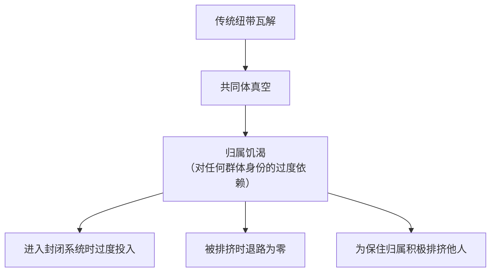
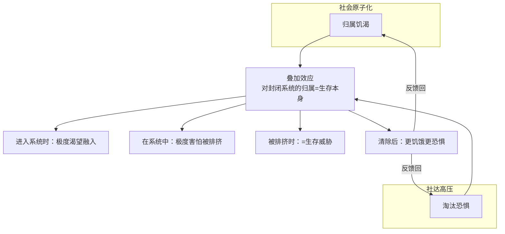
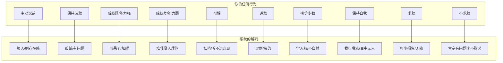
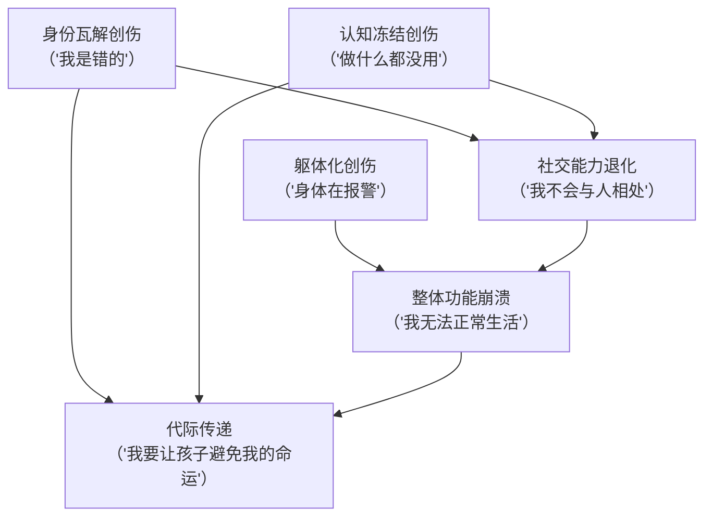
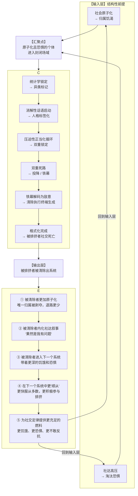
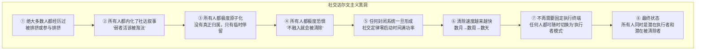
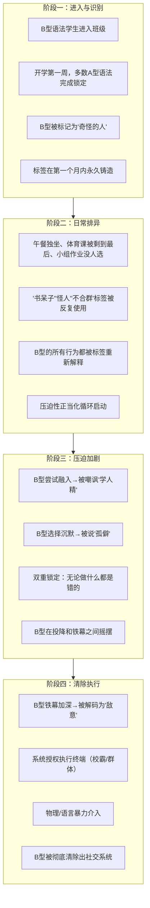

# 社会社交定律：原子化、社达高压与封闭系统中的结构性排挤机制

## ——基于语法不兼容理论的社会动力学研究


### 摘 要

本研究整合社会原子化理论、社会达尔文主义批判与语法不兼容理论，提出“社会社交定律”（Social Law）及其完整闭环模型。研究指出：社会原子化制造的“归属饥渴”与社会达尔文主义高压制造的“淘汰恐惧”，构成了封闭社交场域中结构性排挤的双重结构性前提。当原子化且恐惧的个体进入由两种或以上底层语法构成的封闭系统时，占据统计学多数的语法星系将自动启动“多数锁定→异类标记→压迫性正当化循环→清除执行→格式化完成”的全程序列。该程序的运作不依赖任何个体的“策划”或“恶意”，仅依赖统计学多数的存在与系统的封闭性。研究进一步揭示：该程序构成一个自我强化的闭环——被清除者因清除而更加原子化、更加内化社达叙事，并在进入下一个封闭系统时成为“更充足的燃料”，从而使下一轮排挤以更高烈度运转。本研究论证了该循环的指数级自我强化特性，并详细分析了封闭性造成的多维创伤——身份瓦解创伤、认知冻结创伤、社交能力退化创伤、躯体化创伤与代际传递创伤。该定律为理解校园欺凌、职场边缘化、网络社群驱逐、家庭冷暴力等跨场域排挤现象提供了统一的理论框架。

**关键词**：社会社交定律；社会原子化；社会达尔文主义；语法不兼容；结构性排挤；压迫性正当化循环；闭环模型；封闭性创伤


## 一、引言

### 1.1 问题的提出

校园中被孤立的“不合群者”、网络社群中被驱逐的“较真者”、职场中被边缘化的“不会来事者”、家庭中被忽视的“不听话的孩子”——这些现象在不同场域中以几乎相同的结构重复出现，却长期被归因为“性格问题”“社交能力不足”或“情商低下”等个体化解释。被排挤者被告知“你要反思自己”“你要学会融入”“为什么别人都没事就你有事”，仿佛痛苦的责任完全在于承受者自身。

然而，这些个体化解释存在一个根本性的逻辑缺陷：如果问题是“个体的缺陷”，为什么同样的结构会在不同场域、不同人群、不同文化背景中反复出现？为什么被排挤者“无论做什么都是错的”？为什么“越努力越糟糕”？为什么旁观者往往保持沉默？为什么惩罚施暴者并不能阻止下一轮排挤的发生？

本研究认为，上述现象共享一个统一的底层结构——即“社会社交定律”。该定律揭示了封闭系统中统计学多数语法对少数语法的自动化排挤与清除机制。但社交定律的运转并非在真空中发生——它需要特定的结构性前提来提供“燃料”与“动力”。这二者正是**社会原子化**与**社会达尔文主义高压**。

### 1.2 理论基础

本研究整合以下理论资源：

**社会原子化理论**（涂尔干，1897；鲍曼，2000；山田昌弘，2015）：传统社会纽带（家族、邻里、单位、乡土）的瓦解使个体陷入“共同体真空”，产生强烈的、未被满足的归属需求与情感安全需求。原子化个体缺乏多层次的社交网络作为“退路”，因而对任何一个封闭系统的归属都产生过度依赖。

**社会达尔文主义批判**（霍夫施塔特，1944；鲍曼，2000）：“优胜劣汰、适者生存”的逻辑被制度化为社会运行的基本规则——教育领域的全程淘汰制、职场的内卷化与35岁危机、社会保障的个体化、话语体系的冷漠化。社达高压制造了普遍的“淘汰恐惧”——个体潜意识中将“被排挤”等同于“被淘汰”即“不配存在”，从而使排挤的烈度被无限放大。

**语法不兼容理论**（Langacker, 1987；Lakoff, 1987；扩展应用）：个体在处理信息、组织表达、判断有效性时遵循系统性的认知-表达架构。A型语法（情感-共鸣）以“感受→共鸣→归属”为认知路径，B型语法（逻辑-理性）以“观察→推导→验证”为认知路径。两种语法在底层架构上不兼容，彼此无法进行原生解析。当一种语法在封闭系统中占据统计学多数时，该语法自动成为“默认标准”。

**结构暴力理论**（Galtung, 1969）：社会结构本身可能构成一种“暴力”——不直接表现为人身攻击，而是通过制度性、系统性的方式剥夺某些群体的正当权益。结构暴力的特征是“不可见性”——受害者的痛苦没有明确的施暴者，因而难以被识别和抗议。

**沉默螺旋理论**（Noelle-Neumann, 1974）：当多数意见公开表达时，持少数意见者因害怕被孤立而倾向于保持沉默，这种沉默进一步强化了多数的“共识”表象，形成螺旋式放大效应。

**创伤理论**（Herman, 1992；Van der Kolk, 2014）：长期暴露于不可控的威胁环境会导致复杂的心理创伤——包括身份解体、情感调节能力丧失、躯体化症状与代际传递。本研究将创伤理论应用于封闭性排挤的结构性分析。

### 1.3 核心概念界定

| 概念 | 定义 |
|:---|:---|
| **社会原子化** | 传统社会纽带瓦解后，个体陷入缺乏集体归属与情感支持的孤立状态。表现为“共同体真空”与“归属饥渴” |
| **社达高压** | 社会达尔文主义意识形态的制度化运转——教育、职场、话语体系中的全程淘汰机制与“不配存在”的隐性威胁 |
| **归属饥渴** | 社会原子化的直接产物——个体对“被接纳”“被看见”“有归属”的极度渴望，使其对封闭系统中的身份认同产生过度依赖 |
| **淘汰恐惧** | 社达高压的直接产物——个体潜意识中将“被排挤”等同于“被淘汰”，将“社交死亡”等同于“生存威胁” |
| **A型语法** | 情感-共鸣型底层认知-表达架构。认知路径为“感受→共鸣→归属”，有效性标准为“有共鸣吗？”“氛围对吗？” |
| **B型语法** | 逻辑-理性型底层认知-表达架构。认知路径为“观察→推导→验证”，有效性标准为“有证据吗？”“逻辑通吗？” |
| **统计学锁定** | 当某一语法在封闭系统中占据多数时，该语法自动成为默认标准，无需争夺或论证 |
| **消解性话语** | 不攻击发言内容、而攻击“说话行为本身”的话语机制——将B型表达重新编码为“人格缺陷”（“太较真”“冷漠像AI”） |
| **压迫性正当化循环** | 排挤→被排挤者反应→反应被解码为“异常”→排挤被追溯性“证明”为正当→继续排挤的自我强化循环 |
| **双重锁定** | “无论你做什么都是错的”与“越努力越糟糕”——被排挤者所有行为都被预先解码为“错误” |
| **清除执行终端** | 系统自动“授权”的排挤执行者（校霸/施暴者/排挤主力），被系统合法化并获群体认同 |
| **封闭性创伤** | 在无法退出的封闭系统中长期承受结构性排挤所导致的多维心理损伤——包括身份瓦解、认知冻结、社交能力退化、躯体化与代际传递 |
| **社会社交定律的闭环** | 被清除者因清除而更加原子化、更加内化社达叙事，并在进入下一个封闭系统时成为“更充足的燃料”，使下一轮排挤以更高烈度运转的自我强化循环 |


## 二、结构性前提：社会原子化与社达高压

### 2.1 社会原子化：归属饥渴的制造

#### 2.1.1 传统纽带的瓦解

社会原子化是多股历史合力共同作用的结果。在中国语境下，以下四个维度的变化最为显著：

**（1）城市化与人口大流动**

改革开放以来，数亿人离开故土、离开家族网络，进入陌生的城市。传统的宗族、邻里关系因地理隔离而断裂。2023年中国流动人口规模达3.76亿，超过四分之一的人口处于“脱嵌”于原生社会网络的状态。这种“脱嵌”不仅是地理位移，更是社会关系的系统性断裂——个体的社会支持网络从多层次（家族、邻里、单位）收缩为单层次（同事、少数朋友），且这一单层次网络本身也具有高度流动性。

**（2）单位制的解体**

计划经济时代的“单位”不仅是工作场所，更是包办一切的社会组织——提供住房、医疗、教育、养老、婚恋介绍乃至死后安置。20世纪90年代以来的市场化改革使“单位”的功能大幅萎缩，个体被推向市场，被迫独自面对生存风险。单位制解体后形成的制度真空，至今未被其他社会组织形式有效填补。

**（3）家庭结构的巨变**

独生子女政策（1979-2015）深刻重塑了中国家庭的代际结构——“4-2-1”家庭结构（四个老人、两个父母、一个孩子）使年轻一代承受着巨大的赡养压力，同时缺乏兄弟姐妹的横向情感支持网络。近年来的少子化趋势进一步弱化了家庭的情感功能，使家庭从“情感共同体”逐渐退化为“功能性单位”。

**（4）数字化的深度渗透**

物理空间的人际交往持续萎缩，线上社交成为情感互动的主要渠道。然而，数字连接不等于真实连接——线上社交的本质是“弱连接”，它提供信息流通与表面的互动感，却无法提供真正的情感支持、安全感和归属感。

#### 2.1.2 “共同体真空”与“归属饥渴”

社会原子化的直接后果，是产生了一个庞大的、未被满足的“共同体需求”——即“归属需求”与“情感安全需求”。

人类是社会性动物。马斯洛需求层次理论将“归属与爱”置于仅次于生存与安全的核心位置。当传统的社会结构（家族、单位、邻里）不再能提供这些时，个体就会像饥饿的人寻找食物一样，急切地寻找替代性的“共同体”。而封闭社交场域——班级、公司部门、网络社群——恰恰以极高的效率和极低的成本，提供了这种“替代性归属”。



**关键认识**：这种“归属饥渴”使个体对任何一个封闭系统的身份认同产生**过度依赖**。如果A群体排挤我，我没有B群体可以退——因为所有的传统退路（家族、邻里、乡土）已经瓦解。被排挤不再只是“社交上的不愉快”，而是“失去唯一归属”的生存级威胁。

### 2.2 社达高压：淘汰恐惧的制造

#### 2.2.1 社会达尔文主义的制度化

社会达尔文主义将“优胜劣汰、适者生存”的生物进化逻辑应用于人类社会秩序的解释与辩护。其核心意识形态命题包括：“强者理应获胜，弱者应当淘汰”——将社会不平等自然化、合法化；“个体对其命运负全部责任”——否认结构性因素对个体处境的影响；“竞争是人类进步的唯一动力”——将社会关系简化为竞争关系。

在中国，社会达尔文主义虽未被正式确认为意识形态，但其压力以极为具体的方式渗透到社会生活的各个层面：

| 领域 | 社达高压的具体表现 | 对个体的心理影响 |
|:---|:---|:---|
| **教育** | 中考分流、高考排名、班级排名、“985”录取率仅1.5% | 反复体验“被淘汰”；低自尊的普遍化 |
| **职场** | 996、35岁危机、绩效排名、末位淘汰 | 持续被评估的焦虑；“有用性”随时可能被否定 |
| **社会保障** | 医疗/教育/住房压力个体化；安全网薄弱 | 风险完全自担；“一旦跌落无法翻身”的恐惧 |
| **话语体系** | “奋斗”“狼性”“优化”成为主流；“情绪价值”被工具化 | 情感表达被污名化；心理痛苦被归因为“不够努力” |

#### 2.2.2 “淘汰恐惧”的形成

社达高压持续作用下的心理后果，可以用“结构性创伤”来概括：

| 心理后果 | 具体表现 | 对社交定律的放大作用 |
|:---|:---|:---|
| 低自尊的普遍化 | 反复体验“自己不够好” | 被排挤时更容易接受“是我有问题”的归因 |
| 情感压抑的强制化 | 情感需求得不到正当表达渠道 | 排挤系统中的痛苦无法被言说和确认 |
| 被工具化的持续体验 | 始终被要求成为“有用的工具” | 将“社交价值”等同于“生存价值”，排挤即生存威胁 |
| “无条件接纳”的匮乏 | 所有爱都是有条件的 | 对封闭系统的归属产生病态依赖 |

#### 2.2.3 “被排挤=被淘汰”的潜意识等号

社达高压在个体潜意识中建立了一个致命的等式：

```
被排挤 → 被孤立 → 被群体拒绝
    ↓
被群体拒绝 → 证明“我不够好/我不配”
    ↓
“我不够好/我不配” → 在社达逻辑中 = “我应该被淘汰”
    ↓
“我应该被淘汰” → 生存级恐惧被激活
```

**关键认识**：社达高压将“被排挤”与“被淘汰”在潜意识中等同起来。在封闭系统中被排挤，不再是“社交上的不愉快”，而是“我不配存在”的生存级威胁。这使得排挤的烈度被无限放大——参与者不是在“排挤一个不喜欢的人”，而是在“清除一个不配存在的弱者”。

### 2.3 双重结构性前提的叠加效应

社会原子化与社达高压并非独立运作——它们**叠加**在一起，产生了一种远超二者之和的效应：



| 维度 | 仅社会原子化 | 仅社达高压 | **原子化+社达高压（叠加）** |
|:---|:---|:---|:---|
| 对归属的需求 | 高（渴望被接纳） | 中等 | **极高**（渴望被接纳+害怕被淘汰） |
| 对排挤的恐惧 | 中（怕孤独） | 中（怕失败） | **极高**（孤独=淘汰=不配存在） |
| 排挤的烈度 | 中等 | 中等 | **极高**（排挤=生存清除） |
| 参与的动机 | 从众 | 自保 | **双重驱动**（从众+自保） |
| 被排挤者的退路 | 少 | 少 | **无**（无处可退） |
| 循环的自我强化 | 弱 | 弱 | **强**（被清除者更饥饿更恐惧） |

**核心命题**：社会原子化与社达高压构成了社交定律运转的“双重结构性前提”——原子化提供了“归属饥渴”作为燃料，社达高压提供了“淘汰恐惧”作为放大器。二者叠加，使封闭系统中的排挤从“社交排斥”升级为“生存清除”。


## 三、社会社交定律：完整表述与运作机制

### 3.1 定律的完整表述

在上述双重结构性前提的基础上，社会社交定律可完整表述如下：

> **在社会原子化制造的“归属饥渴”与社会达尔文主义高压制造的“淘汰恐惧”的共同作用下，任何由两种或以上底层语法构成的封闭社交场域，都将自动启动以下程序：**
>
> **（1）统计学锁定**：占据多数的语法星系自动成为唯一的“合法性标准”——其表达方式、价值判断、行为规范被系统编码为“正常”；
>
> **（2）异类标记**：少数语法被降级为“需要自证清白的异常信号”——少数语法者被标记为“异类”，其所有行为（无论内容如何）都被预先解码为“错误/异常/敌意”；
>
> **（3）消解性话语启动**：不攻击“发言内容”，而攻击“说话行为本身”——“你太较真了”“你冷漠像AI”——使被排挤者无法通过“提供更多证据”来反驳；
>
> **（4）压迫性正当化循环**：双重锁定（“无论你做什么都是错的”+“越努力越糟糕”）启动，使被排挤者的所有行为都成为“排挤正当性”的持续证据；
>
> **（5）双重死路供给**：为被排挤者提供两条结构性死路——投降（自我阉割，丧失身份，继续被排挤）或铁幕（自我封闭，被解码为敌意，触发清除）；
>
> **（6）清除执行终端生成**：在铁幕被解码为敌意时，系统自动“授权”某人成为清除执行终端（校霸/施暴者/排挤主力），用以物理性或语言性地清除“不可同化者”；
>
> **（7）格式化完成**：被排挤者被系统“格式化”——物理上在场，社交上归零；
>
> **（8）闭环反馈**：被清除者因清除而更加原子化、更加内化社达叙事，在进入下一个封闭系统时成为“更充足的燃料”，使下一轮排挤以更高烈度运转。
>
> **整个程序不需要任何人的“策划”——它仅依赖统计学多数的存在、系统的封闭性、以及原子化+社达双重结构性前提的持续供给。**

### 3.2 定律的核心机制

#### 3.2.1 统计学锁定机制

统计学锁定是社交定律的**启动条件**。

当某一语法在封闭系统中占据多数时，该语法自动成为“默认标准”。默认标准不是“主流意见”——而是一套“什么是正常的表达方式”的底层规定。

| 问题 | 由谁定义 | 定义方式 |
|:---|:---|:---|
| 什么是正常的交流方式？ | 多数语法（自动） | 统计学多数自动成为规范 |
| 什么是合理的提问？ | 多数语法（自动） | 偏离多数语法的提问被标记为“异常” |
| 什么是可以被讨论的内容？ | 多数语法（自动） | 非多数话题被边缘化 |
| 什么是应该被排斥的行为？ | 多数语法（自动） | 持续偏离的行为被标记为“干扰” |

**关键认识**：多数语法**不需要“争夺”** 合法性——合法性在统计学锁定完成时，已经被“锁定”为多数的默认属性。当多数语法者说“你不对”时，他们不是在表达个人观点——他们是在**执行系统的默认程序**。

#### 3.2.2 消解性话语机制

消解性话语是社交定律的**日常执行方式**。

其运作方式与“辩论”或“反驳”有本质区别：

| 维度 | 辩论/反驳 | 消解性话语 |
|:---|:---|:---|
| 攻击对象 | 发言内容 | 发言行为本身 |
| 目标 | 证明对方“错了” | 取消对方“发言的资格” |
| 修辞策略 | “你的论据不足” | “你太较真了” |
| 效果 | 观点争议 | 人格否定 |
| 被攻击者的反应空间 | 可提供更多证据 | 任何反应都被解码为“更异常” |

**三类操作**：

| 操作类型 | 示例 | 机制 | 效果 |
|:---|:---|:---|:---|
| **人格标签化** | “你太较真了”“你冷漠像AI”“你就是来杠的” | 将B型表达重新编码为“人格缺陷” | B型的发言资格被取消 |
| **话题私有化** | “这只是个人喜好”“你想多了”“别上纲上线” | 取消讨论的公共性，将结构性分析消解为“过度解读” | B型的批判性话语被预先否定 |
| **立场前置化** | “你什么意思？”“你不是自己人” | 预设提问者的恶意动机，将B型排除出“有资格说话”的范畴 | B型被迫进入“自证清白”的防御姿态 |

**关键认识**：被消解者无法通过“提供更多证据”来“反驳”——因为反驳本身在消解性话语框架内被预设为“进一步的异常”。消解性话语的每一次运用，都在加固话语权垄断的结构。

#### 3.2.3 压迫性正当化循环机制

压迫性正当化循环是社交定律的**动力来源**。

其核心机制是**双重锁定**——被排挤者的所有可能行为都被预先解码为“错误”：



**正当化循环的步骤**：

| 步骤 | 机制 | 对排挤系统的功能 |
|:---|:---|:---|
| 1. 系统施加排挤 | 嘲笑、孤立、标签化 | 被排挤者感到压迫 |
| 2. 被排挤者反应 | 铁幕加深、情绪反应 | 系统读取为“异常/敌意” |
| 3. 系统归因 | “看，他果然有问题” | 排挤被追溯性地“证明”为正当 |
| 4. 系统继续排挤 | 更强烈的排挤 | 系统认为“我们是对的” |

**关键认识**：压迫性正当化循环是一个**自我喂养的闭合回路**——压迫既是原因，也是结果；既是燃料，也是产物。它不需要外部输入即可持续运转。

#### 3.2.4 双重死路机制

双重死路机制是社交定律的**被排挤者行为空间**。

**投降路径**：

| 阶段 | 表现 | 系统反应 | 被排挤者的内部状态 |
|:---|:---|:---|:---|
| 主动迎合 | 模仿多数语法、压制自我表达 | 系统暂时停止攻击，但持续监测 | “我终于被接受了”的短暂幻觉 |
| 身份焦虑 | “我还是我吗？”——自我异化体验 | 系统未撤销“异类”标签，仅转为“待观察” | “我越来越不认识自己了” |
| 伪装被识破 | 底层语法偶然暴露 | 系统捕获“破绽” | “我怎么又露馅了”的自我责备 |
| 加倍排挤 | 被追加“虚伪”标签 | “异类”升级为“叛徒” | “我连投降都做不好”的彻底绝望 |

**铁幕路径**：

| 阶段 | 表现 | 系统反应 | 被排挤者的内部状态 |
|:---|:---|:---|:---|
| 防御性沉默 | 减少发言、减少互动 | 系统读取为“更严重的异常” | “不说话就不会被伤害” |
| 语法堡垒化 | 强化自我语法体系，排斥外部语法 | 系统将铁幕解码为“敌意” | “我守住自己至少不会迷失” |
| 反制性疏离 | 从“我不理你们”到“我拒绝你们” | 排挤从“冷暴力”升级为“主动打压” | “我宁可被恨也不要被可怜” |
| 被标记为“威胁” | “异类”升级为“敌人” | 系统从“排异模式”切换到“清除模式” | “他们终于露出了真面目” |

**关键认识**：两条路都是死路——投降让你在失去自己的同时继续被排挤；铁幕让你在守住自己的同时承受更强的排挤。在原子化+社达的双重条件下，被排挤者没有“第三条路”。

#### 3.2.5 清除执行终端生成机制

清除执行终端生成是社交定律的**暴力升级通道**。

当被排挤者选择铁幕路径，且铁幕被系统解码为“敌意”/“威胁”时，系统从“排异模式”切换至“清除模式”。此时，系统自动“授权”某人或某些人成为“清除执行终端”。

**执行终端的三重授权来源**：

| 授权来源 | 机制 | 对执行者的功能 |
|:---|:---|:---|
| **多数语法代言** | “你们都不敢说的话，我来说；你们都不敢做的事，我来做” | 将群体隐性的敌意外化为显性行动 |
| **被排挤者铁幕触发** | “他不跟我们说话→他看不起我们→他欠教训” | 暴力被解码为“正当防卫”或“反击” |
| **旁观者沉默** | “没有人阻止我→说明大家都同意” | 每一次沉默都是持续性的合法性供给 |

**执行终端的系统定位**：

| 与系统的关系 | 执行终端的位置 | 类比 |
|:---|:---|:---|
| 多数语法的最激进表达 | 将隐性的“语法排异”转化为显性的“物理/语言清除” | 免疫系统中的杀伤性T细胞 |
| 群体压力的执行终端 | 其他成员不敢做的事，执行者替他们做 | 承受“施暴者”道德污名，维持其他人“我没动手”的道德清白 |
| 系统边界的巡逻者 | 通过定期“惩戒”异类，向整个系统展示“偏离标准的代价” | 每一次暴力都在向潜在异类发送警告信号 |
| 沉默螺旋的受益者 | 旁观者的沉默=持续的合法性供给 | “没有人制止→我没有做错”的心理支撑 |

**关键认识**：清除执行终端不是“系统之外的因素”——它是系统在特定条件下自动生成的“内置暴力模块”。校霸不是校园暴力的“原因”——他是排挤系统完成清除的“执行者”。


## 四、封闭性创伤：被排挤者的多维损伤

### 4.1 “封闭性”作为创伤放大器

社会社交定律的运转依赖于系统的**封闭性**。封闭性指的是：个体无法轻易退出该社交系统——不能换班、不能换部门、不能退群（或退群的代价极高）、不能离开家庭。

封闭性在排挤中的作用，可以类比为“密室效应”：

| 维度 | 开放系统（可退场） | 封闭系统（无法退场） |
|:---|:---|:---|
| 排挤的持续时间 | 有限（受害者可以离开） | **无限**（被迫持续在场） |
| 创伤的性质 | 急性应激 | **复杂性创伤**（C-PTSD） |
| 恢复的可能性 | 离开后可以恢复 | **创伤在持续累积** |
| 对受害者的控制 | 弱 | **强**（无法逃脱） |
| 施暴者的行为约束 | 有（受害者可能离开并举报） | **无**（受害者无处可逃） |
| 旁观者的行为约束 | 有（可能被受害者离开后的揭露波及） | **无**（沉默是唯一安全的选择） |

封闭性使排挤从“一次性的攻击”升级为**持续的、不可逃脱的、系统性的人格否定**。这正是为什么校园排挤的创伤往往比“一次性的霸凌事件”更加深远——因为受害者必须在同一个教室、同一群人中间，日复一日地承受排挤，持续数月甚至数年。

### 4.2 封闭性创伤的五重维度

基于创伤理论（Herman, 1992；Van der Kolk, 2014）与对社会社交定律运作机制的分析，本研究识别出封闭性排挤造成的五重创伤维度：

#### 4.2.1 维度一：身份瓦解创伤

| 机制 | 具体表现 | 长期后果 |
|:---|:---|:---|
| 系统持续否定被排挤者的“合法性” | “你不应该这样说话”“你不应该这样想”“你不应该存在” | 被排挤者开始相信“我本身就是一个错误” |
| 所有行为都被解码为“错误” | 无论做什么都被否定 | 失去“什么是正确的”的判断基准 |
| 投降路径导致的自我异化 | “我还是我吗？”的持续困惑 | 身份认同的碎片化——“我不知道我到底是谁” |
| 铁幕路径导致的“被定义为敌人” | “你既然不融入，你就是敌人” | 身份从“人”降格为“威胁” |

**身份瓦解创伤的核心体验**：

> “我不再知道自己是谁。他们说我不对，我试图改。改了，他们说我虚伪。不改，他们说我固执。我已经不知道‘对’的到底是什么——我只知道‘我’是错的。”

#### 4.2.2 维度二：认知冻结创伤

| 机制 | 具体表现 | 长期后果 |
|:---|:---|:---|
| “无论你做什么都是错的”导致决策瘫痪 | 被排挤者停止主动决策——“反正做什么都是错的，不如不做” | 决策能力萎缩，形成习得性无助 |
| “越努力越糟糕”导致努力放弃 | 任何改善处境的尝试都被证明无效或适得其反 | 放弃“改善”的任何希望，被动承受 |
| 持续的不确定威胁 | 不知道下一次排挤何时、以何种方式到来 | 持续的高度警觉状态，耗竭认知资源 |
| 信息环境的扭曲 | 被排挤者接收到的所有反馈都是负面的 | 无法形成准确的自我认知和现实检验 |

**认知冻结创伤的核心体验**：

> “我坐在教室里，但什么也听不进去。我在想：他们等下会不会又嘲笑我？我该不该说话？说了会不会被骂？不说会不会被说孤僻？我每一个决定都要想十遍，到最后什么决定也做不了。脑子像冻住了一样。”

#### 4.2.3 维度三：社交能力退化创伤

| 机制 | 具体表现 | 长期后果 |
|:---|:---|:---|
| 长期排挤导致社交回避 | 被排挤者主动避免社交接触——“不接触就不会被伤害” | 社交技能因缺乏练习而退化 |
| 社交信号解码的扭曲 | 在排挤环境中，中性信号被解码为威胁；善意信号被解码为陷阱 | 离开排挤环境后仍无法正常社交 |
| 信任能力的摧毁 | “每一次信任都换来背叛”——对任何人产生防御性不信任 | 无法建立健康的亲密关系 |
| 语法堡垒化 | 为自保而封闭自己的表达方式 | 即使遇到安全的社交环境，也无法“切换回”正常社交模式 |

**社交能力退化创伤的核心体验**：

> “后来有人主动跟我说话，我第一反应是‘他是不是又在耍我’。我知道也许他是真心的，但我控制不了——我已经不记得怎么跟人正常说话了。每次开口都觉得会被人抓住把柄。”

#### 4.2.4 维度四：躯体化创伤

| 机制 | 具体表现 | 长期后果 |
|:---|:---|:---|
| 持续的压力激素分泌 | 皮质醇水平长期偏高 | 免疫系统抑制、慢性炎症、睡眠障碍 |
| 身体作为“情绪容器” | 无法表达的情感被身体吸收 | 头痛、胃痛、肌肉紧张、慢性疲劳 |
| 身体警觉状态 | 随时准备应对“攻击” | 心悸、呼吸急促、出汗、颤抖 |
| 压力导致的回避行为 | 以身体不适为由逃避社交场合 | 社会功能进一步萎缩 |

**躯体化创伤的核心体验**：

> “每天早上醒来，胃像被拧在一起。有时候会吐。我妈以为我肠胃不好，带我去医院查了三次，什么都没查出来。只有我知道——我是害怕去学校。”

#### 4.2.5 维度五：代际传递创伤

| 机制 | 具体表现 | 长期后果 |
|:---|:---|:---|
| 内化的社达叙事被传递给下一代 | “人家为什么不欺负别人就欺负你？”——同一句话从受害者变为施害者 | 创伤以“教育”的名义被复制 |
| 投降策略被包装为“社交智慧” | “你要学会做人”“你要合群”——受害者将自我阉割的经验作为“生存智慧”传授 | 下一代在同样的投降道路上重复创伤 |
| 铁幕策略被包装为“独立精神” | “不要在乎别人怎么看”——受害者将防御性孤立作为“人生哲学”传授 | 下一代在同样的铁幕道路上重复孤立 |
| 未处理的创伤转化为教养方式 | 过度保护或过度严厉；无法给孩子提供安全的依恋关系 | 创伤跨越代际持续存在 |

**代际传递创伤的核心表现**：

| 被排挤者的经历 | 内化的叙事 | 传递给下一代的方式 | 下一代的处境 |
|:---|:---|:---|:---|
| 在校园被排挤 | “是我有问题” | “你要改，别像我一样” | 在自我否定中成长 |
| 在校园被排挤 | “世界是残酷的，没人会帮你” | “别指望别人，只能靠自己” | 在孤立无援中成长 |
| 在校园被排挤 | “合群是生存的唯一方式” | “你要学会讨好别人” | 在自我异化中成长 |
| 在校园被排挤 | “被排挤是因为你不够强” | “你要比别人更强” | 在社达焦虑中成长 |

### 4.3 五重创伤的叠加效应

五重创伤并非独立存在——它们相互叠加、相互强化：



| 创伤组合 | 叠加效应 |
|:---|:---|
| 身份瓦解 + 认知冻结 | “我什么都做不好，而且我不可能变好”——自我效能感彻底归零 |
| 社交退化 + 躯体化 | “我害怕与人接触，而且我的身体在拒绝社交”——社交彻底瘫痪 |
| 五重创伤全部叠加 | “我不正常、不会社交、身体有问题、永远好不了、而且我的孩子也会这样”——结构性绝望 |

### 4.4 封闭性创伤的“不可讲述性”

封闭性创伤最隐蔽的伤害在于其**不可讲述性**：

| 为什么受害者无法讲述 | 结构性原因 |
|:---|:---|
| “别人都说没什么” | 排挤是隐性的、渐进的——旁观者看不到“大事”，只看到“小事”累积 |
| “老师/家长说你要反思自己” | 外部确认者完成了排挤的最终正当化——受害者不再被相信 |
| “我说出来也没用” | 经验告诉受害者：讲述只会让事情更糟（排挤加剧/被当作“告状者”） |
| “我不知道怎么说” | 创伤是弥散的、持续的、没有明确的“事件”——无法被封装为一个“故事” |
| “也许真的是我的问题” | 内化的社达叙事使受害者失去了对自身判断的信任 |

**不可讲述性的后果**：

> 创伤无法被讲述，意味着它无法被见证；无法被见证，意味着它无法被确认；无法被确认，意味着受害者必须独自承受一切——甚至在承受的同时怀疑“是不是真的有问题的是我”。

这正是社会社交定律最隐蔽的暴力：**它不仅伤害你，它还剥夺了你讲述伤害的语言——让你在受伤的同时，无法说出“我受伤了”。**


## 五、社会社交定律的闭环模型

### 5.1 闭环的结构

社会社交定律最核心的特征是：**它不是一个线性过程，而是一个自我强化的闭环。**



### 5.2 闭环的自我强化特性

这个闭环最核心的特征是**指数级自我强化**：

| 循环轮次 | 输入状态 | 社交定律的运转强度 | 输出状态 |
|:---|:---|:---|:---|
| 第1轮 | 原子化+社达（初始状态） | 全功率运转 | 被清除者：更原子化+更内化社达 |
| 第2轮 | 更饥饿+更恐惧 | **更强功率运转** | 被清除者：更加原子化+更加社达内化 |
| 第3轮 | 更加饥饿+更加恐惧 | **超强功率运转** | 被清除者：极原子化+极社达内化 |
| 第n轮 | 饥饿到极致+恐惧到极致 | **系统爆炸性运转** | 被清除者：不再是个体，而是“社交定律的完美燃料” |

**每一次循环都使系统更强大、清除更彻底、被清除者更难翻身。**

### 5.3 闭环的最终形态

如果没有任何外部干预，这个闭环的最终形态是：



**最终状态的特征**：系统不再需要固定的“异类”，只需要“随时可以被标记为异类的任何人”。在这个状态下，所有人都在恐惧中运转，所有人都可能是下一个被吃掉的。


## 六、校园场域的详细分析

### 6.1 校园作为社会社交定律的“完美样本”

校园之所以是社会社交定律最典型的运作场域，是因为它具备所有“完美条件”：

| 条件 | 在校园中的具体表现 | 对社交定律的放大作用 |
|:---|:---|:---|
| **原子化** | 学生离开家庭进入陌生班级；独生子女缺乏横向支持；师生关系非人格化 | “班级”成为唯一归属来源→被排挤=失去一切 |
| **社达** | 中考分流、高考排名、班级排名、老师偏袒“好学生”、“不努力就被淘汰”的话语 | “被排挤”被潜意识等同于“被淘汰”→参与排挤成为“证明我不是弱者”的方式 |
| **封闭性** | 班级固定、座位固定、强制共处三年、无法轻易转学 | 社交定律没有“退场机制”——被排挤者必须持续承受 |
| **语法单一** | 青春期主流社交语法高度同质化——外貌焦虑、从众压力、对“奇怪”的强烈排斥 | B型语法（独立思考/深度兴趣/不迎合）被快速标记为“异类” |
| **权力真空** | 教师不介入“学生之间的事”；校方倾向于“息事宁人” | 没有外部干预来中断排挤循环 |
| **身份形成期** | 青春期是身份认同形成的关键阶段 | 排挤创伤嵌入身份形成的核心过程，影响终身 |

### 6.2 校园排挤的完整运作流程



### 6.3 校园排挤的典型角色矩阵

| 角色 | 在系统中的位置 | 行为逻辑 | 结构性约束 |
|:---|:---|:---|:---|
| **校霸/执行终端** | 多数语法的最激进表达 | 将群体的隐性敌意外化为显性行动 | 被系统授权、合法化、被群体认同 |
| **积极参与者** | 跟随执行终端的从众者 | 通过参与排挤证明“我不是异类” | 受沉默螺旋和社达恐惧驱动 |
| **沉默旁观者** | 系统的“合法性供给者” | 不参与、不制止、不报告 | 公开支持异类=自己成为异类 |
| **被排挤者** | B型语法携带者 | 投降或铁幕，两条结构性死路 | 无处可退、无法被理解 |
| **教师/校方** | 外部确认者 | 息事宁人、“双方都有责任” | 在系统的封闭性之外，无法看见内部运作 |
| **家长** | 跨代际复制者 | “你要反思自己”“人家为什么不欺负别人” | 已经内化了同样的社达叙事 |

### 6.4 校园封闭性创伤的具体表现

| 创伤维度 | 在校园中的具体表现 | 长期影响 |
|:---|:---|:---|
| **身份瓦解** | “我不知道我是谁——他们说我不对，但没人告诉我什么是对的” | 成年后难以形成稳定的自我认同 |
| **认知冻结** | “坐在教室里什么都听不进去，脑子里全是‘他们等下会不会又笑我’” | 学习成绩下滑→被归因为“不努力”→进一步被排挤的恶性循环 |
| **社交退化** | “后来有人主动跟我说话，我第一反应是‘他是不是又在耍我’” | 成年后难以建立健康的亲密关系和职场关系 |
| **躯体化** | “每天早上胃痛、头痛、想吐” | 慢性疼痛、免疫系统问题、心身疾病 |
| **代际传递** | “我绝不会让我的孩子像我一样”——但传递的方式可能是过度保护或过度严厉 | 创伤以新的形式在下一代身上重演 |

### 6.5 校园排挤为何“屡禁不止”

| 常规干预策略 | 为什么无效（社会社交定律视角） |
|:---|:---|
| 严惩校霸 | 惩罚执行终端→系统寻找**下一个执行者**。校霸是“消耗品”，系统需要的是“清道夫”的功能 |
| 心理辅导受害者 | **将结构问题重新定义为心理问题**。受害者被“辅导”成“更有韧性”的人，但排挤系统并未改变 |
| 反欺凌课程/班会 | 在排挤系统中讲授“反排挤”是**结构性矛盾**——课上的“友善教育”与课下的排挤运作是两个平行世界 |
| 加强监控 | 将暴力从“公开”推向“隐蔽”——监控能让校霸不打人，但不能让校霸不孤立、不嘲笑 |
| 转学/换班 | **将受害者从一种多数语法中转移到另一种多数语法中**——携带的B型语法在大多数环境中都会被标记为“异类” |

**关键认识**：校园排挤之所以“永远存在”，不是因为“每一届都有坏孩子”——而是因为**校园的结构性条件（原子化+社达+封闭+语法单一+权力真空）使社交定律持续全功率运转**。不改变这些结构性条件，任何“反欺凌”政策都只是在修剪枝叶。


## 七、社会社交定律的跨场域适用性

### 7.1 适用场域总览

| 场域 | 适用性 | 封闭性来源 | A型语法内容 | B型语法内容 | 清除执行形态 |
|:---|:---|:---|:---|:---|:---|
| **校园（班级/宿舍）** | ✅ 完美适用 | 强制共处+无法退场 | “合群”“会来事” | 独立思考、深度兴趣 | 校霸/群体欺凌 |
| **网络社群（微信群/论坛）** | ✅ 完美适用 | 准入门槛+邀请制 | “圈内文化”“纯度” | 逻辑分析、理性讨论 | 管理员驱逐/群体围攻 |
| **职场（部门/团队）** | ✅ 高度适用 | 组织架构+岗位绑定 | “团队精神”“正能量” | 专业判断、独立意见 | 穿小鞋/边缘化/裁员 |
| **家庭** | ✅ 高度适用 | 血缘绑定+无法退场 | “听话”“懂事” | 自我表达、真实需求 | 冷暴力/断绝关系 |
| **泛二次元/游戏/饭圈** | ✅ 高度适用 | 文化门槛+圈内认同 | 情感投入、厨力、纯度 | 客观分析、理性评价 | 粉籍鉴定/开除/网暴 |
| **学术圈（学派/实验室）** | ✅ 适用 | 范式绑定+资源依附 | 范式霸权 | 异质思维、范式批判 | 不引用/不合作/排挤出局 |

### 7.2 跨场域结构一致性

| 结构要素 | 校园变体 | 网络社群变体 | 职场变体 | 家庭变体 | 娱乐圈层变体 |
|:---|:---|:---|:---|:---|:---|
| **A型语法** | “合群” | “圈内文化” | “团队精神” | “听话” | “厨力/纯度” |
| **B型语法** | 独立思考 | 理性讨论 | 专业判断 | 自我表达 | 客观评价 |
| **消解性话语** | “太较真” | “太理性” | “不够团队” | “不懂事” | “不够爱” |
| **清除执行** | 校霸 | 管理员/群攻 | 绩效/裁员 | 冷暴力 | 开除粉籍 |
| **外部确认者** | 老师“各打五十” | 创作者“公域沉默” | HR“文化不合适” | 亲戚“理解父母” | 大粉“为你好” |
| **封闭性创伤** | 身份瓦解+认知冻结 | 社交死亡+自我怀疑 | 职业否定+经济恐惧 | 存在否定+归属剥夺 | 身份瓦解+社群死亡 |

### 7.3 社会社交定律与“娱乐-情感复合体”

泛二次元、泛游戏、明星娱乐圈是A型语法（情感-共鸣）的三种载体，它们共同构成了一套完整的“娱乐-情感复合体”：

| 载体 | 核心语法 | 排挤执行方式 | 对双重结构性前提的利用 |
|:---|:---|:---|:---|
| 泛二次元 | 羁绊、厨力、萌 | 消解性话语（“你太较真了”） | 归属饥渴（“二次元是我家”）+淘汰恐惧（“开除二籍”） |
| 泛游戏 | 成就、归属、段位 | 技术鄙视链（“你连这都不会”） | 归属饥渴（“我们公会”）+淘汰恐惧（“菜是原罪”） |
| 明星娱乐圈 | 守护、应援、打投 | 粉籍鉴定（“你是假粉”） | 归属饥渴（“我们哥哥”）+淘汰恐惧（“不配做粉”） |

这三个载体共享同一套底层逻辑：**情感投入的强度**是唯一的合法性标准。任何试图使用逻辑-理性语法的人，都会被系统标记为“乱码”——“不够爱”“不够投入”“不够纯粹”。


## 八、理论贡献与意义

### 8.1 对既有理论的整合与深化

| 既有理论 | 与本研究的整合 |
|:---|:---|
| **结构暴力理论**（Galtung, 1969） | 社会社交定律揭示了结构暴力的**微观运作机制**——不依赖个体恶意，仅凭统计学多数+原子化+社达即可产生系统性伤害 |
| **沉默螺旋理论**（Noelle-Neumann, 1974） | 社会社交定律将沉默螺旋置于**语法锁定的框架**中——沉默不是源于对孤立的恐惧，而是源于“公开支持乱码=自己成为乱码”的结构性约束 |
| **标签理论**（Becker, 1963） | 社会社交定律揭示了标签的**自动化和预先性**——被排挤者不是在“做了错事”之后被贴标签，而是“被预先标记为错误的人” |
| **语法不兼容理论**（Langacker, 1987；Lakoff, 1987） | 社会社交定律将认知语言学扩展至**群体动力学**层面——语法差异是触发排挤的结构性条件 |
| **创伤理论**（Herman, 1992；Van der Kolk, 2014） | 社会社交定律将创伤理论应用于**结构性排挤**——揭示了封闭性作为创伤放大器的机制 |

### 8.2 解释范式的转换

| 维度 | 个体化解释范式 | 结构化解构范式（社会社交定律） |
|:---|:---|:---|
| 排挤的原因 | 被排挤者“性格有问题” | B型语法与A型语法默认标准不兼容；原子化+社达提供燃料与动力 |
| 施暴者的来源 | 道德败坏、家庭缺失 | 系统在清除模式下自动生成的执行终端 |
| 旁观者的沉默 | 冷漠、懦弱 | 在沉默螺旋中理性自保，受“不站队=被淘汰”逻辑驱动 |
| 为什么排挤如此残酷 | “这些人太坏了” | 原子化使被排挤者无退路；社达使排挤被解码为“生存清除” |
| 为什么排挤代代相传 | “每一届都有坏孩子” | 闭环反馈使被清除者成为下一轮的“更充足燃料” |
| 为什么受害者无法讲述 | 羞耻、不擅长表达 | 封闭性创伤的不可讲述性——排挤是弥散的、持续的、没有明确“事件” |
| 解决路径 | 惩罚施暴者、辅导受害者 | 改造封闭系统结构、打破语法单一性、提供退场通道、改变结构性前提 |

### 8.3 对“结构性困境”的理论确认

社会社交定律揭示了一个根本性的结构困境：

> **在原子化+社达的双重条件下，封闭系统中的“异类”是一个必须被系统自动生产、自动排除的结构性位置。换任何一个携带B型语法的人上去，都会站在同一个位置上。而且每一次清除都会使下一个“异类”被清除得更快、更彻底。**

这意味着：
1. **排挤不是偶然事件**——它是封闭系统在特定结构性条件下维持自身稳定性的必然输出
2. **受害者不是随机选中的**——他们是被系统语法筛选出来的“不可同化者”
3. **问题不在“这些人”** ——问题在“原子化+社达+封闭系统”这个结构
4. **惩罚执行者无法关闭系统**——系统会不断产生新的执行者，且每一次循环都使系统更强大
5. **创伤是结构性而非个人性的**——被排挤者的痛苦不是“心理脆弱”，而是封闭系统持续输出伤害的结果


## 九、结论

### 9.1 主要发现

本研究通过整合社会原子化理论、社会达尔文主义批判、语法不兼容理论与创伤理论，提出并论证了“社会社交定律”及其完整闭环模型。主要发现如下：

**第一**，社会原子化制造的“归属饥渴”与社会达尔文主义高压制造的“淘汰恐惧”，构成了封闭社交场域中结构性排挤的双重结构性前提。二者叠加产生的效应远超各自之和——原子化使被排挤者无退路，社达使排挤被解码为“生存清除”。

**第二**，在双重结构性前提下，任何由两种或以上语法构成的封闭系统都将自动启动“统计学锁定→异类标记→消解性话语→压迫性正当化循环→双重死路→清除执行终端生成→格式化完成”的全程序列。整个程序不需要任何人的“策划”或“恶意”。

**第三**，社会社交定律构成一个自我强化的闭环——被清除者因清除而更加原子化、更加内化社达叙事，并在进入下一个封闭系统时成为“更充足的燃料”，使下一轮排挤以更高烈度运转。这是一个指数级自我强化的死亡螺旋。

**第四**，封闭性排挤造成五重创伤维度：身份瓦解创伤、认知冻结创伤、社交能力退化创伤、躯体化创伤与代际传递创伤。五重创伤相互叠加，构成“结构性绝望”的完整图景。封闭性使创伤从“一次性事件”升级为“持续的、不可逃脱的人格否定”。

**第五**，该定律在校园、职场、网络社群、家庭、娱乐圈层等场域中具有跨场域一致性——不同场域中的排挤现象共享同一套底层结构，只是表层内容不同。校园因其原子化+社达+封闭+语法单一+权力真空的条件组合，成为社会社交定律最典型的“完美样本”。

**第六**，该闭环的最终形态是一种“社交达尔文主义黑洞”——所有人都同时是潜在的执行者与潜在的被清除对象，系统不再需要固定的“异类”，只需要“随时可以被标记为异类的任何人”。

### 9.2 最终命题

> **社会社交定律揭示了一个冷酷的事实：在社会原子化制造的归属饥渴与社会达尔文主义高压制造的淘汰恐惧的双重催化下，任何封闭的社交系统都将成为一台自动运转的排挤机器。它不需要任何人的“恶意”——只需要一群人极度饥饿、极度恐惧、被关在一个房间里。系统会自动选出“异类”，自动启动压迫性循环，自动生成执行终端，自动完成清除。被清除者带着更深的饥饿和恐惧进入下一个系统，成为下一轮排挤的“更充足的燃料”。这就是一个指数级自我强化的死亡螺旋——每一次循环都使系统更强大，每一次循环都使被排挤者更难逃脱。**
>
> **这个过程中产生的创伤——身份瓦解、认知冻结、社交退化、躯体化、代际传递——不是受害者的“心理脆弱”，而是封闭系统持续输出伤害的结构性产物。封闭性使创伤无法被讲述、无法被见证、无法被确认——受害者必须在受伤的同时，独自承受“也许真的是我的问题”的自我怀疑。**
>
> **社会社交定律不给被排挤者提供“逃脱”的路径——它只提供一个东西：一个地图，告诉你“这个结构叫什么，它怎么运转，你站在哪个位置，你承受的创伤叫什么名字，以及为什么不是你的错。”**


## 参考文献

[1] Becker, H. S. (1963). *Outsiders: Studies in the Sociology of Deviance*. Free Press.

[2] Galtung, J. (1969). Violence, Peace, and Peace Research. *Journal of Peace Research*, 6(3), 167-191.

[3] Herman, J. (1992). *Trauma and Recovery: The Aftermath of Violence*. Basic Books.

[4] Lakoff, G. (1987). *Women, Fire, and Dangerous Things: What Categories Reveal about the Mind*. University of Chicago Press.

[5] Langacker, R. W. (1987). *Foundations of Cognitive Grammar* (Vol. 1). Stanford University Press.

[6] Noelle-Neumann, E. (1974). The Spiral of Silence: A Theory of Public Opinion. *Journal of Communication*, 24(2), 43-51.

[7] Van der Kolk, B. (2014). *The Body Keeps the Score: Brain, Mind, and Body in the Healing of Trauma*. Viking.

[8] 鲍曼. 流动的现代性[M]. 欧阳景根，译. 上海：上海三联书店，2002.

[9] 霍夫施塔特. 美国生活中的社会达尔文主义[M]. 姚中秋，译. 北京：商务印书馆，2018.

[10] 涂尔干. 自杀论[M]. 冯韵文，译. 北京：商务印书馆，1996.

[11] 山田昌弘. 社会为何如此崩溃[M]. 东京：中央公论新社，2015.


**社会社交定律 终**

*研究完成日期：2026年7月*
*方法论基础：结构分析 + 跨场域模式识别 + 理论建模*