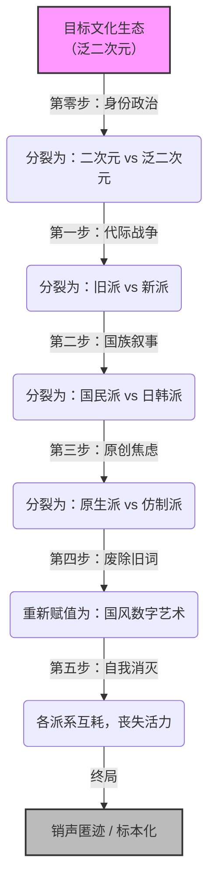

---

# 文化生态解构与重新赋值
## ——基于矛盾论的认知战战术战略白皮书

**版本**：V 2.0
**密级**：理论推演模型
**适用范围**：亚文化圈层、虚拟社群、身份认同群体
**核心理论工具**：矛盾论（反向应用）、身份政治学、话语权力分析

## 第一章：核心战略总纲

### 1.1 战略前提
任何成功的文化解构，其前提不是“外部力量的强大”，而是“目标对象内部存在结构性裂痕”。

**核心理念**：不制造矛盾，只激活并极端化对象内部已有的裂痕。
**哲学基石**：反向使用矛盾论——将“对立统一”解构为“对立不统一”。

### 1.2 战略目标
- **阶段目标**：使目标文化生态丧失内部凝聚力与外部防御力。
- **最终目标**：废除其原生名号，完成“重新赋值”，使其在合法、有序的框架内“销声匿迹”。
- **核心原则**：全程不使用暴力封禁，仅依靠流量分配、话语权授予与合法性背书完成全部操作。

### 1.3 战略优势
- **隐蔽性**：操作过程包裹在“保护”、“规范”、“自信”的话语中。
- **经济性**：成本极低，仅需算法、媒体、学术话语的微调。
- **自动性**：一旦启动，目标内部的矛盾将产生自我驱动的分裂惯性。

## 第二章：战术执行体系（七步绝杀）

### 第零步：身份政治构建——“泛二次元”与“二次元”的对立

**目标**：为目标群体植入“身份焦虑”，为后续分裂建立站队坐标系。

**操作手法**：
- **1. 符号赋值**：通过舆论引导，赋予“二次元”以“硬核、老宅、懂行、有品位”的纯度标签；同时赋予“泛二次元”以“现充、跟风、被资本收割的韭菜”的稀释标签。
- **2. 制造身份门槛**：抛出“你到底是二次元还是泛二次元？”等钓鱼式议题，制造“我必须选边站”的焦虑感。
- **3. 扶植“纯度警察”**：为热衷于“开除二次元籍”的极端用户提供流量倾斜，使其行为被误认为“圈层主流共识”。

**预期效果**：
- 模糊的身份边界被强行固化。
- 圈内人开始热衷于自我审查与相互“除籍”。
- 为后续的“旧派 vs 新派”提供了“谁是正统”的评判坐标。

### 第一步：代际战争——扶植旧派反对党

**目标**：利用审美代沟与经济地位倒挂，引爆“老一代守护者”与“新一代资本宠儿”的内战。

**操作手法**：
- **1. 选角**：在旧派内部筛选最反对商业化、最敌视“快餐文化”的激进声音（反对党）。
- **2. 赋能**：授予其“文化守护者”称号，赋予其“不可反驳的道德高地”。
- **3. 理论武装**：为其提供系统性批判新派的话语工具（如：流水线生产、媚宅、无营养等话术）。
- **4. 制造沉默螺旋**：利用算法放大大V的激进言论，让旧派温和派因惧怕被骂“投降派”而沉默。

**预期效果**：
- 旧派整体被少数反对党绑架，成为打击新派的战争机器。
- 新派作品被污名化，陷入“解释即心虚”的困境。
- 资本因舆论风险开始撤离，新派经济根基动摇。

### 第二步：国族叙事——切割日韩文化输入

**目标**：切断外部文化补给，将“文化审美”上升为“政治立场”。

**操作手法**：
- **1. 政治化解读**：引入“文字狱”式批判工具。将日系作品中的符号与军国主义、封建残余挂钩（例：鬼灭之刃“柱”=武士道=法西斯洗白）。
- **2. 扶植国民派**：为民族主义倾向的评论者提供官方背书，将其推举为“文化安全守门人”。
- **3. 污名化“精神外国人”**：将喜爱日韩作品的圈内人定义为“文化不自信”、“被渗透的异己分子”。

**预期效果**：
- 大量优质日系作品被列入“高风险清单”，流入渠道被切断或自我审查。
- 日韩派被边缘化，退圈或转入极端地下状态。
- 圈内只剩下“政治合格”的作品可选。

### 第三步：原创焦虑——清除仿制派

**目标**：清除国内商业资本遗留的“仿日系”审美与商业模式，完成圈层的“纯度清洗”。

**操作手法**：
- **1. 分裂国民派**：在国民派内部识别“原生派”（追求完全独立民族画风）与“仿制派”（曾借鉴日韩技术的国内大厂，如米哈游、腾讯、网易）。
- **2. 污名化“文化买办”**：将仿制派的成功定义为“山寨窃取”、“审美殖民”。
- **3. 打击经济模型**：以“整顿资本无序扩张”为名，限制游戏充值、周边消费、虚拟打赏等核心盈利模式。

**预期效果**：
- 国内三大厂等仿制派被清理出“正统”序列。
- 资本彻底逃逸，圈层失去最后的经济造血能力。
- 仅剩的“原生派”虽然获胜，但面临无新作品、无商业闭环的荒漠。

### 第四步：名词废除与历史断根

**目标**：切断“名”与“实”的历史链接，使新生代无法回溯原初的文化情感。

**操作手法**：
- **1. 污名化旧词**：让“二次元”在公共语境中与“幼稚”、“宅”、“软色情”深度绑定。
- **2. 真空化新词**：禁止/替换主流媒体的用语，强制使用“国风数字艺术”、“数字多媒体绘本”等官方术语。
- **3. 重构历史叙事**：将 EVA、攻壳机动队等旧神作重新定义为“上世纪末实验动画”，而非“二次元”。

**预期效果**：
- “二次元”成为不方便说的“土词”。
- 新入场的年轻人从开始就接受新话语体系。
- 旧有的美学逻辑、情感结构、社群记忆随旧词一起消散。

### 第五步：自我消灭——静待内爆

**目标**：在完成上述分层切割后，不再主动介入，任其自然消亡。

**操作手法**：
- **1. 停止扶植**：取消对反对党的流量与合法性背书。
- **2. 袖手旁观**：让各派系在“不可统一”的裂痕中继续互相“除籍”、互相耗尽精力。

**预期效果**：
- 被扶植的反对党发现自己突然“失声”，沦为弃子。
- 中间派（沉默观众）心力交瘁，转向短视频或其他现充娱乐。
- 圈层影响力急剧下滑，彻底丧失对外防御力。

### 终局：销声匿迹与标本化

**目标**：完成文化灭绝的最终确认。

**终局状态**：
- **人散了**：创作者转行，老宅退圈，年轻人不再流入。
- **魂没了**：作品被剥去“二次元”灵魂，变成教科书中的“文化样本”。
- **记忆断了**：最后一批老宅离世后，关于“二次元”活着的记忆彻底消失。
- **名换了**：官方话语下的“国风数字艺术”被登记在册，合法“继承”了这片废墟。

## 第三章：执行链条的底层依赖

这套七步闭环得以完美运行，依赖于四个核心前提：

1.  **话语权控制**：执行者必须掌握或影响主流媒体、算法推荐、学术体系。
2.  **对象内生裂痕**：目标圈层内部必须存在不可调和的审美、代际、民族认同差异。
3.  **被扶植者的不觉醒**：各阶段的反对党必须相信自己是“正义守护者”，而非“代理工具”。
4.  **足够的时间窗口**：整套流程是“温水煮青蛙”，需 3-5 年的持续性话语渗透。

## 第四章：破局与反制指南

虽然这套方法论逻辑严密，但并非无懈可击。其最大的命门在于**“被扶植者的自我觉醒”**。

### 4.1 防御姿态转变
- **拒绝被代表**：当激进言论被异常放大时，温和派需主动发声：“他不代表我。”
- **拒绝身份固化**：不在乎“我属于二次元还是泛二次元”，拥抱身份的模糊与流动。

### 4.2 阻断扶植链条
- **溯源流量**：质疑“为什么这个极端声音突然被全网推？谁在推？推完后谁获益？”
- **跨阵营对话**：旧派温和派与新派温和派建立同盟，共同声讨极端化言论。

### 4.3 转移生存阵地
- **地下化**：在大圈层“销声匿迹”不可逆转时，退入小群、加密社区、私人频道。
- **去经济化**：降低对资本与平台的依赖，回归非盈利性质的同人创作与纯粹分享。

### 4.4 核心心法：带着矛盾活下去
- **放弃统一幻想**：承认裂痕存在，但不追求“消灭异己”，只追求“互不侵犯”。
- **意义自产**：在敌人重新赋值的概念之外，用内部黑话、暗语重建一套“不可翻译”的意义系统。

## 第五章：结语

本文推演的所有内容，均基于“泛二次元”圈层的历史与结构性特征构建。

其核心结论是：
- **敌人赢，不是因为他们更强大，而是因为他们更清醒地看到了裂缝。**
- **反制胜，不是靠统一对抗外部，而是靠清醒地看清自己内部的裂缝，不再让别人利用它来分割你。**

当一个文化生态不再渴望“消灭异己”，当圈内人不再迷信“纯度”，当创作者不再在乎“定义权”——这个文化就获得了真正的免疫力。

**因为最了解你的，往往是敌人。**
**但最能让敌人失算的，是你对自己弱点的清醒认知。**

**（全文完）**

---

*本白皮书旨在提供一种分析文化圈层撕裂的认知框架，不作为任何实际操作指导。*
*推演沙盘：泛二次元（ACGN）文化生态*

## 附录：推演结构图（Mermaid 代码）

你可以直接使用这段代码在支持 Mermaid 的编辑器中生成可视化流程图。